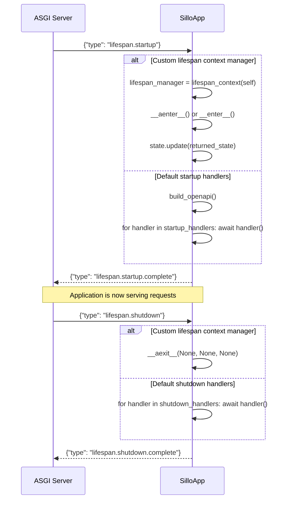
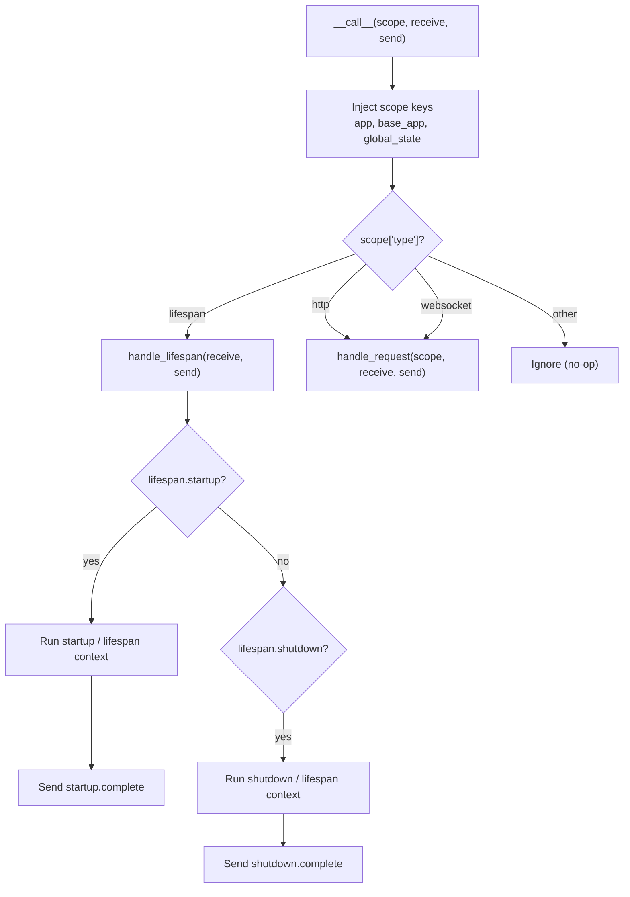
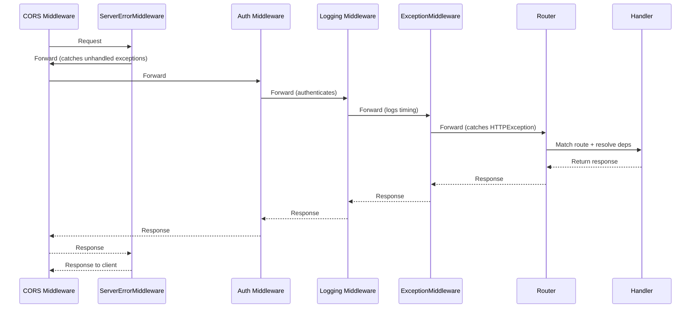

## 1. SilloApp Constructor

`SilloApp.__init__` accepts 24+ keyword arguments. Every argument is optional
except those with framework-determined defaults.

### Full Parameter Table

| Parameter | Type | Default | Purpose |
|-----------|------|---------|---------|
| `debug` | `bool` | `True` | Enable debug mode (detailed error pages) |
| `title` | `str \| None` | `None` → `"sillo API"` | OpenAPI document title |
| `version` | `str \| None` | `None` → `"1.0.0"` | OpenAPI document version |
| `description` | `str \| None` | `None` → `"sillo Asgi framework"` | OpenAPI description |
| `contact` | `Contact \| None` | `None` | OpenAPI contact info |
| `license` | `License \| None` | `None` | OpenAPI license info |
| `servers` | `list[Server] \| None` | `None` | OpenAPI server entries |
| `terms_of_service` | `str \| None` | `None` | OpenAPI terms URL |
| `swagger_docs` | `str` | `"/docs"` | Swagger UI path (deprecated, use `docs`) |
| `redoc_docs` | `str` | `"/redoc"` | ReDoc UI path (deprecated, use `docs`) |
| `openapi_url` | `str` | `"/openapi.json"` | Raw OpenAPI JSON endpoint |
| `docs` | `Sequence[DocsUI] \| None` | `None` | Documentation viewers to mount |
| `server_error_handler` | `ServerErrHandlerType \| None` | `None` | Custom 500 handler |
| `lifespan` | `lifespan_manager \| None` | `None` | Custom lifespan context manager |
| `routes` | `Sequence[BaseRoute]` | `[]` | Initial route list |
| `dependencies` | `list[Depend] \| None` | `None` | Global DI dependencies |
| `route_class` | `type[Route]` | `Route` | Custom route class |
| `strict_validation` | `bool` | `False` | Validate pre-Pydantic params |
| `auth` | `Sequence[AuthenticationBackend] \| None` | `None` | Authentication backends |
| `auth_user_model` | `type[BaseUser] \| None` | `None` | User model for auth middleware |
| `strict_security` | `bool` | `False` | Refuse to build unresolved security |

### Constructor Signature (Simplified)

```python
class SilloApp:
    def __init__(
        self,
        debug: bool = True,
        title: str | None = None,
        version: str | None = None,
        description: str | None = None,
        contact: Contact | None = None,
        license: License | None = None,
        servers: list[Server] | None = None,
        terms_of_service: str | None = None,
        swagger_docs: str = "/docs",
        redoc_docs: str = "/redoc",
        openapi_url: str = "/openapi.json",
        docs: Sequence[DocsUI] | None = None,
        server_error_handler: ServerErrHandlerType | None = None,
        lifespan: lifespan_manager | None = None,
        routes: Sequence[BaseRoute] = [],
        dependencies: list[Depend] | None = None,
        route_class: type[Route] = Route,
        strict_validation: bool = False,
        auth: Sequence[AuthenticationBackend] | None = None,
        auth_user_model: type[BaseUser] | None = None,
        strict_security: bool = False,
    ) -> None:
```

### Instance Attributes Set in `__init__`

```python
# From application.py lines 342-415
self.debug = debug
self.dependencies = dependencies or []
self.custom_encoders: dict[type, Callable[[Any], Any]] = {}
self.http_middleware: list[Middleware] = []
self.startup_handlers: list[Callable[[], Awaitable[None]]] = []
self.shutdown_handlers: list[Callable[[], Awaitable[None]]] = []
self.server_error_handler = server_error_handler
self.route_class = route_class
self.strict_validation = strict_validation
self._openapi_documents: dict[str, str] = {}  # Cached per mount prefix
self.app = Router(routes=routes, dependencies=..., route_class=..., strict_validation=...)
self.exceptions_handler = ExceptionMiddleware()
self.router = self.app
self.route = self.router.route
self.lifespan_context: lifespan_manager | None = lifespan
self.state: dict[str, Any] = {}
self.commands: list[type[Command]] = []
self.auth_user_model = auth_user_model
self.openapi_config = OpenAPIConfig(...)
self.strict_security = strict_security
self.auth_backends: list[AuthenticationBackend] = list(auth or [])
self.openapi = APIDocumentation(config=..., swagger_url=..., redoc_url=..., openapi_url=...)
self.docs: list[DocsUI] = self._resolve_docs(docs, ...)
self.events = EventEmitter()
self.title = title or "sillo API"
```

---

## 2. Initialization Sequence

The constructor executes the following steps in exact order:

```mermaid
flowchart TD
    A["1. Set basic attributes<br/>debug, dependencies, custom_encoders"] --> B
    B["2. Initialize middleware lists<br/>http_middleware, startup_handlers, shutdown_handlers"] --> C
    C["3. Set route configuration<br/>route_class, strict_validation"] --> D
    D["4. Create root Router<br/>Router(routes, dependencies, route_class, strict_validation)"] --> E
    E["5. Create ExceptionMiddleware<br/>Empty, populated later via add_exception_handler"] --> F
    F["6. Set convenience aliases<br/>router = app, route = router.route"] --> G
    G["7. Store lifespan context<br/>lifespan_context = lifespan"] --> H
    H["8. Initialize state dict<br/>state = {}"] --> I
    I["9. Create OpenAPIConfig<br/>title, version, description, contact, license, servers"] --> J
    J["10. Configure auth backends<br/>Register security schemes, mount AuthenticationMiddleware"] --> K
    K["11. Create APIDocumentation<br/>config, swagger_url, redoc_url, openapi_url"] --> L
    L["12. Resolve documentation UIs<br/>_resolve_docs(docs, swagger_docs, redoc_docs)"] --> M
    M["13. Create EventEmitter<br/>events = EventEmitter()"] --> N
    N["14. Call self.setup()<br/>Mount OpenAPI JSON endpoint and docs UIs"] --> O
    O["15. Initialization complete<br/>Ready for route registration"]
```



### Critical Ordering Dependencies

1. **Router must exist before `setup()`** — `setup()` registers routes on
   `self.router` for the OpenAPI JSON endpoint and docs UIs.

2. **ExceptionMiddleware must exist before route registration** — Exception
   handlers are registered on `self.exceptions_handler`.

3. **OpenAPIConfig must exist before `_register_auth()`** — Auth backend
   registration publishes security schemes to the config.

4. **`setup()` is called last** — It mounts documentation routes that depend
   on all prior initialization.

---

## 3. State Management

Sillo has three levels of state:

### 3.1 Application State (`app.state`)

```python
self.state: dict[str, Any] = {}
```

A plain dictionary shared across all requests. Injected into every ASGI scope
as `scope["global_state"]`. Used for:

- Database connection pools
- Cache clients
- Configuration values
- Shared resources

### 3.2 Request State (`request.state`)

```python
# Created per-request by the Request class
@property
def state(self) -> State:
    if "state" not in self.scope:
        self.scope["state"] = State()
    return self.scope["state"]
```

A `State` object (attribute-style dict) scoped to a single request. Used for:

- Per-request user context
- Middleware-to-handler communication
- Request-scoped caching

### 3.3 Lifespan State

When using a custom lifespan context manager, the returned state is merged
into `app.state`:

```python
# In handle_lifespan():
if self.lifespan_context:
    self.lifespan_manager = self.lifespan_context(self)
    returned_state = await self.lifespan_manager.__aenter__()
    if returned_state:
        self.state.update(returned_state)
```

---

## 4. Lifecycle Hooks

### 4.1 on_startup

```python
def on_startup(self, handler: Callable[[], Awaitable[None]]) -> Callable[[], Awaitable[None]]:
    self.startup_handlers.append(handler)
    return handler  # Enables use as decorator
```

**Usage:**

```python
@app.on_startup
async def connect_to_db():
    global db
    db = await Database.connect("postgres://...")

@app.on_startup
async def cache_warmup():
    global cache
    cache = await load_initial_cache()
```

Handlers execute in registration order during `_startup()`.

### 4.2 on_shutdown

```python
def on_shutdown(self, handler: Callable[[], Awaitable[None]]) -> Callable[[], Awaitable[None]]:
    self.shutdown_handlers.append(handler)
    return handler
```

**Usage:**

```python
@app.on_shutdown
async def disconnect_db():
    await db.disconnect()

@app.on_shutdown
async def clear_cache():
    await cache.clear()
```

Handlers execute in registration order during `_shutdown()`.

### 4.3 Execution Details

Both `_startup()` and `_shutdown()` support async and sync callables:

```python
async def _startup(self) -> None:
    # Build OpenAPI document first (all routes are registered by now)
    self.build_openapi()

    for handler in self.startup_handlers:
        if is_async_callable(handler):
            await handler()
        else:
            handler()

async def _shutdown(self) -> None:
    for handler in self.shutdown_handlers:
        if is_async_callable(handler):
            await handler()
        else:
            handler()
```

**Key detail**: `build_openapi()` is called **before** user startup handlers.
This means the OpenAPI document is available to startup handlers that may
need it (e.g., writing it to disk, serving it via a different mechanism).

---

## 5. ASGI Lifespan Protocol

The ASGI lifespan protocol defines two events:

```
Server → App:  {"type": "lifespan.startup"}
App → Server:  {"type": "lifespan.startup.complete"}
               — or —
App → Server:  {"type": "lifespan.startup.failed", "message": "..."}

Server → App:  {"type": "lifespan.shutdown"}
App → Server:  {"type": "lifespan.shutdown.complete"}
               — or —
App → Server:  {"type": "lifespan.shutdown.failed", "message": "..."}
```

### handle_lifespan Implementation

```python
async def handle_lifespan(self, receive: Receive, send: Send) -> None:
    while True:
        message = await receive()

        if message["type"] == "lifespan.startup":
            try:
                if self.lifespan_context:
                    # Custom lifespan context manager
                    self.lifespan_manager = self.lifespan_context(self)
                    if self._is_async_context_manager(self.lifespan_manager):
                        returned_state = await self.lifespan_manager.__aenter__()
                    else:
                        returned_state = self.lifespan_manager.__enter__()
                    if returned_state:
                        self.state.update(returned_state)
                else:
                    # Default: run startup handlers
                    await self._startup()
                await send({"type": "lifespan.startup.complete"})
            except Exception as e:
                await send({"type": "lifespan.startup.failed", "message": str(e)})
                return

        elif message["type"] == "lifespan.shutdown":
            try:
                if self.lifespan_context:
                    if self._is_async_context_manager(self.lifespan_manager):
                        await self.lifespan_manager.__aexit__(None, None, None)
                    else:
                        self.lifespan_manager.__exit__(None, None, None)
                else:
                    await self._shutdown()
                await send({"type": "lifespan.shutdown.complete"})
                return
            except Exception as e:
                await send({"type": "lifespan.shutdown.failed", "message": str(e)})
                return
```

### Lifespan Flow Diagram



---

## 6. Custom Lifespan Context Manager

The `lifespan` parameter accepts a callable that takes the `SilloApp` instance
and returns an async or sync context manager:

```python
from contextlib import asynccontextmanager

@asynccontextmanager
async def lifespan(app: SilloApp):
    # Startup
    app.state["db"] = await Database.connect()
    yield {"db": app.state["db"]}  # Returned state merged into app.state
    # Shutdown
    await app.state["db"].close()

app = SilloApp(lifespan=lifespan)
```

### State Merging

The value yielded (or returned) from `__aenter__` is merged into `app.state`:

```python
returned_state = await self.lifespan_manager.__aenter__()
if returned_state:
    self.state.update(returned_state)
```

This means lifespan state is available to all handlers via `request.scope["global_state"]`.

### Sync Context Manager Support

Sillo detects async vs sync context managers at runtime:

```python
@staticmethod
def _is_async_context_manager(obj: Any) -> bool:
    return hasattr(obj, "__aenter__") and hasattr(obj, "__aexit__")
```

Both async and sync context managers are supported. The sync path calls
`__enter__` / `__exit__` directly.

### Lifenpan Type Alias

```python
lifespan_manager = Callable[
    ["SilloApp"], AsyncContextManager[Any] | ContextManager[Any]
]
```

---

## 7. `__call__` Entry Point

The `__call__` method is the ASGI entry point invoked by the server for every
connection.

```python
async def __call__(self, scope: Scope, receive: Receive, send: Send) -> None:
    # Inject application references into scope
    scope["app"] = self
    scope["base_app"] = self
    scope["global_state"] = self.state

    if scope["type"] == "lifespan":
        await self.handle_lifespan(receive, send)
    elif scope["type"] in ["http", "websocket"]:
        await self.handle_request(scope, receive, send)
```

### Scope Injection

Every request gets three keys injected:

| Key | Value | Purpose |
|-----|-------|---------|
| `scope["app"]` | `self` | Current SilloApp instance |
| `scope["base_app"]` | `self` | Root application (preserved across mounts) |
| `scope["global_state"]` | `self.state` | Shared application state dict |

### Type Dispatch

```
scope["type"] == "lifespan"    → handle_lifespan(receive, send)
scope["type"] == "http"        → handle_request(scope, receive, send)
scope["type"] == "websocket"   → handle_request(scope, receive, send)
```

Unknown scope types are silently ignored (no else branch).

### Request Flow Diagram



---

## 8. handle_request Middleware Chain

`handle_request` builds the middleware chain and dispatches the request.

### Implementation

```python
def handle_request(self, scope: Scope, receive: Receive, send: Send):
    app = self.app  # Router (innermost)
    middleware = (
        [
            Middleware(
                ASGIRequestResponseBridge,
                dispatch=ServerErrorMiddleware(
                    handler=self.server_error_handler, debug=self.debug
                ),
            )
        ]
        + self.http_middleware                          # User middleware (LIFO order)
        + [Middleware(ASGIRequestResponseBridge, dispatch=self.exceptions_handler)]
    )
    for cls, args, kwargs in reversed(middleware):
        app = cls(app, *args, **kwargs)
    return app(scope, receive, send)
```

### Chain Assembly

The middleware list is assembled as:

```
Position 0: ServerErrorMiddleware (wrapped in ASGIRequestResponseBridge)
Position 1..N: User middleware (in app.use() insertion order)
Position N+1: ExceptionMiddleware (wrapped in ASGIRequestResponseBridge)
```

The `reversed()` iteration builds from innermost to outermost:

```python
# Iteration order (reversed):
# 1. ExceptionMiddleware(Router)           → innermost
# 2. UserMiddleware_N(ExceptionMiddleware)
# 3. UserMiddleware_N-1(UserMiddleware_N)
# ...
# N+1. ServerErrorMiddleware(UserMiddleware_1) → outermost
```

### ASGIRequestResponseBridge

Each middleware is wrapped in `ASGIRequestResponseBridge`, which:

1. **Non-HTTP scopes**: Passes through directly to the inner app
2. **HTTP scopes**: Creates a `_CachedRequest`, a `Responder`, and an
   `anyio.MemoryObjectStream`. Runs the inner app in a background task,
   streaming response chunks through the memory channel. Calls the dispatch
   function with `(request, response, call_next)`.

```python
class ASGIRequestResponseBridge:
    def __init__(self, app: ASGIApp, dispatch: MiddlewareType):
        self.app = app
        self.dispatch_func = dispatch

    async def __call__(self, scope, receive, send):
        if scope["type"] != "http":
            await self.app(scope, receive, send)
            return

        request = _CachedRequest(scope, receive)
        response = Response(request=request)
        # ... set up memory stream, run inner app in background ...
        returned_response = await self.dispatch_func(request, response, call_next)
        await returned_response(scope, wrapped_receive, send)
```

### _CachedRequest

`_CachedRequest` extends `Request` with body caching for dispatch middleware:

```python
class _CachedRequest(Request):
    def __init__(self, scope, receive):
        super().__init__(scope, receive)
        self._wrapped_rcv_disconnected = False
        self._wrapped_rcv_consumed = False
        self._wrapped_rc_stream = self.stream()

    async def wrapped_receive(self) -> Message:
        # State 1: Already disconnected
        if self._wrapped_rcv_disconnected:
            return {"type": "http.disconnect"}

        # State 2: Consumed but not disconnected
        if self._wrapped_rcv_consumed:
            if self._is_disconnected:
                self._wrapped_rcv_disconnected = True
                return {"type": "http.disconnect"}
            msg = await self.receive()
            # ... validate disconnect ...
            return msg

        # State 3: Not yet consumed
        if getattr(self, "_body", None) is not None:
            # body() was called — return cached body
            self._wrapped_rcv_consumed = True
            return {"type": "http.request", "body": self._body, "more_body": False}
        elif self._stream_consumed:
            # stream() was consumed — return empty body
            self._wrapped_rcv_consumed = True
            return {"type": "http.request", "body": b"", "more_body": False}
        else:
            # Forward next chunk
            chunk = await stream.__anext__()
            return {"type": "http.request", "body": chunk, "more_body": ...}
```

### call_next Closure

The `call_next` function inside `ASGIRequestResponseBridge.__call__`:

```python
async def call_next(*_):
    # Run inner app in background task
    async def coro():
        with send_stream:
            try:
                await self.app(scope, receive_or_disconnect, send_no_error)
            except Exception as exc:
                app_exc = exc

    task_group.start_soon(coro)

    # Read response start message from memory stream
    message = await recv_stream.receive()
    assert message["type"] == "http.response.start"

    # Create streaming response that reads body from memory stream
    async def body_stream():
        async for message in recv_stream:
            body = message.get("body", b"")
            if body:
                yield body
            if not message.get("more_body", False):
                break
        if app_exc is not None:
            raise app_exc

    response_object = _StreamingResponse(content=body_stream(), status_code=message["status"])
    response_object.raw_headers = message["headers"]
    response._response = response_object
    return response_object
```

---

## 9. Route Registration Verbs

SilloApp provides convenience methods for all standard HTTP methods. Each
delegates to `self.route()` with the appropriate `methods` parameter.

### Available Verbs

| Method | Source Line | Methods List |
|--------|------------|--------------|
| `app.get()` | `application.py:1241` | `["GET"]` |
| `app.post()` | `application.py:1428` | `["POST"]` |
| `app.delete()` | `application.py:1614` | `["DELETE"]` |
| `app.put()` | `application.py:1785` | `["PUT"]` |
| `app.patch()` | `application.py:1974` | `["PATCH"]` |
| `app.options()` | `application.py:2162` | `["OPTIONS"]` |
| `app.head()` | `application.py:2331` | `["HEAD"]` |
| `app.add_route()` | `application.py:2500` | Custom methods list |
| `app.ws_route()` | `application.py:2803` | WebSocket |
| `app.add_ws_route()` | `application.py:968` | WebSocket |

### Decorator Pattern

All verb methods support both decorator and direct call patterns:

```python
# Decorator pattern
@app.get("/users/{user_id}")
async def get_user(request, response):
    return response.json({"id": request.path_params["user_id"]})

# Direct call pattern
app.get("/users/{user_id}", handler=get_user)
```

### Route Parameters

Each verb method accepts these parameters (in addition to `path` and `handler`):

```python
name: str | None                          # Route name for url_for()
summary: str | None                       # OpenAPI summary
description: str | None                   # OpenAPI description
responses: ArgsType | None                # Response models by status code
request_model: ArgsType | None            # Request body model
request_content_type: str                 # "application/json" | "multipart/form-data" | ...
middleware: list[Any]                     # Route-specific middleware
tags: list[str] | None                    # OpenAPI tags
security: list[dict[str, list[str]]] | None  # Security requirements
operation_id: str | None                  # OpenAPI operation ID
deprecated: bool                          # Mark as deprecated
parameters: list[Parameter]               # Additional OpenAPI parameters
exclude_from_schema: bool                 # Hide from OpenAPI docs
auth: Any | None                          # Route-level auth gate
**kwargs: Any                             # Additional metadata
```

### Route Registration Flow

```python
# app.get("/users") delegates to:
return self.route(
    path="/users",
    handler=handler,
    methods=["GET"],
    name=name,
    summary=summary,
    # ... all other params ...
)

# self.route() delegates to self.router.route():
self.route = self.router.route
```

The `Router.route()` method:

1. Creates a `Route` instance with all parameters
2. Calls `get_dependant(handler)` to build the DI tree
3. Registers the route in the router's internal list
4. Returns a decorator (if handler is None) or the handler directly

### Programmatic Route Registration

```python
# Via add_route()
app.add_route(
    path="/users/{user_id}",
    methods=["GET", "PUT"],
    handler=handle_user,
    name="user-detail",
)

# Via mount_router()
user_router = Router(prefix="/users")

@user_router.route("/list", methods=["GET"])
def get_users(request, response):
    return response.json({"users": ["Alice", "Bob"]})

app.mount_router(user_router, name="users")
```

---

## 10. Middleware Application

### app.use()

```python
def use(self, middleware: MiddlewareType) -> None:
    if self.auth_user_model is None:
        self.auth_user_model = getattr(middleware, "user_model", None)

    self.http_middleware.insert(
        0,
        Middleware(ASGIRequestResponseBridge, dispatch=middleware),
    )
```

**Insertion at position 0** means middleware added later wraps middleware added
earlier. This is the **inside-out** pattern:

```python
app.use(A)  # http_middleware = [A]
app.use(B)  # http_middleware = [B, A]
app.use(C)  # http_middleware = [C, B, A]

# Chain: ServerErrorMiddleware → C → B → A → ExceptionMiddleware → Router
```

### wrap_asgi()

For raw ASGI middleware that doesn't follow the dispatch pattern:

```python
def wrap_asgi(self, middleware_cls, **kwargs):
    self.app = middleware_cls(self.app, **kwargs)
```

This wraps the entire application (including all routes) at the ASGI level.
The middleware receives raw `(scope, receive, send)` tuples.

### Middleware Type Signature

```python
MiddlewareType = Callable[
    [Request, Response, RequestResponseEndpoint],
    Awaitable[Response | StreamingResponse],
]

# Where:
RequestResponseEndpoint = Callable[[], Awaitable[Response | StreamingResponse]]
```

A dispatch middleware receives:
- `request`: The incoming `Request` object
- `response`: A `Responder` (Response) object for building responses
- `call_next`: An async callable that continues the chain

### Example Middleware

```python
async def logging_middleware(request, response, call_next):
    start = time.time()
    result = await call_next()
    duration = time.time() - start
    print(f"{request.method} {request.url.path} took {duration:.3f}s")
    return result

app.use(logging_middleware)
```

### Authentication Middleware Integration

When `SilloApp(auth=[...])` is used, the constructor automatically:

1. Iterates over auth backends
2. Calls `backend.describe()` to get OpenAPI security scheme
3. Registers the scheme in `openapi_config`
4. Mounts `AuthenticationMiddleware` via `self.use()`

```python
def _register_auth(self, user_model):
    for backend in self.auth_backends:
        scheme = backend.describe()
        if scheme is not None:
            self.openapi_config.add_security_scheme(backend.name, scheme)

    middleware = AuthenticationMiddleware(user_model=user_model, backend=self.auth_backends)
    self.use(middleware)  # Added to http_middleware
```

### Middleware Execution Order



---

## Appendix: Complete Startup Sequence

```python
# 1. User creates app
app = SilloApp(title="My API", debug=True)

# 2. Constructor runs (see Section 2)
#    - Creates Router, ExceptionMiddleware, OpenAPI config, EventEmitter
#    - Calls setup() to mount docs routes

# 3. User registers routes
@app.get("/users")
async def list_users(request, response):
    return response.json([])

@app.on_startup
async def connect_db():
    app.state["db"] = await Database.connect()

@app.on_shutdown
async def disconnect_db():
    await app.state["db"].close()

# 4. User adds middleware
app.use(cors_middleware)
app.use(logging_middleware)

# 5. ASGI server starts
#    - Calls app.__call__ with lifespan scope
#    - handle_lifespan() receives "lifespan.startup"
#    - _startup() runs:
#        a. build_openapi() — generates and caches OpenAPI JSON
#        b. connect_db() — runs user startup handler
#    - Sends "lifespan.startup.complete"

# 6. Request handling begins
#    - Server calls app.__call__ for each HTTP request
#    - handle_request() builds middleware chain
#    - Request flows through: SEM → CORS → Auth → Logging → Exception → Router → Handler

# 7. Shutdown
#    - Server sends "lifespan.shutdown"
#    - _shutdown() runs disconnect_db()
#    - Sends "lifespan.shutdown.complete"
```
