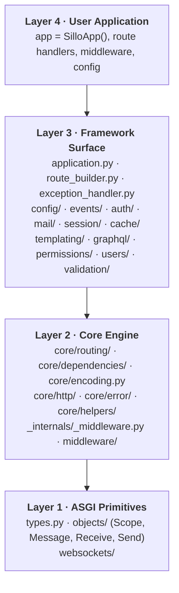
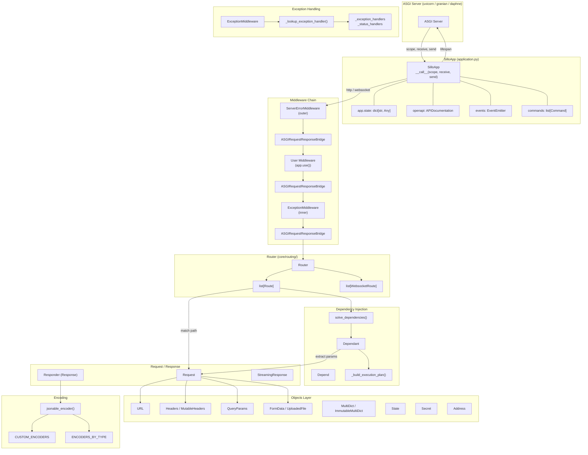
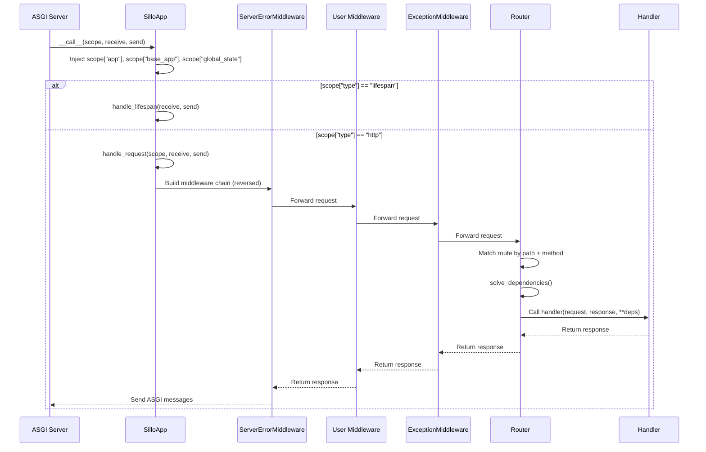
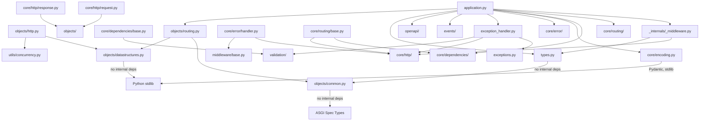
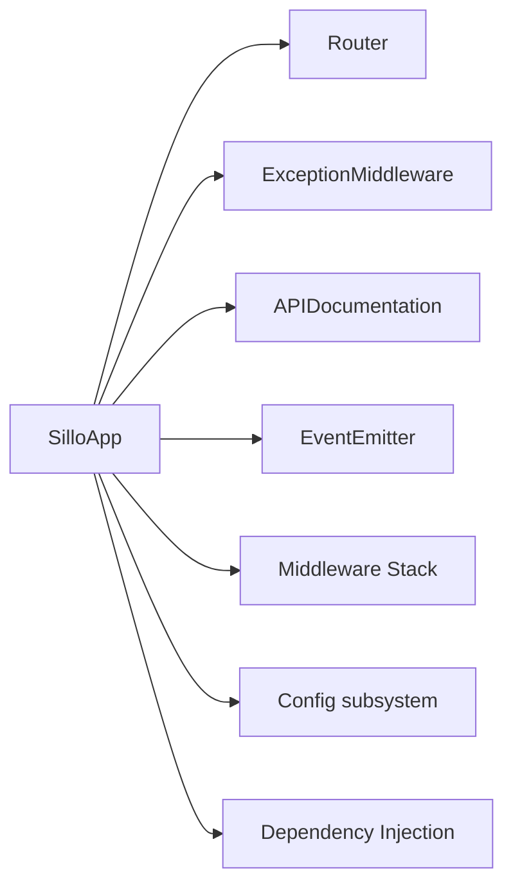
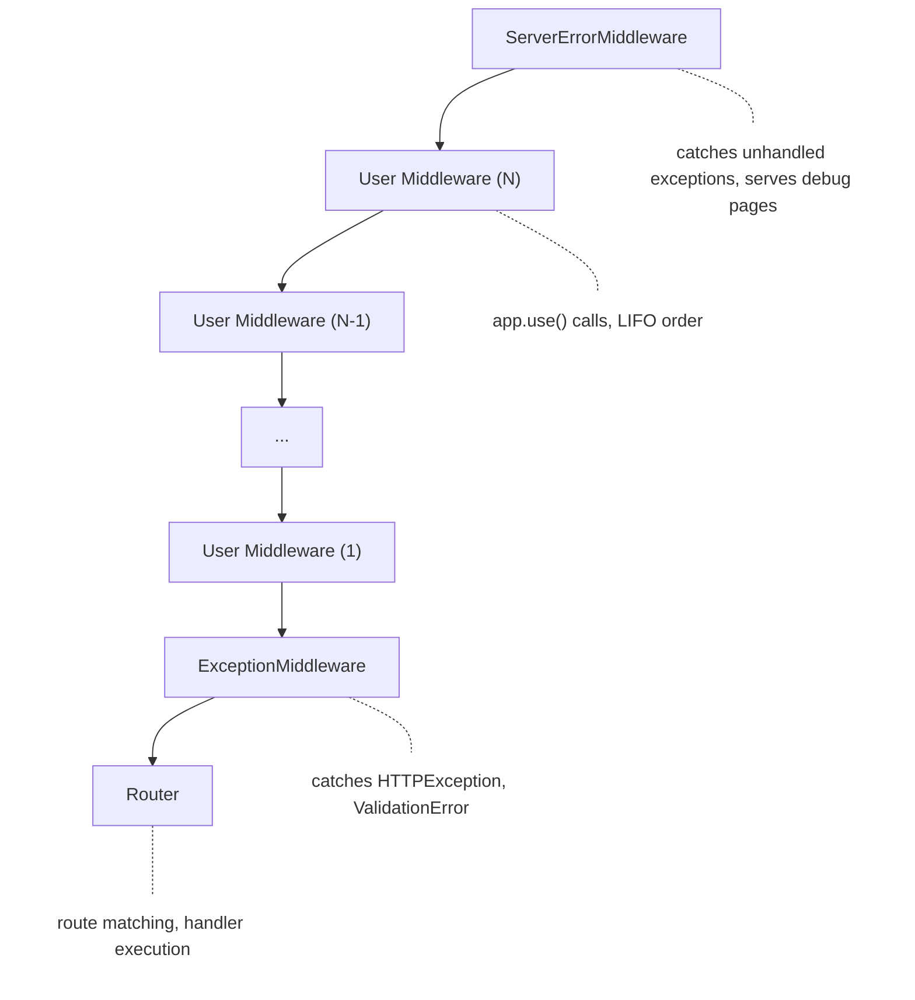

## 1. System Layers and Boundaries

Sillo is a standalone ASGI web framework. It does **not** inherit from any base
application class. `SilloApp` is a plain Python object that implements the ASGI
protocol via `__call__(scope, receive, send)`.

The codebase is organized into four concentric layers:



**Layer 1: ASGI Primitives** defines the type aliases and data structures that
map directly to the ASGI spec: `Scope`, `Message`, `Receive`, `Send`,
`ASGIApp`. All higher layers depend on these types; they depend on nothing
within sillo.

**Layer 2: Core Engine** implements the request/response cycle: routing,
dependency injection, encoding, error handling, and the middleware bridge.
These modules are framework-internal and are not part of the public API
surface.

**Layer 3. Framework Surface** provides the features application developers
interact with: configuration, events, authentication, sessions, mail,
templates, GraphQL, permissions, and validation. These modules depend on the
core engine.

**Layer 4. User Application** is the `SilloApp` instance and everything the
developer writes. It composes layers 2 and 3.

### Key Source Files

| File | Layer | Purpose |
|------|-------|---------|
| `types.py` | 1 | Core type aliases (`Scope`, `Message`, `Receive`, `Send`, `ASGIApp`, `MiddlewareType`, `HandlerType`) |
| `objects/common.py` | 1 | `Address`, `Secret`, `State` |
| `objects/datastructures.py` | 1 | `ImmutableMultiDict`, `MultiDict` |
| `objects/http.py` | 1 | `QueryParams`, `Headers`, `MutableHeaders`, `UploadedFile`, `FormData` |
| `objects/routing.py` | 1 | `URL`, `URLPath`, `RouteParam` |
| `core/routing/` | 2 | `Router`, `Route`, `WebsocketRoute`, path matching |
| `core/dependencies/base.py` | 2 | `Depend`, `Dependant`, `solve_dependencies`, `_build_execution_plan` |
| `core/encoding.py` | 2 | `jsonable_encoder`, `CUSTOM_ENCODERS`, `ENCODERS_BY_TYPE` |
| `core/error/handler.py` | 2 | `ServerErrorMiddleware`, debug HTML error page |
| `core/http/` | 2 | `Request`, `Response` (Responder), `StreamingResponse` |
| `_internals/_middleware.py` | 2 | `ASGIRequestResponseBridge`, `DefineMiddleware`, `_CachedRequest` |
| `application.py` | 3 | `SilloApp`: the application entry point |
| `exception_handler.py` | 3 | `ExceptionMiddleware`, built-in exception handlers |
| `config/core.py` | 3 | `Config` base class (Pydantic + `.env` loading) |
| `events/` | 3 | `EventEmitter`, transports, event protocol |
| `encoding.py` | 3 | Re-export facade for `core.encoding` |

---

## 2. Component Relationship Diagram



### Request Flow (Simplified)



---

## 3. Dependency Graph

### Module-Level Dependencies



### The 7 Core Dependencies of `SilloApp`

Every `SilloApp` instance depends on exactly seven subsystems at construction time:

1. **Router** (`core/routing/`): route registration, path matching, request
   dispatch
2. **ExceptionMiddleware** (`exception_handler.py`): exception-to-response
   mapping
3. **OpenAPI / APIDocumentation** (`openapi/`): schema generation, docs UI
   mounting
4. **EventEmitter** (`events/`): application-level event broadcasting
5. **Middleware Stack** (`_internals/_middleware.py`):
   `ASGIRequestResponseBridge` wrapping
6. **Config** (`config/`): configuration management (used by subsystems, not
   directly by SilloApp)
7. **Dependencies** (`core/dependencies/`): `Depend` / `Dependant` /
   `solve_dependencies`



---

## 4. Architectural Patterns

### 4.1 Middleware Chain

Sillo uses a **dispatch-style middleware** pattern, not raw ASGI middleware.
User middleware follows the signature:

```python
async def my_middleware(
    request: Request,
    response: Response,
    call_next: Callable[..., Awaitable[Response]],
) -> Response:
    # Pre-processing
    result = await call_next()
    # Post-processing
    return result
```

The `ASGIRequestResponseBridge` (`_internals/_middleware.py`) converts this
dispatch-style middleware into proper ASGI middleware. It:

1. Creates a `_CachedRequest` from the ASGI scope
2. Creates a `Responder` (Response) object
3. Sets up an `anyio.MemoryObjectStream` for response body streaming
4. Runs the inner app in a background task, streaming response chunks through the memory channel
5. Calls the dispatch function with `(request, response, call_next)`

**Middleware ordering** (outermost first, as seen by the request):



**`app.use()` insertion order**: Each `app.use(middleware)` call does:

```python
self.http_middleware.insert(0, Middleware(ASGIRequestResponseBridge, dispatch=middleware))
```

This means middleware added later wraps middleware added earlier,
**inside-out** application. The first middleware added is closest to the
router; the last middleware added is outermost (closest to
`ServerErrorMiddleware`).

**Chain assembly** in `handle_request()`:

```python
app = self.app  # Router
middleware = (
    [ServerErrorMiddleware(app, handler=..., debug=...)]
    + self.http_middleware                                    # user middleware
    + [Middleware(ASGIRequestResponseBridge, dispatch=self.exceptions_handler)]
)
for cls, args, kwargs in reversed(middleware):
    app = cls(app, *args, **kwargs)
return app(scope, receive, send)
```

The `reversed()` iteration builds the chain from innermost to outermost, so the
first element in the list (ServerErrorMiddleware) becomes the outermost wrapper.

### 4.2 Dependency Injection Resolution

Sillo's DI system is **tree-based** and **iteratively resolved**:

**Registration phase** (at route registration time):

```python
def get_dependant(call, name=None, *, strict_validation=False) -> Dependant:
    sig = signature(call)
    deps = []
    markers = []

    for param_name, param in sig.parameters.items():
        default = param.default
        if isinstance(default, Depend):
            # Recursively build sub-dependency tree
            sub = get_dependant(default.dependency, param_name, ...)
            deps.append(sub)
        elif isinstance(default, ParameterExtractor):
            markers.append((param_name, default))

    # Build flat execution plan
    dependant = Dependant(call=call, dependencies=deps, ...)
    dependant._execution_plan = _build_execution_plan(dependant)
    return dependant
```

**Resolution phase** (at request time):

```python
async def solve_dependencies(dependant, request, ...) -> dict[str, Any]:
    values = {}
    validated = await resolve_validated_params(dependant, request)

    for step in dependant._execution_plan:  # flat iteration, no recursion
        sub = step.dependant
        if sub.use_cache and sub.cache_key and sub.cache_key in cache:
            values[sub.name] = cache[sub.cache_key]
            continue

        kwargs = _collect_kwargs(sub, values, request, validated)

        if step.is_root:
            return kwargs  # Return handler kwargs, don't execute

        result = await _execute_dependency(sub, kwargs, cleanups)
        values[sub.name] = result

    return {}
```

**Execution plan** is a depth-first post-order traversal:

```
Dependency Tree:          Execution Plan:
    A                      1. C (child)
   / \                     2. D (child)
  B   C                    3. B (parent of C, D)
 / \                       4. A (root — collect kwargs only)
D   E                      5. E (child of A)
```

**Supported callable types**:
- `async def` → `await func(**kwargs)`
- `def` → `func(**kwargs)`
- `async def gen()` → `await agen.__anext__()` + register `aclose()` cleanup
- `def gen()` → `next(gen)` + register `close()` cleanup

### 4.3 Scope System

The ASGI `scope` dictionary is the primary communication channel between
subsystems during request processing. Sillo injects three keys at the
`__call__` entry point:

```python
async def __call__(self, scope, receive, send):
    scope["app"] = self          # The SilloApp instance
    scope["base_app"] = self     # Same reference, for mounted sub-apps
    scope["global_state"] = self.state  # app-level shared state dict
```

Downstream middleware and handlers access these via `request.scope`:

```python
request.scope["app"]           # SilloApp instance
request.scope["base_app"]      # Root SilloApp (preserved across mounts)
request.scope["global_state"]  # app.state dict
request.scope["root_path"]     # ASGI mount prefix
request.scope["path"]          # Request path
request.scope["method"]        # HTTP method
request.scope["headers"]       # Raw header byte tuples
request.scope["query_string"]  # Raw query bytes
request.scope["path_params"]   # Route parameters (injected by Router)
```

### 4.4 Transport Abstraction

Sillo is transport-agnostic at the ASGI level. The `SilloApp.__call__` method
handles three scope types:

- `"lifespan"` → `handle_lifespan(receive, send)`: startup/shutdown lifecycle
- `"http"` → `handle_request(scope, receive, send)`: HTTP request processing
- `"websocket"` → `handle_request(scope, receive, send)`: WebSocket upgrade

The transport layer is fully abstracted by the ASGI protocol. Sillo works with
any ASGI server: uvicorn, granian, daphne, hypercorn, etc.

```python
# The entire transport interface:
Scope   = MutableMapping[str, Any]
Message = MutableMapping[str, Any]
Receive = Callable[[], Awaitable[Message]]
Send    = Callable[[Message], Awaitable[None]]
ASGIApp = Callable[[Scope, Receive, Send], Awaitable[Any]]
```

---

## 5. Inter-Subsystem Communication

### 5.1 Scope Dictionary

The ASGI scope dict is the primary per-request communication bus. It flows
through every middleware layer and is accessible from any handler via
`request.scope`.

**Keys injected by SilloApp.__call__:**

| Key | Type | Source | Description |
|-----|------|--------|-------------|
| `"app"` | `SilloApp` | `application.py:1232` | Current application instance |
| `"base_app"` | `SilloApp` | `application.py:1233` | Root application (preserved across mounts) |
| `"global_state"` | `dict` | `application.py:1234` | Reference to `app.state` |

**Keys injected by ASGI server:**

| Key | Type | Description |
|-----|------|-------------|
| `"type"` | `str` | `"lifespan"`, `"http"`, or `"websocket"` |
| `"path"` | `str` | Request path |
| `"method"` | `str` | HTTP method |
| `"headers"` | `list[tuple[bytes, bytes]]` | Raw headers |
| `"query_string"` | `bytes` | Raw query string |
| `"root_path"` | `str` | ASGI mount prefix |
| `"server"` | `tuple[str, int]` | Server host and port |
| `"scheme"` | `str` | `"http"` or `"https"` |

**Keys injected by Router:**

| Key | Type | Description |
|-----|------|-------------|
| `"path_params"` | `dict[str, str]` | Extracted route parameters |

### 5.2 app.state

`app.state` is a plain `dict[str, Any]` shared across all requests. It is
injected into every scope as `scope["global_state"]`. Handlers access it via:

```python
request.scope["global_state"]["db_pool"]
# or through the State object wrapper:
request.state  # State object wrapping per-request state
```

The `State` class (`objects/common.py`) provides attribute-style access:

```python
class State:
    def __setattr__(self, key, value):
        self._state[key] = value

    def __getattr__(self, key):
        try:
            return self._state[key]
        except KeyError:
            return None  # Never raises AttributeError
```

### 5.3 request.scope

`Request` objects wrap the ASGI scope and provide typed accessors:

```python
class Request:
    def __init__(self, scope, receive):
        self.scope = scope
        self._receive = receive

    @property
    def url(self) -> URL: ...
    @property
    def method(self) -> str: ...
    @property
    def headers(self) -> Headers: ...
    @property
    def query_params(self) -> QueryParams: ...
    @property
    def path_params(self) -> RouteParam: ...
    @property
    def state(self) -> State: ...
```

### 5.4 ContextVar

Sillo does **not** use `contextvars.ContextVar` for request-scoped data in its
core. The framework relies on the ASGI scope dictionary as the request-scoped
storage mechanism. This is a deliberate design choice:

- The scope dict is explicitly passed through the call chain
- No implicit global state that could leak between requests
- Sub-applications and mounted routers see the same scope

However, subsystems like authentication may use `ContextVar` internally for
convenience (e.g., caching the current user for the duration of a request).

---

## 6. Trust Boundaries

### 6.1 Request Processing Pipeline


### 6.2 Boundary Definitions

| Boundary | Trust Level | Validation |
|----------|------------|------------|
| Client → ASGI Server | **Untrusted** | Server-level (HTTP parsing, size limits) |
| ASGI Server → SilloApp | **Semi-trusted** | Scope dict structure assumed correct |
| Scope → Request | **Semi-trusted** | Lazy parsing, type coercion |
| Request → Handler | **Untrusted** | Pydantic validation, ParameterExtractor |
| Handler → Response | **Trusted** | jsonable_encoder, response_model validation |
| Response → Client | **Trusted** | ASGI message format |

### 6.3 Validation Points

1. **Parameter extraction** (`core/dependencies/base.py`): `ParameterExtractor`
   subclasses (`Query`, `Header`, `Cookie`, `Body`, `Form`, `File`) extract
   values from specific request locations.

2. **Pydantic validation** (`validation/`): `compile_validator()` builds
   per-location Pydantic models at registration time. At request time,
   `resolve_validated_params()` validates all parameters in one pass.

3. **Request body validation** (`request_model=`): Route-level Pydantic models
   validate the request body before the handler runs.

4. **Response validation** (`response_model=`): The response is validated
   against the declared model before sending to the client.

5. **Exception handling** (`exception_handler.py`): `ExceptionMiddleware` catches
   all exceptions and converts them to appropriate HTTP responses. The
   `_lookup_exception_handler()` function walks the exception's MRO to find
   the most specific handler.

### 6.4 Security Middleware

Security-related middleware is applied via `app.use()`:

- **AuthenticationMiddleware** (`auth/middleware.py`): Validates credentials and
  populates `request.user`. Configured via `SilloApp(auth=[...])`.
- **CORSMiddleware** (`middleware/security.py`): CORS headers.
- **CSRFMiddleware** (configurable): CSRF token validation.
- **RateLimitMiddleware** (configurable): Request rate limiting.

---

## 7. The Coherence Claim

Sillo's architecture is coherent: every subsystem is reachable from every other
subsystem through a small number of well-defined channels, and no subsystem
duplicates the responsibility of another.

### 7.1 Single Source of Truth per Concern

| Concern | Single Owner | Access Path |
|---------|-------------|-------------|
| Route matching | `Router` | `app.router` / `app.app` |
| Dependency injection | `core/dependencies/` | `Depend()` markers in signatures |
| JSON encoding | `core/encoding.py` | `jsonable_encoder()` + `CUSTOM_ENCODERS` |
| Exception handling | `exception_handler.py` | `ExceptionMiddleware` |
| Configuration | `config/core.py` | `Config` base class |
| Event broadcasting | `events/` | `app.events` |
| OpenAPI generation | `openapi/` | `app.openapi` / `app.openapi_config` |
| Middleware bridging | `_internals/_middleware.py` | `ASGIRequestResponseBridge` |
| Request/Response | `core/http/` | `Request`, `Responder` |
| Data structures | `objects/` | All `MultiDict`, `URL`, `Headers` etc. |

### 7.2 No Circular Dependencies

The dependency flow is strictly acyclic:

```
types.py ← objects/ ← core/ ← application.py ← subsystems (auth, mail, etc.)
```

Higher layers import lower layers; lower layers never import higher layers.
The `encoding.py` re-export facade (`sillo.encoding`) exists specifically to
provide a stable public import path without creating a circular dependency
between `application.py` and `core/encoding.py`.

### 7.3 Middleware Chain Integrity

The middleware chain is assembled once per request in `handle_request()`. The
assembly is deterministic:

1. `ServerErrorMiddleware` (outermost: catches everything)
2. User middleware (in `app.use()` insertion order, LIFO)
3. `ExceptionMiddleware` (innermost before router: catches handler exceptions)
4. `Router` (route matching + handler execution)

Each middleware layer wraps the next via `ASGIRequestResponseBridge`, which
converts dispatch-style `(request, response, call_next)` into proper ASGI
`(scope, receive, send)`. Non-HTTP scopes (websocket, lifespan) pass through
directly without bridging.

### 7.4 DI Tree Immutability

The dependency tree is built once at route registration time (`get_dependant()`)
and never modified afterward. The execution plan is flattened into a list of
`ExecutionStep` objects at the same time. This means:

- No tree walking at request time
- No recursive resolution
- Cache keys are pre-computed
- Validator plans are pre-flattened

The only mutable state during resolution is the `values` dict and the
`dependency_cache` dict, both of which are per-request and per-request only.

### 7.5 Encoding Coherence

All JSON encoding flows through a single function: `jsonable_encoder()`. It
consults three registries in priority order:

1. **Custom encoders** (`CUSTOM_ENCODERS` + per-call `custom_encoder` dict)
2. **Built-in type encoders** (`ENCODERS_BY_TYPE`: direct type match)
3. **Isinstance-based encoders** (`encoders_by_class_tuples`: inverted index)

Application-level custom encoders are registered via:
- `app.add_encoder(type_, encoder)` → updates both `app.custom_encoders` and global `CUSTOM_ENCODERS`
- `register_encoder(type_, encoder)` → updates global `CUSTOM_ENCODERS` only

Both paths converge on the same `CUSTOM_ENCODERS` dict, so encoders registered
either way are visible to `jsonable_encoder()`.

---

## Appendix A: File Inventory

### Layer 1: ASGI Primitives

```
core/sillo/types.py                    — 41 lines   — Type aliases
core/sillo/objects/__init__.py         — 38 lines   — Public re-exports
core/sillo/objects/common.py           — 209 lines  — Address, Secret, State
core/sillo/objects/datastructures.py   — 438 lines  — ImmutableMultiDict, MultiDict
core/sillo/objects/http.py             — 1070 lines — QueryParams, Headers, MutableHeaders, UploadedFile, FormData
core/sillo/objects/routing.py          — 780 lines  — URL, URLPath, RouteParam
core/sillo/websockets/                 — WebSocket support
```

### Layer 2: Core Engine

```
core/sillo/core/routing/               — Router, Route, WebsocketRoute, path matching
core/sillo/core/dependencies/base.py   — 589 lines  — DI system
core/sillo/core/encoding.py            — 393 lines  — jsonable_encoder
core/sillo/core/http/                  — Request, Response, StreamingResponse
core/sillo/core/error/handler.py       — 1604 lines — ServerErrorMiddleware, debug pages
core/sillo/_internals/_middleware.py   — 546 lines  — ASGIRequestResponseBridge
core/sillo/middleware/                  — BaseMiddleware, gzip, security utilities
```

### Layer 3: Framework Surface

```
core/sillo/application.py              — 2800+ lines — SilloApp
core/sillo/exception_handler.py        — 407 lines  — ExceptionMiddleware
core/sillo/config/core.py              — 115 lines  — Config base class
core/sillo/events/                     — Event system
core/sillo/auth/                       — Authentication
core/sillo/mail/                       — Email sending
core/sillo/session/                    — Session management
core/sillo/cache/                      — Caching
core/sillo/templating/                 — Template rendering
core/sillo/graphql/                    — GraphQL support
core/sillo/permissions/                — Authorization
core/sillo/users/                      — User model
core/sillo/validation/                 — Parameter validation
core/sillo/openapi/                    — OpenAPI generation
core/sillo/console/                    — CLI commands
core/sillo/security/                   — Security utilities
core/sillo/record/                     — Record/ORM support
core/sillo/work/                       — Background tasks
```

---

## Appendix B: Key Design Decisions

1. **Standalone ASGI app.** `SilloApp` does not inherit from any base class. It
   implements `__call__(scope, receive, send)` directly.

2. **Dispatch-style middleware**: User middleware follows `(request, response,
   call_next) -> Response` rather than raw ASGI `(scope, receive, send)`. The
   `ASGIRequestResponseBridge` handles the conversion.

3. **Tree-based DI**: Dependencies are declared via `Depend()` markers in
   function signatures. The tree is built once at registration and flattened
   into an execution plan for iterative resolution.

4. **Scope dict as communication bus**: All per-request context flows through
   the ASGI scope dictionary. No global state, no ContextVar for core features.

5. **Config per subsystem.** Each subsystem (database, session, mail, etc.)
   owns its own `Config` subclass. The base `Config` class provides `.env`
   loading and secret masking.

6. **Single encoding path**: All JSON serialization flows through
   `jsonable_encoder()`, which consults a prioritized chain of encoder
   registries.

7. **OpenAPI built at startup.** The OpenAPI document is generated once during
   `_startup()` and cached per mount prefix. Serving it writes a stored string.

8. **Event system is pluggable.** The `EventEmitter` supports multiple
   transport backends (in-memory, Redis, database) via a pluggable transport
   registry. Events carry priority, phase, and cancellation semantics.

9. **Console commands are co-registered**: Application commands are registered
   on `SilloApp.commands` and discovered by the `sillo` CLI at import time,
   eliminating the need for a separate command registry file.

---

## Appendix C: Glossary

| Term | Definition |
|------|-----------|
| **ASGI** | Asynchronous Server Gateway Interface: the async successor to WSGI |
| **Scope** | A mutable dict carrying per-connection metadata through the ASGI stack |
| **Dispatch middleware** | Middleware following `(request, response, call_next) -> Response` |
| **ASGI middleware** | Middleware following raw `(scope, receive, send) -> None` |
| **Dependant** | A node in the DI dependency tree, wrapping a callable and its sub-dependencies |
| **Execution plan** | A flat, depth-first, post-order list of `ExecutionStep` objects for iterative DI resolution |
| **ParameterExtractor** | A marker (`Query`, `Header`, `Cookie`, `Body`, `Form`, `File`) that pulls a value from a specific request location |
| **jsonable_encoder** | The single serialization function that converts any Python object to JSON-compatible types |
| **CUSTOM_ENCODERS** | The global dict mapping types to user-defined encoder functions |
| **ENCODERS_BY_TYPE** | The built-in dict mapping 25+ standard Python types to their JSON encoders |
| **Lifespan** | The ASGI protocol phase for application startup/shutdown, before any requests are served |
| **Mount prefix** | A URL path prefix under which a sub-application or the same application is served |
