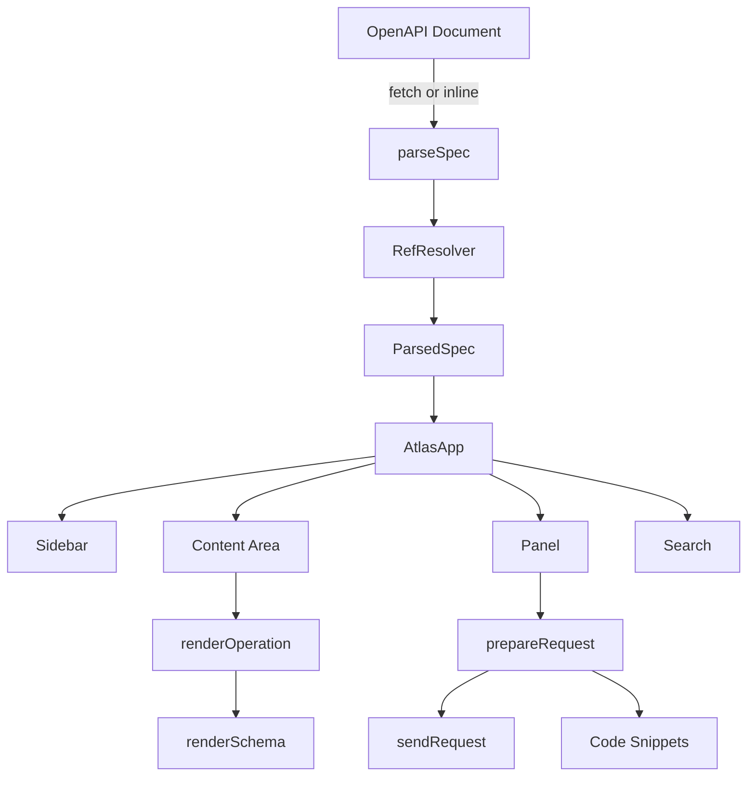
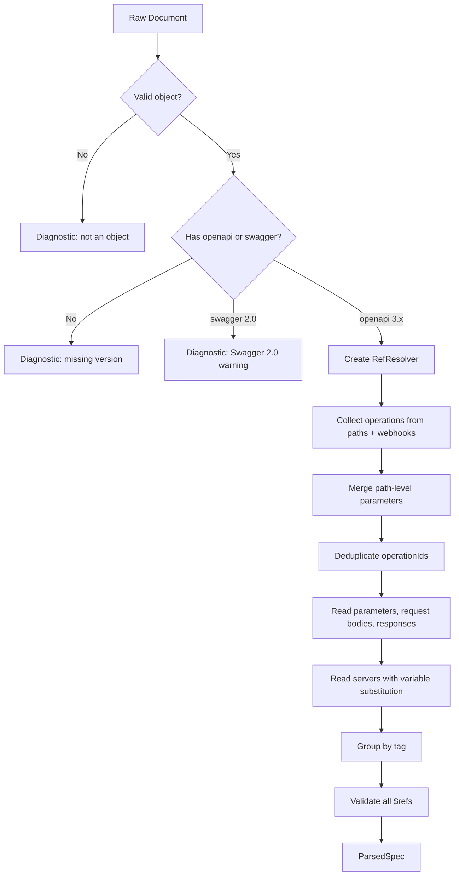
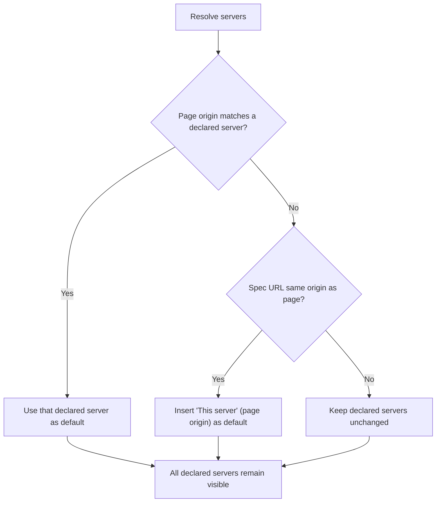
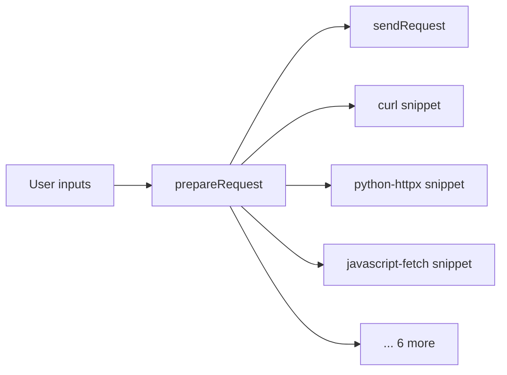
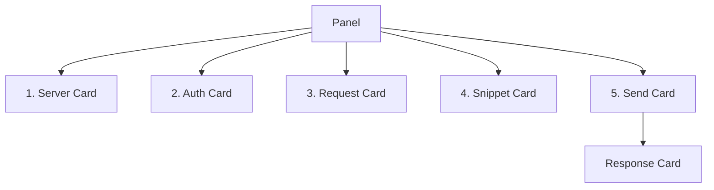
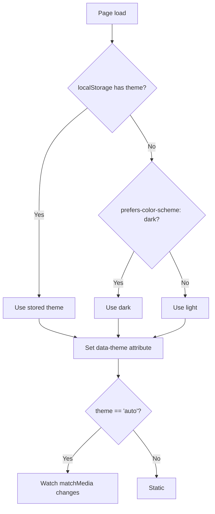

> **Package**: `@sillo/atlas` (npm)
> **Repository**: https://github.com/sillohq/atlas
> **Source root**: `atlas/src/`
> **Bundle size**: ~79 KB standalone (vs. Swagger UI ~1.4 MB)

---

## 1. Overview

Atlas is a **zero runtime dependency** OpenAPI reference and API client.
It renders interactive API documentation from an OpenAPI 3.x or Swagger 2.0
document, with a built-in request builder, code snippet generator, and search.

```
79 KB standalone.  No dependencies.  No innerHTML.  No framework.
```

### Size Comparison

| Tool | Bundle Size |
|---|---|
| **Atlas** | **~79 KB** |
| Swagger UI | ~1.4 MB |
| Scalar | ~1 MB |
| Redoc | ~900 KB |

### Key Properties

1. **Zero runtime dependencies**: Only `esbuild`, `linkedom`, `typescript` as
   devDependencies (not shipped).
2. **XSS-safe**: No `innerHTML` anywhere.  All user content reaches the DOM as
   text nodes via `textContent`.
3. **Self-contained**: Works under strict `Content-Security-Policy` without
   external CDN requests.
4. **Framework-free**: Direct DOM manipulation.  No React, Vue, or Svelte.
5. **Dual-use**: ESM import for bundler integration, IIFE for `<script>` tag.

---

## 2. Architecture

### 2.1 Module Map

```
atlas/src/
├── index.ts              # createApiReference, AtlasConfig, AtlasInstance
├── standalone.ts         # <script> tag entry, autoMount()
├── spec/
│   ├── types.ts          # ParsedSpec, Operation, Parameter, SecurityScheme, Diagnostic
│   ├── parse.ts          # parseSpec — the central transformation
│   ├── resolve.ts        # RefResolver, walkSchema
│   ├── example.ts        # exampleFromSchema, typeLabel
│   └── servers.ts        # resolveServers
├── client/
│   ├── request.ts        # prepareRequest, sendRequest
│   └── snippets.ts       # 9 language snippet generators
├── ui/
│   ├── dom.ts            # el, append, replace, svg, button, tabs, etc.
│   ├── app.ts            # AtlasApp — header, sidebar, content, panel, search
│   ├── highlight.ts      # tokenize, JSON/Python/Go/Ruby/PHP/JS/TS/Shell
│   ├── markdown.ts       # parseMarkdown, parseInline, safeHref
│   ├── render.ts         # markdown, highlighted, codeBlock
│   ├── panel.ts          # createPanel — server/auth/request/snippet/send cards
│   ├── schema.ts         # renderSchema — expandable tree with cycle detection
│   ├── search.ts         # searchOperations, createSearch — scored search dialog
│   ├── info.ts           # renderInfo, renderTagHeading, describeScheme
│   └── operation.ts      # renderOperation
└── styles/
    └── atlas.css         # 1189 lines, light/dark themes, responsive
```

### 2.2 Data Flow



### 2.3 Build Outputs

**Source**: `atlas/scripts/build.mjs`

| Output | Format | Size | Use Case |
|---|---|---|---|
| `dist/atlas.js` | ESM | ~53 KB | Bundler imports |
| `dist/atlas.cjs` | CommonJS | ~53 KB | `require()` |
| `dist/atlas.standalone.js` | IIFE + CSS inline | ~79 KB | `<script>` tag |
| `dist/atlas.css` | CSS | ~15 KB | ESM importers who handle CSS |

The `stylePlugin` esbuild plugin intercepts a virtual `atlas:styles` import
and replaces it with JS that injects CSS as a `<style id="atlas-styles">`
element, guarded by an ID check to prevent double-injection.

---

## 3. createApiReference Entry Point

**Source**: `/Users/admin/sillo.build/atlas/src/index.ts`

```typescript
function createApiReference(
  target: string | HTMLElement,
  config?: AtlasConfig,
): AtlasInstance
```

### AtlasConfig

| Field | Type | Default | Purpose |
|---|---|---|---|
| `url` | `string` | — | URL to fetch the OpenAPI document from |
| `spec` | `object \| string` | — | Inline document object or JSON string |
| `theme` | `'light' \| 'dark' \| 'auto'` | `'auto'` | Color theme |
| `deepLinking` | `boolean` | `true` | Update `location.hash` while reading |
| `fetchHeaders` | `Record<string, string>` | — | Extra headers for fetching a private spec |
| `servers` | `string[]` | — | Override the document's server list |
| `onLoaded` | `(spec: ParsedSpec) => void` | — | Callback when ready |
| `onError` | `(error: Error) => void` | — | Callback when loading/parsing fails |

### AtlasInstance

```typescript
interface AtlasInstance {
  spec?: ParsedSpec
  destroy: () => void
}
```

### Flow

1. Resolve the target (CSS selector or HTMLElement).
2. Show a loading spinner immediately.
3. Asynchronously load the document (fetch or inline).
4. Parse via `parseSpec`.
5. Create `AtlasApp` with the parsed spec.
6. Report errors (YAML detection, fetch failures, CORS hints).

### Standalone Entry

**Source**: `/Users/admin/sillo.build/atlas/src/standalone.ts`

```html
<script src="atlas.standalone.js" data-url="/openapi.json"></script>
```

`autoMount()` reads attributes from the `<script>` tag:

| Attribute | Maps To |
|---|---|
| `data-url` | `config.url` |
| `data-target` | `target` |
| `data-theme` | `config.theme` |
| `data-deep-linking` | `config.deepLinking` |

If no container exists, creates one.  Supports `DOMContentLoaded` deferred
mounting.

---

## 4. Spec Parsing

**Source**: `/Users/admin/sillo.build/atlas/src/spec/parse.ts` (356 lines)

```typescript
function parseSpec(document: OpenAPIDocument): ParsedSpec
```

The central transformation function.  Turns a raw OpenAPI document into flat
structures the UI renders.

### Step-by-step



### Operation Collection

Iterates `document.paths` and `document.webhooks`, iterating all 8 HTTP methods
per path item (`get`, `post`, `put`, `delete`, `patch`, `options`, `head`,
`trace`).

### Parameter Merging

`mergeParameters` uses a `Map` keyed by `in:name`.  Operation-level parameters
win on collision with path-level parameters.

### operationId Deduplication

`uniqueId()` generates URL-safe slugs.  Appends `-2`, `-3` etc. for collisions.

### Response Ordering

Responses are sorted: `2xx` first, then by code, `default` last.

### Server Variable Substitution

Reads `servers[].variables` and substitutes `{variable}` defaults.

### Tag Grouping

- Uses declared tag order from the document.
- Untagged operations go to "Other" group.
- Drops unused declared tags.

### ParsedSpec

```typescript
interface ParsedSpec {
  title: string
  version: string
  description: string
  info: Record<string, unknown>
  servers: ResolvedServer[]
  groups: TagGroup[]
  operations: Operation[]
  securitySchemes: SecurityScheme[]
  schemas: Record<string, unknown>
  document: OpenAPIDocument
  diagnostics: Diagnostic[]
}
```

---

## 5. RefResolver

**Source**: `/Users/admin/sillo.build/atlas/src/spec/resolve.ts` (225 lines)

Handles lazy, cycle-safe `$ref` resolution within a single document.

### Constructor

```typescript
class RefResolver {
  constructor(document: OpenAPIDocument)
}
```

### Methods

| Method | Signature | Purpose |
|---|---|---|
| `lookup` | `(ref: string) => unknown` | Follow a JSON pointer (RFC 6901) |
| `deref` | `<T>(node: unknown) => T \| undefined` | Follow `$ref` if present, merge sibling keys |
| `nameOf` | `(node: unknown) => string \| undefined` | Extract display name from `$ref` |
| `resolvedNameOf` | `(node: unknown) => string \| undefined` | Like `nameOf`, returns `undefined` for dangling refs |
| `validate` | `(root: unknown) => BrokenRef[]` | Walk tree cycle-safe, find broken `$ref`s |

### RFC 6901 Escaping

`lookup` correctly handles escaped characters in JSON pointers:
- `~1` = `/`
- `~0` = `~`
- Decoded in the right order (first `~1`, then `~0`).

### Sibling Key Merging

`deref` merges sibling keys over the target (OpenAPI 3.1 pattern):

```json
{"$ref": "#/components/schemas/Widget", "description": "Override"}
```

The `description` from the referencing node overrides the shared schema's
description.

### BrokenRef

```typescript
interface BrokenRef {
  ref: string
  reason: 'not-found' | 'external' | 'malformed'
}
```

### validate()

Walks an entire schema tree, cycle-safe, finding every unresolvable `$ref`.
Uses an `onPath` Set to detect cycles.  Reports broken/external references
as diagnostics.

---

## 6. walkSchema

**Source**: `/Users/admin/sillo.build/atlas/src/spec/resolve.ts`

```typescript
function walkSchema(
  schema: unknown,
  resolver: RefResolver,
  visit: (node: Record<string, unknown>, path: string[]) => boolean | void,
  options?: {
    onCycle?: (ref: string, path: string[]) => void
  },
): void
```

Walks a schema tree following `$ref`s with cycle protection.  `visit` is called
for every node reached; returning `false` prunes that branch.

### Traversed Locations

- `properties`
- `patternProperties`
- `items`
- `additionalProperties`
- `not`
- `allOf`, `anyOf`, `oneOf`
- `prefixItems`

### Cycle Detection

Tracks refs on the current path via a `Set<unknown>`.  If a ref is already
on the path, calls `onCycle` callback and does not descend further.

---

## 7. Server Resolution

**Source**: `/Users/admin/sillo.build/atlas/src/spec/servers.ts` (114 lines)

```typescript
function resolveServers(
  declared: string[],
  options?: { origin?: string; specUrl?: string },
): ResolvedServers
```

### The Problem

A document declaring `http://localhost:8000` is correct on the author's machine
but wrong everywhere else.

### Resolution Logic (Priority Order)



### Edge Cases

- Relative server URLs resolved against page origin.
- `file://` pages (`origin === 'null'`) are ignored.
- Trailing slashes stripped for comparison.
- Empty server list gets a `/` (same-origin) default.

---

## 8. Example Generation

**Source**: `/Users/admin/sillo.build/atlas/src/spec/example.ts` (221 lines)

```typescript
function exampleFromSchema(
  schema: unknown,
  resolver: RefResolver,
  options?: {
    maxDepth?: number
    includeReadOnly?: boolean
    includeWriteOnly?: boolean
    onPath?: Set<string>
  },
): JsonValue
```

### Strategy (Priority Order)

```mermaid
graph TD
    A[exampleFromSchema] --> B{Author-supplied example?}
    B -->|Yes| C[Return it]
    B -->|No| D{examples[0] or default or enum[0] or const?}
    D -->|Yes| E[Return it]
    D -->|No| F{allOf?}
    F -->|Yes| G[Merge each part's examples]
    F -->|No| H{oneOf/anyOf?}
    H -->|Yes| I[Pick first branch]
    H -->|No| J[Type-based generation]
    J --> K[array: one item]
    J --> L[object: each property recursively]
    J --> M[scalars: format-aware defaults]
```

### Format-Aware Scalar Defaults

| Format | Default |
|---|---|
| `date-time` | `"2026-01-01T00:00:00Z"` |
| `email` | `"user@example.com"` |
| `uuid` | Fixed UUID |
| `uri` | `"https://example.com"` |
| `string` | `"string"` |
| `integer` | `0` |
| `number` | `0.0` |
| `boolean` | `true` |

### Cycle Protection

Tracks `$ref` strings on the current path via `onPath: Set<string>`.  Returns
`null` for cycles.  Also respects `maxDepth` (default 8).

### readOnly / writeOnly Handling

- Request bodies: `includeWriteOnly: true` (include writeOnly, exclude readOnly).
- Response examples: `includeReadOnly: true` (include readOnly, exclude writeOnly).

### typeLabel

```typescript
function typeLabel(schema: unknown, resolver: RefResolver): string
```

Generates one-line type labels: `array<Widget>`, `string . date-time`,
`Widget | null`.

---

## 9. DOM Construction

**Source**: `/Users/admin/sillo.build/atlas/src/ui/dom.ts` (222 lines)

Atlas builds DOM **directly** -- no framework, no virtual DOM, no `innerHTML`.
Every user-supplied string reaches the page as a text node.

### Core Helpers

| Function | Purpose |
|---|---|
| `el(tag, attrs?, children?)` | Create element. `text` -> `textContent`, `class` -> `className` |
| `append(parent, ...children)` | Append children, strings become text nodes |
| `replace(parent, ...children)` | `replaceChildren()` then append |
| `frag(...children)` | DocumentFragment |
| `svg(path, size?, className?)` | SVG icon from path data (Feather-style) |
| `button(className, onClick, children?, attrs?)` | Button with click handler |
| `copyButton(getText, label?)` | Copy-to-clipboard with feedback |
| `externalLink(label, href, className)` | Safe link with `safeHref` check |
| `statusDot(status, label?)` | Colored status indicator |
| `methodBadge(method, pill?)` | HTTP method badge, colored by method |
| `tabs(entries)` | Tab strip with lazy panel building |
| `debounce(fn, ms)` | Standard debounce |
| `formatBytes(bytes)` | Human-readable byte sizes |

### Icons

All SVG path data in `ICONS` constant: chevron, search, sun, moon, copy, send,
menu, check, external.

### Security

The `text` attribute key maps to `textContent` (never `innerHTML`).  This is
the fundamental XSS defense -- a JSON string in a response body cannot become
markup.

---

## 10. Search Scoring

**Source**: `/Users/admin/sillo.build/atlas/src/ui/search.ts` (166 lines)

```typescript
function searchOperations(
  operations: Operation[],
  query: string,
): Operation[]
```

### Scoring Per Term (Per Operation)

| Match Location | Score |
|---|---|
| Summary starts with term | 100 |
| Summary contains term | 60 |
| Path contains term | 55 |
| Method equals term | 50 |
| Tags contain term | 30 |
| Description contains term | 12 |

### Rules

- **All terms must match**: If any term scores 0, the operation is excluded.
- **Deprecated penalty**: -25.
- **Sort**: Score descending, then path alphabetically as tiebreaker.
- **Limit**: Top 40 results.
- **Empty query**: Returns first 12 operations.

### Search Dialog

`createSearch(operations, onSelect)` builds a modal dialog with:
- Input field with debounced search (80ms).
- Arrow key navigation, Enter to select, Escape to close.
- Mouse hover tracking.
- `data-active` attribute for highlighted item.

---

## 11. Request Client

**Source**: `/Users/admin/sillo.build/atlas/src/client/request.ts` (282 lines)

### prepareRequest

```typescript
function prepareRequest(
  operation: Operation,
  server: string,
  inputs: Record<string, string>,
  auth: Record<string, string>,
  securitySchemes: SecurityScheme[],
  documentSecurity: Record<string, string[]>[],
): PreparedRequest
```

Produces a single `PreparedRequest` object that is **both** sent by the client
**and** printed by every snippet.  This is the key design decision: snippets
cannot drift from what the client sends.

### PreparedRequest

```typescript
interface PreparedRequest {
  method: string
  url: string        // Fully qualified
  server: string     // Base URL
  path: string       // With params substituted
  query: [string, string][]
  headers: [string, string][]
  cookies: [string, string][]
  body: string | null
  contentType: string | null
  missing: string[]  // Required params left empty
}
```

### Path Parameter Substitution

Handles both `{id}` and `{id:int}` (sillo converter form) via regex.
URL-encodes values.

### Security Resolution

Operation-level security overrides document-level.  Supports:

| Scheme Type | Header |
|---|---|
| HTTP Bearer | `Authorization: Bearer <token>` |
| HTTP Basic | `Authorization: Basic <token>` |
| apiKey (header) | `<name>: <value>` |
| apiKey (query) | Query parameter |
| apiKey (cookie) | Cookie header entry |
| OAuth2 / OpenID Connect | `Authorization: Bearer <token>` |

### sendRequest

```typescript
function sendRequest(
  request: PreparedRequest,
  options?: { timeout?: number },
): Promise<ResponseResult>
```

Uses `fetch()` with:
- **AbortController timeout** (default 30s).
- **Forbidden header filter**: Browser-prohibited headers (Host, Connection,
  Content-Length, etc.) are excluded.
- **CORS error detection** with actionable messages.

Returns: `status`, `statusText`, `headers`, `body`, `parsedJson`, `durationMs`,
`sizeBytes`, `error`.

---

## 12. Code Snippets

**Source**: `/Users/admin/sillo.build/atlas/src/client/snippets.ts` (351 lines)

### 9 Language Generators

| ID | Label | Syntax |
|---|---|---|
| `curl` | cURL | bash |
| `httpie` | HTTPie | bash |
| `python-httpx` | Python . httpx | python |
| `python-requests` | Python . requests | python |
| `javascript-fetch` | JavaScript . fetch | javascript |
| `node-axios` | Node . axios | javascript |
| `go` | Go | go |
| `php` | PHP | php |
| `ruby` | Ruby | ruby |

Each generator takes the same `PreparedRequest` the Send button uses.

### Key Design: Single Source of Truth



The `PreparedRequest` is built once.  Both the Send button and all 9 snippet
generators consume the same object.  Drift is impossible.

### pythonLiteral

```typescript
function pythonLiteral(value: unknown, indent?: number): string
```

Converts JSON values to Python literals: `True`/`False`/`None` instead of
`true`/`false`/`null`.

### Shell Quoting

`sh()` function uses single-quote escaping: `'text with '\''quote'\''s'`.

---

## 13. Syntax Highlighting

**Source**: `/Users/admin/sillo.build/atlas/src/ui/highlight.ts` (287 lines)

```typescript
function tokenize(code: string, syntax: string): Token[]
```

Tokenizes code into classified tokens (data, not HTML).

### Supported Languages

JSON, Python, JavaScript/TypeScript, Go, Ruby, PHP, Bash/Shell.

### Token Types

| Class | Example |
|---|---|
| `tok-key` | JSON key |
| `tok-str` | String literal |
| `tok-num` | Number |
| `tok-bool` | `true`/`false` |
| `tok-null` | `null` |
| `tok-kw` | Keyword (`if`, `func`, `def`) |
| `tok-com` | Comment |
| `tok-fn` | Function call |

### JSON Tokenizer

Custom hand-written parser that:
- Tracks strings, distinguishing keys (followed by `:`) from values.
- Handles escaped characters in strings.
- Recognizes numbers (with decimals, exponents), booleans, null.

### Security

Tokenizes to data (`Token[]`), never to HTML strings.  The renderer in
`render.ts` turns tokens into `<span>` children via `textContent`.

### Post-Processing

`merge(tokens)` collapses adjacent same-class tokens to keep the DOM small.

---

## 14. Markdown Parser

**Source**: `/Users/admin/sillo.build/atlas/src/ui/markdown.ts` (248 lines)

```typescript
function parseMarkdown(source: string): Block[]
```

Parses Markdown into a **block tree AST**, not HTML.

### Block Types

| Type | Description |
|---|---|
| `paragraph` | Consecutive non-blank, non-special lines |
| `heading` | `#` through `######`, offset by +2 (so `#` becomes `<h3>`) |
| `code` | Fenced code blocks with optional language tag |
| `list` | Ordered (`1.`) and unordered (`-`, `*`, `+`) |
| `quote` | Blockquotes, recursively parsed |
| `table` | Pipe tables with alignment (`:---`, `:---:`, `---:`) |

### Inline Types

| Type | Syntax |
|---|---|
| `text` | Plain text |
| `code` | Backticks |
| `strong` | `**` or `__` |
| `em` | `*` or `_` |
| `link` | `[text](url)` |

### Table Parsing

Only recognized when the line after the header is a delimiter row (`| --- |`).
This prevents prose containing `|` from being mistaken for a table.
Escaped pipes (`\|`) stay inside their cell.

### safeHref

```typescript
function safeHref(href: string): string | null
```

Allowlist for link schemes: `https:`, `http:`, `mailto:`, `tel:`, `#`, `/`,
`./`, `../`, and relative URLs.  Strips control characters and whitespace
before checking (browsers interpret `java\tscript:` as `javascript:`).

---

## 15. Panel System

**Source**: `/Users/admin/sillo.build/atlas/src/ui/panel.ts` (410 lines)

```typescript
function createPanel(
  spec: ParsedSpec,
  resolver: RefResolver,
  servers: ResolvedServer[],
  defaultServerIndex: number,
): PanelHandle
```

### The 5 Cards



| Card | Content |
|---|---|
| **Server** | Dropdown (multiple servers) or input (single server) |
| **Auth** | Input per required security scheme, persisted to `localStorage` under `atlas.auth` |
| **Request** | Input per parameter (path/query/header/cookie) with location and required tags, textarea for body |
| **Snippet** | Language selector dropdown + code block with copy button |
| **Send** | Send button, shows response card after |

### Response Card

Shows status dot, duration, size, and tabs for Body (pretty-printed JSON with
syntax highlighting) and Headers.

### seedInputs

```typescript
function seedInputs(
  operation: Operation,
  resolver: RefResolver,
): Record<string, string>
```

Pre-fills the form from schema examples so an operation is runnable immediately.
Only required parameters are pre-filled (optional ones left empty to avoid
silently sending filters).

Priority: `parameter.example` > `schema.example` > `schema.default` >
`enum[0]` > `exampleFromSchema`.

### Update-in-Place

The panel is built once per operation, then **updated in place** (not rebuilt)
to preserve focus and caret position.  Typing into a parameter never replaces
the focused element.

---

## 16. Theme System

**Source**: `/Users/admin/sillo.build/atlas/src/styles/atlas.css` (1189 lines)

### CSS Custom Properties

Everything is scoped under `.atlas`.  ~50 CSS custom properties for colors,
spacing, fonts, and breakpoints.

### Light Theme (Default)

Defined on `.atlas` selector.  Neutral grays.  Accent color is sillo crimson
`#fc0345`.

### Dark Theme

Defined on `.atlas[data-theme='dark']`.  Near-black backgrounds (`#050505`),
bright method colors, brightened accent hover.  Sets `color-scheme: dark`.

### Method Colors

| Method | Color |
|---|---|
| GET | Teal |
| POST | Blue |
| PUT | Amber |
| PATCH | Purple |
| DELETE | Red |

Pill badges use `--at-method-fg` (white on light, near-black on dark) to
ensure readability.

### Theme Switching



### Responsive Breakpoints

| Width | Layout |
|---|---|
| > 1280px | Full 3-pane (480px panel) |
| 1080-1280px | Narrower panel (400px) |
| 768-1080px | Panel below content (full width) |
| < 768px | Sidebar becomes slide-out drawer |

### Accessibility

- `prefers-reduced-motion` disables all animations and transitions.
- Focus-visible outlines.
- ARIA roles on tabs, search dialog, navigation.

---

## 17. Application Shell

**Source**: `/Users/admin/sillo.build/atlas/src/ui/app.ts` (334 lines)

### AtlasApp

Orchestrates the entire UI.

**Layout**: Header (sticky) > Body (flex: sidebar + main + panel)

### Header

- Hamburger nav toggle.
- Brand title + version badge.
- Search button (`Cmd+K`/`Ctrl+K` or `/`).
- Theme toggle button.

### Sidebar

- Tag groups (collapsible).
- Operations per group with method badge + summary label.
- "Powered by Atlas" footer pinned below scrollable nav.

### ScrollSpy

Uses `IntersectionObserver` (not scroll listeners) to track which operation
section is visible.  Auto-selects in sidebar and updates panel.

Root margin: `-80px 0px -60% 0px` to account for header height.

### Deep Linking

Uses `history.replaceState` (not `hash` assignment) to avoid polluting browser
history.  `openFromHash()` reads `location.hash` on load.

### Keyboard Shortcuts

| Shortcut | Action |
|---|---|
| `Cmd+K` / `Ctrl+K` | Open search |
| `/` | Open search (when not in input) |
| `Escape` | Close search |

`isTyping()` check prevents search from firing while editing parameters.

---

## 18. Build & Release

### Build

**Source**: `/Users/admin/sillo.build/atlas/scripts/build.mjs`

Uses esbuild with three output formats.  Targets ES2021, Chrome/Firefox 100,
Safari 15.  Sourcemaps enabled.

### Dev Server

**Source**: `/Users/admin/sillo.build/atlas/scripts/dev.mjs`

Builds first (to avoid serving empty dist), then starts a file server on port
5173.  Runs esbuild watch in parallel.  Guards against path traversal.

### CI

Runs on push to main, PRs, and weekly schedule.  Node 20/22 matrix.
Typecheck + build + test.  Reports bundle sizes.

### Release

Manual trigger with version input.  Creates a **detached commit** containing
`dist/` and tags it.  This allows jsDelivr CDN serving while keeping `main`
free of build output.

### Testing

Tests use Node's built-in `node:test` and `node:assert/strict`.  DOM tests
use `linkedom` (standards-compliant DOM implementation).

**79 tests** across 6 test files:

| File | Tests | Covers |
|---|---|---|
| `render.test.js` | 35 | Operations, sidebar, XSS, markdown, search |
| `styles.test.js` | 4 | Method pills, dark theme, specificity |
| `snippets.test.js` | 5 | Path substitution, auth, shell quoting |
| `servers.test.js` | 12 | Same-origin, LAN, proxy, file:// |
| `spec.test.js` | 16 | Parsing, recursion, readOnly/writeOnly |

---

*End of document 44-ATLAS.md*
