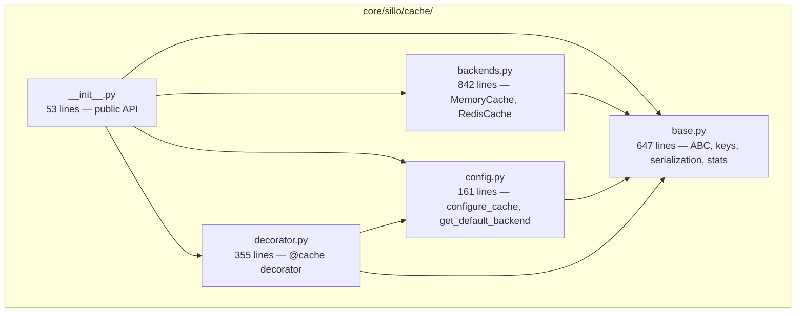
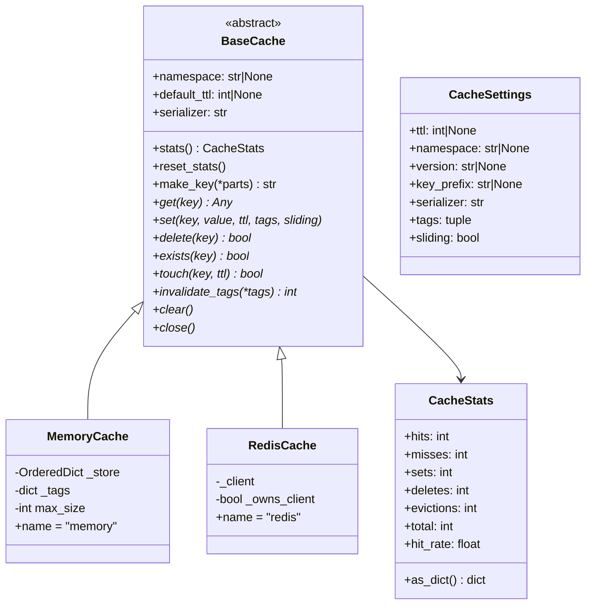
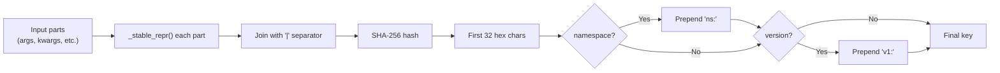
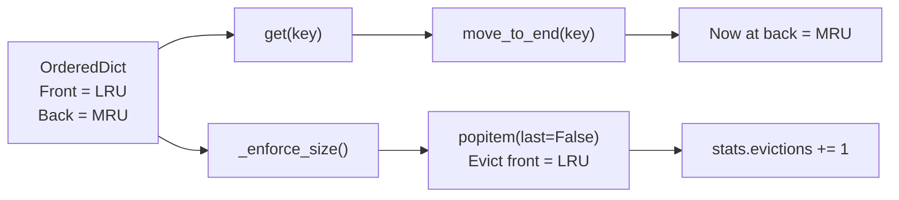
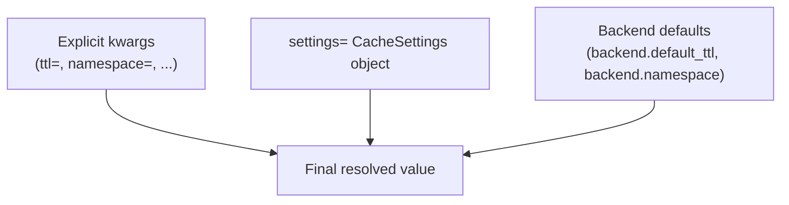
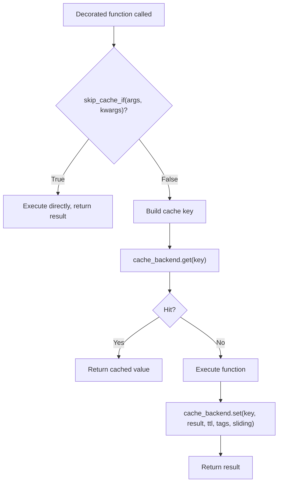

> Internal engineering reference for Sillo's caching subsystem.
>
> Source: `core/sillo/cache/` (5 files, ~2,058 lines)

---

## 1. Overview and Architecture

The cache subsystem provides a unified async-first caching API with pluggable
backends, deterministic key construction, automatic serialisation, tag-based
invalidation, and a decorator for transparent function-level caching.

### Module Layout



### Class Hierarchy



### File Inventory

| File | Path | Lines | Purpose |
|------|------|-------|---------|
| `__init__.py` | `core/sillo/cache/__init__.py` | 53 | Public API re-exports |
| `base.py` | `core/sillo/cache/base.py` | 647 | ABC, key building, serialization, stats |
| `backends.py` | `core/sillo/cache/backends.py` | 842 | `MemoryCache`, `RedisCache` |
| `config.py` | `core/sillo/cache/config.py` | 161 | Configuration, default backend |
| `decorator.py` | `core/sillo/cache/decorator.py` | 355 | `@cache` decorator |

---

## 2. CacheStats

**File:** `core/sillo/cache/base.py`, line 55

```python
@dataclass
class CacheStats:
    hits: int = 0
    misses: int = 0
    sets: int = 0
    deletes: int = 0
    evictions: int = 0
```

### Properties

| Property | Line | Formula | Notes |
|----------|------|---------|-------|
| `total` | 81 | `hits + misses` | Total lookup attempts |
| `hit_rate` | 93 | `hits / total` or `0.0` | Avoids division by zero |

### Serialisation

```python
# core/sillo/cache/base.py, line 109
def as_dict(self) -> dict[str, Any]:
    return {
        "hits": self.hits,
        "misses": self.misses,
        "sets": self.sets,
        "deletes": self.deletes,
        "evictions": self.evictions,
        "total": self.total,
        "hit_rate": round(self.hit_rate, 4),
    }
```

Stats are live-updated by backend methods under a `threading.RLock`.  Each
`get()` call increments either `hits` or `misses`; `set()` increments `sets`;
`delete()` increments `deletes`; LRU eviction in `MemoryCache` increments
`evictions`.

---

## 3. Key Building

**File:** `core/sillo/cache/base.py`, lines 133-208

### `build_key(*parts, namespace=None, version=None) -> str`

Deterministic SHA-256-based cache key construction:



### `_stable_repr(value) -> str`

Deterministic string rendering that eliminates Python's hash randomisation and
object identity issues:

| Input Type | Strategy | Example |
|------------|----------|---------|
| `str`, `int`, `float`, `bool`, `None` | `json.dumps(value, sort_keys=True)` | `'"hello"'`, `'42'` |
| `bytes`, `bytearray` | SHA-256 hex digest (32 chars) | `'<sha256...>'` |
| `set`, `frozenset` | Sorted list of `_stable_repr` of elements | `'[1, 2, 3]'` |
| `dict` | Recursive JSON with sorted keys | `'{"a": 1, "b": 2}'` |
| `list`, `tuple` | Recursive JSON | `'[1, 2, 3]'` |
| Fallback | `repr(value)` | Class-dependent |

**Why SHA-256 for bytes?**  Raw bytes can be arbitrarily large and may contain
non-printable characters.  Hashing produces a fixed-length, printable digest.

### `tag_key(namespace, tag) -> str`

```python
# core/sillo/cache/base.py, line 211
def tag_key(namespace: str, tag: str) -> str:
    ns = namespace or "_"
    return f"tag:{ns}:{tag}"
```

Used internally by both `MemoryCache` and `RedisCache` to map tags to sets of
cache keys.

---

## 4. Serialization

**File:** `core/sillo/cache/base.py`, lines 235-300

### Format Prefix Convention

All cached values are prefixed with a 2-byte format marker:

| Prefix | Format | Module | Use Case |
|--------|--------|--------|----------|
| `b"j:"` | JSON | `json` | Default. Human-readable, cross-language. |
| `b"p:"` | Pickle | `pickle` | Python objects that JSON can't represent. |

### `serialize(value, use_pickle: bool) -> bytes`

```python
# core/sillo/cache/base.py, line 235
def serialize(value: Any, use_pickle: bool = False) -> bytes:
    if use_pickle:
        return b"p:" + pickle.dumps(value, HIGHEST_PROTOCOL)
    return b"j:" + json.dumps(value, default=_json_default).encode("utf-8")
```

### `deserialize(payload: bytes) -> Any`

```python
# core/sillo/cache/base.py, line 270
def deserialize(payload: bytes) -> Any:
    if payload[:2] == b"p:":
        return pickle.loads(payload[2:])
    if payload[:2] == b"j:":
        return json.loads(payload[2:])
    # Backward compatibility: try plain JSON
    return json.loads(payload)
```

The backward-compatibility path handles values cached before the prefix
convention was introduced.

### `_json_default(obj) -> Any`

Custom serialiser for types `json.dumps` can't handle natively:

| Type | Strategy |
|------|----------|
| `set`, `frozenset` | Sorted list |
| Objects with `__dict__` | `obj.__dict__` |
| Fallback | `str(obj)` |

### Security Note

When using `pickle` serialisation (`serializer="pickle"`), deserialised data
can execute arbitrary code if the cache store is compromised.  Prefer JSON
unless you need to cache complex Python objects that JSON cannot represent.

---

## 5. BaseCache ABC

**File:** `core/sillo/cache/base.py`, line 329

### Constructor

```python
def __init__(
    self,
    *,
    namespace: str | None = None,
    default_ttl: int | None = None,
    serializer: str = "json",
    stats: CacheStats | None = None,
) -> None:
```

- `namespace`: Prefix for all keys.  Enables multiple logical caches sharing
  the same store.
- `default_ttl`: Fallback TTL when `set()` is called without an explicit TTL.
- `serializer`: `"json"` or `"pickle"`.
- `stats`: Optional shared `CacheStats` instance; creates a fresh one if `None`.
- Creates `self._lock = threading.RLock()` for thread-safe stat updates.

### Concrete Methods

| Method | Line | Purpose |
|--------|------|---------|
| `stats()` | 393 | Returns the live `CacheStats` object |
| `reset_stats()` | 407 | Replaces stats with a fresh `CacheStats()` |
| `make_key(*parts)` | 418 | Delegates to `build_key()` using `self.namespace` |
| `_resolve_ttl(ttl)` | 617 | Returns explicit TTL or falls back to `self.default_ttl` |

### Async Context Manager

```python
async def __aenter__(self):
    return self

async def __aexit__(self, *args):
    await self.close()
```

Enables `async with MemoryCache() as cache:` usage.

### Abstract Methods

```python
async def get(self, key: str) -> Any
async def set(self, key: str, value: Any, ttl: int | None = None,
              *, tags: Iterable[str] | None = None,
              sliding: bool = False) -> None
async def delete(self, key: str) -> bool
async def exists(self, key: str) -> bool
async def touch(self, key: str, ttl: int | None = None) -> bool
async def invalidate_tags(self, *tags: str) -> int
async def clear(self) -> None
async def close(self) -> None
```

The `_MISSING` sentinel (line 25) distinguishes "key not found" from "key
found with value `None`".

---

## 6. MemoryCache

**File:** `core/sillo/cache/backends.py`, line 37

An in-process, thread-safe LRU cache using `collections.OrderedDict`.

### Constructor

```python
def __init__(
    self,
    *,
    namespace=None,
    default_ttl=None,
    serializer="json",
    max_size: int | None = None,
    stats=None,
) -> None:
```

- `max_size`: Maximum number of entries.  When exceeded, the least-recently-used
  entries are evicted from the front of the `OrderedDict`.

### Internal Entry

```python
class _Entry:
    __slots__ = ("expire_at", "payload", "sliding", "ttl")

    def __init__(self, payload, ttl, sliding, now):
        self.payload = payload
        self.sliding = sliding
        self.ttl = ttl
        self.expire_at = now + ttl if ttl else float("inf")

    def is_expired(self, now):
        return now >= self.expire_at

    def touch(self, ttl, now):
        self.ttl = ttl or self.ttl
        self.expire_at = now + self.ttl
```

`__slots__` minimises memory overhead per entry.

### LRU Mechanism



- Every `get()`, `set()`, `exists()`, and `touch()` calls `move_to_end()` to
  promote the entry to MRU position.
- `_enforce_size()` (line 432) pops from the front until `len(store) <= max_size`.

### Sliding TTL

When `sliding=True` is passed to `set()`, the entry's expiration is refreshed on
every `get()`:

```python
# On get():
if entry.sliding:
    entry.touch(entry.ttl, now)
```

This is useful for session-like data where the cache entry should expire after a
period of *inactivity* rather than a fixed time after creation.

### Tag-Based Invalidation

Tags are stored as a `dict[str, set[str]]` mapping tag names to sets of cache
keys:

```python
self._tags: dict[str, set[str]] = {}
```

- **`set()` with tags**: Adds the key to each tag's set.
- **`invalidate_tags(*tags)`**: Pops each tag's key set, deletes all member keys,
  increments `deletes` by the count of removed keys.
- **`delete()`**: Does *not* clean up tag memberships (keys remain in tag sets
  as stale references).  This is a known trade-off for simplicity.

### Namespace-Scoped Clear

`clear()` removes only keys whose names start with the configured namespace
prefix, preserving entries belonging to other logical caches sharing the same
`OrderedDict`.

---

## 7. RedisCache

**File:** `core/sillo/cache/backends.py`, line 477

An async Redis backend using `redis.asyncio` (lazily imported).

### Constructor

```python
def __init__(
    self,
    *,
    url=None,
    host="localhost",
    port=6379,
    db=0,
    password=None,
    namespace=None,
    default_ttl=None,
    serializer="json",
    client=None,
    stats=None,
) -> None:
```

- `client`: Inject an external Redis client.  If provided, the backend won't
  close it on shutdown (`_owns_client = False`).
- `url`: Connection URL (e.g., `redis://localhost:6379/0`).  Takes precedence
  over host/port/db/password.

### Lazy Connection

```python
# core/sillo/cache/backends.py, line 568
async def _redis(self):
    if self._client is None:
        try:
            import redis.asyncio as aioredis
        except ImportError:
            raise CacheError("Install redis: pip install redis")
        if self._url:
            self._client = aioredis.from_url(self._url, ...)
        else:
            self._client = aioredis.Redis(host=..., port=..., ...)
    return self._client
```

The Redis connection is created on first use, not at construction time.  This
avoids import-time failures when Redis is optional.

### Sliding TTL in Redis

Redis doesn't natively support sliding TTL.  `RedisCache` emulates it by
wrapping the cached value in a metadata dict:

```python
# When sliding=True:
{
    "_value": <actual_value>,
    "_sliding": True,
    "_ttl": 300,
    "_expire_at": 1697000000.0,
}
```

On `get()`, if the stored value is a dict with `"_sliding": True`, the backend:
1. Extracts `_value` as the real cached data.
2. Calls `touch()` to re-issue `EXPIRE` with the original TTL.

### Tag Storage

Tags are stored as Redis sets:

```
tag:<namespace>:<tag_name> -> SET { key1, key2, ... }
```

- `set()` with tags: `redis.sadd(tag_key, member_key)` with a 24-hour cleanup TTL.
- `invalidate_tags()`: `redis.smembers()` to get keys, `redis.delete(*keys)`,
  then delete the tag set itself.

### Namespace-Scoped Clear

```python
# core/sillo/cache/backends.py, line 797
async def clear(self):
    if self.namespace:
        # SCAN with pattern "{namespace}:*"
        cursor = 0
        while True:
            cursor, keys = await redis.scan(cursor, match=f"{self.namespace}:*")
            if keys:
                await redis.delete(*keys)
            if cursor == 0:
                break
    else:
        # No namespace: flush entire database
        await redis.flushdb()
```

**Warning:** `clear()` without a namespace calls `FLUSHDB`, which destroys
*all* keys in the current Redis database.

### Connection Cleanup

```python
async def close(self):
    if self._client and self._owns_client:
        try:
            await self._client.aclose()  # redis 5.0.1+
        except AttributeError:
            await self._client.close()
```

Only closes the connection if the backend owns it (not injected via `client=`).

---

## 8. Configuration

**File:** `core/sillo/cache/config.py`

### Module-Level State

```python
_DEFAULT: BaseCache | None = None   # Process-wide default backend
_LOCK = threading.RLock()           # Thread-safety guard
```

### `configure_cache(backend: BaseCache) -> None`

Sets the process-wide default backend under `_LOCK`.  Typically called once at
application startup:

```python
from sillo.cache import configure_cache, RedisCache

configure_cache(RedisCache(url="redis://localhost:6379/0"))
```

### `get_default_backend() -> BaseCache`

Returns `_DEFAULT` or lazily creates a `MemoryCache()` and caches it.
Thread-safe via `_LOCK`.

```python
# First call creates MemoryCache; subsequent calls return it
cache = get_default_backend()
```

### `reset_cache_config() -> None`

Resets `_DEFAULT` to `None`.  Intended for test isolation:

```python
@pytest.fixture(autouse=True)
def reset_cache():
    reset_cache_config()
    yield
```

### `CacheSettings` Dataclass

```python
@dataclass
class CacheSettings:
    ttl: int | None = None
    namespace: str | None = None
    version: str | None = None
    key_prefix: str | None = None
    serializer: str = "json"
    tags: tuple = field(default_factory=tuple)
    sliding: bool = False
```

Shared settings object passed to `@cache(settings=...)`.  Explicit keyword
arguments on the decorator take precedence over these values.

---

## 9. @cache Decorator

**File:** `core/sillo/cache/decorator.py`, line 38

### Signature

```python
def cache(
    *,
    backend: BaseCache | None = None,
    ttl: int | None = None,
    namespace: str | None = None,
    version: str | None = None,
    key_prefix: str | None = None,
    tags: tuple[str, ...] | None = None,
    sliding: bool = False,
    skip_cache_if: Callable[..., bool] | None = None,
    serializer: str | None = None,
    settings: CacheSettings | None = None,
) -> Callable[[Callable], Callable]:
```

### Settings Precedence



Explicit kwargs > `settings` object > backend defaults.

### Key Construction

```python
# core/sillo/cache/decorator.py, line 137
def build_key(args, kwargs) -> str:
    parts = []
    if key_prefix:
        parts.append(key_prefix)
    # Module + qualified name uniquely identifies the function
    parts.append(f"{func.__module__}.{func.__qualname__}")
    # Positional args (excluding self/cls for bound methods)
    if _has_self:
        parts.extend(args[1:])
    else:
        parts.extend(args)
    # Sorted keyword arguments
    for k, v in sorted(kwargs.items()):
        parts.append(f"{k}={v}")
    return effective_backend.make_key(*parts)
```

**Bound method detection:** Checks if the first parameter name is `"self"` or
`"cls"` (`_has_self`).  If so, the first positional arg (the instance) is
excluded from the key to avoid hashing the entire object.

### Lookup Flow



### Sync/Async Bridge

The decorator auto-detects whether the wrapped function is sync or async:

- **Async function**: Uses `_async_wrapper` which `await`s the lookup directly.
- **Sync function**: Uses `_sync_wrapper` which bridges to the async cache API:
  - If an event loop is already running: `asyncio.run_coroutine_threadsafe()`
    on a new private event loop in a background thread.
  - If no loop: `loop.run_until_complete()`.

This means sync functions can use `@cache` without any async ceremony:

```python
@cache(ttl=300)
def expensive_computation(x: int) -> int:
    time.sleep(1)  # Simulate work
    return x * x
```

### Invalidation

```python
@cache(ttl=300)
async def get_user(user_id: int) -> dict:
    return await db.fetch_user(user_id)

# Later, invalidate the cached result:
await get_user.invalidate(user_id=42)
```

The `invalidate` method reconstructs the cache key from the same arguments and
calls `cache_backend.delete(key)`.

### Attached Attributes

```python
wrapper.cache_backend = backend  # The explicit backend, or None
wrapper.invalidate = _invalidate # Async invalidation method
```

---

## 10. Performance Considerations

### MemoryCache

- **Thread safety**: All operations protected by the parent class's
  `threading.RLock`.  Contention is minimal for read-heavy workloads.
- **Memory overhead**: `_Entry.__slots__` minimises per-entry overhead.
  `OrderedDict` adds ~80 bytes per entry beyond the data itself.
- **Eviction cost**: `_enforce_size()` pops from the front of an `OrderedDict`,
  which is O(1) per pop.
- **Expiration check**: Lazy — expired entries are evicted on access, not by a
  background sweeper.  This means memory usage can grow between accesses.

### RedisCache

- **Connection pooling**: `redis.asyncio` uses connection pooling internally.
- **Serialization overhead**: JSON is fast for simple types; pickle is faster
  for complex Python objects but has security implications.
- **Tag invalidation**: O(N) where N is the number of keys tagged.  For
  high-cardinality tags, consider time-based expiration instead.
- **SCAN vs KEYS**: `clear()` uses `SCAN` (cursor-based, non-blocking) for
  namespaced clears.  Only `FLUSHDB` (blocking) is used when no namespace is set.

### @cache Decorator

- **Key computation**: SHA-256 of stable repr is deterministic but adds ~1μs
  per call.  For hot paths, consider pre-computing keys.
- **Sync bridge overhead**: `run_coroutine_threadsafe` adds ~10-50μs per call.
  For high-throughput sync code, consider using `MemoryCache` directly.
- **skip_cache_if**: Runs on every call.  Keep the predicate fast.

### Serialization Format Selection

| Criterion | JSON (`j:`) | Pickle (`p:`) |
|-----------|-------------|---------------|
| Speed | Fast for primitives | Faster for complex objects |
| Size | Smaller for strings/numbers | Smaller for nested Python objects |
| Cross-language | Yes | No |
| Security | Safe | Arbitrary code execution risk |
| Supported types | str, int, float, bool, None, list, dict | Any Python object |

---

## Appendix: Usage Examples

### Basic Usage

```python
from sillo.cache import MemoryCache, configure_cache

# At startup
cache = MemoryCache(max_size=1000, default_ttl=300)
configure_cache(cache)

# In handlers
from sillo.cache import get_default_backend

backend = get_default_backend()
await backend.set("user:42", {"name": "Alice"}, ttl=600)
user = await backend.get("user:42")
```

### Tag-Based Invalidation

```python
await backend.set("post:1", post_data, tags=["posts", "homepage"])
await backend.set("post:2", post_data2, tags=["posts"])

# Invalidate all posts
count = await backend.invalidate_tags("posts")
# Both post:1 and post:2 are deleted
```

### Decorator with Settings

```python
from sillo.cache import cache, CacheSettings

settings = CacheSettings(ttl=300, namespace="api", tags=("users",))

@cache(settings=settings)
async def get_user_profile(user_id: int) -> dict:
    return await db.fetch_user(user_id)
```

### Sliding TTL for Session-Like Data

```python
@cache(ttl=900, sliding=True)
async def get_user_preferences(user_id: int) -> dict:
    return await db.fetch_preferences(user_id)
# Entry expires 15 minutes after LAST access, not first
```
