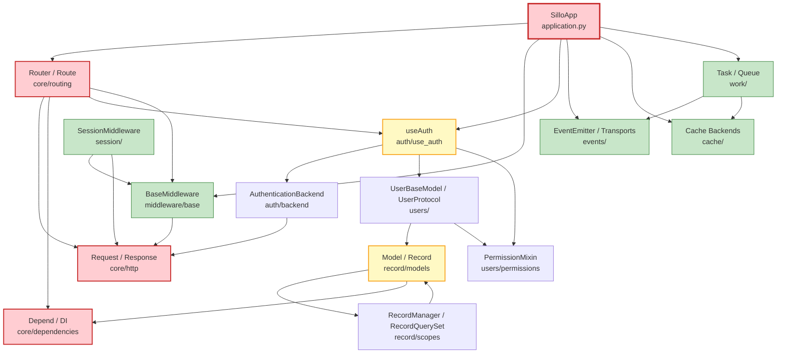
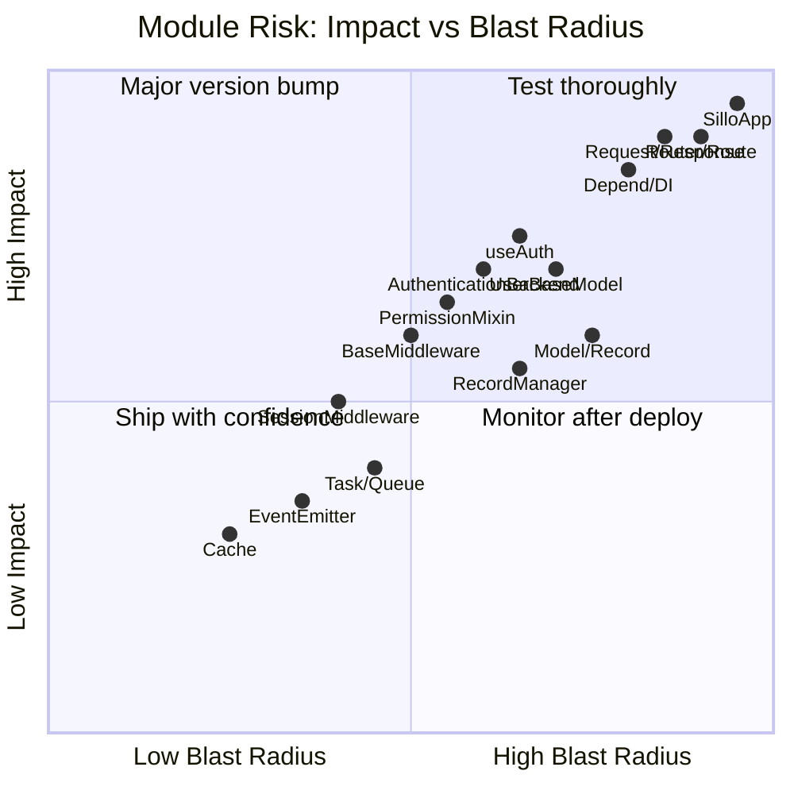

> What breaks when you change a major Sillo module.  For each module:
> direct dependents, indirect dependents, behaviour changes, test failures,
> API surface, risk level, and migration guidance.

---

## Dependency Graph

Legend:
- 🔴 **Red**: Critical: changes cascade to nearly everything
- 🟡 **Yellow**: High: changes cascade to auth, ORM, or all routes
- 🟢 **Green**: Medium: changes are more contained

---

## SilloApp

**File:** `core/sillo/application.py`
**Risk level:** 🔴 CRITICAL

### What directly depends on it

| Dependent | How |
|-----------|-----|
| Every route handler | Registered via `app.get/post/...` |
| Every middleware | Registered via `app.use()` |
| All lifecycle hooks | `app.on_startup/on_shutdown` |
| CLI console | `app.add_command()` |
| OpenAPI generation | `app.build_openapi()` |
| Event emitter | `app.events` |
| Auth configuration | `app.auth_backends`, `app.auth_user_model` |
| Custom encoders | `app.add_encoder()` |
| Frontend SPA mounting | `app.frontend()` |

### What indirectly depends on it

- Every test that creates a `SilloApp` instance
- Every integration/ASGI test
- Any script that uses the CLI
- OpenAPI client generation (downstream)
- Deployment scripts (lifespan events)

### Behaviour that could change

| Change | Impact |
|--------|--------|
| `__call__` signature (scope, receive, send) | All ASGI servers fail |
| `use()` method signature | All middleware registration breaks |
| `get/post/...` decorator signatures | All route definitions break |
| `url_for()` logic | All `url_for()` calls return wrong URLs |
| `build_openapi()` output | Client generation breaks |
| Lifecycle hook ordering | Startup/shutdown side effects change |
| `state` attribute type/semantics | All `request.app.state` access breaks |

### Tests that could fail

- All route tests (via test client)
- All middleware tests
- All integration tests
- OpenAPI snapshot tests
- CLI tests

### APIs affected

- `SilloApp.__call__(scope, receive, send)`
- `SilloApp.use(middleware)`
- `SilloApp.get/post/put/patch/delete(path, handler, ...)`
- `SilloApp.add_route(route)`
- `SilloApp.mount_router(router, name)`
- `SilloApp.url_for(_name, **path_params)`
- `SilloApp.build_openapi()`
- `SilloApp.on_startup/on_shutdown(handler)`

### Migration guidance

Any change to `SilloApp` should be treated as a **major version bump**.
If changing method signatures, provide a compatibility shim that accepts
both old and new signatures for at least one release cycle.

---

## Router / Route

**File:** `core/sillo/core/routing/`
**Risk level:** 🔴 CRITICAL

### What directly depends on it

| Dependent | How |
|-----------|-----|
| `SilloApp` | Creates and owns the root `Router` |
| Every route handler | Wrapped in a `Route` object |
| `url_for()` | Walks router tree to find named routes |
| Mounted sub-routers | `router.mount_router()` |
| DI resolution | `Route.dependant` drives parameter extraction |
| `useAuth` | `Route.auth` gates authentication |

### What indirectly depends on it

- All middleware (routes determine which middleware applies)
- Test client (resolves routes by path)
- OpenAPI schema (routes → operations)
- Admin panel (mounts its own router)
- Frontend app (mounted as a sub-router)

### Behaviour that could change

| Change | Impact |
|--------|--------|
| `compile_path()` regex patterns | URL matching breaks silently (most dangerous) |
| `Route.match(scope)` logic | 404s for valid URLs |
| `Dependant` construction | DI parameter extraction fails |
| Route ordering | First-match vs last-match semantics change |
| `url_for()` parameter handling | Reverse URL generation breaks |
| Middleware application order | Security middleware may not run |
| `route_class` attribute | Custom route classes stop working |

### Tests that could fail

- All routing tests
- URL generation tests
- Parameter extraction tests
- Mounted router tests
- OpenAPI operation ID tests

### APIs affected

- `Router.get/post/put/patch/delete(path, handler, ...)`
- `Router.add_route(route)`
- `Router.mount_router(app)`
- `Router.url_for(_name, **path_params)`
- `Route.match(scope)`
- `Route.handle(scope, receive, send)`
- `compile_path(path)`: internal but critical

### Migration guidance

Route pattern changes are the most dangerous because they can cause
**silent** failures (requests going to wrong handlers).  Always add
regression tests for all existing URL patterns before changing
`compile_path()`.

---

## BaseMiddleware

**File:** `core/sillo/middleware/base.py`
**Risk level:** 🟡 HIGH

### What directly depends on it

| Dependent | How |
|-----------|-----|
| `SessionMiddleware` | Subclass |
| `AuthenticationMiddleware` | Subclass |
| `ETagMiddleware` | Subclass |
| `DatabaseManager.ensure_context` | Uses middleware pattern |
| All user-defined middleware | Subclass |

### What indirectly depends on it

- All authenticated routes (via `AuthenticationMiddleware`)
- All session-dependent routes (via `SessionMiddleware`)
- CSRF protection (via session)
- Admin panel (via session + auth)

### Behaviour that could change

| Change | Impact |
|--------|--------|
| `_call_next` flag mechanism | Pre/post processing breaks |
| `process_request`/`process_response` signatures | All middleware subclasses break |
| `__call__` flow (when `process_response` runs) | Unexpected ordering changes |
| Error handling in middleware chain | Exceptions may propagate differently |

### Tests that could fail

- All middleware unit tests
- Auth integration tests
- Session tests
- CSRF tests

### Migration guidance

The `process_request`/`process_response` split with `call_next` is a
**core contract**.  If changing it, provide a compatibility base class
(`BaseMiddlewareV1`) that preserves the old semantics.

---

## Request / Response

**File:** `core/sillo/core/http/`
**Risk level:** 🔴 CRITICAL

### What directly depends on it

| Dependent | How |
|-----------|-----|
| Every handler | Receives `Request`, returns `Response` |
| Every middleware | `process_request(request, response, ...)` |
| `useAuth` | Reads `request.user`, `request.session` |
| Test client | Constructs `Request` objects |
| Form parsing | `request.form()`, `request.files()` |
| DI system | Extracts parameters from `request` |

### What indirectly depends on it

- All tests
- All middleware
- All auth backends
- Session middleware
- Admin panel

### Behaviour that could change

| Change | Impact |
|--------|--------|
| `request.body` caching/async | Double-read semantics change |
| `request.json()` parsing | All JSON API handlers affected |
| `request.form()` parsing | All form handlers affected |
| `request.user` property | Auth integration breaks |
| `Response.set_cookie()` params | Session cookies break |
| `Response.status_code` type | Test assertions fail |
| `Responder` fluent API | All `responder.json()` calls break |
| `FileResponse` range support | Streaming breaks |

### Tests that could fail

- All handler tests
- All middleware tests
- Test client tests
- Form parsing tests
- File upload tests
- Cookie tests

### APIs affected

- `Request.body` (async property)
- `Request.json()` (async method)
- `Request.form()` / `Request.files()`
- `Request.session`
- `Request.user`
- `Response.set_cookie()` / `delete_cookie()`
- `Response.set_header()` / `remove_header()`
- `JSONResponse`, `HTMLResponse`, `FileResponse`, etc.
- `Responder` class

### Migration guidance

`Request` and `Response` are the two most widely used classes.  Any change
should be backward-compatible.  If adding new required parameters, use
keyword-only arguments with defaults.

---

## Depend / DI System

**File:** `core/sillo/core/dependencies/`
**Risk level:** 🔴 CRITICAL

### What directly depends on it

| Dependent | How |
|-----------|-----|
| Every route with parameters | `Route.dependant` is built by the DI system |
| `useAuth` | User loading is a dependency |
| Parameter validation | Pydantic validators run in the DI pipeline |

### What indirectly depends on it

- All handlers with `Depend()` markers
- All handlers with path/query/body parameters
- All handlers with injected `Request`/`Response`
- Validation error responses

### Behaviour that could change

| Change | Impact |
|--------|--------|
| `get_dependant()` signature analysis | Parameters extracted incorrectly |
| `_build_execution_plan()` ordering | Dependencies resolve in wrong order |
| `solve_dependencies()` caching | `use_cache=True` breaks |
| `_collect_kwargs()` parameter binding | Wrong values injected |
| Pydantic validation integration | Validation errors change format |

### Tests that could fail

- All handler tests with parameters
- DI resolution tests
- Validation tests
- Error response tests

### Migration guidance

The DI system is the **most complex** part of Sillo.  Changes should be
extremely careful.  Always test with:
- Simple path parameters
- Query parameters with defaults
- Nested `Depend()` chains
- `use_cache=True` dependencies
- Generator dependencies (sync and async)
- Mixed sync/async handlers

---

## useAuth

**File:** `core/sillo/auth/use_auth.py`
**Risk level:** 🟡 HIGH

### What directly depends on it

| Dependent | How |
|-----------|-----|
| All authenticated routes | `@app.get(..., auth=useAuth(...))` |
| OpenAPI security | `auth.security_requirements()` |
| Permission checks | `auth.permissions` list |

### What indirectly depends on it

- All routes requiring login
- All role/permission-gated routes
- OpenAPI `securitySchemes` and `security` fields
- Admin panel auth

### Behaviour that could change

| Change | Impact |
|--------|--------|
| `authenticate()` return type (bool) | Route gating breaks |
| `security_requirements()` output | OpenAPI security schemes break |
| Permission matching logic | Access control changes |
| `all_of` vs `any_of` semantics | Permission combinations break |
| Backend iteration order | Auth resolution changes |

### Tests that could fail

- All auth-gated route tests
- OpenAPI security schema tests
- Permission combination tests

### APIs affected

- `useAuth(permissions=[], backends=[], user_model=..., required=True)`
- `useAuth.authenticate(request)`
- `useAuth.security_requirements(available)`

### Migration guidance

`authenticate()` returning `bool` is a **strict contract**.  If you need
more information (e.g. which backend succeeded), add it as a new method
rather than changing the return type.

---

## AuthenticationBackend

**File:** `core/sillo/auth/backend.py`
**Risk level:** 🟡 HIGH

### What directly depends on it

| Dependent | How |
|-----------|-----|
| `AuthenticationMiddleware` | Iterates backends |
| `useAuth` per-route backends | `auth=useAuth(backends=[...])` |
| OpenAPI `describe()` | Security scheme generation |
| `JWTAuthBackend`, `SessionAuthBackend`, `APIKeyAuthBackend` | Subclasses |

### What indirectly depends on it

- All authenticated routes
- OpenAPI spec security definitions
- Token validation
- Session validation

### Behaviour that could change

| Change | Impact |
|--------|--------|
| `authenticate()` return type (`AuthResult`) | Middleware breaks |
| `describe()` return type (`SecurityScheme | None`) | OpenAPI breaks |
| `handle_exception()` signature | Error handling changes |
| `name` attribute usage | Backend identification changes |

### Tests that could fail

- Auth backend unit tests
- Middleware integration tests
- OpenAPI security tests
- Token validation tests

### Migration guidance

Changing `authenticate()` to return something other than `AuthResult`
would break every auth backend ever written.  Add new fields to `AuthResult`
as optional instead.

---

## UserBaseModel / UserProtocol

**File:** `core/sillo/users/`
**Risk level:** 🟡 HIGH

### What directly depends on it

| Dependent | How |
|-----------|-----|
| `AuthenticationMiddleware` | Loads user via `UserProtocol.load_user()` |
| `useAuth` | `auth.user_model` is a `UserProtocol` type |
| Admin panel | User model for admin auth |
| Permission system | `has_perm()`, `has_perms()` |

### What indirectly depends on it

- All authenticated routes (via `request.user`)
- All permission checks
- Admin panel access
- Password hashing/verification
- User management commands

### Behaviour that could change

| Change | Impact |
|--------|--------|
| `load_user(identity)` classmethod | User loading fails |
| `is_authenticated` / `is_anonymous` | Auth checks break |
| `has_perm()` / `has_perms()` | Permission checks break |
| `set_password()` / `check_password()` | Auth flow breaks |
| `UserManager` methods | User creation/lookup breaks |
| Model fields (email, username, password) | All user queries affected |

### Tests that could fail

- User model tests
- Auth flow tests
- Permission tests
- Admin panel tests
- User creation tests

### Migration guidance

User model changes are extremely high-risk because they affect both
authentication and authorization.  Field renames should go through a
migration + compatibility property.  Method signature changes should
support both old and new signatures for one release.

---

## PermissionMixin

**File:** `core/sillo/users/permissions/mixins.py`
**Risk level:** 🟡 HIGH

### What directly depends on it

| Dependent | How |
|-----------|-----|
| `useAuth` permission checks | `auth.permissions` checked via mixin methods |
| Admin panel access control | Permission gates |
| `UserBaseModel` | Inherits `PermissionMixin` |

### What indirectly depends on it

- All permission-gated routes
- Admin panel
- Group-based access control

### Behaviour that could change

| Change | Impact |
|--------|--------|
| `load_permissions()` return type | Permission set changes |
| `has_permission()` logic | Access control changes |
| `get_groups()` / `is_in_group()` | Group-based checks break |
| `get_group_permissions()` | Inherited permissions change |

### Tests that could fail

- Permission unit tests
- Group permission tests
- Admin access tests

---

## Model / Record

**File:** `core/sillo/record/models.py`
**Risk level:** 🟡 HIGH

### What directly depends on it

| Dependent | How |
|-----------|-----|
| All application models | Inherit from `Model` |
| `UserBaseModel` | Inherits from `Model` |
| Migrations | Schema generation |
| Factories | Model instantiation |
| Admin panel | Model registration |
| Fixtures/Seeders | Model creation |

### What indirectly depends on it

- All database operations
- All ORM queries
- All test fixtures
- Admin CRUD
- Bulk operations
- Soft delete logic

### Behaviour that could change

| Change | Impact |
|--------|--------|
| `save()` method | All writes affected |
| `soft_delete()` / `restore()` | Soft-delete logic changes |
| `to_dict()` / `to_json()` | Serialization changes |
| `get_or_none()` / `get_or_create()` | Lookup semantics change |
| `bulk_create()` / `bulk_upsert()` | Batch operations change |
| Auto fields (`created_at`, `updated_at`, `deleted_at`) | All models affected |
| `HasCasts` integration | Field encoding changes |
| `HasScopes` integration | Query scoping changes |

### Tests that could fail

- All model unit tests
- Migration tests
- Factory tests
- Fixture tests
- Bulk operation tests
- Soft-delete tests

### Migration guidance

Model changes require **coordinated database migrations**.  Always:
1. Create a migration for schema changes
2. Update factories/fixtures
3. Update admin panel config
4. Run full test suite

---

## RecordManager / RecordQuerySet

**File:** `core/sillo/record/scopes.py`
**Risk level:** 🟡 HIGH

### What directly depends on it

| Dependent | How |
|-----------|-----|
| All model queries | `Model.objects` is a `RecordManager` |
| Global scopes | Applied on every `get_queryset()` |
| Chainable scopes | `RecordQuerySet.__getattr__` |

### What indirectly depends on it

- All queries across the application
- Soft-delete filtering (if using global scope)
- Multi-tenancy filtering (if using global scope)
- Admin panel queries

### Behaviour that could change

| Change | Impact |
|--------|--------|
| `get_queryset()` scope application | All queries affected |
| `__getattr__` scope forwarding | Chainable scopes break |
| `without_global_scopes()` | Admin queries may break |
| QuerySet method signatures | All query chains affected |

### Tests that could fail

- All query tests
- Scope tests
- Global scope tests
- Admin panel query tests

### Migration guidance

Changes to scope application are **silent breaking changes**. Queries may
return different results without any visible error. Always add tests that
verify expected record counts.

---

## Task / Queue Backends

**File:** `core/sillo/work/`
**Risk level:** 🟢 MEDIUM

### What directly depends on it

| Dependent | How |
|-----------|-----|
| `@task` decorated functions | Registered as tasks |
| `dispatch()` calls | Enqueue jobs |
| `QueueWorker` / `WorkerPool` | Process jobs |
| `Batch` / `JobChain` | Track job groups |
| `SchedulerManager` | Scheduled execution |

### What indirectly depends on it

- All background processing
- Scheduled jobs
- Email sending (if queued)
- Report generation (if queued)
- Any async background work

### Behaviour that could change

| Change | Impact |
|--------|--------|
| `Task.serialize()` format | Queue persistence breaks |
| `MemoryBackend` / `RedisBackend` protocol | Backend swap fails |
| `dispatch()` arguments | All job submissions break |
| Worker lifecycle | Jobs may not process |
| `Batch.wait()` timeout semantics | Batch tracking breaks |
| Retry/timeout middleware | Error handling changes |

### Tests that could fail

- Task unit tests
- Queue integration tests
- Worker tests
- Batch tests
- Scheduler tests

### Migration guidance

Queue system changes affect **background processing** which is hard to
test in isolation.  Use integration tests with `MemoryBackend` for fast
feedback, then test with `RedisBackend` for production parity.

---

## EventEmitter / Transports

**File:** `core/sillo/events/`
**Risk level:** 🟢 MEDIUM

### What directly depends on it

| Dependent | How |
|-----------|-----|
| `app.events` | Application-level emitter |
| All event listeners | `events.on(name, handler)` |
| Cross-instance communication | Via transports (Redis, etc.) |

### What indirectly depends on it

- Real-time features (WebSocket broadcasts)
- Cache invalidation (if event-driven)
- Audit logging (if event-driven)
- Inter-service communication

### Behaviour that could change

| Change | Impact |
|--------|--------|
| `emit()` arguments | All listeners break |
| Wire format envelope | Cross-instance communication breaks |
| Transport protocol | Backend swap fails |
| `on()` / `once()` semantics | Listener registration changes |
| `EventNamespace` prefix logic | Namespaced events break |
| Dedup logic in `_deliver()` | Duplicate events or missed events |

### Tests that could fail

- Event unit tests
- Transport tests
- Namespace tests
- Cross-instance tests (Redis transport)

### Migration guidance

Event system changes can cause **silent** failures in distributed
deployments if the wire format changes.  Always version the envelope
format and support old formats during migration.

---

## SessionMiddleware / Session

**File:** `core/sillo/session/`
**Risk level:** 🟢 MEDIUM

### What directly depends on it

| Dependent | How |
|-----------|-----|
| `request.session` | Accessed in handlers |
| `SessionAuthBackend` | Reads session for auth |
| CSRF middleware | Stores/reads CSRF token |
| Admin panel | Session-based admin auth |

### What indirectly depends on it

- All session-dependent authentication
- CSRF protection
- Flash messages (if using sessions)
- Shopping carts / user state (if using sessions)

### Behaviour that could change

| Change | Impact |
|--------|--------|
| Session cookie name/attributes | Existing sessions invalidated |
| Signing/encryption | Session data unreadable |
| `Session.__getitem__` / `__setitem__` | All session access breaks |
| `Session.save()` timing | Data loss or stale data |
| Expiry handling | Sessions expire unexpectedly |
| Backend protocol | Backend swap fails |

### Tests that could fail

- Session unit tests
- Auth session tests
- CSRF tests
- Admin panel tests

### Migration guidance

Session changes can **invalidate all existing sessions** in production.
If changing the session format, support reading old format for one release
while always writing new format.

---

## Cache Backends

**File:** `core/sillo/cache/`
**Risk level:** 🟢 MEDIUM

### What directly depends on it

| Dependent | How |
|-----------|-----|
| `@cache` decorator | Caches function results |
| All cached operations | Explicit `cache.get/set` |
| Tag-based invalidation | `cache.invalidate_tags()` |

### What indirectly depends on it

- Response caching
- Query caching
- Template fragment caching
- Rate-limit state (if using cache backend)

### Behaviour that could change

| Change | Impact |
|--------|--------|
| `BaseCache` abstract method signatures | All backends break |
| Serialization format | Existing cache entries unreadable |
| Key format | Cache misses (stale data) |
| TTL handling | Cache expires differently |
| Tag invalidation logic | Stale cache served |
| `CacheStats` tracking | Monitoring breaks |

### Tests that could fail

- Cache unit tests
- Cache decorator tests
- Tag invalidation tests
- Cache stats tests

### Migration guidance

Cache changes are **least dangerous** because cache is a transparent
optimisation. A cache miss just means a slower response. However, serialization
changes will cause **brief spikes** of cache misses after deployment.

---

## Risk Summary Matrix

| Module | Risk | Direct deps | Indirect deps | Silent breakage? |
|--------|------|-------------|---------------|------------------|
| SilloApp | 🔴 Critical | All routes, middleware, CLI, OpenAPI | Everything | No (fails fast) |
| Router / Route | 🔴 Critical | All routes, url_for, DI | Everything | **Yes** (wrong handler) |
| Request / Response | 🔴 Critical | All handlers, middleware | Everything | No (fails fast) |
| Depend / DI | 🔴 Critical | All parameterised handlers | Everything | **Yes** (wrong values) |
| useAuth | 🟡 High | All auth routes, OpenAPI | Security surface | **Yes** (wrong access) |
| AuthenticationBackend | 🟡 High | Auth middleware, per-route backends | All auth | No (fails fast) |
| UserBaseModel / UserProtocol | 🟡 High | Auth middleware, admin, permissions | All auth | **Yes** (wrong user) |
| PermissionMixin | 🟡 High | Permission checks, admin | Auth system | **Yes** (wrong access) |
| Model / Record | 🟡 High | All models, migrations, factories | All DB ops | **Yes** (wrong data) |
| RecordManager / QuerySet | 🟡 High | All queries, scopes | All DB ops | **Yes** (wrong results) |
| BaseMiddleware | 🟢 Medium | User middleware, ASGI bridge | Middleware chain | No |
| SessionMiddleware | 🟢 Medium | Session auth, CSRF, admin | Session users | **Yes** (lost sessions) |
| Task / Queue | 🟢 Medium | Background work, scheduler | Async ops | **Yes** (lost jobs) |
| EventEmitter | 🟢 Medium | Event listeners, transports | Real-time | **Yes** (missed events) |
| Cache | 🟢 Medium | Cache decorator, cached ops | Performance | **Yes** (stale data) |

### Silent breakage warning

The most dangerous changes are those marked **"Yes" for silent breakage**.
These changes don't cause immediate errors: they cause wrong data, wrong
access, or missed operations. For these modules:

1. **Always add regression tests** before changing.
2. **Add runtime assertions** (e.g. `assert isinstance(result, expected_type)`).
3. **Log unexpected values** at debug level.
4. **Consider feature flags** for gradual rollout.
5. **Monitor metrics** after deployment (error rates, cache hit rates, auth
   failure rates).

### Safe change checklist

Before merging any change to a module listed above:

- [ ] Run unit tests for the module
- [ ] Run integration tests that use the module
- [ ] Run the full test suite (catch indirect breakage)
- [ ] Check for silent breakage risks (see matrix above)
- [ ] If 🔴 Critical: get two reviewer approvals
- [ ] If changing wire format: support old format for one release
- [ ] If changing session format: communicate to ops team
- [ ] If changing auth: security review required
- [ ] If changing DB model: migration required
- [ ] Update this document if new dependencies are introduced
