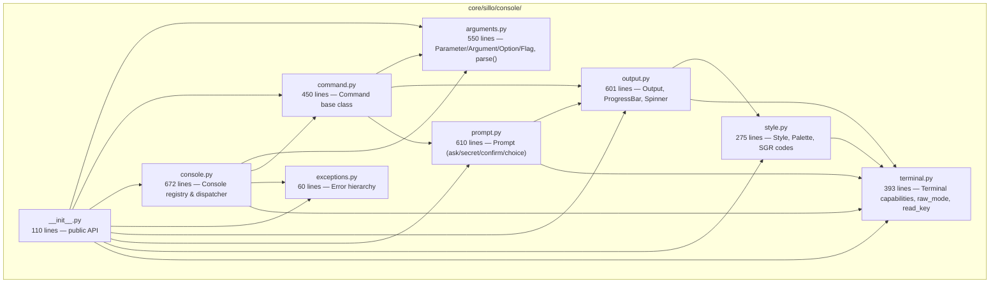
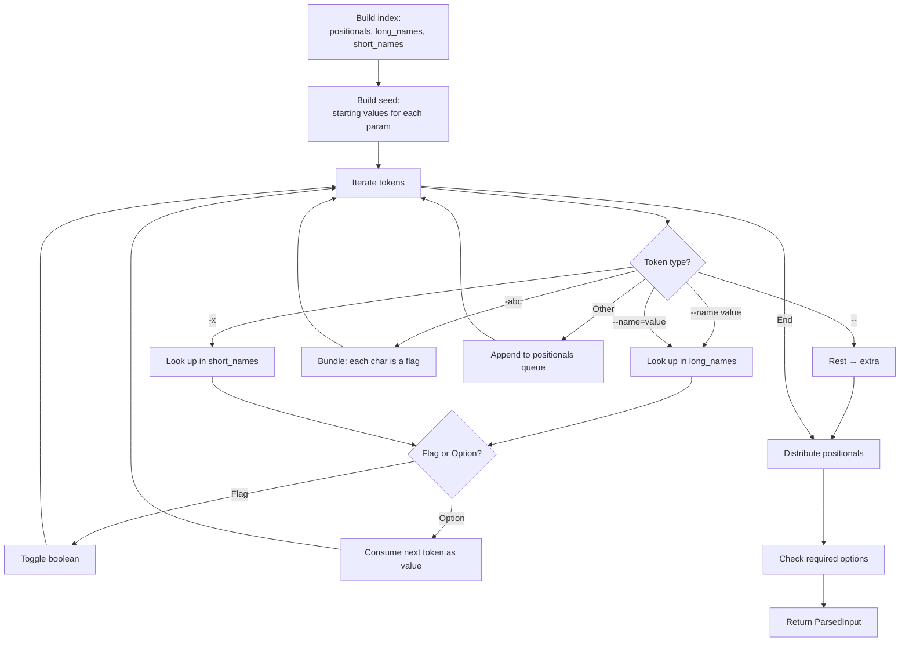
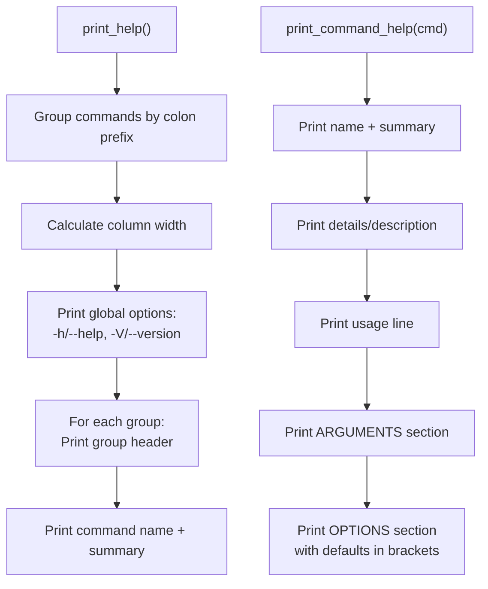
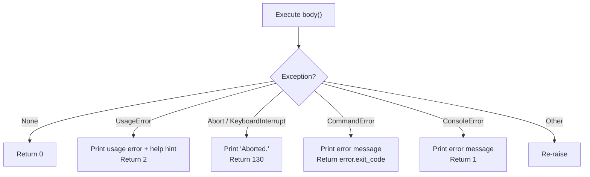
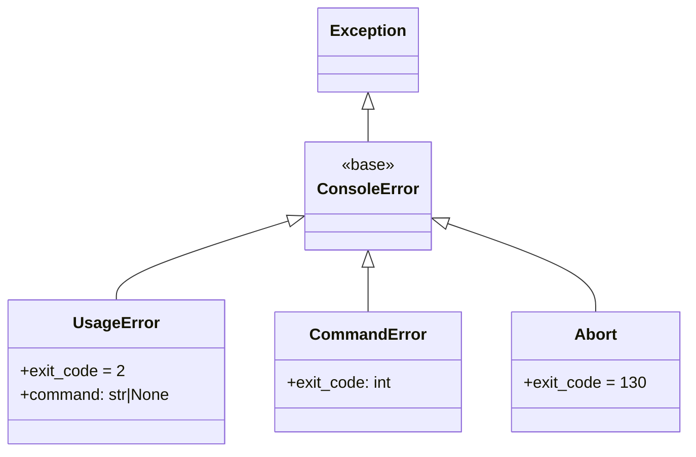
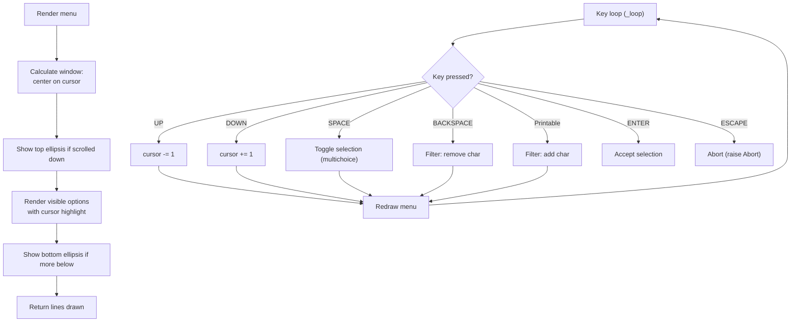
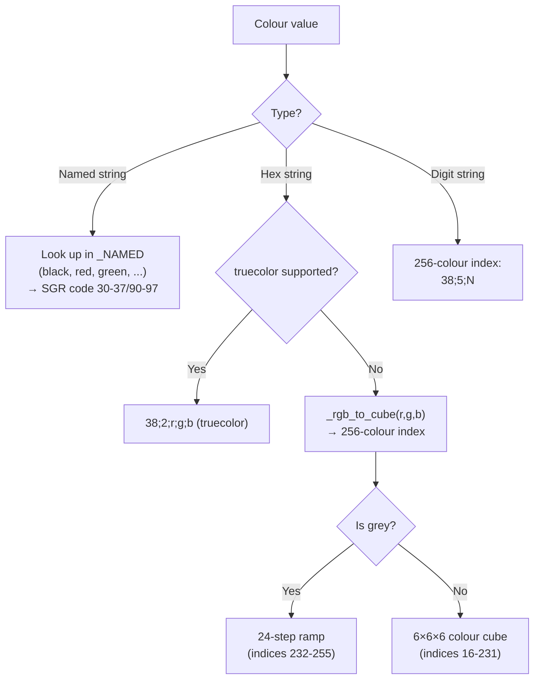
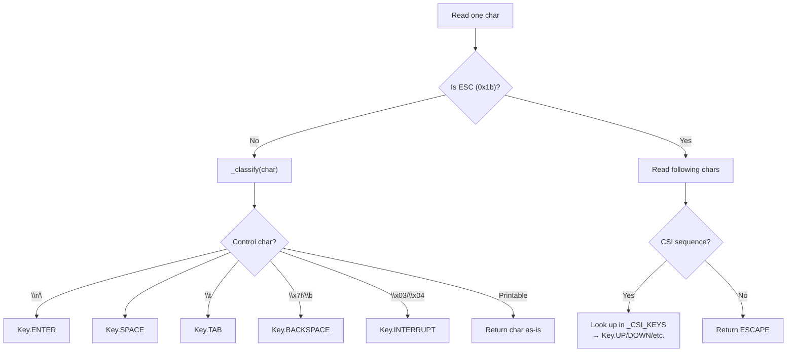

> Internal engineering reference for Sillo's CLI toolkit.
>
> Source: `core/sillo/console/` (9 files, ~3,371 lines)

---

## 1. Overview and Architecture

The console module is a self-contained CLI toolkit with zero external
dependencies (stdlib only).  It provides command registration, argument parsing,
styled terminal output, interactive prompts, and raw keyboard input handling.

### Module Layout



### File Inventory

| File | Path | Lines | Purpose |
|------|------|-------|---------|
| `__init__.py` | `core/sillo/console/__init__.py` | 110 | Public API re-exports |
| `arguments.py` | `core/sillo/console/arguments.py` | 550 | Parameter declaration & parsing |
| `command.py` | `core/sillo/console/command.py` | 450 | `Command` base class |
| `console.py` | `core/sillo/console/console.py` | 672 | `Console` registry & dispatcher |
| `exceptions.py` | `core/sillo/console/exceptions.py` | 60 | Exception hierarchy |
| `output.py` | `core/sillo/console/output.py` | 601 | Terminal drawing |
| `prompt.py` | `core/sillo/console/prompt.py` | 610 | Interactive prompts |
| `style.py` | `core/sillo/console/style.py` | 275 | Colour and text attributes |
| `terminal.py` | `core/sillo/console/terminal.py` | 393 | Terminal capabilities |

---

## 2. Parameter System

**File:** `core/sillo/console/arguments.py`

Three parameter kinds map onto three command-line shapes:

| Kind | Shape | Example | Takes Value |
|------|-------|---------|-------------|
| `Argument` | Positional | `mycommand src/` | Yes |
| `Option` | Named with value | `--output file.txt` | Yes |
| `Flag` | Named boolean | `--verbose` / `--no-verbose` | No |

### Sentinel Value

```python
# core/sillo/console/arguments.py, line 32
class _Unset:
    """Sentinel for absent defaults. Needed because None is a valid default."""
    def __repr__(self):
        return "<unset>"

UNSET = _Unset()  # line 45
```

### Name Normalisation

```python
# core/sillo/console/arguments.py, line 48
def _normalise(name: str) -> str:
    return name.replace("-", "_")
```

`--dry-run` and `dry_run` resolve to the same key.

### Parameter (Base Class)

```python
# core/sillo/console/arguments.py, line 63
class Parameter:
    takes_value: ClassVar[bool] = True
    kind: ClassVar[str] = "parameter"

    def __init__(self, name, help="", default=UNSET, type=None, choices=None, metavar=None):
```

**`convert(raw: str) -> Any`** (line 107): Applies the `type` callable to the
raw string, validates against `choices`, raises `UsageError` on failure.

### Argument

```python
# core/sillo/console/arguments.py, line 137
class Argument(Parameter):
    kind = "argument"

    def __init__(self, name, ..., variadic=False):
```

- `variadic`: Consumes all remaining positional arguments as a list.
- `required`: `True` when no default was given and not variadic.

### Option

```python
# core/sillo/console/arguments.py, line 190
class Option(Parameter):
    kind = "option"

    def __init__(self, name, ..., short=None, multiple=False, required=False):
```

- `short`: Single character for `-x` form.
- `multiple`: Allow repeated `--opt val1 --opt val2` → `[val1, val2]`.
- Default for `multiple` with no explicit default: `[]`.

### Flag

```python
# core/sillo/console/arguments.py, line 237
class Flag(Parameter):
    takes_value = False
    kind = "flag"

    def __init__(self, name, ..., default=False, short=None):
```

- `negative` property: Returns `"no-{name}"` for the `--no-name` spelling.
- Bundled short flags: `-abc` sets flags `a`, `b`, `c` all to `True`.

### ParsedInput

```python
# core/sillo/console/arguments.py, line 283
class ParsedInput:
    def __init__(self, values: dict, kinds: dict, extra: list | None = None):
```

- `values`: Resolved parameter values keyed by normalised name.
- `kinds`: Maps names to their declared kind (`"argument"`, `"option"`, `"flag"`).
- `extra`: Positional tokens after `--`.
- `get(name, expected)`: Looks up by normalised name; raises `KeyError` if
  `expected` kind doesn't match the declared kind.

### parse() Algorithm

```python
# core/sillo/console/arguments.py, line 425
def parse(parameters, argv, command=None) -> ParsedInput:
```



**Recognised patterns:**
- `--name value` — option with space-separated value
- `--name=value` — option with equals-separated value
- `-n value` — short option
- `-nvalue` — short option with attached value
- `-abc` — bundled short flags
- `--` — stop option parsing, rest is extra

**Error conditions** (all raise `UsageError`):
- Unknown option
- Missing value for option
- Invalid type conversion
- Missing required argument/option
- Surplus positional arguments

---

## 3. Command Base Class

**File:** `core/sillo/console/command.py`, line 53

### Class Variables

| Variable | Type | Purpose |
|----------|------|---------|
| `name` | `str` | Invocation name (colon-separated groups: `db:migrate`) |
| `help` | `str` | One-line description |
| `description` | `str` | Longer explanation (falls back to docstring) |
| `arguments` | `Sequence[Parameter]` | Declared parameters |
| `aliases` | `Sequence[str]` | Alternative names |
| `hidden` | `bool` | Exclude from help listing |

### Constructor

```python
def __init__(self, input: ParsedInput, output: Output, prompt: Prompt, console=None):
```

Binds one invocation — the parsed input, output handle, prompt handle, and
parent console.

### Methods to Override

#### `handle() -> int | None | Awaitable[int | None]`

Do the work.  May be sync or async.  Returns an exit code or `None` for success
(0).

```python
class GreetCommand(Command):
    name = "greet"
    arguments = [Argument("name")]

    def handle(self):
        self.line(f"Hello, {self.argument('name')}!")
```

#### `context() -> AsyncContextManager | None`

Optional context manager wrapping `handle`.  Useful for setup/teardown:

```python
class MigrateCommand(Command):
    name = "db:migrate"

    async def context(self):
        await db.connect()
        try:
            yield
        finally:
            await db.disconnect()

    async def handle(self):
        await db.run_migrations()
```

### Parameter Accessors

| Method | Returns | Source |
|--------|---------|--------|
| `argument(name)` | `Any` | `self.input.get(name, "argument")` |
| `option(name)` | `Any` | `self.input.get(name, "option")` |
| `flag(name)` | `bool` | `self.input.get(name, "flag")` |
| `extra` | `list` | Positional tokens after `--` |

### Output Delegation

All delegate to `self.output`:

| Method | Purpose |
|--------|---------|
| `line(text, style)` | Write one line |
| `blank(count)` | Empty lines |
| `info(text)` | Blue info message |
| `success(text)` | Green with tick |
| `warn(text)` | Yellow with `!` |
| `error(text)` | Red with cross |
| `muted(text)` | Grey text |
| `bullet(text, indent)` | Bulleted line |
| `pairs(items, indent)` | Aligned label/value |
| `table(headers, rows, align)` | Table with column sizing |
| `panel(body, title)` | Bordered box |
| `rule(label)` | Horizontal rule |
| `progress(total, label)` | Progress bar |
| `spinner(label)` | Animated spinner |

### Prompt Delegation

All delegate to `self.prompt`:

| Method | Returns | Purpose |
|--------|---------|---------|
| `ask(question, default, validate)` | `Any` | Free text input |
| `secret(question, confirm)` | `str` | Hidden input |
| `confirm(question, default)` | `bool` | Yes/no |
| `choice(question, options, default)` | `Any` | Single selection |
| `multichoice(question, options, defaults, minimum)` | `list` | Multiple selection |

### Failure

```python
# core/sillo/console/command.py, line 400
def fail(self, message, exit_code=1) -> NoReturn:
    raise CommandError(message, exit_code=exit_code)
```

### Introspection

| Method | Returns | Logic |
|--------|---------|-------|
| `group()` | `str` | Part of `name` before the colon |
| `summary()` | `str` | `help` attribute, falling back to first line of docstring |
| `details()` | `str` | `description` attribute, falling back to full docstring |

---

## 4. Console Registry

**File:** `core/sillo/console/console.py`, line 62

### Constructor

```python
def __init__(self, prog="console.py", description="", version=None,
             output=None, error=None, input=None, color=None, interactive=None):
```

Creates `Output` for stdout and stderr (each with its own `Palette`), `Prompt`
bound to the output, and maintains `_commands` and `_aliases` dicts.

### Registration

#### `add(command, override=False)`

Register a command class.  Can be used as a decorator:

```python
console = Console()

@console.add
class ServeCommand(Command):
    name = "serve"
    help = "Start the development server"
```

Validates that the command has a `name`.  Handles alias conflicts.  Supports
`override=True` to replace an existing registration.

#### `command(name, help, arguments, aliases, hidden)`

Decorator that registers a plain function as a command:

```python
@console.command("greet", help="Say hello", arguments=[Argument("name")])
def greet(name):
    print(f"Hello, {name}!")
```

Internally generates a `Command` subclass via `type()`:

```python
cls = type(_class_name_for(func), (Command,), {
    "name": name,
    "help": help,
    "arguments": arguments or [],
    "aliases": aliases,
    "hidden": hidden,
    "handle": lambda self: func(**{a.key: self.input.values.get(a.key) for a in arguments}),
})
```

#### `resolve(name)`

Finds command by name or alias.  Returns `None` if not found.

### Help Generation



#### Spelling Suggestions

```python
# core/sillo/console/console.py, line 396
def _suggest(self, name: str) -> str | None:
    all_names = list(self._commands.keys()) + list(self._aliases.keys())
    matches = difflib.get_close_matches(name, all_names, n=1, cutoff=0.6)
    return matches[0] if matches else None
```

When a command is not found, the console suggests the closest match:

```
$ mycli serv
Command 'serv' not found. Did you mean 'serve'?
```

---

## 5. Execution Flow

**File:** `core/sillo/console/console.py`

### `_prepare(argv)`

```python
# core/sillo/console/console.py, line 523
def _prepare(self, argv) -> int | tuple[type[Command], ParsedInput]:
```

Walks tokens to handle global options:

1. `help` / `--help` / `-h` → print help, return 0.
2. `--version` / `-V` → print version, return 0.
3. Resolve command name (with spelling suggestions on failure).
4. Parse remaining arguments via `parse()`.
5. Return `(CommandClass, ParsedInput)`.

### `_dispatch(command, parsed)` — Async

```python
# core/sillo/console/console.py, line 428
async def _dispatch(self, command, parsed) -> int:
```

1. Instantiate command: `cmd = command(input=parsed, output=self.output, prompt=self.prompt, console=self)`.
2. Call `handle()` (await if awaitable).
3. Wrap in `context()` if provided.
4. Return exit code or 0.

### `_dispatch_sync(command, parsed)` — Sync

```python
# core/sillo/console/console.py, line 459
def _dispatch_sync(self, command, parsed) -> int:
```

Falls back to `asyncio.run` if the context manager is async or `handle` returns
an awaitable.

### `_guard(command, body)`

```python
# core/sillo/console/console.py, line 494
def _guard(self, command, body) -> int:
```

Maps exceptions to exit codes:



| Exception | Exit Code | Handling |
|-----------|-----------|----------|
| `UsageError` | 2 | Prints usage line + help hint |
| `Abort` / `KeyboardInterrupt` | 130 | Prints "Aborted." |
| `CommandError` | Configurable | Prints error message |
| `ConsoleError` | 1 | Prints error message |
| Other | — | Re-raised |

### `run(argv)` — Sync Entry Point

```python
# core/sillo/console/console.py, line 571
def run(self, argv=None) -> int:
```

1. Raises `RuntimeError` if an event loop is already running.
2. Calls `_prepare(argv)`.
3. If `_prepare` returns an int (help/version), return it.
4. Calls `_guard(command, lambda: _dispatch_sync(command, parsed))`.
5. Returns exit code.

### `run_async(argv)` — Async Entry Point

```python
# core/sillo/console/console.py, line 614
async def run_async(self, argv=None) -> int:
```

For use inside a running event loop.  Same flow but uses `_dispatch` directly.

### `main(argv)` — SystemExit Wrapper

```python
def main(self, argv=None):
    raise SystemExit(self.run(argv))
```

---

## 6. Exceptions

**File:** `core/sillo/console/exceptions.py`



| Exception | Default Exit Code | Raised When |
|-----------|-------------------|-------------|
| `ConsoleError` | 1 | Base class for all console errors |
| `UsageError` | 2 | Command line could not be understood |
| `CommandError` | 1 (configurable) | Command failed during execution |
| `Abort` | 130 | User interrupted a prompt |

---

## 7. Output System

**File:** `core/sillo/console/output.py`

### Glyph Sets

```python
# core/sillo/console/output.py, line 48
_BORDERS = {
    "unicode": {
        "hline": "─", "vline": "│",
        "tl": "╭", "tr": "╮", "bl": "╰", "br": "╯",
        "bullet": "●", "tick": "✔", "cross": "✘",
        "bar_full": "█", "bar_empty": "░",
        "spinner": ["⠋", "⠙", "⠹", "⠸", "⠼", "⠴", "⠦", "⠧", "⠇", "⠏"],
    },
    "ascii": {
        "hline": "-", "vline": "|",
        "tl": "+", "tr": "+", "bl": "+", "br": "+",
        "bullet": "*", "tick": "v", "cross": "x",
        "bar_full": "#", "bar_empty": ".",
        "spinner": ["-", "\\", "|", "/"],
    },
}
```

Unicode is used when the terminal supports it; ASCII fallback otherwise.

### Output Class

```python
# core/sillo/console/output.py, line 118
class Output:
    def __init__(self, stream, palette=None, unicode=None):
```

#### Primitives

| Method | Line | Purpose |
|--------|------|---------|
| `paint(text, style)` | 140 | Style text without writing |
| `write(*parts)` | 148 | Write with no trailing newline, flush |
| `line(text, style)` | 155 | Write one line with newline |
| `blank(count)` | 162 | Empty lines |

#### Level Methods

| Method | Style | Prefix |
|--------|-------|--------|
| `info(text)` | `INFO` (cyan) | — |
| `success(text)` | `SUCCESS` (green) | tick glyph |
| `warn(text)` | `WARNING` (yellow) | `!` |
| `error(text)` | `DANGER` (red) | cross glyph |
| `muted(text)` | `MUTED` (grey) | — |
| `heading(text)` | `HEADING` (bold) | blank line before |

#### Structures

**`table(headers, rows, align, indent)`** (line 279):
- Calculates column widths from widest cell.
- Proportionally shrinks columns if they exceed terminal width.
- Uses `_pad` and `_truncate` for alignment.
- Supports left/right/center alignment per column.

**`panel(body, title, style)`** (line 338):
- Draws a bordered box with optional title set into the top border.

```
╭─ Title ───────────╮
│ Body content here  │
╰────────────────────╯
```

**`rule(label)`** (line 245):
- Horizontal rule, optionally labelled.

**`bullet(text, indent)`** (line 258):
- Bulleted line with glyph character.

**`pairs(items, indent)`** (line 268):
- Aligned label/value pairs.

### ProgressBar

```python
# core/sillo/console/output.py, line 436
class ProgressBar:
    def __init__(self, output, total, label="", width=30):
```

**Methods:**

| Method | Purpose |
|--------|---------|
| `start()` | Hide cursor, render initial state |
| `advance(step)` | Move forward by step |
| `set(current)` | Set absolute position |
| `render()` | Draw bar (inline `\r` or milestone lines) |
| `finish()` | Set to total, show cursor, newline |

**Rendering modes:**
- **Live (TTY):** Inline update with `\r`.
- **Non-live:** Prints milestone lines at each 10%.

```
  Processing [████████████░░░░░░░░] 60% (600/1000)
```

### Spinner

```python
# core/sillo/console/output.py, line 521
class Spinner:
    def __init__(self, output, label="Working", interval=0.08):
```

Uses a daemon thread to animate braille frames:

```
⠋ Processing...
⠙ Processing...
⠹ Processing...
```

**Methods:**

| Method | Purpose |
|--------|---------|
| `start()` | Hide cursor, start animation thread |
| `stop(text)` | Stop thread, clear line, optionally write success text |
| `__enter__` / `__exit__` | Context manager support |

---

## 8. Prompt System

**File:** `core/sillo/console/prompt.py`

### Prompt Class

```python
# core/sillo/console/prompt.py, line 61
class Prompt:
    def __init__(self, output, input_stream=None, interactive=None):
```

If `interactive` is None, inspects streams via `is_interactive`.

### Text Prompts

#### `ask(question, default, validate)`

```python
# core/sillo/console/prompt.py, line 178
def ask(self, question, default=None, validate=None) -> Any:
```

- Shows `? question (default)` hint.
- Loops until valid answer or uses default on empty input.
- Validator: `None`/`True` accepts; `str`/`False` rejects with message.

#### `secret(question, confirm, validate)`

```python
# core/sillo/console/prompt.py, line 219
def secret(self, question="Password", confirm=False, validate=None) -> str:
```

- Uses `getpass.getpass()` for hidden input.
- If `confirm=True`, asks twice and requires match.
- Raises `UsageError` if non-interactive.

#### `confirm(question, default)`

```python
# core/sillo/console/prompt.py, line 284
def confirm(self, question, default=False) -> bool:
```

- Shows `[Y/n]` or `[y/N]` hint.
- Accepts `y`/`yes`/`n`/`no` (case-insensitive).

### List Prompts

#### `choice(question, options, default, search)`

```python
# core/sillo/console/prompt.py, line 488
def choice(self, question, options, default=None, search=None) -> Any:
```

- Single selection from a list.
- Search enabled automatically when >8 options.
- Arrow keys navigate, Enter selects.
- Shows confirmation line with tick + selected label.

#### `multichoice(question, options, defaults, minimum)`

```python
# core/sillo/console/prompt.py, line 536
def multichoice(self, question, options, defaults=None, minimum=0) -> list[Any]:
```

- Space toggles selections, Enter accepts.
- Validates minimum selection count.
- Shows confirmation with all selected labels.

#### `confirm_destructive(question, phrase)`

```python
# core/sillo/console/prompt.py, line 588
def confirm_destructive(self, question, phrase) -> bool:
```

Requires the user to type a specific phrase back.  For expensive/dangerous
operations.  Returns `False` if non-interactive.

### Scrolling Menu

The `_render_choices` method (line 318) implements a windowed scrolling menu:



- **Window size:** 10 options visible at a time.
- **Cursor tracking:** Menu scrolls to keep cursor visible.
- **Search filtering:** Typing filters options in real-time.
- **Redraw:** Uses `_clear_lines` to erase and redraw the menu.

---

## 9. Style and Palette

**File:** `core/sillo/console/style.py`

### Style Dataclass

```python
# core/sillo/console/style.py, line 72
@dataclass(frozen=True)
class Style:
    fg: str | None = None
    bg: str | None = None
    bold: bool = False
    dim: bool = False
    italic: bool = False
    underline: bool = False
    strike: bool = False
```

- **Merge operator:** `style_a | style_b` — other wins on any attribute it sets.
  Booleans are OR'd.
- **`with_(**changes)`:** Returns a copy with changes applied via
  `dataclasses.replace`.

### Colour Resolution



### Named Colours

| Name | SGR Foreground | Bright Variant |
|------|---------------|----------------|
| `black` | 30 | 90 (`bright_black` / `grey` / `gray`) |
| `red` | 31 | 91 |
| `green` | 32 | 92 |
| `yellow` | 33 | 93 |
| `blue` | 34 | 94 |
| `magenta` | 35 | 95 |
| `cyan` | 36 | 96 |
| `white` | 37 | 97 |

### Semantic Palette Constants

```python
# core/sillo/console/style.py, lines 268-275
PRIMARY   = Style(fg="#fc0345")     # Brand red
SUCCESS   = Style(fg="green")
WARNING   = Style(fg="yellow")
DANGER    = Style(fg="red")
INFO      = Style(fg="cyan")
MUTED     = Style(fg="grey")
HEADING   = Style(bold=True)
INVERSE   = Style(bold=True, fg="black", bg="#fc0345")
```

### strip_ansi

```python
# core/sillo/console/style.py, line 57
_ANSI = re.compile(r"\x1b\[[0-9;?]*[a-zA-Z]")

def strip_ansi(text: str) -> str:
    return _ANSI.sub("", text)
```

Used for measuring printable width when aligning columns and truncating text.

---

## 10. Terminal Utilities

**File:** `core/sillo/console/terminal.py`

### Capability Detection

| Function | Line | Logic |
|----------|------|-------|
| `supports_color(stream)` | 96 | `NO_COLOR` presence → False; `FORCE_COLOR` → True; `TERM=dumb` → False; TTY check + Windows VT |
| `supports_unicode(stream)` | 124 | Tests if stream encoding can round-trip box-drawing chars |
| `is_interactive(input, output)` | 143 | Both must be TTYs |
| `terminal_width(default)` | 164 | `shutil.get_terminal_size`, minimum 20 columns |

### Cursor Control

| Constant/Function | Value | Purpose |
|-------------------|-------|---------|
| `cursor_hide` | `\x1b[?25l` | Hide cursor |
| `cursor_show` | `\x1b[?25h` | Show cursor |
| `erase_line` | `\x1b[2K` | Erase current line |
| `cursor_up(lines)` | `\x1b[{n}A` | Move cursor up N lines |

### Key Constants

```python
# core/sillo/console/terminal.py, line 206
class Key:
    UP = "up"
    DOWN = "down"
    LEFT = "left"
    RIGHT = "right"
    HOME = "home"
    END = "end"
    ENTER = "enter"
    SPACE = " "
    TAB = "tab"
    ESCAPE = "escape"
    BACKSPACE = "backspace"
    DELETE = "delete"
    INTERRUPT = "interrupt"
```

### raw_mode Context Manager

```python
# core/sillo/console/terminal.py, line 246
@contextmanager
def raw_mode(stream=None):
```

On POSIX: uses `termios`/`tty` to set cbreak mode (unbuffered, unechoed).
Restores settings in `finally` block with `TCSADRAIN`.  No-op on Windows or
non-TTY.

### read_key

```python
# core/sillo/console/terminal.py, line 339
def read_key(stream=None) -> str:
```

Reads one keypress:



**CSI sequences recognised:**

| Sequence | Key |
|----------|-----|
| `[A` | UP |
| `[B` | DOWN |
| `[C` | RIGHT |
| `[D` | LEFT |
| `[H` / `[1~` | HOME |
| `[F` / `[4~` | END |
| `[3~` | DELETE |

---

## Appendix: Complete Example

```python
from sillo.console import Console, Command, Argument, Option, Flag

console = Console(prog="myapp", version="1.0.0")

@console.command("greet", help="Say hello to someone")
def greet(
    name: str = Argument("name", help="Person to greet"),
    greeting: str = Option("greeting", short="g", default="Hello"),
    shout: bool = Flag("shout", short="s"),
):
    message = f"{greeting}, {name}!"
    if shout:
        message = message.upper()
    print(message)

@console.add
class MigrateCommand(Command):
    name = "db:migrate"
    help = "Run database migrations"
    arguments = [
        Flag("fresh", help="Drop all tables first"),
        Option("seed", short="s", help="Seed data file"),
    ]

    async def handle(self):
        if self.flag("fresh"):
            if not self.confirm("This will destroy all data. Continue?", default=False):
                self.fail("Migration cancelled.")
            self.warn("Dropping all tables...")
            await db.drop_all()

        with self.spinner("Running migrations"):
            await db.migrate()

        seed_file = self.option("seed")
        if seed_file:
            self.info(f"Seeding from {seed_file}...")
            await db.seed(seed_file)

        self.success("Migrations complete!")

if __name__ == "__main__":
    console.main()
```
