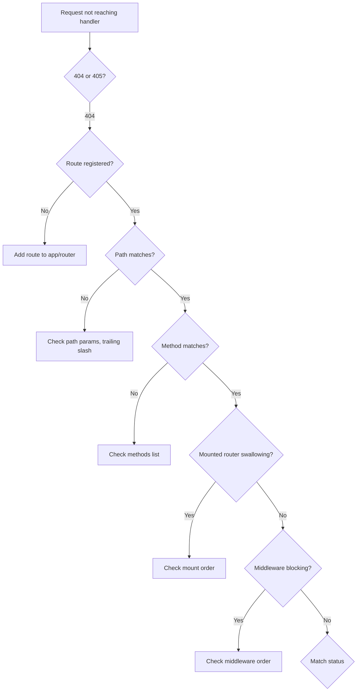
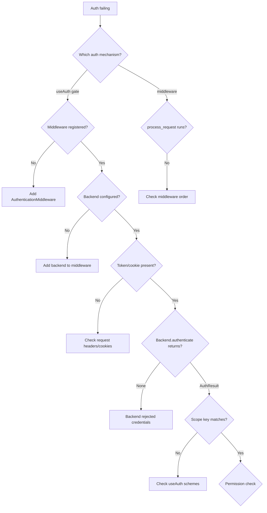
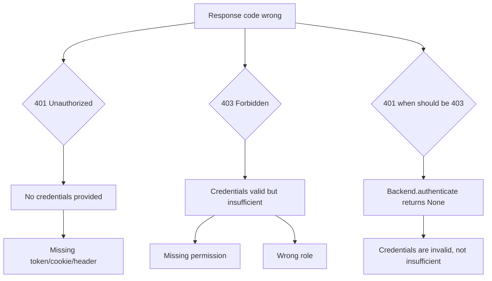
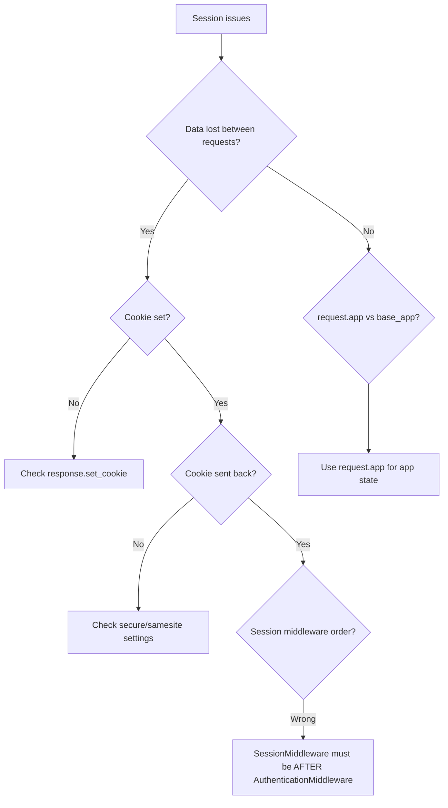
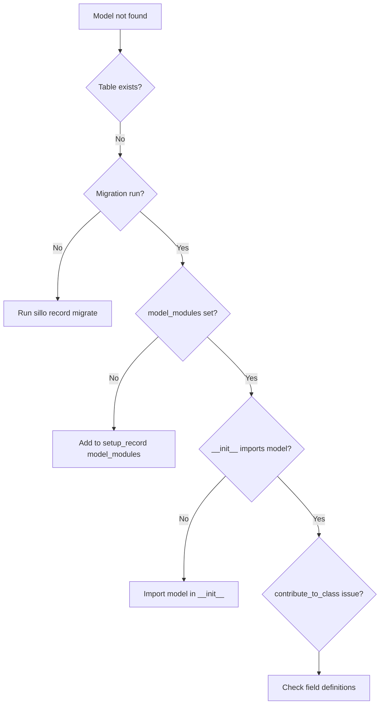
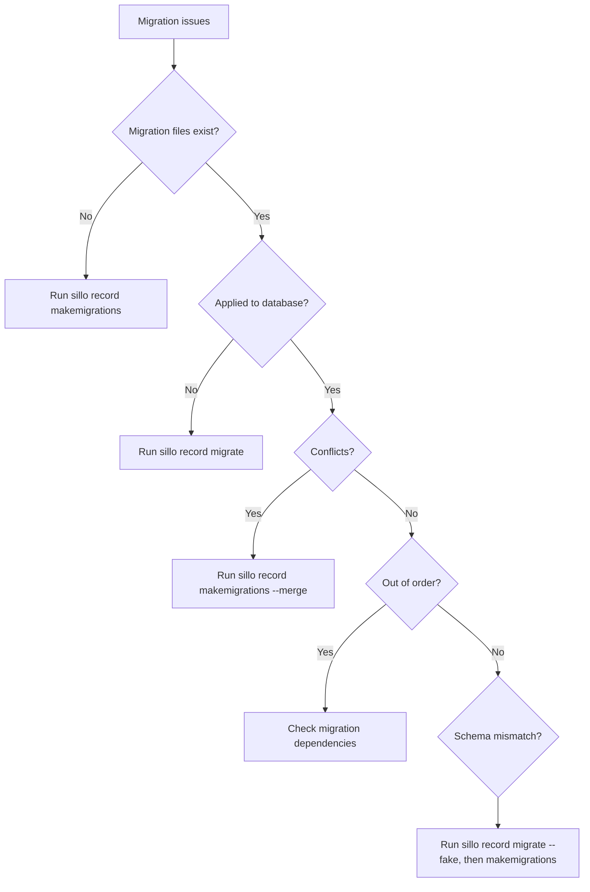
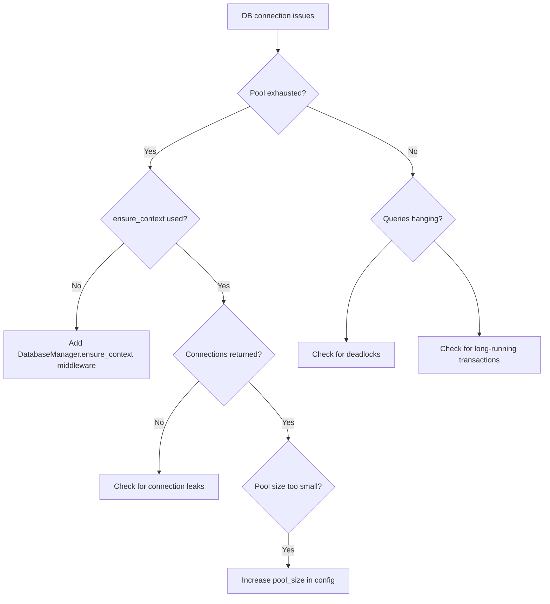
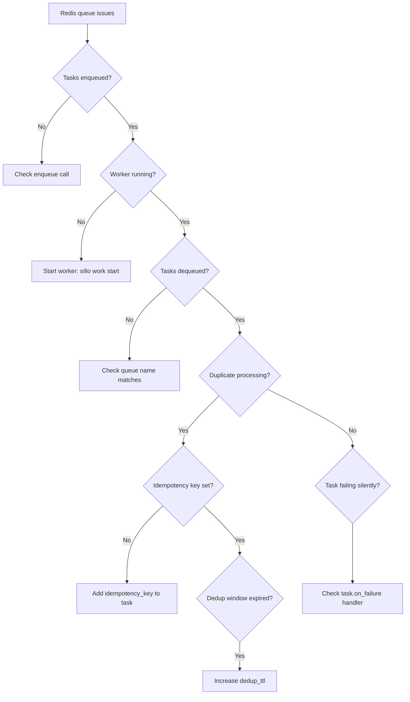
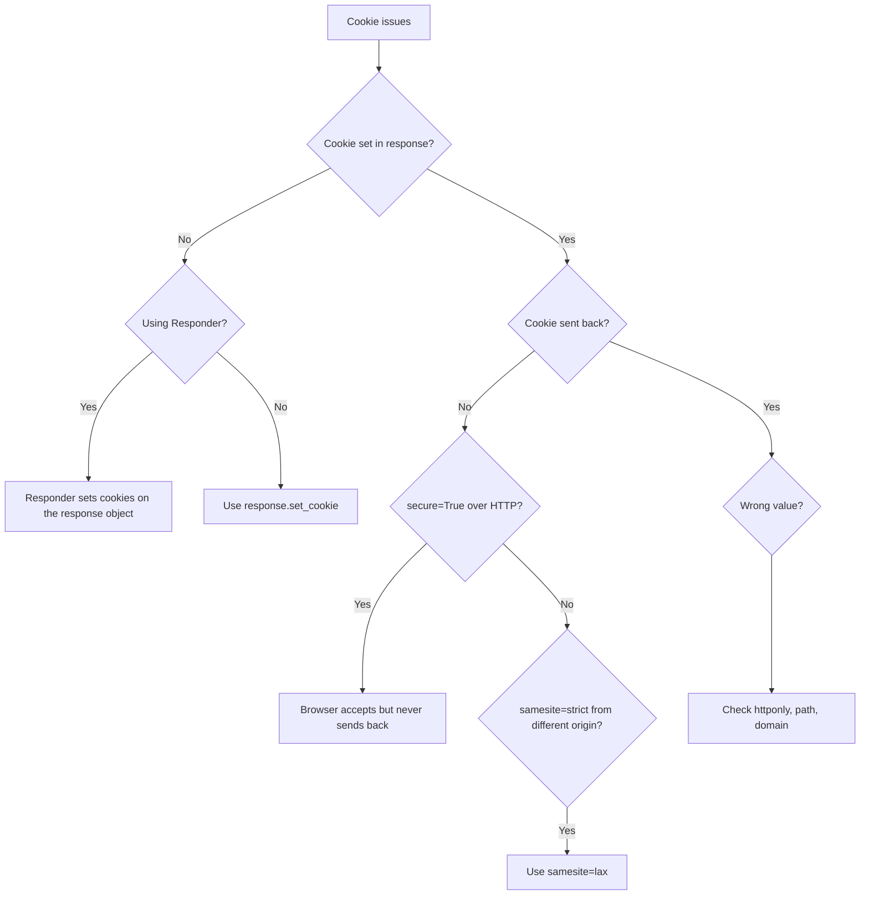

> **Scope**: Debugging chains for common failure modes in Sillo applications.
> **Source**: `/Users/admin/sillo.build/core/sillo/`

---

## 1. Request Not Reaching Handler

### Symptom

A request to a route returns 404, 405, or the handler never executes.

### Debugging Chain



### 1.1 Middleware Order

**Problem**: Middleware is registered in the wrong order.

**Diagnosis**: Check the order of `app.use()` calls.  Remember inside-out
ordering: the first middleware added is the outermost wrapper.

```python
# WRONG: Session runs before auth
app.use(SessionMiddleware)
app.use(AuthenticationMiddleware)

# RIGHT: Auth runs first (outermost)
app.use(AuthenticationMiddleware)
app.use(SessionMiddleware)
```

**File**: `core/sillo/core/routing/base.py` -- `build_middleware_stack`

### 1.2 Mounted Router Swallowing

**Problem**: A mounted router matches the path but has no handler for it.

**Diagnosis**: Check if a `mount_router` or `frontend` call is catching the
request before it reaches the intended route.

```python
# This catches ALL paths under /static
app.frontend("/static", directory="dist")

# This route is unreachable if /static catches it first
@app.get("/static/api")
async def static_api():
    ...
```

**File**: `core/sillo/core/routing/router.py` -- `__call__`

### 1.3 Match Status

**Problem**: The route exists but the path doesn't match.

**Diagnosis**: Check the `MatchStatus` enum:

| Status | Meaning |
|---|---|
| `FULL` | Path matched completely |
| `PARTIAL` | Path matched but has remaining segments |
| `NONE` | Path did not match |

**File**: `core/sillo/core/routing/router.py` -- `Route.match`

---

## 2. Auth Failing

### Symptom

A protected route returns 401 when the user should be authenticated.

### Debugging Chain



### 2.1 Middleware vs useAuth

**Problem**: Auth middleware is registered but `useAuth` gate still fails.

**Diagnosis**: The `useAuth` gate and the middleware are separate systems.
The middleware sets `request.user` from the backend.  The gate checks
permissions on the already-set user.

```python
# Middleware authenticates (sets request.user)
app.use(AuthenticationMiddleware(backend=JWTBackend(...)))

# Gate checks permissions (on the set user)
@app.get("/admin", auth=useAuth(permissions=["admin"]))
async def admin(request):
    ...
```

**File**: `core/sillo/auth/use_auth.py` -- `useAuth.authenticate`

### 2.2 Scope Keys

**Problem**: `useAuth` rejects a valid user because the scope key doesn't
match.

**Diagnosis**: Each backend has a `name` attribute (default: `"auth"`).
`useAuth` checks that the user's scope matches one of the registered scheme
names.

```python
# Backend name is "jwt"
backend = JWTBackend(...)
# useAuth must reference the same name
auth = useAuth(schemes=["jwt"])
```

**File**: `core/sillo/auth/use_auth.py` -- `_check_schemes`

### 2.3 Legacy Aliases

**Problem**: Using old-style auth configuration that doesn't work with
the new system.

**Diagnosis**: Check if you're using the legacy `auth` parameter on
`SilloApp` vs the new `AuthenticationMiddleware`.

```python
# Legacy (still works but limited)
app = SilloApp(auth=JWTBackend(...))

# New (recommended)
app.use(AuthenticationMiddleware(backend=JWTBackend(...)))
```

**File**: `core/sillo/application.py` -- `_register_auth`

---

## 3. 401 vs 403

### Symptom

Getting 401 when expecting 403, or vice versa.

### Decision Tree



### 401 Unauthorized

- No credentials provided.
- Credentials are invalid (expired token, wrong password).
- The backend's `authenticate()` returns `None`.

### 403 Forbidden

- Credentials are valid.
- The user lacks the required permission.
- The user is not in the required group.

**File**: `core/sillo/auth/use_auth.py` -- `authenticate` method

---

## 4. Session Issues

### Symptom

Session data is lost between requests, or session middleware interferes
with other middleware.

### Debugging Chain



### 4.1 Middleware Order

**Problem**: Session middleware runs in the wrong order.

**Diagnosis**: `SessionMiddleware` must be registered **after**
`AuthenticationMiddleware` so it runs **before** (inside-out ordering).

```python
# RIGHT: Session runs first (innermost)
app.use(AuthenticationMiddleware)  # Registered first
app.use(SessionMiddleware)         # Registered second, runs first
```

**File**: `core/sillo/session/middleware.py` -- `SessionMiddleware`

### 4.2 Secure Default

**Problem**: Session cookie not sent over HTTP (localhost development).

**Diagnosis**: The session cookie defaults to `secure=True`.  Over HTTP,
the browser accepts the cookie but never sends it back.

```python
# Fix for localhost development
SessionMiddleware(config=SessionConfig(secure=False))
```

**File**: `core/sillo/session/config.py` -- `SessionConfig`

### 4.3 request.app vs base_app

**Problem**: Accessing app state fails because `request.app` is the
middleware-wrapped app, not the root app.

**Diagnosis**: Use `request.base_app` to access the unwrapped root app.

```python
# WRONG: request.app is the middleware stack
db = request.app.state["record"]

# RIGHT: request.base_app is the root app
db = request.base_app.state["record"]
```

**File**: `core/sillo/core/http/request.py` -- `HTTPConnection.app`,
`HTTPConnection.base_app`

---

## 5. Model Not Found

### Symptom

A model query fails with `OperationalError: no such table` or the model
is not discovered by the ORM.

### Debugging Chain



### 5.1 model_modules

**Problem**: The model exists but `setup_record` doesn't discover it.

**Diagnosis**: `setup_record` requires `model_modules` to know which modules
to scan for models.

```python
# WRONG: model not discovered
setup_record(app, config)

# RIGHT: explicitly list the module
setup_record(app, config, model_modules=["database.models"])
```

**File**: `core/sillo/record/manager.py` -- `setup_record`

### 5.2 __init__ Import

**Problem**: The module is listed in `model_modules` but the model class
isn't importable.

**Diagnosis**: The model must be imported in the module's `__init__.py` or
be directly importable from the module path.

```python
# database/models/__init__.py
from .user import User
from .post import Post
```

**File**: `core/sillo/record/manager.py` -- `register_models`

### 5.3 contribute_to_class

**Problem**: A custom field or mixin breaks model discovery.

**Diagnosis**: Check that custom fields implement `contribute_to_class`
correctly.

**File**: `core/sillo/record/fields.py` -- custom field implementations

---

## 6. Migration Issues

### Symptom

Migrations fail, are out of order, or don't apply.

### Debugging Chain



### Common Issues

1. **Migration not created**: Run `sillo record makemigrations`.
2. **Migration not applied**: Run `sillo record migrate`.
3. **Conflicting migrations**: Run `sillo record makemigrations --merge`.
4. **Schema drift**: Run `sillo record migrate --fake`, then
   `sillo record makemigrations`.

**File**: `core/sillo/record/commands/` -- migration command implementations

---

## 7. Database Connections

### Symptom

`OperationalError: connection pool exhausted` or database queries hang.

### Debugging Chain



### 7.1 ensure_context

**Problem**: Database connections are not properly managed.

**Diagnosis**: `DatabaseManager.ensure_context` should be registered as
middleware to ensure connections are opened and closed per request.

```python
db = setup_record(app, config)
app.use(db.ensure_context)
```

**File**: `core/sillo/record/manager.py` -- `DatabaseManager.ensure_context`

### 7.2 Connection Leaks

**Problem**: Connections are opened but never returned to the pool.

**Diagnosis**: Check for:
- Missing `await conn.close()` in custom code.
- Long-running transactions that hold connections.
- Background tasks that open connections but don't close them.

---

## 8. Redis Queue

### Symptom

Tasks are not being processed, or tasks are processed multiple times.

### Debugging Chain



### 8.1 Idempotency

**Problem**: Tasks are processed multiple times.

**Diagnosis**: Set an idempotency key on the task to prevent duplicate
processing.

```python
await my_task.enqueue(
    args=[...],
    idempotency_key="unique-key-for-this-task"
)
```

**File**: `core/sillo/work/backends.py` -- `is_duplicate`

### 8.2 visibility_timeout

**Problem**: Tasks appear to be stuck (not processing, not failing).

**Diagnosis**: The `visibility_timeout` controls how long a dequeued task
is hidden from other workers.  If the worker crashes, the task becomes
visible again after the timeout.

```python
# Default is 300 seconds (5 minutes)
RedisBackend(url="redis://...", visibility_timeout=600)
```

**File**: `core/sillo/work/backends.py` -- `RedisBackend`

---

## 9. OpenAPI

### Symptom

OpenAPI document is missing routes, has wrong security schemes, or
`strict_security` raises errors at startup.

### Debugging Chain

```mermaid
graph TD
    A[OpenAPI issues] --> B{Routes missing?}
    B -->|Yes| C{exclude_from_schema=True?}
    C -->|Yes| D[Remove exclude_from_schema flag]
    C -->|No| E{Router tags set?}
    E -->|No| F[Add tags to router]
    B -->|No| G{Security wrong?}
    G -->|Yes| H{strict_security enabled?}
    H -->|Yes| I{Startup error?}
    I -->|Yes| J[Fix scheme names in useAuth]
    I -->|No| K[Check backend.describe()]
    H -->|No| L[Check useAuth schemes parameter]
    G -->|No| M{Schema incomplete?}
    M --> N[Check response_model, request_model]
```

### 9.1 strict_security

**Problem**: `strict_security=True` raises an error at startup about
undefined security schemes.

**Diagnosis**: When `strict_security` is enabled, every `useAuth` gate's
scheme names must match a registered backend's `name`.  A legacy label
like `"jwt"` that doesn't match any registered backend is a dangling
reference.

```python
# WRONG: "jwt" is not a registered backend name
auth = useAuth(schemes=["jwt"])

# RIGHT: use the backend's actual name
auth = useAuth(schemes=["bearer"])
```

**File**: `core/sillo/application.py` -- `_check_security`

---

## 10. Cookies

### Symptom

Cookies are not set, not sent back, or have wrong attributes.

### Debugging Chain



### 10.1 Responder vs BaseResponse

**Problem**: Cookie set via `Responder` doesn't appear in the response.

**Diagnosis**: `Responder` is a fluent builder that creates a new
`BaseResponse`.  Cookies must be set on the response object, not the
Responder.

```python
# WRONG: cookie set on Responder (not a response)
response.cookie("session", "abc")

# RIGHT: cookie set on the built response
resp = response.json({"ok": True})
resp.set_cookie("session", "abc")
```

**File**: `core/sillo/core/http/response.py` -- `Responder`

### 10.2 Secure Default

**Problem**: Cookie not sent over HTTP (localhost development).

**Diagnosis**: `BaseResponse.set_cookie` defaults to `secure=False`.
But some middleware (like SessionMiddleware) may set `secure=True`.

```python
# Explicit override for localhost
response.set_cookie("session", "abc", secure=False)
```

**File**: `core/sillo/core/http/response.py` -- `BaseResponse.set_cookie`

---

*End of document 47-DEBUGGING.md*
