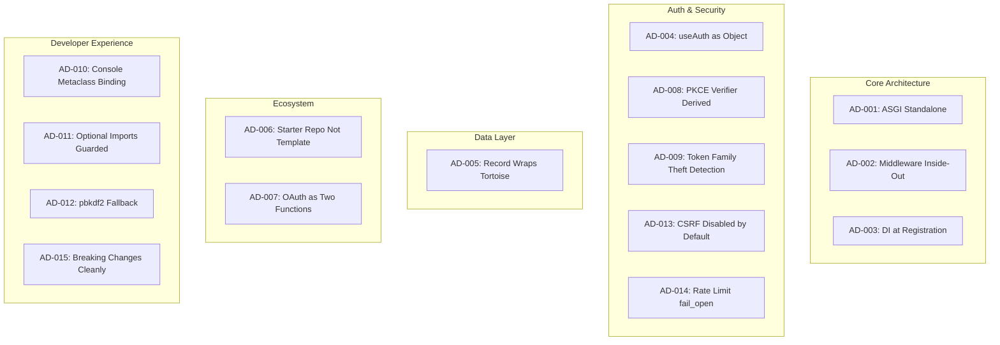

> **Scope**: 15 architectural decisions with problem/context/constraints/
> chosen solution/trade-offs.
> **Source**: `/Users/admin/sillo.build/core/sillo/`, `/Users/admin/sillo.build/oauth/`,
> `/Users/admin/sillo.build/inertia/`, `/Users/admin/sillo.build/start/`

---

## Decision Map



---

## AD-001: ASGI Standalone

### Problem

Should Sillo be a WSGI framework, an ASGI framework, or support both?

### Context

- Python web frameworks historically used WSGI (Django, Flask).
- ASGI enables async, WebSockets, HTTP/2, and streaming.
- Dual-mode frameworks (WSGI+ASGI) carry significant complexity (e.g.,
  Django's async support required years of work).
- Sillo targets real-time applications (WebSockets, SSE, streaming) as a
  first-class use case.

### Constraints

- Must support WebSockets natively.
- Must support async database drivers (aiosqlite, asyncpg).
- Must support streaming responses.
- Cannot require a separate WSGI server for production.

### Chosen Solution

ASGI-only.  Sillo is an ASGI application that can be served by uvicorn,
hypercorn, or daphne.  No WSGI compatibility layer.

### Trade-offs

| Advantage | Disadvantage |
|---|---|
| Native async/await everywhere | Cannot run on gunicorn's sync workers |
| WebSockets without workarounds | Requires async-aware database drivers |
| Streaming responses are natural | Slightly higher learning curve for sync-Python developers |
| HTTP/2 support via server | Fewer deployment options than WSGI |

### Evidence

- `SilloApp.__call__` is `(scope, receive, send) -> None` (ASGI signature).
- `SilloApp.handle_lifespan` handles ASGI lifespan events.
- All middleware is async: `async def __call__(self, request, response, call_next)`.

---

## AD-002: Middleware Inside-Out

### Problem

How should middleware ordering work?

### Context

- Django uses "outside-in" for request, "inside-out" for response.
- Express.js uses "outside-in" for everything.
- Sillo's middleware wraps the route handler, so the first middleware added
  is the outermost wrapper.

### Constraints

- Middleware must be able to modify both request and response.
- The order must be predictable and intuitive.
- Middleware must be able to short-circuit (return early).

### Chosen Solution

Inside-out ordering.  When you write:

```python
app.use(AuthenticationMiddleware)
app.use(SessionMiddleware)
```

The execution order on **request** is: AuthenticationMiddleware ->
SessionMiddleware -> handler.  This is "inside-out" because the last-added
middleware runs closest to the handler.

This matches the mental model: "I added auth first, then session.  Auth
runs first."

### Trade-offs

| Advantage | Disadvantage |
|---|---|
| Intuitive ordering (first added = first executed) | Different from Django's convention |
| Simple `build_middleware_stack` implementation | Requires careful documentation |
| Each middleware wraps the next (clean nesting) | |

### Evidence

```python
# core/sillo/core/routing/base.py
def build_middleware_stack(self, app):
    for middleware in reversed(self.middleware):
        app = middleware(app)
    return app
```

The `reversed()` call ensures the first-added middleware is the outermost
wrapper.

---

## AD-003: DI at Registration

### Problem

How should dependency injection work?

### Context

- FastAPI uses function signature inspection at request time.
- Django uses explicit function calls.
- Sillo wants to support both explicit and implicit dependency resolution.

### Constraints

- Must support async dependencies.
- Must support dependency caching (same dep resolved once per request).
- Must support nested dependencies (dep A depends on dep B).
- Must not require decorators on every function.

### Chosen Solution

DI is resolved at **route registration time**, not at request time.  The
`Depend` class is a marker that tells the router to resolve the dependency:

```python
async def get_user(request) -> User:
    ...

@app.get("/profile")
async def profile(user: User = Depend(get_user)):
    return {"user": user.name}
```

The `Dependant` dataclass captures the full resolution plan (dependencies,
validators, extractors) at registration time.

### Trade-offs

| Advantage | Disadvantage |
|---|---|
| Fast request-time resolution (plan is pre-computed) | Cannot dynamically change deps at runtime |
| Type checking works at registration | More complex registration logic |
| Clear error messages at startup | |

### Evidence

- `core/sillo/core/dependencies/base.py`: `get_dependant(call, name)` builds the plan.
- `core/sillo/core/dependencies/base.py`: `solve_dependencies(dependant, request)` executes it.

---

## AD-004: useAuth as Object

### Problem

How should route-level auth gating work?

### Context

- Django uses decorators (`@login_required`).
- FastAPI uses `Security()` dependency.
- Sillo wants to support multiple auth backends and permissions.

### Constraints

- Must support multiple backends per route.
- Must support permission checks.
- Must generate OpenAPI security requirements.
- Must work as a dependency (not a decorator).

### Chosen Solution

`useAuth` is a class that acts as both a dependency and an OpenAPI security
descriptor:

```python
@app.get("/admin", auth=useAuth(permissions=["admin"]))
async def admin_dashboard(request):
    ...
```

The class:
- Stores permissions, backends, user model, scheme requirements.
- `authenticate(request)` runs the auth pipeline.
- `security_requirements()` generates OpenAPI security entries.

### Trade-offs

| Advantage | Disadvantage |
|---|---|
| Composable (permissions + backends + schemes) | More verbose than a simple decorator |
| OpenAPI integration is automatic | Class-as-dependency is unusual |
| Works with multiple backends | |

### Evidence

- `core/sillo/auth/use_auth.py`: `class useAuth` with `__init__`, `authenticate`, `security_requirements`.

---

## AD-005: Record Wraps Tortoise

### Problem

Should Sillo build its own ORM or wrap an existing one?

### Context

- Building a full ORM is a multi-year effort.
- Tortoise ORM is the most mature async Python ORM.
- Sillo wants Eloquent-style convenience methods (scopes, casting, soft deletes).

### Constraints

- Must support async operations.
- Must support migrations.
- Must provide a nicer API than raw Tortoise.
- Must not fork Tortoise.

### Chosen Solution

`sillo.record` wraps Tortoise ORM with:
- `Model` extending Tortoise's `Model` with `HasCasts`, `HasScopes`.
- `RecordManager` / `RecordQuerySet` adding scope support.
- Custom fields (`CreatedAtField`, `SlugField`, etc.) built on Tortoise fields.
- `DatabaseManager` wrapping Tortoise's init/close.

The long-term plan is `records-orm` (pypika-based) to replace the Tortoise
dependency.

### Trade-offs

| Advantage | Disadvantage |
|---|---|
| Immediate access to Tortoise's maturity | Tortoise's API leaks through |
| Migrations work out of the box | Cannot fix Tortoise bugs without forking |
| Eloquent-style API on top | Two ORM layers (Tortoise + Record) |

### Evidence

- `core/sillo/record/models.py`: `class Model(_TortoiseModel, HasCasts, HasScopes)`.
- `core/sillo/record/manager.py`: `DatabaseManager` wraps Tortoise init.

---

## AD-006: Starter Repo Not Template

### Problem

How should new Sillo projects be created?

### Context

- Cookiecutter/CoPoier generate projects from templates.
- `rails new` generates a project from built-in templates.
- Both approaches produce a skeleton that needs scaffolding.

### Constraints

- Must produce a working application immediately.
- Must not require a template engine.
- Must be easy to update the starter independently.
- Must not embed the starter in the CLI package.

### Chosen Solution

`sillo-start` fetches a real GitHub repository (not a template), strips the
top-level directory, and applies targeted string substitutions.  The default
starter is `sillohq/starter`.

### Trade-offs

| Advantage | Disadvantage |
|---|---|
| Starter is a real, working app | Depends on GitHub availability |
| Starter can be updated independently | String substitution is fragile |
| No template engine dependency | Cannot generate arbitrary file structures |
| User can fork and customize the starter | |

### Evidence

- `start/sillo_start/project/template.py`: `fetch()` downloads tarball from `codeload.github.com`.
- `start/sillo_start/project/template.py`: `personalise()` applies targeted substitutions.

---

## AD-007: OAuth as Two Functions

### Problem

How should OAuth be implemented in Sillo?

### Context

- Django-allauth provides a full OAuth stack with models, views, templates.
- Most OAuth libraries are framework-specific.
- Sillo wants OAuth to be a library, not a framework feature.

### Constraints

- Must work without a router.
- Must work without middleware.
- Must not require a database.
- Must support multiple providers.

### Chosen Solution

`sillo-oauth` exposes two public functions:

```python
# Step 1: Build the redirect URL
auth_url = authorize_url(provider, redirect_uri="/callback")

# Step 2: Handle the callback
profile = await exchange(provider, request)
```

No router, no middleware, no storage.  The caller decides how to redirect,
where to store the cookie, and what to do with the profile.

### Trade-offs

| Advantage | Disadvantage |
|---|---|
| Framework-agnostic (works with any ASGI framework) | Caller must handle cookie/session themselves |
| No database required | More boilerplate for common patterns |
| Composable (two functions, not a monolith) | No built-in account linking UI |
| Easy to test (pure functions + mock transport) | |

### Evidence

- `oauth/sillo_oauth/flow.py`: `authorize_url()` and `exchange()`.
- `oauth/sillo_oauth/flow.py`: `complete()` is the request-free form.

---

## AD-008: PKCE Verifier Derived

### Problem

How should PKCE verifiers be stored?

### Context

- Standard PKCE: client generates a random verifier, stores it, sends the
  challenge, then sends the verifier on callback.
- This requires server-side storage (session, database, or cookie).

### Constraints

- Must not require server-side storage.
- Must be deterministic (same inputs -> same verifier).
- Must be secure (attacker cannot forge a verifier).

### Chosen Solution

The verifier is derived via HMAC from the state and the application secret:

```
verifier = base64url(HMAC-SHA256(secret, "sillo-oauth/pkce/v1:" + state))
```

- **Deterministic**: Neither the redirect step nor the exchange step stores it.
- **Domain separator** `"sillo-oauth/pkce/v1:"` prevents collision with other
  HMAC uses.
- **43 characters**: Bottom of RFC 7636's 43-128 range.

### Trade-offs

| Advantage | Disadvantage |
|---|---|
| No server-side storage needed | Verifier is tied to the application secret |
| Deterministic (testable) | Changing the secret invalidates in-flight logins |
| Same secret produces same verifier | 43 chars (minimum length) |
| Domain separator prevents collisions | |

### Evidence

- `oauth/sillo_oauth/state.py`: `derive_verifier(state, secret)` with `_PKCE_INFO` domain separator.

---

## AD-009: Token Family Theft Detection

### Problem

How should JWT refresh token reuse be detected?

### Context

- If a refresh token is stolen and used, the legitimate user should be
  alerted and the token family invalidated.
- Token rotation (new refresh token on each use) limits the window of
  opportunity.

### Constraints

- Must detect reuse of a compromised refresh token.
- Must invalidate the entire token family on detection.
- Must not require a database for token storage.

### Chosen Solution

Each refresh token belongs to a "family" (identified by a family ID).  On
refresh:
1. Issue a new refresh token with the same family ID.
2. Invalidate the old refresh token.
3. If the old token is used again, the entire family is invalidated.

This is implemented in the JWT backend's token verification logic.

### Trade-offs

| Advantage | Disadvantage |
|---|---|
| Detects token theft | Requires token storage (Redis or database) |
| Limits damage from compromised tokens | Adds complexity to refresh flow |
| Automatic family invalidation | |

### Evidence

- `core/sillo/auth/jwt_auth/tokens.py`: `TokenForUser` with `access_token`, `refresh_token`, `token_pair`.
- `core/sillo/auth/jwt_auth/backend.py`: JWT backend with refresh logic.

---

## AD-010: Console Metaclass Binding

### Problem

How should console commands discover their input/output?

### Context

- Django management commands use `self.stdout` and `self.stderr`.
- Typer uses function parameters.
- Sillo wants commands to be classes with rich output methods.

### Constraints

- Commands must have access to input, output, and prompt.
- Commands must be testable (injectable I/O).
- Commands must not require explicit constructor calls.

### Chosen Solution

The `Command` class receives `input`, `output`, `prompt`, and `console` in its
constructor.  The `Console` class resolves commands and injects these:

```python
class Command:
    def __init__(self, input, output, prompt, console=None):
        self._input = input
        self._output = output
        self._prompt = prompt
        self._console = console
```

### Trade-offs

| Advantage | Disadvantage |
|---|---|
| Rich output methods (line, table, panel, etc.) | Constructor injection is implicit |
| Testable (mock input/output) | More complex than function-based commands |
| Consistent API across all commands | |

### Evidence

- `core/sillo/console/command.py`: `class Command` with `line`, `table`, `panel`, etc.
- `core/sillo/console/console.py`: `class Console` with `resolve`, `run`.

---

## AD-011: Optional Imports Guarded at Use Time

### Problem

How should optional dependencies be handled?

### Context

- Sillo depends on several optional packages (Tortoise, Redis, Jinja2, etc.).
- Requiring all of them would bloat the install.
- Importing them at module level would fail if not installed.

### Constraints

- Must not require optional packages at install time.
- Must give clear error messages when a missing package is used.
- Must not hide import errors.

### Chosen Solution

Optional imports are guarded at **use time**, not at import time:

```python
# This works even if tortoise is not installed
from sillo.record import Model  # Model is defined, but not usable

# This fails with a clear error if tortoise is not installed
await Model.all()  # ImportError: tortoise-orm is required
```

The guard is in the module's `__init__.py` or in the class that uses the
optional dependency.

### Trade-offs

| Advantage | Disadvantage |
|---|---|
| Install is lightweight | Import errors happen at runtime, not import time |
| Clear error messages | More complex module structure |
| Optional features are truly optional | |

### Evidence

- `records-orm/records_orm/backends/__init__.py`: `get_backend()` catches `ImportError` for postgres/mysql.
- `core/sillo/record/manager.py`: `setup_record()` guards Tortoise imports.

---

## AD-012: pbkdf2 Fallback

### Problem

What password hashing algorithm should be used?

### Context

- bcrypt is the traditional choice but requires `bcrypt` package.
- argon2 is the modern choice but requires `argon2-cffi` package.
- pbkdf2 is in the stdlib (`hashlib.pbkdf2_hmac`).

### Constraints

- Must work without external dependencies.
- Must be secure enough for production use.
- Must support upgrading to stronger algorithms.

### Chosen Solution

pbkdf2_sha256 as the default, with bcrypt and argon2 as optional upgrades:

```python
# Default (no external deps)
from sillo.hashing import hash_password, verify_password

# With bcrypt upgrade
pip install sillo-framework[bcrypt]
```

The hashing module detects which backends are available and uses the strongest
one.  Passwords are prefixed with the algorithm identifier so they can be
verified regardless of which backend was used to create them.

### Trade-offs

| Advantage | Disadvantage |
|---|---|
| Zero external dependencies | pbkdf2 is weaker than bcrypt/argon2 |
| Works out of the box | Users must opt-in to stronger algorithms |
| Algorithm upgrade path exists | |

### Evidence

- `core/sillo/hashing/`: `hash_password`, `verify_password`, `UNUSABLE_PASSWORD_PREFIX`.

---

## AD-013: CSRF Disabled by Default

### Problem

Should CSRF protection be enabled by default?

### Context

- Django enables CSRF by default (requires middleware + template tag).
- FastAPI does not include CSRF protection.
- Sillo targets API-first applications where CSRF is less relevant.

### Constraints

- Must not break API-only applications.
- Must be easy to enable for web applications.
- Must not require template tags.

### Chosen Solution

CSRF protection is **disabled by default**.  It can be enabled via middleware:

```python
from sillo.security.csrf import CSRFMiddleware

app.use(CSRFMiddleware(secret_key="..."))
```

When enabled, it checks the `X-CSRF-Token` header (for AJAX) or form field
(for traditional forms).

### Trade-offs

| Advantage | Disadvantage |
|---|---|
| API-only apps work out of the box | Web apps must remember to enable it |
| No template tags required | Less secure by default for web apps |
| Explicit opt-in is clear | |

### Evidence

- `core/sillo/security/csrf/`: CSRF middleware implementation.
- Shield middleware includes CSRF headers but does not enforce tokens by default.

---

## AD-014: Rate Limit fail_open

### Problem

What should happen when the rate limit backend is unavailable?

### Context

- Rate limiting typically uses Redis or an in-memory store.
- If the store is unavailable, the application must decide whether to:
  - **fail_open**: Allow all requests (availability over protection).
  - **fail_closed**: Deny all requests (protection over availability).

### Constraints

- Must not take down the application if Redis is unavailable.
- Must not allow unlimited requests if the store is down.
- Must be configurable.

### Chosen Solution

Rate limiting **fails open** by default.  If the backend is unavailable, all
requests are allowed through.  This prioritizes availability over protection.

```python
# Default (fail_open)
app.use(RateLimitMiddleware(...))

# Strict (fail_closed)
app.use(RateLimitMiddleware(..., fail_open=False))
```

### Trade-offs

| Advantage | Disadvantage |
|---|---|
| Application stays up if Redis goes down | Attackers can bypass rate limiting during outages |
| Availability is prioritized | Not suitable for high-security endpoints |
| Configurable per use case | |

### Evidence

- `core/sillo/security/ratelimit/`: Rate limit middleware with `fail_open` option.

---

## AD-015: Breaking Changes Taken Cleanly

### Problem

How should breaking changes be handled during alpha?

### Context

- Sillo is pre-1.0 (alpha releases).
- The API is still evolving.
- Users expect alpha software to have breaking changes.

### Constraints

- Must not accumulate technical debt from backward compatibility.
- Must document every breaking change.
- Must provide migration paths where possible.

### Chosen Solution

During alpha, breaking changes are taken **cleanly**, no deprecation warnings,
no backward-compatible shims. The changelog documents every breaking change
with a migration guide.

Example from sillo-inertia 0.0.1a4:
- Old: `inertia.render(request, response, "Dashboard", {...})`
- New: `inertia.render("Dashboard", {...})`
- Detection: Legacy guard raises `TypeError` with a helpful message.

### Trade-offs

| Advantage | Disadvantage |
|---|---|
| Clean API surface | Users must update their code |
| No accumulated deprecation debt | May frustrate early adopters |
| Clear migration path | |

### Evidence

- `inertia/sillo_inertia/adapter.py`: Legacy guard in `render()` with `_WRONG_ARGUMENTS` template.
- `CHANGELOG.md` in each package documents breaking changes.

---

*End of document 46-DECISIONS.md*
