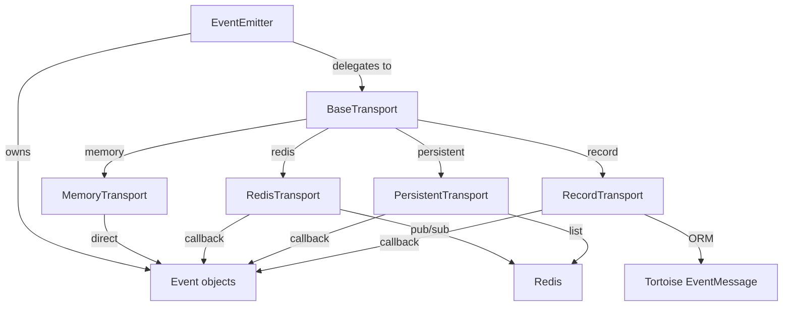
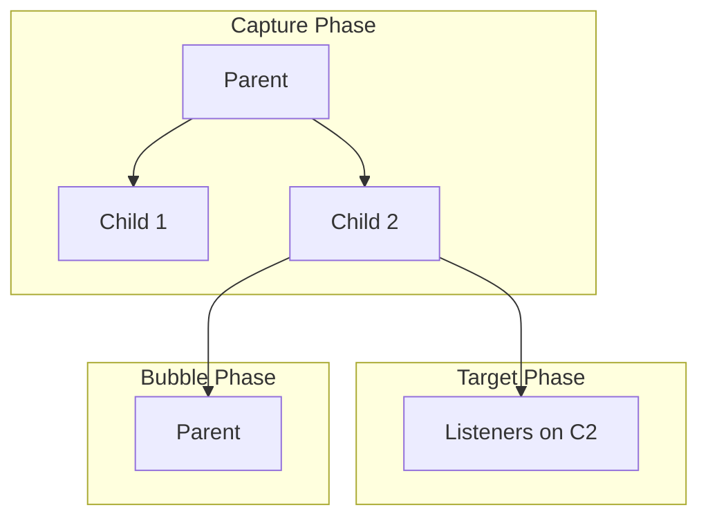

**Module:** `sillo.events`
**Source files:**
- `/Users/admin/sillo.build/core/sillo/events/core.py` (866 lines)
- `/Users/admin/sillo.build/core/sillo/events/emitter.py` (691 lines)
- `/Users/admin/sillo.build/core/sillo/events/enums.py` (53 lines)
- `/Users/admin/sillo.build/core/sillo/events/exceptions.py` (98 lines)
- `/Users/admin/sillo.build/core/sillo/events/types.py` (151 lines)
- `/Users/admin/sillo.build/core/sillo/events/mixins.py` (108 lines)
- `/Users/admin/sillo.build/core/sillo/events/transports/__init__.py` (183 lines)
- `/Users/admin/sillo.build/core/sillo/events/transports/base.py` (580 lines)
- `/Users/admin/sillo.build/core/sillo/events/transports/memory.py` (77 lines)
- `/Users/admin/sillo.build/core/sillo/events/transports/redis.py` (263 lines)
- `/Users/admin/sillo.build/core/sillo/events/transports/persistent.py` (288 lines)
- `/Users/admin/sillo.build/core/sillo/events/transports/record.py` (231 lines)

**Version:** 2026-08-11
**Audience:** Core maintainers, framework architects
**Purpose:** Deep documentation of the Event class, EventEmitter, transports, DOM-style propagation, and the full event lifecycle

---

## 1. Overview

The events system provides a **full-featured pub/sub mechanism** with priority-based dispatch, DOM-style capture/bubble propagation, parent-child hierarchies, thread-safe listener management, weak references, cancellation, and pluggable transports (memory, Redis, persistent, ORM-backed).



---

## 2. Enums

**File:** `/Users/admin/sillo.build/core/sillo/events/enums.py` (53 lines)

### 2.1 EventPriority

```python
class EventPriority(Enum):
    HIGHEST = auto()
    HIGH = auto()
    NORMAL = auto()
    LOW = auto()
    LOWEST = auto()
```

Listeners are executed in priority order: `HIGHEST` first, `LOWEST` last.

### 2.2 EventPhase

```python
class EventPhase(Enum):
    CAPTURING = auto()
    BUBBLING = auto()
    AT_TARGET = auto()
```

Mirrors the DOM event propagation model (see Section 6).

---

## 3. Types and Exceptions

### 3.1 EventContext

**File:** `/Users/admin/sillo.build/core/sillo/events/types.py`, line 20

```python
@dataclass
class EventContext:
    timestamp: float
    event_id: str
    source: Any
    phase: EventPhase = EventPhase.AT_TARGET
```

Attached to every trigger invocation. Contains the event ID, timestamp, source event, and current propagation phase.

### 3.2 ListenerType

```python
ListenerType = Union[
    Callable[..., Any],
    ReferenceType[Callable[..., Any]],
    WeakMethod[Callable[..., Any]],
]
```

Listeners can be raw callables, weak references, or weak methods.

### 3.3 EventProtocol

```python
class EventProtocol(Protocol):
    name: str
    listener_count: int
    max_listeners: int
    enabled: bool
    def get_metrics(self) -> dict[str, Any]: ...
```

### 3.4 Exceptions

**File:** `/Users/admin/sillo.build/core/sillo/events/exceptions.py`

```
EventError (base)
├── ListenerAlreadyRegisteredError
├── MaxListenersExceededError
└── EventCancelledError
```

---

## 4. The Event Class

**File:** `/Users/admin/sillo.build/core/sillo/events/core.py` (866 lines)

The `Event` class is the core of the system: 866 lines implementing
priority-based dispatch, DOM-style propagation, thread safety, metrics, and
history.

### 4.1 Constructor

```python
class Event(EventSerializationMixin):
    DEFAULT_MAX_LISTENERS = 100

    def __init__(self, name: str, max_listeners: int | None = None):
        self.name = name
        self._listeners: dict[EventPriority, list[ListenerType]] = {
            EventPriority.HIGHEST: [],
            EventPriority.HIGH: [],
            EventPriority.NORMAL: [],
            EventPriority.LOW: [],
            EventPriority.LOWEST: [],
        }
        self._once_listeners: dict[EventPriority, list[ListenerType]] = { ... }
        self._max_listeners = max_listeners or self.DEFAULT_MAX_LISTENERS
        self._lock = threading.RLock()
        self._parent: Event | None = None
        self._children: list[Event] = []
        self._enabled = True
        self._history: list[dict[str, Any]] = []
        self._metrics: dict[str, Any] = {
            "trigger_count": 0,
            "total_listeners_executed": 0,
            "average_execution_time": 0.0,
        }
```

**Internal data structures:**

| Structure | Type | Purpose |
|-----------|------|---------|
| `_listeners` | `dict[EventPriority, list]` | Persistent listeners by priority |
| `_once_listeners` | `dict[EventPriority, list]` | One-shot listeners by priority |
| `_lock` | `threading.RLock` | Thread-safe listener management |
| `_parent` | `Event \| None` | Parent in hierarchy |
| `_children` | `list[Event]` | Children (weak references) |
| `_enabled` | `bool` | Dispatch on/off switch |
| `_history` | `list[dict]` | Last 100 trigger records |
| `_metrics` | `dict` | Running performance counters |

### 4.2 Properties

| Property | Type | Description |
|----------|------|-------------|
| `listener_count` | `int` | Total listeners (persistent + once) across all priorities |
| `max_listeners` | `int` | Upper bound on listeners (default 100) |
| `enabled` | `bool` | Whether dispatch is active |
| `parent` | `Event \| None` | Parent event in hierarchy |
| `children` | `list[Event]` | Shallow copy of children list |

### 4.3 Hierarchy Management

```python
def add_child(self, child: "Event"):
    child.parent = self

def remove_child(self, child: "Event"):
    if child in self._children:
        child.parent = None
```

Parent-child relationships enable capture/bubble propagation. Children are stored as weak-reference proxies to prevent reference cycles.

---

## 5. Listener Registration

### 5.1 `listen()`: Persistent Listener

```python
def listen(
    self,
    func: Callable[..., Any] | None = None,
    *,
    priority: EventPriority = EventPriority.NORMAL,
    weak_ref: bool = False,
) -> Callable[..., Any]:
```

Can be used as:
- Bare decorator: `@event.listen`
- Parameterized decorator: `@event.listen(priority=EventPriority.HIGH)`
- Direct call: `event.listen(my_func)`

### 5.2 `once()`: One-Shot Listener

```python
def once(
    self,
    func: Callable[..., Any] | None = None,
    *,
    priority: EventPriority = EventPriority.NORMAL,
    weak_ref: bool = False,
) -> Callable[..., Any]:
```

Same API as `listen()` but the listener is removed after the first invocation.

### 5.3 `_add_listener()`: Internal Registration

```python
def _add_listener(self, listener, *, priority=EventPriority.NORMAL, once=False, weak_ref=False):
    with self._lock:
        if self.listener_count >= self._max_listeners:
            raise MaxListenersExceededError(...)

        container = self._once_listeners if once else self._listeners
        for existing in container[priority]:
            if self._listeners_equal(existing, listener):
                raise ListenerAlreadyRegisteredError(...)

        if weak_ref:
            if inspect.ismethod(listener):
                wrapped_listener = WeakMethod(listener)
            else:
                wrapped_listener = ref(listener)
        else:
            wrapped_listener = listener

        container[priority].append(wrapped_listener)
```

**Validation:**
1. Max listener check: raises `MaxListenersExceededError`
2. Duplicate check: raises `ListenerAlreadyRegisteredError`
3. Optional weak reference wrapping

### 5.4 `remove_listener()` and `remove_all_listeners()`

```python
def remove_listener(self, listener):
    with self._lock:
        for priority in EventPriority:
            self._listeners[priority] = [
                l for l in self._listeners[priority]
                if not self._listeners_equal(l, listener)
            ]
            self._once_listeners[priority] = [
                l for l in self._once_listeners[priority]
                if not self._listeners_equal(l, listener)
            ]

def remove_all_listeners(self):
    with self._lock:
        for priority in EventPriority:
            self._listeners[priority].clear()
            self._once_listeners[priority].clear()
```

### 5.5 `_listeners_equal()`: Weak Reference Resolution

```python
def _listeners_equal(self, listener1, listener2) -> bool:
    if listener1 == listener2:
        return True

    l1 = listener1() if isinstance(listener1, (ref, WeakMethod)) else listener1
    l2 = listener2() if isinstance(listener2, (ref, WeakMethod)) else listener2

    if l1 is None or l2 is None:
        return False

    if hasattr(l1, "__wrapped__"):
        l1 = l1.__wrapped__
    if hasattr(l2, "__wrapped__"):
        l2 = l2.__wrapped__

    return l1 == l2
```

Resolves weak references and unwraps decorator chains before comparison.

---

## 6. DOM-Style Propagation

### 6.1 Three Phases



| Phase | Direction | When |
|-------|-----------|------|
| `CAPTURING` | Parent → Child | Before target phase (if parent exists) |
| `AT_TARGET` | On the target event | Always |
| `BUBBLING` | Child → Parent | After target phase (if not cancelled) |

### 6.2 `trigger()`: Synchronous Dispatch

```python
def trigger(self, *args, **kwargs) -> dict[str, Any]:
    if not self._enabled:
        return {"cancelled": True, "reason": "Event disabled"}

    with self._lock:
        event_id = str(uuid.uuid4())
        context = EventContext(timestamp=time.time(), event_id=event_id, source=self)
        event_data = {
            "args": args, "kwargs": kwargs,
            "context": context, "cancelled": False, "default_prevented": False,
        }

    try:
        # Capture phase (parent to child)
        if self.parent:
            self._propagate(event_data, EventPhase.CAPTURING)

        # Target phase
        execution_stats = self._execute_listeners(event_data, EventPhase.AT_TARGET)

        # Bubble phase (child to parent)
        if not event_data["cancelled"] and self.parent:
            self._propagate(event_data, EventPhase.BUBBLING)

        self._update_metrics(execution_stats)
        self._record_history(event_data, execution_stats)

        if event_data["cancelled"]:
            raise EventCancelledError("Event was cancelled during propagation")

        return {
            "event_id": event_id,
            "listeners_executed": execution_stats["total"],
            "execution_time": execution_stats["total_time"],
            "cancelled": event_data["cancelled"],
        }
    except Exception as e:
        logger.error(f"Error triggering event '{self.name}': {e!s}", exc_info=True)
        raise
```

### 6.3 `trigger_async()`: Async Dispatch

Identical semantics but coroutine listeners are **awaited** (in priority order) rather than fire-and-forget:

```python
async def trigger_async(self, *args, **kwargs) -> dict[str, Any]:
    # ... same structure as trigger() ...
    execution_stats = await self._execute_listeners_async(event_data, EventPhase.AT_TARGET)
    # ...
```

### 6.4 Listener Execution

```python
async def _execute_listeners_async(self, event_data, phase) -> dict[str, Any]:
    start_time = time.time()
    listeners_executed = 0

    with self._lock:
        all_listeners = []
        for priority in EventPriority:
            all_listeners.extend((l, priority, False) for l in self._listeners[priority])
            all_listeners.extend((l, priority, True) for l in self._once_listeners[priority])
        for priority in EventPriority:
            self._once_listeners[priority].clear()

    for listener, priority, _ in all_listeners:
        if event_data.get("cancelled", False):
            break

        actual_listener = listener() if isinstance(listener, (ref, WeakMethod)) else listener
        if actual_listener is None:
            continue

        event_data["context"].phase = phase

        if asyncio.iscoroutinefunction(actual_listener):
            await actual_listener(*event_data["args"], **event_data["kwargs"])
        else:
            actual_listener(*event_data["args"], **event_data["kwargs"])

        listeners_executed += 1
```

**Key behaviors:**
- Once-listeners are cleared **before** execution (under the lock)
- Weak references that have been collected are silently skipped
- `EventCancelledError` stops propagation immediately
- Other exceptions are logged but don't stop the loop

---

## 7. Metrics and History

### 7.1 Metrics

```python
def _update_metrics(self, stats):
    with self._lock:
        self._metrics["trigger_count"] += 1
        self._metrics["total_listeners_executed"] += stats["total"]
        old_avg = self._metrics["average_execution_time"]
        new_count = self._metrics["trigger_count"]
        self._metrics["average_execution_time"] = (
            old_avg * (new_count - 1) + stats["average_time"]
        ) / new_count
```

Uses a running average for execution time.

### 7.2 History

```python
def _record_history(self, event_data, stats):
    with self._lock:
        self._history.append({
            "timestamp": datetime.now().isoformat(),
            "event_id": event_data["context"].event_id,
            "args": str(event_data["args"]),
            "kwargs": str(event_data["kwargs"]),
            "listeners_executed": stats["total"],
            "execution_time": stats["total_time"],
            "cancelled": event_data["cancelled"],
        })
        if len(self._history) > 100:
            self._history.pop(0)
```

Keeps the last 100 trigger records.

### 7.3 Cancellation

```python
def cancel(self):
    raise EventCancelledError("Event propagation cancelled")

def prevent_default(self):
    event_data = inspect.currentframe().f_back.f_locals.get("event_data")
    if event_data:
        event_data["default_prevented"] = True
```

---

## 8. EventEmitter

**File:** `/Users/admin/sillo.build/core/sillo/events/emitter.py` (691 lines)

### 8.1 Constructor

```python
class EventEmitter:
    def __init__(
        self,
        backend: str = "memory",
        *,
        namespace: str = "",
        transport: BaseTransport | None = None,
        on_error=None,
        loop=None,
        **transport_opts,
    ):
        self._events: dict[str, Event] = {}
        self._pending_subscriptions: set[str] = set()
        self._subscription_tasks: set[asyncio.Task] = set()
        self._lock = threading.RLock()
        self._namespace_separator = ":"
        self._backend = backend

        if transport is not None:
            self._transport = transport
        else:
            self._transport = get_transport(backend, namespace=namespace, ...)

        self._transport.bind(self._dispatch)
        self._transport.set_error_handler(on_error or self._default_error_handler)
```

### 8.2 Event Registry

```python
def event(self, event_name: str) -> Event:
    with self._lock:
        if event_name not in self._events:
            self._events[event_name] = Event(event_name)
        return self._events[event_name]
```

Events are lazily created on first access.

### 8.3 `emit()`: Synchronous (Memory Only)

```python
def emit(self, event_name, *args, **kwargs) -> dict[str, Any]:
    if self._backend != "memory":
        raise RuntimeError(f"emit() is synchronous only for backend='memory'")
    return self.event(event_name).trigger(*args, **kwargs)
```

### 8.4 `emit_async()`: All Backends

```python
async def emit_async(self, event_name, *args, **kwargs) -> dict[str, Any]:
    envelope = serialize_payload(args, kwargs)
    await self._transport.publish(event_name, envelope)
    return {"event_id": envelope["event_id"], "backend": self._backend}
```

### 8.5 `on()` and `once()`: Registration

```python
def on(self, event_name, func=None, *, priority=EventPriority.NORMAL, weak_ref=False):
    def decorator(f):
        self.event(event_name).listen(f, priority=priority, weak_ref=weak_ref)
        self._subscribe(event_name)
        return f
    if func is None:
        return decorator
    return decorator(func)
```

### 8.6 `_subscribe()`: Transport Subscription

```python
def _subscribe(self, event_name):
    subscribe = getattr(self._transport, "subscribe", None)
    if subscribe is None:
        return

    try:
        loop = asyncio.get_running_loop()
    except RuntimeError:
        self._pending_subscriptions.add(event_name)
        return

    task = loop.create_task(subscribe(event_name))
    self._subscription_tasks.add(task)
    task.add_done_callback(self._subscription_tasks.discard)
```

For networked transports (Redis), this subscribes to the channel. If no loop is running, the subscription is deferred until `start()`.

### 8.7 Lifecycle

```python
async def start(self):
    await self._transport.start()
    subscribe = getattr(self._transport, "subscribe", None)
    if subscribe is not None:
        for name in sorted(self._pending_subscriptions | set(self._events)):
            await subscribe(name)
        self._pending_subscriptions.clear()

async def stop(self):
    await self._transport.stop()
```

### 8.8 EventNamespace

```python
class EventNamespace:
    def __init__(self, emitter: EventEmitter, namespace: str):
        self._emitter = emitter
        self._namespace = namespace

    def _full(self, event_name: str) -> str:
        return f"{self._namespace}{self._emitter._namespace_separator}{event_name}"

    def event(self, event_name): return self._emitter.event(self._full(event_name))
    def emit(self, event_name, *a, **kw): return self._emitter.emit(self._full(event_name), *a, **kw)
    def on(self, event_name, func=None, **kw): return self._emitter.on(self._full(event_name), func, **kw)
    def once(self, event_name, func=None, **kw): return self._emitter.once(self._full(event_name), func, **kw)
    def namespace(self, sub): return EventNamespace(self._emitter, self._full(sub))
```

Namespaces are nestable: `emitter.namespace("ui").namespace("modal")` produces `"ui:modal:*"`.

---

## 9. Transports

### 9.1 Wire Format

Every backend speaks the same JSON envelope:

```json
{
    "event_id": "<uuid4>",
    "args": [...],
    "kwargs": {...},
    "ts": 1718000000.123
}
```

### 9.2 BaseTransport

**File:** `/Users/admin/sillo.build/core/sillo/events/transports/base.py` (580 lines)

```python
class BaseTransport(abc.ABC):
    name: str = "base"

    def __init__(self, *, namespace="", on_error=None, loop=None):
        self.namespace = namespace
        self._on_error = on_error
        self._loop = loop
        self._dispatch: DispatchFn | None = None
        self._running = False
        self._seen: set[str] = set()  # Dedup
        self._seen_max = 10_000

    def bind(self, dispatch: DispatchFn): ...
    def set_error_handler(self, fn: ErrorFn): ...
    def _channel(self, name: str) -> str: ...
    async def start(self): ...
    async def stop(self): ...
    @abc.abstractmethod
    async def publish(self, channel: str, envelope: dict): ...
    async def _deliver(self, channel: str, envelope: dict): ...
```

#### Deduplication in `_deliver()`

```python
async def _deliver(self, channel, envelope):
    if self._dispatch is None:
        return
    event_id = envelope.get("event_id")
    if event_id:
        if event_id in self._seen:
            return  # Duplicate — drop
        self._seen.add(event_id)
        if len(self._seen) > self._seen_max:
            self._seen = set(list(self._seen)[-self._seen_max // 2 :])
    try:
        await self._dispatch(channel, envelope)
    except Exception as exc:
        logger.exception("Listener error on channel %r", channel)
        if self._on_error:
            try:
                await self._on_error(exc, channel, envelope)
            except Exception:
                logger.exception("on_error handler raised")
```

### 9.3 MemoryTransport

**File:** `/Users/admin/sillo.build/core/sillo/events/transports/memory.py` (77 lines)

```python
class MemoryTransport(BaseTransport):
    name = "memory"

    async def publish(self, channel, envelope):
        await self._deliver(self._channel(channel), envelope)
```

Direct in-process dispatch. No background loop needed.

### 9.4 RedisTransport

**File:** `/Users/admin/sillo.build/core/sillo/events/transports/redis.py` (263 lines)

```python
class RedisTransport(BaseTransport):
    name = "redis"

    def __init__(self, *, url="redis://localhost:6379/0", namespace="", ...):
        self.url = url
        self._redis = None
        self._pubsub = None
        self._listener_task = None

    async def start(self): ...  # Connect + start listener
    async def stop(self): ...   # Stop listener + close
    async def subscribe(self, channel): ...  # PSUBSCRIBE
    async def publish(self, channel, envelope): ...  # PUBLISH
    async def _listen_loop(self): ...  # Background message receiver
```

Uses Redis pub/sub for cross-instance fan-out.

### 9.5 PersistentTransport

**File:** `/Users/admin/sillo.build/core/sillo/events/transports/persistent.py` (288 lines)

```python
class PersistentTransport(BaseTransport):
    name = "persistent"

    def __init__(self, *, url="redis://localhost:6379/0", max_retries=5, ...):
```

Durable Redis list with at-least-once delivery. Messages are pushed to a Redis list and drained by a background worker. Includes a backlog drain loop for failed deliveries.

### 9.6 RecordTransport

**File:** `/Users/admin/sillo.build/core/sillo/events/transports/record.py` (231 lines)

```python
class RecordTransport(BaseTransport):
    name = "record"

    def __init__(self, *, model=None, ...):
```

Persists every event as a Tortoise ORM `EventMessage` row:

```python
class EventMessage(Model):
    channel = fields.CharField(max_length=255, db_index=True)
    payload = fields.TextField()
    status = fields.CharField(max_length=16, default="pending", db_index=True)
    attempts = fields.IntField(default=0)
    class Meta:
        table = "sillo_event_messages"
```

Includes `replay()` for re-processing failed/pending messages.

---

## 10. Transport Registry

**File:** `/Users/admin/sillo.build/core/sillo/events/transports/__init__.py`

### 10.1 `register_transport()`

```python
_registry: dict[str, str] = {
    "memory": "sillo.events.transports.memory.MemoryTransport",
    "redis": "sillo.events.transports.redis.RedisTransport",
    "persistent": "sillo.events.transports.persistent.PersistentTransport",
    "record": "sillo.events.transports.record.RecordTransport",
}

def register_transport(name: str, dotted_path: str) -> None:
    _registry[name] = dotted_path
```

### 10.2 `get_transport()`

```python
def get_transport(backend="memory", *, namespace="", on_error=None, loop=None, **kwargs):
    if backend not in _registry:
        raise ValueError(f"Unknown transport: {backend}")
    dotted_path = _registry[backend]
    module_path, _, cls_name = dotted_path.rpartition(".")
    module = importlib.import_module(module_path)
    cls = getattr(module, cls_name)
    return cls(namespace=namespace, on_error=on_error, loop=loop, **kwargs)
```

---

## 11. Helper Functions

### 11.1 `serialize_payload()`

```python
def serialize_payload(args: tuple, kwargs: dict) -> dict[str, Any]:
    def _safe(obj):
        try:
            json.dumps(obj)
            return obj
        except (TypeError, ValueError):
            return {"__unsupported__": repr(obj)}

    return {
        "event_id": str(uuid.uuid4()),
        "args": [_safe(a) for a in args],
        "kwargs": {k: _safe(v) for k, v in kwargs.items()},
        "ts": time.time(),
    }
```

Non-serializable values are replaced with `{"__unsupported__": repr(obj)}` so a misbehaving emit never kills the transport.

### 11.2 `serialize_envelope()` / `deserialize_envelope()`

```python
def serialize_envelope(envelope: dict) -> str:
    return json.dumps(envelope, default=str)

def deserialize_envelope(raw: str) -> dict:
    return json.loads(raw)
```

---

## 12. Usage Patterns

### 12.1 Basic In-Memory Events

```python
emitter = EventEmitter(backend="memory")

@emitter.on("user.created")
async def on_user_created(user):
    await send_welcome_email(user.email)

await emitter.emit_async("user.created", user)
```

### 12.2 Namespaced Events

```python
ui = emitter.namespace("ui")

@ui.on("button.click")
async def on_click(btn):
    print(f"Button {btn.id} clicked")

ui.emit("button.click", submit_button)
```

### 12.3 Cross-Instance with Redis

```python
emitter = EventEmitter(backend="redis", url="redis://localhost:6379")
await emitter.start()

@emitter.on("order.placed")
async def on_order(order):
    await process_order(order)

# From another process:
await emitter.emit_async("order.placed", order_data)
```

---

## 13. Source Traceability

| Component | File | Lines |
|-----------|------|-------|
| `Event` class | `core/sillo/events/core.py` | 26-866 |
| `EventEmitter` | `core/sillo/events/emitter.py` | 14-525 |
| `EventNamespace` | `core/sillo/events/emitter.py` | 527-628 |
| `AsyncEventEmitter` (deprecated) | `core/sillo/events/emitter.py` | 631-691 |
| `EventPriority` enum | `core/sillo/events/enums.py` | 4-29 |
| `EventPhase` enum | `core/sillo/events/enums.py` | 32-53 |
| `EventContext` | `core/sillo/events/types.py` | 20-59 |
| `EventProtocol` | `core/sillo/events/types.py` | 69-122 |
| Exceptions | `core/sillo/events/exceptions.py` | 1-98 |
| `EventSerializationMixin` | `core/sillo/events/mixins.py` | 6-108 |
| `BaseTransport` | `core/sillo/events/transports/base.py` | 241-580 |
| `serialize_payload` | `core/sillo/events/transports/base.py` | 100-169 |
| `MemoryTransport` | `core/sillo/events/transports/memory.py` | 16-77 |
| `RedisTransport` | `core/sillo/events/transports/redis.py` | 49-263 |
| `PersistentTransport` | `core/sillo/events/transports/persistent.py` | 43-288 |
| `RecordTransport` | `core/sillo/events/transports/record.py` | 106-231 |
| Transport registry | `core/sillo/events/transports/__init__.py` | 31-183 |
