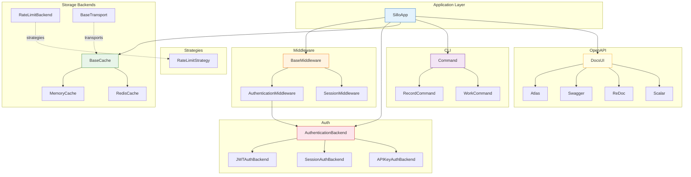

> Internal engineering guide for adding new middleware, auth backends, cache
> backends, rate-limit strategies, event transports, CLI commands, OpenAPI
> doc UIs, JSON encoders, model scopes, model casts, and OAuth providers.

---

## Extension Architecture Overview

Sillo follows a **base-class + registry** pattern for extensibility.  Each
extension point is defined by an abstract or concrete base class in a
dedicated module.  Extensions are registered either via constructor injection
(e.g. `app.use(middleware)`) or via factory functions (e.g.
`record_commands(db)`).



---

## Adding New Middleware

**Base class:** `BaseMiddleware`
**File:** `core/sillo/middleware/base.py`

### Interface

```python
class BaseMiddleware:
    def __init__(self, **kwargs: dict[Any, Any]) -> None: ...

    async def __call__(
        self,
        request: Request,
        response: Response,
        call_next: Callable[..., Awaitable[Any]],
    ) -> Any: ...

    async def process_request(
        self,
        request: Request,
        response: Response,
        call_next: Callable[..., Awaitable[Response]],
    ) -> Any: ...

    async def process_response(
        self,
        request: Request,
        response: Response,
    ) -> Any: ...
```

### How it works internally

`__call__` wraps `call_next` in an inner `wrapped_call_next()` that sets a
`_call_next` flag to `True`.  The sequence is:

1. `process_request(request, response, wrapped_call_next)` is called.
2. If your `process_request` calls `await call_next(...)`, the flag is set.
3. If the flag is `True`, `process_response(request, response)` runs.
4. The return value of `process_request` (or `process_response` if it ran)
   becomes the response.

### Step-by-step: Creating custom middleware

```python
# core/sillo/my_feature/middleware.py

from sillo.middleware.base import BaseMiddleware
from sillo.core.http import Request, Response


class RateLimitMiddleware(BaseMiddleware):
    """Example: simple in-memory rate limiter."""

    def __init__(self, max_requests: int = 100, window: int = 60, **kwargs):
        super().__init__(**kwargs)
        self.max_requests = max_requests
        self.window = window
        self._counts: dict[str, list[float]] = {}

    async def process_request(self, request, response, call_next):
        client_ip = request.client.host if request.client else "unknown"
        now = time.time()

        # Prune old entries
        self._counts.setdefault(client_ip, [])
        self._counts[client_ip] = [
            t for t in self._counts[client_ip] if now - t < self.window
        ]

        if len(self._counts[client_ip]) >= self.max_requests:
            response.status_code = 429
            response.set_body(b"Too Many Requests")
            return response  # Short-circuit: do NOT call call_next

        self._counts[client_ip].append(now)
        return await call_next(request)

    # process_response is optional — omit if no post-processing needed
```

### Registration

```python
from sillo import SilloApp

app = SilloApp()
app.use(RateLimitMiddleware(max_requests=100, window=60))
```

### Ordering

Middleware executes in **registration order** (first registered = outermost).
If you register `[A, B, C]`, the request flows A → B → C → handler, and the
response flows C → B → A.

---

## Adding New Auth Backend

**Base class:** `AuthenticationBackend`
**File:** `core/sillo/auth/backend.py`

### Interface

```python
class AuthenticationBackend:
    name: str = "auth"
    description: str | None = None

    def describe(self) -> SecurityScheme | None: ...
    async def authenticate(self, request: Request) -> AuthResult: ...
    def handle_exception(self, response: Response, exc: Exception) -> None: ...
```

**Return type:**
```python
@dataclass
class AuthResult:
    identity: str      # User identifier (e.g. user ID, email, API key name)
    scope: str         # Auth scope string (e.g. "user", "admin", "api")
    success: bool      # Whether authentication succeeded
```

### Concrete examples for reference

| Backend | `name` | `describe()` returns | Token source |
|---------|--------|---------------------|--------------|
| `JWTAuthBackend` | `"bearerAuth"` | `HTTPBearer(scheme="bearer", bearerFormat="JWT")` | `Authorization: Bearer <token>` |
| `SessionAuthBackend` | `"sessionCookie"` | `APIKey(type="apiKey", name=cookie_name, **{"in": "cookie"})` | Session cookie |
| `APIKeyAuthBackend` | `"apiKeyHeader"` | `APIKey(type="apiKey", name=header_name, **{"in": "header"})` | `X-API-Key` header |

### Step-by-step: Custom auth backend

```python
# core/sillo/my_auth/backend.py

from sillo.auth.backend import AuthenticationBackend
from sillo.auth.model import AuthResult
from sillo.openapi.models import APIKey


class HMACAuthBackend(AuthenticationBackend):
    """Authenticate via HMAC-signed request body."""

    name = "hmacAuth"
    description = "HMAC signature verification"

    def __init__(
        self,
        secret: str,
        header_name: str = "X-Signature",
        **kwargs,
    ):
        super().__init__(**kwargs)
        self.secret = secret
        self.header_name = header_name

    def describe(self) -> SecurityScheme | None:
        return APIKey(
            type="apiKey",
            name=self.header_name,
            **{"in": "header"},
        )

    async def authenticate(self, request) -> AuthResult:
        signature = request.headers.get(self.header_name)
        if not signature:
            return AuthResult(identity="", scope="", success=False)

        body = await request.body
        expected = hmac.new(
            self.secret.encode(), body, hashlib.sha256
        ).hexdigest()

        if not hmac.compare_digest(signature, expected):
            return AuthResult(identity="", scope="", success=False)

        return AuthResult(
            identity="api-client",
            scope="api",
            success=True,
        )
```

### Registration

Pass to `SilloApp` or to `AuthenticationMiddleware`:

```python
app = SilloApp(
    auth=[HMACAuthBackend(secret="my-secret")]
)

# Or per-route:
@app.get("/webhook", auth=useAuth(backends=[HMACAuthBackend(secret="...")]))
async def webhook(request): ...
```

### Authentication flow

1. `AuthenticationMiddleware` iterates registered backends **in order**.
2. For each backend, calls `await backend.authenticate(request)`.
3. The **first** backend that returns `AuthResult(success=True)` wins.
4. Sets: `request.scope["user"]`, `request.scope["auth"]` (scope string),
   `request.scope["auth_scheme"]` (backend name).
5. If no backend succeeds and a route requires auth (`useAuth(required=True)`),
   raises `AuthenticationFailed`.

---

## Adding New Cache Backend

**Base class:** `BaseCache(ABC)`
**File:** `core/sillo/cache/base.py`

### Interface (8 abstract methods)

```python
class BaseCache(abc.ABC):
    name: str = "base"

    def __init__(
        self,
        *,
        namespace: str | None = None,
        default_ttl: int | None = None,
        serializer: str = "json",
        stats: CacheStats | None = None,
    ) -> None: ...

    # Stats
    def stats(self) -> CacheStats: ...
    def reset_stats(self) -> None: ...

    # Key building
    def make_key(self, *parts, namespace=None, version=None) -> str: ...

    # Abstract API
    @abc.abstractmethod async def get(self, key: str) -> Any: ...
    @abc.abstractmethod async def set(self, key: str, value: Any, ttl: int | None = None, *, tags: Iterable[str] | None = None, sliding: bool = False) -> None: ...
    @abc.abstractmethod async def delete(self, key: str) -> bool: ...
    @abc.abstractmethod async def exists(self, key: str) -> bool: ...
    @abc.abstractmethod async def touch(self, key: str, ttl: int | None = None) -> bool: ...
    @abc.abstractmethod async def invalidate_tags(self, *tags: str) -> int: ...
    @abc.abstractmethod async def clear(self) -> None: ...
    @abc.abstractmethod async def close(self) -> None: ...

    # Context manager
    async def __aenter__(self) -> Self: ...
    async def __aexit__(self, *exc) -> None: ...  # calls close()
```

### Step-by-step: Custom cache backend

```python
# core/sillo/cache/backends/memcached.py

import json
from sillo.cache.base import BaseCache, CacheStats


class MemcachedCache(BaseCache):
    name = "memcached"

    def __init__(self, servers: list[str], **kwargs):
        super().__init__(**kwargs)
        self.servers = servers
        self._client = None  # lazy init

    def _ensure_client(self):
        if self._client is None:
            import pymemcache
            self._client = pymemcache.Client(self.servers)

    async def get(self, key: str) -> Any:
        self._ensure_client()
        raw = self._client.get(self.make_key(key))
        if raw is None:
            self._stats.misses += 1
            return None
        self._stats.hits += 1
        return json.loads(raw)

    async def set(self, key, value, ttl=None, *, tags=None, sliding=False):
        self._ensure_client()
        resolved_ttl = self._resolve_ttl(ttl)
        self._client.set(
            self.make_key(key),
            json.dumps(value),
            expire=resolved_ttl or 0,
        )
        self._stats.sets += 1
        # Store tag mappings if needed
        if tags:
            for tag in tags:
                tag_key = self.make_key(f"tag:{tag}")
                members = self._client.get(tag_key)
                members = json.loads(members) if members else []
                members.append(self.make_key(key))
                self._client.set(tag_key, json.dumps(members))

    async def delete(self, key: str) -> bool:
        self._ensure_client()
        result = self._client.delete(self.make_key(key))
        if result:
            self._stats.deletes += 1
        return bool(result)

    async def exists(self, key: str) -> bool:
        self._ensure_client()
        return self._client.get(self.make_key(key)) is not None

    async def touch(self, key: str, ttl: int | None = None) -> bool:
        self._ensure_client()
        resolved = self._resolve_ttl(ttl)
        return bool(self._client.touch(self.make_key(key), expire=resolved or 0))

    async def invalidate_tags(self, *tags: str) -> int:
        count = 0
        for tag in tags:
            tag_key = self.make_key(f"tag:{tag}")
            members_raw = self._client.get(tag_key)
            if members_raw:
                members = json.loads(members_raw)
                for member_key in members:
                    self._client.delete(member_key)
                    count += 1
                self._client.delete(tag_key)
        return count

    async def clear(self) -> None:
        self._ensure_client()
        self._client.flush_all()

    async def close(self) -> None:
        if self._client:
            self._client.close()
            self._client = None
```

### Key design rules

- **All 8 abstract methods are async** — even if the underlying library is
  sync (wrap with `asyncio.to_thread` or call directly in a threadpool).
- **`make_key`** handles namespacing — always use it instead of raw keys.
- **`_resolve_ttl`** merges the per-call TTL with `self.default_ttl`.
- **`CacheStats`** tracking is optional but recommended (hits, misses, sets,
  deletes, evictions).

---

## Adding New Rate-Limit Backend

**Base class:** `RateLimitBackend`
**File:** `core/sillo/security/ratelimit/backends/base.py`

### Interface (3 methods)

```python
class RateLimitBackend:
    async def fetch_state(self, key: str) -> dict | None: ...
    async def save_state(self, key: str, state: dict, ttl: int) -> None: ...
    async def clear(self) -> None: ...
```

The backend is a **state store** — it doesn't decide whether to allow or deny
requests.  That's the strategy's job.

### Concrete backends

| Backend | Storage | File |
|---------|---------|------|
| `InMemoryBackend` | `dict` + `asyncio.Lock` | `backends/memory.py` |
| `RedisBackend` | Redis keys with TTL | `backends/redis.py` |
| `RecordBackend` | Database (ORM) | `backends/record.py` |

### Example: DynamoDB backend

```python
class DynamoDBBackend(RateLimitBackend):
    def __init__(self, table_name: str, region: str = "us-east-1"):
        import boto3
        self.table = boto3.resource("dynamodb", region_name=region).Table(table_name)

    async def fetch_state(self, key: str) -> dict | None:
        resp = await asyncio.to_thread(
            self.table.get_item, Key={"pk": f"rl:{key}"}
        )
        item = resp.get("Item")
        if item:
            return json.loads(item["state"])
        return None

    async def save_state(self, key: str, state: dict, ttl: int) -> None:
        await asyncio.to_thread(
            self.table.put_item,
            Item={
                "pk": f"rl:{key}",
                "state": json.dumps(state),
                "ttl": int(time.time()) + ttl,
            },
        )

    async def clear(self) -> None:
        pass  # DynamoDB TTL handles cleanup
```

---

## Adding New Rate-Limit Strategy

**Base class:** `RateLimitStrategy(ABC)`
**File:** `core/sillo/security/ratelimit/strategies/base.py`

### Interface (1 method)

```python
class RateLimitStrategy(abc.ABC):
    @abc.abstractmethod
    async def hit(
        self,
        backend: RateLimitBackend,
        key: str,
        limit: int,
        window: int,
        cost: int = 1,
        now: float | None = None,
    ) -> RateLimitResult: ...
```

**Return type:**
```python
@dataclass
class RateLimitResult:
    allowed: bool
    limit: int
    remaining: int
    reset_at: float
    retry_after: int
```

### Concrete strategies

| Strategy | Algorithm | Burst handling |
|----------|-----------|---------------|
| `FixedWindowStrategy` | Counter per aligned window | No — hard reset at boundary |
| `SlidingWindowStrategy` | Timestamp log, count within trailing window | Smooth |
| `TokenBucketStrategy` | Refill `limit/window` tokens/sec | Smooth bursts |

### Example: Leaky bucket strategy

```python
class LeakyBucketStrategy(RateLimitStrategy):
    async def hit(self, backend, key, limit, window, cost=1, now=None):
        now = now or time.time()
        state = await backend.fetch_state(key) or {
            "level": 0,
            "last_leak": now,
        }

        # Leak
        elapsed = now - state["last_leak"]
        leak_rate = limit / window
        leaked = elapsed * leak_rate
        state["level"] = max(0, state["level"] - leaked)
        state["last_leak"] = now

        # Check capacity
        if state["level"] + cost > limit:
            retry_after = int((state["level"] + cost - limit) / leak_rate) + 1
            return RateLimitResult(
                allowed=False, limit=limit,
                remaining=max(0, int(limit - state["level"])),
                reset_at=now + retry_after,
                retry_after=retry_after,
            )

        state["level"] += cost
        await backend.save_state(key, state, ttl=window * 2)

        return RateLimitResult(
            allowed=True, limit=limit,
            remaining=max(0, int(limit - state["level"])),
            reset_at=now + window,
            retry_after=0,
        )
```

---

## Adding New Event Transport

**Base class:** `BaseTransport(ABC)`
**File:** `core/sillo/events/transports/base.py`

### Interface

```python
class BaseTransport(abc.ABC):
    name: str = "base"

    def __init__(self, *, namespace="", on_error=None, loop=None): ...
    def bind(self, dispatch: DispatchFn) -> None: ...
    def set_error_handler(self, fn: ErrorFn) -> None: ...

    async def start(self) -> None: ...      # Default: sets _running = True
    async def stop(self) -> None: ...       # Default: sets _running = False

    @abc.abstractmethod
    async def publish(self, channel: str, envelope: dict[str, Any]) -> None: ...

    async def _deliver(self, channel: str, envelope: dict[str, Any]) -> None: ...
```

**Wire format envelope:**
```python
{
    "event_id": "<uuid4>",
    "args": [...],
    "kwargs": {...},
    "ts": 1718000000.123,
}
```

**Type aliases:**
- `DispatchFn = Callable[[str, dict[str, Any]], Awaitable[None]]`
- `ErrorFn = Callable[[BaseException, str, dict[str, Any]], Awaitable[None]]`

### Concrete transports

| Transport | Backend | File |
|-----------|---------|------|
| `MemoryTransport` | In-process direct delivery | `transports/memory.py` |
| `RedisTransport` | Redis pub/sub | `transports/redis.py` |
| `PersistentTransport` | Database-backed | `transports/persistent.py` |
| `RecordTransport` | ORM model-backed | `transports/record.py` |

### Example: NATS transport

```python
class NATSTransport(BaseTransport):
    name = "nats"

    def __init__(self, servers: list[str], **kwargs):
        super().__init__(**kwargs)
        self.servers = servers
        self._nc = None
        self._subs: dict[str, Any] = {}

    async def start(self):
        import nats
        self._nc = await nats.connect(servers=self.servers)
        await super().start()

    async def stop(self):
        for sub in self._subs.values():
            await sub.unsubscribe()
        if self._nc:
            await self._nc.close()
        await super().stop()

    async def publish(self, channel: str, envelope: dict[str, Any]):
        real_channel = self._channel(channel)
        payload = json.dumps(envelope).encode()
        await self._nc.publish(real_channel, payload)

    async def subscribe(self, channel: str):
        real_channel = self._channel(channel)

        async def handler(msg):
            envelope = json.loads(msg.data)
            await self._deliver(channel, envelope)

        sub = await self._nc.subscribe(real_channel, cb=handler)
        self._subs[channel] = sub
```

### Registration

Transports are registered via the transport factory:
```python
from sillo.events.transports import register_transport
register_transport("nats", NATSTransport)

# Then in config:
emitter = EventEmitter(backend="nats", servers=["nats://localhost:4222"])
```

---

## Adding New Record Commands

**Base class:** `RecordCommand(Command)`
**File:** `core/sillo/record/console.py`

### How it works

`record_commands(database, ...)` uses `type()` for dynamic subclass creation:

```python
def record_commands(database, *, app="models", only=None):
    config = _Config(database, app)
    chosen = COMMANDS  # [Init, Make, Migrate, Plan, Rollback, Sql, Status]
    return [
        type(command.__name__, (command,), {"config": config})
        for command in chosen
    ]
```

This creates **fresh anonymous subclasses** per call, so two different
databases can bind the same command class without conflict.

### Creating a new record command

```python
from sillo.console.command import Command
from sillo.record.console import RecordCommand


class SeedCommand(RecordCommand):
    name = "db:seed"
    help = "Seed the database with test data"
    arguments = [
        {"name": "seeder", "required": False, "default": "default"},
        {"name": "--count", "type": int, "default": 10},
    ]

    async def handle(self) -> int | None:
        seeder_name = self.argument("seeder")
        count = self.option("count")

        self.info(f"Seeding with '{seeder_name}' ({count} records)...")

        db = self.database
        await db.init()
        try:
            await run_seeder(seeder_name, count)
            self.success("Seeding complete.")
        finally:
            await db.shutdown()

        return 0
```

### Registration

```python
# In your app setup:
from sillo.console import Console
from sillo.record.console import record_commands

console = Console(app)
console.add_many(record_commands(database=db))
console.add_command(SeedCommand)  # or add via type() for dynamic binding
```

---

## Adding New Work Commands

**Base class:** `WorkCommand(Command)`
**File:** `core/sillo/work/console.py`

### How it works

Same `type()` pattern as record commands:

```python
def work_commands(*, url=None, queues=None, prefix="sillo:queue:",
                  scheduler=None, failed=None, context=None, only=None):
    config = _Config(url, queues, prefix, scheduler, failed, context)
    chosen = COMMANDS  # [Work, QueueList, QueueFailed, ...]
    return [
        type(command.__name__, (command,), {"config": config})
        for command in chosen
    ]
```

`WorkCommand` provides helper methods:
- `self.settings` — access the `_Config`
- `self.connection()` — get a queue connection
- `self.repository()` — get the failed-job repository
- `self.manager()` — get the scheduler manager

### Creating a custom work command

```python
class QueuePurgeCommand(WorkCommand):
    name = "queue:purge"
    help = "Remove all jobs from a specific queue"
    arguments = [
        {"name": "queue", "required": True},
    ]

    async def handle(self) -> int | None:
        queue_name = self.argument("queue")
        conn = self.connection()

        if not self.confirm(f"Purge all jobs from '{queue_name}'?"):
            self.muted("Cancelled.")
            return 0

        count = await conn.flush(queue_name)
        self.success(f"Purged {count} jobs from '{queue_name}'.")
        return 0
```

---

## Adding New OpenAPI Docs UI

**Base class:** `DocsUI`
**File:** `core/sillo/openapi/ui.py`

### Interface

```python
class DocsUI:
    path: str = "/docs"
    name: str = "docs"

    def __init__(self, *, path=None, title=None, favicon_url=None): ...
    def resolve_title(self, ctx: DocsContext) -> str: ...
    def render(self, ctx: DocsContext) -> str: ...  # raises NotImplementedError
    def _favicon_tag(self) -> str: ...
```

**`DocsContext`** (frozen dataclass):
- `openapi_url: str` — URL to the OpenAPI JSON spec
- `title: str`
- `version: str`
- `description: str`
- `config: OpenAPIConfig`

### Existing UIs

| Class | `name` | Default `path` | Library |
|-------|--------|----------------|---------|
| `Atlas` | `"atlas"` | `/docs` | Sillo's own JS (pinned to v0.8.0) |
| `Swagger` | `"swagger"` | `/docs` | swagger-ui-dist@5 |
| `ReDoc` | `"redoc"` | `/redoc` | Redoc latest |
| `Scalar` | `"scalar"` | `/reference` | @scalar/api-reference |

### Example: RapiDoc UI

```python
class RapiDoc(DocsUI):
    name = "rapidoc"
    path = "/rapidoc"

    def render(self, ctx: DocsContext) -> str:
        title = self.resolve_title(ctx)
        favicon = self._favicon_tag()
        return f"""<!DOCTYPE html>
<html>
<head>
    <title>{title}</title>
    {favicon}
    <script src="https://unpkg.com/rapidoc/dist/rapidoc-min.js"></script>
</head>
<body>
    <rapi-doc
        spec-url="{ctx.openapi_url}"
        render-style="read"
        show-header="false"
        theme="light"
    ></rapi-doc>
</body>
</html>"""
```

### Registration

```python
app = SilloApp(
    docs=[
        Atlas(path="/docs"),
        RapiDoc(path="/rapidoc"),
        Scalar(path="/reference"),
    ]
)
```

No registration hook needed — just pass instances to the `docs` parameter.
Each UI gets its own route at its configured `path`.

---

## Custom JSON Encoders

**File:** `core/sillo/encoding.py` → re-exports from `core/sillo/core/encoding.py`

### Registry

```python
CUSTOM_ENCODERS: dict[type[Any], Callable[[Any], Any]] = {}

def register_encoder(type_: type[Any], encoder: Callable[[Any], Any]) -> None:
    CUSTOM_ENCODERS[type_] = encoder
```

### Priority order (in `jsonable_encoder`)

1. **Custom encoders** — exact type match, then `isinstance` check
2. **Built-in `ENCODERS_BY_TYPE`** — handles `datetime`, `Decimal`, `Enum`,
   `UUID`, `IPv4Address`, `Path`, `SecretStr`, `set`, `frozenset`, etc.
3. **Pydantic `model_dump`** — if value is a Pydantic model
4. **Dataclass `asdict`** — if value is a dataclass
5. **Enum `.value`** — if value is an Enum
6. **`dict()`/`vars()`** — fallback for arbitrary objects

### Registration

```python
from sillo.encoding import register_encoder
from decimal import Decimal

# Global registration
register_encoder(Decimal, lambda v: float(v))

# Or per-app
app = SilloApp()
app.add_encoder(Decimal, lambda v: str(v))  # override global
```

---

## Custom Model Scopes

**File:** `core/sillo/record/scopes.py`

### Mechanism

Scopes are classmethods on `Model` subclasses that follow the naming convention
`scope_<name>`.  `RecordQuerySet.__getattr__` intercepts method calls matching
this pattern and forwards them to the classmethod.

### Step-by-step

```python
from sillo.record.models import Model


class Article(Model):
    title: str
    is_published: bool
    view_count: int
    category: str

    class Meta:
        table = "articles"

    @classmethod
    def scope_published(cls, queryset):
        return queryset.filter(is_published=True)

    @classmethod
    def scope_popular(cls, queryset, min_views: int = 100):
        return queryset.filter(view_count__gte=min_views)

    @classmethod
    def scope_in_category(cls, queryset, category: str):
        return queryset.filter(category=category)
```

### Usage

```python
# Chainable — each scope_* becomes a QuerySet method
articles = await Article.published().popular(min_views=500).in_category("tech").all()
```

### Global scopes

```python
class SoftDeleteScope:
    def __call__(self, queryset):
        return queryset.filter(deleted_at__isnull=True)

# Apply to ALL queries on a model
Article.add_global_scope(SoftDeleteScope())

# Bypass for admin queries
all_articles = await Article.without_global_scopes().all()
```

---

## Custom Model Casts

**File:** `core/sillo/record/casting.py`

### Registry

```python
class CastRegistry:
    _builtins: ClassVar[dict[str, tuple[Callable, Callable]]] = {}

    @classmethod
    def register(cls, name: str, encoder: Callable, decoder: Callable) -> None: ...

    @classmethod
    def get(cls, name: str) -> tuple | None: ...
```

### Built-in casts

| Name | Encoder | Decoder |
|------|---------|---------|
| `"json"` | `json.dumps` | `json.loads` |
| `"datetime"` | `.isoformat()` | `datetime.fromisoformat()` |
| `"bool"` | `int()` | `bool()` |
| `"int"` | `str()` | `int()` |
| `"float"` | `str()` | `float()` |

### Registering a custom cast

```python
from sillo.record.casting import CastRegistry
import pickle, base64

def encode_set(value: set) -> str:
    return base64.b64encode(pickle.dumps(value)).decode()

def decode_set(raw: str) -> set:
    return pickle.loads(base64.b64decode(raw))

CastRegistry.register("set", encode_set, decode_set)
```

### Using casts on a model

```python
class User(Model):
    _casts = {
        "metadata": "json",
        "last_login": "datetime",
        "is_admin": "bool",
        "tags": "set",         # custom cast
    }

    class Meta:
        table = "users"
```

Casts are applied transparently via `__setattr__`/`__getattribute__` hooks.

### Callable tuple format

For parameterised casts (e.g. encrypted fields):
```python
_casts = {
    "secret_field": ("encrypted", {"key": "my-encryption-key"}),
}
```

---

## Adding New OAuth Provider

**Important:** Sillo does **not** have an `OAuthProvider` class.  OAuth is
handled at two levels:

1. **OpenAPI model level** — `OAuth2`, `OAuthFlows`, `OAuthFlow*` classes
   describe OAuth2 schemes in the OpenAPI spec.
2. **Authentication backend level** — create an `AuthenticationBackend`
   subclass that validates OAuth2 tokens.

### OpenAPI models

```python
# In sillo.openapi.models
class OAuth2(SecurityBase):
    flows: OAuthFlows
    type: Literal["oauth2"] = "oauth2"

class OAuthFlows(BaseModel):
    implicit: OAuthFlowImplicit | None = None
    password: OAuthFlowPassword | None = None
    clientCredentials: OAuthFlowClientCredentials | None = None
    authorizationCode: OAuthFlowAuthorizationCode | None = None
```

### Step-by-step: OAuth2 provider backend

```python
import httpx
from sillo.auth.backend import AuthenticationBackend
from sillo.auth.model import AuthResult
from sillo.openapi.models import OAuth2, OAuthFlows, OAuthFlowAuthorizationCode


class GoogleOAuthBackend(AuthenticationBackend):
    name = "googleOAuth"
    description = "Google OAuth2"

    def __init__(
        self,
        client_id: str,
        userinfo_url: str = "https://openidconnect.googleapis.com/v1/userinfo",
        scopes: list[str] | None = None,
        **kwargs,
    ):
        super().__init__(**kwargs)
        self.client_id = client_id
        self.userinfo_url = userinfo_url
        self.scopes = scopes or ["openid", "email", "profile"]

    def describe(self):
        return OAuth2(
            flows=OAuthFlows(
                authorizationCode=OAuthFlowAuthorizationCode(
                    authorizationUrl="https://accounts.google.com/o/oauth2/v2/auth",
                    tokenUrl="https://oauth2.googleapis.com/token",
                    scopes={s: s for s in self.scopes},
                )
            )
        )

    async def authenticate(self, request) -> AuthResult:
        auth_header = request.headers.get("authorization", "")
        if not auth_header.startswith("Bearer "):
            return AuthResult(identity="", scope="", success=False)

        token = auth_header[7:]

        async with httpx.AsyncClient() as client:
            resp = await client.get(
                self.userinfo_url,
                headers={"Authorization": f"Bearer {token}"},
            )
            if resp.status_code != 200:
                return AuthResult(identity="", scope="", success=False)

            info = resp.json()

        return AuthResult(
            identity=info.get("sub", info.get("email", "")),
            scope="user",
            success=True,
        )
```

### Registration

```python
app = SilloApp(
    auth=[GoogleOAuthBackend(client_id="...")]
)
```

---

## Contracts to Preserve

These are the invariants that **must not be broken** when extending Sillo:

### 1. `useAuth.authenticate()` returns `bool`

```python
class useAuth:
    async def authenticate(self, request: Request) -> bool:
        ...
```

This is the gate for route-level auth.  `True` means "allow access",
`False` means "deny".  It's used by the routing layer, not by middleware.

### 2. `AuthenticationBackend.authenticate()` returns `AuthResult`

```python
async def authenticate(self, request: Request) -> AuthResult:
    ...
```

Never return `None` or raise for normal auth failures — always return
`AuthResult(success=False)`.  Exceptions are for infrastructure failures
(e.g. DB down), not for "user not authenticated".

### 3. `BaseMiddleware` process signatures

```python
async def process_request(
    self,
    request: Request,
    response: Response,
    call_next: Callable[..., Awaitable[Response]],
) -> Any: ...

async def process_response(
    self,
    request: Request,
    response: Response,
) -> Any: ...
```

The `_call_next` flag mechanism depends on `call_next` being called exactly
once (or zero times for short-circuit).  Do not call it multiple times.

### 4. `BaseCache` methods are all async

Even if your backend is sync, the interface is async.  Use
`asyncio.to_thread()` for sync calls.

### 5. `RateLimitBackend` methods return expected shapes

`fetch_state` returns `dict | None`.  `save_state` stores a dict with a TTL.
The dict shape is determined by the strategy, not the backend.

### 6. `Command.handle()` can be sync or async

The console runtime checks `is_async_callable(handle)` and awaits or calls
accordingly.  Do not force one or the other.

---

## Where New Functionality Should Live

| Functionality | Location | Pattern |
|---------------|----------|---------|
| New HTTP middleware | `sillo/<feature>/middleware.py` | Subclass `BaseMiddleware` |
| New auth backend | `sillo/auth/<name>/backend.py` | Subclass `AuthenticationBackend` |
| New cache backend | `sillo/cache/backends.py` (append) | Subclass `BaseCache` |
| New rate-limit backend | `sillo/security/ratelimit/backends/<name>.py` | Subclass `RateLimitBackend` |
| New rate-limit strategy | `sillo/security/ratelimit/strategies/<name>.py` | Subclass `RateLimitStrategy` |
| New event transport | `sillo/events/transports/<name>.py` | Subclass `BaseTransport` |
| New CLI command | `sillo/<feature>/console.py` | Subclass `Command` |
| New OpenAPI docs UI | `sillo/openapi/ui.py` (append) | Subclass `DocsUI` |
| New JSON encoder | App-level or `sillo/encoding.py` | `register_encoder()` |
| New model scope | Model classmethod | `scope_<name>(cls, queryset)` |
| New model cast | `sillo/record/casting.py` or app-level | `CastRegistry.register()` |
| New hash scheme | `sillo/hashing/config.py` | Add to `SCHEMES` dict |

### Convention: feature directories

For substantial extensions, create a feature directory:
```
sillo/my_feature/
├── __init__.py
├── backend.py      # AuthenticationBackend or storage backend
├── middleware.py    # BaseMiddleware subclass
├── models.py       # ORM models if needed
├── console.py      # CLI commands
└── config.py       # Configuration dataclass
```

---

## Reusing Existing Abstractions

### Don't reinvent the wheel

| Need | Reuse |
|------|-------|
| Signing cookies/tokens | `helpers/crypto.py` — `sign_value`/`unsign_value` |
| Password hashing | `sillo.hashing` — `hash_password`/`verify_password` |
| JWT operations | `helpers/jwt.py` — `create_access_token`/`decode` |
| IP detection | `helpers/network.py` — `get_client_ip`/`is_trusted_proxy` |
| HTML sanitisation | `helpers/html.py` — `sanitize_html` |
| Retry logic | `helpers/retry.py` — `@retry` decorator |
| String transforms | `helpers/strings.py` — `slugify`/`camel_to_snake` |
| File operations | `helpers/files.py` — `safe_filename`/`guess_mime_type` |
| Async detection | `core/helpers/async_helpers.py` — `is_async_callable` |
| Deprecation warnings | `core/helpers/deprecation.py` — `@deprecated` decorator |

### Composition over inheritance

Prefer composing existing backends over creating new base classes:

```python
# Good: compose BaseCache + custom storage
class TieredCache(BaseCache):
    def __init__(self):
        self.l1 = MemoryCache(max_size=1000)
        self.l2 = RedisCache(url="redis://...")

    async def get(self, key):
        val = await self.l1.get(key)
        if val is None:
            val = await self.l2.get(key)
            if val is not None:
                await self.l1.set(key, val, ttl=60)
        return val

# Avoid: creating a new abstract base
```

---

## Testing Extension Points

### What to test for each extension type

| Extension | Test coverage |
|-----------|--------------|
| Middleware | Happy path, short-circuit (no `call_next`), error in `call_next`, pre/post processing order |
| Auth backend | Valid token, invalid token, missing token, expired token, `describe()` returns correct OpenAPI schema |
| Cache backend | All 8 abstract methods, TTL expiry, tag invalidation, clear, concurrent access |
| Rate-limit backend | `fetch_state` returns `None` for new key, state round-trips, `clear` works |
| Rate-limit strategy | Below limit, at limit, above limit, window reset, cost > 1 |
| Event transport | `publish`/`deliver` round-trip, namespace prefixing, `start`/`stop` lifecycle, error handler called |
| CLI command | `handle()` returns correct exit code, output matches expected, arguments parsed correctly |
| Docs UI | `render()` returns valid HTML, OpenAPI URL present in output, title resolved |
| JSON encoder | Registered type encodes correctly, priority over built-in encoders |
| Model scope | Scope filters correctly, chaining works, global scopes applied |
| Model cast | Encode/decode round-trip, `None` handling, type safety |

### Test pattern for backends

```python
import pytest

class TestMemcachedCache:
    @pytest.fixture
    async def cache(self):
        c = MemcachedCache(servers=["localhost:11211"])
        await c.start()
        yield c
        await c.clear()
        await c.close()

    async def test_get_set(self, cache):
        await cache.set("key", "value", ttl=60)
        assert await cache.get("key") == "value"

    async def test_get_missing(self, cache):
        assert await cache.get("nonexistent") is None

    async def test_delete(self, cache):
        await cache.set("key", "value")
        assert await cache.delete("key") is True
        assert await cache.get("key") is None

    async def test_tag_invalidation(self, cache):
        await cache.set("a", 1, tags=["group1"])
        await cache.set("b", 2, tags=["group1"])
        await cache.set("c", 3, tags=["group2"])

        count = await cache.invalidate_tags("group1")
        assert count == 2
        assert await cache.get("a") is None
        assert await cache.get("b") is None
        assert await cache.get("c") == 3

    async def test_stats_tracking(self, cache):
        await cache.get("miss")
        await cache.set("key", "value")
        await cache.get("key")
        stats = cache.stats()
        assert stats.hits == 1
        assert stats.misses == 1
        assert stats.sets == 1
```
