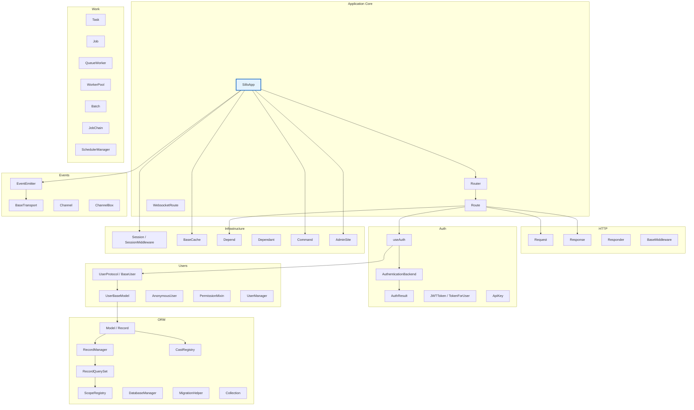

> Precise definitions of every Sillo-specific term.  Each entry includes the
> definition, owning module, relationships to other concepts, and differences
> from conventional Python/web framework terminology.

---

## Architecture Map



---

## Core Application

### SilloApp

**Module:** `sillo.application`

The ASGI application entry point.  Owns the full lifecycle of a Sillo
application: routes, middleware, events, lifecycle hooks, OpenAPI generation,
auth configuration, and CLI commands.

**Key attributes:** `debug`, `dependencies`, `custom_encoders`, `http_middleware`,
`startup_handlers`, `shutdown_handlers`, `route_class`, `app` (root `Router`),
`state` (shared `dict`), `openapi_config`, `events` (`EventEmitter`), `auth_user_model`,
`auth_backends`, `commands`, `title`.

**Key methods:**
- `__call__(scope, receive, send)`: ASGI protocol entry point
- `use(middleware)`: Register HTTP middleware
- `get/post/put/patch/delete(path, handler, ...)`: Route decorators
- `mount_router(router, name)`: Mount sub-router
- `frontend(path, directory, fallback, ...)`: Mount SPA
- `add_command(command)` / `command(name, ...)`: Register CLI command
- `url_for(_name, **path_params)`: Reverse URL generation
- `build_openapi()`: Generate OpenAPI JSON document
- `on_startup(handler)` / `on_shutdown(handler)`: Lifecycle hooks
- `register(app, prefix)`: Mount external ASGI app

**Differs from Django:** Django's `WSGIHandler` is separate from URL config and
settings.  SilloApp combines application, routing, and configuration into one
object.

**Differs from FastAPI:** FastAPI's `FastAPI` inherits from Starlette's `Starlette`.
SilloApp is a standalone ASGI callable with its own middleware chain.

**Related:** `Router`, `Route`, `BaseMiddleware`, `EventEmitter`, `useAuth`

---

### useAuth

**Module:** `sillo.auth.use_auth`

Route-level authentication/authorization gate. NOT a middleware, it's a
declarative per-route object that controls who can access a route.

**Attributes:** `permissions` (list of required permission strings), `backends`
(optional per-route auth backends), `user_model` (user class for loading),
`required` (bool, whether auth is mandatory), `schemes` (OpenAPI security
scheme requirements), `all_of` (bool, require all permissions vs any).

**Methods:**
- `authenticate(request) -> bool`: Check if the request passes auth
- `security_requirements(available) -> list[dict]`: Generate OpenAPI security

**Differs from Django's `@login_required`:** `useAuth` is declarative and
integrates with OpenAPI security schemes.  It supports per-route backend
selection and permission combinations.

**Differs from FastAPI's `Depends`:** FastAPI uses dependency injection for
auth.  Sillo's `useAuth` is a separate mechanism with dedicated OpenAPI
integration.

**Related:** `AuthenticationBackend`, `AuthResult`, `UserProtocol`, `PermissionMixin`

---

## Routing

### Route

**Module:** `sillo.core.routing.router`

A single HTTP route binding a URL pattern to a handler function.

**Attributes:** `raw_path` (original template string), `pattern` (compiled regex),
`handler` (the view function), `methods` (HTTP verbs), `dependant` (`Dependant`
for DI resolution), `middleware` (per-route middleware list), `summary`,
`description`, `responses`, `request_model`, `response_model`, `tags`,
`security`, `operation_id`, `deprecated`, `parameters`, `exclude_from_schema`,
`auth` (`useAuth` gate), `param_names`, `route_type` (REGEX/PATH/WILDCARD).

**Methods:**
- `match(scope) -> bool`: Check if this route matches an ASGI scope
- `handle(scope, receive, send)`: Execute the handler
- `url_path_for(name, **path_params) -> URL`: Reverse URL generation

**Differs from Django's `URLPattern`:** Sillo `Route` carries DI metadata
(`dependant`) and auth gates (`auth`) directly.  Django separates these into
decorators and middleware.

**Related:** `Router`, `BaseRoute`, `RouteBuilder`, `RoutePattern`, `Dependant`, `useAuth`

---

### Router

**Module:** `sillo.core.routing.router`

A collection of routes with shared configuration.

**Attributes:** `prefix`, `routes`, `middleware`, `sub_routers`, `route_class`,
`strict_validation`, `tags`, `exclude_from_schema`, `name`, `event`
(`EventEmitter`), `dependencies`, `_inherited_dependencies`, `root_path`.

**Methods:**
- `add_route(route)`: Register a route
- `use(middleware)`: Add middleware to this router
- `get/post/put/patch/delete/options/head(path, handler, ...)`: Verb decorators
- `mount_router(app)`: Mount a sub-router
- `ws_route(path, handler)`: Register WebSocket route
- `frontend(path, directory, ...)`: Mount SPA
- `url_for(_name, **path_params)`: Reverse URL generation (walks tree)
- `get_all_routes()`: Flatten all routes

**Related:** `Route`, `BaseRouter`, `SilloApp`

---

### BaseRoute

**Module:** `sillo.core.routing.base`

Abstract base class for all route types.  Defines the interface:
- `match(scope)`: Does this route handle the request?
- `handle(scope, receive, send)`: Process the request
- `url_path_for(name, **path_params)`: Reverse URL

**Subclasses:** `Route`, `WebsocketRoute`, `Group`

---

### WebsocketRoute

**Module:** `sillo.core.routing.websocket`

WebSocket route variant.  Like `Route` but for WebSocket connections.

**Related:** `Route`, `WebSocket`, `Channel`

---

### Group

**Module:** `sillo.core.routing.grouping`

Route grouping utility.  Groups routes under common prefix, tags, middleware,
and dependencies.

**Related:** `Router`, `Route`

---

## HTTP Layer

### Request

**Module:** `sillo.core.http.request`

ASGI request wrapper.  Inherits from `HTTPConnection`.

**Properties:** `method`, `receive`, `content_type`, `body` (async, cached),
`json` (async), `text` (async), `form_data`, `files` (async), `form` (async),
`session`, `user`, `is_ajax`, `is_secure`, `accepts_html`, `is_json`, `is_form`,
`is_multipart`, `is_urlencoded`, `has_cookie`.

**Inherited from `HTTPConnection`:** `app`, `base_app`, `url`, `base_url`,
`headers`, `path`, `query_params`, `path_params`, `cookies`, `client`, `state`,
`origin`, `user_agent`.

**Methods:** `stream()`, `close()`, `is_disconnected()`, `url_for(_name, ...)`,
`valid()`.

**Differs from Django's `HttpRequest`:** Sillo's `Request` is async-first.
`body`, `json()`, `form()`, `files()` are all `async`.  Django's request is
sync with lazy attribute access.

**Differs from Starlette's `Request`:** Sillo adds `user`, `session`,
`is_ajax`, `accepts_html` properties, and `valid()` for DI validation.

**Related:** `Response`, `HTTPConnection`, `Session`, `UserProtocol`

---

### Response (family)

**Module:** `sillo.core.http.response`

Base class: `BaseResponse`.  Subclasses:
- `PlainTextResponse`: `text/plain`
- `JSONResponse`: `application/json` with `jsonable_encoder`
- `HTMLResponse`: `text/html`
- `FileResponse`: File streaming with range request support
- `StreamingResponse`: AsyncIterator streaming
- `RedirectResponse`: HTTP redirects

**`BaseResponse` attributes:** `STATUS_CODES`, `charset`, `status_code`,
`raw_headers`, `content_type`, `_body`.

**`BaseResponse` methods:** `render(content)`, `set_cookie(key, value, ...)`,
`delete_cookie(key, ...)`, `enable_caching(max_age, private)`,
`disable_caching()`, `set_header(key, value, override)`, `remove_header(key)`,
`set_body(content)`.

**Related:** `Responder`, `Request`

---

### Responder

**Module:** `sillo.core.http.response`

Fluent response builder.  Alternative to constructing `Response` subclasses
directly.

**Methods:** `json(data, status_code, ...)`, `html(content, ...)`,
`text(content, ...)`, `file(path, ...)`, `download(path, filename)`,
`stream(iterator, ...)`, `redirect(url, name, ...)`, `empty(status_code)`,
`abort(status_code, detail)`, `not_found(detail)`, `set_cookie(key, value, ...)`,
`set_permanent_cookie(key, value, ...)`.

**Differs from Django's `HttpResponse`:** Responder is a builder pattern, not
a response class.  It returns the appropriate `Response` subclass.

---

### BaseMiddleware

**Module:** `sillo.middleware.base`

Base class for HTTP middleware. Not an ASGI middleware, wraps ASGI via the
middleware chain.

**Methods:**
- `__call__(request, response, call_next)`: ASGI bridge entry
- `process_request(request, response, call_next)`: Pre-processing
- `process_response(request, response)`: Post-processing

**Key mechanism:** `__call__` wraps `call_next` with a `_call_next` flag.
`process_response` only runs if `call_next` was called in `process_request`.

**Differs from Django's middleware:** Django middleware has `process_request`
and `process_response` as separate hooks.  Sillo's `process_request` controls
whether `process_response` runs by calling (or not calling) `call_next`.

**Differs from Starlette's `BaseHTTPMiddleware`:** Starlette's middleware is
ASGI-level.  Sillo's is request/response-level with explicit pre/post phases.

**Related:** `SilloApp`, `Request`, `Response`, `AuthenticationMiddleware`

---

## Dependency Injection

### Depend

**Module:** `sillo.core.dependencies.base`

User-facing DI marker.  Declares a dependency on another callable.

**Attributes:** `dependency` (the callable), `get_request` (bool, inject raw
`Request` instead of resolving).

**Usage:**
```python
async def get_db(request) -> Database:
    ...

@app.get("/items")
async def list_items(db: Database = Depend(get_db)):
    ...
```

**Differs from FastAPI's `Depends`:** Same concept, different name.  Sillo
uses `Depend` instead of `Depends`.

**Related:** `Dependant`, `solve_dependencies`

---

### Dependant

**Module:** `sillo.core.dependencies.base`

Internal dataclass representing a resolved dependency tree node.

**Attributes:** `call` (the callable), `name`, `dependencies` (child
`Dependant` nodes), `request_param_names`, `param_extractors`, `validator`
(compiled Pydantic validator), `is_coroutine`, `is_generator`,
`is_async_generator`, `cache_key`, `use_cache`, `_execution_plan`,
`_validator_plan`, `_needs_form`.

**Differs from FastAPI's `Dependant`:** Same concept.  Sillo's implementation
uses iterative DFS for resolution (not recursive) and supports Pydantic v2
validators.

**Related:** `Depend`, `get_dependant`, `solve_dependencies`

---

## Authentication & Authorization

### AuthenticationBackend

**Module:** `sillo.auth.backend`

Base class for authentication backends.  Each backend implements a specific
authentication mechanism (JWT, session, API key, etc.).

**Attributes:** `name` (str, OpenAPI scheme name), `description` (str | None).

**Methods:**
- `describe() -> SecurityScheme | None`: OpenAPI schema description
- `authenticate(request) -> AuthResult`: Verify credentials
- `handle_exception(response, exc)`: Error handling

**Concrete implementations:** `JWTAuthBackend`, `SessionAuthBackend`,
`APIKeyAuthBackend`.

**Differs from Django's authentication backends:** Django backends implement
`get_user(user_id)` and `authenticate(request, **credentials)`.  Sillo
backends return `AuthResult` (a dataclass with `identity`, `scope`, `success`).

**Related:** `AuthResult`, `useAuth`, `AuthenticationMiddleware`

---

### AuthResult

**Module:** `sillo.auth.model`

Dataclass returned by `AuthenticationBackend.authenticate()`.

**Fields:**
- `identity: str`: User identifier (user ID, email, API key name)
- `scope: str`: Auth scope string ("user", "admin", "api")
- `success: bool`: Whether authentication succeeded

**Differs from Django:** Django's `authenticate()` returns a `User` object or
`None`.  Sillo returns a structured `AuthResult` that separates identity from
success status.

**Related:** `AuthenticationBackend`, `useAuth`

---

### Token family

Sillo has multiple token-related types:

**TokenForUser** (`sillo.auth.jwt_auth.tokens`): JWT token factory bound to a
user.  Methods: `access_token(expires_in, jti)`, `refresh_token(expires_in, jti)`,
`token_pair(access_expires, refresh_expires)`, `verify(token)`.

**JWTToken**: Raw JWT token string/representation (from `helpers/jwt.py`).

**TokenBlacklist**: Revoked JWT token tracking (tokens that should no longer
be accepted).

**ApiKey** (`sillo.auth.apikey.models`): Database-backed API key model.
Fields: `id`, `name`, `key_hash`, `last_used_at`, `expires_at`, `is_active`,
`scopes`, `user_id`.  Methods: `mark_used()`, `revoke()`.  Managed by
`ApiKeyManager` with `create_key()`, `verify()`, `get_for_user()`,
`revoke_all_for_user()`.

**Differs from Django:** Django uses a single token model (`Token` in DRF).
Sillo separates JWT tokens (stateless) from API keys (stateful, database-backed).

---

## Users & Permissions

### UserProtocol (alias: BaseUser)

**Module:** `sillo.users.protocol`

Pure authentication contract, the interface that all user types must satisfy.

**Properties:** `is_authenticated`, `is_anonymous`, `display_name`, `identity`.

**Methods:** `get_id()`, `get_display_name()`, `has_perm(perm)`,
`has_perms(perm_list)`, `has_permission(permission)`,
`has_module_perms(app_label)`, `load_user(identity)` (classmethod),
`get_email_field_name()` (classmethod).

**Differs from Django's `AbstractBaseUser`:** Django's user is an ORM model.
Sillo's `UserProtocol` is a structural protocol, any object satisfying the
interface can be a "user", including non-database objects like `SimpleUser`.

**Related:** `UserBaseModel`, `AnonymousUser`, `SimpleUser`, `UnauthenticatedUser`

---

### UserBaseModel

**Module:** `sillo.users.base`

Abstract ORM model combining `Model` and `UserProtocol`.  The standard base
for database-backed user models.

**Fields:** `id`, `email`, `username`, `password`, `is_active`, `is_staff`,
`is_superuser`, `last_login`, `email_verified_at`.

**Methods:** `set_password(raw)`, `check_password(raw)`, `set_unusable_password()`,
`has_usable_password()`, `set_last_login()`, `mark_email_verified()`,
`load_user(identity)` (classmethod), `verify_credentials(identifier, password)`
(classmethod), `has_perm(perm)`, `has_perms(perm_list)`,
`has_permission(permission)`, `has_module_perms(app_label)`.

**Concrete:** `User(UserBaseModel)`, table `"users"`, managed by `UserManager`.

**Differs from Django:** Combines `AbstractBaseUser` and `PermissionsMixin`
into a single base class.  Uses Tortoise ORM instead of Django ORM.

---

### AnonymousUser

**Module:** `sillo.users.protocol`

Unauthenticated user sentinel.  All permission methods return `False`.
`is_authenticated` is `False`, `is_anonymous` is `True`.

**Differs from Django:** Same concept.  Sillo's `AnonymousUser` implements
`UserProtocol` directly.

---

### SimpleUser

**Module:** `sillo.users.simple`

In-memory stand-in user implementing `UserProtocol`.  For testing or
non-database auth scenarios.

**Related:** `UnauthenticatedUser`, `UserProtocol`

---

### UnauthenticatedUser

**Module:** `sillo.users.simple`

Another unauthenticated user variant.  Like `AnonymousUser` but may carry
additional context about why authentication failed.

---

### UserManager

**Module:** `sillo.users.managers`

Manager for the `User` model.

**Methods:** `create_user(email, username, password, **extra)`,
`create_superuser(email, username, password, **extra)`, `get_by_id(user_id)`,
`get_by_email(email)`, `get_by_username(username)`,
`get_by_natural_key(identifier)`.

**Differs from Django's `UserManager`:** Same concept, but for Tortoise ORM.

---

### PermissionMixin

**Module:** `sillo.users.permissions.mixins`

Mixin that adds permission checking and group-based inheritance to user models.

**Methods:** `load_permissions() -> set[str]`, `has_permission(permission) -> bool`,
`has_perm(perm) -> bool`, `get_groups() -> list[str]`, `is_in_group(name) -> bool`,
`get_group_permissions() -> set[str]`.

**Differs from Django:** Django separates `PermissionsMixin` from `AbstractBaseUser`.
Silo's `PermissionMixin` is a standalone mixin that can be composed with any
`UserProtocol` implementation.

---

### Permission

Individual permission string (e.g. `"articles.publish"`, `"users.edit"`).

### Group (permissions)

Permission group model.  Users inherit all permissions of their groups.

---

## ORM / Record Layer

### Model (alias: Record)

**Module:** `sillo.record.models`

Enhanced Tortoise ORM base model.  Inherits `_TortoiseModel`, `HasCasts`,
`HasScopes`.

**Auto fields:** `created_at` (CreatedAtField), `updated_at` (UpdatedAtField),
`deleted_at` (SoftDeleteField, nullable datetime).

**Methods:** `to_dict(exclude, include)`, `to_json(indent, ...)`,
`update_from_dict(data)`, `save(*args, **kwargs)`, `soft_delete()`,
`restore()`, `active()` (classmethod, filters out soft-deleted), `deleted()`
(classmethod, filters to soft-deleted only), `get_or_none(**kwargs)`,
`get_or_create(defaults, **kwargs)`, `bulk_create(items, batch_size, ...)`,
`bulk_upsert(items, conflict_fields, ...)`, `upsert(values, conflict_fields,
...)`, `count_active()`.

**Differs from Django's `Model`:** Sillo's Model has built-in soft delete,
casts (auto encoding/decoding), and scopes (query filters) as first-class
features.  Django requires third-party packages for these.

**Differs from Tortoise's `Model`:** Sillo adds `HasCasts`, `HasScopes`,
`RecordManager`, soft delete, and bulk upsert.

**Related:** `RecordManager`, `RecordQuerySet`, `HasCasts`, `HasScopes`,
`DatabaseManager`, `Collection`

---

### Scope (query filter)

A query filter applied at the model level.  Two types:

1. **Instance scopes.** `scope_*` classmethods on Model subclasses, chainable
   via `RecordQuerySet.__getattr__`:
   ```python
   @classmethod
   def scope_active(cls, queryset):
       return queryset.filter(is_active=True)
   # Usage: await User.active().all()
   ```

2. **Global scopes**: Applied to every query via `ScopeRegistry`. Managed by
   `HasScopes.add_global_scope()` / `without_global_scopes()`.

**Differs from Django's managers:** Django managers are separate objects.
Sillo scopes are methods on the model class itself, chainable directly:
`User.active().vip().all()` vs `User.objects.active().vip().all()`.

**Related:** `ScopeRegistry`, `RecordQuerySet`, `RecordManager`, `HasScopes`

---

### Cast

Automatic field encoding/decoding.  `CastRegistry` maps type names to
`(encoder, decoder)` tuples.

**Built-in casts:** `"json"` (json.dumps/loads), `"datetime"` (isoformat),
`"bool"` (int/bool), `"int"`, `"float"`.

**Also supports:** `("encrypted", {"key": "..."})` tuple format for
parameterised casts.

**Model usage:** `_casts = {"field": "typename"}` on the model class.

**Differs from Django:** Django has no built-in cast system. Sillo casts are
transparent, applied via `__setattr__`/`__getattribute__` hooks.

**Related:** `CastRegistry`, `HasCasts`, `Model`

---

### RecordManager

**Module:** `sillo.record.scopes`

Tortoise `Manager` subclass that applies global scopes on every
`get_queryset()` call.

**Methods:** `get_queryset() -> RecordQuerySet`, `without_global_scopes() -> RecordQuerySet`.

**Differs from Django's `Manager`:** Sillo's manager automatically applies
global scopes.  Django's manager is a plain query factory.

**Related:** `RecordQuerySet`, `ScopeRegistry`, `Model`

---

### RecordQuerySet

**Module:** `sillo.record.scopes`

Tortoise `QuerySet` subclass.  Enables chainable `scope_*` model methods
via `__getattr__`.

**Methods:** `without_global_scopes()`.

**Differs from Django's `QuerySet`:** Sillo forwards unknown method calls
to the model class as scope queries.  Django requires explicit manager methods.

**Related:** `RecordManager`, `Model`, `Scope`

---

### ScopeRegistry

**Module:** `sillo.record.scopes`

Registry of global scopes applied to every query on a model.

**Methods:** `add(scope)`, `remove(scope)`, `apply(queryset)`,
`without_global_scopes(queryset)`.

**Related:** `HasScopes`, `RecordQuerySet`, `RecordManager`

---

### CastRegistry

**Module:** `sillo.record.casting`

Registry of type cast (encoder, decoder) pairs.

**ClassVar:** `_builtins: dict[str, tuple[Callable, Callable]]`.

**Methods:** `register(name, encoder, decoder)`, `get(name) -> tuple | None`.

**Related:** `HasCasts`, `Model`

---

### DatabaseManager

**Module:** `sillo.record.manager`

Manages Tortoise ORM lifecycle.

**Methods:** `register_models(*modules)`, `set_migrations(module)`, `init()`,
`shutdown()`, `health()`, `ensure_context(request, response, call_next)`
(middleware), `orm_config(migrations)`.

**Related:** `Model`, `MigrationHelper`, `setup_record`

---

### MigrationHelper

**Module:** `sillo.record.helpers`

Run migrations programmatically (outside of CLI).

**Constructor:** `__init__(config, app=None)`, Takes `DatabaseManager`, config
dict, or dotted path.

**Methods:** `make(name)`, `upgrade()`, etc. Each method opens connection, does
work, closes, safe for scripts.

**Related:** `DatabaseManager`, `record_commands`

---

### Collection

**Module:** `sillo.record.collection`

Immutable-like chainable collection.  Wraps a list of items with fluent
transformation methods.

**Methods:** `map(cb)`, `filter(cb)`, `reject(cb)`, `pluck(key)`,
`group_by(key)`, `key_by(key)`, `sort_by(key)`, `chunk(size)`, `first()`,
`last()`, `take(count)`, `skip(count)`, `sum(key)`, `avg(key)`, `min(key)`,
`max(key)`, `count()`, `is_empty()`, `contains(cb)`, `unique(key)`,
`to_list()`, `to_dict()`, `to_json(indent)`.

**Differs from pandas DataFrame:** Collection is lightweight, immutable-ish,
and designed for in-memory result sets.  No indexing, no columnar storage.

**Related:** `Model`, `PaginatedResult`

---

### PaginatedResult

**Module:** `sillo.record.queries`

Pagination result wrapper.  Contains the paginated data plus pagination
metadata (page number, total pages, etc.).

**Related:** `Collection`, `PageNumberPagination`, `LimitOffsetPagination`,
`CursorPagination`

---

## Work & Queue System

### Task

**Module:** `sillo.work.task`

Single async unit of work.

**Attributes:** `id`, `name`, `func`, `args`, `kwargs`, `status`, `priority`,
`max_attempts`, `queue_name`, `metadata`, `timeout`, `result`, `attempt`,
`created_at`, `started_at`, `completed_at`.

**Methods:** `run(timeout)`, `wait(timeout)`, `cancel()`, `before(cb)`,
`after(cb)`, `on_success(cb)`, `on_failure(cb)`, `then(next_task)`,
`catch(fallback)`, `serialize()`, `to_dict()`.

**Decorator:** `@task(name, priority, max_attempts, queue, timeout)`, tags an
async function as a task.

**Differs from Celery's `Task`:** Sillo tasks are async-first with built-in
callbacks (`before`, `after`, `then`, `catch`).  Celery tasks are sync with
signal-based hooks.

**Related:** `Job`, `Batch`, `JobChain`, `QueueWorker`

---

### Job

**Module:** `sillo.work.queue`

Serialized unit of work in the queue system.  The persistent representation
of a `Task`.

**Related types:** `Dispatchable`, `dispatch`, `JobPayload`, `PayloadSerializer`.

**Middleware chain:** `QRateLimitMiddleware`, `QRetryMiddleware`,
`QTimeoutMiddleware`.

**Differs from Task:** A `Task` is the in-memory object.  A `Job` is the
serialized, queued representation.

---

### Backend (queue)

Abstract interface for queue storage.  Two concrete implementations:

- **`MemoryBackend`**: In-process queue, lock-protected min-heap. Methods:
  `enqueue(task)`, `dequeue(queue_name, timeout)`, `store_result(result)`,
  `get_result(task_id)`, `is_duplicate(queue_name, dedup_key)`,
  `queue_size(name)`, `queue_stats(name)`.

- **`RedisBackend`**: Redis sorted set persistent queue. Same interface plus
  `register(name, func)`, `flush(queue_name)`, `ping()`.

**Related:** `Task`, `QueueWorker`

---

### QueueWorker

**Module:** `sillo.work.queue`

Worker that processes jobs from queues.  Pulls jobs from a backend, executes
them, and stores results.

**Related:** `WorkerPool`, `Task`, `Backend`

---

### WorkerPool

**Module:** `sillo.work.queue`

Pool of `QueueWorker` instances.  Manages concurrent job processing.

**Related:** `QueueWorker`, `WorkerOptions`

---

### Batch

**Module:** `sillo.work.queue.batches`

Named collection of jobs tracked for completion.

**Methods:** `add(job_id)`, `mark_complete(job_id)`, `mark_failed(job_id, error)`,
`wait(timeout)`.

**Properties:** `completed_count`, `failed_count`, `total`, `is_done`.

**Related:** `Job`, `JobChain`

---

### JobChain

**Module:** `sillo.work.queue.batches`

Sequential job execution.  Jobs run one after another, each receiving the
previous job's result.

**Methods:** `then(job)`, `run() -> list[Any]`.

**Related:** `Job`, `Batch`

---

### SchedulerManager

**Module:** `sillo.work.scheduler.manager`

Manages scheduled/recurring job execution.  Parses cron expressions and
dispatches jobs on schedule.

**Setup:** `setup_scheduler(app) -> SchedulerManager`.

**Related:** `CronParser`, `ScheduledJob`, `Task`

---

### CronParser

Parses cron expressions (e.g. `"*/5 * * * *"`) for scheduled jobs.

**Related:** `SchedulerManager`, `ScheduledJob`

---

### ScheduledJob

A job scheduled via `SchedulerManager` with a cron expression.

**Related:** `SchedulerManager`, `CronParser`, `Job`

---

### BackgroundTask

Long-running background task (distinct from queue `Task`).  Used for
in-process background work that doesn't go through a queue.

**Related:** `Task`, `Supervisor`

---

### Supervisor

Process supervisor for workers.  Monitors worker health and restarts
failed workers according to a `RestartPolicy`.

**Related:** `QueueWorker`, `WorkerPool`, `RestartPolicy`

---

### RestartPolicy

Strategy for restarting failed workers.  Defines max retries, backoff,
and circuit-breaking behaviour.

**Related:** `Supervisor`, `CircuitBreaker`

---

### CircuitBreaker

Failure threshold circuit breaker pattern.  After N consecutive failures,
the circuit opens and calls fail fast until a timeout period passes.

**Related:** `RestartPolicy`, `Supervisor`

---

## Events

### EventEmitter

**Module:** `sillo.events.emitter`

Multi-backend event emitter.  Supports memory, redis, persistent, and
record transports.

**Attributes:** `_events` (dict of `Event` objects), `_transport` (`BaseTransport`),
`_backend` (str).

**Methods:** `emit(event_name, *args, **kwargs)`, `emit_async(event_name, ...)`,
`on(event_name, func, priority, weak_ref)`, `once(event_name, func, priority, weak_ref)`,
`remove_listener(event_name, listener)`, `remove_all_listeners(event_name)`,
`event(event_name) -> Event`, `namespace(namespace) -> EventNamespace`,
`start()`, `stop()`.

**Differs from Node.js EventEmitter:** Sillo's emitter is async-first and
supports distributed backends (Redis, persistent storage) for cross-instance
events.

**Related:** `BaseTransport`, `Event`, `EventNamespace`

---

### BaseTransport

**Module:** `sillo.events.transports.base`

Abstract base for event transport backends.

**Methods:** `bind(dispatch)`, `start()`, `stop()`, `publish(channel, envelope)`
(abstract), `_deliver(channel, envelope)` (dedup + error isolation).

**Wire format:** `{"event_id": "<uuid4>", "args": [...], "kwargs": {...}, "ts": float}`.

**Concrete:** `MemoryTransport`, `RedisTransport`, `PersistentTransport`,
`RecordTransport`.

**Related:** `EventEmitter`, `DispatchFn`, `ErrorFn`

---

### Channel

**Module:** `sillo.websockets.channels`

WebSocket channel wrapper.

**Attributes:** `websocket`, `expires`, `payload_type`, `uuid`, `created`.

**Related:** `ChannelBox`, `WebSocket`

---

### ChannelBox

**Module:** `sillo.websockets.channels`

Channel group management (class-level).  Manages groups of WebSocket channels
for broadcasting.

**Class methods:** `add_channel_to_group(channel, group_name)`,
`remove_channel_from_group(channel, group_name)`,
`group_send(group_name, payload, save_history)`, `show_groups()`,
`flush_groups()`, `show_history(group_name)`, `flush_history(group_name)`,
`close_all_connections()`.

**Related:** `Channel`, `WebSocket`

---

## Session

### SessionMiddleware

**Module:** `sillo.session.middleware`

Middleware that loads/saves session data.  Subclass of `BaseMiddleware`.

**Methods:** `process_request(request, response, call_next)`,
`process_response(request, response)`.

**Related:** `Session`, `BaseMiddleware`, `SignedSessionManager`

---

### Session

**Module:** `sillo.session.session_objects`

Per-request session store.  Dict-like interface with persistence.

**Attributes:** `interface` (backend), `session_key`, `_session_cache`,
`modified`, `accessed`, `deleted`.

**Methods:** `__getitem__`, `__setitem__`, `__delitem__`, `__contains__`,
`get(key, default)`, `set(key, value)`, `delete(key)`, `clear()`, `keys()`,
`values()`, `items()`, `is_empty()`, `load()`, `save()`, `has_expired()`.

**Backends:** `SignedSessionManager` (cookie-based, signed), `FileSessionBackend`
(file-based).

**Differs from Django's `SessionStore`:** Same concept.  Sillo sessions are
async and support multiple backends via `BaseSessionInterface`.

**Related:** `SessionMiddleware`, `BaseSessionInterface`, `SessionConfig`

---

## Cache

### BaseCache

**Module:** `sillo.cache.base`

Abstract cache backend.  All cache backends inherit from this.

**Abstract methods (all async):** `get(key)`, `set(key, value, ttl, tags, sliding)`,
`delete(key)`, `exists(key)`, `touch(key, ttl)`, `invalidate_tags(*tags)`,
`clear()`, `close()`.

**Concrete methods:** `stats()`, `reset_stats()`, `make_key(*parts, namespace, version)`.

**Concrete backends:** `MemoryCache` (OrderedDict LRU), `RedisCache`.

**Related:** `CacheStats`, `@cache` decorator

---

### CacheStats

**Module:** `sillo.cache.base`

Dataclass tracking cache performance: `hits`, `misses`, `sets`, `deletes`,
`evictions`.  Properties: `total`, `hit_rate`.

---

## Admin

### AdminSite

**Module:** `sillo.admin`

Auto-generated admin panel.

**Attributes:** `title`, `prefix`, `registry` (`Registry`), `auth` (`AuthBackend`).

**Methods:** `register(model_class, admin_class)`, `mount(app)`.

**Setup:** `setup_admin(app, title, prefix, auth_backend, user_model) -> AdminSite`.

**Differs from Django's admin:** Same concept.  Sillo's admin is simpler,
using `ModelAdmin` with `list_display`, `search_fields`, `list_filter`,
`ordering`, `verbose_name`.

**Related:** `ModelAdmin`, `Registry`, `AuthBackend`, `AdminUser`

---

### ModelAdmin

**Module:** `sillo.admin.registry`

Admin configuration for a model.

**Attributes:** `list_display`, `search_fields`, `list_filter`, `ordering`,
`verbose_name`.

**Related:** `AdminSite`, `Registry`

---

## CLI / Console

### Console

**Module:** `sillo.console`

CLI framework entry point.  Manages command registration and dispatch.

**Related:** `Command`, `SilloApp`

---

### Command

**Module:** `sillo.console.command`

CLI command base class.

**ClassVar attributes:** `name`, `help`, `description`, `arguments` (list of
`Parameter`), `aliases`, `hidden`.

**Methods:**
- `handle() -> int | None | Awaitable[int | None]`: Execute (sync or async)
- `context() -> AsyncContextManager | None`: Wraps `handle()`
- `argument(name)`, `option(name)`, `flag(name)`, `extra`: Parameter access
- `line()`, `info()`, `success()`, `warn()`, `error()`, `muted()`: Output
- `table()`, `panel()`, `rule()`, `progress()`, `spinner()`: Rich output
- `ask()`, `secret()`, `confirm()`, `choice()`, `multichoice()`: Interactive
- `fail(message, exit_code) -> NoReturn`: Abort

**Specialized subclasses:** `RecordCommand` (with `config` ClassVar for DB
binding), `WorkCommand` (with `config` ClassVar for queue binding).

**Differs from Django's management commands:** Sillo commands support async
`handle()`, rich output (tables, panels, spinners), and interactive prompts.
Uses `type()` for dynamic subclass binding.

**Related:** `Console`, `RecordCommand`, `WorkCommand`, `record_commands()`,
`work_commands()`

---

### record_commands()

**Module:** `sillo.record.console`

Factory function that creates command subclasses bound to a specific database.
Uses `type()` for dynamic subclass creation:
```python
type(command.__name__, (command,), {"config": config})
```

**Returns:** `list[type[Command]]`: list of `Init`, `Make`, `Migrate`, `Plan`,
`Rollback`, `Sql`, `Status` commands.

**Related:** `RecordCommand`, `DatabaseManager`

---

### work_commands()

**Module:** `sillo.work.console`

Factory function that creates command subclasses bound to a specific queue
configuration.  Same `type()` pattern as `record_commands()`.

**Returns:** `list[type[Command]]`: list of `Work`, `QueueList`, `QueueFailed`,
`QueueForget`, `QueueFlush`, etc.

**Related:** `WorkCommand`

---

## Mail

### MailClient

**Module:** `sillo.mail.client`

SMTP email client with Jinja2 template support.

**Methods:** `start()`, `stop()`, `send_email(to, subject, body, ...)`,
`send_template_email(to, subject, template_name, context, ...)`,
`send_message(message)`.

**Setup:** `setup_mail(app, config) -> MailClient`.

**Related:** `EmailMessage`, `EmailAttachment`, `EmailResult`, `MailConfig`

---

### EmailMessage

**Module:** `sillo.mail.models`

Dataclass representing an email message.

**Fields:** `to`, `subject`, `body`, `html_body`, `template_name`,
`template_context`, `from_email`, `reply_to`, `cc`, `bcc`, `attachments`,
`message_id`, `headers`, `priority`.

**Methods:** `add_attachment(filename, content, ...)`, `add_header(name, value)`,
`to_mime_message(from_email)`.

---

## Templating

### TemplateEngine

**Module:** `sillo.templating`

Jinja2-based template engine.

**Methods:** `setup_environment(config)`, `render(template_name, context, **kwargs)`.

**Configuration:** `TemplateConfig` with `template_dir`, `cache_size`,
`auto_reload`, `encoding`, `enable_async`, `trim_blocks`, `lstrip_blocks`,
`custom_filters`, `custom_globals`.

**Related:** `render()` function (convenience), `HTMLResponse`

---

## Frontend & Static Files

### FrontendApp

**Module:** `sillo.frontend`

SPA build directory serving with fallback routing.  Inherits `BaseRouter`.

**Attributes:** `directory` (Path), `fallback` ("auto" | str | bool | None),
`cache_control`.

**Fallback behaviour:** `"auto"` tries `404.html` then `index.html`.

**Related:** `StaticFiles`, `SilloApp.frontend()`

---

### StaticFiles

**Module:** `sillo.static`

Static file serving middleware/router.

**Related:** `FrontendApp`

---

## WebSocket

### WebSocket

**Module:** `sillo.websockets.base`

ASGI WebSocket wrapper.  Like `Request` but for WebSocket connections.

**Related:** `WebsocketRoute`, `Channel`, `ChannelBox`

---

### WebSocketConsumer

**Module:** `sillo.websockets.consumers`

WebSocket consumer base class.

**Related:** `WebSocket`, `Channel`

---

## Security

### Shield

Security-related middleware or decorator.  Protects routes with rate limiting,
CSRF, etc.

**Related:** `BaseMiddleware`, `RateLimitBackend`

---

### ETagMiddleware

ETag-based caching middleware.  Generates and validates ETags for responses.

**Related:** `BaseMiddleware`, `Response`

---

## Encoding & Serialisation

### register_encoder

**Module:** `sillo.encoding`

```python
CUSTOM_ENCODERS: dict[type[Any], Callable[[Any], Any]] = {}
def register_encoder(type_: type[Any], encoder: Callable[[Any], Any]) -> None: ...
```

Registers a custom JSON encoder for a type.  Takes priority over built-in
encoders.  Also available as `SilloApp.add_encoder(type_, encoder)`.

**Related:** `jsonable_encoder`, `JSONResponse`

---

### jsonable_encoder

Converts any value to a JSON-serializable form.  Priority: custom encoders →
built-in ENCODERS_BY_TYPE → Pydantic model_dump → dataclass asdict → Enum
value → dict()/vars().

**Related:** `register_encoder`, `CUSTOM_ENCODERS`

---

## OpenAPI

### DocsUI

**Module:** `sillo.openapi.ui`

Base class for OpenAPI documentation UIs.

**Methods:** `render(ctx) -> str` (abstract), `resolve_title(ctx) -> str`.

**Concrete:** `Atlas`, `Swagger`, `ReDoc`, `Scalar`.

**Usage:** `app = SilloApp(docs=[Atlas(), Scalar(path="/reference")])`.

**Related:** `DocsContext`, `OpenAPIConfig`

---

### DocsContext

Frozen dataclass passed to `DocsUI.render()`.

**Fields:** `openapi_url`, `title`, `version`, `description`, `config`.

---

## Infrastructure

### setup_record

**Module:** `sillo.record.manager`

Wires `DatabaseManager` into the app lifecycle.  Stores in `app.state`,
registers `on_startup`/`on_shutdown` hooks.  Idempotent.

**Related:** `DatabaseManager`, `SilloApp`

---

### setup_work

**Module:** `sillo.work`

Wires work subsystems (queue, scheduler, events) into the app.

**Related:** `QueueWorker`, `SchedulerManager`, `EventEmitter`

---

### setup_scheduler

**Module:** `sillo.work.scheduler.manager`

Wires `SchedulerManager` into the app lifecycle.

**Related:** `SchedulerManager`, `ScheduledJob`

---

### setup_admin

**Module:** `sillo.admin`

Builds and mounts the admin site.

**Related:** `AdminSite`, `ModelAdmin`, `Registry`

---

### setup_mail

**Module:** `sillo.mail.client`

Wires `MailClient` into the app lifecycle.

**Related:** `MailClient`, `EmailMessage`

---

### Address

Network address (IP + port) representation.  Used for server binding
and client identification.

---

### State

Request/app state storage with attribute-style access.  `request.state` and
`app.state` are both `State` instances (or dict-like objects).

---

### Secret

Secret value wrapper.  Masked in `repr()` and `str()` to prevent accidental
logging of sensitive data.

---

### URL

Parsed URL representation.  Used by `Request.url` and URL generation.

---

### QueryParams

Parsed query parameters.  Dict-like interface with multi-value support.

---

### Headers

Immutable HTTP headers wrapper.  Used by `Request.headers`.

---

### MutableHeaders

Mutable HTTP headers wrapper.  Used when building responses.

---

### UploadedFile

Uploaded file representation from multipart form data.

**Related:** `FormData`, `Request.files()`

---

### FormData

Parsed form data (multipart or URL-encoded).

**Related:** `Request.form()`, `UploadedFile`

---

### AcceptsInfo

Request accept header parser.  Determines what content types the client
accepts.

**Related:** `Request`, `accepts_html`

---

### FixtureLoader

Test fixture loading utility.  Loads predefined data sets for testing.

**Related:** `Seeder`, `Factory`

---

### Seeder

Database seed data utility.  Populates the database with initial or test data.

**Related:** `FixtureLoader`, `Factory`

---

### Factory

Model factory for test data generation.  Creates model instances with
configurable defaults and random overrides.

**Related:** `Seeder`, `FixtureLoader`, `Model`

---

### QueryLogger

SQL query logging/tracking.  Records executed queries for debugging and
performance analysis.

**Related:** `DatabaseManager`, `Model`

---

### RequestContext

Request-scoped context storage.  Carries per-request state through the
middleware chain and DI system.

**Related:** `Request`, `State`
