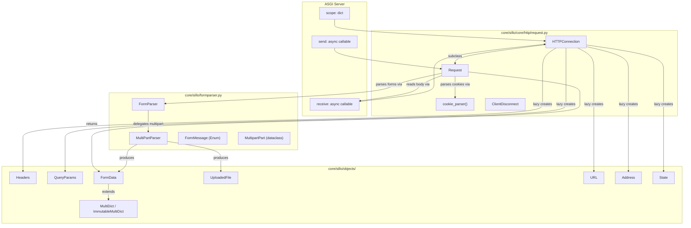
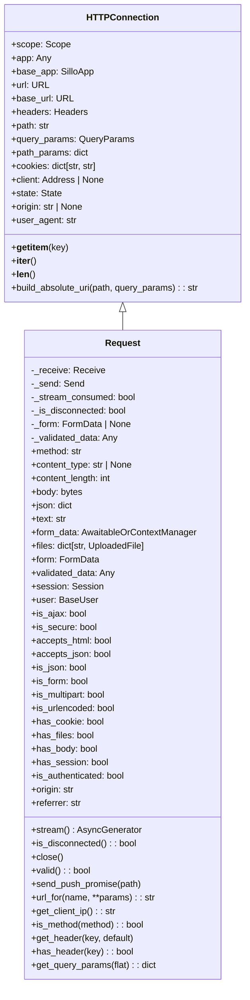
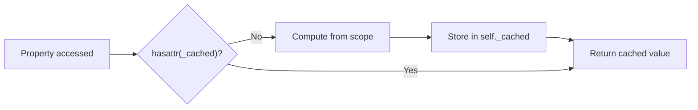
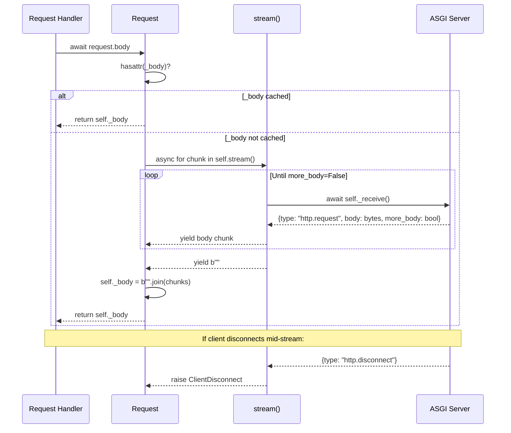
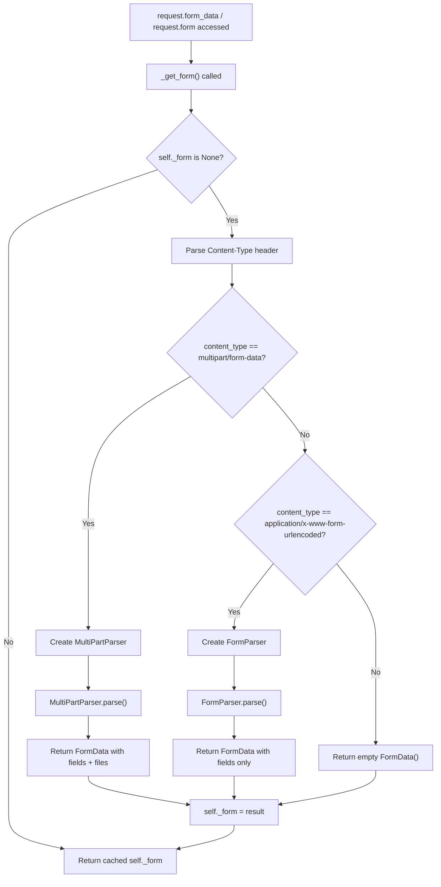
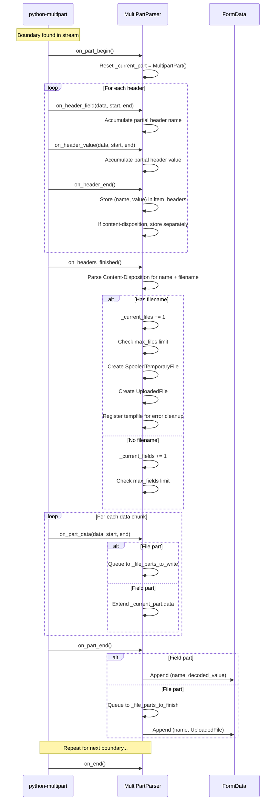

> **Module**: `sillo.core.http.request` / `sillo.formparser` / `sillo.objects`
> **Status**: Internal engineering reference
> **Last updated**: 2026-08-11

This document covers the complete lifecycle of an incoming HTTP request in the
Sillo framework — from the raw ASGI scope dictionary through to fully parsed
form data, uploaded files, and authenticated user context.

---

## 1. Architecture Overview

The HTTP request system is split across three primary source files with clearly
defined responsibilities:

| File | Responsibility |
|------|---------------|
| `core/sillo/core/http/request.py` | `HTTPConnection`, `Request`, `cookie_parser`, `ClientDisconnect` |
| `core/sillo/formparser.py` | `FormParser`, `MultiPartParser`, `FormMessage`, `MultipartPart` |
| `core/sillo/objects/http.py` | `Headers`, `QueryParams`, `FormData`, `UploadedFile`, `MutableHeaders` |
| `core/sillo/objects/common.py` | `Address`, `State`, `Scope`, `Message`, `Receive`, `Send` |
| `core/sillo/objects/routing.py` | `URL`, `URLPath`, `RouteParam` |
| `core/sillo/objects/datastructures.py` | `ImmutableMultiDict`, `MultiDict` |



---

## 2. Class Hierarchy



`Request` inherits from `HTTPConnection`, adding body consumption, form parsing,
content-type detection, session/user access, and all boolean detectors.

---

## 3. HTTPConnection — The Base Layer

**Source**: `core/sillo/core/http/request.py`, line 121

`HTTPConnection` wraps a raw ASGI scope dictionary and provides lazy-cached
property accessors for commonly needed request metadata. It is the shared base
for both `Request` (HTTP) and WebSocket connection handlers.

### 3.1 Constructor

```python
# core/sillo/core/http/request.py:146
def __init__(self, scope: Scope, receive: Receive) -> None:
    assert scope["type"] in ("http", "websocket")
    self.scope = scope
    self.scope.update({"extensions": {"websocket.http.response": {}}})
```

The constructor:
1. Validates that `scope["type"]` is `"http"` or `"websocket"`.
2. Stores the scope as `self.scope`.
3. Injects the `websocket.http.response` extension into the scope.

### 3.2 Mapping Protocol

`HTTPConnection` implements `__getitem__`, `__iter__`, and `__len__`, all
delegating directly to `self.scope`. This allows `connection["type"]` style
access:

```python
connection = request  # Request inherits HTTPConnection
assert connection["type"] == "http"
for key in connection:
    print(key, connection[key])
```

`__eq__` and `__hash__` use `object` identity (not scope comparison).

### 3.3 Lazy-Cached Properties

Every property below follows the same pattern: check `hasattr(self, "_xxx")`,
compute if missing, cache in `self._xxx`, and return.



#### 3.3.1 `url` → `URL`

**Line 268**. Constructs `URL(scope=self.scope)`. The `URL` class (from
`core/sillo/objects/routing.py`) reconstructs the full URL from `scheme`,
`server`, `path`, `query_string`, and the `host` header in the scope.

```python
@property
def url(self) -> URL:
    if not hasattr(self, "_url"):
        self._url = URL(scope=self.scope)
    return self._url
```

#### 3.3.2 `base_url` → `URL`

**Line 287**. Builds a root-path URL by overriding the scope's `path` to
`app_root_path` (or `root_path`) and clearing the query string. Used by
`build_absolute_uri`.

#### 3.3.3 `headers` → `Headers`

**Line 317**. Constructs `Headers(scope=self.scope)`, which reads
`scope["headers"]` — a list of `(bytes, bytes)` tuples. The `Headers` class
provides case-insensitive string-based access.

#### 3.3.4 `query_params` → `QueryParams`

**Line 352**. Constructs `QueryParams(self.scope["query_string"])`. `QueryParams`
is an `ImmutableMultiDict[str, str]` that parses the raw query string bytes
using `urllib.parse.parse_qsl`.

#### 3.3.5 `path_params` → `dict`

**Line 372**. Returns `self.scope.get("route_params", {})`. Not cached — the
router may populate `route_params` after construction.

#### 3.3.6 `cookies` → `dict[str, str]`

**Line 391**. Reads the `cookie` header via `self.headers.get("cookie")`, then
parses it with `cookie_parser()`. Returns `{}` if no header is present.

#### 3.3.7 `client` → `Address | None`

**Line 416**. Reads `self.scope.get("client")` and wraps the `(host, port)` tuple
in an `Address` named tuple. Returns `None` if the key is absent (e.g., Unix
socket connections).

#### 3.3.8 `state` → `State`

**Line 438**. Creates `State(self.scope["state"])`, seeding it with any values
from `scope["global_state"]`. Uses `setdefault` to ensure a `"state"` dict exists.

### 3.4 Other Properties

| Property | Line | Description |
|----------|------|-------------|
| `app` | 230 | Returns `self.scope["app"]` — the innermost ASGI app. |
| `base_app` | 248 | Returns `self.scope["base_app"]` — the root `SilloApp`. |
| `path` | 337 | Returns `self.url.path`. |
| `origin` | 465 | Returns `self.headers.get("Origin")`. |
| `user_agent` | 483 | Returns `self.headers.get("user-agent", "")`. |

### 3.5 `build_absolute_uri`

**Line 501**. Combines `base_url` with a relative path and optional query
params into a fully-qualified URI string.

```python
uri = request.build_absolute_uri("profile", {"tab": "settings"})
# → "https://example.com/app/profile?tab=settings"
```

---

## 4. Request — Full HTTP Request Object

**Source**: `core/sillo/core/http/request.py`, line 583

`Request` extends `HTTPConnection` with body consumption, form parsing, content
negotiation, session/user integration, and disconnect detection.

### 4.1 Constructor

```python
# core/sillo/core/http/request.py:658
def __init__(self, scope, receive=empty_receive, send=empty_send):
    super().__init__(scope, receive)
    assert scope["type"] == "http"
    self._receive = receive
    self._send = send
    self._stream_consumed = False
    self._is_disconnected = False
    self._form: FormData | Any = None
    self._validated_data = None
```

Key defaults:
- `receive` defaults to `empty_receive` (raises `RuntimeError`).
- `send` defaults to `empty_send` (raises `RuntimeError`).
- `_stream_consumed` tracks whether the ASGI stream has been fully read.
- `_form` caches parsed form data; `None` means "not yet parsed".

### 4.2 `method` Property

**Line 694**. Returns `self.scope["method"]` — always uppercase per HTTP/1.1.

### 4.3 `content_type` Property

**Line 728**. Uses `python_multipart`'s `parse_options_header` to extract the
media type from the `Content-Type` header, stripping parameters like `charset`
and `boundary`. Returns `None` if the header is absent.

```python
# Content-Type: application/json; charset=utf-8
request.content_type  # → "application/json"
```

### 4.4 `content_length` Property

**Line 1578**. Parses the `Content-Length` header as `int`, returning `0` if
absent or unparseable.

### 4.5 `stream()` Method

**Line 751**. An `async generator` that yields byte chunks from the ASGI receive
channel. This is the primary mechanism for reading the request body.

**Behavior**:
1. If `self._body` already exists (body was previously read), yields it once,
   then yields `b""` and returns.
2. If `_stream_consumed` is `True`, raises `RuntimeError("Stream consumed")`.
3. Otherwise, loops calling `self._receive()`:
   - On `http.request` message: yields the `body` bytes; marks stream consumed
     when `more_body` is `False`.
   - On `http.disconnect` message: sets `_is_disconnected = True` and raises
     `ClientDisconnect`.
4. After the loop ends, yields `b""` as a completion marker.

### 4.6 `body` Property (async)

**Line 789**. Lazily reads and caches the entire request body.

```python
@property
async def body(self) -> bytes:
    if not hasattr(self, "_body"):
        chunks = []
        async for chunk in self.stream():
            chunks.append(chunk)
        self._body = b"".join(chunks)
    return self._body
```

### 4.7 `json` Property (async)

**Line 813**. Reads `await self.body` and parses it with `json.loads`. Caches
the result in `self._json`. Raises `json.JSONDecodeError` on invalid JSON.

### 4.8 `text` Property (async)

**Line 855**. Reads `await self.body` and decodes it. Tries UTF-8 first, falls
back to Latin-1 on `UnicodeDecodeError`. Caches in `self._text`.

### 4.9 `form_data` Property

**Line 938**. Returns an `AwaitableOrContextManagerWrapper` wrapping
`self._get_form()`. This dual-use object supports both:

```python
# As an awaitable
form = await request.form_data

# As an async context manager (auto-closes uploaded files on exit)
async with request.form_data as form:
    name = form.get("name")
```

### 4.10 `_get_form()` Method

**Line 880**. The actual form parsing dispatch logic:

```python
async def _get_form(self, *, max_files=1000, max_fields=1000):
    if self._form is None:
        assert parse_options_header is not None, "python-multipart required"
        content_type_header = self.headers.get("Content-Type")
        content_type, _ = parse_options_header(content_type_header)

        if content_type == b"multipart/form-data":
            multipart_parser = MultiPartParser(
                self.headers, self.stream(),
                max_files=max_files, max_fields=max_fields
            )
            self._form = await multipart_parser.parse()
        elif content_type == b"application/x-www-form-urlencoded":
            form_parser = FormParser(self.headers, self.stream())
            self._form = await form_parser.parse()
        else:
            self._form = FormData()
    return self._form
```

### 4.11 `files` Property (async)

**Line 1038**. Parses form data and extracts fields with a `filename` attribute
into `dict[str, UploadedFile]`.

### 4.12 `form` Property (async)

**Line 1065**. Convenience wrapper around `form_data` that returns `FormData`
directly.

### 4.13 `validated_data` Property

**Line 836**. Returns `self._validated_data`, which is populated by the
framework's route validation middleware (e.g., Pydantic model validation).
Returns `None` if no `request_model` was configured for the route.

### 4.14 `close()` Method

**Line 956**. Delegates to `self._form.close()` if form data was parsed, which
iterates through all `FormData` values and calls `await value.close()` on any
`UploadedFile` instances. This releases temp file handles.

### 4.15 `is_disconnected()` Method

**Line 975**. Non-blocking check for client disconnection:

```python
async def is_disconnected(self) -> bool:
    if not self._is_disconnected:
        message = {}
        with anyio.CancelScope() as cs:
            cs.cancel()
            message = await self._receive()
        if message.get("type") == "http.disconnect":
            self._is_disconnected = True
    return self._is_disconnected
```

Uses an immediately-cancelled `anyio.CancelScope` to make the receive
non-blocking. If no message is available, the cancelled scope prevents the
await from blocking.

### 4.16 `send_push_promise`

**Line 1004**. Sends an HTTP/2 server push promise via
`http.response.push` ASGI message. Only copies "safe" headers:
`accept`, `accept-encoding`, `accept-language`, `cache-control`, `user-agent`.

---

## 5. Cookie Parsing

**Source**: `core/sillo/core/http/request.py`, line 54

### 5.1 `cookie_parser()` Function

```python
def cookie_parser(cookie_string: str) -> dict[str, str]:
    cookie_dict: dict[str, str] = {}
    for chunk in cookie_string.split(";"):
        if "=" in chunk:
            key, val = chunk.split("=", 1)
        else:
            key, val = "", chunk
        key, val = key.strip(), val.strip()
        if key or val:
            cookie_dict[key] = http_cookies._unquote(val)
    return cookie_dict
```

**Design decisions**:
- Splits on `;` (standard cookie separator).
- Splits each chunk on `=` with `maxsplit=1` to handle values containing `=`.
- Tokens without `=` get empty key and the token as value (Mozilla convention,
  see [Bugzilla 169091](https://bugzilla.mozilla.org/show_bug.cgi?id=169091)).
- Uses Python's `http.cookies._unquote` to handle quoted values.
- **Intentionally avoids** `SimpleCookie.load` because it rejects inputs that
  real browsers accept (based on an outdated spec).
- Adapted from Django 3.1.0.

### 5.2 Usage in HTTPConnection

The `cookies` property (line 391) calls `cookie_parser` lazily:

```python
@property
def cookies(self) -> dict[str, str]:
    if not hasattr(self, "_cookies"):
        cookies = {}
        cookie_header = self.headers.get("cookie")
        if cookie_header:
            cookies = cookie_parser(cookie_header)
        self._cookies = cookies
    return self._cookies
```

The `has_cookie` property (line 1326) checks for a non-empty cookie header
without parsing:

```python
@property
def has_cookie(self) -> bool:
    cookie_header = self.headers.get("cookie")
    return cookie_header is not None and cookie_header.strip() != ""
```

---

## 6. ClientDisconnect

**Source**: `core/sillo/core/http/request.py`, line 100

```python
class ClientDisconnect(Exception):
    """Exception raised when the HTTP client disconnects during request processing."""
```

This is a bare exception class with no additional payload. It is raised by
`Request.stream()` when the ASGI server delivers an `http.disconnect` message
instead of `http.request`.

**When it's raised**:
- The client closes the connection before the server finishes reading the body.
- Network interruption during body streaming.

**How to handle it**:

```python
@app.post("/upload")
async def upload(request: Request):
    try:
        body = await request.body
    except ClientDisconnect:
        # Client went away — cleanup, log, etc.
        return
```

The `is_disconnected()` method provides a non-throwing alternative for
long-running handlers that want to periodically check.

---

## 7. Request Body Reading Flow



### Key State Flags

| Flag | Default | Purpose |
|------|---------|---------|
| `_stream_consumed` | `False` | Set to `True` after the last `http.request` message with `more_body=False`. Prevents double-reading. |
| `_is_disconnected` | `False` | Set to `True` when `http.disconnect` is received. Sticky — once set, never unset. |
| `_body` (attribute) | absent | Cached full body bytes. Presence indicates body was already read. |

### Stream Guarantees

1. **Single consumption**: The stream can only be consumed once. Calling
   `stream()` after `_stream_consumed = True` raises `RuntimeError`.
2. **Cache shortcut**: If `_body` exists, `stream()` yields it immediately
   without touching the ASGI receive channel.
3. **Completion marker**: The generator always yields `b""` as its final chunk
   to signal end-of-stream.
4. **Disconnect propagation**: `ClientDisconnect` is raised at the point of
   receive, not deferred.

---

## 8. Form Parsing Pipeline



### 8.1 FormParser

**Source**: `core/sillo/formparser.py`, line 134

`FormParser` is a high-level dispatcher. It examines `Content-Type` and either:

1. **Multipart**: Delegates to `MultiPartParser`.
2. **URL-encoded**: Reads the entire stream into memory, decodes with
   `urllib.parse.parse_qsl`, and builds a `FormData`.

#### URL-Encoded Parsing Path

```python
# Simplified from formparser.py:255
async def parse(self) -> FormData:
    content_type = self.headers.get("content-type", "")
    if content_type.startswith("multipart/form-data"):
        return await MultiPartParser(self.headers, self.stream).parse()

    form = FormData()
    content = b""
    async for chunk in self.stream:
        if chunk:
            content += chunk

    if content:
        try:
            field_items = urllib.parse.parse_qsl(
                content.decode("utf-8"), keep_blank_values=True
            )
            for key, value in field_items:
                decoded_value = urllib.parse.unquote(value)
                form.append(key, decoded_value)
        except (UnicodeDecodeError, ValueError):
            # Fallback to latin-1
            ...
    return form
```

**Character encoding**: Tries UTF-8 first, falls back to Latin-1. Values are
URL-decoded via `urllib.parse.unquote`.

#### Callback-Based Parsing (URL-encoded)

`FormParser` also registers callbacks for the `python-multipart` library's
URL-encoded parser:

| Callback | Line | Purpose |
|----------|------|---------|
| `on_field_start()` | 171 | Emits `FormMessage.FIELD_START` |
| `on_field_name(data, start, end)` | 185 | Emits `FormMessage.FIELD_NAME` with name bytes |
| `on_field_data(data, start, end)` | 206 | Emits `FormMessage.FIELD_DATA` with value bytes |
| `on_field_end()` | 227 | Emits `FormMessage.FIELD_END` |
| `on_end()` | 241 | Emits `FormMessage.END` |

These callbacks accumulate `(FormMessage, bytes)` tuples in `self.messages`.

### 8.2 FormMessage Enum

**Source**: `core/sillo/formparser.py`, line 29

```python
class FormMessage(Enum):
    FIELD_START = 1
    FIELD_NAME = 2
    FIELD_DATA = 3
    FIELD_END = 4
    END = 5
```

Represents the lifecycle phases of a single form field during parsing.

---

## 9. MultiPartParser Deep Dive

**Source**: `core/sillo/formparser.py`, line 316

### 9.1 Class-Level Limits

```python
class MultiPartParser:
    max_file_size = 1024 * 1024  # 1MB — SpooledTemporaryFile threshold
    max_part_size = 1024 * 1024  # 1MB — commented out, not enforced
    max_fields = 1000            # Max non-file form fields
    max_files = 1000             # Max file uploads
```

These can be overridden per-instance via constructor kwargs or by subclassing.

### 9.2 Constructor

```python
# formparser.py:349
def __init__(self, headers, stream, *, max_fields=None, max_files=None):
    self.items: list[tuple[str, str | UploadedFile]] = []
    self._current_files = 0
    self._current_fields = 0
    self._current_partial_header_name: bytes = b""
    self._current_partial_header_value: bytes = b""
    self._current_part = MultipartPart()
    self._charset = ""
    self._file_parts_to_write: list[tuple[MultipartPart, bytes]] = []
    self._file_parts_to_finish: list[MultipartPart] = []
    self._files_to_close_on_error: list[SpooledTemporaryFile[bytes]] = []
```

### 9.3 Callback-Driven Architecture

The parser registers 8 callbacks with the `python-multipart` library's
`MultipartParser`:



### 9.4 MultipartPart Dataclass

**Source**: `core/sillo/formparser.py`, line 51

```python
@dataclass
class MultipartPart:
    content_disposition: bytes | None = None
    field_name: str = ""
    data: bytearray = field(default_factory=bytearray)
    file: UploadedFile | None = None
    item_headers: list[tuple[bytes, bytes]] = field(default_factory=list)
```

Represents a single part being assembled during parsing. For file uploads, the
`file` attribute holds an `UploadedFile`; for regular fields, `data` accumulates
the raw bytes.

### 9.5 The `parse()` Method

```python
# formparser.py:606
async def parse(self) -> FormData:
    content_type = self.headers.get("content-type", "")
    content_type, params = parse_options_header(content_type)

    if content_type != b"multipart/form-data":
        return FormData()

    boundary = params.get(b"boundary")
    if not boundary:
        return FormData()

    charset = params.get(b"charset")
    self._charset = charset.decode("latin-1") if charset else "utf-8"

    callbacks = {
        "on_part_begin": self.on_part_begin,
        "on_part_data": self.on_part_data,
        "on_part_end": self.on_part_end,
        "on_header_field": self.on_header_field,
        "on_header_value": self.on_header_value,
        "on_header_end": self.on_header_end,
        "on_headers_finished": self.on_headers_finished,
        "on_end": self.on_end,
    }

    parser = multipart.MultipartParser(boundary, callbacks)
    try:
        async for chunk in self.stream:
            parser.write(chunk)
            # Write queued file data via await (avoids blocking event loop)
            for part, data in self._file_parts_to_write:
                await part.file.write(data)
            for part in self._file_parts_to_finish:
                assert part.file
                await part.file.seek(0)
            self._file_parts_to_write.clear()
            self._file_parts_to_finish.clear()
    except MultiPartException:
        for file in self._files_to_close_on_error:
            file.close()
        raise

    parser.finalize()
    return FormData(self.items)
```

**Critical detail**: File writes use `await` to delegate disk I/O to a
threadpool via `run_in_threadpool`, preventing the event loop from blocking on
large file uploads.

### 9.6 Temp File Cleanup

On `MultiPartException`, the parser closes all `SpooledTemporaryFile` instances
tracked in `_files_to_close_on_error` before re-raising. This prevents file
descriptor leaks when parsing fails mid-stream.

On success, the caller (`Request.close()` or the `AwaitableOrContextManager`
exit) calls `FormData.close()`, which iterates all `UploadedFile` values and
closes them.

### 9.7 SpooledTemporaryFile Behavior

```python
tempfile = SpooledTemporaryFile(max_size=self.max_file_size)
# max_file_size = 1MB (1024 * 1024)
```

- Data up to `max_file_size` (1MB) stays in memory as a `BytesIO`.
- Beyond that threshold, Python automatically rolls the data to a real temp
  file on disk.
- `UploadedFile._in_memory` checks `file._rolled` to determine which path
  to use for I/O operations.

### 9.8 MultiPartException

**Source**: `core/sillo/formparser.py`, line 109

```python
class MultiPartException(Exception):
    def __init__(self, message: str) -> None:
        self.message = message
```

Raised when:
- `Content-Disposition` header is missing the `name` field.
- `max_files` limit exceeded.
- `max_fields` limit exceeded.

Note: The `max_file_size` and `max_part_size` checks are currently **commented
out** (lines 431-443) with the note "might reimplemented in further versions".

---

## 10. UploadedFile

**Source**: `core/sillo/objects/http.py`, line 670

### 10.1 Attributes

| Attribute | Type | Description |
|-----------|------|-------------|
| `filename` | `str \| None` | Original filename from the upload. |
| `file` | `Any` | Underlying file object (`SpooledTemporaryFile`, `BytesIO`, etc.). |
| `size` | `int \| None` | Current file size in bytes. Updated on `write()`. |
| `headers` | `Headers` | Part-specific headers (e.g., `Content-Type`). |

### 10.2 `content_type` Property

```python
@property
def content_type(self) -> str | None:
    return self.headers.get("content-type", None)
```

### 10.3 `_in_memory` Property

```python
@property
def _in_memory(self) -> bool:
    rolled_to_disk = getattr(self.file, "_rolled", True)
    return not rolled_to_disk
```

Checks `SpooledTemporaryFile._rolled`. If the file hasn't rolled, it's in
memory and can be accessed synchronously. Otherwise, disk I/O needs threadpool
delegation.

### 10.4 Async I/O Methods

All four methods follow the same pattern — synchronous for in-memory,
threadpool-delegated for disk-backed:

| Method | Line | Description |
|--------|------|-------------|
| `write(data)` | 755 | Writes bytes, increments `size`. |
| `read(size=-1)` | 781 | Reads bytes from current position. |
| `seek(offset)` | 804 | Moves file position. |
| `close()` | 827 | Closes the file, releasing resources. |

```python
async def write(self, data: bytes) -> None:
    if self.size is not None:
        self.size += len(data)
    if self._in_memory:
        self.file.write(data)
    else:
        await run_in_threadpool(self.file.write, data)
```

### 10.5 `save()` Method

```python
async def save(self, destination: str | os.PathLike[str]) -> None:
    if self._in_memory:
        self.file.seek(0)
        with open(destination, "wb") as f:
            shutil.copyfileobj(self.file, f)
    else:
        await run_in_threadpool(self._save_to_disk, destination)
```

For in-memory files, seeks to start before copying (handles callers who
inspected the upload and left the cursor at EOF).

### 10.6 Pydantic Integration

`UploadedFile` provides `__get_pydantic_core_schema__` and
`__get_pydantic_json_schema__` class methods for use in Pydantic models:

- **Core schema**: Validates as `bytes`, then constructs `UploadedFile`.
- **JSON schema**: `{"type": "string", "format": "binary"}` (OpenAPI file
  upload representation).

---

## 11. Supporting Data Structures

### 11.1 Headers

**Source**: `core/sillo/objects/http.py`, line 120

An immutable, case-insensitive mapping for HTTP headers. Internally stores
headers as a `list[tuple[bytes, bytes]]` for ASGI compatibility.

Key behaviors:
- `__getitem__` returns `None` for missing keys (not `KeyError`).
- `get(key, default)` overrides `Mapping.get` to honor the default when
  `__getitem__` returns `None`.
- `getlist(key)` returns all values for headers that appear multiple times.
- `mutablecopy()` returns a `MutableHeaders` for modification.

### 11.2 MutableHeaders

**Source**: `core/sillo/objects/http.py`, line 437

Extends `Headers` with `__setitem__`, `__delitem__`, `append`, `update`,
`setdefault`, and `add_vary_header`. Used by middleware and response
construction.

### 11.3 QueryParams

**Source**: `core/sillo/objects/http.py`, line 17

An `ImmutableMultiDict[str, str]` that parses URL query strings. Supports
initialization from `str`, `bytes`, or mappings. Encodes back to query string
format via `str()`.

### 11.4 FormData

**Source**: `core/sillo/objects/http.py`, line 988

A `MultiDict` that adds `async close()` for cleaning up `UploadedFile`
instances. Values are either `str` (regular fields) or `UploadedFile` (files).

### 11.5 ImmutableMultiDict / MultiDict

**Source**: `core/sillo/objects/datastructures.py`

The foundational mapping types. `ImmutableMultiDict` supports multiple values
per key with `getlist(key)` and `multi_items()`. `MultiDict` adds mutations:
`__setitem__`, `__delitem__`, `pop`, `append`, `setlist`, `clear`, `update`.

### 11.6 URL

**Source**: `core/sillo/objects/routing.py`, line 13

An immutable URL wrapper with lazy-parsed components (`scheme`, `netloc`, `path`,
`query`, `fragment`, `hostname`, `port`, `username`, `password`). Supports
`replace()`, `include_query_params()`, `replace_query_params()`,
`remove_query_params()` — all returning new instances.

### 11.7 Address

**Source**: `core/sillo/objects/common.py`, line 13

```python
class Address(typing.NamedTuple):
    host: str
    port: int
```

### 11.8 State

**Source**: `core/sillo/objects/common.py`, line 102

Dictionary-backed attribute-style storage. Missing attributes return `None`
instead of raising `AttributeError`. Used for `request.state` and `app.state`.

---

## 12. Lazy-Caching Pattern

The entire request system is built on a consistent lazy-caching idiom:

```python
@property
def some_property(self) -> SomeType:
    if not hasattr(self, "_some_property"):
        self._some_property = expensive_computation()
    return self._some_property
```

**Properties using this pattern**:

| Property | Cache attr | Computation |
|----------|-----------|-------------|
| `HTTPConnection.url` | `_url` | `URL(scope=self.scope)` |
| `HTTPConnection.base_url` | `_base_url` | Modified scope → `URL(scope=...)` |
| `HTTPConnection.headers` | `_headers` | `Headers(scope=self.scope)` |
| `HTTPConnection.query_params` | `_query_params` | `QueryParams(scope["query_string"])` |
| `HTTPConnection.cookies` | `_cookies` | `cookie_parser(header)` |
| `HTTPConnection.state` | `_state` | `State(scope["state"])` |
| `Request.body` | `_body` | `b"".join(stream())` (async) |
| `Request.json` | `_json` | `json.loads(body)` (async) |
| `Request.text` | `_text` | `body.decode(...)` (async) |
| `Request._form` | `_form` | Full form parsing pipeline |

**Why `hasattr` instead of `None` sentinel**: The cached value might itself be
`None` or empty, so a `None` check would re-trigger computation. `hasattr`
is unambiguous.

**Note**: `path_params` is **not** cached — it's a direct `scope.get()` call
because the router may populate `route_params` after the connection is created.

---

## 13. Boolean Detectors

**Source**: `core/sillo/core/http/request.py`, lines 1190–1343 and 1377–1456

### Content-Type Detectors

| Property | Line | Condition |
|----------|------|-----------|
| `is_json` | 1243 | `"application/json" in content_type` |
| `is_form` | 1261 | Content type starts with `application/x-www-form-urlencoded` or `multipart/form-data` |
| `is_multipart` | 1284 | Content type starts with `multipart/form-data` |
| `is_urlencoded` | 1305 | Content type exactly equals `application/x-www-form-urlencoded` |

### Request Context Detectors

| Property | Line | Condition |
|----------|------|-----------|
| `is_ajax` | 1190 | `x-requested-with` header == `"xmlhttprequest"` (case-insensitive) |
| `is_secure` | 1208 | `url.scheme == "https"` |
| `accepts_html` | 1225 | `Accept` header contains `"text/html"` or `"*/*"` |
| `accepts_json` | 1439 | `Accept` header contains `"application/json"` or `"*/*"` |
| `has_cookie` | 1326 | Non-empty `cookie` header present |
| `has_files` | 1344 | Multipart request with file uploads |
| `has_body` | 1377 | `Content-Length > 0` or method is POST/PUT/PATCH |
| `has_session` | 1422 | `"session"` key in scope |
| `is_authenticated` | 1400 | `user.is_authenticated` is truthy |

### Method Matching

```python
# Line 1558
def is_method(self, method: str) -> bool:
    return self.method.upper() == method.upper()
```

### Other Utility Properties/Methods

| Member | Line | Description |
|--------|------|-------------|
| `origin` (property) | 1496 | `Origin` header or constructs from URL. |
| `referrer` (property) | 1514 | `Referer` header or empty string. |
| `get_client_ip()` | 1531 | `X-Forwarded-For` → `X-Real-IP` → `client.host`. |
| `get_header(key, default)` | 1457 | Case-insensitive header lookup with default. |
| `has_header(key)` | 1478 | Case-insensitive header existence check. |
| `valid()` | 1086 | Standard HTTP method + non-empty headers. |
| `get_query_params(flat)` | 1599 | Query params as flat dict or list-of-values dict. |

---

## 14. Session & User Integration

### 14.1 Session

```python
# Line 1111
@property
def session(self) -> Session:
    assert "session" in self.scope, "No Session Middleware Installed"
    return self.scope["session"]
```

Requires session middleware to be installed. The session object is injected into
the scope by middleware before the handler runs.

### 14.2 User

```python
# Line 1130
@property
def user(self) -> BaseUser:
    user = self.scope.get("user", None)
    if not user:
        raise ValueError("Authentication middleware required to use request.user")
    return user
```

Requires authentication middleware. Raises `ValueError` (not `AssertionError`)
if no user is present.

### 14.3 Safe Alternatives

```python
# Line 1400
@property
def is_authenticated(self) -> bool:
    try:
        user = self.user
        return user.is_authenticated
    except ValueError:
        return False

# Line 1422
@property
def has_session(self) -> bool:
    return "session" in self.scope
```

---

## 15. Code Examples

### 15.1 Basic Request Handling

```python
from sillo import SilloApp
from sillo.core.http.request import Request

app = SilloApp()

@app.get("/users/{user_id}")
async def get_user(request: Request):
    # Path parameters
    user_id = request.path_params["user_id"]

    # Query parameters
    include_posts = request.query_params.get("include_posts", "false")

    # Headers
    auth = request.headers.get("authorization")

    # Cookies
    session_id = request.cookies.get("session_id")

    # URL info
    is_secure = request.is_secure
    full_url = str(request.url)

    return {"user_id": user_id, "secure": is_secure}
```

### 15.2 JSON Body Parsing

```python
@app.post("/api/data")
async def receive_json(request: Request):
    if not request.is_json:
        return {"error": "Expected JSON"}, 415

    data = await request.json
    text = await request.text  # Also available

    return {"received": len(data)}
```

### 15.3 Form Data (URL-encoded)

```python
@app.post("/contact")
async def contact_form(request: Request):
    form = await request.form_data
    name = form.get("name")
    email = form.get("email")
    # For multi-value fields:
    tags = form.getlist("tags")
    return {"name": name, "email": email}
```

### 15.4 File Upload

```python
@app.post("/upload")
async def upload_file(request: Request):
    if not request.has_files:
        return {"error": "No files"}, 400

    async with request.form_data as form:
        file = form.get("document")
        if isinstance(file, UploadedFile):
            # Inspect before saving
            content = await file.read()
            print(f"Received {file.filename} ({len(content)} bytes)")

            # Save to disk
            await file.save(f"uploads/{file.filename}")

    return {"uploaded": file.filename}
```

### 15.5 Streaming Large Bodies

```python
@app.post("/stream")
async def stream_body(request: Request):
    total = 0
    async for chunk in request.stream():
        total += len(chunk)
    return {"bytes_received": total}
```

### 15.6 Disconnect Detection

```python
@app.post("/long-upload")
async def long_upload(request: Request):
    chunks = []
    async for chunk in request.stream():
        chunks.append(chunk)
        # Check periodically if client is still there
        if await request.is_disconnected():
            print("Client disconnected mid-upload")
            return
    return {"chunks": len(chunks)}
```

### 15.7 Request State Sharing

```python
@app.middleware
async def timing_middleware(request: Request, call_next):
    import time
    request.state.start_time = time.monotonic()
    response = await call_next(request)
    elapsed = time.monotonic() - request.state.start_time
    response.headers["X-Response-Time"] = f"{elapsed:.3f}s"
    return response
```

### 15.8 Building Absolute URIs

```python
@app.get("/redirect")
async def redirect_example(request: Request):
    callback_url = request.build_absolute_uri(
        "oauth/callback", {"provider": "github"}
    )
    return {"redirect_to": callback_url}
```

### 15.9 Client IP Detection

```python
@app.get("/whoami")
async def whoami(request: Request):
    return {
        "ip": request.get_client_ip(),
        "user_agent": request.user_agent,
        "is_ajax": request.is_ajax,
    }
```

### 15.10 Content Negotiation

```python
@app.get("/data")
async def content_negotiation(request: Request):
    if request.accepts_json:
        return {"format": "json"}
    elif request.accepts_html:
        return "<h1>Data</h1>"
    return "Plain text data"
```

---

## 16. Error Handling Matrix

| Scenario | Exception | Raised By | Handler |
|----------|-----------|-----------|---------|
| Client disconnects during body read | `ClientDisconnect` | `Request.stream()` | Catch in handler or check `is_disconnected()` |
| Stream already consumed | `RuntimeError("Stream consumed")` | `Request.stream()` | Only read body once per request |
| No receive channel | `RuntimeError("Cannot receive...")` | `empty_receive()` | Provide real `receive` callable |
| Invalid JSON body | `json.JSONDecodeError` | `Request.json` | Validate content type first |
| `python-multipart` not installed | `AssertionError` | `FormParser.__init__`, `MultiPartParser.__init__` | Install the dependency |
| Too many files | `MultiPartException` | `MultiPartParser.on_headers_finished()` | Caught by `_get_form()`, returns `{}` |
| Too many fields | `MultiPartException` | `MultiPartParser.on_headers_finished()` | Caught by `_get_form()`, returns `{}` |
| Missing `name` in Content-Disposition | `MultiPartException` | `MultiPartParser.on_headers_finished()` | Caught by `_get_form()`, returns `{}` |
| No session middleware | `AssertionError` | `Request.session` | Install session middleware or use `has_session` |
| No auth middleware | `ValueError` | `Request.user` | Install auth middleware or use `is_authenticated` |

---

## 17. Performance Considerations

### 17.1 Body Reading

- The entire body is read into memory as a single `bytes` object via
  `b"".join(chunks)`. For very large uploads, prefer `stream()` to process
  incrementally.
- Once `_body` is cached, subsequent `json`, `text`, and form parsing all
  reuse it without re-reading the stream.

### 17.2 Form Parsing

- URL-encoded forms are read entirely into memory before parsing.
- Multipart file data uses `SpooledTemporaryFile(max_size=1MB)`: small files
  stay in memory, large files roll to disk.
- File writes in `MultiPartParser.parse()` are `await`ed (via `run_in_threadpool`)
  to avoid blocking the event loop.

### 17.3 Header Parsing

- `Headers` performs a linear scan of the raw header list for each lookup
  (`O(n)` where `n` is the number of headers). This is acceptable because
  typical requests have 10-30 headers.
- Header names are lowercased and stored as bytes internally; string decoding
  happens on access.

### 17.4 Cookie Parsing

- `cookie_parser` is called once per request (cached in `_cookies`).
- Uses `str.split(";")` and `str.split("=", 1)` — no regex overhead.

### 17.5 Disconnection Check

- `is_disconnected()` uses `anyio.CancelScope` with immediate cancellation
  to make the check non-blocking. The cancelled scope ensures the `await
  self._receive()` returns immediately if no message is available.

---

## 18. Testing Notes

### 18.1 Creating Test Requests

```python
from sillo.core.http.request import Request

# Minimal GET request
scope = {
    "type": "http",
    "method": "GET",
    "path": "/test",
    "query_string": b"foo=bar&baz=qux",
    "headers": [
        (b"host", b"example.com"),
        (b"content-type", b"application/json"),
    ],
    "scheme": "http",
    "server": ("127.0.0.1", 8000),
}
request = Request(scope)
```

### 18.2 Mocking the Receive Channel

```python
async def mock_receive():
    return {
        "type": "http.request",
        "body": b'{"key": "value"}',
        "more_body": False,
    }

request = Request(scope, receive=mock_receive)
body = await request.body  # b'{"key": "value"}'
```

### 18.3 Simulating Client Disconnect

```python
async def disconnect_receive():
    return {"type": "http.disconnect"}

request = Request(scope, receive=disconnect_receive)
# stream() will raise ClientDisconnect
```

### 18.4 Testing Form Parsing

```python
boundary = b"----boundary123"
body = (
    b"------boundary123\r\n"
    b'Content-Disposition: form-data; name="field1"\r\n\r\n'
    b"value1\r\n"
    b"------boundary123\r\n"
    b'Content-Disposition: form-data; name="file1"; filename="test.txt"\r\n'
    b"Content-Type: text/plain\r\n\r\n"
    b"file content\r\n"
    b"------boundary123--\r\n"
)

scope = {
    "type": "http",
    "method": "POST",
    "path": "/upload",
    "query_string": b"",
    "headers": [
        (b"host", b"example.com"),
        (b"content-type", f"multipart/form-data; boundary=----boundary123".encode()),
        (b"content-length", str(len(body)).encode()),
    ],
    "scheme": "http",
    "server": ("127.0.0.1", 8000),
}

chunks = [body]
async def mock_receive():
    if chunks:
        return {"type": "http.request", "body": chunks.pop(0), "more_body": False}
    return {"type": "http.request", "body": b"", "more_body": False}

request = Request(scope, receive=mock_receive)
form = await request.form_data
assert form.get("field1") == "value1"
```

### 18.5 Verifying Lazy Caching

```python
request = Request(scope, receive=mock_receive)
# First access triggers computation
headers1 = request.headers
# Second access returns cached instance
headers2 = request.headers
assert headers1 is headers2  # Same object
```

---

## Appendix A: Source File Quick Reference

| File | Lines | Key Exports |
|------|-------|-------------|
| `core/sillo/core/http/request.py` | 1625 | `HTTPConnection`, `Request`, `cookie_parser`, `ClientDisconnect`, `empty_receive`, `empty_send` |
| `core/sillo/formparser.py` | 682 | `FormParser`, `MultiPartParser`, `FormMessage`, `MultipartPart`, `MultiPartException`, `_user_safe_decode` |
| `core/sillo/objects/http.py` | 1070 | `QueryParams`, `Headers`, `MutableHeaders`, `UploadedFile`, `FormData` |
| `core/sillo/objects/common.py` | 209 | `Address`, `Secret`, `State`, `Scope`, `Message`, `Receive`, `Send` |
| `core/sillo/objects/routing.py` | 780 | `URL`, `URLPath`, `RouteParam` |
| `core/sillo/objects/datastructures.py` | 438 | `ImmutableMultiDict`, `MultiDict` |
| `core/sillo/core/helpers/async_helpers.py` | 256 | `AwaitableOrContextManager`, `AwaitableOrContextManagerWrapper`, `is_async_callable` |

## Appendix B: Dependency on `python-multipart`

Form parsing (both URL-encoded and multipart) requires the `python-multipart`
library. The import chain handles both naming conventions:

```python
# formparser.py:17-26
try:
    try:
        import python_multipart as multipart
        from python_multipart.multipart import parse_options_header
    except ModuleNotFoundError:
        import multipart
        from multipart.multipart import parse_options_header
except ModuleNotFoundError:
    multipart = None
    parse_options_header = None
```

If the library is missing, assertions fire at parse time — not at import time.
This allows the framework to be imported without the dependency as long as
form parsing is not used.

## Appendix C: ASGI Message Types

The request system interacts with two ASGI message types:

### `http.request`

```python
{
    "type": "http.request",
    "body": b"...",        # bytes chunk (may be empty)
    "more_body": False,    # True if more chunks follow
}
```

### `http.disconnect`

```python
{
    "type": "http.disconnect",
}
```

Sent by the ASGI server when the client closes the connection. Triggers
`ClientDisconnect` in `stream()` and `True` in `is_disconnected()`.

## Appendix D: Thread Safety Notes

- `Request` objects are designed for single-request lifecycle — one `Request`
  per ASGI connection, processed by a single coroutine.
- The lazy-caching pattern (`hasattr` + `setattr`) is safe because Python's
  GIL ensures atomic attribute operations.
- `SpooledTemporaryFile` is not thread-safe, but the async I/O methods in
  `UploadedFile` ensure sequential access via the event loop.
- `FormData` and `MultiDict` are not thread-safe by design — they are
  request-scoped and accessed from a single async context.

---

*End of document.*
