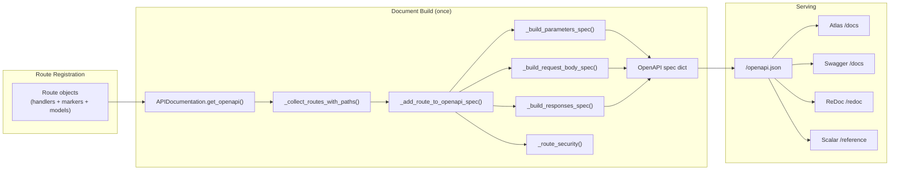
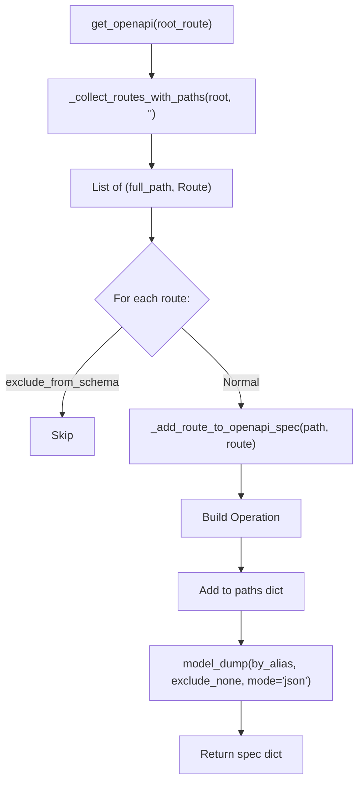
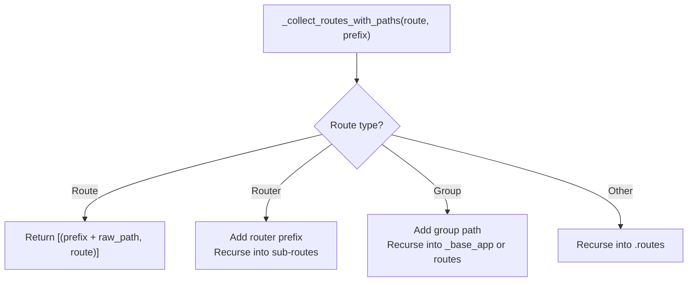
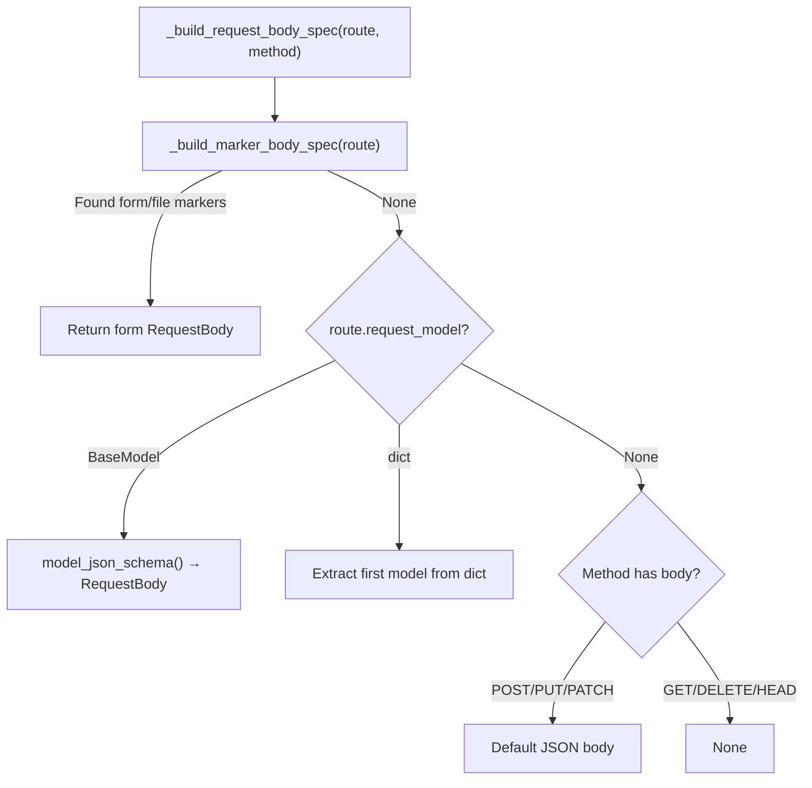
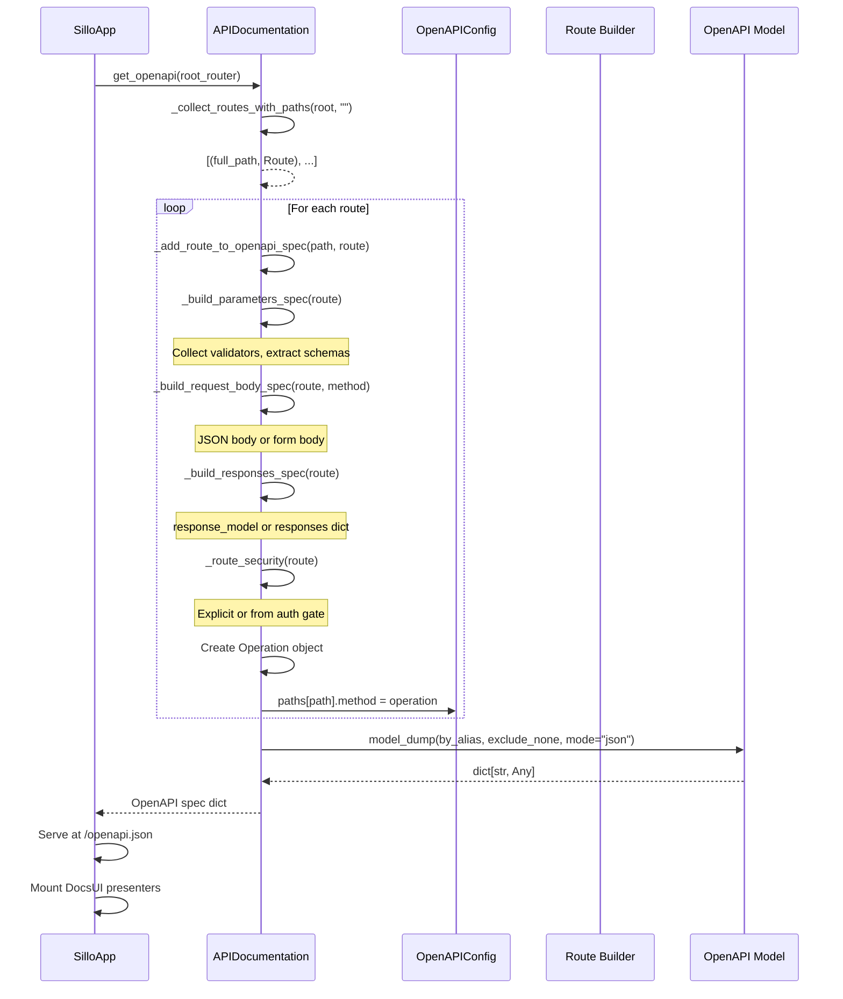

> **Source files:**
> - `core/sillo/openapi/config.py`, `OpenAPIConfig`
> - `core/sillo/openapi/models.py`: Pydantic OpenAPI 3.0 models (`OpenAPI`, `Info`, `PathItem`, `Operation`, `Schema`, `Components`, etc.)
> - `core/sillo/openapi/_builder.py`, `APIDocumentation`
> - `core/sillo/openapi/ui.py`: `DocsUI`, `Atlas`, `Swagger`, `ReDoc`, `Scalar`, `default_docs`
> - `core/sillo/openapi/utils.py`, `get_openapi` (route flattening utility)
> - `core/sillo/openapi/__init__.py`. Public re-exports

---

## 14.1  Architecture Overview

Sillo's OpenAPI system generates a complete OpenAPI 3.0 specification from
route declarations and validated parameter models. The document is built
**once** after all routes are registered and served as a static JSON file.
Documentation UIs (Atlas, Swagger, ReDoc, Scalar) render it client-side.



---

## 14.2  `OpenAPIConfig`

```python
# core/sillo/openapi/config.py:21-163
class OpenAPIConfig:
    def __init__(
        self,
        title: str = "API Documentation",
        version: str = "1.0.0",
        description: str = "",
        servers: list[Server] | None = [],
        contact: Contact | None = None,
        license: License | None = None,
        termsOfService: str | None = None,
        openapi_version: str = "3.0.0",
    ):
```

`OpenAPIConfig` holds the OpenAPI document and provides methods to modify
its components section. It is the single source of truth for the spec.

### 14.2.1  Constructor Fields

| Field              | Type          | Default               | Description |
|--------------------|---------------|-----------------------|-------------|
| `title`            | `str`         | `"API Documentation"` | API title in the `info` block. |
| `version`          | `str`         | `"1.0.0"`            | API version. |
| `description`      | `str`         | `""`                  | API description. |
| `servers`          | `list[Server]`| `[]`                  | Server entries. |
| `contact`          | `Contact`     | `None`                | Contact info. |
| `license`          | `License`     | `None`                | License info. |
| `termsOfService`   | `str`         | `None`                | Terms of service URL. |
| `openapi_version`  | `str`         | `"3.0.0"`             | OpenAPI spec version. |

### 14.2.2  Internal State

The config creates an `OpenAPI` Pydantic model in `__init__`:

```python
# config.py:36-49
self.openapi_spec = OpenAPI(
    openapi=openapi_version,
    info=Info(
        title=title, version=version, description=description,
        contact=contact, license=license, termsOfService=termsOfService,
    ),
    paths={},
    servers=servers,
    components=Components(),
)
```

### 14.2.3  Component Registration Methods

#### `add_security_scheme(name, scheme)`

```python
# config.py:69-77
def add_security_scheme(self, name: str, scheme: SecurityScheme):
    if not self.openapi_spec.components:
        self.openapi_spec.components = Components()
    if not self.openapi_spec.components.securitySchemes:
        self.openapi_spec.components.securitySchemes = {}
    self.openapi_spec.components.securitySchemes[name] = scheme
```

Registers a security scheme (API key, HTTP bearer, OAuth2, OpenID Connect).

#### `add_schema(name, schema)`

```python
# config.py:79-92
def add_schema(self, name: str, schema: type[BaseModel] | Schema):
    if isinstance(schema, type) and issubclass(schema, BaseModel):
        self.openapi_spec.components.schemas[name] = Schema(**schema.model_json_schema())
    else:
        self.openapi_spec.components.schemas[name] = schema
```

Accepts either a Pydantic `BaseModel` subclass (auto-converted via
`model_json_schema()`) or a raw `Schema` object.

#### `add_parameter(name, parameter)`

```python
# config.py:94-102
def add_parameter(self, name: str, parameter: Parameter):
    ...
    self.openapi_spec.components.parameters[name] = parameter
```

Registers a reusable parameter component.

#### `add_response(name, response)`

```python
# config.py:104-112
def add_response(self, name: str, response: OpenAPIResponse):
    ...
    self.openapi_spec.components.responses[name] = response
```

Registers a reusable response component.

#### `add_example(name, example)`

```python
# config.py:114-122
def add_example(self, name: str, example: Example):
    ...
    self.openapi_spec.components.examples[name] = example
```

Registers an example component.

#### `add_tag(tag)`

```python
# config.py:124-132
def add_tag(self, tag: Tag):
    if not self.openapi_spec.tags:
        self.openapi_spec.tags = []
    existing_tags = [t.name for t in self.openapi_spec.tags]
    if tag.name not in existing_tags:
        self.openapi_spec.tags.append(tag)
```

Adds a tag, deduplicating by name.

### 14.2.4  Additional Methods

| Method                      | Description |
|-----------------------------|-------------|
| `add_server(server)`        | Add a server entry. |
| `set_external_docs(docs)`   | Set external documentation link. |
| `set_global_security(sec)`  | Set global security requirements. |
| `get_schema_ref(name)`      | Returns `#/components/schemas/{name}`. |
| `get_parameter_ref(name)`   | Returns `#/components/parameters/{name}`. |
| `get_response_ref(name)`    | Returns `#/components/responses/{name}`. |
| `get_example_ref(name)`     | Returns `#/components/examples/{name}`. |

### 14.2.5  Security Schemes Property

```python
# config.py:51-67
@property
def security_schemes(self) -> dict[str, SecurityScheme | Reference]:
    components = self.openapi_spec.components
    if components is None or not components.securitySchemes:
        return {}
    return components.securitySchemes
```

Reads directly from the document. This used to be a separate dict that was
never written to, causing the application to report no security schemes.

---

## 14.3  Pydantic OpenAPI 3.0 Models

All OpenAPI structures are modeled as Pydantic `BaseModel` subclasses in
`core/sillo/openapi/models.py` (494 lines). They provide validation, JSON
serialization, and `$ref` support.

### 14.3.1  Document Root

```python
# models.py:478-489
class OpenAPI(BaseModel):
    openapi: str
    info: Info
    paths: Annotated[dict[str, PathItem | Extension], Field(default_factory=dict)]
    servers: list[Server] | None = None
    components: Components = Components()
    security: list[dict[str, list[str]]] | None = None
    tags: list[Tag] | None = None
    externalDocs: ExternalDocumentation | None = None
```

### 14.3.2  Info Block

```python
# models.py:44-54
class Info(BaseModel):
    title: str
    version: str
    description: str | None = None
    termsOfService: str | None = None
    contact: Contact | None = None
    license: License | None = None
    model_config = ConfigDict(extra="allow")
```

`extra="allow"` permits vendor extensions (`x-*` fields).

### 14.3.3  Path and Operation

```python
# models.py:339-356
class PathItem(BaseModel):
    ref: Annotated[str | None, Field(alias="$ref")] = None
    summary: str | None = None
    description: str | None = None
    get: Operation | None = None
    put: Operation | None = None
    post: Operation | None = None
    delete: Operation | None = None
    options: Operation | None = None
    head: Operation | None = None
    patch: Operation | None = None
    trace: Operation | None = None
    servers: list[Server] | None = None
    parameters: list[Parameter | Reference] | None = None
    model_config = ConfigDict(extra="allow")
```

```python
# models.py:316-333
class Operation(BaseModel):
    responses: dict[str, Response | Reference]
    tags: list[str] | None = None
    summary: str | None = None
    description: str | None = None
    externalDocs: ExternalDocumentation | None = None
    operationId: str | None = None
    parameters: list[ConcreteParameter | Reference] | None = None
    requestBody: RequestBody | Reference | None = None
    callbacks: dict[str, dict[str, PathItem] | Reference] | None = None
    deprecated: bool | None = None
    security: list[dict[str, list[str]]] | None = None
    servers: list[Server] | None = None
    model_config = ConfigDict(extra="allow")
```

### 14.3.4  Schema

```python
# models.py:106-171
class Schema(BaseModel):
    ref: Annotated[str | None, Field(alias="$ref")] = None
    title: str | None = None
    multipleOf: float | None = None
    maximum: float | None = None
    exclusiveMaximum: float | None = None
    minimum: float | None = None
    exclusiveMinimum: float | None = None
    maxLength: Annotated[int | None, Field(ge=0)] = None
    minLength: Annotated[int | None, Field(ge=0)] = None
    pattern: str | None = None
    # ... (full JSON Schema vocabulary)
    type: str | None = None
    allOf: list[Schema] | None = None
    oneOf: list[Schema] | None = None
    anyOf: list[Schema] | None = None
    properties: dict[str, Schema] | None = None
    # ...
```

The `validate_type` field validator handles composition keywords. When
`anyOf`/`oneOf`/`allOf` are present, `type` defaults to `None` instead of
`"object"`:

```python
# models.py:155-171
@field_validator("type", mode="before")
@classmethod
def validate_type(cls, v, info):
    if v is not None:
        return v
    data = info.data if hasattr(info, "data") else {}
    has_composition = any(
        data.get(key) is not None for key in ["anyOf", "oneOf", "allOf"]
    )
    if not has_composition:
        return "object"
    return None
```

### 14.3.5  Parameter Models

```python
# models.py:219-270
class ConcreteParameter(ParameterBase):
    name: str
    in_: ParameterLocations = Field(alias="in")

class Header(ConcreteParameter):
    in_: Literal["header"] = Field(default="header", serialization_alias="in")
    style: HeaderParamStyles = "simple"
    explode: bool = False
    spec: ... = Schema(type="string")

class Query(ConcreteParameter):
    in_: Literal["query"] = Field(default="query", serialization_alias="in")
    style: QueryParamStyles = "form"
    explode: bool = True
    spec: ... = Schema(type="string")

class Path(ConcreteParameter):
    in_: Literal["path"] = Field(default="path", alias="in")
    style: PathParamStyles = "simple"
    explode: bool = False
    required: Literal[True] = True

class Cookie(ConcreteParameter):
    in_: Literal["cookie"] = "cookie"
    style: CookieParamStyles = "form"
    explode: bool = True

Parameter = Union[Query, Header, Cookie, Path]
```

Each parameter type has appropriate defaults for its location (style, explode,
required).

### 14.3.6  Security Scheme Models

```python
# models.py:362-453
SecurityScheme = Union[APIKey, HTTPBase, OAuth2, OpenIdConnect, HTTPBearer]
```

| Model             | Type            | Key Fields |
|-------------------|-----------------|------------|
| `APIKey`          | `"apiKey"`      | `name`, `in_` (query/header/cookie) |
| `HTTPBase`        | `"http"`        | `scheme` |
| `HTTPBearer`      | `"http"`        | `scheme="bearer"`, `bearerFormat` |
| `OAuth2`          | `"oauth2"`      | `flows` (implicit/password/clientCredentials/authorizationCode) |
| `OpenIdConnect`   | `"openIdConnect"` | `openIdConnectUrl` |

### 14.3.7  Components

```python
# models.py:456-467
class Components(BaseModel):
    schemas: dict[str, Schema | Reference] | None = None
    responses: dict[str, Response | Reference] | None = None
    parameters: dict[str, Parameter | Reference] | None = None
    examples: Examples | None = None
    requestBodies: dict[str, RequestBody | Reference] | None = None
    headers: dict[str, Header | Reference] | None = None
    securitySchemes: dict[str, SecurityScheme | Reference] | None = None
    links: dict[str, Link | Reference] | None = None
    callbacks: dict[str, dict[str, PathItem] | Reference] | None = None
```

### 14.3.8  Model Rebuilds

```python
# models.py:492-494
Schema.model_rebuild()
Operation.model_rebuild()
Encoding.model_rebuild()
```

These calls resolve forward references after all models are defined. Without
them, self-referential models (Schema → Schema, Operation → PathItem) would
fail validation.

---

## 14.4  `APIDocumentation`

```python
# core/sillo/openapi/_builder.py:39-798
class APIDocumentation:
    def __init__(
        self,
        config: OpenAPIConfig | None = None,
        swagger_url: str = "/docs",
        redoc_url: str = "/redoc",
        openapi_url: str = "/openapi.json",
    ):
```

`APIDocumentation` is the document builder. It walks all registered routes,
generates OpenAPI operations, and produces the final spec dictionary.

### 14.4.1  `get_openapi()`

```python
# _builder.py:92-125
def get_openapi(
    self, route: Route | Router | Group | Any, current_prefix: str = ""
) -> dict[str, Any]:
    self._validator_memo = {}
    routes_with_paths = self._collect_routes_with_paths(route, current_prefix)
    for full_path, route_obj in routes_with_paths:
        if isinstance(route_obj, Route) and not getattr(
            route_obj, "exclude_from_schema", False
        ):
            self._add_route_to_openapi_spec(full_path, route_obj)
    spec = self.config.openapi_spec.model_dump(
        by_alias=True, exclude_none=True, mode="json"
    )
    self._validator_memo = {}
    return spec
```

**Flow:**



The `mode="json"` parameter is critical: without it, Pydantic's rich types
(`AnyUrl`, `datetime`) would appear as Python objects that `json.dumps` refuses
to serialize.

### 14.4.2  `_collect_routes_with_paths()`

```python
# _builder.py:127-183
def _collect_routes_with_paths(
    self, route: Route | Router | Group | Any, current_prefix: str = ""
) -> list[tuple[str, Route]]:
```

Recursively flattens the route hierarchy into `(full_path, Route)` pairs.
Handles three container types:



**Prefix handling:** The method avoids double-counting prefixes when a router
is mounted via a `Group`:

```python
# _builder.py:146-148
if router_prefix and current_prefix.endswith(router_prefix):
    new_prefix = current_prefix  # Don't add prefix again
else:
    new_prefix = self._normalize_path(current_prefix + router_prefix)
```

### 14.4.3  `_add_route_to_openapi_spec()`

```python
# _builder.py:235-274
def _add_route_to_openapi_spec(self, full_path: str, route: Route) -> None:
    openapi_path = self._convert_path_to_openapi_format(full_path)
    for method in sorted(route.methods):
        request_body_spec = self._build_request_body_spec(route, method)
        responses_spec = self._build_responses_spec(route)
        parameters = self._build_parameters_spec(route)

        operation = Operation(
            summary=route.summary or f"{method.upper()} {openapi_path}",
            description=route.description,
            responses=responses_spec,
            tags=route.tags or [],
            parameters=parameters,
            requestBody=request_body_spec,
            security=self._route_security(route),
            operationId=route.operation_id or ...,
            deprecated=route.deprecated,
            externalDocs=getattr(route, "external_docs", None),
        )

        if openapi_path not in self.config.openapi_spec.paths:
            self.config.openapi_spec.paths[openapi_path] = PathItem()
        setattr(
            self.config.openapi_spec.paths[openapi_path], method.lower(), operation
        )
```

For each HTTP method on the route, it builds:
1. **Parameters**: path, query, header, cookie
2. **Request body**: JSON or form
3. **Responses**: success model + error responses
4. **Security**: from route declaration or auth gate

### 14.4.4  `_build_request_body_spec()`

```python
# _builder.py:283-341
def _build_request_body_spec(self, route: Route, method: str) -> RequestBody | None:
```

Request bodies come from two sources:



#### `_build_marker_body_spec()`

```python
# _builder.py:343-384
def _build_marker_body_spec(self, route: Route) -> RequestBody | None:
    for validator in self._collect_validators(route):
        if validator.form_spec is None:
            continue
        spec = validator.form_spec
        raw = spec.model.model_json_schema(by_alias=True, ref_template="#/$defs/{model}")
        schema_dict = self._extract_and_add_nested_schemas(raw)
        properties = dict(schema_dict.get("properties") or {})
        for alias in spec.passthrough.values():
            properties[alias] = {"type": "string", "format": "binary"}
        schema_dict["properties"] = properties
        content_type = (
            "multipart/form-data" if spec.passthrough
            else "application/x-www-form-urlencoded"
        )
        return RequestBody(
            required=True,
            content={content_type: MediaType(spec=Schema(**schema_dict))},
        )
    return None
```

File markers (`passthrough`) get `{"type": "string", "format": "binary"}` in
the schema. The content type is `multipart/form-data` when files are present,
`application/x-www-form-urlencoded` otherwise.

### 14.4.5  `_extract_and_add_nested_schemas()`

```python
# _builder.py:439-463
def _extract_and_add_nested_schemas(self, schema: dict[str, Any]) -> dict[str, Any]:
    cleaned_schema = copy.deepcopy(schema)
    nested = cleaned_schema.pop("$defs", None)
    if nested:
        for def_name, def_schema in nested.items():
            processed_schema = self._extract_and_add_nested_schemas(def_schema)
            self.config.add_schema(def_name, Schema(**processed_schema))
    self._update_schema_references(cleaned_schema)
    return cleaned_schema
```

Pydantic puts nested model definitions under `$defs`. This method:

1. **Deep copies** the schema (the caller's copy is not mutated)
2. **Extracts `$defs`** and registers each as a `components.schemas` entry
3. **Recursively processes** nested `$defs` (models referencing models)
4. **Rewrites `$ref` pointers** from `#/$defs/X` to `#/components/schemas/X`

### 14.4.6  `_update_schema_references()`

```python
# _builder.py:465-497
def _update_schema_references(self, schema: Any) -> None:
    if isinstance(schema, dict):
        # Handle discriminator mappings
        discriminator = schema.get("discriminator")
        if isinstance(discriminator, dict):
            mapping = discriminator.get("mapping")
            if isinstance(mapping, dict):
                for name, target in mapping.items():
                    if isinstance(target, str) and target.startswith("#/$defs/"):
                        mapping[name] = target.replace("#/$defs/", "#/components/schemas/")

        for key, value in schema.items():
            if key == "$ref" and isinstance(value, str) and value.startswith("#/$defs/"):
                schema[key] = value.replace("#/$defs/", "#/components/schemas/")
            else:
                self._update_schema_references(value)
    elif isinstance(schema, list):
        for item in schema:
            self._update_schema_references(item)
```

This recursive rewriter handles:
- `$ref` values in any position
- Discriminator `mapping` values (plain strings, not `$ref` objects)
- Nested dicts and lists at any depth

### 14.4.7  `_build_parameters_spec()`

```python
# _builder.py:609-660
def _build_parameters_spec(self, route: Route) -> list[Parameter]:
    parameters = []
    documented: set = set()

    # Path parameters from compiled validators
    path_schemas: dict[str, Schema] = {}
    for validator in self._collect_validators(route):
        for spec in validator.specs:
            if spec.location is not ParameterLocation.PATH:
                continue
            for name, schema in self._schemas_for_spec(spec).items():
                path_schemas[name] = schema

    # Generic path parameters (from route pattern)
    for param_name in route.param_names:
        parameters.append(OpenAPIPath(
            name=param_name, required=True,
            spec=path_schemas.get(param_name, Schema(type="string")),
        ))
        documented.add(("path", param_name))

    # Legacy parameters
    if hasattr(route, "resolved_params") and route.resolved_params:
        for param_dep in route.resolved_params:
            openapi_param = self._convert_param_dependency(param_dep)
            if openapi_param:
                parameters.append(openapi_param)
                documented.add((openapi_param.in_, openapi_param.name))

    # Validated parameters from compiled models
    for validator in self._collect_validators(route):
        for spec in validator.specs:
            if spec.location is ParameterLocation.PATH:
                continue
            parameters.extend(self._convert_location_spec(spec, documented))

    return parameters
```

Parameters come from **three sources**, merged with deduplication:

1. **Compiled validators.** Pydantic models with real schemas (constraints,
   types)
2. **Legacy extractors**: schema inferred from default values
3. **Route pattern**: path parameters from the URL pattern itself

### 14.4.8  `_route_security()`

```python
# _builder.py:185-214
def _route_security(self, route: Any) -> Any:
    if route.security is not None:
        return route.security

    gate = getattr(route, "auth", None)
    derive = getattr(gate, "security_requirements", None)
    if not callable(derive):
        return None

    return derive(available=list(self.config.security_schemes))
```

Security requirements come from:
1. **Explicit `security=`** on the route
2. **Auth gate's `security_requirements()`**: gates like `useAuth()` that
   reject anonymous callers without naming a scheme get filled in with all
   registered schemes

### 14.4.9  `_collect_validators()`

```python
# _builder.py:572-607
def _collect_validators(self, route: Route) -> list[Any]:
    key = id(route)
    cached = self._validator_memo.get(key)
    if cached is not None:
        return cached

    validators = []
    dependants = [getattr(route, "dependant", None)]
    dependants.extend(getattr(route, "_router_dependants", []) or [])

    for dependant in dependants:
        if dependant is None:
            continue
        for _, validator in getattr(dependant, "_validator_plan", ()):
            validators.append(validator)

    self._validator_memo[key] = validators
    return validators
```

Collects every `CompiledValidator` reachable from a route: including those on
nested dependencies. Results are memoized per build since the parameter,
request-body, and response sections all need the same list.

### 14.4.10  Response Building: `_build_responses_spec()`

```python
# _builder.py:386-437
def _build_responses_spec(self, route: Route) -> dict[str, OpenAPIResponse | Reference]:
```

Response specs are built from (in priority order):

1. **`response_model`**: takes the 200 slot; `response_model_many` wraps it in
   `list[]`
2. **`responses` dict**: explicit status-code-to-model mapping
3. **Default**: generic 200 with example object

```python
# For BaseModel response models
schema_dict = model.model_json_schema()
processed_schema = self._extract_and_add_nested_schemas(schema_dict)
example = model.model_validate({}).model_dump(exclude_none=True)
```

### 14.4.11  Schema Inference from Defaults

```python
# _builder.py:764-798
def _infer_schema_from_default(self, default: Any) -> Schema:
    if default is ... or default is None:
        return Schema(type="string")

    type_map = {int: "integer", float: "number", bool: "boolean", str: "string"}
    type_default = type(default)
    if type_default in type_map:
        schema = Schema(type=type_map[type_default])
        if default is not None:
            schema.default = default
        if type_default is float:
            schema.format = "float"
        return schema

    if isinstance(default, list):
        return Schema(type="array", items=Schema(type="string"))

    return Schema(type="string")
```

Legacy parameters (no `type=`, no constraints) get their schema inferred from
the default value's runtime type. This is the same heuristic used by
`_convert()` for coercion.

---

## 14.5  Documentation UIs

### 14.5.1  `DocsUI` Base Class

```python
# core/sillo/openapi/ui.py:75-151
class DocsUI:
    path: str = "/docs"
    name: str = "docs"

    def __init__(
        self,
        *,
        path: str | None = None,
        title: str | None = None,
        favicon_url: str | None = None,
    ) -> None:
```

| Attribute     | Type        | Description |
|---------------|-------------|-------------|
| `path`        | `str`       | Where the page is served. Must begin with `/`. |
| `name`        | `str`       | Short identifier for error messages and lookup. |
| `title`       | `str \| None` | Browser tab title override. |
| `favicon_url` | `str \| None` | Icon URL. |

#### `render(ctx)` Method

```python
def render(self, ctx: DocsContext) -> str:
    raise NotImplementedError
```

Subclasses return a complete HTML document as a string. The `DocsContext`
provides `openapi_url` (already mount-aware), `title`, `version`,
`description`, and the full `OpenAPIConfig`.

### 14.5.2  `DocsContext`

```python
# ui.py:53-72
@dataclass(frozen=True)
class DocsContext:
    openapi_url: str
    title: str
    version: str
    description: str
    config: OpenAPIConfig
```

A frozen dataclass passed to `render()`. The `openapi_url` is already prefixed
with the request's `root_path`, so pages work correctly when the application
is mounted under a prefix.

### 14.5.3  `Atlas`

```python
# ui.py:170-242
class Atlas(DocsUI):
    path = "/docs"
    name = "atlas"

    def __init__(
        self,
        *,
        path: str | None = None,
        title: str | None = None,
        favicon_url: str | None = DEFAULT_FAVICON,
        js_url: str = ATLAS_JS,
        theme: str = "auto",
        ui_config: dict[str, Any] | None = None,
    ) -> None:
```

Atlas is sillo's own OpenAPI reference viewer: a three-pane reference with a
request builder, ranked search, and snippets in nine languages.

**Key features:**
- Zero dependencies: one script tag
- Carries its own styles
- Pinned CDN version (`v0.8.0`) for reproducibility
- `ui_config` merged into `createApiReference()` call

**Render output:** Single HTML page with `<div id="app">` and
`Atlas.createApiReference('#app', options)`.

### 14.5.4  `Swagger`

```python
# ui.py:245-317
class Swagger(DocsUI):
    path = "/docs"
    name = "swagger"

    def __init__(
        self,
        *,
        path: str | None = None,
        js_url: str = SWAGGER_JS,
        css_url: str = SWAGGER_CSS,
        ui_config: dict[str, Any] | None = None,
        ...
    ) -> None:
```

Standard Swagger UI. `ui_config` is passed to `SwaggerUIBundle`.

**Render output:** HTML with `swagger-ui-bundle.js`, `swagger-ui.css`, and
`SwaggerUIBundle(options)` on `window.onload`.

### 14.5.5  `ReDoc`

```python
# ui.py:320-376
class ReDoc(DocsUI):
    path = "/redoc"
    name = "redoc"

    def __init__(
        self,
        *,
        js_url: str = REDOC_JS,
        ui_config: dict[str, Any] | None = None,
        ...
    ) -> None:
```

ReDoc. `ui_config` is passed to `Redoc.init()`.

**Render output:** HTML with `redoc.standalone.js` and
`Redoc.init(url, options, element)`.

### 14.5.6  `Scalar`

```python
# ui.py:379-446
class Scalar(DocsUI):
    path = "/reference"
    name = "scalar"

    def __init__(
        self,
        *,
        js_url: str = SCALAR_JS,
        theme: str = "default",
        ui_config: dict[str, Any] | None = None,
        ...
    ) -> None:
```

Scalar API Reference. Uses `Scalar.createApiReference()` (the current API;
older `<script id="api-reference">` forms are not supported).

### 14.5.7  `default_docs()`

```python
# ui.py:449-467
def default_docs(swagger_url: str = "/docs", redoc_url: str = "/redoc") -> list[DocsUI]:
    return [Atlas(path=swagger_url), ReDoc(path=redoc_url)]
```

The presenters mounted when `docs` is not given. Returns a fresh list (callers
mutate their own copy).

---

## 14.6  CDNs and Asset URLs

```python
# ui.py:153-167
DEFAULT_FAVICON = "https://docs.sillo.build/favicon.svg"
ATLAS_VERSION = "v0.8.0"
ATLAS_JS = f"https://cdn.jsdelivr.net/gh/sillohq/atlas@{ATLAS_VERSION}/dist/atlas.standalone.js"
SWAGGER_JS = "https://unpkg.com/swagger-ui-dist@5/swagger-ui-bundle.js"
SWAGGER_CSS = "https://unpkg.com/swagger-ui-dist@5/swagger-ui.css"
REDOC_JS = "https://cdn.redoc.ly/redoc/latest/bundles/redoc.standalone.js"
SCALAR_JS = "https://cdn.jsdelivr.net/npm/@scalar/api-reference"
```

Atlas is pinned to a specific tag. Other viewers use major-version pins or
`latest`. Override `js_url` / `css_url` to self-host for environments with
no outbound network or strict CSP.

---

## 14.7  Document Serialization

```python
# _builder.py:121-123
spec = self.config.openapi_spec.model_dump(
    by_alias=True, exclude_none=True, mode="json"
)
```

Three flags matter:

| Flag             | Purpose |
|------------------|---------|
| `by_alias=True`  | Serialize `$ref` as `$ref` (not `ref`), `in` as `in` (not `in_`). |
| `exclude_none=True` | Omit optional fields not set: keeps the spec clean. |
| `mode="json"`    | Convert rich types (`AnyUrl`, `datetime`) to JSON-native values. Without this, `json.dumps` fails on `AnyUrl` objects. |

---

## 14.8  Path Normalization

```python
# _builder.py:216-233
def _normalize_path(self, path: str) -> str:
    if not path:
        return "/"
    if not path.startswith("/"):
        path = "/" + path
    path = re.sub(r"/+", "/", path)
    if len(path) > 1 and path.endswith("/"):
        path = path.rstrip("/")
    return path
```

### 14.8.1  Path Format Conversion

```python
# _builder.py:276-281
def _convert_path_to_openapi_format(self, path: str) -> str:
    return re.sub(r"\{(\w+):[^}]+\}", r"{\1}", path)
```

Sillo's path format (`/users/{id:int}`) is converted to OpenAPI format
(`/users/{id}`). The type constraint in the URL pattern is stripped; validation
is handled by `Path` markers instead.

---

## 14.9  `get_openapi()` Utility

```python
# core/sillo/openapi/utils.py:7-47
def get_openapi(route: Route | Router | Group | Any) -> list[Route]:
    routes_list: list[Route] = []
    if isinstance(route, Route):
        return [route]
    if isinstance(route, Router):
        for sub_route in route.routes:
            routes_list.extend(get_openapi(sub_route))
        return routes_list
    if isinstance(route, Group):
        if hasattr(route, "_base_app") and isinstance(route._base_app, Router):
            routes_list.extend(get_openapi(route._base_app))
        elif hasattr(route, "routes"):
            for sub_route in route.routes:
                routes_list.extend(get_openapi(sub_route))
        return routes_list
    if hasattr(route, "routes"):
        for sub_route in route.routes:
            routes_list.extend(get_openapi(sub_route))
    return routes_list
```

A simpler utility that flattens the route hierarchy into a flat list of
`Route` objects without building a document. Used for inspection and testing.

---

## 14.10  Complete Build Flow



---

## 14.11  Integration with Validation

The OpenAPI system reads from the same `CompiledValidator` objects used for
runtime validation. This is the mechanism that keeps documentation and
enforcement in sync:

```python
# _builder.py:662-681
def _schemas_for_spec(self, spec):
    raw = spec.model.model_json_schema(by_alias=True, ref_template="#/$defs/{model}")
    processed = self._extract_and_add_nested_schemas(raw)
    return {
        name: Schema(**prop)
        for name, prop in (processed.get("properties") or {}).items()
    }
```

The `model_json_schema()` call produces the same JSON Schema that Pydantic
uses internally for validation. Constraints declared on markers (`gt`, `ge`,
`min_length`, `pattern`) appear in both the documented schema and the runtime
validator because they come from the same `FieldInfo` objects.

---

## 14.12  Performance Characteristics

| Operation                   | When          | Cost                    |
|-----------------------------|---------------|-------------------------|
| `get_openapi()`             | Once (startup)| O(routes × models)      |
| `_collect_routes_with_paths`| Once          | O(route tree depth)     |
| `_add_route_to_openapi_spec`| Once per route| O(validators)           |
| `_extract_and_add_nested_schemas` | Once per model | O($defs depth)   |
| `model_dump()`              | Once          | O(total spec size)      |
| Serving `/openapi.json`     | Per request   | O(1): static dict |

The document is built once and served as a pre-serialized dict. No per-request
computation is needed.
