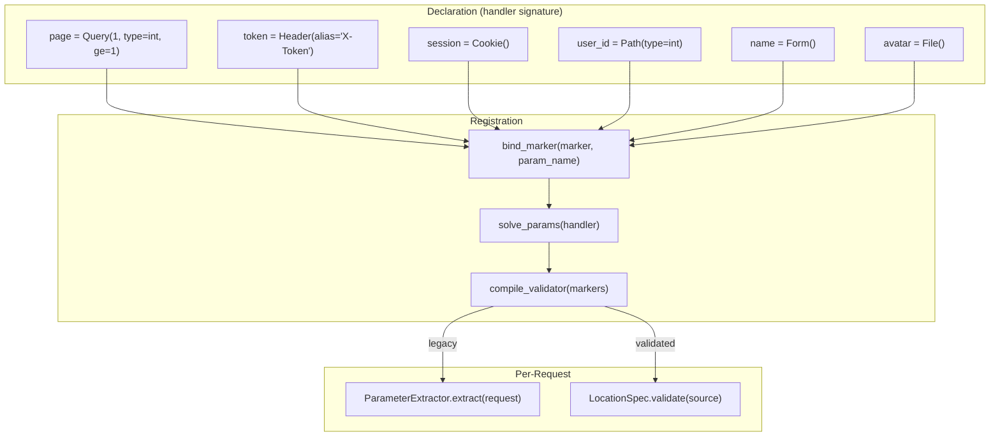
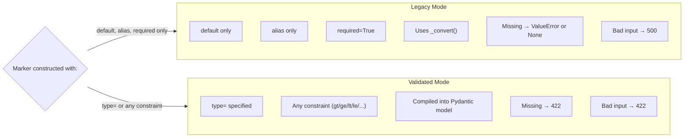
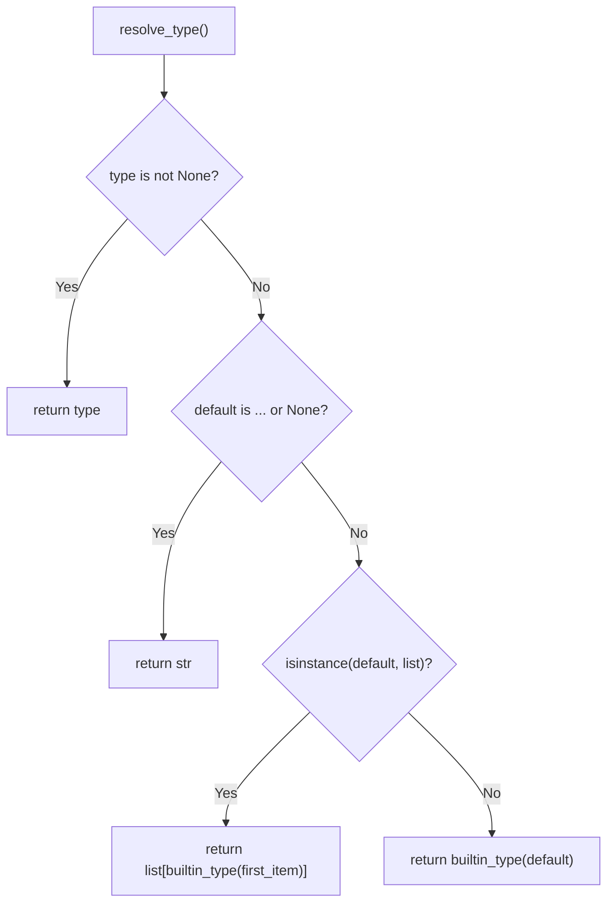
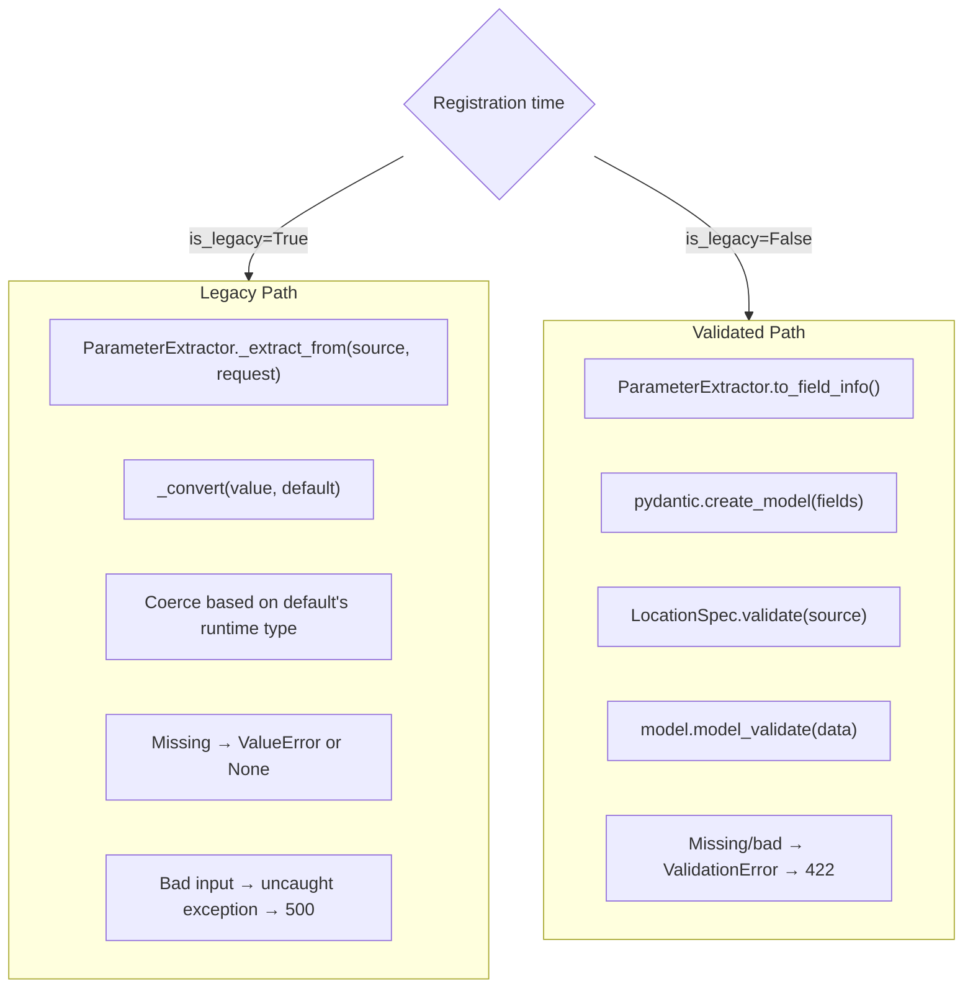
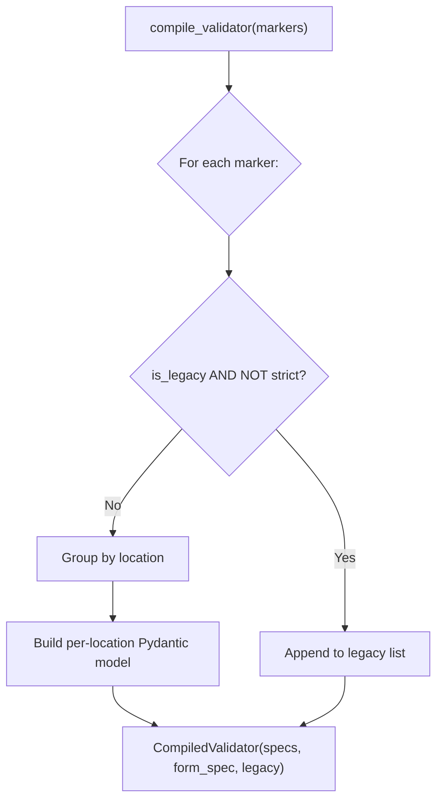
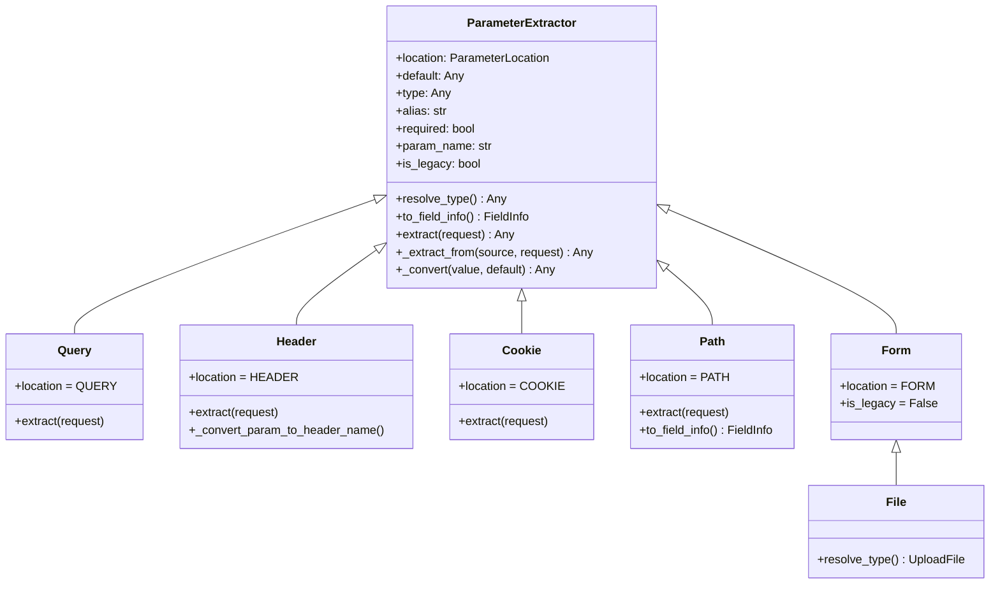
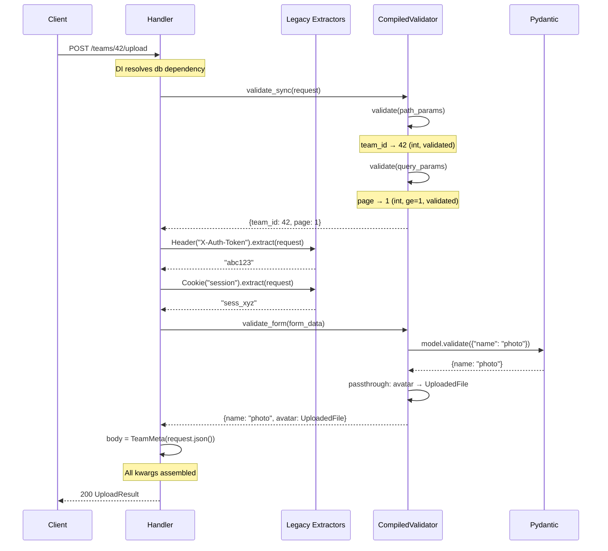

> **Source files:**
> - `core/sillo/validation/fields.py`: `ParameterLocation`, `ParameterExtractor`, `Query`, `Header`, `Cookie`, `Path`, `Form`, `File`, `SolvedParamDependency`, `bind_marker`, `solve_params`, `resolve_param`
> - `core/sillo/parameters.py`, Re-export shim (legacy import path)
> - `core/sillo/validation/compiler.py`, `compile_validator`, `LocationSpec`
> - `core/sillo/core/dependencies/base.py`, `get_dependant` (signature walk)

---

## 12.1  Architecture Overview

Sillo's parameter system extracts, coerces, and validates values from every
part of an HTTP request: query strings, headers, cookies, URL path segments,
form bodies, and uploaded files. Parameters are declared as handler defaults
using marker classes, no type annotations required.



---

## 12.2  `ParameterLocation` Enum

```python
# core/sillo/validation/fields.py:32-57
class ParameterLocation(Enum):
    QUERY = "query"
    HEADER = "header"
    COOKIE = "cookie"
    PATH = "path"
    BODY = "body"
    FORM = "form"
```

| Location | Value    | Source                           | Typical Markers     |
|----------|----------|----------------------------------|---------------------|
| `QUERY`  | `"query"`| URL query string (`?key=value`)  | `Query`             |
| `HEADER` | `"header"`| HTTP request headers            | `Header`            |
| `COOKIE` | `"cookie"`| HTTP cookies                    | `Cookie`            |
| `PATH`   | `"path"` | URL path segments (`/users/{id}`)| `Path`             |
| `BODY`   | `"body"` | JSON request body                | `request_model=` (no marker) |
| `FORM`   | `"form"` | URL-encoded or multipart form    | `Form`, `File`      |

The `BODY` location is special. It is declared via the `request_model=` route
argument rather than a parameter marker. It exists in the enum so validation
errors can report `"body"` as the location.

---

## 12.3  The `ParameterExtractor` Base Class

```python
# core/sillo/validation/fields.py:81-387
class ParameterExtractor:
    location: ParameterLocation = ParameterLocation.QUERY

    def __init__(
        self,
        default: Any = ...,
        *,
        type: Any = None,
        alias: str | None = None,
        required: bool = False,
        title: str | None = None,
        description: str | None = None,
        example: Any = None,
        deprecated: bool | None = None,
        gt: Any = None,
        ge: Any = None,
        lt: Any = None,
        le: Any = None,
        multiple_of: Any = None,
        min_length: int | None = None,
        max_length: int | None = None,
        pattern: str | None = None,
        strict: bool | None = None,
    ):
```

### 12.3.1  Dual-Mode Operation

Each marker operates in one of two modes, chosen at construction time based on
*what arguments were passed*, not on type annotations:



### 12.3.2  The `is_legacy` Property

```python
# fields.py:187-201
@property
def is_legacy(self) -> bool:
    return self.type is None and not self.constraints
```

A marker stays legacy until it receives information only the Pydantic engine
can act on: an explicit `type` or a validation constraint. Documentation-only
keywords (`title`, `description`, `example`, `deprecated`) are deliberately
excluded, enriching an OpenAPI entry never changes runtime behavior.

### 12.3.3  Constraint and Metadata Separation

```python
# fields.py:60-78
_CONSTRAINT_KEYS = (
    "gt", "ge", "lt", "le", "multiple_of",
    "min_length", "max_length", "pattern", "strict",
)

_METADATA_KEYS = ("title", "description", "example", "deprecated")
```

The constructor partitions kwargs into two dicts:

```python
# fields.py:179-185
local = locals()
self.constraints = {key: local[key] for key in _CONSTRAINT_KEYS if local[key] is not None}
self.metadata = {key: local[key] for key in _METADATA_KEYS if local[key] is not None}
```

This separation is what keeps `description` from silently changing a marker's
runtime path.

### 12.3.4  Fields Reference

| Field         | Type               | Description |
|---------------|--------------------|-------------|
| `location`    | `ParameterLocation`| Set by each subclass. Determines which request mapping to read. |
| `default`     | `Any`              | Value when parameter is absent. `...` means no default. |
| `type`        | `Any`              | Declared type, or `None` to infer from `default`. |
| `alias`       | `str \| None`      | Wire name when it differs from the Python parameter name. |
| `required`    | `bool`             | Legacy flag. `True` → `ValueError` when absent. |
| `param_name`  | `str \| None`      | Python parameter name, set during `bind_marker()`. |
| `constraints` | `dict`             | Pydantic constraint kwargs (`gt`, `ge`, etc.). |
| `metadata`    | `dict`             | Documentation kwargs (`title`, `description`, etc.). |

---

## 12.4  Type Resolution: `resolve_type()`

```python
# fields.py:203-225
def resolve_type(self) -> Any:
    if self.type is not None:
        return self.type
    if self.default is ... or self.default is None:
        return str
    if isinstance(self.default, list):
        item_type = builtin_type(self.default[0]) if self.default else str
        return list[item_type]
    return builtin_type(self.default)
```

Resolution never consults type annotations. The priority chain is:

1. **Explicit `type`**: `Query(type=int)` → `int`
2. **Runtime type of `default`**: `Query(1)` → `int`, `Query("x")` → `str`
3. **List inference**: `Query([])` → `list[str]`, `Query([1,2])` → `list[int]`
4. **Fallback**: `Query()` (no default, no type) → `str`



The `builtin_type` alias avoids shadowing by the `type` keyword argument:

```python
# fields.py:391
builtin_type = type
```

---

## 12.5  Legacy Extraction: `_convert()`

```python
# fields.py:342-386
def _convert(self, value: str, default: Any) -> Any:
    if default is ...:
        return value
    if default is None:
        return value

    type_default = builtin_type(default)

    if type_default is bool:
        return value.lower() in ("true", "1", "yes")
    elif type_default is int:
        return int(value)
    elif type_default is float:
        return float(value)
    elif isinstance(default, list):
        if hasattr(default, "__iter__") and not isinstance(default, str):
            item_type = builtin_type(default[0]) if default else str
            if item_type in (int, float):
                return [item_type(v) for v in value.split(",")]
            return value.split(",")
        return [value]
    elif isinstance(default, Enum):
        try:
            return type_default[value]
        except KeyError:
            return value

    return type_default(value)
```

This is sillo's original coercion strategy, preserved byte-for-byte. It keys
off the **default value's runtime type**, not any declared type.

### 12.5.1  Coercion Rules

| Default Value | Coercion                                   | Example              |
|---------------|--------------------------------------------|----------------------|
| `...`         | Return raw string                          | `Query()` → `"42"`  |
| `None`        | Return raw string                          | `Query(None)` → `"42"` |
| `int`         | `int(value)`                               | `Query(0)` → `42`    |
| `float`       | `float(value)`                             | `Query(0.0)` → `3.14` |
| `bool`        | `value.lower() in ("true","1","yes")`      | `Query(False)` → `True` |
| `list`        | `value.split(",")` with item-type coercion | `Query([])` → `["a","b"]` |
| `Enum`        | Lookup by member name                      | `Query(Color.RED)` → `Color.RED` |
| Other         | `type(default)(value)`                     | `Query(datetime.min)` |

### 12.5.2  The `_extract_from` Method

```python
# fields.py:274-313
def _extract_from(self, source: Any, request: Request | None) -> Any:
    if request is None:
        return self.default

    param_name = self._get_param_name()
    if not param_name:
        return self.default

    value = source.get(param_name)

    if value is None:
        if self.required:
            raise ValueError(
                f"{self.location.value.capitalize()} parameter "
                f"'{param_name}' is required"
            )
        if self.default is ...:
            return None
        return self.default

    return self._convert(value, self.default)
```

This shared implementation handles Query, Header, and Cookie extraction in
legacy mode. The `source` is the relevant request mapping
(`request.query_params`, `request.headers`, or `request.cookies`).

---

## 12.6  Pydantic Field Generation: `to_field_info()`

```python
# fields.py:227-252
def to_field_info(self) -> FieldInfo:
    kwargs: dict = dict(self.constraints)
    if "example" in self.metadata:
        kwargs["examples"] = [self.metadata["example"]]
    for key in ("title", "description", "deprecated"):
        if key in self.metadata:
            kwargs[key] = self.metadata[key]

    alias = self._get_param_name()
    if alias:
        kwargs["alias"] = alias

    default = ... if (self.default is ... or self.required) else self.default
    return Field(default, **kwargs)
```

This method builds the Pydantic `FieldInfo` that is handed to
`pydantic.create_model()`. Using one `FieldInfo` for both validation and
schema generation keeps the OpenAPI document and runtime behavior from
drifting apart.

### 12.6.1  Path Override

`Path.to_field_info()` overrides the base to force `PydanticUndefined` as the
default, because a path parameter is always required:

```python
# fields.py:513-530
def to_field_info(self) -> FieldInfo:
    info = super().to_field_info()
    info.default = PydanticUndefined  # Required, not Ellipsis
    return info
```

---

## 12.7  Concrete Marker Classes

### 12.7.1  `Query`

```python
# fields.py:394-423
class Query(ParameterExtractor):
    location = ParameterLocation.QUERY

    def extract(self, request: Request | None) -> Any:
        return self._extract_from(
            request.query_params if request is not None else None, request
        )
```

Reads from the URL query string. Wire name defaults to the Python parameter
name.

```python
# Usage
async def handler(request, response, page=Query(1, type=int, ge=1)):
    ...
```

### 12.7.2  `Header`

```python
# fields.py:426-453
class Header(ParameterExtractor):
    location = ParameterLocation.HEADER

    def extract(self, request: Request | None) -> Any:
        return self._extract_from(
            request.headers if request is not None else None, request
        )
```

Parameter names are converted to header casing automatically: `x_api_key`
becomes `X-Api-Key`.

```python
# Header case conversion
def _convert_param_to_header_name(self, param_name: str) -> str:
    parts = param_name.split("_")
    return "-".join(part.title() for part in parts)
```

### 12.7.3  `Cookie`

```python
# fields.py:456-479
class Cookie(ParameterExtractor):
    location = ParameterLocation.COOKIE

    def extract(self, request: Request | None) -> Any:
        return self._extract_from(
            request.cookies if request is not None else None, request
        )
```

### 12.7.4  `Path`

```python
# fields.py:482-530
class Path(ParameterExtractor):
    location = ParameterLocation.PATH

    def extract(self, request: Request | None) -> Any:
        return self._extract_from(
            request.path_params if request is not None else None, request
        )

    def to_field_info(self) -> FieldInfo:
        info = super().to_field_info()
        info.default = PydanticUndefined
        return info
```

Path values have already been through the route's regex convertors by the time
this marker sees them (`/users/{id:int}` yields an `int`). The `Path` marker
layers declared-type validation and constraints on top.

### 12.7.5  `Form`

```python
# fields.py:533-553
class Form(ParameterExtractor):
    location = ParameterLocation.FORM

    @property
    def is_legacy(self) -> bool:
        return False  # Always validated — no legacy path
```

`Form` is always on the validated path. Its `is_legacy` property is hardcoded
to `False`. Form field binding did not exist before the Pydantic engine.

### 12.7.6  `File`

```python
# fields.py:556-577
class File(Form):
    def resolve_type(self) -> Any:
        if self.type is not None:
            return self.type
        return UploadFile
```

`File` extends `Form`. Its `resolve_type()` returns `UploadedFile` by default
rather than `str`. File parameters bypass Pydantic validation entirely (the
`LocationSpec.passthrough` mechanism) because a spooled file handle is not
meaningfully validatable by Pydantic.

---

## 12.8  Marker Binding: `bind_marker()`

```python
# fields.py:597-617
def bind_marker(extractor: ParameterExtractor, param_name: str) -> None:
    extractor.param_name = param_name
    if not extractor.alias:
        if isinstance(extractor, Header):
            extractor.alias = extractor._convert_param_to_header_name(param_name)
        else:
            extractor.alias = param_name
```

This is the single implementation of a step that was previously duplicated
between `solve_params` and the dependency analyzer. It:

1. Records the Python parameter name on the marker
2. Derives the wire alias if none was configured:
   - `Header` → header-cased (`x_api_key` → `X-Api-Key`)
   - Others → parameter name verbatim

### 12.8.1  Copy-on-Bind in `compile_validator()`

```python
# compiler.py:400-405
for param_name, marker in markers:
    marker = copy(marker)
    bind_marker(marker, param_name)
```

`compile_validator` binds a **copy** of each marker rather than the marker
itself. A marker held in a module constant and reused across handlers would
otherwise keep whichever parameter name bound it first.

---

## 12.9  `solve_params()`

```python
# fields.py:620-642
def solve_params(handler: Any) -> list[SolvedParamDependency]:
    sig = signature(handler)
    solved = []
    for param_name, param in sig.parameters.items():
        if param.default is not Parameter.empty:
            if isinstance(param.default, ParameterExtractor):
                bind_marker(param.default, param_name)
                solved.append(SolvedParamDependency(param.default, param_name))
    return solved
```

Scans a callable's signature for `ParameterExtractor` defaults, binds each
one, and returns a list of `SolvedParamDependency` objects in signature order.

---

## 12.10  `SolvedParamDependency`

```python
# fields.py:580-594
@dataclass(frozen=True, slots=True)
class SolvedParamDependency:
    extractor: ParameterExtractor
    param_name: str
```

A frozen, slotted dataclass pairing a marker with its bound parameter name.
Produced during signature analysis and consumed at request time by the legacy
extraction path.

---

## 12.11  `resolve_param()`

```python
# fields.py:645-661
async def resolve_param(
    param_dep: SolvedParamDependency,
    request: Request | None = None,
) -> Any:
    return param_dep.extractor.extract(request)
```

Async wrapper presenting a uniform interface alongside other dependency
resolution paths. The extraction itself is synchronous.

---

## 12.12  Validated Mode: `to_field_info()` vs `_convert()`

The dual-mode design is the central architectural decision in the parameter
system:



### 12.12.1  Legacy `_convert()`

- Keys off the **runtime type of the default value**
- No type annotations consulted
- Missing required → `ValueError` → 500
- Bad coercion → uncaught exception → 500

### 12.12.  Validated `to_field_info()`

- Keys off the **explicit `type` parameter** or inferred type
- Produces a Pydantic `FieldInfo` with constraints, alias, and metadata
- Missing required → `ValidationError` → 422
- Bad coercion → `ValidationError` → 422

---

## 12.13  Integration with `compile_validator()`

At registration time, `get_dependant()` passes all discovered markers to
`compile_validator()`, which partitions them:

```python
# compiler.py:371-437
def compile_validator(
    markers: list[tuple[str, ParameterExtractor]],
    *,
    name: str = "Route",
    strict: bool = False,
) -> CompiledValidator:
    legacy: list[SolvedParamDependency] = []
    grouped: dict[ParameterLocation, list[tuple[str, ParameterExtractor]]] = {}

    for param_name, marker in markers:
        marker = copy(marker)
        bind_marker(marker, param_name)

        if marker.is_legacy and not strict:
            legacy.append(SolvedParamDependency(marker, param_name))
            continue

        grouped.setdefault(marker.location, []).append((param_name, marker))

    specs = tuple(
        _build_spec(location, grouped[location], f"{name}_{location.value.capitalize()}")
        for location in _SYNC_LOCATIONS if location in grouped
    )

    form_spec = (
        _build_spec(ParameterLocation.FORM, grouped[ParameterLocation.FORM], f"{name}_Form")
        if ParameterLocation.FORM in grouped else None
    )

    return CompiledValidator(specs=specs, form_spec=form_spec, legacy=tuple(legacy))
```

### 12.13.1  Partitioning Logic



### 12.13.2  Strict Mode

When `strict=True`, **all** markers are compiled onto the Pydantic path,
including those that would normally be legacy. This is the application-level
opt-in:

```python
# application.py
app = SilloApp(strict_validation=True)
```

With strict mode, even `Query()` (no type, no constraints) gets compiled into
a Pydantic model. Missing values produce 422 instead of 500.

### 12.13.3  Location Model Building: `_build_spec()`

```python
# compiler.py:296-368
def _build_spec(
    location: ParameterLocation,
    markers: list[tuple[str, ParameterExtractor]],
    model_name: str,
) -> LocationSpec:
    definitions: dict[str, Any] = {}
    list_aliases = set()
    passthrough: dict[str, str] = {}
    by_name: dict[str, ParameterExtractor] = {}

    for param_name, marker in markers:
        by_name[param_name] = marker
        alias = marker._get_param_name() or param_name

        if isinstance(marker, File):
            passthrough[param_name] = alias
            continue

        resolved = marker.resolve_type()
        if _is_sequence_type(resolved):
            list_aliases.add(alias)
        definitions[param_name] = (resolved, marker.to_field_info())

    model = create_model(model_name, __config__=_MODEL_CONFIG, **definitions)
    ...
```

For each location, a synthetic Pydantic model is built using
`pydantic.create_model()`. Field names are the **handler parameter names**,
and field definitions come from `resolve_type()` + `to_field_info()`.

`File` markers bypass the model entirely. They are stored in `passthrough` and
delivered directly without Pydantic coercion.

---

## 12.14  The Import Shim: `parameters.py`

```python
# core/sillo/parameters.py
from sillo.validation.fields import (
    Cookie, Header, ParameterExtractor, ParameterLocation,
    Query, SolvedParamDependency, bind_marker, resolve_param, solve_params,
)
```

This module exists solely so that `from sillo.parameters import Query` keeps
working. The actual implementation lives in `sillo.validation.fields`.

---

## 12.15  Sequence Type Detection

```python
# compiler.py:55-70
def _is_sequence_type(tp: Any) -> bool:
    origin = typing.get_origin(tp) or tp
    return origin in (list, tuple, set, frozenset)
```

Parameters declared as `list[str]`, `tuple[int, ...]`, etc. must be gathered
with `getlist` (repeated key occurrences) rather than `get` (first occurrence
only). This function detects sequence types so the `LocationSpec` can precompute
the gathering strategy.

```python
# Usage
tags = Query([], type=list[str])  # ?tag=a&tag=b → ["a", "b"]
```

---

## 12.16  Performance Characteristics

| Operation              | When          | Cost                |
|------------------------|---------------|---------------------|
| `bind_marker()`        | Registration  | O(1) per marker     |
| `resolve_type()`       | Registration  | O(1)                |
| `to_field_info()`      | Registration  | O(constraints)      |
| `create_model()`       | Registration  | O(fields)           |
| `_convert()` (legacy)  | Per request   | O(1) per parameter  |
| `model_validate()`     | Per request   | O(fields) per location |

**Key optimizations:**

- Legacy extraction is a single dictionary lookup + type coercion
- Validated extraction is one `model_validate()` call per location (not per parameter)
- `_SOURCE_GETTERS` uses C-level `attrgetter` objects to avoid branching
- `is_legacy` check happens once at registration, never per request

---

## 12.17  Wire Name Derivation

The wire name is the key used to look up a parameter on the request mapping.
It is derived during `bind_marker()` and depends on the marker type.

### 12.17.1  Default Wire Names

| Marker    | Wire Name Derivation                      | Example                        |
|-----------|-------------------------------------------|--------------------------------|
| `Query`   | Python parameter name verbatim            | `page` → `page`               |
| `Header`  | Header-cased parameter name               | `x_api_key` → `X-Api-Key`     |
| `Cookie`  | Python parameter name verbatim            | `session_id` → `session_id`   |
| `Path`    | Python parameter name verbatim            | `user_id` → `user_id`         |
| `Form`    | Python parameter name verbatim            | `name` → `name`               |
| `File`    | Python parameter name verbatim            | `avatar` → `avatar`           |

### 12.17.2  Explicit Alias Override

```python
# Explicit alias takes precedence over all derivation
token = Header(alias="Authorization")
# Wire name: "Authorization" (not header-cased "Token")

page = Query(1, alias="p")
# Wire name: "p" (not "page")
```

### 12.17.3  Header Casing Algorithm

```python
# fields.py:327-340
def _convert_param_to_header_name(self, param_name: str) -> str:
    parts = param_name.split("_")
    return "-".join(part.title() for part in parts)
```

| Python Name          | Header Name          |
|----------------------|----------------------|
| `x_api_key`          | `X-Api-Key`          |
| `content_type`       | `Content-Type`       |
| `authorization`      | `Authorization`      |
| `x_requested_with`   | `X-Requested-With`   |

---

## 12.18  The `UploadFile` Type

```python
# fields.py:667
from sillo.objects.http import UploadedFile as UploadFile
```

`UploadFile` is imported at the bottom of `fields.py` to avoid circular
imports (it depends on `sillo.objects.http` which depends on the datastructures
module). `File` markers resolve to this type by default:

```python
# fields.py:568-577
class File(Form):
    def resolve_type(self) -> Any:
        if self.type is not None:
            return self.type
        return UploadFile
```

`UploadFile` wraps a spooled file handle and is delivered through the
`passthrough` mechanism, bypassing Pydantic validation entirely.

---

## 12.19  Marker Inheritance Hierarchy



### 12.19.1  Override Summary

| Method               | `Query` | `Header` | `Cookie` | `Path` | `Form` | `File` |
|----------------------|---------|----------|----------|--------|--------|--------|
| `extract()`          | Override| Override | Override | Override|  |  |
| `is_legacy`          | Inherit | Inherit  | Inherit  | Inherit| `False`| Inherit|
| `resolve_type()`     | Inherit | Inherit  | Inherit  | Inherit| Inherit| Override|
| `to_field_info()`    | Inherit | Inherit  | Inherit  | Override| Inherit| Inherit|

`Form` and `File` never define `extract()` because they are always on the
validated path. Their source (form body) requires async parsing.

---

## 12.20  Example: Complete Parameter Declaration

```python
from sillo import Query, Header, Cookie, Path, Form, File

@app.post("/teams/{team_id}/upload",
          request_model=TeamMeta,
          response_model=UploadResult)
async def upload_team_avatar(
    request, response,                    # Framework-injected
    team_id=Path(type=int),               # Validated: /teams/42
    page=Query(1, type=int, ge=1),        # Validated: ?page=1
    token=Header(alias="X-Auth-Token"),   # Legacy: header lookup
    session=Cookie(),                      # Legacy: cookie lookup
    name=Form(type=str, min_length=1),    # Validated: form field
    avatar=File(),                         # Passthrough: UploadedFile
    db=Depend(get_db),                     # DI dependency
    body=None,                             # JSON body (request_model)
):
    ...
```

### 12.20.1  Compilation Result

| Marker     | Mode      | Location | Wire Name        | Notes |
|------------|-----------|----------|------------------|-------|
| `Path`     | Validated | path     | `team_id`        | Always required |
| `Query`    | Validated | query    | `page`           | ge=1 constraint |
| `Header`   | Legacy    | header   | `X-Auth-Token`   | Explicit alias |
| `Cookie`   | Legacy    | cookie   | `session`        | Default = ... |
| `Form`     | Validated | form     | `name`           | min_length=1 |
| `File`     | Passthrough| form    | `avatar`         | Bypasses Pydantic |

### 12.20.2  Runtime Flow



---

## 12.21  Edge Cases

### 12.21.1  Marker Reuse Across Handlers

```python
# Module-level constant
page_marker = Query(1, type=int, ge=1)

@app.get("/items")
async def list_items(request, response, page=page_marker):
    ...

@app.get("/users")
async def list_users(request, response, page=page_marker):
    ...
```

This works because `compile_validator()` copies each marker before binding:

```python
# compiler.py:401
marker = copy(marker)
bind_marker(marker, param_name)
```

Without the copy, the second handler would see `page_marker.param_name` set to
`"page"` from the first handler's binding.

### 12.21.2  No Default, No Type

```python
q = Query()  # No default, no type
```

- `resolve_type()` → `str` (fallback)
- `is_legacy` → `True` (no type, no constraints)
- Legacy `_convert()`: default is `...` → return raw string
- Validated path: field type is `str`, optional (default is `...`)

### 12.21.3  Empty List Default

```python
tags = Query([])
```

- `resolve_type()` → `list[str]` (empty list → item type defaults to `str`)
- `is_legacy` → `True` (no type, no constraints)
- Legacy `_convert()`: splits on commas → `["a", "b"]`
- Wire name gathered with `getlist` if on validated path

### 12.21.4  Path Parameter Always Required

```python
id = Path()  # No type, no default
```

Even though the base `ParameterExtractor` would make this optional (default is
`...`), `Path.to_field_info()` overrides the default to `PydanticUndefined`,
forcing it to be required. This is correct because a request that lacked the
path parameter could not have matched the route.
