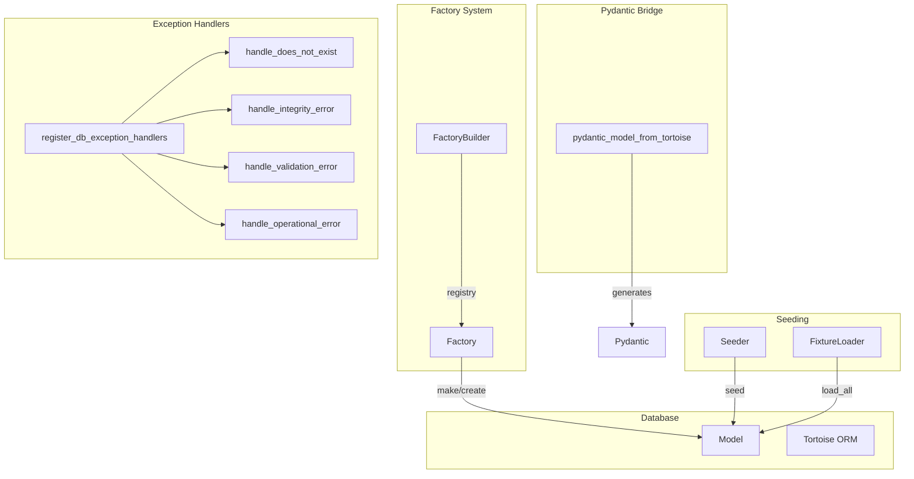
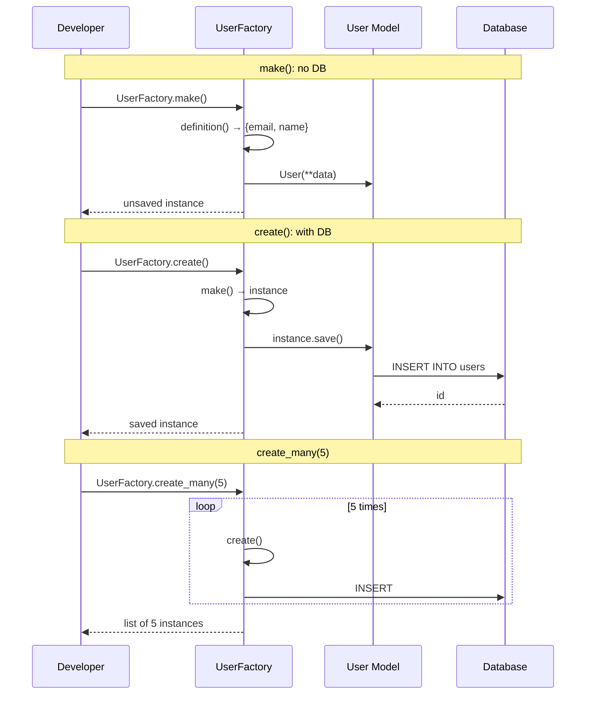
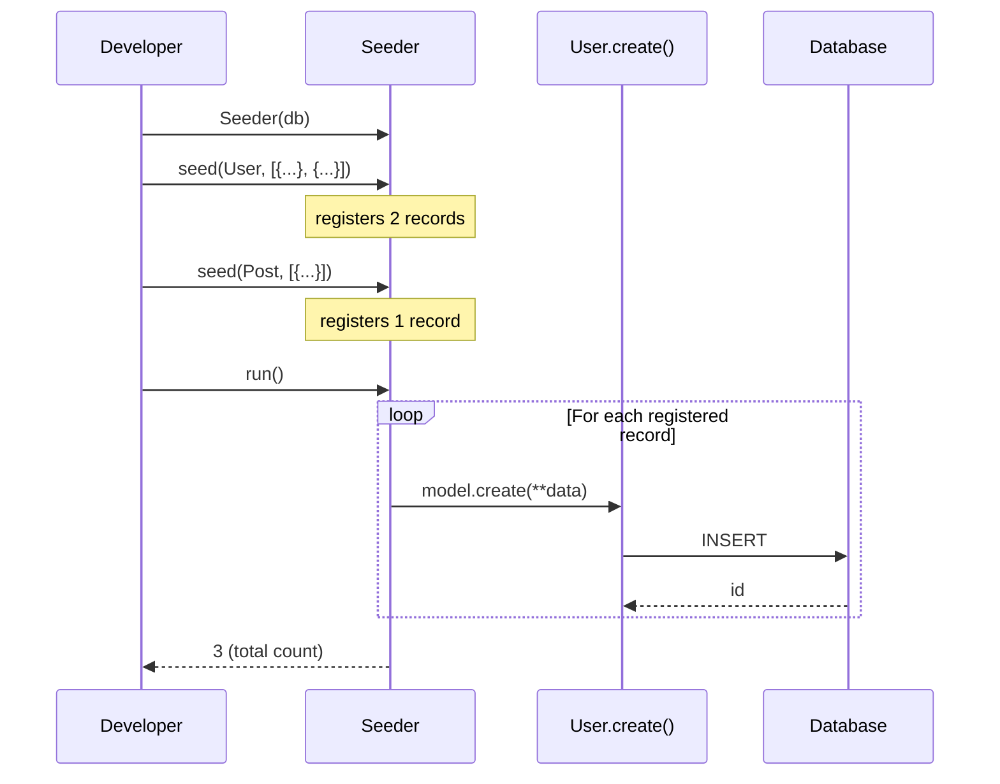
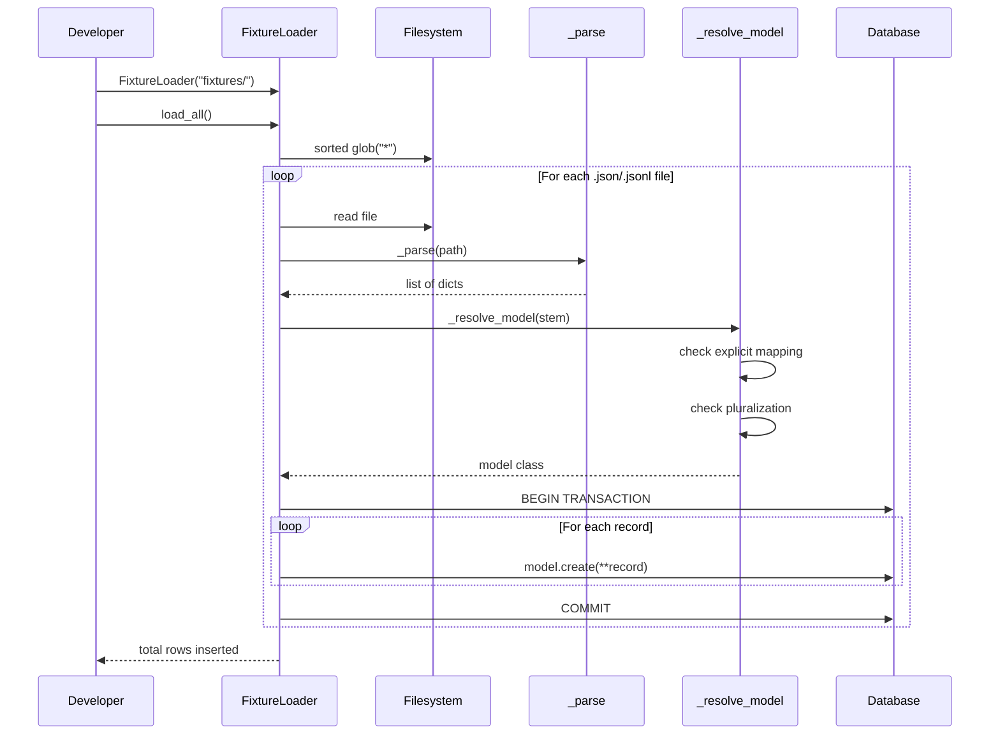
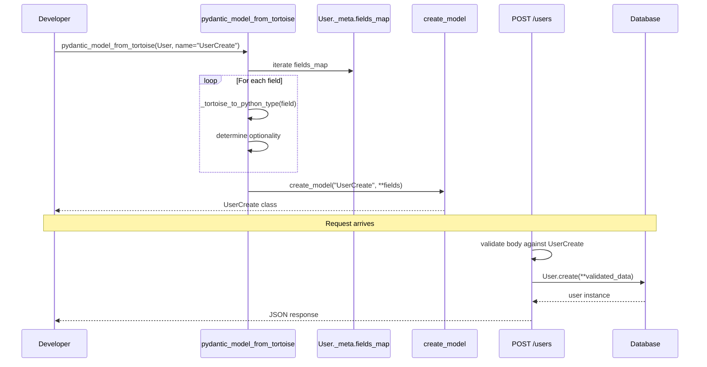
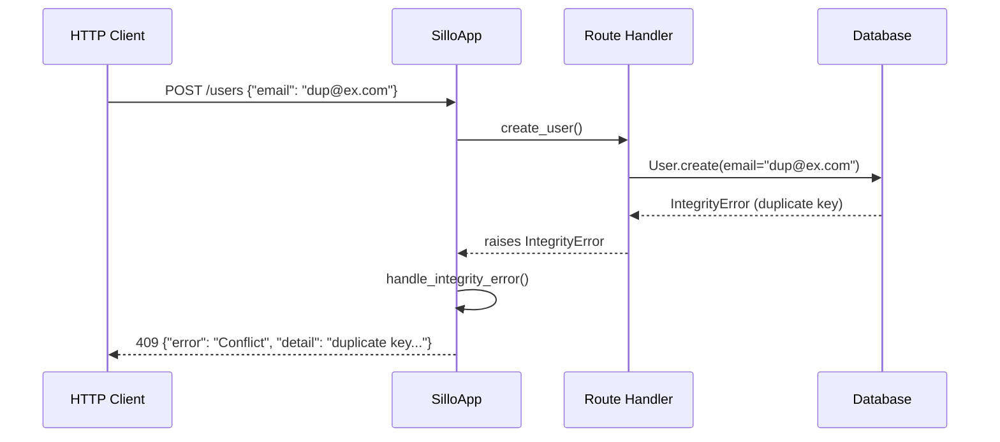

> Internal engineering reference for the Sillo ORM factory system, seeder,
> fixture loader, Pydantic model generation, and database exception handlers.
>
> Source: `core/sillo/record/factories.py`, `core/sillo/record/helpers.py`,
> `core/sillo/record/pydantic.py`, `core/sillo/record/exceptions.py`

---

## 1. Overview

The factory and seeding layer provides tools for populating the database with
test data, loading fixtures, and bridging between Tortoise models and Pydantic
schemas. It also includes exception handlers that convert database errors into
proper HTTP responses.



---

## 2. Factory

**File:** `core/sillo/record/factories.py`

### 2.1 Base Class

```python
class Factory:
    model: type | None = None
    definition: Callable[[], dict[str, Any]] = dict

    @classmethod
    def make(cls, overrides=None) -> Any:
        data = {**cls.definition(), **(overrides or {})}
        return cls.model(**data)

    @classmethod
    async def create(cls, overrides=None) -> Any:
        instance = cls.make(overrides)
        await instance.save()
        return instance

    @classmethod
    async def create_many(cls, count, overrides=None) -> list[Any]:
        instances = []
        for _ in range(count):
            instance = await cls.create(overrides)
            instances.append(instance)
        return instances

    @classmethod
    def state(cls, **kwargs) -> Callable:
        def modifier():
            return {**cls.definition(), **kwargs}
        return modifier
```

### 2.2 Defining a Factory

```python
from uuid import uuid4
from sillo.record import Factory

class UserFactory(Factory):
    model = User
    definition = lambda: {
        "email": f"user{uuid4().hex[:8]}@test.com",
        "name": "Test User",
        "is_active": True,
    }
```

**Requirements:**

- `model`: the Tortoise model class.
- `definition`: a callable returning a dict of default attributes. Each call
  should produce unique values (e.g. UUIDs) to avoid constraint violations.

### 2.3 `make`: Unsaved Instance

```python
@classmethod
def make(cls, overrides=None) -> Any:
    data = {**cls.definition(), **(overrides or {})}
    return cls.model(**data)
```

- Creates a model instance without saving to the database.
- `overrides` are merged on top of the definition.
- Useful for testing validation logic without hitting the DB.

```python
user = UserFactory.make()
assert user.email.endswith("@test.com")
assert not user._saved_in_db
```

### 2.4 `create`: Saved Instance

```python
@classmethod
async def create(cls, overrides=None) -> Any:
    instance = cls.make(overrides)
    await instance.save()
    return instance
```

- Creates and persists a model instance.
- Returns the saved instance with `id` populated.

```python
user = await UserFactory.create()
assert user.id is not None
assert user._saved_in_db
```

### 2.5 `create_many`: Batch Creation

```python
@classmethod
async def create_many(cls, count, overrides=None) -> list[Any]:
    instances = []
    for _ in range(count):
        instance = await cls.create(overrides)
        instances.append(instance)
    return instances
```

- Creates `count` instances, each with its own definition call (unique values).
- **Note:** This is N individual INSERTs, not a bulk insert. For large batches,
  consider using `Model.bulk_create()` directly.

```python
users = await UserFactory.create_many(10)
assert len(users) == 10
assert len(set(u.email for u in users)) == 10  # all unique
```

### 2.6 `state`: Modifier Function

```python
@classmethod
def state(cls, **kwargs) -> Callable:
    def modifier():
        return {**cls.definition(), **kwargs}
    return modifier
```

Returns a new definition function that merges overrides on top of the base
definition. Used to create named variants:

```python
admin_state = UserFactory.state(is_admin=True, role="admin")

class AdminFactory(Factory):
    model = User
    definition = admin_state

admin = await AdminFactory.create()
assert admin.is_admin is True
```

### 2.7 Factory Usage Diagram



---

## 3. FactoryBuilder

**File:** `core/sillo/record/factories.py`

### 3.1 Registry Pattern

```python
class FactoryBuilder:
    def __init__(self):
        self._factories: dict[str, type[Factory]] = {}

    def register(self, name: str, factory: type[Factory]) -> None:
        self._factories[name] = factory

    def get(self, name: str) -> type[Factory]:
        if name not in self._factories:
            raise KeyError(f"Factory '{name}' not registered")
        return self._factories[name]
```

### 3.2 Usage

```python
builder = FactoryBuilder()
builder.register("user", UserFactory)
builder.register("post", PostFactory)

# Later, by name:
user = await builder.get("user").create()
post = await builder.get("post").create(overrides={"author_id": user.id})
```

### 3.3 Design Rationale

The `FactoryBuilder` exists for scenarios where factories are registered
dynamically (e.g., plugins, test fixtures loaded by name). For most projects,
calling `UserFactory.create()` directly is simpler.

---

## 4. Seeder

**File:** `core/sillo/record/helpers.py` (class `Seeder`)

### 4.1 Class Definition

```python
class Seeder:
    def __init__(self, db_manager):
        self._db = db_manager
        self._records: list[tuple[type, dict[str, Any]]] = []

    def seed(self, model, records) -> Seeder:
        for record in records:
            self._records.append((model, record))
        return self

    async def run(self, *, batch_size: int = 100) -> int:
        count = 0
        for model, data in self._records:
            await model.create(**data)
            count += 1
        return count
```

### 4.2 Usage

```python
from sillo.record import Seeder

seeder = Seeder(db_manager)
seeder.seed(User, [
    {"email": "alice@ex.com", "name": "Alice"},
    {"email": "bob@ex.com", "name": "Bob"},
])
seeder.seed(Post, [
    {"title": "Hello World", "author_id": 1},
])
count = await seeder.run()
print(f"Seeded {count} records")
```

### 4.3 Design Decisions

- **Deferred execution:** `seed()` only registers records; `run()` executes
  them. This allows chaining multiple `seed()` calls before running.
- **Sequential insertion:** Each record is created individually with
  `model.create()`. This is deliberate: it triggers model lifecycle events
  (e.g. `before_create`, `after_create`) and validation.
- **Return type:** `run()` returns the total count of records created.
- **`batch_size` parameter:** Present in the signature but not currently used
  for batching: each record is created individually. Reserved for future
  optimization.

### 4.4 Seeder Flow



---

## 5. FixtureLoader

**File:** `core/sillo/record/helpers.py` (class `FixtureLoader`)

### 5.1 Directory Convention

```
fixtures/
  01_users.json      →  [{"email": "...", ...}, ...]
  02_posts.json      →  [{"title": "...", ...}, ...]
  tags.jsonl          →  {"name": "python"}\n{"name": "rust"}\n...
```

- Files are loaded in **sorted order**, so numeric prefixes control ordering
  when fixtures reference each other.
- Supported extensions: `.json`, `.jsonl`.
- All other files are ignored.

### 5.2 Class Definition

```python
class FixtureLoader:
    SUFFIXES = (".json", ".jsonl")

    def __init__(self, directory: str, *, models: dict[str, Any] | None = None):
        self._dir = Path(directory)
        self._models: dict[str, Any] = dict(models or {})
```

### 5.3 `load_all`

```python
async def load_all(self) -> int:
    count = 0
    for file_path in sorted(self._dir.glob("*")):
        if file_path.suffix not in self.SUFFIXES or not file_path.is_file():
            continue
        count += await self._load_file(file_path)
    return count
```

- Iterates all files in sorted order.
- Skips non-matching suffixes and directories.
- Returns total rows inserted.

### 5.4 `load`: Single Fixture

```python
async def load(self, name: str) -> int:
    for ext in self.SUFFIXES:
        path = self._dir / f"{name}{ext}"
        if path.exists():
            return await self._load_file(path)
    raise FileNotFoundError(f"Fixture '{name}' not found in {self._dir}")
```

- Loads a specific fixture by name (without extension).
- Tries each suffix in order (`.json` first, then `.jsonl`).
- Raises `FileNotFoundError` if no matching file exists.

### 5.5 `_parse`: File Parsing

```python
def _parse(self, path: Path) -> list[dict[str, Any]]:
    content = path.read_text()
    if path.suffix == ".jsonl":
        records = [json.loads(line) for line in content.splitlines() if line.strip()]
    else:
        records = json.loads(content)
    if not isinstance(records, list):
        records = [records]
    return records
```

**JSON format:**
- Array of objects: `[{"email": "..."}, {"email": "..."}]`
- Single object: `{"email": "..."}` (treated as a one-row fixture)

**JSONL format:**
- One JSON object per line.
- Blank lines are skipped.
- Always produces a list.

### 5.6 `_resolve_model`: Model Resolution

```python
def _resolve_model(self, name: str) -> Any:
    if name in self._models:
        return self._models[name]

    from tortoise import Tortoise

    registry = {
        model_name.lower(): model
        for app_models in Tortoise.apps.values()
        for model_name, model in app_models.items()
    }

    stem = name.lower()
    candidates = [stem]
    if stem.endswith("ies"):
        candidates.append(stem[:-3] + "y")
    if stem.endswith("es"):
        candidates.append(stem[:-2])
    if stem.endswith("s"):
        candidates.append(stem[:-1])

    for candidate in candidates:
        if candidate in registry:
            return registry[candidate]

    known = ", ".join(sorted(registry)) or "none — has Tortoise been initialised?"
    raise LookupError(
        f"Fixture '{name}' matches no registered model. Known models: {known}. "
        f"Pass FixtureLoader(..., models={{'{name}': YourModel}}) to map it explicitly."
    )
```

**Resolution order:**

1. **Explicit mapping**: if `models` dict was provided and contains the name.
2. **Exact match**: `users` → `user` (lowercase).
3. **Pluralization heuristics:**

| Fixture name | Candidates generated       | Matches model |
|--------------|---------------------------|---------------|
| `users`      | `users`, `user`           | `User`        |
| `categories` | `categories`, `categorie`, `categor`, `category` | `Category` |
| `statuses`   | `statuses`, `statuse`, `statu`, `status` | `Status` |
| `aliases`    | `aliases`, `aliase`, `alias` | `Alias`      |
| `taxes`      | `taxes`, `taxe`, `tax`    | `Tax`         |

4. **Failure**: raises `LookupError` with the list of known models.

### 5.7 `_load_file`: Transactional Loading

```python
async def _load_file(self, path: Path) -> int:
    records = self._parse(path)
    if not records:
        return 0
    model = self._resolve_model(path.stem)
    from tortoise.transactions import in_transaction
    async with in_transaction():
        for record in records:
            await model.create(**record)
    return len(records)
```

**Key detail:** The entire file is loaded inside a transaction. If any row
fails validation or violates a constraint, the entire file is rolled back, no
half-populated tables.

### 5.8 FixtureLoader Flow Diagram



---

## 6. Pydantic Model Generation

**File:** `core/sillo/record/pydantic.py`

### 6.1 `pydantic_model_from_tortoise`

```python
def pydantic_model_from_tortoise(
    model_class: type,
    *,
    name: str = "",
    exclude: list[str] | None = None,
    include: list[str] | None = None,
    optional_fields: list[str] | None = None,
) -> type[BaseModel]:
```

### 6.2 Type Mapping

```python
def _tortoise_to_python_type(field_obj) -> type:
    mapping = {
        f.IntField: int,
        f.SmallIntField: int,
        f.BigIntField: int,
        f.FloatField: float,
        f.DecimalField: float,
        f.BooleanField: bool,
        f.CharField: str,
        f.TextField: str,
        f.DatetimeField: str,
        f.DateField: str,
        f.TimeDeltaField: float,
        f.JSONField: dict,
    }
    for tf, pt in mapping.items():
        if isinstance(field_obj, tf):
            return pt
    return str
```

**Note:** `DatetimeField` maps to `str` (ISO 8601), not `datetime`. This is
intentional. Pydantic models are used for request validation where datetimes
arrive as strings from JSON payloads.

### 6.3 Field Processing

```python
for field_name, field_obj in meta.fields_map.items():
    if exclude and field_name in exclude:
        continue
    if include and field_name not in include:
        continue

    py_type = _tortoise_to_python_type(field_obj)
    default = None if field_obj.null else ...
    is_required = not field_obj.null and not field_obj.pk

    if field_name in optional_fields or field_obj.null:
        py_type = Optional[py_type]
        default = None

    if is_required and not field_obj.null:
        fields[field_name] = (py_type, Field(...))
    else:
        fields[field_name] = (py_type, Field(default=default))
```

**Decision matrix:**

| Condition                | Type           | Default   |
|--------------------------|----------------|-----------|
| Required, non-null       | `T`            | `...`     |
| Nullable                 | `Optional[T]`  | `None`    |
| In `optional_fields`     | `Optional[T]`  | `None`    |
| Primary key              | `T`            | `None`    |

### 6.4 Model Creation

```python
return create_model(
    name or f"{model_class.__name__}Schema",
    __base__=BaseModel,
    **fields
)
```

Uses Pydantic's `create_model` to dynamically generate the model class.

### 6.5 Usage Patterns

**Create schema (exclude auto-generated fields):**

```python
UserCreate = pydantic_model_from_tortoise(
    User,
    name="UserCreate",
    exclude=["id", "created_at", "updated_at", "deleted_at"],
)
```

**Update schema (all fields optional):**

```python
UserUpdate = pydantic_model_from_tortoise(
    User,
    name="UserUpdate",
    exclude=["id", "created_at", "updated_at", "deleted_at"],
    optional_fields=["email", "name", "bio"],
)
```

**Response schema (include specific fields):**

```python
UserResponse = pydantic_model_from_tortoise(
    User,
    name="UserResponse",
    include=["id", "email", "name", "created_at"],
)
```

### 6.6 Integration with Routes

```python
from sillo.record.pydantic import pydantic_model_from_tortoise

UserCreate = pydantic_model_from_tortoise(User, name="UserCreate",
    exclude=["id", "created_at", "updated_at"])

@app.post("/users", request_model=UserCreate)
async def create_user(request, response):
    data = request.validated_data.model_dump()
    user = await User.create(**data)
    return response.json(user.to_dict(), status_code=201)
```

### 6.7 Pydantic Bridge Flow



---

## 7. Database Exception Handlers

**File:** `core/sillo/record/exceptions.py`

### 7.1 Overview

Four exception handlers convert Tortoise/database errors into proper HTTP
responses:

| Exception            | Handler                    | HTTP Status | Error          |
|----------------------|---------------------------|-------------|----------------|
| `DoesNotExist`       | `handle_does_not_exist`    | 404         | Not Found      |
| `IntegrityError`     | `handle_integrity_error`   | 409         | Conflict       |
| `ValidationError`    | `handle_validation_error`  | 422         | Validation Error |
| `OperationalError`   | `handle_operational_error` | 503         | Service Unavailable |

### 7.2 `handle_does_not_exist`

```python
async def handle_does_not_exist(request, response, exc: DoesNotExist):
    return response.json(
        {"error": "Not Found", "detail": str(exc)},
        status_code=404,
    )
```

Triggered when `Model.get()` finds no matching row.

### 7.3 `handle_integrity_error`

```python
async def handle_integrity_error(request, response, exc: IntegrityError):
    return response.json(
        {"error": "Conflict", "detail": str(exc)},
        status_code=409,
    )
```

Triggered on:
- Unique constraint violations (duplicate email, etc.)
- Foreign key violations
- NOT NULL violations

### 7.4 `handle_validation_error`

```python
async def handle_validation_error(request, response, exc: ValidationError):
    return response.json(
        {"error": "Validation Error", "detail": str(exc)},
        status_code=422,
    )
```

Triggered on Tortoise model validation failures (type mismatches, out-of-range
values, etc.).

### 7.5 `handle_operational_error`

```python
async def handle_operational_error(request, response, exc: OperationalError):
    return response.json(
        {"error": "Service Unavailable", "detail": "Database unavailable"},
        status_code=503,
    )
```

Triggered on:
- Connection refused
- Server timeout
- Network partition

**Note:** The detail message is generic ("Database unavailable") to avoid
leaking internal infrastructure details to the client.

### 7.6 `register_db_exception_handlers`

```python
def register_db_exception_handlers(app) -> None:
    app.add_exception_handler(DoesNotExist, handle_does_not_exist)
    app.add_exception_handler(IntegrityError, handle_integrity_error)
    app.add_exception_handler(ValidationError, handle_validation_error)
    app.add_exception_handler(OperationalError, handle_operational_error)
```

One-call registration. Usage:

```python
from sillo import SilloApp
from sillo.record import register_db_exception_handlers

app = SilloApp()
register_db_exception_handlers(app)
```

### 7.7 Exception Handler Flow



---

## 8. Complete Factory + Seeder + Fixture Pattern

### 8.1 Project Structure

```
myapp/
  models.py          # Tortoise models
  factories.py       # Factory definitions
  fixtures/
    01_users.json
    02_posts.jsonl
  seeds.py           # Seeder script
  tests/
    conftest.py      # Factory fixtures
    test_users.py
```

### 8.2 Factory Definitions

```python
# myapp/factories.py
from uuid import uuid4
from sillo.record import Factory
from .models import User, Post

class UserFactory(Factory):
    model = User
    definition = lambda: {
        "email": f"user{uuid4().hex[:8]}@test.com",
        "name": "Test User",
        "is_active": True,
    }

class AdminFactory(Factory):
    model = User
    definition = UserFactory.state(is_admin=True, role="admin")

class PostFactory(Factory):
    model = Post
    definition = lambda: {
        "title": f"Post {uuid4().hex[:6]}",
        "body": "Lorem ipsum dolor sit amet.",
        "published": True,
    }
```

### 8.3 Seeder Script

```python
# myapp/seeds.py
import asyncio
from sillo.record import DatabaseConfig, DatabaseManager, Seeder
from myapp.models import User, Post

async def main():
    config = DatabaseConfig.postgres("myapp", "password")
    async with DatabaseManager(config).register_models("myapp.models") as db:
        seeder = Seeder(db)
        seeder.seed(User, [
            {"email": "admin@ex.com", "name": "Admin", "is_admin": True},
            {"email": "user@ex.com", "name": "User"},
        ])
        seeder.seed(Post, [
            {"title": "First Post", "body": "Hello World", "author_id": 1},
        ])
        count = await seeder.run()
        print(f"Seeded {count} records")

asyncio.run(main())
```

### 8.4 Fixture Files

```json
// fixtures/01_users.json
[
    {"email": "alice@ex.com", "name": "Alice", "is_active": true},
    {"email": "bob@ex.com", "name": "Bob", "is_active": true}
]
```

```jsonl
// fixtures/02_posts.jsonl
{"title": "Alice's Post", "body": "Hello from Alice", "author_id": 1}
{"title": "Bob's Post", "body": "Hello from Bob", "author_id": 2}
```

### 8.5 Loading Fixtures

```python
from sillo.record import FixtureLoader

loader = FixtureLoader("fixtures/", models={"posts": Post})
count = await loader.load_all()
print(f"Loaded {count} records")
```

### 8.6 Test Fixtures

```python
# tests/conftest.py
import pytest
from sillo.record import transaction, rollback

@pytest.fixture
async def user():
    async with transaction():
        u = await UserFactory.create()
        yield u
        await rollback()

@pytest.fixture
async def admin():
    async with transaction():
        u = await AdminFactory.create()
        yield u
        await rollback()
```

---

## 9. Integration with Exception Handlers

### 9.1 Full Application Setup

```python
from sillo import SilloApp
from sillo.record import (
    setup_record, DatabaseConfig,
    register_db_exception_handlers,
)

app = SilloApp()

# Database
db = setup_record(
    app,
    DatabaseConfig.postgres("myapp", "password"),
    model_modules=["myapp.models"],
)

# Exception handlers
register_db_exception_handlers(app)
```

### 9.2 Error Response Format

All handlers return a consistent JSON structure:

```json
{
    "error": "Human-readable error category",
    "detail": "Specific error message"
}
```

| Status | Error                | When                                     |
|--------|----------------------|------------------------------------------|
| 404    | "Not Found"          | `Model.get()` returns no rows            |
| 409    | "Conflict"           | Unique/FK constraint violation           |
| 422    | "Validation Error"   | Model validation failure                 |
| 503    | "Service Unavailable"| Database connection failure              |

---

## 10. Advanced Patterns

### 10.1 Factory with Related Models

```python
class PostFactory(Factory):
    model = Post
    definition = lambda: {
        "title": f"Post {uuid4().hex[:6]}",
        "body": "Lorem ipsum.",
    }

# Usage with FK:
user = await UserFactory.create()
post = await PostFactory.create(overrides={"author_id": user.id})
```

### 10.2 Factory with Cast Fields

```python
class EventFactory(Factory):
    model = Event
    definition = lambda: {
        "name": f"Event {uuid4().hex[:6]}",
        "metadata": {"location": "SF", "capacity": 100},
        "starts_at": datetime.now(timezone.utc).isoformat(),
    }
```

The cast system handles JSON encoding automatically on save.

### 10.3 Fixture with Explicit Model Mapping

When the fixture filename does not match the model name:

```python
loader = FixtureLoader("fixtures/", models={
    "user_data": User,        # user_data.json → User model
    "blog_posts": Post,       # blog_posts.json → Post model
})
```

### 10.4 Selective Fixture Loading

```python
loader = FixtureLoader("fixtures/")
await loader.load("01_users")  # only load users
```

### 10.5 Pydantic + Factory for Testing

```python
from sillo.record.pydantic import pydantic_model_from_tortoise

UserCreate = pydantic_model_from_tortoise(User, exclude=["id", "created_at"])

def test_user_validation():
    data = UserCreate(email="test@example.com", name="Test")
    user = UserFactory.make(overrides=data.model_dump())
    assert user.email == "test@example.com"
```

---

## 11. Source File Reference

| File                                | Contents                                      |
|-------------------------------------|-----------------------------------------------|
| `core/sillo/record/factories.py`    | `Factory` (make, create, create_many, state), `FactoryBuilder` |
| `core/sillo/record/helpers.py`      | `Seeder` (seed, run), `FixtureLoader` (load_all, load, _parse, _resolve_model, _load_file), `MigrationHelper` (see doc 24) |
| `core/sillo/record/pydantic.py`     | `pydantic_model_from_tortoise`, `_tortoise_to_python_type` |
| `core/sillo/record/exceptions.py`   | `handle_does_not_exist`, `handle_integrity_error`, `handle_validation_error`, `handle_operational_error`, `register_db_exception_handlers` |

---

## 12. Gotchas and Known Issues

1. **`create_many` is N individual INSERTs**: For large batches, use
   `Model.bulk_create()` directly for better performance.

2. **`definition` must produce unique values**: If the definition returns
   static values, `create_many` will fail on unique constraints.

3. **`FixtureLoader._resolve_model` pluralization**: The heuristic handles
   common English plurals (`ies→y`, `es`, `s`) but not irregular plurals
   (`people→person`, `children→child`). Use the explicit `models` mapping for
   those.

4. **Fixture transaction scope.** Each fixture file is loaded in its own
   transaction. If `02_posts.json` references users from `01_users.json`, both
   must succeed. A failure in posts does not roll back users.

5. **`Seeder.run()` is sequential**: Each record is created individually. For
   large seed datasets, consider `Model.bulk_create()` with pre-built
   instances.

6. **Pydantic `DatetimeField` → `str`**: This is intentional for request
   validation, but means the generated schema does not validate ISO 8601
   format. Add a custom validator if needed.

7. **Exception handler `OperationalError` hides details**: The response says
   "Database unavailable" without specifics. This is correct for production but
   makes debugging harder. Check server logs for the actual error.

8. **`Factory.state` returns a callable**: It does not return a modified
   factory class. Assign the result to a variable or use it as the `definition`
   of a new factory.

9. **Fixture model resolution requires Tortoise init.** `_resolve_model`
   queries `Tortoise.apps` to find registered models. If Tortoise has not been
   initialized, the registry is empty and all lookups fail.

10. **`register_db_exception_handlers` is idempotent**: Calling it multiple
    times adds duplicate handlers. The last handler registered wins for each
    exception type, but the others still run (and produce no output since the
    response is already sent).
