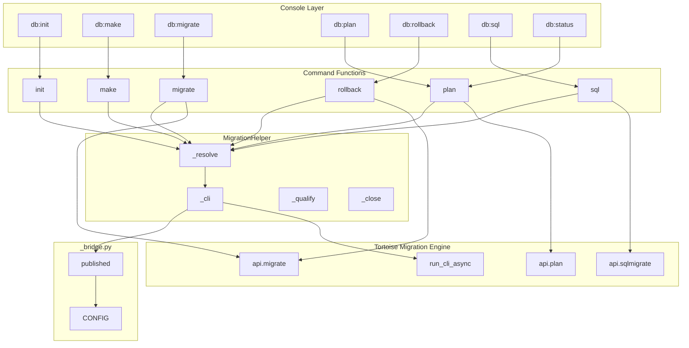
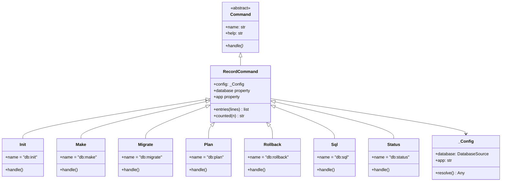
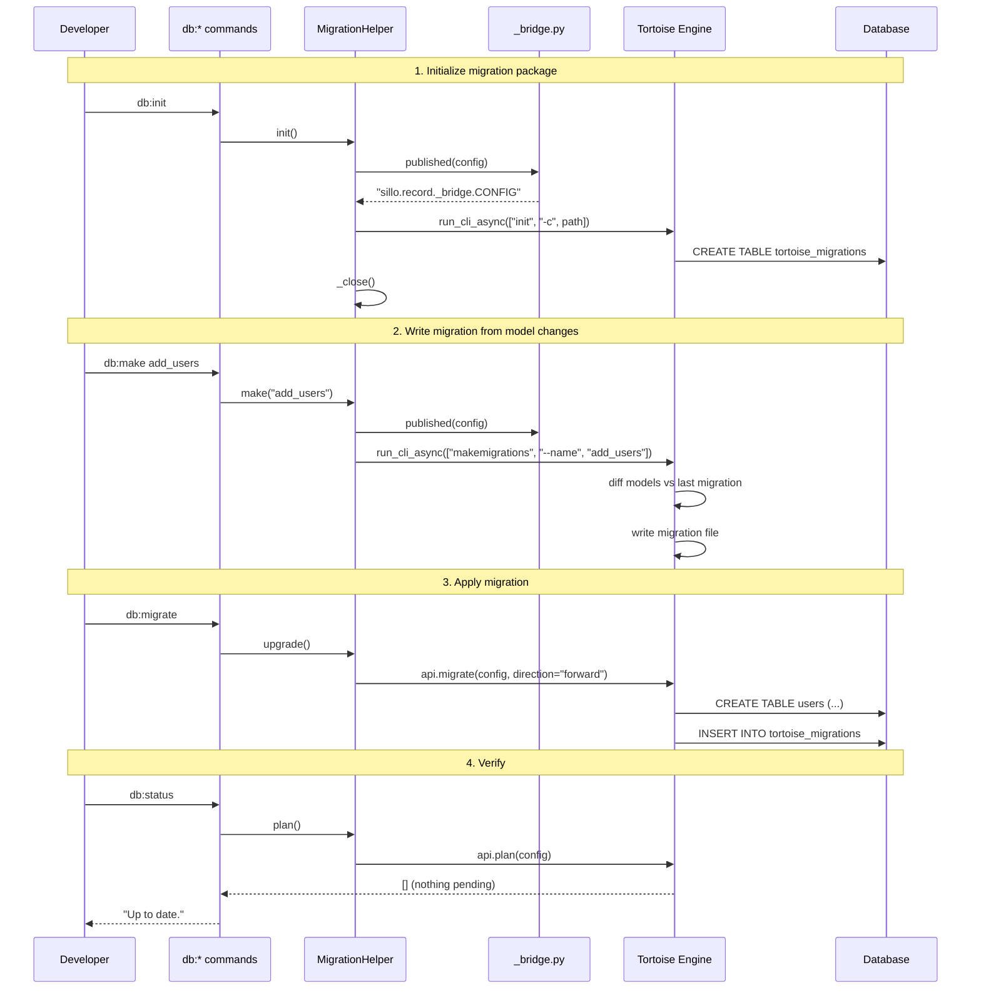
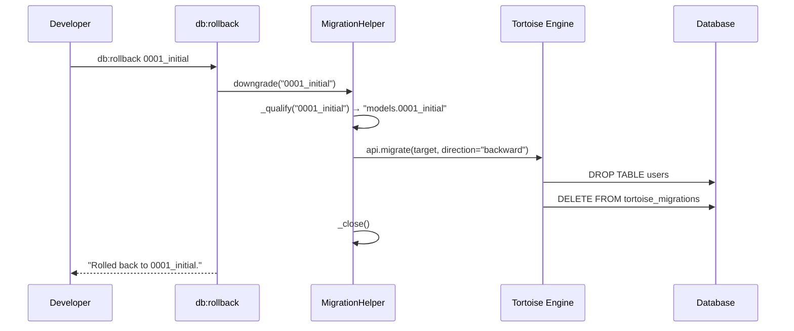

> Internal engineering reference for the Sillo migration system: command
> functions, MigrationHelper, console commands, and the bridge module.
>
> Source: `core/sillo/record/commands/functions.py`,
> `core/sillo/record/commands/__init__.py`,
> `core/sillo/record/helpers.py` (MigrationHelper),
> `core/sillo/record/console.py`,
> `core/sillo/record/_bridge.py`

---

## 1. Overview

Sillo's migration system wraps Tortoise ORM's migration engine with three
layers:

1. **Command functions** (`core/sillo/record/commands/functions.py`) — plain
   async functions (`init`, `make`, `migrate`, `rollback`, `plan`, `sql`) that
   accept a `DatabaseManager` and perform migration operations.
2. **MigrationHelper** (`core/sillo/record/helpers.py`) — the engine adapter
   that translates between sillo's `DatabaseManager` and Tortoise's migration
   API, handling config resolution, CLI bridging, and connection cleanup.
3. **Console commands** (`core/sillo/record/console.py`) — CLI commands
   (`db:init`, `db:make`, `db:migrate`, `db:plan`, `db:rollback`, `db:sql`,
   `db:status`) that bind command functions to a database and provide argument
   parsing, output formatting, and confirmation prompts.



---

## 2. Command Functions

**File:** `core/sillo/record/commands/functions.py`

These are the building blocks. Each function accepts a `Database` (which can be
a `DatabaseManager`, a config dict, or a dotted path) and delegates to
`MigrationHelper`.

### 2.1 Type Alias

```python
Database = Union["DatabaseManager", dict[str, Any], str]
```

The `Database` type accepts three forms:
- `DatabaseManager` — the normal case.
- `dict` — a resolved Tortoise config mapping.
- `str` — a dotted path to a config mapping (for legacy setups).

### 2.2 `_helper`

```python
def _helper(database: Database, app: str | None) -> MigrationHelper:
    return MigrationHelper(database, app=app)
```

Factory that binds a `MigrationHelper` to the database. Every command function
calls this first.

### 2.3 `init`

```python
async def init(database: Database, *, app: str = "models") -> None:
    await _helper(database, app).init()
```

Creates the migration package for the given app. Safe to re-run — existing
packages are left alone.

### 2.4 `make`

```python
async def make(database: Database, name: str | None = None, *, app: str = "models") -> None:
    await _helper(database, app).make(name)
```

Writes a migration file describing the current model changes. Writes nothing
when the models already match the last migration.

### 2.5 `migrate`

```python
async def migrate(database: Database, *, target: str | None = None,
                  fake: bool = False, app: str = "models") -> None:
    await _helper(database, app).upgrade(target=target, fake=fake)
```

Applies every pending migration. `fake=True` records the migration as applied
without running the SQL.

### 2.6 `rollback`

```python
async def rollback(database: Database, target: str, *, fake: bool = False,
                   app: str = "models") -> None:
    await _helper(database, app).downgrade(target, fake=fake)
```

Rolls the database back to the named migration. `"zero"` unapplies everything.

### 2.7 `plan`

```python
async def plan(database: Database, *, target: str | None = None,
               app: str = "models") -> list[str]:
    return await _helper(database, app).plan(target=target)
```

Returns the ordered list of migrations that would run, without running them.

### 2.8 `sql`

```python
async def sql(database: Database, migration: str, *, backward: bool = False,
              app: str = "models") -> list[str]:
    return await _helper(database, app).sql(migration, backward=backward)
```

Returns the SQL a migration would execute, without executing it.

---

## 3. MigrationHelper

**File:** `core/sillo/record/helpers.py` (class `MigrationHelper`)

### 3.1 Constructor

```python
class MigrationHelper:
    def __init__(self, config: Any, *, app: str | None = None) -> None:
        self._config_path = config if isinstance(config, str) else None
        self._config = self._resolve(config)
        self._app = app
```

**Parameters:**

- `config` — one of:
  - `DatabaseManager` — resolved via `manager.orm_config()`.
  - `dict` — used as-is.
  - `str` — imported and resolved to a dict.
- `app` — the app label whose migrations are managed. `None` means all apps.

### 3.2 `_resolve` — Config Resolution

```python
@staticmethod
def _resolve(config: Any) -> dict[str, Any]:
    from .manager import DatabaseManager

    if isinstance(config, DatabaseManager):
        return config.orm_config()
    if isinstance(config, dict):
        return config
    if not isinstance(config, str):
        raise TypeError(...)

    module_path, _, attribute = config.rpartition(".")
    if not module_path:
        raise ValueError(...)
    from importlib import import_module
    resolved = getattr(import_module(module_path), attribute)
    if not isinstance(resolved, dict):
        raise ValueError(...)
    return resolved
```

**Resolution order:**

1. `DatabaseManager` → call `orm_config()` to get the Tortoise config dict.
2. `dict` → use directly.
3. `str` → import the dotted path, access the attribute, expect a dict.

**Why this matters:** The migration engine needs a Tortoise config dict, not a
`DatabaseManager`. But the developer's code works with `DatabaseManager`. This
method bridges the two without requiring the developer to export a separate
config dict.

### 3.3 `_qualify` — Migration Name Qualification

```python
def _qualify(self, target: str | None) -> str | None:
    if not target or "." in target or not self._app:
        return target
    return f"{self._app}.{target}"
```

Tortoise addresses migrations as `app_label.name`. If the developer passes a
bare name like `"0001_initial"`, this method prefixes it with the app label:
`"models.0001_initial"`.

**Cases:**

| Input               | App    | Output                    |
|---------------------|--------|---------------------------|
| `None`              | any    | `None`                    |
| `"0001_initial"`    | `models` | `"models.0001_initial"` |
| `"models.0001_initial"` | any | `"models.0001_initial"` |
| `"zero"`            | `models` | `"models.zero"`         |

### 3.4 `_close` — Connection Cleanup

```python
@staticmethod
async def _close() -> None:
    from tortoise import Tortoise
    await Tortoise.close_connections()
```

Closes all connections the migration engine opened. **Critical for scripts:**
an open connection keeps the event loop alive, causing the script to hang at
exit.

### 3.5 `_cli` — CLI Bridge

```python
async def _cli(self, *args: str) -> None:
    from contextlib import nullcontext
    from tortoise.cli.cli import run_cli_async
    from . import _bridge

    if self._config_path is not None:
        source = nullcontext(self._config_path)
    else:
        source = _bridge.published(self._config)

    with source as config_path:
        argv = ["-c", config_path, *args]
        if self._app:
            argv.append(self._app)
        try:
            code = await run_cli_async(argv)
        finally:
            await self._close()

    if code != 0:
        raise RuntimeError(f"{args[0]} failed with exit code {code}.")
```

**The problem it solves:**

Two migration operations — `init` (create migration package) and
`makemigrations` (write a migration from model changes) — exist only behind
Tortoise's CLI, which reads its configuration by *importing a dotted path*.
When the helper was built from a `DatabaseManager` or a dict, there is no
such path.

**The solution:**

1. If the config was given as a string path (`self._config_path`), use it
   directly.
2. Otherwise, use `_bridge.published(self._config)` to temporarily publish the
   config on a module sillo owns, and pass that module's path to the CLI.

### 3.6 `init`

```python
async def init(self) -> None:
    await self._cli("init")
```

Creates the migration package. Delegates to the CLI because there is no Python
API for this operation.

### 3.7 `make`

```python
async def make(self, name: str | None = None) -> None:
    args = ["makemigrations"]
    if name:
        args += ["--name", name]
    await self._cli(*args)
```

Writes a migration file. Also delegates to the CLI.

### 3.8 `upgrade`

```python
async def upgrade(self, target: str | None = None, *, fake: bool = False) -> None:
    from tortoise.migrations import api
    try:
        await api.migrate(
            config=self._config,
            app_labels=self._app_labels,
            target=self._qualify(target),
            fake=fake,
            direction="forward",
        )
    finally:
        await self._close()
```

Uses Tortoise's Python API directly (not the CLI). Applies all pending
migrations, or stops at `target`.

### 3.9 `downgrade`

```python
async def downgrade(self, target: str, *, fake: bool = False) -> None:
    from tortoise.migrations import api
    if target == "zero":
        target = "__first__"
    target = self._qualify(target) or target
    try:
        await api.migrate(
            config=self._config,
            app_labels=self._app_labels,
            target=target,
            fake=fake,
            direction="backward",
        )
    finally:
        await self._close()
```

**Special case:** `"zero"` is the developer-facing word for "unapply
everything". Tortoise's API uses `"__first__"` for this. The helper translates.

### 3.10 `plan`

```python
async def plan(self, target: str | None = None) -> list[str]:
    from tortoise.migrations import api
    try:
        return await api.plan(
            config=self._config,
            app_labels=self._app_labels,
            target=target,
        )
    finally:
        await self._close()
```

Returns the ordered list of migrations that would run.

### 3.11 `sql`

```python
async def sql(self, migration: str, *, backward: bool = False) -> list[str]:
    if not self._app:
        raise ValueError("sql() needs a single app; build the helper with app=...")
    from tortoise.migrations import api
    try:
        return await api.sqlmigrate(
            config=self._config,
            app_label=self._app,
            migration_name=migration,
            backward=backward,
        )
    finally:
        await self._close()
```

**Constraint:** `sql()` requires a single app label because the SQL for a
migration is app-specific. If `self._app` is `None` (all apps), it raises
`ValueError`.

---

## 4. Console Commands

**File:** `core/sillo/record/console.py`

### 4.1 Architecture



### 4.2 `_Config` — Database Binding

```python
class _Config:
    def __init__(self, database: DatabaseSource, app: str) -> None:
        self.database = database
        self.app = app

    def resolve(self) -> Any:
        return self.database() if callable(self.database) else self.database
```

- `DatabaseSource` can be a `DatabaseManager` or a callable returning one.
- `resolve()` calls the callable on each access (not once at registration),
  because a factory usually builds a fresh manager per invocation.

### 4.3 `RecordCommand` — Base Class

```python
class RecordCommand(Command):
    config: ClassVar[_Config | None] = None

    @property
    def database(self) -> Any:
        if self.config is None:
            raise RuntimeError(
                f"{type(self).__name__} has no database. Register it with "
                f"record_commands(database) rather than adding the class directly."
            )
        return self.config.resolve()

    @property
    def app(self) -> str:
        return self.config.app if self.config else "models"
```

**Key design decision:** Commands must be registered via `record_commands()`,
not added directly. This ensures the `config` class variable is set.

### 4.4 Helper Methods

```python
@staticmethod
def entries(lines: list[str]) -> list[str]:
    return [line for line in lines if line.strip() and not line.lstrip().startswith("#")]

@staticmethod
def counted(number: int) -> str:
    return f"{number} migration" if number == 1 else f"{number} migrations"
```

- `entries()` filters out connection headers and blank lines from `plan()`
  output, keeping only migration names.
- `counted()` handles pluralization.

### 4.5 Individual Commands

#### `db:init`

```python
class Init(RecordCommand):
    name = "db:init"
    help = "Create the migration package"

    async def handle(self) -> None:
        from .commands import init
        await init(self.database, app=self.app)
        self.success("Migration package ready.")
```

#### `db:make`

```python
class Make(RecordCommand):
    name = "db:make"
    help = "Write a migration from the current model changes"

    arguments = [
        Argument("name", default=None, help="Suffix for the migration file"),
        Flag("apply", help="Apply it straight away"),
    ]

    async def handle(self) -> None:
        from .commands import make, migrate, plan

        before = self.entries(await plan(self.database, app=self.app))
        await make(self.database, self.argument("name"), app=self.app)
        after = self.entries(await plan(self.database, app=self.app))

        if len(after) == len(before):
            self.muted("No model changes to record.")
            return

        if not self.flag("apply"):
            self.success("Migration written.")
            self.muted(f"  Review it, then: {self._migrate_hint()}")
            return

        await migrate(self.database, app=self.app)
        self.success("Migration written and applied.")
```

**Smart detection:** Compares `plan()` output before and after `make()` to
detect whether a migration was actually written. Without this, the command
would report "Migration written" even when there were no changes.

**`--apply` flag:** When set, applies the migration immediately after writing.

#### `db:migrate`

```python
class Migrate(RecordCommand):
    name = "db:migrate"
    help = "Apply every pending migration"

    arguments = [
        Option("target", help="Stop at this migration"),
        Flag("fake", help="Record as applied without running the SQL"),
    ]

    async def handle(self) -> None:
        from .commands import migrate, plan

        pending = self.entries(await plan(self.database, target=self.option("target"), app=self.app))
        if not pending:
            self.muted("Nothing pending.")
            return

        for line in pending:
            self.bullet(line)
        self.blank()

        await migrate(self.database, target=self.option("target"), fake=self.flag("fake"), app=self.app)

        if self.flag("fake"):
            self.success(f"Recorded {self.counted(len(pending))} without running.")
        else:
            self.success(f"Applied {self.counted(len(pending))}.")
```

**`--fake`:** Records the migration as applied without running the SQL. Useful
for adopting an existing schema.

**`--target`:** Stops at a specific migration instead of applying all.

#### `db:plan`

```python
class Plan(RecordCommand):
    name = "db:plan"
    help = "Show which migrations would run"

    arguments = [Option("target", help="Plan as far as this migration")]

    async def handle(self) -> None:
        from .commands import plan
        pending = self.entries(await plan(self.database, target=self.option("target"), app=self.app))
        if not pending:
            self.muted("Nothing pending.")
            return
        self.line(f"{self.counted(len(pending))} pending:")
        for line in pending:
            self.bullet(line)
```

#### `db:rollback`

```python
class Rollback(RecordCommand):
    name = "db:rollback"
    help = "Roll the database back to a migration"

    arguments = [
        Argument("target", help="Migration to stop at, or 'zero'"),
        Flag("fake", help="Record the rollback without running it"),
        Flag("force", short="f", help="Skip the confirmation"),
    ]

    async def handle(self) -> int | None:
        from .commands import rollback
        target = self.argument("target")

        if target == "zero" and not self.flag("force"):
            agreed = self.prompt.confirm_destructive(
                "This unapplies every migration and drops the tables they made.",
                "zero",
            )
            if not agreed:
                self.muted("Nothing done.")
                return 1

        await rollback(self.database, target, fake=self.flag("fake"), app=self.app)
        self.success(f"Rolled back to {target}.")
        return None
```

**Safety:** Rolling back to `zero` drops every table. The `--force` flag
skips the confirmation prompt.

#### `db:sql`

```python
class Sql(RecordCommand):
    name = "db:sql"
    help = "Show the SQL a migration would run"

    arguments = [
        Argument("migration", help="Migration name, e.g. '0001_initial'"),
        Flag("backward", help="Show the rollback SQL instead"),
    ]

    async def handle(self) -> None:
        from .commands import sql
        statements = await sql(self.database, self.argument("migration"),
                               backward=self.flag("backward"), app=self.app)
        if not statements:
            self.muted("That migration runs no SQL.")
            return
        for statement in statements:
            self.line(statement)
```

#### `db:status`

```python
class Status(RecordCommand):
    name = "db:status"
    help = "Show whether the database is up to date"

    async def handle(self) -> None:
        from .commands import plan
        pending = self.entries(await plan(self.database, app=self.app))
        self.pairs([("app", self.app), ("pending", len(pending))])
        self.blank()
        if not pending:
            self.success("Up to date.")
            return
        self.warn(f"{self.counted(len(pending))} not applied:")
        for line in pending:
            self.bullet(line)
```

---

## 5. `record_commands` — Command Registration

```python
def record_commands(
    database: DatabaseSource,
    *,
    app: str = "models",
    only: list[str] | None = None,
) -> list[type[Command]]:
    config = _Config(database, app)
    chosen = COMMANDS

    if only is not None:
        available = {command.name: command for command in COMMANDS}
        unknown = [name for name in only if name not in available]
        if unknown:
            raise ValueError(...)
        chosen = [available[name] for name in only]

    return [
        type(command.__name__, (command,), {"config": config}) for command in chosen
    ]
```

### 5.1 Metaclass Binding

The key line is:

```python
type(command.__name__, (command,), {"config": config})
```

This creates a **subclass** of each command with `config` set as a class
variable. This is necessary because:

1. Two consoles can bind the same command to different databases.
2. Each binding needs its own `config` without mutating the original class.
3. Subclassing is the cleanest way to achieve per-registration state.

### 5.2 The `only` Filter

```python
commands = record_commands(database, only=["db:migrate", "db:make"])
```

Filters to a subset of commands. Raises `ValueError` if an unknown name is
passed.

### 5.3 Usage

```python
from sillo.console import Console
from sillo.record.console import record_commands

console = Console(prog="python tools.py")
console.add_many(record_commands(database))
```

### 5.4 Command List

```python
COMMANDS: list[type[RecordCommand]] = [
    Init,       # db:init
    Make,       # db:make
    Migrate,    # db:migrate
    Plan,       # db:plan
    Rollback,   # db:rollback
    Sql,        # db:sql
    Status,     # db:status
]
```

---

## 6. `_bridge.py` — Published Config Context

**File:** `core/sillo/record/_bridge.py`

```python
CONFIG: dict[str, Any] = {}
PATH = f"{__name__}.CONFIG"

@contextmanager
def published(config: dict[str, Any]) -> Iterator[str]:
    global CONFIG
    previous = CONFIG
    CONFIG = config
    try:
        yield PATH
    finally:
        CONFIG = previous
```

### 6.1 The Problem

Tortoise's migration CLI reads configuration by importing a dotted path
(e.g., `-c myapp.config.TORTOISE_ORM`). When the helper was built from a
`DatabaseManager` or a dict, there is no such path.

### 6.2 The Solution

1. `_bridge.py` is a module that sillo owns and that is always importable.
2. `published(config)` temporarily sets `CONFIG` on this module.
3. The path `sillo.record._bridge.CONFIG` is passed to the CLI.
4. The CLI imports `sillo.record._bridge`, finds `CONFIG`, and uses it.
5. On exit, the previous `CONFIG` is restored.

### 6.3 Why Restore Instead of Clear

```python
CONFIG = previous  # not CONFIG = {}
```

If a migration command runs inside another migration command (e.g., `make`
calls `init` internally), the outer config is preserved. Clearing would leave
the outer command with an empty config.

### 6.4 Thread Safety

This module is **not thread-safe**. The global `CONFIG` is shared state. In
practice, migration commands run in a single-threaded context (CLI or script),
so this is acceptable.

---

## 7. Migration Lifecycle

### 7.1 Full Workflow



### 7.2 Rollback Workflow



---

## 8. Migration File Structure

Tortoise generates migration files in the package declared by
`set_migrations()`. The structure:

```
database/
  migrations/
    models/
      0001_initial.py
      0002_add_posts.py
      __init__.py
```

Each migration file contains:

```python
from tortoise import Tortoise
from tortoise.backends.base.schema_generator import BaseSchemaGenerator

async def upgrade(db):
    # SQL to apply the migration
    await db.execute_script("""
        CREATE TABLE users (
            id SERIAL PRIMARY KEY,
            email VARCHAR(255) NOT NULL UNIQUE,
            created_at TIMESTAMP NOT NULL DEFAULT NOW()
        );
    """)

async def downgrade(db):
    # SQL to reverse the migration
    await db.execute_script("""
        DROP TABLE users;
    """)
```

---

## 9. Testing Migrations

### 9.1 Verify Migration Plan

```python
async def test_migration_plan():
    async with DatabaseManager(config).register_models("app.models") as db:
        pending = await plan(db)
        assert len(pending) == 0, f"Pending migrations: {pending}"
```

### 9.2 Test Migration Up/Down

```python
async def test_migration_roundtrip():
    async with DatabaseManager(config).register_models("app.models") as db:
        await migrate(db)
        # verify schema
        await rollback(db, "0001_initial")
        # verify rollback
```

### 9.3 Fake Migration for Existing Schema

```python
async def test_adopt_existing_schema():
    async with DatabaseManager(config).register_models("app.models") as db:
        await migrate(db, fake=True)
        # tables already exist, just record as applied
```

---

## 10. Source File Reference

| File                                         | Contents                                      |
|----------------------------------------------|-----------------------------------------------|
| `core/sillo/record/commands/__init__.py`     | Re-exports: `init`, `make`, `migrate`, `plan`, `rollback`, `sql` |
| `core/sillo/record/commands/functions.py`    | Command functions: `init`, `make`, `migrate`, `rollback`, `plan`, `sql`, `_helper` |
| `core/sillo/record/helpers.py`               | `MigrationHelper` class (init, make, upgrade, downgrade, plan, sql, _resolve, _cli, _qualify, _close) |
| `core/sillo/record/console.py`               | `RecordCommand`, `Init`, `Make`, `Migrate`, `Plan`, `Rollback`, `Sql`, `Status`, `record_commands` |
| `core/sillo/record/_bridge.py`               | `CONFIG`, `PATH`, `published()` context manager |

---

## 11. Gotchas and Known Issues

1. **`init` and `make` require the CLI** — These operations have no Python
   API in Tortoise. The helper must go through `_cli()` → `run_cli_async()`.

2. **`_bridge.py` is not thread-safe** — The global `CONFIG` is shared state.
   Do not run migration commands concurrently.

3. **`"zero"` vs `"__first__"`** — The developer uses `"zero"` to unapply
   everything. Tortoise's API uses `"__first__"`. The helper translates.

4. **`sql()` requires a single app** — It raises `ValueError` if `self._app`
   is `None`. Build the helper with `app="models"` to use `sql()`.

5. **`_close()` is critical** — Without it, open connections keep the event
   loop alive. Every `MigrationHelper` method that opens connections calls
   `_close()` in a `finally` block.

6. **`make()` detection** — The console command compares `plan()` output
   before and after `make()` to detect whether a migration was written.
   Without this, it would report success even when there were no changes.

7. **`rollback` has no implicit "one step back"** — You must name the target
   migration. There is no `rollback(db, steps=1)`.

8. **`record_commands` creates subclasses** — Each call to `record_commands()`
   creates new classes. If you call it twice with different databases, you get
   two sets of commands that do not interfere with each other.

9. **`generate_schemas` must be off** — In migration-managed projects, set
   `DB_GENERATE_SCHEMAS=false`. Otherwise, `init()` creates tables outside
   the migration history.

10. **Connection cleanup order** — `_close()` calls
    `Tortoise.close_connections()`, which closes ALL connections. If other
    code is using the connections concurrently, it will fail. Migration
    commands should run in isolation.
