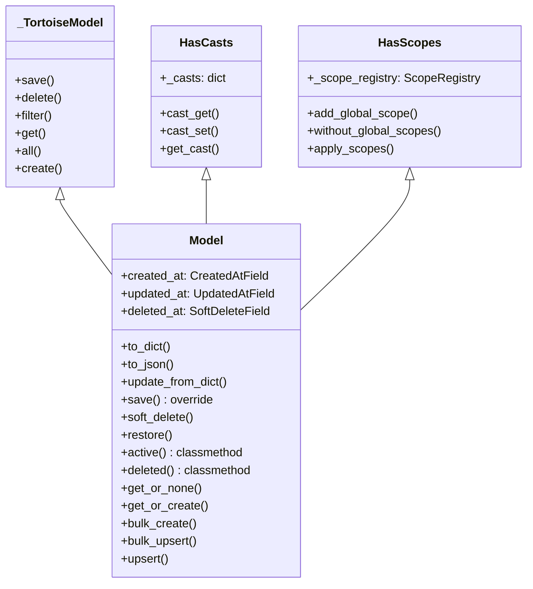
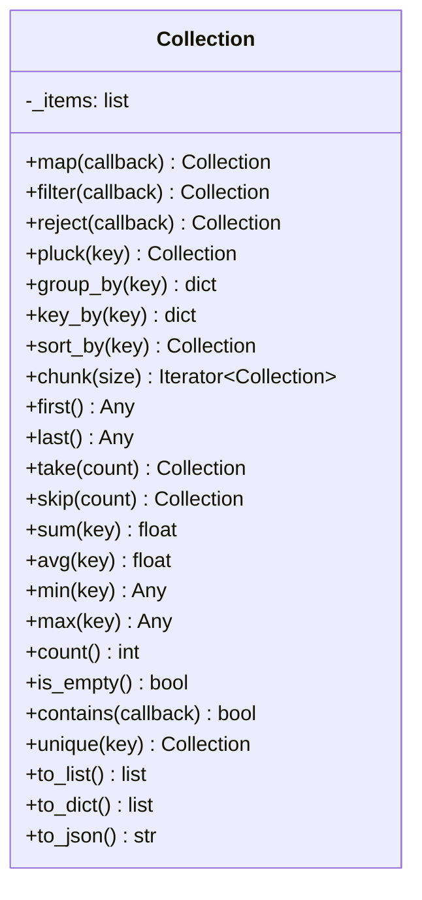
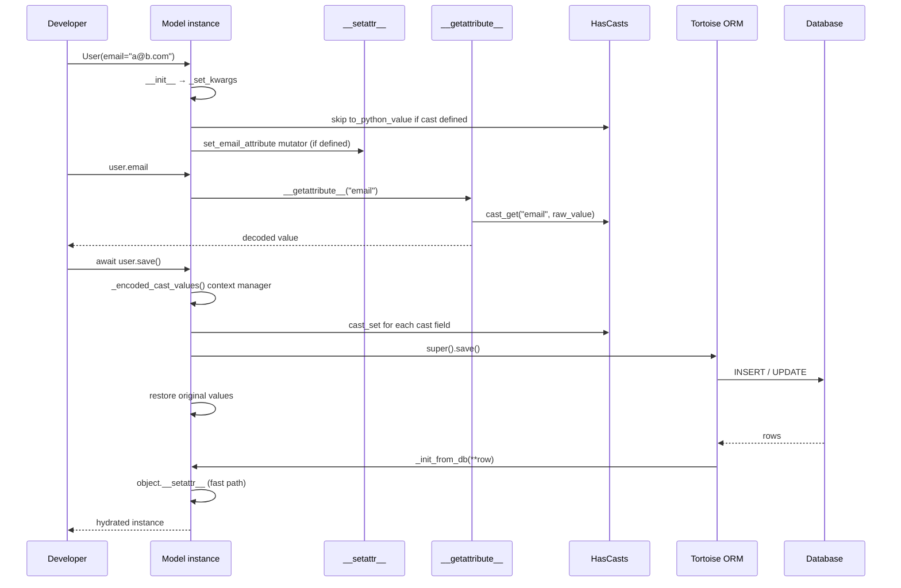

> Internal engineering reference for the Sillo ORM model layer.
>
> Source: `core/sillo/record/models.py`, `core/sillo/record/fields.py`,
> `core/sillo/record/mixins/__init__.py`, `core/sillo/record/collection.py`,
> `core/sillo/record/pydantic.py`

---

## 1. Overview

The `Model` class is the foundation of every database-backed entity in Sillo. It
extends Tortoise ORM's `Model` with three pillars that the rest of the record
layer depends on:

1. **Automatic timestamps and soft-delete** — `created_at`, `updated_at`,
   `deleted_at` are declared on the base class and require zero configuration
   from the developer.
2. **Attribute casting** — inherited from `HasCasts`, every field can be
   transparently encoded on write and decoded on read (JSON blobs, encrypted
   strings, datetime parsing, etc.).
3. **Query scopes** — inherited from `HasScopes`, models expose both local
   scopes (chainable queryset filters) and global scopes (applied to every
   query automatically).



Every model defined in a Sillo project inherits from `sillo.record.Model`:

```python
# file: app/models.py
from sillo.record import Model, fields

class User(Model):
    id = fields.IntField(pk=True)
    email = fields.CharField(max_length=255, unique=True)
    name = fields.CharField(max_length=100)
    _casts = {"preferences": "json"}
```

The `Meta.manager = RecordManager()` declared on the base class ensures that
every queryset returned by `User.all()`, `User.filter(...)`, etc. is a
`RecordQuerySet` with scope interception built in.

---

## 2. Built-in Fields

Three fields are declared directly on `Model` and inherited by every subclass.
They live in `core/sillo/record/fields.py`.

### 2.1 CreatedAtField

```python
class CreatedAtField(_fields.DatetimeField):
    def __init__(self, **kwargs):
        kwargs.setdefault("auto_now_add", True)
        super().__init__(**kwargs)
```

- Wraps Tortoise's `DatetimeField` with `auto_now_add=True`.
- The database driver sets the value once on INSERT; subsequent UPDATEs leave
  it untouched.
- The column is **not nullable** and has **no Python-level default** — the
  driver supplies the timestamp.

### 2.2 UpdatedAtField

```python
class UpdatedAtField(_fields.DatetimeField):
    def __init__(self, **kwargs):
        kwargs.setdefault("auto_now", True)
        super().__init__(**kwargs)
```

- `auto_now=True` means Tortoise rewrites the value on every `save()` call.
- Like `CreatedAtField`, the mutation happens inside the SQL builder, not in
  Python, so even `save(update_fields=["name"])` refreshes `updated_at`.

### 2.3 SoftDeleteField

```python
class SoftDeleteField(_fields.DatetimeField):
    def __init__(self, **kwargs):
        kwargs.setdefault("null", True)
        kwargs.setdefault("default", None)
        super().__init__(**kwargs)
```

- Nullable datetime. `None` means the row is active; a timestamp means it was
  soft-deleted.
- The field is declared on the base `Model` so that `active()` and `deleted()`
  classmethods work universally, but developers who do not need soft-delete can
  simply ignore it — the column is nullable with a `NULL` default, so existing
  rows are unaffected.

### 2.4 Field declaration on the base class

```python
class Model(_TortoiseModel, HasCasts, HasScopes):
    created_at: ClassVar[CreatedAtField] = CreatedAtField()
    updated_at: ClassVar[UpdatedAtField] = UpdatedAtField()
    deleted_at: ClassVar[SoftDeleteField] = SoftDeleteField()

    class Meta:
        abstract = True
        manager = RecordManager()
```

The `ClassVar` annotation satisfies type checkers while Tortoise's metaclass
picks up the field descriptors at class-creation time. `abstract = True`
prevents Tortoise from creating a `model` table for the base class itself.

---

## 3. Custom Field Types

Beyond the three built-in timestamps, `core/sillo/record/fields.py` ships three
additional field types that projects can opt into.

### 3.1 PasswordField

```python
class PasswordField(_fields.CharField):
    password: bool = True          # sentinel for admin auto-detection

    def __init__(self, max_length=255, **kwargs):
        kwargs.setdefault("max_length", max_length)
        super().__init__(**kwargs)

    def to_db_value(self, value, instance, *args, **kwargs):
        if value is None or value == "":
            return value
        if isinstance(value, str) and value.startswith(("$2b$", "$2a$", "$2y$")):
            return value            # already a bcrypt hash
        return hash_password(value)

    def to_python_value(self, value, *args, **kwargs):
        return value                # never expose the hash for re-hashing
```

**Design decisions:**

- The `password: bool = True` sentinel lets the Sillo admin UI auto-detect
  password fields and render a secure widget (reveal toggle, strength meter,
  confirmation field) without configuration.
- `to_db_value` checks for bcrypt prefixes (`$2b$`, `$2a$`, `$2y$`) to avoid
  double-hashing when the value has already been processed.
- `to_python_value` is a no-op — the hash is returned as-is so that a roundtrip
  through the ORM does not corrupt it.
- Plaintext passwords are hashed via `sillo.helpers.hashing.hash_password`,
  which uses bcrypt by default.

### 3.2 SlugField

```python
class SlugField(_fields.CharField):
    def __init__(self, max_length=200, source_field=None, **kwargs):
        kwargs.setdefault("max_length", max_length)
        super().__init__(**kwargs)
        self._source_field = source_field
```

- A `CharField` with a shorter default `max_length` (200 vs 255).
- The `source_field` parameter is stored for application-level slug generation
  (e.g., "generate slug from the `title` field").

### 3.3 ULIDField

```python
class ULIDField(_fields.CharField):
    def __init__(self, **kwargs):
        kwargs.setdefault("max_length", 26)
        kwargs.setdefault("pk", True)
        super().__init__(**kwargs)
```

- 26-character sortable identifier (ULID spec).
- Defaults to `pk=True` so it can replace `IntField(pk=True)` in one swap.
- Time-sortable: lexicographic order matches creation order, which is the
  primary advantage over UUIDv4.

---

## 4. `__init_subclass__` — Automatic Scope Method Generation

When a subclass of `Model` is defined, Python calls `__init_subclass__`. The
override in `Model` does two things:

```python
def __init_subclass__(cls, **kwargs):
    super().__init_subclass__(**kwargs)

    # 1. Re-point the manager so global scopes are applied per-model
    if hasattr(cls, "_meta"):
        cls._meta.manager = RecordManager(cls)

    # 2. Generate shortcut classmethods for scope_* methods
    for name in dir(cls):
        if not name.startswith("scope_"):
            continue
        public_name = name.removeprefix("scope_")
        if hasattr(cls, public_name):
            continue

        def scope_method(scope_name):
            @classmethod
            def call_scope(model_cls, *args, **kwargs):
                return getattr(model_cls.all(), scope_name)(*args, **kwargs)
            return call_scope

        setattr(cls, public_name, scope_method(public_name))
```

**Step 1 — Manager re-assignment:** Tortoise's metaclass attaches a default
`Manager` to `_meta.manager` during class creation. Sillo replaces it with a
`RecordManager(cls)` that applies global scopes. This happens in
`__init_subclass__` rather than in `Meta` because the `Meta` class attribute is
shared across the MRO and would point at the wrong model for subclasses.

**Step 2 — Scope shortcut generation:** If a model defines `scope_active`, the
loop creates a classmethod `Model.active()` that delegates to
`Model.all().active()`. This enables the Laravel-style fluent API:

```python
class User(Model):
    @classmethod
    def scope_active(cls, queryset):
        return queryset.filter(is_active=True)

    @classmethod
    def scope_vip(cls, queryset):
        return queryset.filter(plan="vip")

# Usage:
active_vips = await User.active().vip().all()
```

The guard `if hasattr(cls, public_name): continue` prevents overwriting
explicitly defined classmethods — if the developer already defines `active()`,
the auto-generated version is skipped.

---

## 5. `_set_kwargs` — Constructor Hydration

`_set_kwargs` is called by Tortoise's `__init__` to apply keyword arguments to
the model instance. Sillo's override adds cast awareness:

```python
def _set_kwargs(self, kwargs: dict) -> set[str]:
    meta = self._meta
    passed_fields = {*kwargs.keys()} | meta.fetch_fields
    casts = getattr(type(self), "_casts", {})

    for key, value in kwargs.items():
        if key in meta.fk_fields or key in meta.o2o_fields:
            # FK / O2O: validate the related instance is saved
            if value and not value._saved_in_db:
                raise OperationalError(...)
            setattr(self, key, value)
            passed_fields.add(meta.fields_map[key].source_field)

        elif key in meta.fields_db_projection:
            field_object = meta.fields_map[key]
            if field_object.pk and field_object.generated:
                self._custom_generated_pk = True
            if value is None and not field_object.null:
                raise ValueError(...)
            # KEY DECISION: skip field.to_python_value when a cast is defined
            if key not in casts:
                value = field_object.to_python_value(value)
            setattr(self, key, value)

        elif key in meta.backward_fk_fields:
            raise ConfigurationError(...)
        elif key in meta.backward_o2o_fields:
            raise ConfigurationError(...)
        elif key in meta.m2m_fields:
            raise ConfigurationError(...)

    return passed_fields
```

The critical line is:

```python
if key not in casts:
    value = field_object.to_python_value(value)
```

When a field has a cast defined (e.g., `_casts = {"metadata": "json"}`), the
Tortoise field's `to_python_value` is **skipped** because `HasCasts.cast_get`
will handle the decoding later, during `__getattribute__`. Running both would
double-decode (e.g., JSON string → dict → error).

---

## 6. `_init_from_db` — Fast Hydration

When Tortoise fetches rows from the database, it calls `_init_from_db` instead
of `__init__`. This bypasses validation and `__setattr__` hooks for maximum
throughput:

```python
@classmethod
def _init_from_db(cls, **kwargs: Any) -> Self:
    self = cls.__new__(cls)                     # no __init__
    object.__setattr__(self, "_partial", False)
    object.__setattr__(self, "_saved_in_db", True)
    object.__setattr__(self, "_custom_generated_pk", ...)
    object.__setattr__(self, "_await_when_save", {})
    object.__setattr__(self, "_record_loading", True)  # flag

    meta = self._meta
    inited_keys: set[str] = set()
    try:
        # Phase 1: native fields (pk, simple ints/bools)
        for key, model_field, field in meta.db_native_fields:
            object.__setattr__(self, model_field, kwargs[key])
            inited_keys.add(key)

        # Phase 2: default fields (char, text, datetime)
        for key, model_field, field in meta.db_default_fields:
            value = kwargs[key]
            if value is not None:
                value = field.field_type(value)
            object.__setattr__(self, model_field, value)
            inited_keys.add(key)

        # Phase 3: complex fields (JSON, encrypted, FK)
        for key, model_field, field in meta.db_complex_fields:
            object.__setattr__(
                self, model_field, field.to_python_value(kwargs[key])
            )
            inited_keys.add(key)

    except KeyError:
        # Partial result (e.g., .values() or .only() query)
        object.__setattr__(self, "_partial", True)
        # ... fallback for partial hydration ...

    object.__setattr__(self, "_record_loading", False)
    return self
```

**Key design decisions:**

1. **`object.__setattr__` everywhere** — bypasses the custom `__setattr__` that
   would invoke `set_{field}_attribute` mutators. During hydration, values come
   straight from the DB and need no transformation.

2. **`_record_loading` flag** — checked by the custom `__setattr__` (see §7) so
   that if any code path *does* go through the normal setter during init, it
   still skips mutators.

3. **Three-phase hydration** — native → default → complex. Each phase handles a
   different class of Tortoise field with progressively more conversion work.
   The `try/except KeyError` catches partial results from `.only()` or
   `.values()` queries and falls back to a slower per-field loop.

4. **`_partial` flag** — set to `True` when the row did not supply every column.
   Tortoise uses this to prevent saving a partial instance back to the database
   (which would NULL out missing columns).

---

## 7. Custom `__setattr__` / `__getattribute__`

### 7.1 `__setattr__` — Attribute Mutators

```python
def __setattr__(self, key, value) -> None:
    if not key.startswith("_") and not getattr(self, "_record_loading", False):
        mutator = getattr(type(self), f"set_{key}_attribute", None)
        if mutator is not None:
            value = mutator(self, value)
    super().__setattr__(key, value)
```

- **Private attributes** (starting with `_`) pass through untouched — internal
  bookkeeping like `_saved_in_db` must never trigger mutators.
- **During loading** (`_record_loading is True`) — mutators are skipped to
  avoid re-processing DB values.
- **Mutator lookup** — if the model defines `set_password_attribute(self, value)`,
  it is called before the value is stored. This is the hook `PasswordField`
  uses (though it operates at the Tortoise field level instead).

### 7.2 `__getattribute__` — Cast Decoding and Accessors

```python
def __getattribute__(self, key: str):
    value = super().__getattribute__(key)
    if key.startswith("_"):
        return value
    if getattr(self, "_record_encoding", False):
        return value
    try:
        meta = super().__getattribute__("_meta")
    except AttributeError:
        return value
    if key not in meta.fields:
        return value
    raw_value = value
    if key in getattr(type(self), "_casts", {}):
        raw_value = HasCasts.cast_get(self, key, raw_value)
    accessor = getattr(type(self), f"get_{key}_attribute", None)
    if accessor is not None:
        return accessor(self, raw_value)
    return raw_value
```

The read path has three stages:

1. **Private attributes** and **encoding context** — returned as-is to prevent
   infinite recursion and to allow `_encoded_cast_values` to read raw values.
2. **Cast decoding** — if the field is in `_casts`, `HasCasts.cast_get` applies
   the registered decoder (e.g., `json.loads` for `"json"` casts).
3. **Accessor** — if the model defines `get_{field}_attribute(self, value)`, it
   is called with the (possibly decoded) value. This runs *after* cast decoding,
   so accessors receive Python-native types.

**The `_record_encoding` guard** is critical: during `_encoded_cast_values`,
the context manager writes *encoded* values back onto the instance (e.g., a
dict becomes a JSON string). Without the guard, `__getattribute__` would
immediately decode them again, defeating the purpose.

---

## 8. `_encoded_cast_values` — Save-Time Encoding

```python
@contextmanager
def _encoded_cast_values(self):
    casts = getattr(type(self), "_casts", {})
    if not casts:
        yield
        return
    originals: dict[str, Any] = {}
    object.__setattr__(self, "_record_encoding", True)
    for field_name in casts:
        if field_name not in self._meta.fields:
            continue
        try:
            raw_value = object.__getattribute__(self, field_name)
        except AttributeError:
            continue
        encoded = HasCasts.cast_set(self, field_name, raw_value)
        originals[field_name] = raw_value
        object.__setattr__(self, field_name, encoded)
    try:
        yield
    finally:
        for field_name, value in originals.items():
            object.__setattr__(self, field_name, value)
        object.__setattr__(self, "_record_encoding", False)
```

**Purpose:** When `save()` is called, cast fields must be encoded to their
database representation (e.g., `{"key": "val"}` → `'{"key": "val"}'`). The
context manager:

1. Sets `_record_encoding = True` so `__getattribute__` returns raw values.
2. Reads each cast field with `object.__getattribute__` (bypassing the custom
   getter).
3. Encodes via `HasCasts.cast_set`.
4. Stores the encoded value with `object.__setattr__`.
5. Yields — Tortoise's `save()` reads the attributes and builds SQL.
6. In the `finally` block, restores the original Python-native values.

The save override ties it together:

```python
async def save(self, *args, **kwargs) -> None:
    with self._encoded_cast_values():
        return await super().save(*args, **kwargs)
```

---

## 9. Serialization

### 9.1 `to_dict`

```python
def to_dict(self, *, exclude=None, include=None) -> dict[str, Any]:
    data = {}
    for field_name in self._meta.fields:
        if exclude and field_name in exclude:
            continue
        if include and field_name not in include:
            continue
        value = getattr(self, field_name, None)
        if isinstance(value, datetime):
            value = value.isoformat()
        elif isinstance(value, Model):
            value = value.to_dict()
        data[field_name] = value
    return data
```

- Iterates `_meta.fields` (the set of all field names declared on the model).
- `datetime` values are converted to ISO 8601 strings.
- Nested `Model` instances (FK relations) are recursively serialized.
- `exclude` / `include` allow surgical control over which fields appear.

### 9.2 `to_json`

```python
def to_json(self, *, indent=None, **kwargs) -> str:
    return json.dumps(self.to_dict(**kwargs), indent=indent, default=str)
```

A thin wrapper that JSON-encodes the output of `to_dict`. The `default=str`
fallback handles any type that `json.dumps` cannot serialize natively (e.g.,
`Decimal`, `UUID`).

### 9.3 `update_from_dict`

```python
async def update_from_dict(self, data: dict[str, Any]) -> None:
    for key, value in data.items():
        if key in self._meta.fields:
            setattr(self, key, value)
    await self.save()
```

- Applies a dict of field updates (typically from a Pydantic `model_dump()`)
  and saves.
- Only fields that exist on the model are applied — extra keys are silently
  ignored, which makes it safe to pass request payloads directly.

---

## 10. Soft Delete

```python
async def soft_delete(self) -> None:
    self.deleted_at = datetime.now(timezone.utc)
    await self.save(update_fields=["deleted_at"])

async def restore(self) -> None:
    self.deleted_at = None
    await self.save(update_fields=["deleted_at"])

@classmethod
def active(cls):
    return cls.filter(deleted_at__isnull=True)

@classmethod
def deleted(cls):
    return cls.filter(deleted_at__isnull=False)
```

- `soft_delete()` sets `deleted_at` to the current UTC timestamp and saves only
  that field (no full-row UPDATE).
- `restore()` clears `deleted_at` back to `None`.
- `active()` and `deleted()` return querysets pre-filtered on `deleted_at`.
- These are classmethods on the base `Model`, so they work universally. The
  `SoftDeletesMixin` (§12.1) adds `force_delete()`, `only_trashed()`,
  `with_trashed()`, and the `is_trashed` property for projects that want the
  full Laravel-style API.

---

## 11. Query Shortcuts

### 11.1 `get_or_none`

```python
@classmethod
async def get_or_none(cls, **kwargs) -> Self | None:
    try:
        return await cls.get(**kwargs)
    except Exception:
        return None
```

Returns the first matching row or `None`. Catches *any* exception (including
`DoesNotExist`) so callers never need to handle the error.

### 11.2 `get_or_create`

```python
@classmethod
async def get_or_create(cls, defaults=None, **kwargs) -> tuple[Self, bool]:
    instance = await cls.get_or_none(**kwargs)
    if instance:
        return instance, False
    return await cls.create(**{**kwargs, **(defaults or {})}), True
```

- Returns `(instance, created)`.
- `defaults` are merged into the create payload but not used for the lookup.
- **Race condition note:** two concurrent calls can both see `None` and both
  create. Use `upsert()` with `conflict_fields` when the database supports
  `ON CONFLICT`.

### 11.3 `bulk_create`

```python
@classmethod
async def bulk_create(cls, items, batch_size=100, *, ignore_conflicts=False,
                      update_fields=None, on_conflict=None, using_db=None) -> list[Self]:
    instances = [item if isinstance(item, cls) else cls(**item) for item in items]
    for i in range(0, len(instances), batch_size):
        batch = instances[i : i + batch_size]
        with cls._encoded_instances(batch):
            await super().bulk_create(batch, ...)
    return instances
```

- Accepts dicts or model instances.
- Processes in batches of `batch_size` to avoid massive SQL statements.
- `_encoded_instances` enters `_encoded_cast_values` on every instance in the
  batch so cast fields are properly encoded before the INSERT.

### 11.4 `bulk_upsert`

```python
@classmethod
async def bulk_upsert(cls, items, *, conflict_fields, update_fields=None,
                      batch_size=100, using_db=None) -> list[Self]:
    instances = [item if isinstance(item, cls) else cls(**item) for item in items]
    conflict_fields = tuple(conflict_fields)
    if update_fields is None:
        update_fields = tuple(
            field for field in cls._meta.fields
            if field not in conflict_fields and field != cls._meta.pk_attr
        )
    await cls.bulk_create(instances, batch_size=batch_size,
                          update_fields=tuple(update_fields),
                          on_conflict=conflict_fields, using_db=using_db)
    return instances
```

- Uses Tortoise's `on_conflict` / `update_fields` to generate
  `INSERT ... ON CONFLICT DO UPDATE` (Postgres) or equivalent.
- When `update_fields` is `None`, every non-conflict, non-pk field is updated.

### 11.5 `upsert`

```python
@classmethod
async def upsert(cls, values=None, *, conflict_fields, update_fields=None,
                 using_db=None, **kwargs) -> Self:
    payload = {**(values or {}), **kwargs}
    conflict_fields = tuple(conflict_fields)
    await cls.bulk_upsert([payload], conflict_fields=conflict_fields,
                          update_fields=update_fields, using_db=using_db)
    lookup = {field: payload[field] for field in conflict_fields}
    return await cls.without_global_scopes().get(**lookup)
```

- Convenience for a single-row upsert.
- After the upsert, re-fetches the row with `without_global_scopes()` to return
  the canonical state (the INSERT path does not return the row in all backends).

### 11.6 `count_active`

```python
@classmethod
async def count_active(cls) -> int:
    return await cls.active().count()
```

Shorthand for `SELECT COUNT(*) WHERE deleted_at IS NULL`.

---

## 12. Mixins

The `core/sillo/record/mixins/__init__.py` module provides composable behaviors
that can be mixed into any model. They are independent of each other and of the
base `Model` class.

### 12.1 SoftDeletesMixin

Adds the full Laravel-style soft-delete API:

| Method / Property   | Description                                      |
|---------------------|--------------------------------------------------|
| `soft_delete()`     | Set `deleted_at` to now, save                    |
| `restore()`         | Clear `deleted_at`, save                         |
| `force_delete()`    | Hard-delete the row                              |
| `active()`          | Queryset: `deleted_at IS NULL`                   |
| `only_trashed()`    | Queryset: `deleted_at IS NOT NULL`               |
| `with_trashed()`    | Queryset: no filter (all rows)                   |
| `is_trashed`        | Property: `True` if `deleted_at is not None`     |

The base `Model` already provides `soft_delete()`, `restore()`, `active()`,
and `deleted()`. Use the mixin when you need `force_delete()`,
`only_trashed()`, `with_trashed()`, or `is_trashed`.

### 12.2 TimestampsMixin

```python
class TimestampsMixin:
    async def touch(self) -> None:
        self.updated_at = datetime.now(timezone.utc)
        await self.save(update_fields=["updated_at"])

    def set_created_at(self) -> None:
        if not self.created_at:
            self.created_at = datetime.now(timezone.utc)
```

- `touch()` — manually refresh `updated_at` without changing other fields.
- `set_created_at()` — set `created_at` if not already set. Useful for
  pre-save hooks where the field does not use `auto_now_add`.

### 12.3 HasUlidMixin

```python
class HasUlidMixin:
    def generate_ulid(self) -> str:
        return str(ulid.new())
```

Requires the `ulid-py` package. Provides a single method that generates a
26-character sortable ULID string.

### 12.4 SerializesToDictMixin

```python
class SerializesToDictMixin:
    def to_dict(self, *, exclude=None, include=None, max_depth=3) -> dict:
        ...
    def to_json(self, *, indent=None, **kwargs) -> str:
        ...
```

Like the base `Model.to_dict` but adds `max_depth` to prevent infinite
recursion on deeply nested relations. Each nested `to_dict` call decrements
the depth; at 0, relations are serialized as their string representation.

### 12.5 ValidatesBeforeSaveMixin

```python
class ValidatesBeforeSaveMixin:
    async def validate(self) -> None:
        """Override in your model. Raise ValueError or return None."""

    async def save(self, *args, **kwargs):
        await self.validate()
        return await super().save(*args, **kwargs)
```

- Calls `self.validate()` before every `save()`.
- Override `validate()` to add custom logic; raise `ValueError` to abort.

### 12.6 CascadesDeletesMixin

```python
class CascadesDeletesMixin:
    _cascade_deletes: ClassVar[list[str]] = []

    async def delete(self):
        for relation in self._cascade_deletes:
            related = getattr(self, relation, None)
            if related is not None and hasattr(related, "delete"):
                await related.delete()
        return await super().delete()
```

- Define `_cascade_deletes = ["posts", "comments"]` on the model.
- When `delete()` is called, each named relation is deleted first.
- **Note:** This is application-level cascading, not database-level
  `ON DELETE CASCADE`. The related objects must be pre-fetched or accessible
  via a reverse relation.

---

## 13. Collection

`core/sillo/record/collection.py` provides an immutable-like chainable wrapper
around lists of model instances.



**Design principles:**

1. **Every method returns a new Collection** — the original is never mutated.
   This makes chains safe to fork:
   ```python
   base = Collection(users)
   admins = base.filter(lambda u: u.is_admin)
   vips = base.filter(lambda u: u.plan == "vip")
   ```

2. **`pluck` extracts a single field** — `collection.pluck("email")` returns
   `Collection(["a@b.com", "c@d.com", ...])`.

3. **`group_by` returns `dict[Any, Collection]`** — each group is itself a
   Collection, so further chaining is possible.

4. **`chunk` yields sub-collections** — useful for batch processing:
   ```python
   for batch in collection.chunk(100):
       await process_batch(batch)
   ```

5. **Aggregations** (`sum`, `avg`, `min`, `max`) accept an optional field name.
   Without it, they operate on the raw items (useful for numeric collections).

6. **`to_dict` / `to_json`** delegate to each item's `to_dict()` if available.

---

## 14. Pydantic Bridge

`core/sillo/record/pydantic.py` generates Pydantic models from Tortoise model
definitions.

### 14.1 `pydantic_model_from_tortoise`

```python
def pydantic_model_from_tortoise(
    model_class: type,
    *,
    name: str = "",
    exclude: list[str] | None = None,
    include: list[str] | None = None,
    optional_fields: list[str] | None = None,
) -> type[BaseModel]:
```

**How it works:**

1. Iterates `model_class._meta.fields_map` — the Tortoise model's field registry.
2. For each field, calls `_tortoise_to_python_type(field_obj)` to get the Python
   type (`int`, `str`, `bool`, `float`, `dict`).
3. Determines optionality: fields in `optional_fields` or with `field_obj.null`
   are wrapped in `Optional[...]` and default to `None`.
4. Required non-null fields get `Field(...)` (ellipsis = required).
5. Calls `pydantic.create_model(name, __base__=BaseModel, **fields)`.

### 14.2 Type Mapping

| Tortoise Field      | Python Type |
|---------------------|-------------|
| `IntField`          | `int`       |
| `SmallIntField`     | `int`       |
| `BigIntField`       | `int`       |
| `FloatField`        | `float`     |
| `DecimalField`      | `float`     |
| `BooleanField`      | `bool`      |
| `CharField`         | `str`       |
| `TextField`         | `str`       |
| `DatetimeField`     | `str`       |
| `DateField`         | `str`       |
| `TimeDeltaField`    | `float`     |
| `JSONField`         | `dict`      |
| Anything else       | `str`       |

**Note:** `DatetimeField` maps to `str` (ISO 8601 format) rather than
`datetime`. This is intentional — Pydantic models are typically used for
request validation where datetimes arrive as strings.

### 14.3 Usage Pattern

```python
from sillo.record.pydantic import pydantic_model_from_tortoise

UserCreate = pydantic_model_from_tortoise(
    User,
    name="UserCreate",
    exclude=["id", "created_at", "updated_at", "deleted_at"],
    optional_fields=["bio", "avatar_url"],
)

@app.post("/users", request_model=UserCreate)
async def create_user(request, response):
    user = await User.create(**request.validated_data.model_dump())
    return response.json(user.to_dict(), status_code=201)
```

---

## 15. Model Lifecycle Diagram



---

## 16. Events System

`core/sillo/record/events.py` provides an observer pattern for model lifecycle
events. While not part of the base `Model` class, it integrates cleanly via
the `HasEvents` mixin.

### 16.1 Supported Events

| Event            | When it fires                     |
|------------------|-----------------------------------|
| `before_create`  | Before `create()`                 |
| `after_create`   | After `create()`                  |
| `before_save`    | Before `save()` (create or update)|
| `after_save`     | After `save()`                    |
| `before_update`  | Before `save()` on existing row   |
| `after_update`   | After `save()` on existing row    |
| `before_delete`  | Before `delete()`                 |
| `after_delete`   | After `delete()`                  |
| `before_restore` | Before `restore()`                |
| `after_restore`  | After `restore()`                 |

### 16.2 Registration

```python
# Decorator style
@User.on("after_create")
async def log_creation(instance):
    await audit_log(f"User {instance.id} created")

# Observer class style
class UserObserver(ModelObserver):
    async def before_create(self, instance):
        instance.email = instance.email.lower()

User.observe(UserObserver())
```

### 16.3 EventDispatcher

The `EventDispatcher` class manages both callback-style and observer-style
listeners. When `fire(event, instance)` is called:

1. All registered callbacks for that event are called sequentially.
2. All registered observers are checked for a matching method.
3. Exceptions in callbacks are logged but do not abort the event chain.

---

## 17. Source File Reference

| File                                | Contents                                      |
|-------------------------------------|-----------------------------------------------|
| `core/sillo/record/models.py`       | `Model` class, `__init_subclass__`, `_set_kwargs`, `_init_from_db`, `__setattr__`, `__getattribute__`, `_encoded_cast_values`, serialization, soft delete, shortcuts |
| `core/sillo/record/fields.py`       | `PasswordField`, `CreatedAtField`, `UpdatedAtField`, `SoftDeleteField`, `SlugField`, `ULIDField` |
| `core/sillo/record/mixins/__init__.py` | `SoftDeletesMixin`, `TimestampsMixin`, `HasUlidMixin`, `SerializesToDictMixin`, `ValidatesBeforeSaveMixin`, `CascadesDeletesMixin` |
| `core/sillo/record/collection.py`   | `Collection` class                             |
| `core/sillo/record/pydantic.py`     | `pydantic_model_from_tortoise`, `_tortoise_to_python_type` |
| `core/sillo/record/events.py`       | `ModelObserver`, `EventDispatcher`, `HasEvents` |
| `core/sillo/record/casting.py`      | `CastRegistry`, `HasCasts` (detailed in doc 22) |
| `core/sillo/record/scopes.py`       | `ScopeRegistry`, `HasScopes`, `RecordQuerySet`, `RecordManager` (detailed in doc 22) |
| `core/sillo/record/__init__.py`     | Public API re-exports                          |

---

## 18. Gotchas and Known Issues

1. **Double-decode prevention** — The `if key not in casts` guard in
   `_set_kwargs` is essential. Without it, a JSON field would be decoded by
   `field.to_python_value` (which returns `str` → `str`) and then again by
   `cast_get` (which calls `json.loads`), potentially crashing on a dict.

2. **`_record_loading` flag** — Must be set to `False` at the end of
   `_init_from_db`, even in the `except` branch. The current code does this
   correctly, but a refactor that adds early returns could break it.

3. **`_record_encoding` guard in `__getattribute__`** — Without it,
   `_encoded_cast_values` would write an encoded value, then immediately
   decode it when Tortoise reads the attribute to build SQL, defeating the
   purpose.

4. **`bulk_create` batch size** — The default of 100 is conservative. For
   Postgres with large payloads, consider 500–1000. For SQLite, keep it small
   to avoid hitting the variable limit.

5. **`get_or_create` race condition** — Two concurrent calls can both create.
   Use `upsert()` with `conflict_fields` for atomic upserts.

6. **`_cascade_deletes` requires pre-fetching** — The mixin iterates
   `getattr(self, relation)`, which triggers a lazy query if the relation is
   not loaded. For N models with M relations each, this is N×M queries.
