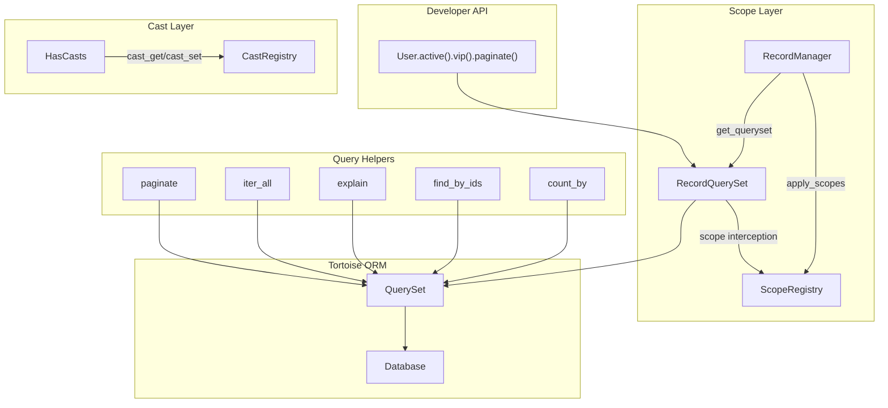
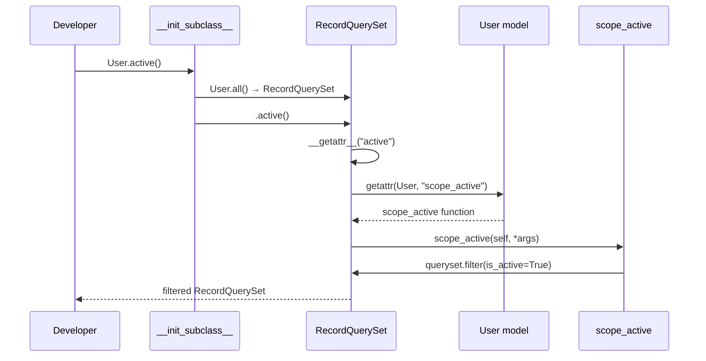
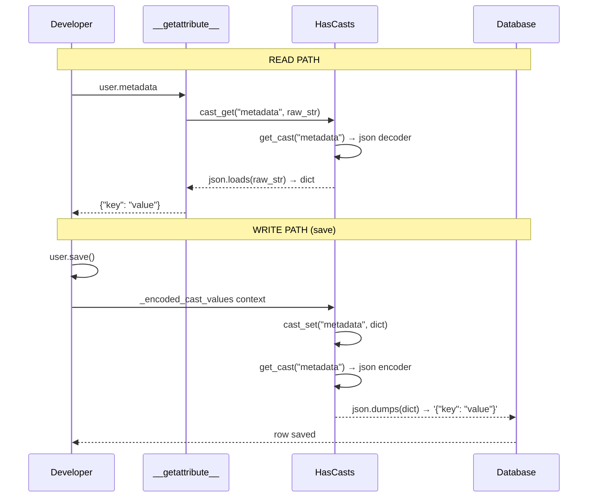
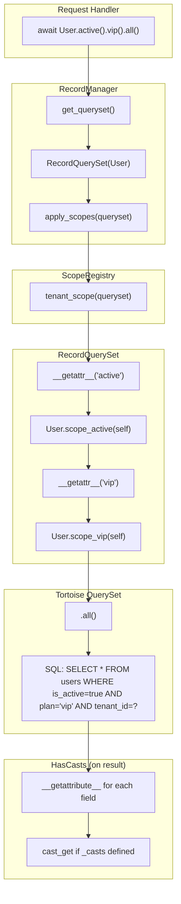

> Internal engineering reference for the Sillo ORM query layer: scopes, casts,
> query helpers, pagination, and query logging.
>
> Source: `core/sillo/record/scopes.py`, `core/sillo/record/casting.py`,
> `core/sillo/record/queries.py`, `core/sillo/record/pagination.py`,
> `core/sillo/record/logging.py`

---

## 1. Overview

The query layer sits between the developer's fluent API and Tortoise ORM's
query builder. It adds three capabilities that Tortoise does not provide:

1. **Scopes** — reusable query fragments that can be chained (local) or
   applied automatically (global).
2. **Casts** — transparent encode/decode of field values at the attribute
   boundary, so the database always sees the serialized form and the developer
   always sees the Python-native form.
3. **Query helpers** — pagination, async iteration, explain plans, bulk lookups,
   and in-memory aggregation.



---

## 2. ScopeRegistry

**File:** `core/sillo/record/scopes.py`

```python
class ScopeRegistry:
    def __init__(self):
        self._global_scopes: list[Callable] = []

    def add(self, scope: Callable) -> None:
        self._global_scopes.append(scope)

    def remove(self, scope: Callable) -> bool:
        try:
            self._global_scopes.remove(scope)
            return True
        except ValueError:
            return False

    def apply(self, queryset):
        for scope in self._global_scopes:
            queryset = scope(queryset)
        return queryset

    def without_global_scopes(self, queryset):
        return queryset
```

### 2.1 Design

- **Global scopes** are callables with the signature `(queryset) -> queryset`.
- They are stored in a list and applied in registration order.
- `apply()` chains them: each scope receives the queryset returned by the
  previous one.
- `remove()` returns `True` if found, `False` otherwise. It uses `list.remove`
  which matches by identity (`is`), not equality — the exact same callable
  object must be passed.
- `without_global_scopes()` is a pass-through that returns the queryset
  unchanged. It exists as a named method so that `HasScopes.without_global_scopes()`
  can delegate to it with a clear intent.

### 2.2 Lifecycle

Each model class gets its own `ScopeRegistry` instance, stored on
`cls._scope_registry`. The registry is created lazily on the first call to
`add_global_scope`:

```python
@classmethod
def add_global_scope(cls, scope: Callable) -> None:
    if cls._scope_registry is None:
        cls._scope_registry = ScopeRegistry()
    cls._scope_registry.add(scope)
```

This means models that never register a global scope pay no cost.

---

## 3. HasScopes

**File:** `core/sillo/record/scopes.py`

```python
class HasScopes:
    _scope_registry: ScopeRegistry | None = None

    @classmethod
    def add_global_scope(cls, scope: Callable) -> None:
        if cls._scope_registry is None:
            cls._scope_registry = ScopeRegistry()
        cls._scope_registry.add(scope)

    @classmethod
    def without_global_scopes(cls):
        return cls._meta.manager.without_global_scopes()

    @classmethod
    def apply_scopes(cls, queryset):
        if cls._scope_registry is not None:
            return cls._scope_registry.apply(queryset)
        return queryset
```

### 3.1 Local Scopes

Local scopes are methods prefixed with `scope_`. They are defined on the model
class and receive the queryset as the first argument:

```python
class User(Model):
    @classmethod
    def scope_active(cls, queryset):
        return queryset.filter(is_active=True)

    @classmethod
    def scope_vip(cls, queryset, plan_type="vip"):
        return queryset.filter(plan=plan_type)
```

The `__init_subclass__` hook on `Model` (see doc 21, §4) auto-generates
shortcut classmethods:

```python
User.active()        # → User.all().active()
User.vip("premium")  # → User.all().vip("premium")
```

### 3.2 Global Scopes

Global scopes are applied to **every** query on the model:

```python
def tenant_scope(queryset):
    return queryset.filter(tenant_id=get_current_tenant())

Tenant.add_global_scope(tenant_scope)

# Every query now includes WHERE tenant_id = ?
users = await User.all()           # filtered
users = await User.filter(...)     # filtered
users = await User.without_global_scopes().all()  # unfiltered
```

### 3.3 Scope Interception via RecordQuerySet

Local scopes are not methods on the queryset — they are methods on the **model**
that receive the queryset. The `RecordQuerySet.__getattr__` bridge makes them
chainable:

```python
class RecordQuerySet(QuerySet):
    def __getattr__(self, name: str):
        scope = getattr(self.model, f"scope_{name}", None)
        if scope is None:
            raise AttributeError(...)

        def apply_local_scope(*args, **kwargs):
            return scope(self, *args, **kwargs)

        return apply_local_scope
```

When the developer writes `User.active().vip()`, the chain resolves as:

1. `User.active()` → `User.all().active()` (via `__init_subclass__` shortcut)
2. `User.all()` returns a `RecordQuerySet` (via `RecordManager.get_queryset`)
3. `.active()` → `RecordQuerySet.__getattr__("active")` → calls
   `User.scope_active(self)` → returns filtered queryset
4. `.vip()` → same mechanism on the new queryset



### 3.4 `without_global_scopes`

```python
# On RecordQuerySet
def without_global_scopes(self):
    queryset = self.__class__(self.model)
    queryset._db = self._db
    return queryset

# On RecordManager
def without_global_scopes(self) -> RecordQuerySet:
    return RecordQuerySet(self._model)
```

Creates a fresh `RecordQuerySet` that bypasses the manager's
`get_queryset()` (which applies global scopes). The database connection is
preserved from the original queryset.

---

## 4. RecordManager

**File:** `core/sillo/record/scopes.py`

```python
class RecordManager(Manager):
    def get_queryset(self) -> RecordQuerySet:
        queryset = RecordQuerySet(self._model)
        apply_scopes = getattr(self._model, "apply_scopes", None)
        if apply_scopes is not None:
            return apply_scopes(queryset)
        return queryset

    def without_global_scopes(self) -> RecordQuerySet:
        return RecordQuerySet(self._model)
```

### 4.1 How Tortoise Uses the Manager

When you call `User.all()`, Tortoise's `Model.all()` delegates to
`cls._meta.manager.get_queryset()`. Sillo's `RecordManager` overrides this to:

1. Create a `RecordQuerySet` (instead of Tortoise's default `QuerySet`).
2. Apply global scopes via `apply_scopes()`.

The manager is assigned in `__init_subclass__`:

```python
def __init_subclass__(cls, **kwargs):
    super().__init_subclass__(**kwargs)
    if hasattr(cls, "_meta"):
        cls._meta.manager = RecordManager(cls)
```

### 4.2 Manager Diagram


---

## 5. HasCasts — Attribute Casting

**File:** `core/sillo/record/casting.py`

### 5.1 CastRegistry

```python
class CastRegistry:
    _builtins: ClassVar[dict[str, tuple[Callable, Callable]]] = {}

    @classmethod
    def register(cls, name: str, encoder: Callable, decoder: Callable) -> None:
        cls._builtins[name] = (encoder, decoder)

    @classmethod
    def get(cls, name: str):
        return cls._builtins.get(name)
```

Each cast is a pair of `(encoder, decoder)`:
- **Encoder** — called on `cast_set` (before save). Transforms Python values
  to database-safe representations.
- **Decoder** — called on `cast_get` (after read). Transforms database values
  back to Python-native types.

### 5.2 Built-in Casts

| Name         | Encoder                          | Decoder                          |
|--------------|----------------------------------|----------------------------------|
| `"json"`     | `json.dumps(value, default=str)` | `json.loads(value)`              |
| `"datetime"` | `value.isoformat()`              | `datetime.fromisoformat(value)`  |
| `"bool"`     | `bool(v)`                        | `bool(v)`                        |
| `"int"`      | `int(v)`                         | `int(v)` if not None             |
| `"float"`    | `float(v)`                       | `float(v)` if not None           |

Registered at module load time:

```python
CastRegistry.register("json", _json_encoder, _json_decoder)
CastRegistry.register("datetime", _datetime_encoder, _datetime_decoder)
CastRegistry.register("bool", lambda v: bool(v), lambda v: bool(v))
CastRegistry.register("int", lambda v: int(v), lambda v: int(v) if v is not None else None)
CastRegistry.register("float", lambda v: float(v), lambda v: float(v) if v is not None else None)
```

### 5.3 Encrypted Cast

The `"encrypted"` cast is special — it requires a key and is created via a
factory:

```python
def _encrypted_factory(key: str):
    def encoder(value: str) -> str:
        encoded = bytes([ord(c) ^ ord(key[i % len(key)]) for i, c in enumerate(value)])
        return base64.b64encode(encoded).decode()

    def decoder(value: str) -> str:
        decoded = base64.b64decode(value)
        return "".join(chr(b ^ ord(key[i % len(key)])) for i, b in enumerate(decoded))

    return encoder, decoder
```

Usage in `_casts`:

```python
class User(Model):
    _casts = {
        "secret_key": ("encrypted", {"key": "my-secret"}),
    }
```

The tuple form `("encrypted", {"key": "..."})` is detected by `get_cast`:

```python
def get_cast(self, field_name: str):
    cast_def = self._casts.get(field_name)
    if cast_def is None:
        return None, None
    if isinstance(cast_def, str):
        return CastRegistry.get(cast_def) or (None, None)
    if isinstance(cast_def, tuple):
        name, kwargs = cast_def[0], cast_def[1] if len(cast_def) > 1 else {}
        if name == "encrypted":
            return _encrypted_factory(**kwargs)
    if callable(cast_def):
        return cast_def()
    return None, None
```

### 5.4 HasCasts Mixin

```python
class HasCasts:
    _casts: ClassVar[dict[str, Any]] = {}

    def get_cast(self, field_name: str):
        ...  # resolves encoder/decoder from _casts

    def cast_get(self, field_name: str, value: Any) -> Any:
        _, decoder = self.get_cast(field_name)
        if decoder and value is not None:
            return decoder(value)
        return value

    def cast_set(self, field_name: str, value: Any) -> Any:
        encoder, _ = self.get_cast(field_name)
        if encoder and value is not None:
            return encoder(value)
        return value
```

### 5.5 Cast Flow Diagram



### 5.6 Cast Resolution Order

When `get_cast(field_name)` is called, the resolution depends on the type of
`_casts[field_name]`:

| Type of value     | Resolution                                    |
|-------------------|-----------------------------------------------|
| `str` (e.g. `"json"`) | Look up in `CastRegistry._builtins`       |
| `tuple`           | First element is the name; second is kwargs.  |
|                   | `"encrypted"` → `_encrypted_factory(**kwargs)` |
| `callable`        | Call it; expect `(encoder, decoder)` return   |
| `None` / missing  | No cast; pass-through                         |

---

## 6. Query Helpers

**File:** `core/sillo/record/queries.py`

### 6.1 `paginate`

```python
async def paginate(queryset, page=1, page_size=20, *, ordering=None) -> PaginatedResult:
    if ordering:
        queryset = queryset.order_by(ordering)
    total = await queryset.count()
    offset = (page - 1) * page_size
    items = await queryset.offset(offset).limit(page_size).all()
    return PaginatedResult(items=items, total=total, page=page, page_size=page_size)
```

**Key details:**

- `page` is 1-based (not 0-based).
- `ordering` accepts field names with optional `-` prefix for descending
  (e.g., `"-created_at"`).
- Two queries are executed: `COUNT(*)` and `SELECT ... OFFSET ... LIMIT`.
- Returns a `PaginatedResult` with metadata.

### 6.2 PaginatedResult

```python
class PaginatedResult:
    def __init__(self, items, total, page, page_size):
        self.items = items
        self.total = total
        self.page = page
        self.page_size = page_size

    @property
    def pages(self) -> int:
        return max(1, (self.total + self.page_size - 1) // self.page_size)

    @property
    def has_next(self) -> bool:
        return self.page < self.pages

    @property
    def has_prev(self) -> bool:
        return self.page > 1

    def to_dict(self) -> dict:
        return {
            "items": [item.to_dict() if hasattr(item, "to_dict") else str(item)
                      for item in self.items],
            "total": self.total,
            "page": self.page,
            "page_size": self.page_size,
            "pages": self.pages,
            "has_next": self.has_next,
            "has_prev": self.has_prev,
        }
```

**Properties:**

- `pages` — total number of pages (ceiling division, minimum 1).
- `has_next` / `has_prev` — boolean navigation hints.
- `to_dict()` — serializes the entire result for JSON responses.

### 6.3 `iter_all`

```python
async def iter_all(queryset, batch_size=500) -> AsyncIterator[Any]:
    offset = 0
    while True:
        batch = await queryset.offset(offset).limit(batch_size).all()
        if not batch:
            break
        for item in batch:
            yield item
        offset += batch_size
```

- Memory-efficient async generator for large datasets.
- Fetches `batch_size` rows at a time using `OFFSET/LIMIT`.
- Yields individual items, not batches — the caller sees a flat stream.
- **Caveat:** `OFFSET`-based pagination is inefficient for very large datasets
  (the DB must scan and skip rows). For millions of rows, consider cursor-based
  pagination.

### 6.4 `explain`

```python
async def explain(queryset) -> str:
    try:
        sql, params = queryset.sql()
        conn = connections.get("default")
        result = await conn.execute_query(f"EXPLAIN {sql}", params)
        return str(result)
    except Exception as e:
        return f"EXPLAIN unavailable: {e}"
```

- Extracts the SQL from a queryset via `.sql()`.
- Prepends `EXPLAIN` and executes against the default connection.
- Returns the execution plan as a string.
- Catches all exceptions — `EXPLAIN` support varies by backend.

### 6.5 `find_by_ids`

```python
async def find_by_ids(queryset, ids: list[Any]) -> list[Any]:
    pk = queryset.model._meta.pk_attr
    return await queryset.filter(**{f"{pk}__in": ids}).all()
```

- Fetches multiple rows by primary key in a single query.
- Uses Tortoise's `__in` filter operator.
- The primary key field is resolved dynamically from `_meta.pk_attr`.

### 6.6 `count_by`

```python
async def count_by(queryset, field: str) -> dict:
    results = {}
    async for row in queryset.all():
        val = getattr(row, field, None)
        results[str(val)] = results.get(str(val), 0) + 1
    return results
```

- **In-memory** group-by aggregation.
- Iterates all rows and counts occurrences of each field value.
- Values are stringified for dict keys.
- **Performance warning:** This loads every row into memory. For large datasets,
  use a database-level `GROUP BY` via raw SQL or Tortoise's `.annotate()`.

---

## 7. TortoiseDataHandler

**File:** `core/sillo/record/pagination.py`

Bridges Sillo's pagination strategies (`PageNumberPagination`,
`LimitOffsetPagination`, `CursorPagination`) to Tortoise querysets.

### 7.1 AsyncTortoiseDataHandler

```python
class TortoiseDataHandler(AsyncDataHandler):
    def __init__(self, queryset):
        self._qs = queryset

    async def get_total_items(self) -> int:
        return await self._qs.count()

    async def get_items(self, offset: int, limit: int) -> list[Any]:
        return await self._qs.offset(offset).limit(limit).all()
```

Implements the `AsyncDataHandler` protocol from `sillo.pagination`:

```python
class AsyncDataHandler(Protocol):
    async def get_total_items(self) -> int: ...
    async def get_items(self, offset: int, limit: int) -> list[Any]: ...
```

### 7.2 SyncTortoiseDataHandler

```python
class SyncTortoiseDataHandler(SyncDataHandler):
    def __init__(self, data: list[Any]):
        self._data = data

    def get_total_items(self) -> int:
        return len(self._data)

    def get_items(self, offset: int, limit: int) -> list[Any]:
        return self._data[offset : offset + limit]
```

For pre-fetched data that needs synchronous pagination (rare — mostly for
compatibility with `SyncPaginator`).

### 7.3 Usage with Pagination Strategies

```python
from sillo.record.pagination import TortoiseDataHandler
from sillo.pagination import PageNumberPagination

handler = TortoiseDataHandler(User.filter(is_active=True))
paginator = PageNumberPagination()
result = await paginator.paginate(handler, page=2, page_size=10)
```

---

## 8. QueryLogger

**File:** `core/sillo/record/logging.py`

Tracks database queries issued during a request and detects slow queries and
N+1 patterns.

### 8.1 QueryLogEntry

```python
class QueryLogEntry:
    def __init__(self, sql: str, params: Any, duration_ms: float, source: str = ""):
        self.sql = sql
        self.params = params
        self.duration_ms = duration_ms
        self.source = source
        self.timestamp = time.time()
```

Each entry captures the SQL, parameters, duration, optional source annotation,
and wall-clock timestamp.

### 8.2 QueryLogger

```python
class QueryLogger:
    def __init__(self, slow_threshold_ms=100.0, detect_n_plus_one=True):
        self._entries: list[QueryLogEntry] = []
        self._slow_threshold = slow_threshold_ms
        self._detect_n1 = detect_n_plus_one
        self._started = False
        self._start_time = 0.0
```

**Lifecycle:**

1. `start()` — clears entries, sets `_started = True`, records start time.
2. `log(sql, params, duration_ms, source)` — appends an entry. If
   `duration_ms > slow_threshold`, logs a warning.
3. `stop()` — sets `_started = False`.
4. `report()` — returns a summary dict.

### 8.3 Slow Query Detection

```python
def log(self, sql, params=None, duration_ms=0, source="") -> None:
    if self._started:
        entry = QueryLogEntry(sql, params, duration_ms, source)
        self._entries.append(entry)
        if duration_ms > self._slow_threshold:
            logger.warning("SLOW QUERY [%.1fms] %s", duration_ms, sql[:200])
```

- Default threshold: 100ms.
- Slow queries are logged at WARNING level to `sillo.record.logging`.
- The SQL is truncated to 200 characters in the log message.

### 8.4 N+1 Detection

```python
def detect_n_plus_one(self) -> list[str]:
    warnings = []
    sql_list = [e.sql for e in self._entries]
    for i, sql in enumerate(sql_list):
        count = sql_list.count(sql)
        if count > 5:
            warnings.append(f"N+1 detected: query '{sql[:100]}' ran {count} times")
    return list(set(warnings))
```

**Algorithm:**

1. Collect all SQL strings from entries.
2. For each unique SQL, count how many times it appears.
3. If a query ran more than 5 times, flag it as a potential N+1.
4. Deduplicate warnings with `set()`.

**Limitations:**

- Parameterized queries with different params are counted separately (correct).
- But `SELECT * FROM posts WHERE user_id = ?` with different `?` values will
  have the same SQL string, so they *are* flagged as N+1 — which is the
  intended behavior.
- The threshold of 5 is hardcoded. A configurable threshold would be better.

### 8.5 Report

```python
def report(self) -> dict[str, Any]:
    return {
        "total_queries": self.total_queries,
        "total_time_ms": self.total_time_ms,
        "slow_queries": len(self.slow_queries),
        "slow_details": [str(e) for e in self.slow_queries],
        "n_plus_one_warnings": self.detect_n_plus_one() if self._detect_n1 else [],
    }
```

Example output:

```json
{
    "total_queries": 47,
    "total_time_ms": 234.5,
    "slow_queries": 3,
    "slow_details": [
        "[152.3ms] SELECT * FROM posts WHERE user_id = ...",
        "[201.1ms] SELECT COUNT(*) FROM comments WHERE ...",
        "[110.8ms] SELECT * FROM tags WHERE post_id IN ..."
    ],
    "n_plus_one_warnings": [
        "N+1 detected: query 'SELECT * FROM posts WHERE user_id = ...' ran 12 times"
    ]
}
```

### 8.6 Usage Pattern

```python
from sillo.record.logging import QueryLogger

logger = QueryLogger(slow_threshold_ms=50)
logger.start()

# ... process request ...

logger.stop()
report = logger.report()

if report["n_plus_one_warnings"]:
    for warning in report["n_plus_one_warnings"]:
        print(f"⚠ {warning}")

if report["slow_queries"] > 0:
    print(f"⚠ {report['slow_queries']} slow queries detected")
```

### 8.7 Properties

| Property        | Type             | Description                              |
|-----------------|------------------|------------------------------------------|
| `total_time_ms` | `float`          | Sum of all query durations               |
| `total_queries` | `int`            | Number of logged queries                 |
| `slow_queries`  | `list[QueryLogEntry]` | Entries exceeding the threshold     |

---

## 9. Integration: How Queries Flow Through the Stack



---

## 10. Pagination Strategies

Sillo's pagination system (in `sillo.pagination`) is strategy-based. The
`TortoiseDataHandler` adapts Tortoise querysets to the strategy interface.

### 10.1 PageNumberPagination

Traditional page-based pagination:
- Input: `page`, `page_size`
- SQL: `COUNT(*)` + `SELECT ... OFFSET (page-1)*page_size LIMIT page_size`

### 10.2 LimitOffsetPagination

Offset-based pagination:
- Input: `offset`, `limit`
- SQL: `COUNT(*)` + `SELECT ... OFFSET offset LIMIT limit`

### 10.3 CursorPagination

Cursor-based pagination (for infinite scroll):
- Input: `cursor` (opaque), `page_size`
- SQL: `SELECT ... WHERE id > cursor_id LIMIT page_size`
- No `COUNT(*)` query needed — `has_next` is determined by fetching
  `page_size + 1` items.

---

## 11. Advanced Patterns

### 11.1 Composing Scopes

Scopes compose naturally:

```python
class Post(Model):
    @classmethod
    def scope_published(cls, qs):
        return qs.filter(published_at__isnull=False)

    @classmethod
    def scope_recent(cls, qs, days=7):
        cutoff = datetime.now(timezone.utc) - timedelta(days=days)
        return qs.filter(published_at__gte=cutoff)

    @classmethod
    def scope_by_author(cls, qs, author_id):
        return qs.filter(author_id=author_id)

# Usage:
posts = await Post.published().recent(days=30).by_author(user.id).all()
```

### 11.2 Global Scope for Multi-Tenancy

```python
def tenant_scope(queryset):
    from sillo.context import get_current_tenant
    return queryset.filter(tenant_id=get_current_tenant())

class TenantModel(Model):
    class Meta:
        abstract = True

    @classmethod
    def __init_subclass__(cls, **kwargs):
        super().__init_subclass__(**kwargs)
        cls.add_global_scope(tenant_scope)
```

### 11.3 Combining Casts with Scopes

Casts and scopes are independent — a field can have both:

```python
class Event(Model):
    _casts = {"metadata": "json", "starts_at": "datetime"}

    @classmethod
    def scope_upcoming(cls, qs):
        # starts_at is decoded to datetime by cast_get, but the filter
        # operates on the DB column, which stores ISO strings
        return qs.filter(starts_at__gte=datetime.now(timezone.utc).isoformat())
```

### 11.4 Custom Cast Types

Register project-specific casts:

```python
from sillo.record.casting import CastRegistry

def _point_encoder(value: tuple) -> str:
    return f"{value[0]},{value[1]}"

def _point_decoder(value: str) -> tuple:
    x, y = value.split(",")
    return (float(x), float(y))

CastRegistry.register("point", _point_encoder, _point_decoder)

class Location(Model):
    _casts = {"coordinates": "point"}

loc = Location(coordinates=(37.7749, -122.4194))
await loc.save()  # stores "37.7749,-122.4194"
print(loc.coordinates)  # (37.7749, -122.4194)
```

---

## 12. Performance Considerations

### 12.1 N+1 Prevention

The `QueryLogger.detect_n_plus_one()` method detects N+1 patterns
retroactively. For prevention:

1. Use Tortoise's `prefetch_related()` or `select_related()`.
2. Use `iter_all()` for batch processing instead of loading everything at once.
3. Monitor the query count in development with `QueryLogger`.

### 12.2 Pagination Performance

- `paginate()` executes two queries: `COUNT(*)` and `SELECT ... OFFSET/LIMIT`.
- For very large tables, `COUNT(*)` can be slow. Consider caching the count
  or using cursor pagination (which skips the count).
- `OFFSET`-based pagination degrades at high page numbers. Use cursor-based
  pagination for infinite scroll.

### 12.3 Cast Overhead

- Each `cast_get` / `cast_set` call is a function call + the encoder/decoder
  itself. For JSON fields, this is `json.loads` / `json.dumps` per access.
- The `_encoded_cast_values` context manager iterates all cast fields on every
  `save()`. For models with many cast fields, this adds overhead.
- Mitigation: only use casts for fields that genuinely need transformation.
  Simple string/integer fields should not have casts.

### 12.4 Scope Application

- Global scopes are applied on **every** query, including `count()`,
  `exists()`, and `filter()` chains.
- If a global scope is expensive (e.g., a subquery), it will be executed
  repeatedly.
- Mitigation: keep global scopes simple (single `filter` clauses). Move
  complex logic to local scopes.

---

## 13. Source File Reference

| File                                    | Contents                                      |
|-----------------------------------------|-----------------------------------------------|
| `core/sillo/record/scopes.py`           | `ScopeRegistry`, `HasScopes`, `RecordQuerySet`, `RecordManager` |
| `core/sillo/record/casting.py`          | `CastRegistry`, built-in casters, `_encrypted_factory`, `HasCasts` |
| `core/sillo/record/queries.py`          | `paginate`, `PaginatedResult`, `iter_all`, `explain`, `find_by_ids`, `count_by` |
| `core/sillo/record/pagination.py`       | `TortoiseDataHandler`, `SyncTortoiseDataHandler` |
| `core/sillo/record/logging.py`          | `QueryLogEntry`, `QueryLogger`                |

---

## 14. Gotchas and Known Issues

1. **`count_by` is in-memory** — It loads every row and counts in Python. For
   large tables, use raw SQL `GROUP BY` or Tortoise's `.annotate()`.

2. **`iter_all` uses OFFSET** — For tables with millions of rows, OFFSET-based
   pagination becomes slow. Consider keyset pagination (WHERE id > last_id).

3. **N+1 detection threshold** — The hardcoded threshold of 5 may be too low
   for some legitimate patterns (e.g., fetching related data for 10 items).
   Consider making it configurable.

4. **Cast registry is global** — `CastRegistry._builtins` is a class variable,
   shared across all models. Registering a cast with the same name as an
   existing one overwrites it silently.

5. **Scope identity matching** — `ScopeRegistry.remove()` uses `list.remove`,
   which matches by identity (`is`), not equality. A lambda or function
   defined inline cannot be removed by defining an identical one.

6. **`without_global_scopes` creates a new queryset** — The returned queryset
   has no filters, ordering, or limits from the original. Chain it carefully:
   ```python
   User.filter(is_active=True).without_global_scopes()  # loses is_active filter!
   User.without_global_scopes().filter(is_active=True)  # correct
   ```

7. **`explain` varies by backend** — SQLite's `EXPLAIN` output is very
   different from Postgres's. The function returns whatever the backend
   produces as a string.
