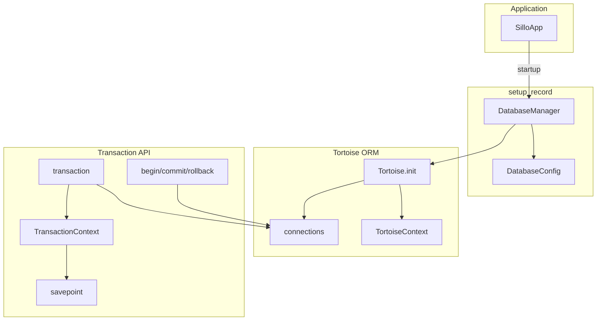
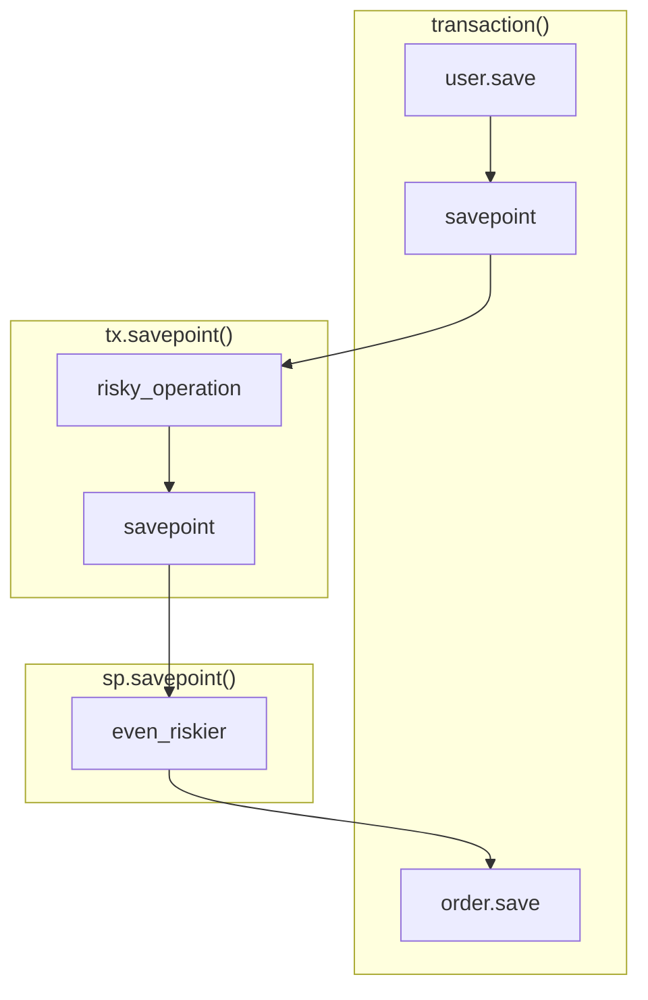
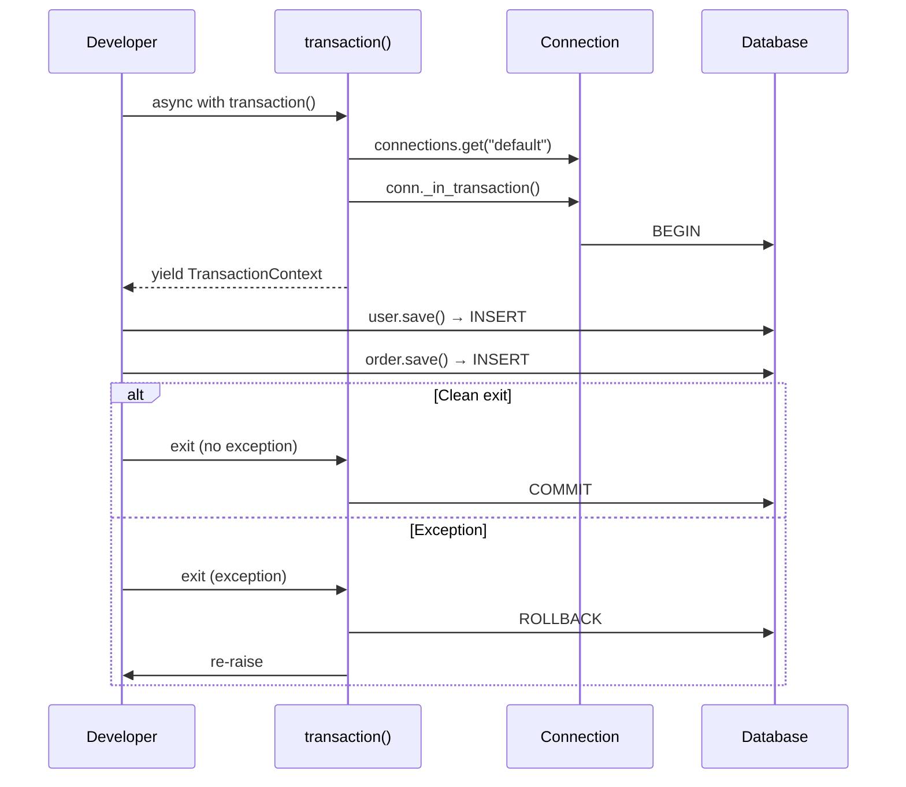
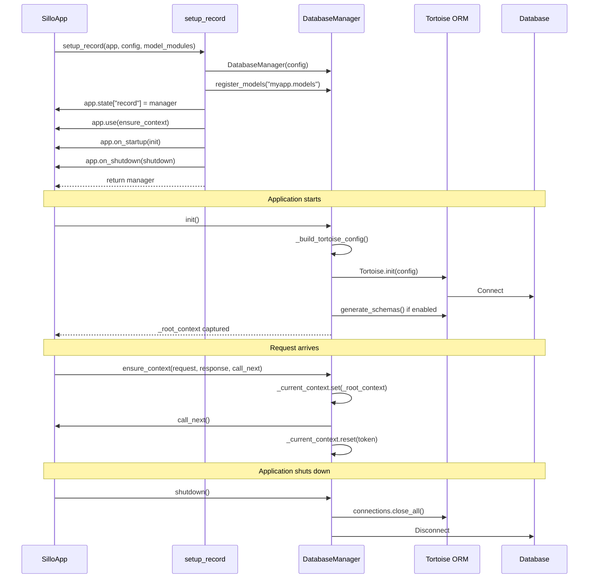

> Internal engineering reference for the Sillo ORM transaction API, database
> configuration, connection lifecycle, and application wiring.
>
> Source: `core/sillo/record/transactions.py`, `core/sillo/record/config.py`,
> `core/sillo/record/manager.py`

---

## 1. Overview

The transaction and database configuration layer provides:

1. **Transaction API** — async context-manager-based transactions with
   savepoint nesting, plus manual begin/commit/rollback for edge cases.
2. **DatabaseConfig** — a dataclass that holds connection parameters with
   environment-variable loading and fluent factory methods for SQLite,
   Postgres, and MySQL.
3. **DatabaseManager** — manages the Tortoise ORM lifecycle: init, shutdown,
   health checks, and per-request context propagation.
4. **`setup_record`** — one-call wiring function that connects the database
   to a Sillo application.



---

## 2. Transaction API

**File:** `core/sillo/record/transactions.py`

### 2.1 `transaction()` Context Manager

```python
@asynccontextmanager
async def transaction(connection_name: str = "default"):
    conn = connections.get(connection_name)
    try:
        async with conn._in_transaction() as tx:
            yield TransactionContext(conn, tx)
    except Exception:
        logger.exception("Transaction rolled back")
        raise
```

**Behavior:**

- Acquires a connection from Tortoise's connection pool.
- Opens a transaction via `conn._in_transaction()` (Tortoise's native API).
- Yields a `TransactionContext` for savepoint nesting.
- On clean exit: commits automatically.
- On exception: rolls back automatically and re-raises.
- Logs the exception at ERROR level.

**Usage:**

```python
from sillo.record import transaction

async with transaction():
    await user.save()
    await order.save()
    # Both succeed or both roll back
```

### 2.2 TransactionContext

```python
class TransactionContext:
    def __init__(self, conn, tx):
        self._conn = conn
        self._tx = tx

    @asynccontextmanager
    async def savepoint(self):
        async with self._tx._in_transaction() as nested:
            yield TransactionContext(self._conn, nested)
```

**Purpose:** Wraps the Tortoise transaction object to provide savepoint
nesting. Each `savepoint()` call:

1. Opens a nested transaction (which the database implements as a SAVEPOINT).
2. Yields a new `TransactionContext` for further nesting.
3. On clean exit: releases the savepoint.
4. On exception: rolls back to the savepoint (not the outer transaction).

### 2.3 Savepoint Nesting

```python
async with transaction() as tx:
    await user.save()                    # part of outer transaction

    async with tx.savepoint() as sp:
        await risky_operation()          # can be rolled back independently
        async with sp.savepoint():
            await even_riskier()         # nested savepoint

    await order.save()                   # still part of outer transaction
```



**Database implementation:**

| Database   | Outer transaction | Savepoint syntax                     |
|------------|-------------------|--------------------------------------|
| PostgreSQL | `BEGIN` / `COMMIT`| `SAVEPOINT sp_N` / `RELEASE sp_N`   |
| MySQL      | `BEGIN` / `COMMIT`| `SAVEPOINT sp_N` / `RELEASE sp_N`   |
| SQLite     | `BEGIN` / `COMMIT`| `SAVEPOINT sp_N` / `RELEASE sp_N`   |

### 2.4 Manual Transaction Control

For edge cases where the context manager pattern does not fit:

```python
from sillo.record import begin, commit, rollback

await begin()
try:
    await user.save()
    await order.save()
    await commit()
except Exception:
    await rollback()
    raise
```

**Functions:**

```python
async def begin(connection_name: str = "default") -> None:
    conn = connections.get(connection_name)
    await conn.execute_query("BEGIN")

async def commit(connection_name: str = "default") -> None:
    conn = connections.get(connection_name)
    await conn.execute_query("COMMIT")

async def rollback(connection_name: str = "default") -> None:
    conn = connections.get(connection_name)
    await conn.execute_query("ROLLBACK")
```

**When to use manual control:**

- Long-running scripts where the context manager's scope does not align with
  the transaction boundary.
- Integrating with external systems that have their own transaction semantics.
- Debugging transaction issues (easier to step through).

**When NOT to use manual control:**

- Normal request handling — always use the context manager.
- Any code where an exception could skip the `commit()` or `rollback()`.

### 2.5 Transaction Flow Diagram



---

## 3. DatabaseConfig

**File:** `core/sillo/record/config.py`

### 3.1 Dataclass Definition

```python
@dataclass
class DatabaseConfig:
    url: str = field(default_factory=lambda: os.getenv("DATABASE_URL", "sqlite://:memory:"))
    backend: DatabaseBackend = DatabaseBackend.SQLITE
    pool_size: int = field(default_factory=lambda: int(os.getenv("DB_POOL_SIZE", "5")))
    max_overflow: int = field(default_factory=lambda: int(os.getenv("DB_MAX_OVERFLOW", "10")))
    pool_recycle: int = field(default_factory=lambda: int(os.getenv("DB_POOL_RECYCLE", "3600")))
    echo: bool = field(default_factory=lambda: os.getenv("DB_ECHO", "false").lower() == "true")
    ssl: bool = field(default_factory=lambda: os.getenv("DB_SSL", "false").lower() == "true")
    timezone: str = field(default_factory=lambda: os.getenv("DB_TIMEZONE", "UTC"))
    charset: str = "utf8mb4"
    ssl_ca: str | None = field(default_factory=lambda: os.getenv("DB_SSL_CA"))
    ssl_cert: str | None = field(default_factory=lambda: os.getenv("DB_SSL_CERT"))
    ssl_key: str | None = field(default_factory=lambda: os.getenv("DB_SSL_KEY"))
    generate_schemas: bool = field(
        default_factory=lambda: os.getenv("DB_GENERATE_SCHEMAS", "true").lower() == "true"
    )
```

### 3.2 Field Reference

| Field              | Env Var                | Default              | Description                                      |
|--------------------|------------------------|----------------------|--------------------------------------------------|
| `url`              | `DATABASE_URL`         | `sqlite://:memory:`  | Full connection URL                              |
| `backend`          | (auto-detected)        | `SQLITE`             | Enum: `sqlite`, `postgres`, `mysql`, `mariadb`   |
| `pool_size`        | `DB_POOL_SIZE`         | `5`                  | Min connections in pool                          |
| `max_overflow`     | `DB_MAX_OVERFLOW`      | `10`                 | Extra connections beyond pool_size               |
| `pool_recycle`     | `DB_POOL_RECYCLE`      | `3600`               | Seconds before a connection is recycled          |
| `echo`             | `DB_ECHO`              | `false`              | Enable query logging at DEBUG level              |
| `ssl`              | `DB_SSL`               | `false`              | Enable SSL for the connection                    |
| `timezone`         | `DB_TIMEZONE`          | `UTC`                | Database timezone                                |
| `charset`          | —                      | `utf8mb4`            | MySQL/MariaDB character set                      |
| `ssl_ca`           | `DB_SSL_CA`            | `None`               | Path to CA certificate                           |
| `ssl_cert`         | `DB_SSL_CERT`          | `None`               | Path to client certificate                       |
| `ssl_key`          | `DB_SSL_KEY`           | `None`               | Path to client key                               |
| `generate_schemas` | `DB_GENERATE_SCHEMAS`  | `true`               | Auto-create tables on init                       |

### 3.3 Backend Auto-Detection

```python
def __post_init__(self):
    if self.url.startswith("postgres") or self.url.startswith("postgresql"):
        self.backend = DatabaseBackend.POSTGRES
    elif self.url.startswith("mysql"):
        self.backend = DatabaseBackend.MYSQL
    elif self.url.startswith("mariadb"):
        self.backend = DatabaseBackend.MARIADB
```

The backend is inferred from the URL scheme in `__post_init__`. This means
you never need to set `backend` explicitly when using a factory method or
passing a URL.

### 3.4 DatabaseBackend Enum

```python
class DatabaseBackend(Enum):
    SQLITE = "sqlite"
    POSTGRES = "postgres"
    MYSQL = "mysql"
    MARIADB = "mariadb"
```

### 3.5 Factory Methods

#### `from_env`

```python
@classmethod
def from_env(cls, *, prefix: str = "") -> DatabaseConfig:
    if prefix:
        url = os.getenv(f"{prefix}_DATABASE_URL", "sqlite://:memory:")
    else:
        url = os.getenv("DATABASE_URL", "sqlite://:memory:")
    return cls(url=url)
```

- Loads the URL from the environment.
- `prefix` allows multiple databases: `TEST_DATABASE_URL`, `ANALYTICS_DATABASE_URL`.

#### `sqlite`

```python
@classmethod
def sqlite(cls, path: str = ":memory:") -> DatabaseConfig:
    return cls(url=f"sqlite://{path}", backend=DatabaseBackend.SQLITE)
```

#### `postgres`

```python
@classmethod
def postgres(cls, database, password, *, user="postgres", host="localhost", port=5432):
    return cls(
        url=f"postgres://{user}:{password}@{host}:{port}/{database}",
        backend=DatabaseBackend.POSTGRES,
    )
```

#### `mysql`

```python
@classmethod
def mysql(cls, database, password, *, user="root", host="localhost", port=3306):
    backend = DatabaseBackend.MARIADB if "mariadb" in host.lower() else DatabaseBackend.MYSQL
    return cls(
        url=f"mysql://{user}:{password}@{host}:{port}/{database}",
        backend=backend,
    )
```

### 3.6 `generate_schemas` Warning

The `generate_schemas` flag controls whether `Tortoise.generate_schemas()` is
called on init. It defaults to `true` for convenience, but **should be turned
off** in projects that use migrations:

> When `generate_schemas` is `true` and the project has migrations:
>
> - Tables are created outside the migration history, so a later
>   `makemigrations` sees them as new and the migration then fails to apply
>   against tables that already exist.
> - Every process does it on startup — an app, a worker, and a scheduler
>   sharing one SQLite file raise "database is locked" on boot.
>
> Set `DB_GENERATE_SCHEMAS=false` to disable.

---

## 4. DatabaseManager

**File:** `core/sillo/record/manager.py`

### 4.1 Class Definition

```python
class DatabaseManager:
    def __init__(self, config: DatabaseConfig):
        self.config = config
        self._initialized = False
        self._model_modules: list[str] = []
        self._migrations_module: str = "database.migrations"
        self._root_context = None
```

### 4.2 `register_models`

```python
def register_models(self, *modules: str) -> DatabaseManager:
    self._model_modules.extend(modules)
    return self
```

- Registers one or more dotted module paths containing Tortoise models.
- Returns `self` for chaining.
- Called before `init()`.

### 4.3 `set_migrations`

```python
def set_migrations(self, module: str) -> DatabaseManager:
    self._migrations_module = module
    return self
```

- Declares where the project's migrations live.
- Defaults to `"database.migrations"`.
- Returns `self` for chaining.

### 4.4 `init`

```python
async def init(self) -> None:
    if self._initialized:
        return
    cfg = self._build_tortoise_config()
    self._root_context = await Tortoise.init(config=cfg)
    if self.config.generate_schemas:
        await Tortoise.generate_schemas(safe=True)
    self._initialized = True
    logger.info("Database connected — backend=%s", self.config.backend.value)
```

**Steps:**

1. Build the Tortoise config dict via `_build_tortoise_config()`.
2. Call `Tortoise.init(config=cfg)` — this creates connections and registers
   models.
3. Capture the `TortoiseContext` returned by `Tortoise.init()` for per-request
   propagation (see §4.7).
4. If `generate_schemas` is `true`, create missing tables.
5. Set `_initialized = True` to prevent double-init.

### 4.5 `shutdown`

```python
async def shutdown(self) -> None:
    if not self._initialized:
        return
    await connections.close_all()
    self._initialized = False
    logger.info("Database connections closed")
```

- Closes all database connections.
- Sets `_initialized = False`.
- Safe to call multiple times.

### 4.6 `health`

```python
async def health(self) -> bool:
    try:
        conn = connections.get("default")
        await conn.execute_query("SELECT 1")
        return True
    except Exception:
        return False
```

- Pings the database with `SELECT 1`.
- Returns `True` if the connection is alive, `False` otherwise.
- Catches all exceptions (connection refused, timeout, etc.).

### 4.7 `ensure_context` — Per-Request Middleware

```python
async def ensure_context(self, request, response, call_next):
    ctx = self._root_context
    if ctx is None or not getattr(ctx, "inited", False):
        return await call_next()
    if _current_context is None:
        return await call_next()
    if _current_context.get() is not None:
        return await call_next()
    token = _current_context.set(ctx)
    try:
        return await call_next()
    finally:
        _current_context.reset(token)
```

**The problem it solves:**

Tortoise >= 0.25 stores DB connections in a task-scoped `TortoiseContext` (a
`contextvars.ContextVar`). ASGI request handling runs in a separate task from
the startup task, so the context variable is not propagated. Without this
middleware, requests would fail with "no connection" errors.

**How it works:**

1. Captures the `TortoiseContext` during `init()` (stored in `_root_context`).
2. On each request, checks if the context is already set (e.g., by a previous
   middleware).
3. If not, sets it for the duration of the request using `_current_context.set()`.
4. Resets the token in the `finally` block.

**Compatibility:**

- Pre-0.25 Tortoise: `_current_context` is `None` (import fails), so the
  middleware is a pass-through.
- Tortoise >= 0.25: the middleware propagates the context.

### 4.8 `__aenter__` / `__aexit__` — Script Support

```python
async def __aenter__(self) -> Self:
    await self.init()
    return self

async def __aexit__(self, *_exc) -> None:
    await self.shutdown()
```

For scripts and management commands where the application's startup hooks
never run:

```python
async with DatabaseManager(config).register_models("app.models") as db:
    await User.all()
# connections closed automatically
```

### 4.9 `orm_config`

```python
def orm_config(self, migrations: str | None = None) -> dict:
    if migrations:
        self._migrations_module = migrations
    return self._build_tortoise_config()
```

Returns the resolved Tortoise configuration dict. Used by `MigrationHelper`
and `record_commands` to share the same connection definition as the app.

---

## 5. `_build_tortoise_config`

**File:** `core/sillo/record/manager.py`

```python
def _build_tortoise_config(self) -> dict:
    cfg = self.config
    modules = self._model_modules or ["__main__"]

    expanded = expand_db_url(_normalize_db_url(cfg.url))
    engine: str = expanded["engine"]
    credentials: dict[str, Any] = dict(expanded["credentials"])

    if engine != "tortoise.backends.sqlite":
        credentials["minsize"] = cfg.pool_size
        credentials["maxsize"] = cfg.pool_size + cfg.max_overflow

        if cfg.ssl:
            credentials["ssl"] = _build_ssl_context(cfg)

        if engine == "tortoise.backends.mysql":
            credentials["charset"] = cfg.charset
            credentials["pool_recycle"] = cfg.pool_recycle
        elif engine in ("tortoise.backends.asyncpg", "tortoise.backends.psycopg"):
            credentials["max_inactive_connection_lifetime"] = cfg.pool_recycle

    if cfg.echo:
        logging.getLogger("tortoise.db_client").setLevel(logging.DEBUG)

    return {
        "connections": {
            "default": {
                "engine": engine,
                "credentials": credentials,
            }
        },
        "apps": {
            "models": {
                "models": modules,
                "default_connection": "default",
                "migrations": self._migrations_module,
            }
        },
        "timezone": cfg.timezone,
    }
```

### 5.1 URL Normalization

```python
_SCHEME_ALIASES = {
    "postgresql": "postgres",
    "mariadb": "mysql",
}

def _normalize_db_url(url: str) -> str:
    scheme, sep, rest = url.partition("://")
    if not sep:
        return url
    return f"{_SCHEME_ALIASES.get(scheme, scheme)}://{rest}"
```

Tortoise's URL parser only recognizes `postgres`, `asyncpg`, `psycopg`, and
`mysql` as scheme names. `postgresql://` and `mariadb://` are common
alternatives that must be rewritten.

### 5.2 SSL Context

```python
def _build_ssl_context(cfg: DatabaseConfig) -> ssl.SSLContext:
    context = ssl.create_default_context(cafile=cfg.ssl_ca)
    if cfg.ssl_cert:
        context.load_cert_chain(cfg.ssl_cert, keyfile=cfg.ssl_key)
    return context
```

- Creates a default SSL context with the CA certificate.
- Optionally loads a client certificate chain.
- Both asyncpg and aiomysql accept an `ssl.SSLContext` for their `ssl` argument.

### 5.3 Pool Configuration

| Backend      | Pool params                                |
|--------------|--------------------------------------------|
| SQLite       | None (single connection)                   |
| asyncpg      | `minsize`, `maxsize`, `max_inactive_connection_lifetime` |
| psycopg      | `minsize`, `maxsize`, `max_inactive_connection_lifetime` |
| aiomysql     | `minsize`, `maxsize`, `charset`, `pool_recycle`          |

### 5.4 Config Structure

```json
{
    "connections": {
        "default": {
            "engine": "tortoise.backends.asyncpg",
            "credentials": {
                "host": "localhost",
                "port": 5432,
                "user": "postgres",
                "password": "...",
                "database": "myapp",
                "minsize": 5,
                "maxsize": 15,
                "ssl": null
            }
        }
    },
    "apps": {
        "models": {
            "models": ["app.models"],
            "default_connection": "default",
            "migrations": "database.migrations"
        }
    },
    "timezone": "UTC"
}
```

---

## 6. `setup_record` — Application Wiring

**File:** `core/sillo/record/manager.py`

```python
def setup_record(app, config: DatabaseConfig, *, model_modules=None) -> DatabaseManager:
    if "record" in app.state:
        return app.state["record"]

    manager = DatabaseManager(config)
    if model_modules:
        manager.register_models(*model_modules)
    app.state["record"] = manager
    app.use(manager.ensure_context)
    app.on_startup(manager.init)
    app.on_shutdown(manager.shutdown)
    return manager
```

### 6.1 What It Does

1. **Idempotent** — if `app.state["record"]` already exists, returns it.
2. Creates a `DatabaseManager` from the config.
3. Registers model modules if provided.
4. Stores the manager in `app.state["record"]` for access from handlers.
5. Registers `ensure_context` as ASGI middleware.
6. Registers `init` as a startup hook.
7. Registers `shutdown` as a shutdown hook.

### 6.2 Usage

```python
from sillo import SilloApp
from sillo.record import setup_record, DatabaseConfig

app = SilloApp()
db = setup_record(
    app,
    DatabaseConfig.postgres("myapp", "s3cret", host="db.internal"),
    model_modules=["myapp.models"],
)
```

### 6.3 Accessing the Database in Handlers

```python
@app.get("/users")
async def list_users(request, response):
    db = request.app.state["record"]
    users = await User.all()
    return response.json([u.to_dict() for u in users])
```

Or more commonly, the models are imported directly:

```python
from myapp.models import User

@app.get("/users")
async def list_users(request, response):
    users = await User.all()
    return response.json([u.to_dict() for u in users])
```

### 6.4 Wiring Diagram



---

## 7. Connection Pool Tuning

### 7.1 Pool Sizing Formula

```
max_connections = pool_size + max_overflow
```

- `pool_size` (default 5): minimum connections kept open.
- `max_overflow` (default 10): extra connections opened under load.
- Total: 15 connections max.

### 7.2 Backend-Specific Notes

**PostgreSQL (asyncpg):**
- `minsize` / `maxsize` map directly to asyncpg's pool parameters.
- `max_inactive_connection_lifetime` (default 3600s) closes idle connections.
- SSL: pass an `ssl.SSLContext` as the `ssl` parameter.

**MySQL (aiomysql):**
- `charset` defaults to `utf8mb4` (full Unicode support).
- `pool_recycle` (default 3600s) prevents "MySQL server has gone away" errors.
- SSL: same `ssl.SSLContext` approach.

**SQLite:**
- No pool — single connection.
- `pool_size`, `max_overflow`, `ssl` are all ignored.
- Concurrent writes are serialized by SQLite's file-level locking.

### 7.3 Environment Variable Overrides

Every pool parameter can be overridden via environment variables, making it
easy to tune per-environment without code changes:

```bash
# Production
DB_POOL_SIZE=20
DB_MAX_OVERFLOW=30
DB_POOL_RECYCLE=1800

# Development
DB_POOL_SIZE=2
DB_MAX_OVERFLOW=5
DB_ECHO=true
```

---

## 8. Multi-Database Support

While the default connection is named `"default"`, Tortoise supports multiple
connections. To use them with Sillo:

```python
# In _build_tortoise_config, the config is always "default"
# For multi-database, extend DatabaseManager:

class MultiDatabaseManager(DatabaseManager):
    def _build_tortoise_config(self) -> dict:
        cfg = super()._build_tortoise_config()
        # Add additional connections
        cfg["connections"]["analytics"] = {
            "engine": "tortoise.backends.asyncpg",
            "credentials": {...},
        }
        # Route specific models to analytics
        cfg["apps"]["analytics"] = {
            "models": ["analytics.models"],
            "default_connection": "analytics",
        }
        return cfg
```

This is not built into `DatabaseManager` because multi-database setups are
rare and highly project-specific.

---

## 9. Testing Patterns

### 9.1 In-Memory SQLite for Tests

```python
import pytest
from sillo.record import DatabaseConfig, DatabaseManager, setup_record

@pytest.fixture
async def db():
    config = DatabaseConfig.sqlite(":memory:")
    manager = DatabaseManager(config)
    manager.register_models("myapp.models")
    async with manager:
        yield manager
```

### 9.2 Transactional Test Isolation

```python
@pytest.fixture
async def isolated_db():
    config = DatabaseConfig.sqlite(":memory:")
    manager = DatabaseManager(config)
    manager.register_models("myapp.models")
    async with manager:
        async with transaction():
            yield manager
            await rollback()  # undo everything after the test
```

### 9.3 Factory + Transaction Pattern

```python
async def test_user_creation():
    async with transaction():
        user = await UserFactory.create()
        assert user.id is not None
        assert user.email.endswith("@test.com")
        # transaction rolls back on exit — clean state
```

---

## 10. Error Handling

### 10.1 Connection Failures

If `Tortoise.init()` fails (e.g., wrong credentials, server unreachable), the
exception propagates to the caller. In a Sillo app, this happens during
startup, so the app fails to start — which is the correct behavior.

### 10.2 Transaction Rollbacks

When an exception occurs inside `transaction()`:

1. The context manager catches it.
2. Logs it at ERROR level via `logger.exception`.
3. The `async with conn._in_transaction()` block rolls back.
4. The exception is re-raise.

```python
async with transaction():
    await user.save()
    raise ValueError("something went wrong")
    # ↑ triggers rollback, ValueError propagates
```

### 10.3 Savepoint Rollbacks

When an exception occurs inside `savepoint()`:

1. The savepoint is rolled back (not the outer transaction).
2. The exception propagates to the outer transaction's scope.
3. If caught, the outer transaction continues.

```python
async with transaction() as tx:
    await user.save()  # committed

    try:
        async with tx.savepoint():
            await risky_operation()  # rolled back
    except ValueError:
        pass  # caught — outer transaction continues

    await order.save()  # committed
```

---

## 11. Source File Reference

| File                                | Contents                                      |
|-------------------------------------|-----------------------------------------------|
| `core/sillo/record/transactions.py` | `transaction()`, `TransactionContext`, `begin`, `commit`, `rollback` |
| `core/sillo/record/config.py`       | `DatabaseBackend`, `DatabaseConfig` (fields, factory methods, auto-detection) |
| `core/sillo/record/manager.py`      | `DatabaseManager` (init, shutdown, health, ensure_context, _build_tortoise_config), `_normalize_db_url`, `_build_ssl_context`, `setup_record` |

---

## 12. Gotchas and Known Issues

1. **`generate_schemas` in production** — Leave it `true` only for scratch
   databases. In migration-managed projects, set `DB_GENERATE_SCHEMAS=false`.

2. **Context propagation** — Tortoise >= 0.25 requires `ensure_context`
   middleware. Without it, requests fail with "no connection" in ASGI apps.

3. **Manual transactions** — `begin()` / `commit()` / `rollback()` execute raw
   SQL. If the connection is in a transaction already (e.g., inside
   `transaction()`), these will conflict. Use savepoints instead.

4. **`_normalize_db_url` only handles schemes** — It does not validate the
   URL structure. A malformed URL will fail at `expand_db_url`, not here.

5. **SSL context is per-config** — All connections share the same SSL context.
   For different certificates per connection, extend `DatabaseManager`.

6. **`ensure_context` is a middleware, not a hook** — It must be registered
   with `app.use()`, not `app.on_startup()`. The startup hook is `init()`.

7. **`pool_recycle` units differ** — asyncpg uses seconds
   (`max_inactive_connection_lifetime`), aiomysql uses seconds
   (`pool_recycle`), but the config field is always in seconds. The mapping
   is correct but the parameter names differ.

8. **SQLite concurrency** — SQLite allows only one writer at a time. Under
   concurrent requests, writes will serialize and may timeout. Use
   `PRAGMA journal_mode=WAL` for better concurrency.
