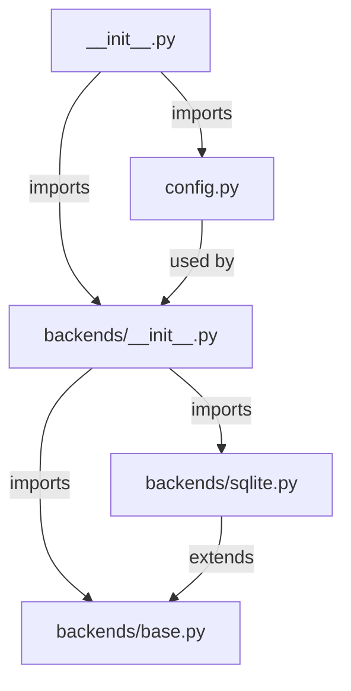
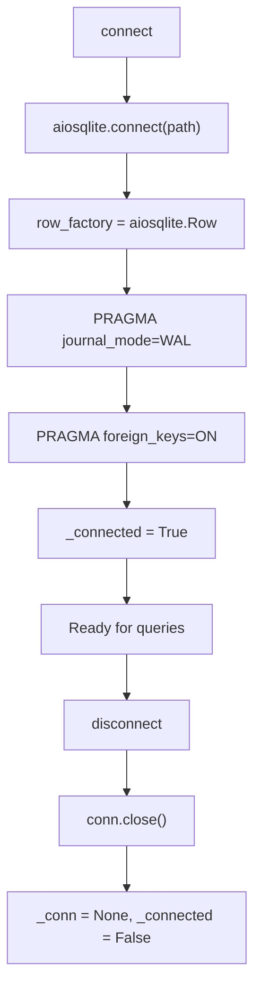
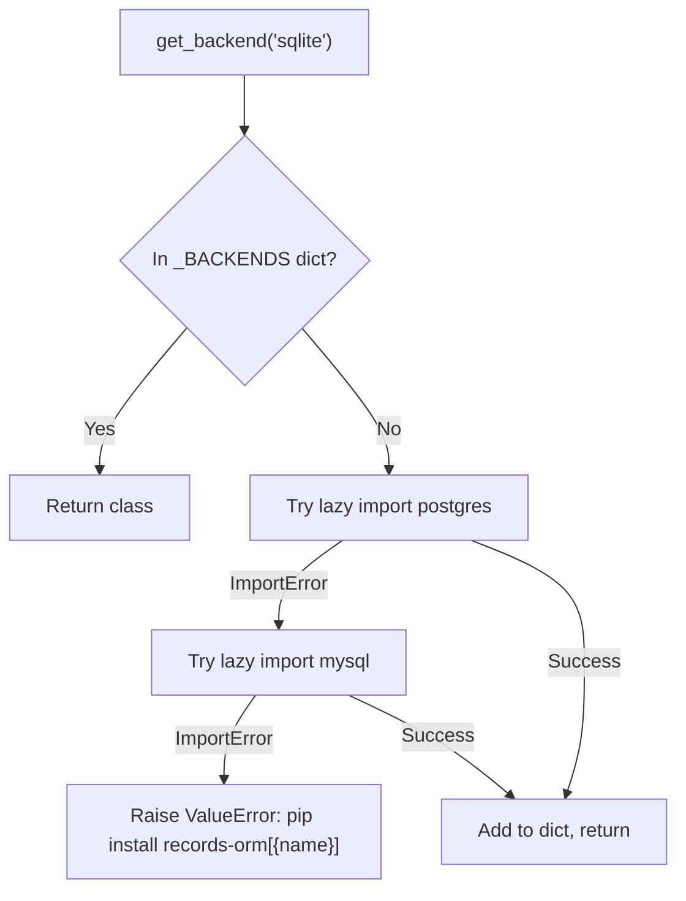
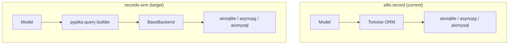

> **Package**: `records-orm` v0.1.0
> **Repository**: https://github.com/sillohq/records-orm
> **Source root**: `records-orm/records_orm/`
> **Status**: Backend abstraction layer implemented; Model/QuerySet/Fields planned

---

## 1. Overview

`records-orm` is a standalone async Python ORM with migrations, powered by
pypika.  It is the successor to `sillo.record` (which wraps Tortoise ORM),
designed to be independently usable outside of Sillo.

```
"A standalone async Python ORM with migrations, powered by pypika."
```

### Current State (v0.1.0)

Only the **backend abstraction layer** and **configuration** are implemented:

| Component | Status |
|---|---|
| `DatabaseConfig` | Complete |
| `BaseBackend` ABC | Complete (13 abstract methods) |
| `ColumnInfo` / `IndexInfo` | Complete |
| `SQLiteBackend` | Complete (aiosqlite, WAL, transactions, savepoints) |
| `get_backend` factory | Complete |
| `Model` | Planned |
| `QuerySet` | Planned |
| `Fields` (18 types) | Planned |
| `Migrations` | Planned |
| `Transactions` | Planned |
| `DatabaseManager` | Planned |
| `CLI` | Planned |
| `pypika query builder` | Planned |

### Dependencies

| Dependency | Type | Purpose |
|---|---|---|
| `pypika` | `>=0.48` (core) | SQL query builder |
| `aiosqlite` | `>=0.19.0` (sqlite extra) | Async SQLite driver |
| `asyncpg` | `>=0.27.0` (postgres extra) | Async PostgreSQL driver |
| `aiomysql` | `>=0.1.0` (mysql extra) | Async MySQL driver |
| `python-ulid` | `>=2.0.0` (ulid extra) | ULID generation |
| `pydantic` | `>=2.0` (pydantic extra) | Schema validation |

---

## 2. Package Structure

```
records-orm/
├── pyproject.toml
├── database/
│   └── migrations/          # Empty (template for user projects)
├── tests/                   # Empty (tests planned)
└── records_orm/
    ├── __init__.py          # Public API, __version__ = "0.1.0"
    ├── config.py            # DatabaseConfig, DatabaseBackend
    └── backends/
        ├── __init__.py      # get_backend factory
        ├── base.py          # BaseBackend ABC, ColumnInfo, IndexInfo
        └── sqlite.py        # SQLiteBackend
```



**File paths (absolute)**:

| Module | Path |
|---|---|
| `__init__` | `/Users/admin/sillo.build/records-orm/records_orm/__init__.py` |
| `config` | `/Users/admin/sillo.build/records-orm/records_orm/config.py` |
| `backends/__init__` | `/Users/admin/sillo.build/records-orm/records_orm/backends/__init__.py` |
| `backends/base` | `/Users/admin/sillo.build/records-orm/records_orm/backends/base.py` |
| `backends/sqlite` | `/Users/admin/sillo.build/records-orm/records_orm/backends/sqlite.py` |

---

## 3. DatabaseConfig

**Source**: `/Users/admin/sillo.build/records-orm/records_orm/config.py` (108 lines)

```python
@dataclass
class DatabaseConfig:
    url: str = field(default_factory=lambda: os.getenv("DATABASE_URL", "sqlite://:memory:"))
    backend: DatabaseBackend = DatabaseBackend.SQLITE
    pool_size: int = field(default_factory=lambda: int(os.getenv("DB_POOL_SIZE", "5")))
    max_overflow: int = field(default_factory=lambda: int(os.getenv("DB_MAX_OVERFLOW", "10")))
    echo: bool = field(default_factory=lambda: os.getenv("DB_ECHO", "").lower() == "true")
    ssl: bool = field(default_factory=lambda: os.getenv("DB_SSL", "").lower() == "true")
    timezone: str = field(default_factory=lambda: os.getenv("DB_TIMEZONE", "UTC"))
    charset: str = "utf8mb4"
    ssl_ca: str | None = field(default_factory=lambda: os.getenv("DB_SSL_CA"))
    ssl_cert: str | None = field(default_factory=lambda: os.getenv("DB_SSL_CERT"))
    ssl_key: str | None = field(default_factory=lambda: os.getenv("DB_SSL_KEY"))
    generate_schemas: bool = field(default_factory=lambda: os.getenv("DB_GENERATE_SCHEMAS", "").lower() == "true")
```

### Fields

| Field | Type | Default / Env Var | Purpose |
|---|---|---|---|
| `url` | `str` | `DATABASE_URL` or `"sqlite://:memory:"` | Connection URL |
| `backend` | `DatabaseBackend` | `SQLITE` (auto-detected) | Database engine |
| `pool_size` | `int` | `DB_POOL_SIZE` or `5` | Connection pool size |
| `max_overflow` | `int` | `DB_MAX_OVERFLOW` or `10` | Overflow connections |
| `echo` | `bool` | `DB_ECHO` or `false` | Log SQL queries |
| `ssl` | `bool` | `DB_SSL` or `false` | Enable SSL |
| `timezone` | `str` | `DB_TIMEZONE` or `"UTC"` | Database timezone |
| `charset` | `str` | `"utf8mb4"` | Character set |
| `ssl_ca` | `str \| None` | `DB_SSL_CA` | SSL CA certificate path |
| `ssl_cert` | `str \| None` | `DB_SSL_CERT` | SSL client certificate path |
| `ssl_key` | `str \| None` | `DB_SSL_KEY` | SSL client key path |
| `generate_schemas` | `bool` | `DB_GENERATE_SCHEMAS` or `false` | Auto-create tables |

### __post_init__

Auto-detects backend from URL prefix:

| URL Prefix | Backend |
|---|---|
| `postgres` / `postgresql` | `POSTGRES` |
| `mysql` / `mariadb` | `MYSQL` |
| Anything else | `SQLITE` |

### Factory Methods

```python
@classmethod
def from_env(cls, *, prefix: str = "") -> DatabaseConfig
    # Reads {PREFIX}_DATABASE_URL or DATABASE_URL

@classmethod
def sqlite(cls, path: str = ":memory:") -> DatabaseConfig
    # URL: sqlite://{path}

@classmethod
def postgres(cls, database, password, *, user="postgres",
             host="localhost", port=5432) -> DatabaseConfig
    # URL: postgresql://{user}:{password}@{host}:{port}/{database}

@classmethod
def mysql(cls, database, password, *, user="root",
          host="localhost", port=3306) -> DatabaseConfig
    # URL: mysql://{user}:{password}@{host}:{port}/{database}
```

### to_dict

```python
def to_dict(self) -> dict[str, Any]
    # Serializes config to dict, with backend as its string value
```

---

## 4. DatabaseBackend Enum

**Source**: `/Users/admin/sillo.build/records-orm/records_orm/config.py`

```python
class DatabaseBackend(Enum):
    SQLITE = "sqlite"
    POSTGRES = "postgres"
    MYSQL = "mysql"
```

Used for backend detection and dispatching.  The `__post_init__` method on
`DatabaseConfig` sets this automatically from the URL.

---

## 5. BaseBackend ABC

**Source**: `/Users/admin/sillo.build/records-orm/records_orm/backends/base.py` (151 lines)

```python
class BaseBackend(ABC):
    def __init__(self, url: str, **kwargs: Any):
        self.url = url
        self.kwargs = kwargs
        self._pool = None
        self._connected = False
```

### Abstract Methods (13 Total)

| Method | Signature | Purpose |
|---|---|---|
| `connect` | `async def connect(self) -> None` | Open the connection pool |
| `disconnect` | `async def disconnect(self) -> None` | Close the connection pool |
| `execute` | `async def execute(self, sql: str, params: list \| None = None) -> None` | Execute a statement that returns no rows |
| `fetch_one` | `async def fetch_one(self, sql, params) -> dict \| None` | Fetch a single row as a dict |
| `fetch_all` | `async def fetch_all(self, sql, params) -> list[dict]` | Fetch all rows as a list of dicts |
| `fetch_val` | `async def fetch_val(self, sql, params) -> Any` | Fetch a single scalar value |
| `begin` | `async def begin(self) -> Any` | Begin a transaction, return a handle |
| `placeholder` | `def placeholder(self, index: int) -> str` | Parameter placeholder for position |
| `introspect_tables` | `async def introspect_tables(self) -> dict[str, list[ColumnInfo]]` | All tables and their columns |
| `introspect_indexes` | `async def introspect_indexes(self, table: str) -> list[IndexInfo]` | All indexes for a table |
| `table_exists` | `async def table_exists(self, table: str) -> bool` | Check whether a table exists |
| `auto_increment_sql` | `def auto_increment_sql(self) -> str` | SQL fragment for auto-increment PKs |
| `json_type` | `def json_type(self) -> str` | SQL column type for JSON data |

### Concrete Property

```python
@property
def dialect(self) -> str:
    return self.__class__.__name__.lower().replace("backend", "")
```

Returns `"sqlite"`, `"postgres"`, or `"mysql"`.

### Placeholder Dialects

| Backend | `placeholder(0)` | `placeholder(1)` |
|---|---|---|
| SQLite | `?` | `?` |
| PostgreSQL | `$1` | `$2` |
| MySQL | `%s` | `%s` |

---

## 6. ColumnInfo & IndexInfo

**Source**: `/Users/admin/sillo.build/records-orm/records_orm/backends/base.py`

### ColumnInfo

```python
class ColumnInfo:
    __slots__ = ("name", "type", "nullable", "default", "primary_key",
                 "auto_increment", "unique")

    def __init__(self, name, type, nullable=True, default=None,
                 primary_key=False, auto_increment=False, unique=False)
```

| Slot | Type | Default | Purpose |
|---|---|---|---|
| `name` | `str` | (required) | Column name |
| `type` | `str` | (required) | SQL type (e.g. `"TEXT"`, `"INTEGER"`) |
| `nullable` | `bool` | `True` | Whether NULL is allowed |
| `default` | `str \| None` | `None` | Default value expression |
| `primary_key` | `bool` | `False` | Whether this is a primary key |
| `auto_increment` | `bool` | `False` | Whether this auto-increments |
| `unique` | `bool` | `False` | Whether this has a unique constraint |

### IndexInfo

```python
class IndexInfo:
    __slots__ = ("name", "table", "columns", "unique")

    def __init__(self, name, table, columns: list[str], unique=False)
```

| Slot | Type | Purpose |
|---|---|---|
| `name` | `str` | Index name |
| `table` | `str` | Table the index belongs to |
| `columns` | `list[str]` | Column names in the index |
| `unique` | `bool` | Whether this is a unique index |

---

## 7. SQLiteBackend

**Source**: `/Users/admin/sillo.build/records-orm/records_orm/backends/sqlite.py` (184 lines)

```python
class SQLiteBackend(BaseBackend):
    def __init__(self, url: str, **kwargs):
        super().__init__(url, **kwargs)
        self._path = url.replace("sqlite://", "").replace("file:", "")
        if not self._path or self._path == ":memory:":
            self._path = ":memory:"
        self._conn: aiosqlite.Connection | None = None
```

### Connection Lifecycle



### Method Implementations

| Method | Implementation |
|---|---|
| `connect` | `aiosqlite.connect(path)`, set `row_factory`, PRAGMAs |
| `disconnect` | Close connection, set `_connected = False` |
| `execute` | `conn.execute(sql, params)` then `commit()` |
| `fetch_one` | Execute, `fetchone()`, return `dict(row)` or `None` |
| `fetch_all` | Execute, `fetchall()`, return `[dict(r) for r in rows]` |
| `fetch_val` | Execute, `fetchone()`, return `list(row)[0]` or `None` |
| `begin` | Return `_TransactionHandle(conn)` |
| `placeholder` | Always `"?"` |
| `introspect_tables` | Query `sqlite_master WHERE type='table'` |
| `introspect_indexes` | `PRAGMA index_list` + `PRAGMA index_info` |
| `table_exists` | Query `sqlite_master WHERE type='table' AND name=?` |
| `auto_increment_sql` | `"INTEGER PRIMARY KEY AUTOINCREMENT"` |
| `json_type` | `"TEXT"` (SQLite has no native JSON type) |

### Transaction Handle

```python
class _TransactionHandle:
    def __init__(self, conn: aiosqlite.Connection)
    async def __aenter__(self) -> Self     # BEGIN
    async def __aexit__(self, exc, ...)    # COMMIT or ROLLBACK
    def savepoint(self) -> _SavepointHandle
```

### Savepoint Handle

```python
class _SavepointHandle:
    def __init__(self, conn, name, parent)
    async def __aenter__(self) -> Self     # SAVEPOINT name
    async def __aexit__(self, exc, ...)    # RELEASE or ROLLBACK TO SAVEPOINT
    def savepoint(self) -> _SavepointHandle  # Nested savepoints
```

Savepoints are named `sp_0`, `sp_1`, `sp_2`, etc.  Each `__aexit__`:
- On exception: `ROLLBACK TO SAVEPOINT sp_N`.
- On success: `RELEASE SAVEPOINT sp_N`.
- Decrements parent's depth counter.

### Schema Introspection

```python
async def _introspect_columns(self, table: str) -> list[ColumnInfo]
```

Uses `PRAGMA table_info('{table}')` to build `ColumnInfo` objects.
Auto-increment detected when `pk` is true AND type contains `"INTEGER"`.

---

## 8. get_backend Factory

**Source**: `/Users/admin/sillo.build/records-orm/records_orm/backends/__init__.py` (31 lines)

```python
def get_backend(name: str) -> type[BaseBackend]:
```

### Logic



### Registered Backends

| Name | Class | Extra Required |
|---|---|---|
| `sqlite` | `SQLiteBackend` | `records-orm[sqlite]` |
| `postgres` | `PostgresBackend` (lazy) | `records-orm[postgres]` |
| `mysql` | `MySQLBackend` (lazy) | `records-orm[mysql]` |

### Usage Pattern

```python
backend_cls = get_backend("sqlite")
backend = backend_cls("sqlite://:memory:")
await backend.connect()
```

---

## 9. Exported API

**Source**: `/Users/admin/sillo.build/records-orm/records_orm/__init__.py` (64 lines)

```python
__version__ = "0.1.0"
```

### `__all__` (26 Symbols)

```python
__all__ = [
    # Config
    "DatabaseBackend", "DatabaseConfig",
    # Connection (planned)
    "DatabaseManager",
    # Fields (planned)
    "AutoIncrementField", "BooleanField", "CharField", "CreatedAtField",
    "DateField", "DateTimeField", "DecimalField", "FloatField",
    "ForeignKey", "IntField", "JSONField", "ManyToMany",
    "PasswordField", "SlugField", "SoftDeleteField", "TextField",
    "ULIDField", "UpdatedAtField",
    # Migrations (planned)
    "init", "make", "migrate", "plan", "rollback", "sql",
    # Model (planned)
    "Model",
    # QuerySet (planned)
    "QuerySet",
    # Transactions (planned)
    "TransactionContext", "transaction",
]
```

### Imports That Work Today

| Symbol | Source | Status |
|---|---|---|
| `DatabaseBackend` | `config.py` | Working |
| `DatabaseConfig` | `config.py` | Working |

### Imports That Raise ImportError

All other 24 symbols reference modules that do not exist on disk.  Importing
them will raise `ImportError` at runtime.

---

## 10. Relationship to sillo.record

`sillo.record` (in `core/sillo/record/`) is a fully implemented Eloquent-style
convenience layer wrapping Tortoise ORM.  `records-orm` is the standalone
replacement.

### Architecture Comparison



### Key Differences

| Aspect | sillo.record | records-orm |
|---|---|---|
| Query builder | Tortoise ORM internals | pypika |
| Backend enum | 4 values (includes MARIADB) | 3 values |
| `pool_recycle` field | Present | Not present |
| `generate_schemas` default | `true` | `false` |
| MariaDB detection | Yes (in `__post_init__`) | No (falls to MYSQL) |
| Type annotations | `Annotated[..., Doc(...)]` | Plain |
| Status | Fully implemented | Backend layer only |

### sillo.record Module Map (22 Files)

| Module | Purpose |
|---|---|
| `__init__.py` | Public API (37 `__all__` symbols) |
| `_bridge.py` | Bridge layer |
| `casting.py` | `HasCasts` mixin, `CastRegistry` |
| `collection.py` | `Collection` class |
| `commands/` | Migration commands (`init`, `make`, `migrate`, `plan`, `rollback`) |
| `config.py` | `DatabaseConfig` (Tortoise-based) |
| `console.py` | CLI console commands |
| `events.py` | `HasEvents`, `ModelObserver` |
| `exceptions.py` | Exception handlers |
| `factories.py` | `Factory`, `FactoryBuilder` |
| `fields.py` | Custom fields (`CreatedAtField`, `SlugField`, etc.) |
| `helpers.py` | `FixtureLoader`, `MigrationHelper`, `Seeder` |
| `logging.py` | `QueryLogEntry`, `QueryLogger` |
| `manager.py` | `DatabaseManager`, `setup_record` |
| `mixins/` | `TimestampsMixin`, `SoftDeletesMixin`, etc. |
| `models.py` | `Model` |
| `pagination.py` | `TortoiseDataHandler` |
| `pydantic.py` | `pydantic_model_from_tortoise` |
| `queries.py` | `paginate`, `count_by`, `explain`, etc. |
| `scopes.py` | `HasScopes`, `RecordManager`, `RecordQuerySet`, `ScopeRegistry` |
| `transactions.py` | `TransactionContext`, `begin`, `commit`, `rollback` |

### setup_record (sillo.record)

```python
def setup_record(app, config, *, model_modules=None) -> DatabaseManager
```

Stores the `DatabaseManager` in `app.state["record"]` and registers
startup/shutdown hooks.  This is the integration point between Sillo's
application lifecycle and the database.

---

## 11. Planned Modules

### 11.1 Fields (18 Types)

| Field | Purpose |
|---|---|
| `AutoIncrementField` | Auto-incrementing integer PK |
| `BooleanField` | True/False |
| `CharField` | Fixed-length string |
| `CreatedAtField` | Auto-set on creation |
| `DateField` | Date only |
| `DateTimeField` | Date + time |
| `DecimalField` | Fixed-precision decimal |
| `FloatField` | Floating point |
| `ForeignKey` | Many-to-one relationship |
| `IntField` | Integer |
| `JSONField` | JSON document |
| `ManyToMany` | Many-to-many relationship |
| `PasswordField` | Hashed password |
| `SlugField` | URL-safe slug |
| `SoftDeleteField` | Soft delete timestamp |
| `TextField` | Variable-length text |
| `ULIDField` | ULID primary key |
| `UpdatedAtField` | Auto-set on update |

### 11.2 Model

The `Model` class will provide:
- Declarative field definitions.
- Table name derivation from class name.
- CRUD operations via QuerySet.
- Schema introspection via `BaseBackend`.

### 11.3 QuerySet

The `QuerySet` class will provide:
- Fluent query building via pypika.
- Filtering, ordering, limiting.
- Aggregation (count, sum, avg).
- Lazy evaluation.

### 11.4 Migrations

CLI commands: `init`, `make`, `migrate`, `plan`, `rollback`, `sql`.

### 11.5 Transactions

```python
async with transaction(config) as tx:
    await tx.execute("INSERT INTO ...")
    await tx.execute("UPDATE ...")
```

### 11.6 DatabaseManager

Connection lifecycle management with:
- Connection pooling.
- Health checks.
- Startup/shutdown hooks.

---

## 12. Testing Strategy

The `tests/` directory is currently empty.  The planned testing approach:

### Backend Tests

Each backend implementation will be tested against:
- Connection lifecycle (connect/disconnect).
- CRUD operations (execute, fetch_one, fetch_all, fetch_val).
- Transaction management (begin, commit, rollback, savepoints).
- Schema introspection (tables, columns, indexes).
- Error handling (connection failures, syntax errors).

### Integration Tests

- Full Model CRUD cycle.
- Migration up/down.
- Transaction isolation.

### Test Infrastructure

- SQLite tests: in-memory database (`:memory:`).
- PostgreSQL/MySQL tests: Docker containers (CI only).

---

*End of document 45-RECORDS-ORM.md*
