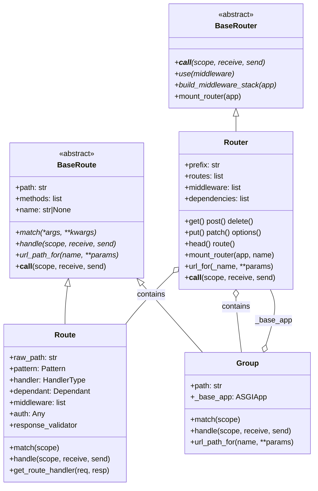
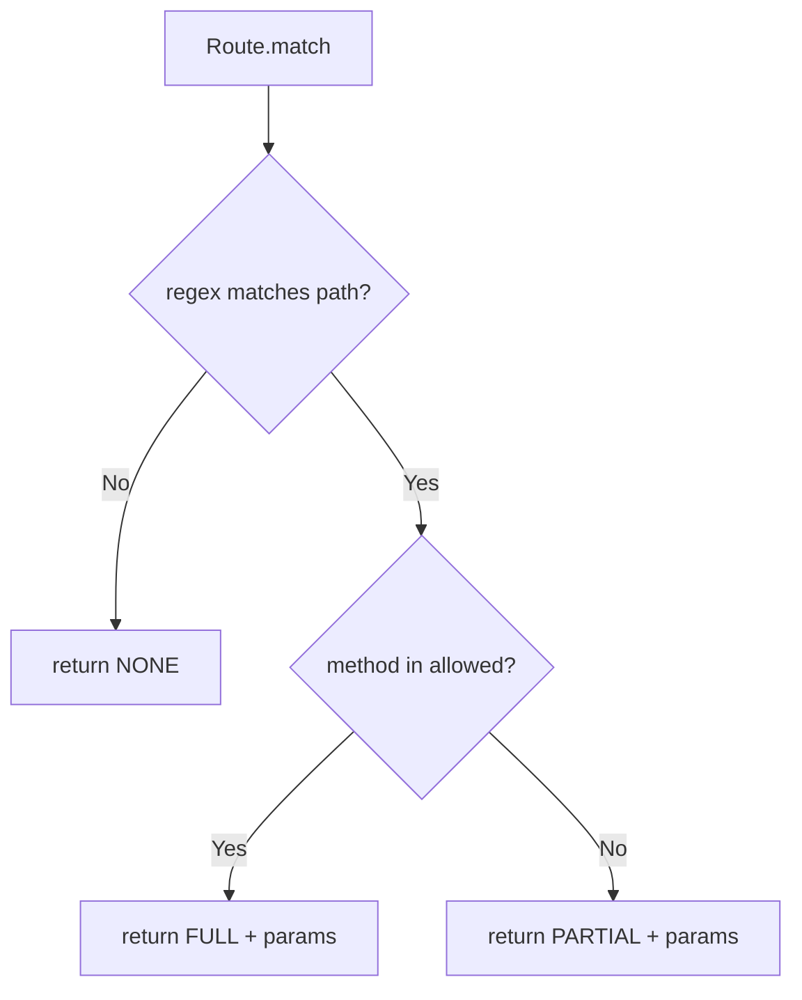
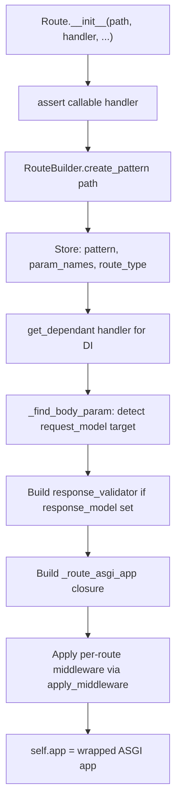
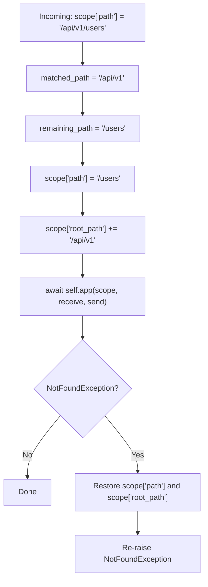
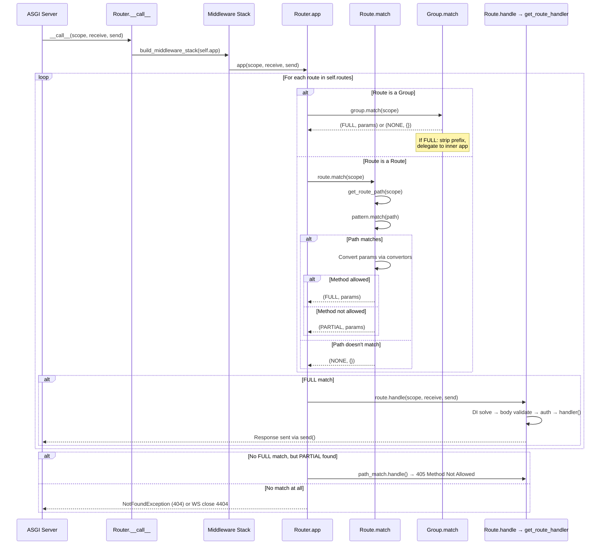
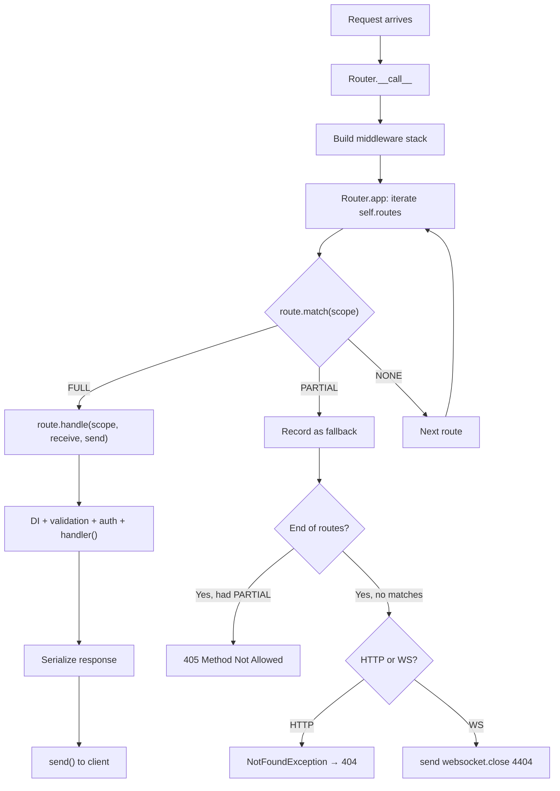
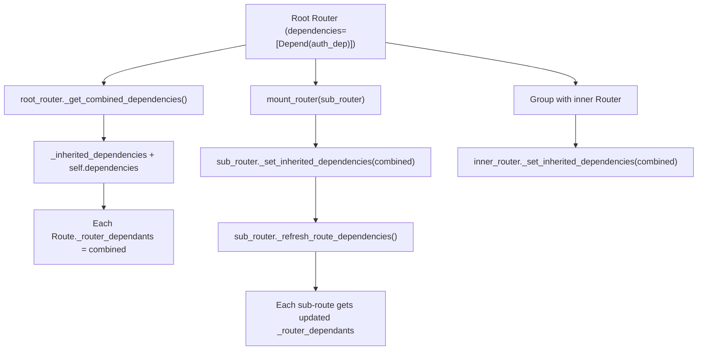
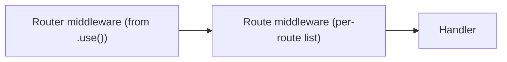
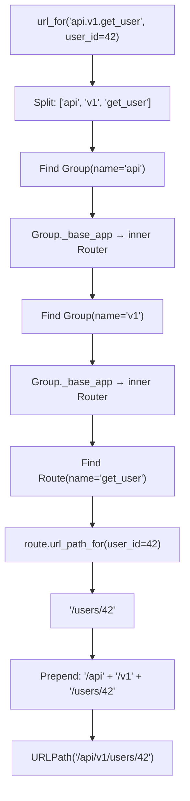

> **Audience**: Framework engineers maintaining or extending the sillo routing subsystem.
> **Source of truth**: The files listed below. When the code and this document disagree, the code wins.

## Quick-reference: source files

| Concern | File |
|---------|------|
| `PARAM_REGEX`, `RouteType`, `compile_path`, `RoutePattern`, `RouteBuilder` | `core/sillo/route_builder.py` |
| `BaseRoute` ABC, `BaseRouter` ABC | `core/sillo/core/routing/base.py` |
| `Route`, `Router` (verb decorators, dispatch, `url_for`) | `core/sillo/core/routing/router.py` |
| `Group` (prefix stripping, nested mount) | `core/sillo/core/routing/grouping.py` |
| `MatchStatus` enum | `core/sillo/core/routing/_utils.py` |
| `Convertor` hierarchy, `CONVERTOR_TYPES` | `core/sillo/core/converters.py` |
| Public re-exports | `core/sillo/core/routing/__init__.py` |

---

## 1. Architecture Overview

The routing subsystem is split into two logical layers:

```
┌───────────────────────────────────────────────────────────────┐
│                    route_builder.py                            │
│   PARAM_REGEX → compile_path → RoutePattern / RouteBuilder    │
│              (pure path compilation, no ASGI)                  │
└────────────────────────────┬──────────────────────────────────┘
                             │ produces RoutePattern
                             ▼
┌───────────────────────────────────────────────────────────────┐
│              core/routing/ package                             │
│   BaseRouter ─► Router          BaseRoute ─► Route             │
│                            ─► Group                            │
│   _utils.MatchStatus   converters.Convertor hierarchy          │
│              (ASGI dispatch, DI, middleware, auth)              │
└───────────────────────────────────────────────────────────────┘
```

**Key design decisions**:

- Path compilation is **pure**: no ASGI types leak into `route_builder.py`.
  This makes it independently testable.
- `MatchStatus` is a tri-state enum (`NONE=0`, `PARTIAL=1`, `FULL=2`) that enables 405 Method Not Allowed without a second pass.
- `Group` is a `BaseRoute`, not a `Router`. This lets it participate in the same linear scan as individual routes.
- Dependency injection propagates **downward** through `mount_router` / `Group` hierarchies via `_set_inherited_dependencies`.

### Class hierarchy



---

## 2. MatchStatus: the tri-state match result

**File**: `core/sillo/core/routing/_utils.py`

```python
class MatchStatus(Enum):
    NONE = 0      # Path does not match at all
    PARTIAL = 1   # Path matches but HTTP method does not
    FULL = 2      # Path AND method both match
```

### Why three states?

A naive boolean match would force the router to do a second pass to decide between 404 and 405. With `PARTIAL`, the router records the first partial match during its single linear scan and uses it to produce a 405 if no `FULL` match is found.



### `get_route_path` helper

```python
# core/sillo/core/routing/_utils.py
def get_route_path(scope: Scope) -> str:
    path: str = scope["path"]
    root_path = scope.get("root_path", "")
    if not root_path:
        return path
    if not path.startswith(root_path):
        return path
    if path == root_path:
        return ""
    return path.removeprefix(root_path)
```

This strips the `root_path` prefix so that routers mounted under sub-paths match correctly. A request to `/api/users` where `root_path="/api"` yields a match path of `/users`.

---

## 3. Convertors: typed path parameters

**File**: `core/sillo/core/converters.py`

Convertors bridge URL path segments and Python types. Each convertor defines:

| Attribute | Purpose |
|-----------|---------|
| `regex` (class var) | Pattern embedded into the compiled route regex |
| `convert(str) → T` | Parse a matched segment at request time |
| `to_string(T) → str` | Serialize back for `url_for` generation |

### Built-in convertor registry

```python
# core/sillo/core/converters.py, line 519
CONVERTOR_TYPES: dict[str, Convertor] = {
    "str":   StringConvertor(),    # regex: [^/]+
    "path":  PathConvertor(),      # regex: .*
    "int":   IntegerConvertor(),   # regex: [0-9]+
    "float": FloatConvertor(),     # regex: [0-9]+(\.[0-9]+)?
    "uuid":  UUIDConvertor(),      # regex: [0-9a-fA-F]{8}-?...-?[0-9a-fA-F]{12}
    "slug":  SlugConvertor(),      # regex: [a-z0-9]+(?:-[a-z0-9]+)*
}
```

### Detailed convertor table

| Name | Type | Regex | Notes |
|------|------|-------|-------|
| `str` | `str` | `[^/]+` | Default if no type specified. Single segment only. |
| `path` | `str` | `.*` | Greedy: matches across `/`. Use last in a pattern. |
| `int` | `int` | `[0-9]+` | Non-negative only. `to_string` rejects negatives. |
| `float` | `float` | `[0-9]+(\.[0-9]+)?` | Non-negative. `to_string` strips trailing zeros. |
| `uuid` | `uuid.UUID` | 8-4-4-4-12 hex | Hyphens optional in matching. |
| `slug` | `str` | `[a-z0-9]+(?:-[a-z0-9]+)*` | Lowercase, hyphens between words. Strict validation. |

### Extending with custom convertors

```python
from sillo.core.converters import Convertor, register_url_convertor

class HexConvertor(Convertor[int]):
    regex = r"[0-9a-fA-F]+"

    def convert(self, value: str) -> int:
        return int(value, 16)

    def to_string(self, value: int) -> str:
        assert value >= 0
        return hex(value)[2:]  # strip "0x" prefix

register_url_convertor("hex", HexConvertor())

# Now usable in paths:
# router.get("/memory/{addr:hex}", handler)
```

> **Warning**: Register custom convertors **before** defining routes that reference them. The `compile_path` function asserts against `CONVERTOR_TYPES` at route-definition time, not at request time.

---

## 4. PARAM_REGEX and the compile_path Algorithm

**File**: `core/sillo/route_builder.py`

### PARAM_REGEX

```python
# core/sillo/route_builder.py, line 9
PARAM_REGEX = re.compile(
    "{([a-zA-Z_][a-zA-Z0-9_]*)(:[a-zA-Z_][a-zA-Z0-9_]*)?}"
)
```

This regex captures two groups from each `{...}` placeholder:

| Group | Content | Example match for `{user_id:int}` |
|-------|---------|-----------------------------------|
| 1 | Parameter name | `user_id` |
| 2 (optional) | `:convertor_type` | `:int` |

If group 2 is absent, `compile_path` defaults the convertor to `"str"` via `match.groups("str")`.

### The `compile_path` algorithm

```mermaid
flowchart TD
    A[Input: path string] --> B[Initialize: path_regex='^', path_format='', idx=0]
    B --> C[PARAM_REGEX.finditer]
    C --> D{For each match}
    D --> E[Extract param_name and convertor_type]
    E --> F[Assert convertor_type in CONVERTOR_TYPES]
    F --> G[Append escaped literal between idx and match.start to path_regex]
    G --> H["Append named group (?P<name>regex) to path_regex"]
    H --> I["Append {name} placeholder to path_format"]
    I --> J[Track param_name in param_convertors and param_names]
    J --> K{Duplicate param name?}
    K -- Yes --> L[Raise ValueError]
    K -- No --> M[idx = match.end()]
    M --> D
    D -- No more matches --> N[Append remaining literal to path_regex + '$']
    N --> O["Return (re.compile(path_regex), path_format, param_convertors, param_names)"]
```

### Step-by-step walkthrough

Given the input path `/users/{user_id:int}/posts/{post_slug}`:

1. **idx = 0**. `PARAM_REGEX.finditer` yields two matches.
2. **First match** at positions covering `{user_id:int}`:
   - `param_name = "user_id"`, `convertor_type = "int"`.
   - Look up `CONVERTOR_TYPES["int"]` → `IntegerConvertor` (regex: `[0-9]+`).
   - Literal before match: `/users/` → escaped and appended.
   - Named group: `(?P<user_id>[0-9]+)` appended to `path_regex`.
   - `path_format` gets `/users/{user_id}`.
   - `idx` advances past `}`.
3. **Second match** at `{post_slug}`:
   - `param_name = "post_slug"`, convertor defaults to `"str"`.
   - Literal: `/posts/` appended.
   - Named group: `(?P<post_slug>[^/]+)`.
   - `path_format` gets `/posts/{post_slug}`.
4. **After loop**: Remaining literal `/` appended with `$` anchor.

**Result**:
- `path_regex`: `^\/users\/(?P<user_id>[0-9]+)\/posts\/(?P<post_slug>[^/]+)\/$`
- `path_format`: `/users/{user_id}/posts/{post_slug}/`
- `param_convertors`: `{"user_id": IntegerConvertor, "post_slug": StringConvertor}`
- `param_names`: `["user_id", "post_slug"]`

### Host pattern detection

```python
is_host = not path.startswith("/")
```

If the path does not start with `/`, it is treated as a host pattern (e.g., `{subdomain}.example.com`). The final literal is split on `:` to strip a port number before regex escaping.

### Error handling

| Condition | Exception |
|-----------|-----------|
| Unknown convertor type | `AssertionError: Unknown path convertor 'foo'` |
| Duplicate parameter name | `ValueError: Duplicated param name(s) user_id at path ...` |

---

## 5. RoutePattern and RouteBuilder

**File**: `core/sillo/route_builder.py`

### RoutePattern dataclass

```python
@dataclass
class RoutePattern:
    pattern: Pattern[str]          # compiled regex
    raw_path: str                  # original "/users/{user_id:int}"
    param_names: list[str]         # ["user_id", "post_slug"]
    route_type: RouteType          # the normalized format string
    convertor: dict[str, Convertor]  # {"user_id": IntegerConvertor(), ...}
```

The `route_type` field stores the **normalized path format** (e.g.
`/users/{user_id}/posts/{post_slug}`), not a `RouteType` enum value. This is a
naming legacy. It is the string format with type annotations stripped.

### RouteBuilder factory

```python
class RouteBuilder:
    @staticmethod
    def create_pattern(path: str) -> RoutePattern:
        path_regex, path_format, param_convertors, param_names = compile_path(path)
        return RoutePattern(
            pattern=path_regex,
            raw_path=path,
            param_names=param_names,
            route_type=path_format,
            convertor=param_convertors,
        )
```

`RouteBuilder.create_pattern` is the single entry point that `Route.__init__` and `Group.__init__` call. It wraps `compile_path` and bundles the results into a `RoutePattern` dataclass.

---

## 6. RouteType Enum

**File**: `core/sillo/route_builder.py`, line 12

```python
class RouteType(Enum):
    REGEX = "regex"
    PATH = "path"
    WILDCARD = "wildcard"
```

| Value | Meaning |
|-------|---------|
| `REGEX` | Pattern uses custom regex constraints |
| `PATH` | Standard curly-brace `{param:type}` path pattern |
| `WILDCARD` | Catch-all matching remaining path segments |

> **Note**: The current `compile_path` implementation always returns the path format string as the second element of its tuple. The `RouteType` enum exists for future use and documentation clarity but is not currently assigned during compilation. The `RoutePattern.route_type` field stores the format string.

---

## 7. BaseRoute ABC

**File**: `core/sillo/core/routing/base.py`

```python
class BaseRoute(ABC):
    def __init__(self, path, methods=[], name=None, **kwargs):
        self.path = path
        self.methods = methods
        self.name = name

    @abstractmethod
    def match(self, *args, **kwargs) -> Any: ...

    @abstractmethod
    async def handle(self, scope, receive, send) -> None: ...

    @abstractmethod
    def url_path_for(self, name, **path_params) -> URLPath: ...

    async def __call__(self, scope, receive, send):
        # Delegates to handle by default
        ...
```

### Contract

| Method | Responsibility |
|--------|---------------|
| `match()` | Return `(MatchStatus, params)` for a given request |
| `handle()` | Execute the request: called only after a `FULL` match |
| `url_path_for()` | Reverse URL generation for this route |
| `__call__()` | Makes the route callable as an ASGI app; delegates to `handle` |

Both `Route` and `Group` inherit from `BaseRoute`. The `match` method on `BaseRoute` accepts `*args, **kwargs` (rather than a fixed `(scope,)`) to allow `Group` to use its own signature, though in practice all concrete implementations accept a `Scope`.

---

## 8. BaseRouter ABC

**File**: `core/sillo/core/routing/base.py`

```python
class BaseRouter(ABC):
    @abstractmethod
    async def __call__(self, scope, receive, send) -> None: ...

    def use(self, middleware) -> None: ...

    def build_middleware_stack(self, app: ASGIApp) -> ASGIApp: ...

    def mount_router(self, app): ...
```

`BaseRouter` is thinner than `BaseRoute`. It defines the ASGI callable interface plus middleware hooks. Only `Router` inherits from it.

---

## 9. Route: the concrete HTTP route

**File**: `core/sillo/core/routing/router.py`, line 123

### Initialization

`Route.__init__` performs a lot of work:



### Path compilation

```python
# router.py, line 323
self.route_info = RouteBuilder.create_pattern(path)
self.pattern: Pattern[str] = self.route_info.pattern
self.param_names = self.route_info.param_names
self.route_type = self.route_info.route_type
```

The `RoutePattern` produced by `RouteBuilder` is stored on the route instance. The compiled `self.pattern` regex is what `Route.match` uses at request time.

### Match method

```python
def match(self, scope: Scope) -> tuple[MatchStatus, Any]:
    if scope.get("type") != "http":
        return MatchStatus.NONE, {}

    path = get_route_path(scope)
    method = scope["method"]
    match = self.pattern.match(path)

    if match:
        matched_params = match.groupdict()
        for key, value in matched_params.items():
            matched_params[key] = self.route_info.convertor[key].convert(value)

        is_method_allowed = method.upper() in self.methods
        if not is_method_allowed:
            return MatchStatus.PARTIAL, matched_params

        return MatchStatus.FULL, matched_params

    return MatchStatus.NONE, {}
```

**Key behaviors**:

1. Non-HTTP scopes (e.g., `websocket`) immediately return `NONE`.
2. `get_route_path` strips `root_path` before matching.
3. Matched string groups are **converted** via their convertor (e.g., `"42"` → `42`).
4. Path matches but wrong method → `PARTIAL` (enables 405).
5. `HEAD` is automatically added when `GET` is in `self.methods` (line 366 to
   367).

### Handle method

```python
async def handle(self, scope, receive, send):
    if self.methods and scope["method"] not in self.methods:
        response = JSONResponse(
            {"detail": "Method Not Allowed"},
            status_code=405,
            headers={"Allow": ", ".join(sorted(self.methods))},
        )
        return await response(scope, receive, send)

    await self.app(scope, receive, send)
```

The 405 response includes an `Allow` header listing the permitted methods, as required by RFC 7231.

### `get_route_handler`: the DI and auth pipeline

```python
async def get_route_handler(self, request, response, **kwargs):
    cleanup_callbacks = []
    injected = {}
    dependency_cache = {}

    # 1. Solve router-level dependencies
    for rd in self._router_dependants:
        sub_values = await solve_dependencies(rd, request, dependency_cache, cleanup_callbacks)
        if rd.call is not None:
            result = await _execute_dependency(rd, sub_values, cleanup_callbacks)
            if rd.use_cache and rd.cache_key:
                dependency_cache[rd.cache_key] = result

    # 2. Solve handler-level dependencies
    handler_values = await solve_dependencies(self.dependant, request, dependency_cache, cleanup_callbacks)
    injected.update(handler_values)

    # 3. Validate request body if request_model is set
    if self.request_model is not None:
        validated = await self._validate_body(request)
        request._validated_data = validated
        if self._validated_param_name:
            injected[self._validated_param_name] = validated

    # 4. Run auth gate
    if self.auth is not None:
        await self.auth.authenticate(request)

    # 5. Merge path params with injected values (injected wins)
    if injected:
        kwargs = {k: v for k, v in kwargs.items() if k not in injected}

    # 6. Call handler (async or sync)
    try:
        if is_async_callable(self.handler):
            return await self.handler(request, response, **kwargs, **injected)
        return await run_in_threadpool(self.handler, request, response, **kwargs, **injected)
    finally:
        for cleanup in reversed(cleanup_callbacks):
            result = cleanup()
            if inspect.isawaitable(result):
                await result
```

**Execution order**:
1. Router-level dependencies (inherited + local)
2. Handler-level dependencies
3. Request body validation
4. Auth gate (`auth.authenticate`)
5. Handler invocation

### `_find_body_param`: binding `request_model` to a handler parameter

When `request_model` is set, the framework needs to know which handler parameter receives the validated body. The algorithm:

1. Skip the first two parameters (`request`, `response`).
2. Skip parameters filled by DI (`Depend`, `ParameterExtractor`) or path params.
3. Of the remaining, prefer the **first parameter with no default** (Python forces these first).
4. Fall back to the third parameter if it has a default (legacy positional rule).

### URL path generation

```python
def url_path_for(self, name, **path_params) -> URLPath:
    if name != self.name:
        raise ValueError(...)

    required_params = set(self.param_names)
    provided_params = set(path_params.keys())
    if required_params != provided_params:
        raise ValueError(f"Missing: {required_params - provided_params}. "
                         f"Extra: {provided_params - required_params}")

    path = self.raw_path
    for param_name, param_value in path_params.items():
        path = re.sub(rf"\{{{param_name}(:[^}}]+)?}}", str(param_value), path)

    return URLPath(path=path, protocol="http")
```

The regex `\{param_name(:[^}]+)?}` matches both `{name}` and `{name:type}` placeholders, so `url_for` works regardless of whether the type annotation was included in the original path.

---

## 10. Router: the central dispatcher

**File**: `core/sillo/core/routing/router.py`, line 768

### Constructor

```python
class Router(BaseRouter):
    def __init__(
        self,
        prefix: str | None = None,
        routes: Sequence[BaseRoute] = [],
        tags: Sequence[str] | None = None,
        exclude_from_schema: bool = False,
        name: str | None = None,
        dependencies: list[Depend] | None = None,
        route_class: type[Route] = Route,
        strict_validation: bool = False,
    ):
```

| Parameter | Purpose |
|-----------|---------|
| `prefix` | Prepended to all route paths (e.g., `/api/v1`) |
| `routes` | Initial routes to register |
| `tags` | OpenAPI tags inherited by all routes |
| `exclude_from_schema` | Exclude all routes from OpenAPI |
| `name` | Used for nested `url_for` with dot notation |
| `dependencies` | Router-level DI dependencies |
| `route_class` | Custom `Route` subclass for all verb decorators |
| `strict_validation` | Propagated to every route created by decorators |

On init, the router validates the prefix (must start with `/`) and calls `_refresh_route_dependencies()` to propagate dependencies to all routes.

### The `__call__` / `app` dispatch pair

```python
async def __call__(self, scope, receive, send):
    app = self.build_middleware_stack(cast(ASGIApp, self.app))
    await app(scope, receive, send)

async def app(self, scope, receive, send):
    scope["app"] = self
    path_match = None
    path_match_params = {}

    for route in self.routes:
        match, matched_params = route.match(scope)
        if match == MatchStatus.FULL:
            scope["route_params"] = RouteParam(matched_params)
            await route.handle(scope, receive, send)
            return
        elif match == MatchStatus.PARTIAL and path_match is None:
            path_match = route
            path_match_params = matched_params

    if path_match is not None:
        scope["route_params"] = RouteParam(path_match_params)
        await path_match.handle(scope, receive, send)
        return

    if scope.get("type") == "http":
        raise NotFoundException
    else:
        await send({"type": "websocket.close", "code": 4404})
```

**Dispatch algorithm**:

1. Build the middleware stack (outermost middleware first).
2. Linear scan through `self.routes` in registration order.
3. First `FULL` match → dispatch immediately (return).
4. First `PARTIAL` match → record as fallback.
5. If no `FULL` match found, use the `PARTIAL` fallback (triggers 405).
6. If no match at all → `NotFoundException` (HTTP) or close frame 4404 (WebSocket).

> **Important**: Route registration order matters. More specific routes should be registered before catch-all routes.

### `add_route`: the route registration gateway

```python
def add_route(self, route=None, path=None, methods=..., handler=None, ...):
    # Build Route from kwargs if not provided
    if not route:
        route = Route(path=path, handler=handler, ...)

    # Non-Route base routes (Group, WebsocketRoute) appended directly
    if not isinstance(route, Route):
        self.routes.append(route)
        return

    # For Route instances: inherit tags, schema exclusion, dependencies
    if route.tags:
        route.tags = list(self.tags) + list(route.tags)
    else:
        route.tags = self.tags

    if self.exclude_from_schema:
        route.exclude_from_schema = True

    route._router_dependants = list(self._get_combined_dependencies())
    self.routes.append(route)
```

**Tag inheritance**: Router tags are **prepended** to route tags, so the route's tags come after. This means OpenAPI groups routes under router-level tags first, then route-specific tags.

**Dependency propagation**: `_get_combined_dependencies()` merges `_inherited_dependencies` (from parent routers) with `self.dependencies` (local). This merged list is set on each route's `_router_dependants`.

---

## 11. Group: prefix grouping and stripping

**File**: `core/sillo/core/routing/grouping.py`

### Overview

A `Group` is a `BaseRoute` that wraps an ASGI application (usually a `Router`) behind a path prefix. It matches any request whose path starts with the prefix, strips the prefix, and delegates to the inner app.

### Constructor

```python
class Group(BaseRoute):
    def __init__(
        self,
        path: str = "",
        app: ASGIApp | None = None,
        routes: list[BaseRoute] = [],
        name: str | None = None,
        *,
        middleware: list[Middleware] = [],
    ):
```

Key init logic:

```python
# 1. Normalize the path
self.path = path.rstrip("/")
self.raw_path = path

# 2. If no app provided, create a Router from routes
if app is not None:
    self._base_app = app
else:
    from .router import Router
    self._base_app = Router(routes=routes)

# 3. Wrap with middleware
self.app = self._base_app
for cls, args, kwargs in reversed(middleware):
    self.app = cls(self.app, *args, **kwargs)

# 4. Compile pattern with {path:path} suffix
self.route_info = RouteBuilder.create_pattern(
    self.path.rstrip("/") + "{path:path}"
)
self.pattern = self.route_info.pattern
```

The pattern `/api/v1` becomes `/api/v1{path:path}`, where `{path:path}` uses the `PathConvertor` (regex: `.*`) to match everything after the prefix.

### Match method

```python
def match(self, scope) -> tuple[MatchStatus, dict[str, Any]]:
    match = self.pattern.match(get_route_path(scope))
    if match:
        matched_params = match.groupdict()
        path_remainder = matched_params.pop("path", "")

        if path_remainder and not path_remainder.startswith("/"):
            path_remainder = "/" + path_remainder

        for key, value in matched_params.items():
            if value is not None:
                matched_params[key] = self.route_info.convertor[key].convert(value)

        return MatchStatus.FULL, matched_params

    return MatchStatus.NONE, {}
```

**Important**: `Group.match` only returns `FULL` or `NONE`. Never `PARTIAL`.
Groups always match the prefix, and the inner app handles method matching.

The `path` key is **popped** from `matched_params` before returning, so it doesn't leak into `scope["route_params"]`.

### Handle: prefix stripping

```python
async def handle(self, scope, receive, send):
    original_path = scope["path"]
    matched_path = self.path.rstrip("/")

    if original_path.startswith(matched_path):
        remaining_path = original_path[len(matched_path):] or "/"
        scope["path"] = remaining_path
        scope["root_path"] = scope.get("root_path", "") + matched_path

    try:
        await self.app(scope, receive, send)
    except NotFoundException:
        scope["path"] = original_path
        if "root_path" in scope:
            scope["root_path"] = scope["root_path"][:-len(matched_path)]
        raise
```

**Prefix stripping flow**:



The path restoration on `NotFoundException` is critical: it allows the parent router to continue scanning other routes after a Group's inner app fails to find a match.

### Routes property

```python
@property
def routes(self) -> list[BaseRoute]:
    return getattr(self._base_app, "routes", [])
```

This transparently exposes the inner app's routes for introspection and OpenAPI generation.

---

## 12. Request Dispatch Flow

The following diagram traces a request from the ASGI server through the full routing pipeline:



### Simplified flowchart



---

## 13. Dependency Injection in Routing

### How dependencies propagate



### Dependency resolution order in `get_route_handler`

1. **Router-level dependencies** (`self._router_dependants`): solved first, cached if `use_cache=True`.
2. **Handler-level dependencies** (`self.dependant`): solved next, sharing the same `dependency_cache`.
3. **Request body** (if `request_model`): validated and injected into the identified parameter.
4. **Auth gate** (if `auth`): called after DI and body validation.
5. **Handler invocation**: receives `request`, `response`, path params (`**kwargs`), and injected DI values (`**injected`).

If a path parameter name collides with a DI-injected name, the DI value wins:

```python
# router.py, line 653-654
if injected:
    kwargs = {k: v for k, v in kwargs.items() if k not in injected}
```

---

## 14. Per-route Middleware and Auth Gate

### Per-route middleware

Route-level middleware is applied in `Route.__init__` around the internal ASGI app:

```python
# router.py, line 418-443
def apply_middleware(app: ASGIApp) -> ASGIApp:
    middleware = []
    for mdw in self.middleware:
        middleware.append(wrap_middleware(mdw))
    for cls, args, kwargs in reversed(middleware):
        app = cls(app, *args, **kwargs)
    return app

self.app = apply_middleware(route_handler_as_asgi_app)
```

The first middleware in the list becomes the **outermost** wrapper (executes first). This is independent of router-level middleware.

### Middleware execution order



Router middleware wraps the entire dispatch, while route middleware wraps only the individual route handler. The full chain is:

```
Router MW 1 → Router MW 2 → ... → Router.app → route.match → route.handle
    → Route MW 1 → Route MW 2 → ... → _route_asgi_app → handler()
```

### Auth gate

```python
# router.py, line 646-647
if self.auth is not None:
    await self.auth.authenticate(request)
```

The auth gate runs **after** DI and body validation but **before** the handler. It receives the `Request` object and should raise an exception (e.g., `HTTPException(401)`) if authentication fails.

When `auth` is set and `security` is not explicitly provided, the router auto-derives security requirements:

```python
# router.py, line 356-359
if security is None and auth is not None:
    derive = getattr(auth, "security_requirements", None)
    if callable(derive):
        security = derive()
```

---

## 15. Request and Response Models

### Request body validation

When `request_model` is set on a `Route`:

1. The body is read via `await request.json`.
2. If `request_model` is a Pydantic `BaseModel` subclass, it's validated with `model_validate(payload)`.
3. The validated instance is stored at `request._validated_data`.
4. If `_validated_param_name` was resolved, the validated instance is also injected into the handler's keyword arguments.

**Two error modes**:

| `strict_validation` | Malformed JSON | Validation error |
|----|-----------------|-----------------|
| `False` | `HTTPException(422, detail=errors)` | `HTTPException(422, detail=exc.errors())` |
| `True` | `RequestValidationError(errors)` | `RequestValidationError(prefix_errors(exc, "body"))` |

### Response model validation

When `response_model` is set:

```python
self.response_validator = ResponseModelValidator(
    response_model,
    many=response_model_many,
    exclude_none=response_model_exclude_none,
    exclude_unset=response_model_exclude_unset,
    exclude_defaults=response_model_exclude_defaults,
    by_alias=response_model_by_alias,
)
```

In `_route_asgi_app`:

```python
if isinstance(func_result, (BaseResponse, Responder)):
    # Handler built its own response — skip response model
    response = func_result
elif self.response_validator is not None:
    # Validate and shape against response model
    response = JSONResponse(
        content=self.response_validator.validate(func_result),
        use_encoder=False,
    )
else:
    # Fallback: jsonable_encoder
    encoded = jsonable_encoder(func_result)
    ...
```

**Key rule**: If the handler returns a `BaseResponse` or `Responder`, the response model is **not applied**. The handler has full control.

---

## 16. Reverse URL Generation: `url_for`

### Simple name lookup

```python
# Router.url_for
def url_for(self, _name: str, **path_params) -> URLPath:
    name_parts = _name.split(".")

    if len(name_parts) == 1:
        for route in self.routes:
            if getattr(route, "name", None) == _name:
                return route.url_path_for(name=_name, **path_params)
        raise ValueError(f"Route '{_name}' not found")
```

### Nested dot-notation lookup

For `"api.v1.get_user"`, the router:

1. Splits by `.` → `["api", "v1", "get_user"]`.
2. Searches for a `Group` named `"api"` in `self.routes`.
3. Descends into `api._base_app` (a `Router`).
4. Searches for a `Group` named `"v1"` in that router.
5. Descends into `v1._base_app`.
6. Searches for a `Route` named `"get_user"`.
7. Generates the URL from the route and prepends all accumulated path segments.



### Usage example

```python
router = Router(prefix="/api")

v1_router = Router(prefix="/v1")
v1_router.get("/users/{user_id:int}", get_user, name="get_user")

router.mount_router(v1_router, name="v1")

# Generate URL:
url = router.url_for("v1.get_user", user_id=42)
# → URLPath(path="/api/v1/users/42", protocol="http")
```

---

## 17. Composing Routers: `mount_router` and Groups

### `mount_router`

```python
def mount_router(self, app: Router, name: str | None = None):
    app._set_inherited_dependencies(self._get_combined_dependencies())
    path = app.prefix
    self.routes.append(Group(app=app, path=path, name=name))
```

`mount_router`:
1. Propagates the parent's combined dependencies to the child router.
2. Wraps the child in a `Group` using the child's `prefix` as the mount path.
3. Appends the Group to the parent's route list.

### Direct Group construction

```python
admin_group = Group(
    path="/admin",
    routes=[
        Route("/settings", handler=admin_settings, methods=["GET"], name="settings"),
    ],
    name="admin",
    middleware=[admin_auth_middleware],
)

router.add_route(admin_group)
```

### Nesting example

```python
from sillo.core.routing import Router, Group, Route

# Define leaf routes
users_router = Router(prefix="/users")
users_router.get("/", list_users, name="list")
users_router.get("/{id:int}", get_user, name="get")

# Mount under /api/v1
api_v1 = Router(prefix="/api/v1")
api_v1.mount_router(users_router, name="users")

# Mount under root
app_router = Router()
app_router.mount_router(api_v1, name="v1")

# URL generation:
app_router.url_for("v1.users.get", id=42)
# → URLPath("/api/v1/users/42")
```

---

## 18. Verb Decorators

**File**: `core/sillo/core/routing/router.py`

The `Router` class provides these verb decorators:

| Decorator | HTTP Method | Line |
|-----------|------------|------|
| `router.get(path, ...)` | GET (+ auto HEAD) | 1187 |
| `router.post(path, ...)` | POST | 1410 |
| `router.delete(path, ...)` | DELETE | 1618 |
| `router.put(path, ...)` | PUT | 1812 |
| `router.patch(path, ...)` | PATCH | 2021 |
| `router.options(path, ...)` | OPTIONS | 2229 |
| `router.head(path, ...)` | HEAD | 2424 |
| `router.route(path, methods=...)` | Any (configurable) | 2618 |

### Decorator pattern

All verb decorators follow the same pattern:

```python
def get(self, path, handler=None, ...) -> HandlerType | Callable[..., HandlerType]:
    def decorator(handler):
        route = self.route_class(
            path=path, handler=handler, methods=["GET"], ...
        )
        self.add_route(route)
        return handler  # Return original handler unchanged

    if handler is None:
        return decorator       # @router.get("/path")
    return decorator(handler)  # router.get("/path", handler=fn)
```

### Dual-use syntax

```python
# As a decorator
@router.get("/users/{id:int}", name="get_user")
async def get_user(request, response, id: int):
    return {"user_id": id}

# As a direct call
router.get("/users/{id:int}", handler=get_user, name="get_user")
```

### `route()`: the generic decorator

`router.route()` is the most flexible; all verb decorators delegate to it internally (except `get` which constructs the Route directly). It allows specifying `methods=["GET", "POST"]` for multi-method routes.

### Unknown kwargs rejection

```python
# router.py, line 94
def _reject_unknown_route_kwargs(kwargs: dict[str, Any]) -> None:
    unknown = sorted(set(kwargs) - _known_route_kwargs())
    if not unknown:
        return
    details = []
    for name in unknown:
        close = difflib.get_close_matches(name, _known_route_kwargs(), n=1, cutoff=0.7)
        details.append(
            f"{name!r}" + (f" (did you mean {close[0]!r}?)" if close else "")
        )
    raise TypeError("Route() got unexpected keyword argument(s): " + ", ".join(details))
```

This catches typos like `response_modle` and suggests `response_model`. The known kwargs are introspected from `Route.__init__`'s signature and cached.

---

## 19. Common Pitfalls and Maintenance Notes

### Pitfall 1: Route order matters

Routes are matched in **registration order**. A catch-all `{path:path}` route registered first will shadow all subsequent routes.

```python
# BAD: catch-all first
router.get("/{path:path}", fallback)
router.get("/users", list_users)  # Never reached!

# GOOD: specific first
router.get("/users", list_users)
router.get("/{path:path}", fallback)
```

### Pitfall 2: Trailing slashes

`Group.__init__` strips trailing slashes from `self.path`:
```python
self.path = path.rstrip("/")
```

But `raw_path` preserves the original. This can cause mismatches if you compare `group.path` with `group.raw_path`.

### Pitfall 3: `HEAD` auto-addition

When `GET` is in `self.methods`, `HEAD` is automatically added:
```python
if "GET" in self.methods:
    self.methods.add("HEAD")
```

This is standard HTTP behavior but can surprise developers who check `route.methods` and find `HEAD` they didn't declare.

### Pitfall 4: The `path` parameter in Group patterns

`Group` appends `{path:path}` to its pattern for matching. This means a Group's `param_names` always includes `"path"`, and the `path` key is popped from match results. Don't name a custom path parameter `"path"` in a Group prefix.

### Pitfall 5: Dependency cache sharing

Router-level and handler-level dependencies share a single `dependency_cache` dict within a single request. If two dependencies resolve to the same `cache_key`, the first one's result is reused. This is intentional for performance but can cause subtle bugs if dependencies are not truly idempotent.

### Pitfall 6: `NotFoundException` restoration in Group

When a Group's inner app raises `NotFoundException`, the Group restores `scope["path"]` and `scope["root_path"]` before re-raising. If your middleware or exception handler catches `NotFoundException` and modifies the scope, the restoration may not be correct.

### Pitfall 7: Non-HTTP scopes

`Route.match` returns `NONE` for non-HTTP scopes. `Group.match` does not check
scope type. It matches on path alone. WebSocket routes (`WebsocketRoute`) are a
separate class not covered in this document.

### Pitfall 8: `_reject_unknown_route_kwargs`

The verb decorators accept `**kwargs` which are forwarded to `Route.__init__`. Misspelled options would be silently accepted without `_reject_unknown_route_kwargs`. This is tested but worth knowing about when extending `Route.__init__` with new parameters.

---

## 20. Testing Guidance

### Unit testing `compile_path`

```python
from sillo.route_builder import compile_path

def test_compile_path_basic():
    pattern, fmt, convertors, names = compile_path("/users/{user_id:int}")
    assert names == ["user_id"]
    assert pattern.match("/users/42")
    assert not pattern.match("/users/abc")
    assert convertors["user_id"].convert("42") == 42

def test_compile_path_multiple_params():
    pattern, fmt, convertors, names = compile_path(
        "/orgs/{org_id:int}/members/{member_slug:slug}"
    )
    assert names == ["org_id", "member_slug"]
    assert pattern.match("/orgs/7/members/jane-doe")

def test_compile_path_duplicate_param():
    import pytest
    with pytest.raises(ValueError, match="Duplicated"):
        compile_path("/a/{id:int}/b/{id:str}")
```

### Unit testing `Route.match`

```python
from sillo.core.routing import Route, MatchStatus

def test_route_match_full():
    route = Route("/users/{id:int}", handler=lambda r, resp: None, methods=["GET"])
    scope = {"type": "http", "path": "/users/42", "method": "GET", "root_path": ""}
    status, params = route.match(scope)
    assert status == MatchStatus.FULL
    assert params == {"id": 42}

def test_route_match_partial():
    route = Route("/users/{id:int}", handler=lambda r, resp: None, methods=["GET"])
    scope = {"type": "http", "path": "/users/42", "method": "POST", "root_path": ""}
    status, params = route.match(scope)
    assert status == MatchStatus.PARTIAL
    assert params == {"id": 42}

def test_route_match_none():
    route = Route("/users/{id:int}", handler=lambda r, resp: None, methods=["GET"])
    scope = {"type": "http", "path": "/posts/1", "method": "GET", "root_path": ""}
    status, params = route.match(scope)
    assert status == MatchStatus.NONE
    assert params == {}
```

### Testing Group prefix stripping

```python
from sillo.core.routing import Group, Router, Route, MatchStatus

def test_group_strips_prefix():
    inner = Router(routes=[
        Route("/items", handler=lambda r, resp: None, methods=["GET"])
    ])
    group = Group(path="/api", app=inner)

    scope = {"type": "http", "path": "/api/items", "method": "GET", "root_path": ""}
    status, params = group.match(scope)
    assert status == MatchStatus.FULL

    # After handle, scope path should be stripped
    import asyncio
    # ... (test handle with mock send)
```

### Testing `url_for`

```python
from sillo.core.routing import Router

def test_url_for_simple():
    router = Router()
    router.get("/users/{id:int}", handler=lambda r, resp: None, name="get_user")
    url = router.url_for("get_user", id=42)
    assert str(url) == "/users/42"

def test_url_for_nested():
    router = Router(prefix="/api")
    sub = Router(prefix="/v1")
    sub.get("/users/{id:int}", handler=lambda r, resp: None, name="get_user")
    router.mount_router(sub, name="v1")
    url = router.url_for("v1.get_user", id=42)
    assert str(url) == "/api/v1/users/42"
```

---

## Appendix A: Full file cross-reference

| Symbol | Defined in | Referenced by |
|--------|-----------|---------------|
| `PARAM_REGEX` | `route_builder.py:9` | `compile_path` |
| `RouteType` | `route_builder.py:12` | `RoutePattern.route_type` |
| `compile_path` | `route_builder.py:84` | `RouteBuilder.create_pattern` |
| `replace_params` | `route_builder.py:35` | URL generation helpers |
| `RoutePattern` | `route_builder.py:173` | `Route`, `Group` |
| `RouteBuilder` | `route_builder.py:205` | `Route.__init__`, `Group.__init__` |
| `MatchStatus` | `_utils.py:6` | `Route.match`, `Group.match`, `Router.app` |
| `get_route_path` | `_utils.py:28` | `Route.match`, `Group.match` |
| `Convertor` | `converters.py:16` | All convertor subclasses |
| `CONVERTOR_TYPES` | `converters.py:519` | `compile_path` |
| `register_url_convertor` | `converters.py:544` | Application startup |
| `BaseRoute` | `base.py:113` | `Route`, `Group` |
| `BaseRouter` | `base.py:10` | `Router` |
| `Route` | `router.py:123` | `Router`, verb decorators |
| `Router` | `router.py:768` | Application entry points |
| `Group` | `grouping.py:15` | `Router.mount_router`, `add_route` |

## Appendix B: Mermaid diagram index

| # | Diagram | Section |
|---|---------|---------|
| 1 | Class hierarchy | §1 Architecture Overview |
| 2 | MatchStatus decision tree | §2 MatchStatus |
| 3 | compile_path flowchart | §4 compile_path Algorithm |
| 4 | Route.__init__ flowchart | §9 Route |
| 5 | Group prefix stripping | §11 Group |
| 6 | Full request dispatch sequence | §12 Request Dispatch Flow |
| 7 | Dispatch flowchart (simplified) | §12 Request Dispatch Flow |
| 8 | Dependency propagation | §13 Dependency Injection |
| 9 | url_for nested resolution | §16 Reverse URL Generation |
