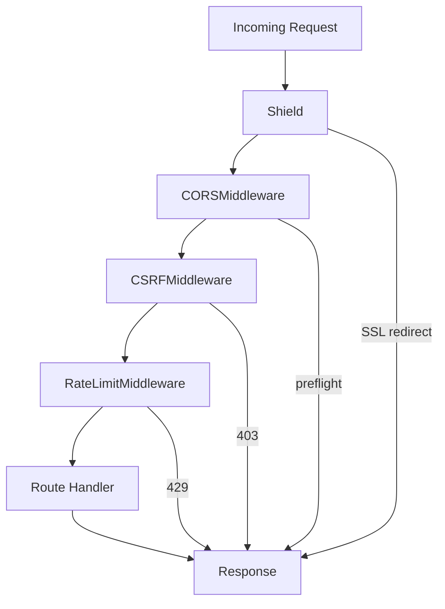
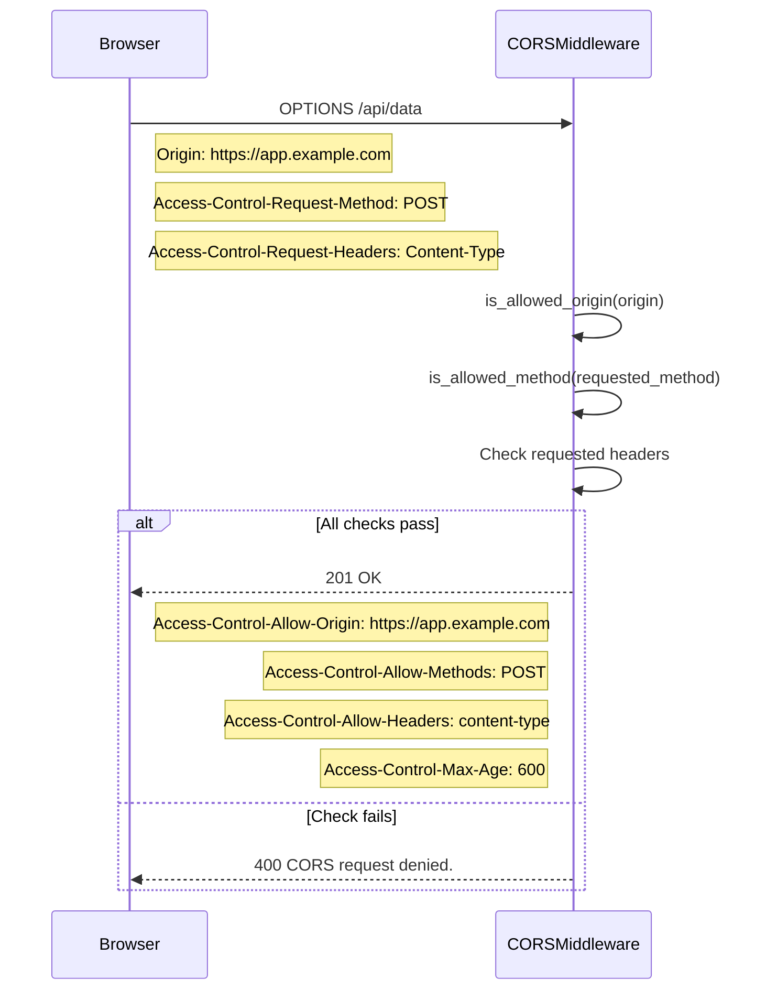
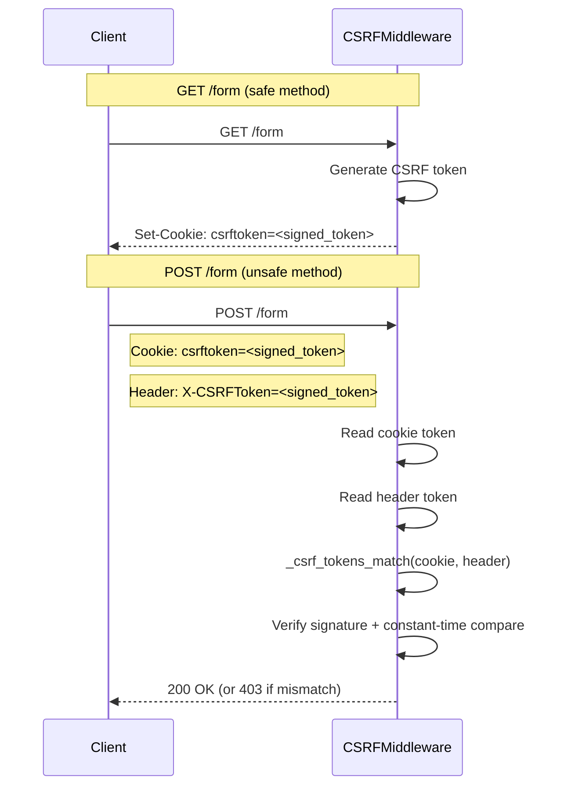
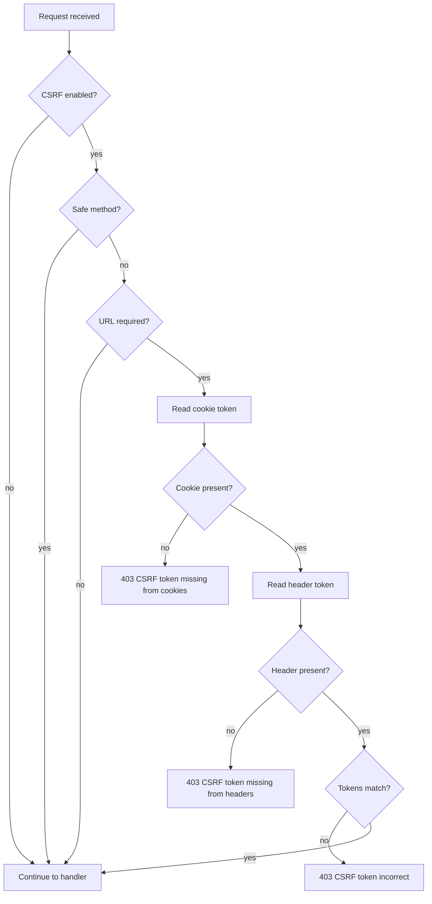
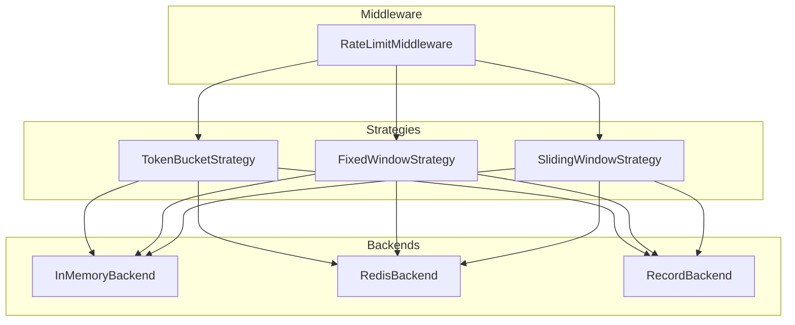

**Version:** 2026-08-11
**Audience:** Core maintainers, security engineers, application developers
**Purpose:** Document Shield (security headers), CORS, CSRF protection, and rate limiting — the four security middleware components

---

## Overview

Sillo's security layer consists of four independent middleware components, each handling a specific aspect of HTTP security:



| Middleware | Purpose | Default State |
|------------|---------|---------------|
| `Shield` | HTTP security headers (CSP, HSTS, XSS, etc.) | Enabled (headers on every response) |
| `CORSMiddleware` | Cross-origin request handling | Disabled (must be explicitly configured) |
| `CSRFMiddleware` | CSRF token validation | Disabled (`enabled=False` by default) |
| `RateLimitMiddleware` | Request rate limiting | Disabled (must be explicitly added) |

---

## Security Middleware Architecture

All four extend `BaseMiddleware` from `core/sillo/middleware/base.py`:

```python
class BaseMiddleware:
    async def __call__(self, request, response, call_next):
        await self.process_request(request, response, call_next)
        result = await call_next()
        await self.process_response(request, response)
        return result

    async def process_request(self, request, response, call_next):
        return await call_next()

    async def process_response(self, request, response):
        pass
```

Each middleware overrides `process_request` (pre-handler) and/or `process_response` (post-handler) to implement its security logic.

---

## Shield — HTTP Security Headers

**File:** `core/sillo/security/shield.py`

### Overview

`Shield` injects comprehensive HTTP security headers into every response. It also handles SSL redirect. A backward-compatibility alias exists at `core/sillo/middleware/security.py`:

```python
SecurityMiddleware = Shield
```

### Constructor Parameters

```python
class Shield(BaseMiddleware):
    def __init__(
        self,
        # Content Security Policy
        csp_enabled: bool = True,
        csp_policy: dict[str, str | list[str]] | None = None,
        csp_report_only: bool = False,
        # HSTS
        hsts_enabled: bool = True,
        hsts_max_age: int = 31536000,
        hsts_include_subdomains: bool = True,
        hsts_preload: bool = False,
        # XSS Protection
        xss_protection: bool = True,
        xss_mode: str = "block",
        # Frame Options
        frame_options: str = "DENY",
        frame_options_allow_from: str | None = None,
        # Content Type Options
        content_type_options: bool = True,
        # Referrer Policy
        referrer_policy: str = "strict-origin-when-cross-origin",
        # Permissions Policy
        permissions_policy: dict[str, str | list[str]] | None = None,
        # SSL/HTTPS
        ssl_redirect: bool = False,
        ssl_host: str | None = None,
        ssl_permanent: bool = True,
        # Cache Control
        cache_control: str = "no-store, no-cache, must-revalidate, proxy-revalidate",
        # Cross-Origin Options
        cross_origin_opener_policy: str = "same-origin",
        cross_origin_embedder_policy: str = "require-corp",
        cross_origin_resource_policy: str = "same-origin",
        # Expect-CT
        expect_ct: bool = False,
        expect_ct_max_age: int = 86400,
        expect_ct_enforce: bool = False,
        expect_ct_report_uri: str | None = None,
        # Trusted Types
        trusted_types: bool = False,
        trusted_types_policies: list[str] | None = None,
        # Server
        hide_server: bool = True,
        server_header: str | None = None,
        ...
    )
```

### Headers Emitted

| Header | Default Value | Purpose |
|--------|---------------|---------|
| `Content-Security-Policy` | `default-src 'self'; script-src 'self'; ...` | Prevents XSS, data injection |
| `Strict-Transport-Security` | `max-age=31536000; includeSubDomains` | Forces HTTPS |
| `X-XSS-Protection` | `1; mode=block` | Legacy XSS filter |
| `X-Frame-Options` | `DENY` | Prevents clickjacking |
| `X-Content-Type-Options` | `nosniff` | Prevents MIME sniffing |
| `Referrer-Policy` | `strict-origin-when-cross-origin` | Controls referrer information |
| `Permissions-Policy` | (empty by default) | Controls browser feature access |
| `Cache-Control` | `no-store, no-cache, must-revalidate, proxy-revalidate` | Prevents caching sensitive data |
| `Cross-Origin-Opener-Policy` | `same-origin` | Isolates browsing context |
| `Cross-Origin-Embedder-Policy` | `require-corp` | Controls cross-origin embedding |
| `Cross-Origin-Resource-Policy` | `same-origin` | Controls cross-origin reads |
| `X-DNS-Prefetch-Control` | `off` | Controls DNS prefetching |
| `X-Download-Options` | `noopen` | Prevents IE file download execution |

### Default CSP Policy

```python
{
    "default-src": ["'self'"],
    "script-src": ["'self'"],
    "style-src": ["'self'"],
    "img-src": ["'self'"],
    "connect-src": ["'self'"],
    "font-src": ["'self'"],
    "object-src": ["'none'"],
    "media-src": ["'self'"],
    "frame-src": ["'none'"],
    "base-uri": ["'self'"],
    "form-action": ["'self'"],
}
```

### SSL Redirect

When `ssl_redirect=True`, any HTTP request is redirected to HTTPS:

```python
if self.ssl_redirect and request.url.scheme != "https":
    redirect_url = f"https://{self.ssl_host or request.url.hostname}{request.url.path}"
    return response.redirect(url=redirect_url, status_code=301 if self.ssl_permanent else 302)
```

- `ssl_host` — override the hostname (e.g. for load balancers)
- `ssl_permanent` — `True` for 301, `False` for 302

### CSP Header Building

```python
def _build_csp_header(self) -> str:
    policies = []
    for directive, sources in self.csp_policy.items():
        if isinstance(sources, str):
            sources = [sources]
        policies.append(f"{directive} {' '.join(sources)}")
    return "; ".join(policies)
```

### Trusted Types

When `trusted_types=True`, the CSP header is extended with:
```
require-trusted-types-for 'script'; trusted-types <policies>
```

### Server Header

- `hide_server=True` (default) — removes the `Server` header
- `hide_server=False, server_header="MyApp/1.0"` — sets a custom server header

---

## CORSMiddleware — Cross-Origin Resource Sharing

**Files:**
- `core/sillo/security/cors/config.py` — `CorsConfig`
- `core/sillo/security/cors/_middleware.py` — `CORSMiddleware`

### CorsConfig

```python
class CorsConfig:
    def __init__(
        self,
        allow_origins: list[str] | None = None,
        blacklist_origins: list[str] | None = None,
        allow_methods: list[str] | None = None,
        blacklist_headers: list[str] | None = None,
        allow_headers: list[str] | None = None,
        allow_credentials: bool = True,
        allow_origin_regex: str | None = None,
        expose_headers: list[str] | None = None,
        max_age: int = 600,
        strict_origin_checking: bool = False,
        dynamic_origin_validator: Callable[[str | None], bool] | None = None,
        debug: bool = False,
        custom_error_status: int = 400,
        custom_error_messages: dict[str, str] | None = None,
    )
```

| Parameter | Default | Purpose |
|-----------|---------|---------|
| `allow_origins` | `[]` | List of allowed origins. `["*"]` allows all. |
| `blacklist_origins` | `[]` | Origins always denied (checked before allow) |
| `allow_methods` | `GET, POST, PUT, DELETE, PATCH, OPTIONS` | Allowed HTTP methods |
| `blacklist_headers` | `[]` | Headers always denied |
| `allow_headers` | `[]` | Additional allowed headers (safelisted headers always included) |
| `allow_credentials` | `True` | Whether to include `Access-Control-Allow-Credentials` |
| `allow_origin_regex` | `None` | Regex pattern for allowed origins |
| `expose_headers` | `[]` | Headers exposed to the browser |
| `max_age` | `600` | Preflight cache duration (seconds) |
| `strict_origin_checking` | `False` | Reject requests without `Origin` header |
| `dynamic_origin_validator` | `None` | Callable for runtime origin validation |

### Origin Validation

```python
def is_allowed_origin(self, origin: str | None) -> bool:
    if origin in self.blacklist_origins:
        return False
    if "*" in self.allow_origins:
        return True
    if self.allow_origin_regex and self.allow_origin_regex.fullmatch(origin):
        return True
    if self.dynamic_origin_validator and callable(self.dynamic_origin_validator):
        return self.dynamic_origin_validator(origin)
    return origin in self.allow_origins
```

**Validation order:**
1. Blacklist check (always first)
2. Wildcard `"*"` check
3. Regex pattern match
4. Dynamic validator callback
5. Exact match in `allow_origins`

### Preflight Handling



### Simple Requests

For non-preflight requests, the middleware:
1. Calls `call_next()` to process the request
2. If the origin is allowed, sets `Access-Control-Allow-Origin` on the response
3. Sets `Access-Control-Allow-Credentials` if configured
4. Sets `Access-Control-Expose-Headers` if configured

### Safelisted Headers

The following headers are always allowed (per the CORS spec):
```python
SAFELISTED_HEADERS = {"accept", "accept-language", "content-language", "content-type"}
```

---

## CSRFMiddleware — Cross-Site Request Forgery Protection

**Files:**
- `core/sillo/security/csrf/config.py` — `CSRFConfig`
- `core/sillo/security/csrf/_middleware.py` — `CSRFMiddleware`

### CSRFConfig

```python
class CSRFConfig:
    def __init__(
        self,
        enabled: bool = False,  # DISABLED by default
        required_urls: list[str] | None = None,
        exempt_urls: list[str] | None = None,
        sensitive_cookies: list[str] | None = None,
        safe_methods: list[str] | None = None,
        cookie_name: str = "csrftoken",
        cookie_path: str = "/",
        cookie_domain: str | None = None,
        cookie_secure: bool = False,
        cookie_httponly: bool = True,
        cookie_samesite: Literal["lax", "none", "strict"] = "lax",
        header_name: str = "X-CSRFToken",
        secret_key: str | None = None,
    )
```

| Parameter | Default | Purpose |
|-----------|---------|---------|
| `enabled` | `False` | **CSRF protection is disabled by default** |
| `required_urls` | `["*"]` | URL patterns requiring CSRF validation |
| `exempt_urls` | `[]` | URL patterns exempt from CSRF validation |
| `sensitive_cookies` | `[]` | Cookies that trigger CSRF validation on exempt URLs |
| `safe_methods` | `GET, HEAD, OPTIONS, TRACE` | HTTP methods that skip CSRF validation |
| `cookie_name` | `"csrftoken"` | Name of the CSRF cookie |
| `header_name` | `"X-CSRFToken"` | Name of the CSRF header |
| `secret_key` | `None` | Secret for signing tokens (required for operation) |

### Token Generation

The middleware uses `itsdangerous.URLSafeSerializer` to sign tokens:

```python
def _generate_csrf_token(self) -> str:
    return self.serializer.dumps(secrets.token_urlsafe(32))
```

A random token is generated with `secrets.token_urlsafe(32)`, then signed with itsdangerous. The signed token is stored in a cookie and must be submitted back in the `X-CSRFToken` header.

### Double-Submit Cookie Pattern



### Token Verification

```python
def _csrf_tokens_match(self, token1, token2) -> bool:
    try:
        decoded1 = self.serializer.loads(token1)
        decoded2 = self.serializer.loads(token2)
        return secrets.compare_digest(decoded1, decoded2)
    except BadSignature:
        return False
```

Both tokens are decoded (signature verified) and then compared with constant-time comparison.

### URL Matching

```python
def _url_is_required(self, url: str) -> bool:
    if not self.required_urls:
        return False
    if "*" in self.required_urls:
        return True
    for required_url in self.required_urls:
        match = re.match(required_url, url)
        if match and match.group() == url:
            return True
    return False
```

URL patterns are matched as regexes with exact-match semantics (the match must cover the entire URL).

### Request Processing Flow



---

## Rate Limiting

**Files:**
- `core/sillo/security/ratelimit/config.py` — `RateLimitConfig`
- `core/sillo/security/ratelimit/_middleware.py` — `RateLimitMiddleware`
- `core/sillo/security/ratelimit/__init__.py` — `RateLimit` convenience class
- `core/sillo/security/ratelimit/strategies/base.py` — `RateLimitStrategy` (abstract)
- `core/sillo/security/ratelimit/strategies/token_bucket.py` — `TokenBucketStrategy`
- `core/sillo/security/ratelimit/strategies/fixed_window.py` — `FixedWindowStrategy`
- `core/sillo/security/ratelimit/strategies/sliding_window.py` — `SlidingWindowStrategy`
- `core/sillo/security/ratelimit/backends/base.py` — `RateLimitBackend` (abstract), `RateLimitResult`
- `core/sillo/security/ratelimit/backends/memory.py` — `InMemoryBackend`
- `core/sillo/security/ratelimit/backends/redis.py` — `RedisBackend`
- `core/sillo/security/ratelimit/backends/record.py` — `RecordBackend`
- `core/sillo/security/ratelimit/models.py` — `RateLimitCounter`

### RateLimitConfig

```python
class RateLimitConfig:
    def __init__(
        self,
        limit: int = 60,
        window: int = 60,
        strategy: str | Any = "token",
        backend: str | Any = "memory",
        key_func: Callable[[Request], str | None] | None = None,
        namespace: str = "sillo_rl",
        cost: int = 1,
        include_headers: bool = True,
        fail_open: bool = True,
        on_exceed: str | Callable = "deny",
    )
```

| Parameter | Default | Purpose |
|-----------|---------|---------|
| `limit` | `60` | Maximum requests per window |
| `window` | `60` | Time window in seconds |
| `strategy` | `"token"` | Algorithm: `"token"`, `"fixed"`, `"sliding"`, or a strategy instance |
| `backend` | `"memory"` | Storage: `"memory"`, `"redis"`, `"record"`, or a backend instance |
| `key_func` | Client IP | Function to extract rate-limit key from request |
| `namespace` | `"sillo_rl"` | Prefix for backend keys |
| `cost` | `1` | Tokens consumed per request |
| `include_headers` | `True` | Emit `X-RateLimit-*` headers |
| `fail_open` | `True` | Allow requests if backend fails |
| `on_exceed` | `"deny"` | `"deny"` (returns 429) or a callable |

### Strategies

All strategies implement `RateLimitStrategy.hit()`:

```python
class RateLimitStrategy(ABC):
    @abstractmethod
    async def hit(self, backend, key, limit, window, cost=1, now=None) -> RateLimitResult: ...
```

#### Token Bucket (Default)

**File:** `core/sillo/security/ratelimit/strategies/token_bucket.py`

Maintains a bucket of `limit` tokens refilled at `limit / window` tokens per second. Each request consumes `cost` tokens. Allows short bursts up to `limit` then smoothly throttles.

```python
refill_rate = limit / window  # tokens per second
tokens = min(limit, state["tokens"] + elapsed * refill_rate)
if tokens < cost:
    # Denied — calculate retry_after
    ...
tokens -= cost
```

**Characteristics:**
- Smooth rate limiting with burst support
- Best client experience
- State: `{"tokens": float, "last": float}`

#### Fixed Window

**File:** `core/sillo/security/ratelimit/strategies/fixed_window.py`

Counts requests within a fixed time window starting at the first hit. Resets completely when the window elapses.

```python
window_start = int(now // window) * window
if state is None or state.get("window_start") != window_start:
    state = {"window_start": window_start, "count": 0}
```

**Characteristics:**
- Simplest algorithm
- Allows bursts at window boundaries (the classic "double count" at the edge)
- Cheap and predictable
- State: `{"window_start": float, "count": int}`

#### Sliding Window

**File:** `core/sillo/security/ratelimit/strategies/sliding_window.py`

Tracks individual request timestamps and only counts those within the last `window` seconds. Eliminates the boundary double-count problem.

```python
cutoff = now - window
hits = [t for t in hits if t > cutoff]
if len(hits) + cost > limit:
    # Denied
    ...
```

**Characteristics:**
- Most accurate — no boundary issues
- State grows with request volume (pruned each hit)
- State: `{"hits": list[float]}`

### Backends

All backends implement `RateLimitBackend`:

```python
class RateLimitBackend:
    async def fetch_state(self, key: str) -> dict | None: ...
    async def save_state(self, key: str, state: dict, ttl: int) -> None: ...
    async def clear(self) -> None: ...
```

#### InMemoryBackend

**File:** `core/sillo/security/ratelimit/backends/memory.py`

Process-local storage using a dict with `asyncio.Lock` for coroutine safety.

```python
class InMemoryBackend(RateLimitBackend):
    def __init__(self):
        self._store: dict[str, tuple[dict, float]] = {}
        self._lock = asyncio.Lock()
```

- Suitable for single-instance deployments and tests
- State expired lazily by timestamp (no background cleanup)
- Lost on process restart

#### RedisBackend

**File:** `core/sillo/security/ratelimit/backends/redis.py`

Redis-backed shared storage using JSON serialization and a Lua script for atomic read-modify-write.

```python
class RedisBackend(RateLimitBackend):
    def __init__(self, url="redis://localhost:6379/0", prefix="sillo:ratelimit:", **kwargs):
        import redis.asyncio as aioredis
        self._client = aioredis.from_url(url, **kwargs)
        self._script = self._client.register_script(_LUA_SET)
```

- Recommended for multi-instance deployments
- Atomic operations via Lua script
- Requires `redis` package

#### RecordBackend

**File:** `core/sillo/security/ratelimit/backends/record.py`

Stores state in the application database via the `RateLimitCounter` Tortoise model.

- Uses `sillo.record` ORM
- No external dependencies beyond the database
- Single-instance-level atomicity

### RateLimitResult

**File:** `core/sillo/security/ratelimit/backends/base.py`

```python
@dataclass
class RateLimitResult:
    allowed: bool        # Whether the request is permitted
    limit: int           # The configured maximum
    remaining: int       # Requests left in window
    reset_at: float      # Unix timestamp when window resets
    retry_after: int     # Seconds to wait before retrying (0 when allowed)
```

### RateLimitMiddleware

**File:** `core/sillo/security/ratelimit/_middleware.py`

```python
class RateLimitMiddleware(BaseMiddleware):
    def __init__(self, config=None, **kwargs): ...
```

**Request processing:**

```python
async def process_request(self, request, response, call_next):
    key = self.config._key_func(request)
    if key is None:
        return await call_next()  # No key → skip limiting

    full_key = f"{self.config.namespace}:{key}"
    try:
        result = await self._strategy.hit(
            self._backend, full_key, self.config.limit,
            self.config.window, cost=self.config.cost,
        )
    except Exception:
        if not self.config.fail_open:
            raise
        return await call_next()  # Backend failed, fail_open=True

    if not result.allowed:
        return self._deny(request, response, result)
    return await call_next()
```

**Response headers:**

```python
async def process_response(self, request, response):
    result = self._last_result
    if result is None or not self.config.include_headers:
        return
    response.set_header("X-RateLimit-Limit", str(result.limit))
    response.set_header("X-RateLimit-Remaining", str(result.remaining))
    response.set_header("X-RateLimit-Reset", str(int(result.reset_at)))
```

**429 response:**

```python
def _deny(self, request, response, result):
    retry_after = max(int(result.retry_after), 1)
    return response.json(
        {
            "error": "rate_limit_exceeded",
            "message": "Too many requests. Slow down and retry later.",
            "retry_after": retry_after,
        },
        status_code=429,
        headers={
            "X-RateLimit-Limit": str(result.limit),
            "X-RateLimit-Remaining": "0",
            "X-RateLimit-Reset": str(int(result.reset_at)),
            "Retry-After": str(retry_after),
        },
    )
```

### RateLimit Convenience Class

**File:** `core/sillo/security/ratelimit/__init__.py`

```python
class RateLimit(RateLimitMiddleware):
    def __init__(self, limit=60, window=60, strategy="token", backend="memory",
                 key_func=None, namespace="sillo_rl", cost=1, include_headers=True,
                 fail_open=True, on_exceed="deny", **kwargs):
        config = RateLimitConfig(limit=limit, window=window, ...)
        super().__init__(config=config, **kwargs)
```

Usage:
```python
app.use(RateLimit(limit=100, window=60, backend="redis"))
```

### Rate Limit Architecture



---

## Middleware Composition

### Recommended Order

```python
from sillo.security import Shield, CORSMiddleware, CSRFMiddleware
from sillo.security.ratelimit import RateLimit

app = SilloApp()

# 1. Shield — adds security headers to every response
app.use(Shield())

# 2. CORS — handles cross-origin requests
app.use(CORSMiddleware(CorsConfig(allow_origins=["https://app.example.com"])))

# 3. CSRF — validates tokens on unsafe methods
app.use(CSRFMiddleware(CSRFConfig(enabled=True, secret_key="...")))

# 4. Rate limiting — protects against abuse
app.use(RateLimit(limit=100, window=60, backend="redis"))
```

**Why this order?**
- Shield runs first to ensure headers are on every response (including error responses)
- CORS runs before CSRF because preflight requests (OPTIONS) should bypass CSRF
- Rate limiting runs last to count all requests, including those rejected by CSRF

### Interaction with Authentication

The security middleware runs independently of authentication. A typical full stack:

```python
app.use(Shield())
app.use(CORSMiddleware(cors_config))
app.use(SessionMiddleware(config=session_config))
app.use(AuthenticationMiddleware(user_model=User, backend=[JWTAuthBackend(...)]))
app.use(RateLimit(limit=100, window=60))
```

---

## Source Map

| Component | File | Lines |
|-----------|------|-------|
| `Shield` | `core/sillo/security/shield.py` | 18–245 |
| `SecurityMiddleware` alias | `core/sillo/middleware/security.py` | 5 |
| `CorsConfig` | `core/sillo/security/cors/config.py` | 5–125 |
| `CORSMiddleware` | `core/sillo/security/cors/_middleware.py` | 20–249 |
| `CSRFConfig` | `core/sillo/security/csrf/config.py` | 5–117 |
| `CSRFMiddleware` | `core/sillo/security/csrf/_middleware.py` | 14–162 |
| `RateLimitConfig` | `core/sillo/security/ratelimit/config.py` | 13–71 |
| `RateLimitMiddleware` | `core/sillo/security/ratelimit/_middleware.py` | 26–100 |
| `RateLimit` | `core/sillo/security/ratelimit/__init__.py` | 51–87 |
| `RateLimitStrategy` | `core/sillo/security/ratelimit/strategies/base.py` | 19–64 |
| `TokenBucketStrategy` | `core/sillo/security/ratelimit/strategies/token_bucket.py` | 19–57 |
| `FixedWindowStrategy` | `core/sillo/security/ratelimit/strategies/fixed_window.py` | 18–56 |
| `SlidingWindowStrategy` | `core/sillo/security/ratelimit/strategies/sliding_window.py` | 19–55 |
| `RateLimitResult` | `core/sillo/security/ratelimit/backends/base.py` | 16–33 |
| `RateLimitBackend` | `core/sillo/security/ratelimit/backends/base.py` | 36–49 |
| `InMemoryBackend` | `core/sillo/security/ratelimit/backends/memory.py` | 17–45 |
| `RedisBackend` | `core/sillo/security/ratelimit/backends/redis.py` | 27–71 |
| `RecordBackend` | `core/sillo/security/ratelimit/backends/record.py` | 16–29 |
| `RateLimitCounter` model | `core/sillo/security/ratelimit/models.py` | 19 |
