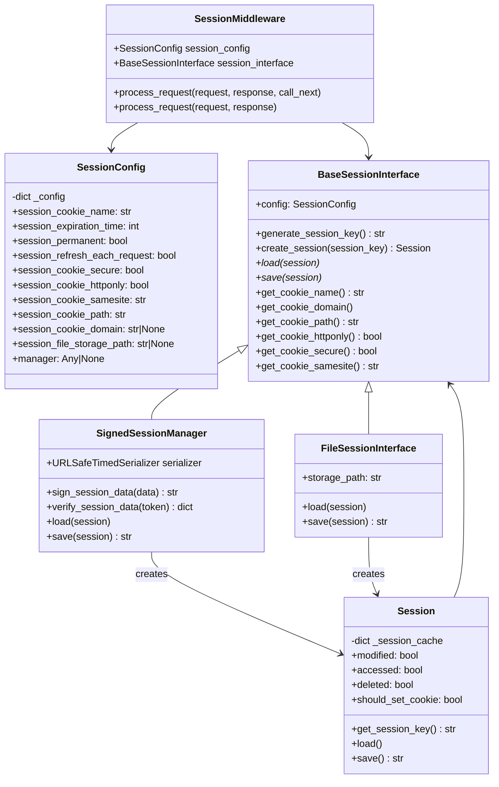
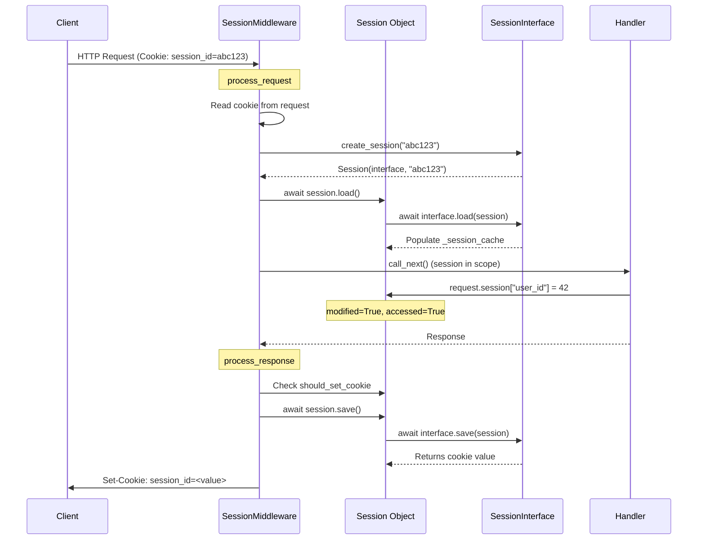
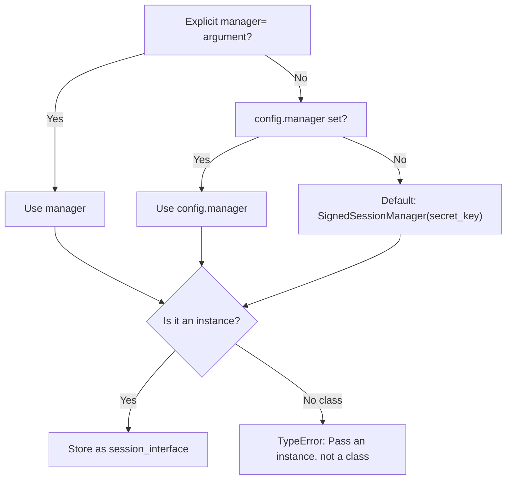

> Internal engineering reference for Sillo's session subsystem.
>
> Source: `core/sillo/session/` (7 files, ~844 lines)

---

## 1. Overview and Architecture

The session subsystem provides per-request key-value storage persisted across HTTP
round-trips.  It follows the classic **middleware-interceptor** pattern: one
middleware reads a cookie on the way in and writes a cookie on the way out; the
handler sees a plain dict-like object (`request.session`) and never touches
cookies, backends, or signing directly.

### Architecture Diagram



### Request/Response Flow



### File Inventory

| File | Path | Lines | Purpose |
|------|------|-------|---------|
| `__init__.py` | `core/sillo/session/__init__.py` | 4 | Public API re-exports |
| `config.py` | `core/sillo/session/config.py` | 202 | `SessionConfig`, `reject_unknown_settings` |
| `base.py` | `core/sillo/session/base.py` | 63 | `BaseSessionInterface` ABC |
| `session_objects.py` | `core/sillo/session/session_objects.py` | 316 | `Session` dict-like object |
| `signed_cookies.py` | `core/sillo/session/signed_cookies.py` | 57 | `SignedSessionManager` |
| `file.py` | `core/sillo/session/file.py` | 74 | `FileSessionManager` |
| `middleware.py` | `core/sillo/session/middleware.py` | 129 | `SessionMiddleware` |

---

## 2. SessionConfig

**File:** `core/sillo/session/config.py`, line 65

`SessionConfig` is a typed container for every session-related setting.  It exists
so that session settings are gathered in one place and validated eagerly rather
than silently ignored.

### Recognised Settings

The module-level `SETTINGS` tuple (line 7) defines the canonical setting names:

```
session_cookie_name          session_cookie_httponly
session_expiration_time      session_cookie_samesite
session_permanent            session_cookie_path
session_refresh_each_request session_cookie_domain
session_cookie_secure        session_file_storage_path
manager
```

### Rejecting Unknown Settings

```python
# core/sillo/session/config.py, line 22
def reject_unknown_settings(names: Iterable[str], *, called: str) -> None:
```

Called from both `SessionConfig.__init__` and `SessionMiddleware.__init__` with
any `**kwargs` that were not consumed by explicit parameters.

**How it works:**

1. Compares each supplied name against the `SETTINGS` tuple.
2. For any name not found, uses `difflib.get_close_matches(name, SETTINGS, n=3, cutoff=0.5)` to suggest corrections.
3. Raises `TypeError` with a message listing the unknown name(s) and suggestions.

**Motivation:** Prevents silent misconfiguration.  A user who writes
`cookie_secure=False` instead of `session_cookie_secure=False` gets an immediate
error with a helpful "did you mean" suggestion rather than a silently insecure
cookie.

```python
# Example error message:
# TypeError: Unknown session setting 'cookie_secure'.
# Did you mean: session_cookie_secure?
```

### Constructor

```python
# core/sillo/session/config.py, line 71
def __init__(
    self,
    session_cookie_name: str = "session_id",
    session_expiration_time: int = 86400,
    session_permanent: bool = True,
    session_refresh_each_request: bool = True,
    session_cookie_secure: bool = True,
    session_cookie_httponly: bool = True,
    session_cookie_samesite: str = "lax",
    session_cookie_path: str = "/",
    session_cookie_domain: str | None = None,
    session_file_storage_path: str | None = None,
    manager: Any | None = None,
    **kwargs: Any,
)
```

All parameters are stored in `self._config: dict[str, Any]`.  The `**kwargs`
are passed to `reject_unknown_settings` for validation before storage.

### Attribute Access

`__getattr__` (line 129) provides dot-notation access into `_config`.  Names
starting with `_` are rejected with `AttributeError` to avoid confusion with
private attributes.  Missing names raise `AttributeError` listing all valid
settings.

### Properties

Each setting has a dedicated property (lines 149-202) that reads from `_config`
with a fallback default:

| Property | Type | Default |
|----------|------|---------|
| `session_cookie_name` | `str` | `"session_id"` |
| `session_expiration_time` | `int` | `86400` (24 hours) |
| `session_permanent` | `bool` | `True` |
| `session_refresh_each_request` | `bool` | `True` |
| `session_cookie_secure` | `bool` | `True` |
| `session_cookie_httponly` | `bool` | `True` |
| `session_cookie_samesite` | `Literal["lax","strict","none"]` | `"lax"` |
| `session_cookie_path` | `str` | `"/"` |
| `session_cookie_domain` | `str \| None` | `None` |
| `session_file_storage_path` | `str \| None` | `None` |
| `manager` | `Any \| None` | `None` |

### Serialisation

`to_dict()` (line 146) returns a shallow copy of the internal `_config` dict,
useful for logging or debugging.

---

## 3. Session Object

**File:** `core/sillo/session/session_objects.py`, line 6

`Session` is the per-request session object stored at `request.session`.  It
behaves like a dictionary but tracks three boolean flags that determine how the
middleware handles it in the response phase.

### Internal State

| Attribute | Type | Purpose |
|-----------|------|---------|
| `interface` | `BaseSessionInterface` | The backend that persists this session |
| `session_key` | `str \| None` | Cookie value (or `None` for new visitors) |
| `_session_cache` | `dict[str, Any]` | In-memory data store |
| `modified` | `bool` | Set `True` by writes and deletes |
| `accessed` | `bool` | Set `True` by reads |
| `deleted` | `bool` | Set `True` by deletes and `clear()` |
| `_expiration_time` | `datetime \| None` | Explicit override for expiration |

### Dict-Like Protocol

Every read method sets `accessed = True`.  Every write method sets
`modified = True` (and `accessed = True`).  Every delete sets `deleted = True`.

| Method | Line | Flags Set | Raises on Missing |
|--------|------|-----------|-------------------|
| `__getitem__(key)` | 50 | `accessed` | `KeyError` |
| `__setitem__(key, value)` | 66 | `modified`, `accessed` |  |
| `__delitem__(key)` | 79 | `modified`, `deleted` | `KeyError` |
| `__contains__(key)` | 93 | `accessed` |  |
| `__len__()` | 105 | `accessed` |  |
| `__iter__()` | 309 | `accessed` |  |
| `get(key, default)` | 110 | `accessed` |  |
| `set(key, value)` | 123 | `modified`, `accessed` |  |
| `delete(key)` | 134 | `modified`, `deleted` | Never raises |
| `clear()` | 145 | `accessed`, `modified`, `deleted` |  |
| `keys()` | 157 | `accessed` |  |
| `values()` | 162 | `accessed` |  |
| `items()` | 167 | `accessed` |  |
| `update(other)` | 180 | `modified` |  |
| `is_empty()` | 172 | *(none)* |  |

**Design note:** `is_empty()` intentionally does *not* set `accessed` so that
middleware can check emptiness without triggering a cookie refresh.

### Session Key Management

```python
# core/sillo/session/session_objects.py, line 189
def get_session_key(self) -> str:
    if self.session_key:
        return self.session_key
    self.session_key = self.interface.generate_session_key()
    return self.session_key
```

For new visitors (no cookie), the key is lazily generated on first access via
`secrets.token_hex(32)`. A 64-character hex string with 256 bits of entropy.

### Expiration

Three methods control when a session expires:

- **`set_expiration_time(expiration: datetime)`** (line 200): Explicit
  override.
- **`get_expiration_time()`** (line 209): Resolution order:
  1. Explicit override from `set_expiration_time`
  2. If `session_permanent` is `False`: `now(utc) + session_expiration_time`
  3. If `session_permanent` is `True`: `datetime.max` (effectively never)
  4. Fallback: 7 days if config is unreachable
- **`has_expired()`** (line 251): `now(utc) > get_expiration_time()`

### should_set_cookie

```python
# core/sillo/session/session_objects.py, line 260
@property
def should_set_cookie(self) -> bool:
    return self.modified or (
        self.config.session_permanent and self.config.session_refresh_each_request
    )
```

Returns `True` when the cookie needs to be written.  Two triggers:
1. The session data was modified during the request.
2. The session is permanent *and* `session_refresh_each_request` is enabled
   (rolling expiry refresh).

### Backend Delegation

```python
# core/sillo/session/session_objects.py, line 280
async def load(self) -> None:
    await self.interface.load(self)

# core/sillo/session/session_objects.py, line 289
async def save(self) -> str:
    self.modified = False
    self.deleted = False
    self.accessed = False
    return await self.interface.save(self)
```

`save()` resets all flags before delegating so the backend can inspect them if
needed, but the middleware's decision has already been made.

---

## 4. BaseSessionInterface

**File:** `core/sillo/session/base.py`, line 6

The abstract base class that all session backends must implement.

### Constructor

```python
def __init__(self, config: SessionConfig | None = None) -> None:
    self.config = config
```

### Concrete Methods

| Method | Line | Returns | Notes |
|--------|------|---------|-------|
| `generate_session_key()` | 13 | `secrets.token_hex(32)` | 64 hex chars, 256 bits |
| `create_session(session_key)` | 17 | `Session(self, session_key)` | Factory method |
| `get_cookie_name()` | 29 | `config.session_cookie_name` or `"session_id"` | |
| `get_cookie_domain()` | 35 | `config.session_cookie_domain` or `None` | |
| `get_cookie_path()` | 41 | `config.session_cookie_path` or `"/"` | |
| `get_cookie_httponly()` | 47 | `config.session_cookie_httponly` or `True` | |
| `get_cookie_secure()` | 53 | `config.session_cookie_secure` or `False` | |
| `get_cookie_samesite()` | 59 | `config.session_cookie_samesite` or `"lax"` | |

**Note:** The cookie getter methods are utility methods on the base class.  The
middleware reads cookie attributes directly from `SessionConfig` rather than
calling these methods.

### Abstract Methods

```python
async def load(self, session: Session) -> None:
    raise NotImplementedError

async def save(self, session: Session) -> str:
    raise NotImplementedError
```

- **`load`**: Populate `session._session_cache` from the backend.  For
  server-side stores, this means reading from disk/database/Redis using
  `session.session_key`.  For cookie-based stores, this means verifying and
  deserialising the cookie value.
- **`save`**: Persist `session._session_cache` to the backend.  Return the
  string to be stored in the cookie.  For server-side stores, this is the
  session key.  For cookie-based stores, this is the signed serialised data.

---

## 5. SessionMiddleware

**File:** `core/sillo/session/middleware.py`, line 13

### Constructor Resolution

```python
# core/sillo/session/middleware.py, line 16
def __init__(
    self,
    config: SessionConfig | None = None,
    manager: BaseSessionInterface | None = None,
    secret_key: str | None = None,
    **settings: Any,
)
```

The constructor resolves the session backend through a priority chain:



Key validation steps:

1. **Unknown settings** (line 44): Calls `reject_unknown_settings(settings, called="SessionMiddleware()")`.
2. **Mutual exclusion** (line 50): Raises `TypeError` if both `config=` and keyword settings are provided.
3. **Config creation** (line 58): `self.session_config = config or SessionConfig(**settings)`.
4. **Manager resolution** (line 61-74): Uses the priority chain above.  Raises
   `TypeError` if the resolved value is a class rather than an instance, with a
   helpful message showing the correct instantiation pattern.

### process_request

```python
# core/sillo/session/middleware.py, line 82
async def process_request(self, request, response, call_next):
```

1. Reads the cookie name from `self.session_config.session_cookie_name`.
2. Gets `session_key` from `request.cookies.get(cookie_name)`.
3. Creates a `Session` via `self.session_interface.create_session(session_key)`.
4. Calls `await session.load()` to populate from the backend.
5. Stores in `request.scope["session"]`.
6. Calls `await call_next()` to proceed to the handler.

### process_response

```python
# core/sillo/session/middleware.py, line 99
async def process_response(self, request, response):
```

Three cases:

1. **No session in scope** (line 103): Returns early.
2. **Empty session that was accessed and modified** (lines 107-115): Calls
   `await session.save()` to let the backend purge its record, then
   `response.delete_cookie(cookie_name)`. This handles logout. The server-side
   store is cleaned up and the cookie is removed.
3. **should_set_cookie is true** (lines 117-129):
   Calls `await session.save()` to get the cookie value, then sets the cookie
   with all configured attributes:
   - `key`: cookie name
   - `value`: returned from `save()`
   - `domain`, `path`, `httponly`, `secure`, `samesite`: from config
   - `expires`: from `session.get_expiration_time()`

---

## 6. SignedSessionManager

**File:** `core/sillo/session/signed_cookies.py`, line 8

A **cookie-based** session store with no server-side state.  The entire session
payload is signed and serialised into the cookie value itself.

### Cryptographic Foundation

```python
# core/sillo/session/signed_cookies.py, line 11
def __init__(self, config=None, secret_key: str | None = None):
    if not secret_key:
        raise RuntimeError("secret_key is required for SignedSessionManager")
    self.serializer = URLSafeTimedSerializer(
        secret_key=secret_key,
        salt="nexio.session.signed_cookie",
    )
```

Uses `itsdangerous.URLSafeTimedSerializer` which:
- Serialises the payload to JSON, then base64url-encodes it.
- Appends a timestamp.
- Signs the whole thing with HMAC-SHA256 using the secret key and salt.
- The salt prevents signature reuse across different itsdangerous contexts.

### Signing and Verification

```python
def sign_session_data(self, session_data: dict[str, Any]) -> str:
    return self.serializer.dumps(session_data)

def verify_session_data(self, token: str | None) -> dict[str, Any]:
    if not token:
        return {}
    try:
        return self.serializer.loads(token)
    except BadSignature:
        return {}
```

`verify_session_data` silently returns an empty dict on bad signatures, which
creates a fresh (anonymous) session rather than crashing.

### Load and Save

```python
async def load(self, session):
    # session.session_key IS the signed token
    data = self.verify_session_data(session.session_key)
    if data:
        session._session_cache = data
    else:
        session._session_cache = {}

async def save(self, session) -> str:
    if session.deleted:
        session.session_key = ""
        return ""
    signed = self.sign_session_data(session._session_cache)
    session.session_key = signed
    return signed
```

**Key insight:** The cookie value *is* the entire session payload, not a
reference to server-side storage.  This means:
- **No disk I/O, no database queries**: the fastest possible session backend.
- **Size limit**: browsers limit cookies to ~4 KB; large session data will
  exceed this.
- **No server-side revocation**: you cannot invalidate a session without
  waiting for the cookie to expire (or using a separate revocation list).

### When to Use

- Small session data (user ID, role, flash messages).
- Horizontally scaled deployments where shared server-side state is inconvenient.
- Applications where session speed is critical.

### When NOT to Use

- Session data exceeding ~3 KB (after base64 encoding).
- Need for server-side session revocation.
- Sensitive data that should not reside in cookies (even signed).

---

## 7. FileSessionManager

**File:** `core/sillo/session/file.py`, line 8

A **server-side** session store using JSON files on disk.

### Constructor

```python
def __init__(self, config=None):
    super().__init__(config)
    self.storage_path = getattr(
        config, "session_file_storage_path", None
    ) or "__sessions"
    os.makedirs(self.storage_path, exist_ok=True)
```

### File Operations

| Method | Line | Operation |
|--------|------|-----------|
| `_get_file_path(key)` | 19 | `os.path.join(storage_path, f"{key}.json")` |
| `_load_session_data(key)` | 23 | Read JSON from file; return `None` on missing/error |
| `_save_session_data(key, data)` | 36 | Write JSON to file |
| `_delete_session_file(key)` | 43 | `os.remove()` if exists |

### Load and Save

```python
async def load(self, session):
    if session.session_key:
        data = self._load_session_data(session.session_key)
        if data is not None:
            session._session_cache = data
        else:
            session._session_cache = {}
    else:
        session._session_cache = {}

async def save(self, session) -> str:
    if session.deleted:
        self._delete_session_file(session.session_key)
        session.session_key = None
        return ""
    key = session.get_session_key()
    self._save_session_data(key, session._session_cache)
    session.session_key = key
    return key
```

**Design difference from `SignedSessionManager`:** The cookie contains only the
session key (a 64-char hex string).  The actual data lives in
`{storage_path}/{key}.json`.

### File Layout

```
__sessions/
  a1b2c3d4e5f6...json    # session data as JSON
  f9e8d7c6b5a4...json
  ...
```

Each file contains the raw `_session_cache` dict serialised via `json.dumps`.

### Limitations

- **No concurrency control**: concurrent requests for the same session can
  race. A production deployment should use a proper database or Redis.
- **No automatic cleanup**: expired session files accumulate. A cron job or
  periodic cleanup is needed.
- **Filesystem coupling**: not suitable for multi-server deployments without
  shared storage.

---

## 8. Extension Points

### Custom Backend

To create a custom session backend, subclass `BaseSessionInterface` and
implement `load` and `save`:

```python
from sillo.session.base import BaseSessionInterface
from sillo.session.session_objects import Session

class RedisSessionManager(BaseSessionInterface):
    def __init__(self, config=None, redis_client=None):
        super().__init__(config)
        self.redis = redis_client

    async def load(self, session: Session) -> None:
        if session.session_key:
            data = await self.redis.get(f"session:{session.session_key}")
            if data:
                session._session_cache = json.loads(data)
            else:
                session._session_cache = {}
        else:
            session._session_cache = {}

    async def save(self, session: Session) -> str:
        if session.deleted:
            if session.session_key:
                await self.redis.delete(f"session:{session.session_key}")
            session.session_key = ""
            return ""
        key = session.get_session_key()
        await self.redis.setex(
            f"session:{key}",
            self.config.session_expiration_time or 86400,
            json.dumps(session._session_cache),
        )
        session.session_key = key
        return key
```

### Registering a Custom Backend

```python
from sillo.session.middleware import SessionMiddleware
from sillo.session.config import SessionConfig

config = SessionConfig(session_cookie_name="app_session")
manager = RedisSessionManager(config=config, redis_client=redis)

app.use(SessionMiddleware(config=config, manager=manager))
```

Or via the config shortcut:

```python
config = SessionConfig(manager=RedisSessionManager(redis_client=redis))
app.use(SessionMiddleware(config=config))
```

---

## 9. Testing Considerations

### Unit Testing SessionConfig

```python
def test_reject_unknown_settings():
    with pytest.raises(TypeError, match="cookie_secure"):
        SessionConfig(cookie_secure=False)

def test_valid_settings():
    config = SessionConfig(session_cookie_secure=False)
    assert config.session_cookie_secure is False
```

### Unit Testing Session Object

```python
def test_session_flags():
    interface = BaseSessionInterface()
    session = Session(interface)

    # Read sets accessed
    session._session_cache = {"key": "value"}
    _ = session["key"]
    assert session.accessed is True
    assert session.modified is False

    # Write sets modified
    session["key"] = "new"
    assert session.modified is True

    # Delete sets deleted
    del session["key"]
    assert session.deleted is True
```

### Integration Testing with TestClient

```python
from sillo.testclient import TestClient

def test_session_persists():
    with TestClient(app) as client:
        # First request sets session data
        resp = client.post("/login", json={"user": "admin"})
        assert resp.status_code == 200

        # Second request reads session data
        resp = client.get("/dashboard")
        assert resp.status_code == 200
        assert "admin" in resp.text
```

### Testing SignedSessionManager

```python
def test_signed_session_tamper():
    manager = SignedSessionManager(secret_key="test-secret")
    session = manager.create_session()
    session._session_cache = {"user": "admin"}

    # Save produces a signed token
    token = await session.save()
    assert token != ""

    # Tampered token produces empty session
    tampered = token[:-5] + "XXXXX"
    session2 = manager.create_session(tampered)
    await manager.load(session2)
    assert session2._session_cache == {}
```

### Testing FileSessionManager

```python
import tempfile

def test_file_session_lifecycle():
    with tempfile.TemporaryDirectory() as tmpdir:
        config = SessionConfig(session_file_storage_path=tmpdir)
        manager = FileSessionManager(config=config)

        session = manager.create_session()
        session["user"] = "test"
        key = await manager.save(session)

        # Reload from disk
        session2 = manager.create_session(key)
        await manager.load(session2)
        assert session2["user"] == "test"

        # Delete
        session2.deleted = True
        await manager.save(session2)
        session3 = manager.create_session(key)
        await manager.load(session3)
        assert session3._session_cache == {}
```

---

## Appendix: Configuration Quick Reference

```python
from sillo.session import SessionConfig, SessionMiddleware

# Minimal (uses SignedSessionManager by default)
app.use(SessionMiddleware(secret_key="your-secret-key"))

# With explicit config
config = SessionConfig(
    session_cookie_name="app_session",
    session_expiration_time=3600,       # 1 hour
    session_permanent=False,            # expires with expiration_time
    session_refresh_each_request=False, # don't refresh on each request
    session_cookie_secure=True,         # HTTPS only
    session_cookie_httponly=True,       # no JavaScript access
    session_cookie_samesite="strict",   # strict CSRF protection
    session_cookie_path="/",
    session_cookie_domain=".example.com",
)
app.use(SessionMiddleware(config=config, secret_key="your-secret-key"))

# With file-based sessions
config = SessionConfig(
    session_file_storage_path="/tmp/sessions",
    manager=FileSessionManager(),
)
app.use(SessionMiddleware(config=config))
```
