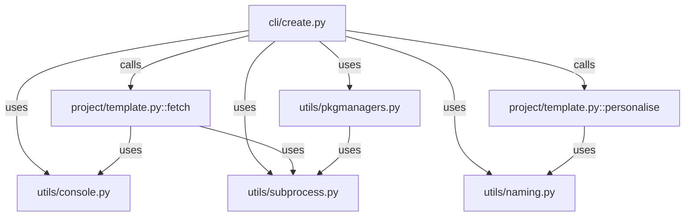
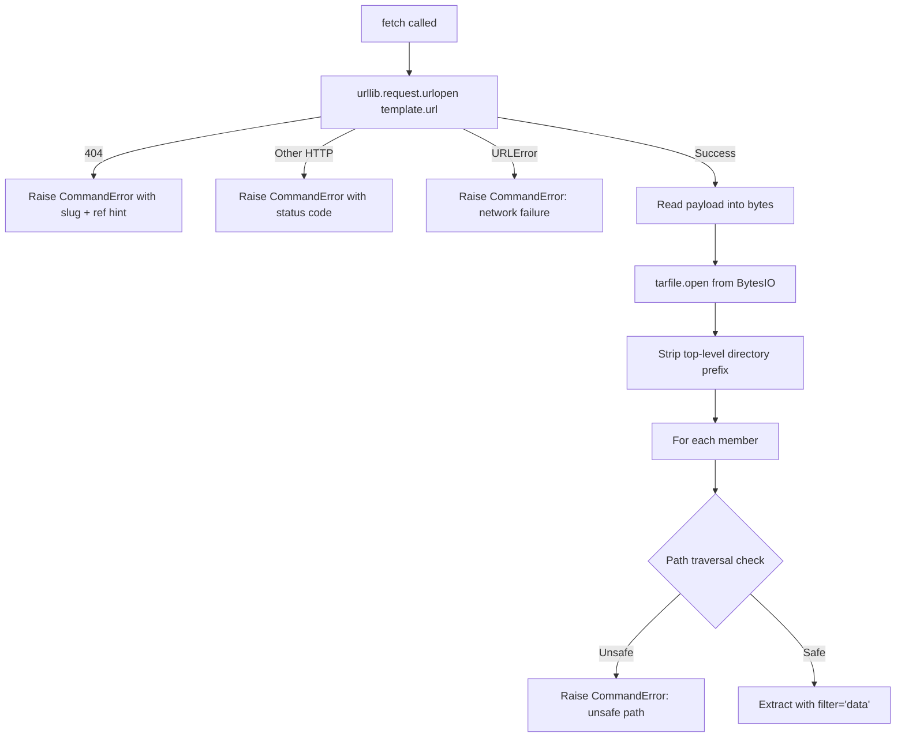
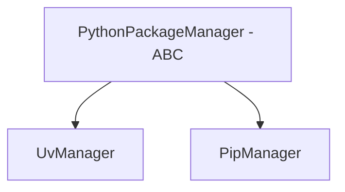
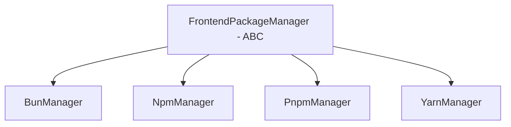
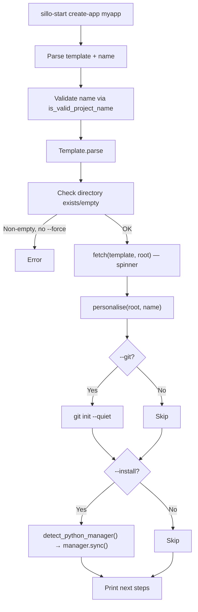
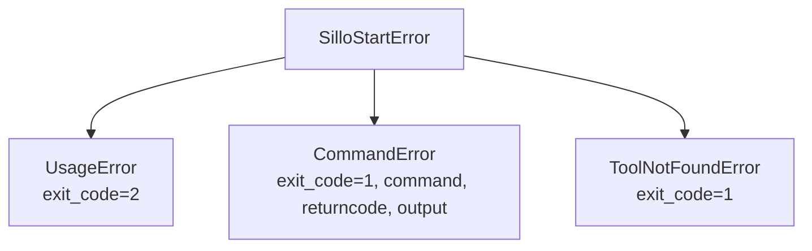

> **Package**: `sillo-start` v0.1.0
> **Repository**: https://github.com/sillohq/start
> **Source root**: `start/sillo_start/`
> **Tests**: `start/tests/`

---

## 1. Overview

`sillo-start` is a CLI bootstrapper that creates Sillo applications by fetching
a **real starter repository** (not a template generator), personalising it,
and getting out of the way.

```
"sillo-start fetches a repo, renames a few strings, and leaves."
```

Key design decisions:
1. **Starter repo, not template**: The user gets a real, working application
   that runs immediately -- not a skeleton that needs scaffolding.
2. **Targeted substitutions**: Only specific files are modified.  Model files
   are deliberately untouched to avoid desyncing from committed migrations.
3. **No secrets in the starter**: `generate_secret_key()` creates unique
   secrets for every new project.
4. **Path traversal protection**: The tarball extraction verifies every path
   stays within the destination directory.

Dependencies:

| Dependency | Constraint | Purpose |
|---|---|---|
| `typer` | `>=0.12.0` | CLI framework |
| `rich` | `>=13.7.0` | Terminal output, progress spinners |

Python requirement: `>=3.11`

---

## 2. Package Structure

```
start/sillo_start/
├── __init__.py          # __version__ = "0.1.0"
├── __main__.py          # main() entry point
├── exceptions.py        # SilloStartError, UsageError, CommandError, ToolNotFoundError
├── cli/
│   ├── __init__.py      # build_cli()
│   ├── app.py           # Typer app, version/verbose/quiet options, handle_errors
│   └── create.py        # create-app command
├── project/
│   ├── __init__.py      # Re-exports DEFAULT_TEMPLATE, Template, fetch, personalise
│   └── template.py      # Template dataclass, fetch, personalise, generate_secret_key
└── utils/
    ├── __init__.py      # Re-exports all public utilities
    ├── console.py       # Console class, is_ci(), console singleton
    ├── naming.py        # split_words, case conversions, pluralize, table_name, validation
    ├── pkgmanagers.py   # Python/Frontend package manager ABCs, 6 concrete managers
    └── subprocess.py    # CommandResult, run, stream, which, tool_exists, require_tool
```



**File paths (absolute)**:

| Module | Path |
|---|---|
| `__init__` | `/Users/admin/sillo.build/start/sillo_start/__init__.py` |
| `__main__` | `/Users/admin/sillo.build/start/sillo_start/__main__.py` |
| `exceptions` | `/Users/admin/sillo.build/start/sillo_start/exceptions.py` |
| `cli/__init__` | `/Users/admin/sillo.build/start/sillo_start/cli/__init__.py` |
| `cli/app` | `/Users/admin/sillo.build/start/sillo_start/cli/app.py` |
| `cli/create` | `/Users/admin/sillo.build/start/sillo_start/cli/create.py` |
| `project/__init__` | `/Users/admin/sillo.build/start/sillo_start/project/__init__.py` |
| `project/template` | `/Users/admin/sillo.build/start/sillo_start/project/template.py` |
| `utils/console` | `/Users/admin/sillo.build/start/sillo_start/utils/console.py` |
| `utils/naming` | `/Users/admin/sillo.build/start/sillo_start/utils/naming.py` |
| `utils/pkgmanagers` | `/Users/admin/sillo.build/start/sillo_start/utils/pkgmanagers.py` |
| `utils/subprocess` | `/Users/admin/sillo.build/start/sillo_start/utils/subprocess.py` |

---

## 3. Template Dataclass

**Source**: `/Users/admin/sillo.build/start/sillo_start/project/template.py`

```python
@dataclass(frozen=True)
class Template:
    owner: str
    repo: str
    ref: str = "main"
```

| Field | Type | Default | Purpose |
|---|---|---|---|
| `owner` | `str` | (required) | GitHub username or org |
| `repo` | `str` | (required) | Repository name |
| `ref` | `str` | `"main"` | Branch or tag |

### Properties

```python
@property
def slug(self) -> str:
    return f"{self.owner}/{self.repo}"

@property
def url(self) -> str:
    return f"https://codeload.github.com/{self.owner}/{self.repo}/tar.gz/{self.ref}"
```

The URL points to GitHub's raw tarball endpoint -- not the repository page.
Public repos need no authentication.

### Template.parse()

```python
@classmethod
def parse(cls, value: str, *, ref: str | None = None) -> Template
```

Parses three formats:

| Input | Parsed As |
|---|---|
| `sillohq/starter` | `Template("sillohq", "starter", "main")` |
| `sillohq/starter@v1.2` | `Template("sillohq", "starter", "v1.2")` |
| `https://github.com/sillohq/starter` | `Template("sillohq", "starter", "main")` |

**URL cleaning**: Strips `https://`, `www.`, `github.com/`, `.git` suffix, and
trailing slashes.

**Ref priority**: An explicit `ref` kwarg wins over the `@` ref in the value.
This allows `sillohq/starter@v1.0 --ref main` to use `main`.

**Validation**: Raises `CommandError` with hint if the value doesn't parse to
exactly `owner/repo`.

### DEFAULT_TEMPLATE

```python
DEFAULT_TEMPLATE = "sillohq/starter"
```

The starter used when no template is named.  This is the reference application
that demonstrates all Sillo features.

---

## 4. Tarball Fetching

**Source**: `/Users/admin/sillo.build/start/sillo_start/project/template.py`

```python
def fetch(template: Template, destination: Path) -> None
```

### Step-by-step



### Path Traversal Protection

GitHub wraps tarballs in a top-level directory: `starter-main/`.  The code:

1. Computes `prefix = members[0].name.split("/")[0] + "/"`.
2. Strips the prefix from every member name.
3. For each member, resolves `(destination / relative).resolve()`.
4. Verifies `str(target).startswith(str(destination.resolve()))`.
5. Raises `CommandError("unsafe path")` on violation.

This prevents a malicious tarball from writing files outside the destination
directory (e.g., `../../etc/cron.d/evil`).

### Python 3.12+ Safety

Extracts with `filter="data"` -- Python 3.12's tarfile safety filter that:
- Strips leading `/` from paths.
- Rejects absolute paths.
- Rejects `..` components.
- Sets safe permissions.

### TIMEOUT

```python
TIMEOUT = 60  # seconds
```

The HTTP request times out after 60 seconds.  GitHub's tarball endpoint is
usually fast, but slow networks need room.

---

## 5. Personalisation

**Source**: `/Users/admin/sillo.build/start/sillo_start/project/template.py`

```python
def personalise(
    root: Path,
    name: str,
    *,
    template_name: str = "starter",
) -> list[Path]
```

### Substitution Strategy

Builds a substitution dict from the template name and the new project name:

| Key | Value | Example |
|---|---|---|
| `old` | Template name | `starter` |
| `new` | Project name | `myapp` |
| `Old` | Title case of template | `Starter` |
| `New` | Title case of project | `Myapp` |

### RENAMES Tuple

A tuple of `(relative_path, (find_pattern, replace_pattern))` pairs:

| File | What Changes |
|---|---|
| `pyproject.toml` | `name = "starter"` -> `name = "myapp"` |
| `app/config.py` | Docstring, `app_name` default, SQLite URL |
| `.env.example` | Comment header, `APP_NAME`, SQLite URL |
| `uv.lock` | `name = "starter"` -> `name = "myapp"` |

### Deliberately Absent

**Model files are never touched.**  Rewriting a model's docstring would
desync it from the committed migration.  The user renames models manually
when they're ready.

### _write_env

```python
def _write_env(root: Path, name: str) -> bool
```

1. Reads `.env.example`.
2. Creates `.env` from it.
3. Replaces placeholder values for keys `SECRET_KEY`, `JWT_SECRET`, `APP_KEY`
   with `generate_secret_key()`.
4. **Never replaces an existing `.env`** -- it may hold real credentials.
5. Returns `True` if a file was written.

---

## 6. Secret Key Generation

**Source**: `/Users/admin/sillo.build/start/sillo_start/project/template.py`

```python
def generate_secret_key(length: int = 50) -> str:
    return secrets.token_urlsafe(length)[:length]
```

- Uses `secrets.token_urlsafe` (CSPRNG).
- Truncates to `length` characters (default 50).
- Ensures a new project is never born with a placeholder secret that someone
  might ship to production.
- Two calls always produce different values.

---

## 7. Naming Utilities

**Source**: `/Users/admin/sillo.build/start/sillo_start/utils/naming.py` (148 lines)

### 7.1 Word Splitting

```python
_CAMEL_BOUNDARY = re.compile(r"(?<=[a-z0-9])(?=[A-Z])|(?<=[A-Z])(?=[A-Z][a-z])")
_NON_ALNUM = re.compile(r"[^a-zA-Z0-9]+")

def split_words(value: str) -> list[str]:
```

Splits any common identifier style into lowercase words:

| Input | Output |
|---|---|
| `BlogPost` | `["blog", "post"]` |
| `blog_post` | `["blog", "post"]` |
| `blog-post` | `["blog", "post"]` |
| `blogPost` | `["blog", "post"]` |
| `APIKey` | `["api", "key"]` |
| `HTTPSConnection` | `["https", "connection"]` |

### 7.2 Case Conversions

| Function | Input | Output |
|---|---|---|
| `to_snake(value)` | `BlogPost` | `blog_post` |
| `to_pascal(value)` | `blog_post` | `BlogPost` |
| `to_camel(value)` | `blog_post` | `blogPost` |
| `to_kebab(value)` | `BlogPost` | `blog-post` |
| `to_title(value)` | `blog_post` | `Blog Post` |
| `to_human(value)` | `blog_post` | `Blog post` (sentence case) |

All functions use `split_words` internally, then rejoin with the appropriate
separator and casing.

### 7.3 Pluralisation

```python
def pluralize(word: str) -> str
```

A small, dependency-free English pluraliser:

**Irregulars**: `person`->`people`, `child`->`children`, `man`->`men`,
`woman`->`women`, `tooth`->`teeth`, `foot`->`feet`, `mouse`->`mice`,
`goose`->`geese`.

**Uncountable**: `equipment`, `information`, `money`, `series`, `species`,
`data`.

**Rules** (in order):
1. Words ending in `s/x/z/ch/sh` -> add `es`.
2. `y` after consonant -> `ies`.
3. `f` -> `ves`.
4. `fe` -> `ves`.
5. Default -> add `s`.

### 7.4 Table Name Derivation

```python
def table_name(model_name: str) -> str
```

`BlogPost` -> `blog_posts`.  Splits, joins all but last with `_`, pluralises
the last word.

### 7.5 Validation

```python
def is_valid_python_identifier(value: str) -> bool
    return value.isidentifier() and not keyword.iskeyword(value)

def is_valid_project_name(value: str) -> bool
```

`is_valid_project_name` checks:
- Non-empty, <=100 chars.
- Matches `[A-Za-z][A-Za-z0-9._-]*`.
- `package_name_for(value)` is a valid Python identifier.
- Dashes allowed (convention for distribution names).

### 7.6 Name Derivation

| Function | Input | Output |
|---|---|---|
| `package_name_for("my-cool-app")` | `my-cool-app` | `my_cool_app` |
| `distribution_name_for("my_cool_app")` | `my_cool_app` | `my-cool-app` |
| `ensure_suffix("UserController", "Controller")` | `UserController` | `UserController` |
| `ensure_suffix("User", "Controller")` | `User` | `UserController` |

---

## 8. Package Manager Abstractions

**Source**: `/Users/admin/sillo.build/start/sillo_start/utils/pkgmanagers.py` (283 lines)

### 8.1 Python Package Managers



**Abstract base**: `PythonPackageManager(ABC)` with `name: str` attribute.

| Method | UvManager | PipManager |
|---|---|---|
| `add_command(packages, group)` | `["uv", "add", *pkgs, "--group", group]` | `["pip", "install", *pkgs]` |
| `remove_command(packages)` | `["uv", "remove", *pkgs]` | `["pip", "uninstall", "-y", *pkgs]` |
| `sync_command()` | `["uv", "sync"]` | `["pip", "install", "-e", "."]` |
| `run_prefix()` | `["uv", "run"]` | `[]` (empty) |

**Detection priority**: `uv` first, `pip` fallback.

### 8.2 Frontend Package Managers



| Manager | lockfile | install | add (dev) | remove | run |
|---|---|---|---|---|---|
| `BunManager` | `bun.lockb` | `bun install` | `bun add -d` | `bun remove` | `bun run` |
| `NpmManager` | `package-lock.json` | `npm install` | `npm install --save-dev` | `npm uninstall` | `npm run` |
| `PnpmManager` | `pnpm-lock.yaml` | `pnpm install` | `pnpm add -D` | `pnpm remove` | `pnpm run` |
| `YarnManager` | `yarn.lock` | `yarn install` | `yarn add --dev` | `yarn remove` | `yarn run` |

### 8.3 Detection Logic

```python
def detect_python_manager() -> PythonPackageManager:
    """Prefers uv; falls back to pip."""

def detect_frontend_manager(project_dir: Path | None = None) -> FrontendPackageManager:
    """First checks for existing lockfile, then tries bun/pnpm/npm/yarn."""
```

**Frontend detection**:
1. If `project_dir` has a lockfile, honour the project's choice.
2. Try `bun`, `pnpm`, `npm`, `yarn` in preference order.
3. Fall back to `NpmManager()` (always available with Node).

---

## 9. Rich Console

**Source**: `/Users/admin/sillo.build/start/sillo_start/utils/console.py` (220 lines)

### 9.1 Console Class

A thin, intention-revealing wrapper over Rich.  Methods are named for
*meaning*, not appearance.

```python
class Console:
    def __init__(self, *, quiet: bool = False, verbose: bool = False)
```

Creates two `RichConsole` instances:
- `self._out`: stdout, color based on TTY/`NO_COLOR`/`FORCE_COLOR`.
- `self._err`: stderr, same color settings.

### 9.2 Semantic Messages

| Method | Output | Prefix |
|---|---|---|
| `header(title, subtitle)` | Blank line, bold cyan title, dim subtitle | (none) |
| `success(message)` | Green | `✓` |
| `failure(message)` | Bold red, stderr | `✗` |
| `warning(message)` | Yellow | `!` |
| `info(message)` | Blue | `i` |
| `step(message)` | Dim | `>` (indented) |
| `hint(message)` | Dim | (indented) |
| `debug(message)` | Dim, verbose-only | `debug:` |
| `error(message, hint)` | Blank line, failure, dim hint | (composite) |

### 9.3 Structured Output

| Method | Purpose |
|---|---|
| `panel(body, title, style)` | Rich `Panel`, expand=False |
| `table(columns, rows, title)` | Rich `Table`, bold headers, no box |
| `bullets(items, marker)` | Dim marker + item per line |
| `commands(commands)` | Bold copyable shell commands |
| `code(source, language)` | Rich `Syntax` with `ansi_dark` theme |
| `diff(text)` | Unified diff with green/red/cyan |

### 9.4 Progress Spinner

```python
@contextmanager
def progress(self, description: str) -> Iterator[None]:
```

- **Quiet mode**: yields immediately, no output.
- **CI or non-TTY**: falls back to `self.step(description)` (plain line).
- **Otherwise**: Rich `Progress` with `SpinnerColumn` + `TextColumn`,
  `transient=True`.

### 9.5 CI Detection

```python
_CI_VARS = ("CI", "GITHUB_ACTIONS", "GITLAB_CI", "BUILDKITE", "CIRCLECI")

def is_ci() -> bool:
    return any(var in os.environ for var in _CI_VARS)
```

### 9.6 Color Detection

```python
def _color_enabled() -> bool:
    if "NO_COLOR" in os.environ:
        return False
    if "FORCE_COLOR" in os.environ:
        return True
    return sys.stdout.isatty()
```

Respects the `NO_COLOR` convention (https://no-color.org).

### 9.7 Module-Level Singleton

```python
console = Console()
```

The CLI reconfigures it once from the root callback with `--verbose` and
`--quiet` flags.

---

## 10. Subprocess Wrapper

**Source**: `/Users/admin/sillo.build/start/sillo_start/utils/subprocess.py` (179 lines)

### 10.1 CommandResult

```python
@dataclass(frozen=True)
class CommandResult:
    command: list[str]
    returncode: int
    stdout: str
    stderr: str
```

| Property | Returns |
|---|---|
| `ok` | `self.returncode == 0` |
| `output` | Combined stdout+stderr, stripped, joined with newline |

### 10.2 run()

```python
def run(
    command: Sequence[str],
    *,
    cwd: Path | None = None,
    env: Mapping[str, str] | None = None,
    timeout: int = DEFAULT_TIMEOUT,
    check: bool = True,
    capture: bool = True,
    input_text: str | None = None,
) -> CommandResult
```

**Key design decisions**:
- Always uses argument lists (never a shell string) to prevent shell injection.
- Converts all parts to `str`.
- Rejects empty commands.
- Logs via `console.debug(...)`.

**Error handling**:

| Error | Raised As |
|---|---|
| `FileNotFoundError` | `ToolNotFoundError` with install hint |
| `TimeoutExpired` | `CommandError` with timeout duration and captured output |
| Non-zero exit with `check=True` | `CommandError` with exit code and combined output |

### 10.3 stream()

```python
def stream(
    command: Sequence[str],
    *,
    cwd: Path | None = None,
    env: Mapping[str, str] | None = None,
    timeout: int = DEFAULT_TIMEOUT,
) -> int
```

Runs a command with output attached to the terminal (not captured).  Used for
interactive prompts or builds whose progress the user is watching.  Returns
the child's exit code.

### 10.4 Tool Discovery

```python
def which(tool: str) -> str | None      # Wraps shutil.which
def tool_exists(tool: str) -> bool       # which(tool) is not None
def require_tool(tool: str, *, hint: str | None = None) -> str
    # Returns path or raises ToolNotFoundError
```

### 10.5 DEFAULT_TIMEOUT

```python
DEFAULT_TIMEOUT = 600  # 10 minutes, for dependency resolution
```

---

## 11. CLI Structure

### 11.1 Entry Point

**Source**: `/Users/admin/sillo.build/start/sillo_start/__main__.py`

```python
def main():
    from .cli import build_cli
    build_cli()()
```

Registered in `pyproject.toml` as:
```toml
[project.scripts]
sillo-start = "sillo_start.__main__:main"
```

### 11.2 Typer Application

**Source**: `/Users/admin/sillo.build/start/sillo_start/cli/app.py`

```python
app = typer.Typer(
    name="sillo-start",
    add_completion=True,
    no_args_is_help=True,
    rich_markup_mode="rich",
    help_option_names=["-h", "--help"],
)
```

**Root callback options**:

| Option | Short | Purpose |
|---|---|---|
| `--version` | `-V` | Print version and exit (eager) |
| `--verbose` | `-v` | Show debug output and tracebacks |
| `--quiet` | `-q` | Suppress non-essential output |

### 11.3 create-app Command

**Source**: `/Users/admin/sillo.build/start/sillo_start/cli/create.py`



**Argument parsing**:
- 1 argument: it's the project name; default starter is used.
- 2 arguments: first is the template, second is the name.

**Next steps output**:
```
✓ Created myapp

  Next steps:
    cd myapp
    make setup
    make dev

  See the README for more.
```

---

## 12. Error Handling

**Source**: `/Users/admin/sillo.build/start/sillo_start/exceptions.py`

### Exception Hierarchy



| Class | Fields | Raised When |
|---|---|---|
| `SilloStartError` | `message`, `hint`, `exit_code=1` | Base class |
| `UsageError` | (inherits) | Invalid argument combinations |
| `CommandError` | +`command`, `returncode`, `output` | External command failed |
| `ToolNotFoundError` | (inherits) | Required tool not on PATH |

### handle_errors Decorator

```python
def handle_errors(func):
    @wraps(func)
    def wrapper(*args, **kwargs):
        try:
            return func(*args, **kwargs)
        except (typer.Exit, typer.Abort):
            raise
        except SilloStartError as exc:
            console.error(exc.message, hint=exc.hint)
            if console.verbose:
                console.rich.print_exception()
            raise typer.Exit(exc.exit_code)
        except KeyboardInterrupt:
            console.failure("Cancelled.")
            raise typer.Exit(130)
        except Exception:
            console.error("Unexpected error.", hint="Run with --verbose for details.")
            if console.verbose:
                console.rich.print_exception()
            raise typer.Exit(1)
    return wrapper
```

Applied to every command body.  Ensures:
- `typer.Exit`/`typer.Abort` pass through (Typer handles them).
- `SilloStartError` renders a clean message + hint.
- `KeyboardInterrupt` prints "Cancelled." and exits 130.
- Generic exceptions show "Unexpected error" with a hint to use `--verbose`.

---

## 13. Testing Patterns

### 13.1 Test Files

| File | Lines | Covers |
|---|---|---|
| `tests/conftest.py` | 80 | Fixtures: quiet console, starter_files, unpacked, tarball |
| `tests/test_template.py` | 212 | Template parsing, fetch, personalise, secret key |
| `tests/test_cli.py` | 205 | CLI invocation, argument handling, error messages |

### 13.2 Key Fixtures

```python
@pytest.fixture(autouse=True)
def _quiet_console():
    """Suppress console output during all tests."""
    console.quiet = True
    yield
    console.quiet = False

@pytest.fixture
def starter_files():
    """Returns dict of files personalisation touches."""
    return {
        "pyproject.toml": '[project]\nname = "starter"\n',
        "app/config.py": '"""Starter app."""\nAPP_NAME = "starter"\n',
        ".env.example": '# Starter\nSECRET_KEY=change-me\n',
        "uv.lock": 'name = "starter"\n',
        "README.md": "# Starter\n",
    }

@pytest.fixture
def tarball():
    """Builds a GitHub-shaped tarball with configurable content."""
    def build(extra=None, prefix="starter-main") -> bytes:
        ...
    return build
```

### 13.3 Test Coverage

**test_template.py**:
- `TestParse`: owner/repo, @ref, explicit --ref winning, URL variants, invalid values.
- `TestFetch`: top-level dir stripping, path-escaping refusal, 404 error, network failure.
- `TestPersonalise`: name propagation, prose left alone, lock file rename, .env with real secret, existing .env never replaced.
- `TestSecretKey`: two calls differ; length respected.

**test_cli.py**:
- Uses `typer.testing.CliRunner`.
- `no_fetch` fixture: monkeypatches `fetch` to write starter files instead of downloading.
- `TestCreateApp`: one-argument, two-argument, ref pinning, directory choice, no-name error, invalid names, non-empty directory, --force, fetch failure, --no-install, git init.
- `TestTopLevel`: --version, bare invocation, create-app being the only command.

---

*End of document 43-START.md*
