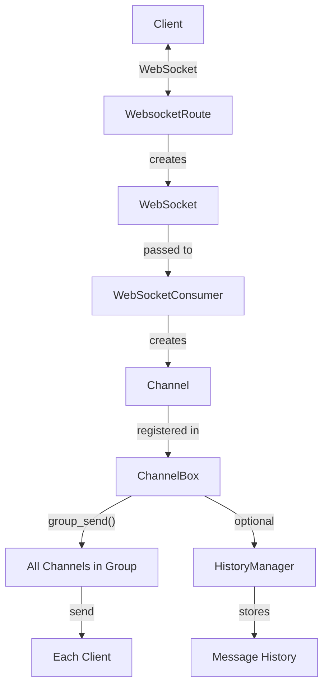
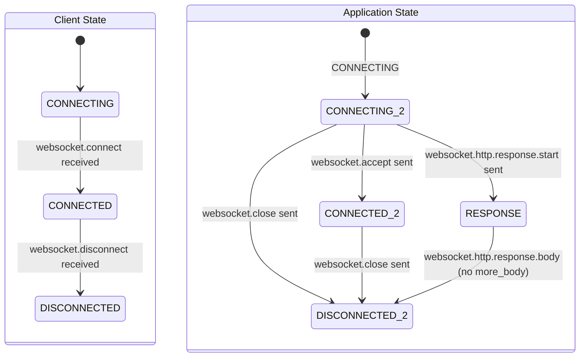
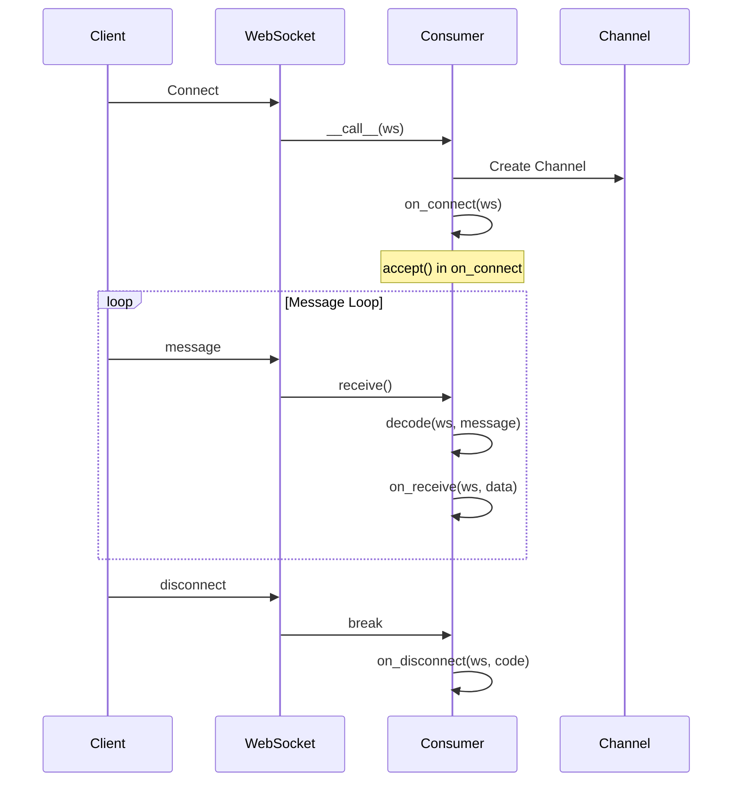

**Module:** `sillo.websockets`
**Source files:**
- `/Users/admin/sillo.build/core/sillo/websockets/base.py` (231 lines)
- `/Users/admin/sillo.build/core/sillo/websockets/consumers.py` (213 lines)
- `/Users/admin/sillo.build/core/sillo/websockets/channels.py` (277 lines)
- `/Users/admin/sillo.build/core/sillo/websockets/history.py` (124 lines)
- `/Users/admin/sillo.build/core/sillo/websockets/errors.py` (40 lines)
- `/Users/admin/sillo.build/core/sillo/websockets/status.py` (66 lines)
- `/Users/admin/sillo.build/core/sillo/websockets/utils.py` (48 lines)
- `/Users/admin/sillo.build/core/sillo/core/routing/websocket.py` (308 lines)

**Version:** 2026-08-11
**Audience:** Core maintainers, framework architects
**Purpose:** Deep documentation of the WebSocket state machine, consumers, channels, groups, history management, and error handling

---

## 1. Overview

The WebSocket subsystem provides a **full-duplex communication layer** built on the ASGI protocol. It includes:
- A strict state machine for connection lifecycle
- A consumer pattern for structured message handling
- Channel-based group messaging (pub/sub within a process)
- History management for message replay
- Error middleware for exception handling



---

## 2. WebSocketState

**File:** `/Users/admin/sillo.build/core/sillo/websockets/base.py`, line 15

```python
class WebSocketState(enum.Enum):
    CONNECTING = 0
    CONNECTED = 1
    DISCONNECTED = 2
    RESPONSE = 3
```

The `RESPONSE` state is used for HTTP upgrade denial. When a WebSocket
connection is rejected, the response is sent as an HTTP response.

---

## 3. The WebSocket Class

**File:** `/Users/admin/sillo.build/core/sillo/websockets/base.py` (231 lines)

```python
class WebSocket(HTTPConnection):
    def __init__(self, scope: Scope, receive: Receive, send: Send) -> None:
        super().__init__(scope, receive)
        assert scope["type"] == "websocket"
        self._receive = receive
        self._send = send
        self.client_state = WebSocketState.CONNECTING
        self.application_state = WebSocketState.CONNECTING
```

### 3.1 Dual State Machine

The WebSocket maintains **two independent state tracks:**

| Track | Variable | Purpose |
|-------|----------|---------|
| Client | `client_state` | Tracks messages received from the client |
| Application | `application_state` | Tracks messages sent by the application |



### 3.2 `receive()`: State-Validated Input

```python
async def receive(self) -> Message:
    if self.client_state == WebSocketState.CONNECTING:
        message = await self._receive()
        message_type = message["type"]
        if message_type != "websocket.connect":
            raise RuntimeError(f'Expected "websocket.connect", got {message_type!r}')
        self.client_state = WebSocketState.CONNECTED
        return message
    elif self.client_state == WebSocketState.CONNECTED:
        message = await self._receive()
        message_type = message["type"]
        if message_type not in {"websocket.receive", "websocket.disconnect"}:
            raise RuntimeError(f'Expected "websocket.receive" or "websocket.disconnect", got {message_type!r}')
        if message_type == "websocket.disconnect":
            self.client_state = WebSocketState.DISCONNECTED
        return message
    else:
        raise RuntimeError('Cannot call "receive" once a disconnect message has been received.')
```

### 3.3 `send()`: State-Validated Output

```python
async def send(self, message: Message) -> None:
    if self.application_state == WebSocketState.CONNECTING:
        message_type = message["type"]
        if message_type not in {"websocket.accept", "websocket.close", "websocket.http.response.start"}:
            raise RuntimeError(...)
        if message_type == "websocket.close":
            self.application_state = WebSocketState.DISCONNECTED
        elif message_type == "websocket.http.response.start":
            self.application_state = WebSocketState.RESPONSE
        else:
            self.application_state = WebSocketState.CONNECTED
        await self._send(message)
    elif self.application_state == WebSocketState.CONNECTED:
        message_type = message["type"]
        if message_type not in {"websocket.send", "websocket.close"}:
            raise RuntimeError(...)
        if message_type == "websocket.close":
            self.application_state = WebSocketState.DISCONNECTED
        try:
            await self._send(message)
        except OSError:
            self.application_state = WebSocketState.DISCONNECTED
            raise WebSocketDisconnect(code=1006)
    elif self.application_state == WebSocketState.RESPONSE:
        message_type = message["type"]
        if message_type != "websocket.http.response.body":
            raise RuntimeError(...)
        if not message.get("more_body", False):
            self.application_state = WebSocketState.DISCONNECTED
        await self._send(message)
    else:
        raise RuntimeError('Cannot call "send" once a close message has been sent.')
```

### 3.4 `accept()`

```python
async def accept(
    self,
    subprotocol: str | None = None,
    headers: Iterable[tuple[bytes, bytes]] | None = None,
) -> None:
    headers = headers or []
    if self.client_state == WebSocketState.CONNECTING:
        await self.receive()  # Wait for websocket.connect
    await self.send({
        "type": "websocket.accept",
        "subprotocol": subprotocol,
        "headers": headers,
    })
```

### 3.5 Receive Methods

```python
async def receive_text(self) -> str:
    if self.application_state != WebSocketState.CONNECTED:
        raise RuntimeError('WebSocket is not connected. Need to call "accept" first.')
    message = await self.receive()
    self._raise_on_disconnect(message)
    return message["text"]

async def receive_bytes(self) -> bytes:
    # Similar pattern

async def receive_json(self, mode: str = "text") -> Any:
    message = await self.receive()
    self._raise_on_disconnect(message)
    if mode == "text":
        text = message["text"]
    else:
        text = message["bytes"].decode("utf-8")
    return json.loads(text)
```

### 3.6 Iterators

```python
async def iter_text(self) -> AsyncIterator[str]:
    try:
        while True:
            yield await self.receive_text()
    except WebSocketDisconnect:
        pass

async def iter_bytes(self) -> AsyncIterator[bytes]:
    try:
        while True:
            yield await self.receive_bytes()
    except WebSocketDisconnect:
        pass

async def iter_json(self) -> AsyncIterator[Any]:
    try:
        while True:
            yield await self.receive_json()
    except WebSocketDisconnect:
        pass
```

All iterators silently catch `WebSocketDisconnect` to end the iteration cleanly.

### 3.7 Send Methods

```python
async def send_text(self, data: str) -> None:
    await self.send({"type": "websocket.send", "text": data})

async def send_bytes(self, data: bytes) -> None:
    await self.send({"type": "websocket.send", "bytes": data})

async def send_json(self, data: Any, mode: str = "text") -> None:
    text = json.dumps(data, separators=(",", ":"), ensure_ascii=False)
    if mode == "text":
        await self.send({"type": "websocket.send", "text": text})
    else:
        await self.send({"type": "websocket.send", "bytes": text.encode("utf-8")})
```

### 3.8 `close()` and `is_connected()`

```python
async def close(self, code: int = 1000, reason: str | None = None) -> None:
    await self.send({"type": "websocket.close", "code": code, "reason": reason or ""})

def is_connected(self) -> bool:
    return (
        self.client_state == WebSocketState.CONNECTED
        and self.application_state == WebSocketState.CONNECTED
    )
```

### 3.9 WebSocketDisconnect Exception

```python
class WebSocketDisconnect(Exception):
    def __init__(self, code: int = 1000, reason: str | None = None) -> None:
        self.code = code
        self.reason = reason or ""
```

---

## 4. WebSocketConsumer

**File:** `/Users/admin/sillo.build/core/sillo/websockets/consumers.py` (213 lines)

### 4.1 Class Structure

```python
class WebSocketConsumer:
    channel: Channel | None = None
    middleware: ClassVar[list[Any]] = []
    encoding: str | None = None

    def __init__(self, logging_enabled=True, logger=None):
        self.logging_enabled = logging_enabled
        self.logger = logger or logging.getLogger("sillo")
```

### 4.2 `as_route()`: Class Method

```python
@classmethod
def as_route(cls, path: str):
    from sillo.core.routing.websocket import WebsocketRoute

    async def handler(websocket: WebSocket, **kwargs):
        instance = cls()
        await instance(websocket, **kwargs)

    return WebsocketRoute(path, handler)
```

Creates a new consumer instance per connection. The consumer class is converted to a route that can be registered with the app.

### 4.3 `__call__()`: Connection Loop

```python
async def __call__(self, ws: WebSocket) -> None:
    self.websocket = ws
    self.channel = Channel(
        websocket=self.websocket,
        expires=3600,
        payload_type=(
            PayloadTypeEnum.JSON.value
            if self.encoding == "json"
            else PayloadTypeEnum.TEXT.value
        ),
    )
    await self.on_connect(self.websocket)

    close_code = status.WS_1000_NORMAL_CLOSURE

    try:
        while True:
            message = await self.websocket.receive()
            if message["type"] == "websocket.receive":
                data = await self.decode(self.websocket, message)
                await self.on_receive(self.websocket, data)
            elif message["type"] == "websocket.disconnect":
                close_code = int(message.get("code") or status.WS_1000_NORMAL_CLOSURE)
                break
    except Exception:
        close_code = status.WS_1011_INTERNAL_ERROR
        raise
    finally:
        await self.on_disconnect(self.websocket, close_code)
```



### 4.4 `decode()`: Message Decoding

```python
async def decode(self, websocket: WebSocket, message: Message) -> Any:
    if self.encoding == "text":
        if "text" not in message:
            await websocket.close(code=status.WS_1003_UNSUPPORTED_DATA)
            raise RuntimeError("Expected text websocket messages, but got bytes")
        return message["text"]

    elif self.encoding == "bytes":
        if "bytes" not in message:
            await websocket.close(code=status.WS_1003_UNSUPPORTED_DATA)
            raise RuntimeError("Expected bytes websocket messages, but got text")
        return message["bytes"]

    elif self.encoding == "json":
        text = message.get("text") or message["bytes"].decode("utf-8")
        try:
            return json.loads(text)
        except json.decoder.JSONDecodeError:
            await websocket.close(code=status.WS_1003_UNSUPPORTED_DATA)
            raise RuntimeError("Malformed JSON data received.")

    # No encoding: return raw text or bytes
    return message["text"] if message.get("text") else message["bytes"]
```

| Encoding | Expected Input | Output |
|----------|---------------|--------|
| `"text"` | `message["text"]` | `str` |
| `"bytes"` | `message["bytes"]` | `bytes` |
| `"json"` | text or bytes | Parsed `dict/list/etc.` |
| `None` | text or bytes | Raw `str` or `bytes` |

### 4.5 Lifecycle Hooks

```python
async def on_connect(self, websocket: WebSocket) -> None:
    await websocket.accept()

async def on_receive(self, websocket: WebSocket, data: Any) -> None:
    pass  # Override in subclass

async def on_disconnect(self, websocket: WebSocket, close_code: int) -> None:
    pass  # Override in subclass
```

### 4.6 Group Management

```python
async def broadcast(self, payload, group_name="default", save_history=False):
    await ChannelBox.group_send(group_name=group_name, payload=payload, save_history=save_history)

async def send_to(self, channel_id: uuid.UUID, payload):
    for channels in ChannelBox.CHANNEL_GROUPS.values():
        for channel in channels:
            if channel.uuid == channel_id:
                await channel._send(payload)
                return

async def join_group(self, group_name: str):
    if self.channel:
        await ChannelBox.add_channel_to_group(self.channel, group_name=group_name)

async def leave_group(self, group_name: str):
    if self.channel:
        await ChannelBox.remove_channel_from_group(self.channel, group_name=group_name)

async def group(self, group_name: str) -> list[Channel]:
    return list(ChannelBox.CHANNEL_GROUPS.get(group_name, {}).keys())
```

---

## 5. Channel

**File:** `/Users/admin/sillo.build/core/sillo/websockets/channels.py`, line 25

```python
class Channel:
    def __init__(self, websocket: WebSocket, payload_type: str, expires: int | None = None):
        assert isinstance(websocket, WebSocket)
        assert isinstance(payload_type, str) and payload_type in [
            PayloadTypeEnum.JSON.value,
            PayloadTypeEnum.TEXT.value,
            PayloadTypeEnum.BYTES.value,
        ]
        self.websocket = websocket
        self.expires = expires
        self.payload_type = payload_type
        self.uuid = uuid.uuid4()
        self.created = time.time()
```

### 5.1 `_send()`

```python
async def _send(self, payload: Any) -> None:
    try:
        if self.payload_type == "json":
            await self.websocket.send_json(payload)
        elif self.payload_type == "text":
            await self.websocket.send_text(payload)
        elif self.payload_type == "bytes":
            await self.websocket.send_bytes(payload)
        else:
            await self.websocket.send(payload)
    except RuntimeError as error:
        logging.debug(error)
    self.created = time.time()  # Reset TTL on activity
```

### 5.2 `_is_expired()`

```python
async def _is_expired(self) -> bool:
    if not self.expires:
        return False
    return (self.expires + int(self.created)) < time.time()
```

---

## 6. ChannelBox

**File:** `/Users/admin/sillo.build/core/sillo/websockets/channels.py`, line 85

```python
class ChannelBox:
    CHANNEL_GROUPS: ClassVar[dict[str, Any]] = {}
    HISTORY_SIZE: int = int(os.getenv("CHANNEL_BOX_HISTORY_SIZE", "1048576"))
    HISTORY_MANAGER: BaseHistoryManager = InMemoryHistoryManager(
        history_size=int(os.getenv("CHANNEL_BOX_HISTORY_SIZE", "1048576"))
    )
```

`ChannelBox` is a **singleton** (class-level state only, no instances). It manages all channel groups globally.

### 6.1 `add_channel_to_group()`

```python
@classmethod
async def add_channel_to_group(cls, channel: Channel, group_name: str = "default") -> ChannelAddStatusEnum:
    assert group_name, "Group name must to be set."
    if group_name not in cls.CHANNEL_GROUPS:
        cls.CHANNEL_GROUPS[group_name] = {}
        return ChannelAddStatusEnum.CHANNEL_ADDED
    else:
        cls.CHANNEL_GROUPS[group_name][channel] = ...
        return ChannelAddStatusEnum.CHANNEL_EXIST
```

Groups are stored as `dict[Channel, ...]`. The channel is the key, `...`
(Ellipsis) is the value. This provides O(1) lookup and deduplication.

### 6.2 `remove_channel_from_group()`

```python
@classmethod
async def remove_channel_from_group(cls, channel: Channel, group_name: str) -> ChannelRemoveStatusEnum:
    group = cls.CHANNEL_GROUPS.get(group_name)
    if group is None:
        await cls._clean_expired()
        return ChannelRemoveStatusEnum.GROUP_DOES_NOT_EXIST

    if group.pop(channel, _MISSING) is _MISSING:
        await cls._clean_expired()
        return ChannelRemoveStatusEnum.CHANNEL_DOES_NOT_EXIST

    if not group:
        cls.CHANNEL_GROUPS.pop(group_name, None)
        await cls._clean_expired()
        return ChannelRemoveStatusEnum.GROUP_REMOVED

    await cls._clean_expired()
    return ChannelRemoveStatusEnum.CHANNEL_REMOVED
```

Uses a sentinel `_MISSING = object()` to distinguish "not found" from "stored None".

### 6.3 `group_send()`

```python
@classmethod
async def group_send(cls, group_name="default", payload={}, save_history=False) -> GroupSendStatusEnum:
    if save_history:
        message = ChannelMessageDC(payload=payload)
        await cls.HISTORY_MANAGER.save_message(group_name, message)

    group_send_status = GroupSendStatusEnum.NO_SUCH_GROUP
    for channel in cls.CHANNEL_GROUPS.get(group_name, {}):
        await channel._send(payload)
        group_send_status = GroupSendStatusEnum.GROUP_SEND

    return group_send_status
```

### 6.4 `_clean_expired()`

```python
@classmethod
async def _clean_expired(cls) -> None:
    for group_name in list(cls.CHANNEL_GROUPS):
        for channel in list(cls.CHANNEL_GROUPS.get(group_name, {})):
            if await channel._is_expired():
                try:
                    del cls.CHANNEL_GROUPS[group_name][channel]
                except KeyError:
                    pass
        if not any(cls.CHANNEL_GROUPS.get(group_name, {})):
            try:
                del cls.CHANNEL_GROUPS[group_name]
            except KeyError:
                pass
```

Snapshots the dict keys before iterating to avoid "dictionary changed size during iteration" errors.

### 6.5 Other Methods

| Method | Description |
|--------|-------------|
| `show_groups()` | Return the full `CHANNEL_GROUPS` dict |
| `flush_groups()` | Clear all groups |
| `show_history(group_name)` | Get message history |
| `flush_history(group_name)` | Clear message history |
| `set_history_manager(manager)` | Replace the history manager |
| `close_all_connections()` | Close all WebSocket connections |

---

## 7. History Management

**File:** `/Users/admin/sillo.build/core/sillo/websockets/history.py` (124 lines)

### 7.1 BaseHistoryManager (ABC)

```python
class BaseHistoryManager(ABC):
    @abstractmethod
    async def save_message(self, group_name: str, message: ChannelMessageDC) -> None: ...

    @abstractmethod
    async def get_history(self, group_name: str | None = None) -> list[ChannelMessageDC] | dict[str, list[ChannelMessageDC]]: ...

    @abstractmethod
    async def flush_history(self, group_name: str | None = None) -> None: ...
```

### 7.2 InMemoryHistoryManager

```python
class InMemoryHistoryManager(BaseHistoryManager):
    def __init__(self, history_size: int = 1_048_576):
        self._history: dict[str, list[ChannelMessageDC]] = {}
        self._max_size = history_size

    async def save_message(self, group_name, message):
        if group_name not in self._history:
            self._history[group_name] = []
        self._history[group_name].append(message)
        # Trim to max size
        if len(self._history[group_name]) > self._max_size:
            self._history[group_name] = self._history[group_name][-self._max_size:]

    async def get_history(self, group_name=None):
        if group_name:
            return self._history.get(group_name, [])
        return dict(self._history)

    async def flush_history(self, group_name=None):
        if group_name:
            self._history.pop(group_name, None)
        else:
            self._history.clear()
```

**Default size:** 1,048,576 messages (1M entries). Configurable via `CHANNEL_BOX_HISTORY_SIZE` env var.

### 7.3 NoOpHistoryManager

```python
class NoOpHistoryManager(BaseHistoryManager):
    async def save_message(self, group_name, message): pass
    async def get_history(self, group_name=None): return [] if group_name else {}
    async def flush_history(self, group_name=None): pass
```

Used when message history is not needed.

### 7.4 ChannelMessageDC

**File:** `/Users/admin/sillo.build/core/sillo/websockets/utils.py`, line 40

```python
@dataclass
class ChannelMessageDC:
    payload: str | bytes
    uuid: UUID = field(default_factory=uuid.uuid4)
    created: datetime = field(default_factory=lambda: datetime.now(tz=timezone.utc))
```

---

## 8. Error Handling

**File:** `/Users/admin/sillo.build/core/sillo/websockets/errors.py` (40 lines)

### 8.1 WebSocketErrorMiddleware

```python
class WebSocketErrorMiddleware:
    def __init__(self, app: ASGIApp):
        self.app = app

    async def __call__(self, scope: Scope, receive: Receive, send: Send):
        if scope["type"] == "websocket":
            websocket = WebSocket(scope, receive, send)
            try:
                await self.app(scope, receive, send)
            except WebSocketException as exc:
                await websocket_exception_handler(websocket, exc)
        else:
            await self.app(scope, receive, send)
```

### 8.2 Default Exception Handler

```python
async def websocket_exception_handler(websocket: WebSocket, exc: WebSocketException):
    await websocket.close(code=exc.code, reason=str(exc))
```

---

## 9. IANA Status Codes

**File:** `/Users/admin/sillo.build/core/sillo/websockets/status.py` (66 lines)

| Constant | Code | Description |
|----------|------|-------------|
| `WS_1000_NORMAL_CLOSURE` | 1000 | Normal closure |
| `WS_1001_GOING_AWAY` | 1001 | Endpoint going away |
| `WS_1002_PROTOCOL_ERROR` | 1002 | Protocol error |
| `WS_1003_UNSUPPORTED_DATA` | 1003 | Unsupported data type |
| `WS_1005_NO_STATUS_RCVD` | 1005 | No status received |
| `WS_1006_ABNORMAL_CLOSURE` | 1006 | Abnormal closure |
| `WS_1007_INVALID_FRAME_PAYLOAD_DATA` | 1007 | Invalid frame payload |
| `WS_1008_POLICY_VIOLATION` | 1008 | Policy violation |
| `WS_1009_MESSAGE_TOO_BIG` | 1009 | Message too big |
| `WS_1010_MANDATORY_EXT` | 1010 | Mandatory extension |
| `WS_1011_INTERNAL_ERROR` | 1011 | Internal server error |
| `WS_1012_SERVICE_RESTART` | 1012 | Service restart |
| `WS_1013_TRY_AGAIN_LATER` | 1013 | Try again later |
| `WS_1014_BAD_GATEWAY` | 1014 | Bad gateway |
| `WS_1015_TLS_HANDSHAKE` | 1015 | TLS handshake failure |

**Deprecated aliases:**
- `WS_1004_NO_STATUS_RCVD` → 1004 (reserved, should not be used)
- `WS_1005_ABNORMAL_CLOSURE` → 1005 (duplicate of `WS_1005_NO_STATUS_RCVD`)

---

## 10. WebSocket Routing

**File:** `/Users/admin/sillo.build/core/sillo/core/routing/websocket.py` (308 lines)

```python
class WebsocketRoute(BaseRoute):
    def __init__(self, path: str, handler: WsHandlerType):
        # Compile path pattern
        # Store handler

    def match(self, scope: Scope) -> tuple[Any, Any]:
        # Match path against compiled pattern
        # Return (path_params, remaining_scope) or raise/no-match

    async def handle(self, scope: Scope, receive: Receive, send: Send) -> None:
        # Create WebSocket from scope
        # Apply error middleware
        # Call handler(websocket, **path_params)

    def url_path_for(self, name: str, **path_params) -> URLPath:
        # Generate URL for this route
```

---

## 11. Usage Patterns

### 11.1 Basic Consumer

```python
from sillo.websockets import WebSocketConsumer, WebSocket

class ChatConsumer(WebSocketConsumer):
    encoding = "json"

    async def on_connect(self, websocket: WebSocket):
        await websocket.accept()
        await self.join_group("chat")

    async def on_receive(self, websocket: WebSocket, data: dict):
        await self.broadcast(data, group_name="chat")

    async def on_disconnect(self, websocket: WebSocket, close_code: int):
        await self.leave_group("chat")

# Register route
app.route(ChatConsumer.as_route("/ws/chat"))
```

### 11.2 Direct WebSocket Handler

```python
async def websocket_handler(websocket: WebSocket):
    await websocket.accept()
    try:
        while True:
            data = await websocket.receive_json()
            await websocket.send_json({"echo": data})
    except WebSocketDisconnect:
        pass

app.websocket("/ws/echo")(websocket_handler)
```

### 11.3 Custom History Manager

```python
from sillo.websockets import ChannelBox, NoOpHistoryManager

# Disable history for production
ChannelBox.set_history_manager(NoOpHistoryManager())

# Or use in-memory with custom size
from sillo.websockets import InMemoryHistoryManager
ChannelBox.set_history_manager(InMemoryHistoryManager(history_size=10_000))
```

---

## 12. Supporting Enums

**File:** `/Users/admin/sillo.build/core/sillo/websockets/utils.py`

```python
class ChannelAddStatusEnum(Enum):
    CHANNEL_ADDED = "CHANNEL_ADDED"
    CHANNEL_EXIST = "CHANNEL_EXIST"

class ChannelRemoveStatusEnum(Enum):
    CHANNEL_REMOVED = "CHANNEL_REMOVED"
    CHANNEL_DOES_NOT_EXIST = "CHANNEL_DOES_NOT_EXIST"
    GROUP_REMOVED = "GROUP_REMOVED"
    GROUP_DOES_NOT_EXIST = "GROUP_DOES_NOT_EXIST"

class GroupSendStatusEnum(Enum):
    GROUP_SEND = "GROUP_SEND"
    NO_SUCH_GROUP = "NO_SUCH_GROUP"

class PayloadTypeEnum(Enum):
    JSON = "json"
    TEXT = "text"
    BYTES = "bytes"
```

---

## 13. Design Decisions

### D-1: Dual State Machine
The client/application state split mirrors the ASGI spec's design. The client state tracks what the client has sent; the application state tracks what the server has sent. Both must be `CONNECTED` for `is_connected()` to return `True`.

### D-2: Class-Level ChannelBox
`ChannelBox` uses only class-level state (no instances). This makes it a
process-wide singleton that all consumers share. The trade-off is that it
cannot be used across processes, for multi-process deployments, use the events
system with Redis transport.

### D-3: Channel as Dict Key
Channels are stored as dict keys in `CHANNEL_GROUPS`. This provides O(1) lookup and automatic deduplication (a channel can only be in a group once).

### D-4: Sentinel for dict.pop
`_MISSING = object()` is used as a sentinel in `group.pop(channel, _MISSING)` to distinguish "channel not found" from "channel stored None".

### D-5: Expired Channel Cleanup
`_clean_expired()` is called on every `remove_channel_from_group()` call. This
is a lazy cleanup strategy. Expired channels are only removed when the groups
are actively being modified.

---

## 14. Source Traceability

| Component | File | Lines |
|-----------|------|-------|
| `WebSocketState` enum | `core/sillo/websockets/base.py` | 15-21 |
| `WebSocketDisconnect` | `core/sillo/websockets/base.py` | 24-30 |
| `WebSocket` class | `core/sillo/websockets/base.py` | 33-231 |
| `WebSocketConsumer` | `core/sillo/websockets/consumers.py` | 19-213 |
| `Channel` | `core/sillo/websockets/channels.py` | 25-82 |
| `ChannelBox` | `core/sillo/websockets/channels.py` | 85-277 |
| `BaseHistoryManager` | `core/sillo/websockets/history.py` | 7-49 |
| `InMemoryHistoryManager` | `core/sillo/websockets/history.py` | 52-98 |
| `NoOpHistoryManager` | `core/sillo/websockets/history.py` | 100-124 |
| `WebSocketErrorMiddleware` | `core/sillo/websockets/errors.py` | 20-40 |
| Status codes | `core/sillo/websockets/status.py` | 1-66 |
| Enums | `core/sillo/websockets/utils.py` | 1-48 |
| `WebsocketRoute` | `core/sillo/core/routing/websocket.py` | 21-308 |
