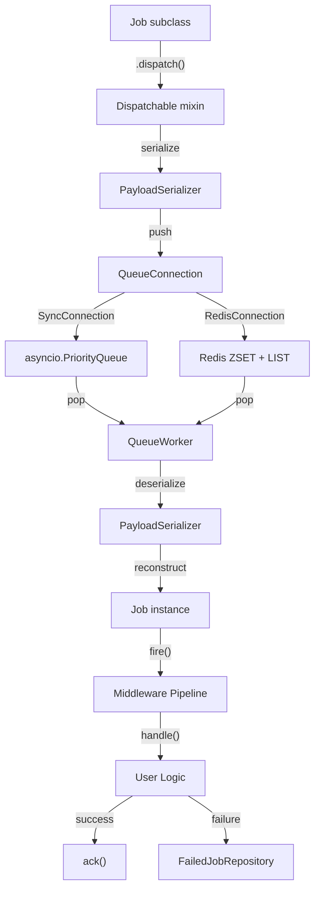
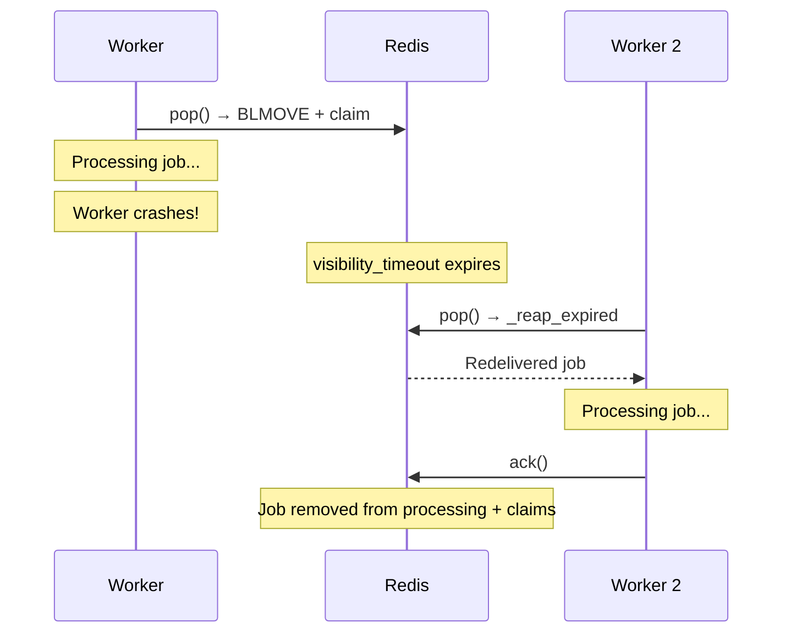
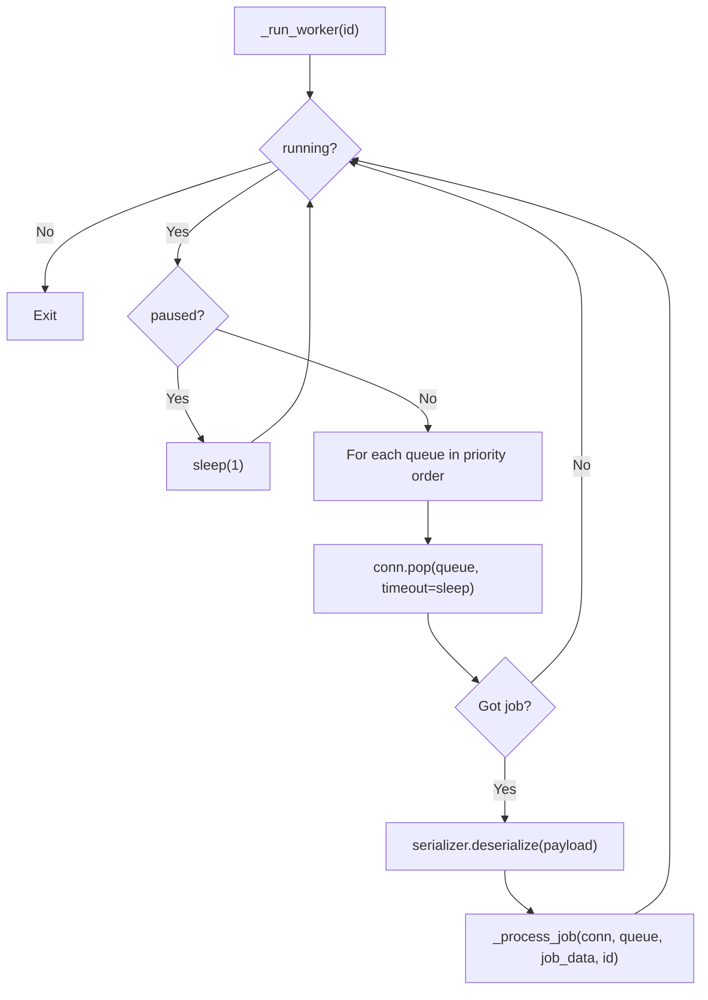

**Module:** `sillo.work.queue`
**Source files:**
- `/Users/admin/sillo.build/core/sillo/work/queue/connection.py` (453 lines)
- `/Users/admin/sillo.build/core/sillo/work/queue/job.py` (292 lines)
- `/Users/admin/sillo.build/core/sillo/work/queue/workers.py` (304 lines)
- `/Users/admin/sillo.build/core/sillo/work/queue/payloads.py` (77 lines)
- `/Users/admin/sillo.build/core/sillo/work/queue/middleware.py` (145 lines)
- `/Users/admin/sillo.build/core/sillo/work/queue/batches.py` (158 lines)
- `/Users/admin/sillo.build/core/sillo/work/queue/events.py` (201 lines)
- `/Users/admin/sillo.build/core/sillo/work/queue/listener.py` (154 lines)
- `/Users/admin/sillo.build/core/sillo/work/queue/failed.py` (117 lines)
- `/Users/admin/sillo.build/core/sillo/work/backends.py` (379 lines)

**Version:** 2026-08-11 **Audience:** Core maintainers, framework architects
**Purpose:** Deep documentation of the queue subsystem: backends, connections,
jobs, workers, middleware, batches, events, and failed job handling

---

## 1. Overview

The queue system provides **Laravel-inspired** background job processing. Jobs are serialized, pushed onto a queue connection, and consumed by long-running workers. The system supports multiple backends (in-memory, Redis), middleware pipelines, retries, batching, chaining, and event-driven observability.



---

## 2. Legacy Backends

**File:** `/Users/admin/sillo.build/core/sillo/work/backends.py` (379 lines)

The legacy backends (`MemoryBackend`, `RedisBackend`) are the original persistence layer. They operate on `Task` objects directly and are used by the lower-level task system. The newer queue system uses `QueueConnection` abstractions instead.

### 2.1 MemoryBackend

```python
class MemoryBackend:
    def __init__(self, max_size=None):
        self._queues: dict[str, list] = {}  # heapq per queue name
        self._results: dict[str, TaskResult] = {}
        self._dedup: dict[str, set[str]] = {}
```

**Implementation details:**
- Each named queue is a Python `list` managed as a min-heap via `heapq`
- `enqueue()` uses `heapq.heappush`: O(log n)
- `dequeue()` uses `heapq.heappop`: O(log n)
- Task ordering follows `Task.__lt__`: higher priority first, then FIFO by creation time
- Results stored in a flat dict keyed by `task_id`
- Deduplication tracked per queue via a set of dedup keys

### 2.2 RedisBackend

```python
class RedisBackend:
    def __init__(self, url="redis://localhost:6379", *, prefix="sillo:work:", task_registry=None):
```

**Implementation details:**
- Uses Redis sorted sets (ZSET) for priority ordering
- Score = `-(priority * 1_000_000) + timestamp`: higher priority gets lower
  score (dequeued first)
- Results stored with TTL of 86400 seconds (24 hours)
- Deduplication uses `SET NX` for atomic check-and-claim
- Lazy connection: `self._redis` is created on first use
- Task registry maps function names to callables for deserialization

---

## 3. QueueConnection ABC

**File:** `/Users/admin/sillo.build/core/sillo/work/queue/connection.py`, line 29

```python
class QueueConnection(ABC):
    @abstractmethod
    async def push(self, queue_name: str, payload: str, *, delay: int = 0) -> str: ...

    @abstractmethod
    async def pop(self, queue_name: str, *, timeout: float = 0) -> tuple[str, str] | None: ...

    @abstractmethod
    async def size(self, queue_name: str) -> int: ...

    async def clear(self, queue_name: str) -> None: ...
    async def ack(self, queue_name: str, job_id: str) -> None: ...
    async def fail(self, queue_name: str, job_id: str, payload: str, exception: str) -> None: ...
```

The abstract interface defines six operations. `push`, `pop`, and `size` are abstract; `clear`, `ack`, and `fail` have default no-op implementations.

---

## 4. SyncConnection

**File:** `/Users/admin/sillo.build/core/sillo/work/queue/connection.py`, line 80

```python
class SyncConnection(QueueConnection):
    def __init__(self):
        self._queues: dict[str, asyncio.PriorityQueue] = {}
        self._delayed: dict[str, list[tuple[float, str, str]]] = {}
        self._pending: dict[str, dict[str, str]] = {}
        self._acks: dict[str, set[str]] = {}
```

### 4.1 Data Structures

| Structure | Type | Purpose |
|-----------|------|---------|
| `_queues` | `dict[str, asyncio.PriorityQueue]` | Ready jobs, ordered by priority |
| `_delayed` | `dict[str, list[tuple[float, str, str]]]` | Delayed jobs: `(fire_at, job_id, payload)` |
| `_pending` | `dict[str, dict[str, str]]` | All jobs ever pushed: `{job_id: payload}` |
| `_acks` | `dict[str, set[str]]` | Acknowledged job IDs |

### 4.2 Push

```python
async def push(self, queue_name: str, payload: str, *, delay: int = 0) -> str:
    self._ensure(queue_name)
    job_id = uuid.uuid4().hex
    if delay > 0:
        self._delayed[queue_name].append((time.monotonic() + delay, job_id, payload))
    else:
        await self._queues[queue_name].put((0, job_id, payload))
    self._pending[queue_name][job_id] = payload
    return job_id
```

Delayed jobs are stored in a list sorted by fire time. They are released to the ready queue on the next `pop()` call.

### 4.3 Pop

```python
async def pop(self, queue_name: str, *, timeout: float = 0) -> tuple[str, str] | None:
    self._ensure(queue_name)
    self._release_delayed(queue_name)  # Move due delayed jobs to ready
    try:
        _, job_id, payload = await asyncio.wait_for(
            self._queues[queue_name].get(), timeout=timeout or None
        )
        return job_id, payload
    except asyncio.TimeoutError:
        return None
```

### 4.4 Delayed Job Release

```python
def _release_delayed(self, name: str) -> None:
    now = time.monotonic()
    remaining = []
    for when, jid, payload in self._delayed[name]:
        if when <= now:
            self._queues[name].put_nowait((0, jid, payload))
        else:
            remaining.append((when, jid, payload))
    self._delayed[name] = remaining
```

---

## 5. RedisConnection

**File:** `/Users/admin/sillo.build/core/sillo/work/queue/connection.py`, line 226

```python
class RedisConnection(QueueConnection):
    def __init__(
        self,
        url="redis://localhost:6379",
        *,
        prefix="sillo:queue:",
        visibility_timeout=300.0,
    ):
```

### 5.1 Four Keys Per Queue

Each logical queue occupies four Redis keys:

| Key Pattern | Redis Type | Purpose |
|-------------|-----------|---------|
| `{prefix}{queue}` | LIST | Ready jobs (workers take from here) |
| `{prefix}{queue}:delayed` | ZSET | Delayed jobs (score = fire timestamp) |
| `{prefix}{queue}:processing` | LIST | Jobs currently held by workers |
| `{prefix}{queue}:claims` | ZSET | Deadlines for held jobs (score = expiry) |

```python
def _keys(self, queue_name: str) -> tuple[str, str, str, str]:
    key = f"{self.prefix}{queue_name}"
    return key, f"{key}:delayed", f"{key}:processing", f"{key}:claims"
```

### 5.2 Four Lua Scripts

**File:** `/Users/admin/sillo.build/core/sillo/work/queue/connection.py`, lines
162 to 223

#### `_MIGRATE_LUA`: Move Due Delayed Jobs

```lua
local due = redis.call('ZRANGEBYSCORE', KEYS[1], '-inf', ARGV[1])
for i = 1, #due do
    redis.call('LPUSH', KEYS[2], due[i])
    redis.call('ZREM', KEYS[1], due[i])
end
return #due
```

Atomically moves every delayed job whose score ≤ now onto the ready list. The read-then-write this replaces could not be made safe from the client: two workers seeing the same due set and pushing it twice.

#### `_CLAIM_LUA`: Take and Claim Atomically

```lua
local raw = redis.call('RPOP', KEYS[1])
if not raw then return false end
redis.call('LPUSH', KEYS[2], raw)
redis.call('ZADD', KEYS[3], ARGV[1], raw)
return raw
```

Takes one job from the ready list and claims it in a single atomic operation.
The move and claim must happen together. A crash between them leaves an entry
in `processing` that no deadline covers.

#### `_REAP_LUA`: Return Expired Claims

```lua
local expired = redis.call('ZRANGEBYSCORE', KEYS[2], '-inf', ARGV[1])
for i = 1, #expired do
    if redis.call('LREM', KEYS[1], 1, expired[i]) > 0 then
        redis.call('LPUSH', KEYS[3], expired[i])
    end
    redis.call('ZREM', KEYS[2], expired[i])
end
local held = redis.call('LRANGE', KEYS[1], 0, -1)
for i = 1, #held do
    if redis.call('ZSCORE', KEYS[2], held[i]) == false then
        redis.call('ZADD', KEYS[2], ARGV[2], held[i])
    end
end
return #expired
```

Two jobs in one script:
1. Any claim past its deadline goes back to the ready list (recovery for crashed workers)
2. Anything in `processing` with no claim at all gets one (entry from crash between BLMOVE and claim)

#### `_ACK_LUA`: Drop Finished Claim

```lua
local held = redis.call('LRANGE', KEYS[1], 0, -1)
local prefix = ARGV[1] .. ':'
for i = 1, #held do
    if string.sub(held[i], 1, string.len(prefix)) == prefix then
        redis.call('LREM', KEYS[1], 1, held[i])
        redis.call('ZREM', KEYS[2], held[i])
        return 1
    end
end
return 0
```

Scans the in-flight list for a job with the given ID prefix and removes it from both `processing` and `claims`.

### 5.3 Push

```python
async def push(self, queue_name: str, payload: str, *, delay: int = 0) -> str:
    r = await self._r()
    job_id = uuid.uuid4().hex
    key, delayed, _, _ = self._keys(queue_name)
    if delay > 0:
        await r.zadd(delayed, {f"{job_id}:{payload}": time.time() + delay})
    else:
        await r.lpush(key, f"{job_id}:{payload}")
    return job_id
```

The payload is stored as `{job_id}:{payload}`. The ID prefix enables the ACK
Lua script to find and remove the right entry.

### 5.4 Pop: BLMOVE + Claim

```python
async def pop(self, queue_name: str, *, timeout: float = 0) -> tuple[str, str] | None:
    r = await self._r()
    key, _delayed, processing, claims = self._keys(queue_name)

    await self._migrate_delayed(r, key)
    await self._reap_expired(r, queue_name)

    deadline = time.time() + self.visibility_timeout

    if timeout > 0:
        raw = await r.blmove(key, processing, timeout, "RIGHT", "LEFT")
        if raw:
            await r.zadd(claims, {raw: deadline})
    else:
        raw = await r.eval(_CLAIM_LUA, 3, key, processing, claims, deadline)

    if not raw:
        return None
    jid, _, payload = raw.partition(":")
    return jid, payload
```

**Two paths:**
- **Blocking** (`timeout > 0`): Uses `BLMOVE` (blocks until a job appears), then claims separately
- **Non-blocking** (`timeout = 0`): Uses `_CLAIM_LUA` for atomic take-and-claim

### 5.5 At-Least-Once Delivery Guarantee



**The cost:** A job can run twice (if it outlives its visibility timeout while still working, or if a worker dies after finishing but before acknowledging). **Jobs must be idempotent.**

---

## 6. ConnectionManager

**File:** `/Users/admin/sillo.build/core/sillo/work/queue/connection.py`, line 420

```python
class ConnectionManager:
    def __init__(self):
        self._connections: dict[str, QueueConnection] = {}

    def add(self, name: str, connection: QueueConnection) -> ConnectionManager:
        self._connections[name] = connection
        return self

    def connection(self, name: str = "default") -> QueueConnection:
        if name not in self._connections:
            raise KeyError(f"Queue connection '{name}' not registered.")
        return self._connections[name]
```

A simple broker that maps string names to connection instances. `add()` returns `self` for chaining.

---

## 7. Dispatchable Mixin and Job Base Class

**File:** `/Users/admin/sillo.build/core/sillo/work/queue/job.py`

### 7.1 Dispatchable Mixin

```python
class Dispatchable:
    _connection: ClassVar[Any | None] = None
    _queue_name: ClassVar[str] = "default"
```

Adds class methods to any job class:

| Method | Async? | Description |
|--------|--------|-------------|
| `dispatch(*args, **kwargs)` | Yes | Push to queue immediately |
| `dispatch_after(delay, *args, **kwargs)` | Yes | Push with delay |
| `dispatch_blocking(*args, **kwargs)` | No | Push from sync code (creates event loop) |
| `dispatch_sync(*args, **kwargs)` | No | Run inline from sync code |
| `perform_now(*args, **kwargs)` | Yes | Run inline from async code |
| `on_queue(queue)` |  | Set target queue name |
| `on_connection(conn)` |  | Set queue connection |
| `job_reference()` |  | Returns `"module.ClassName"` |

### 7.2 Job Base Class

```python
class Job(Dispatchable):
    queue: ClassVar[str] = "default"
    connection_name: ClassVar[str] = "default"
    tries: ClassVar[int] = 1
    timeout: ClassVar[float | None] = 30.0
    backoff: ClassVar[int] = 0
    delete_when_completed: ClassVar[bool] = True
    middleware: ClassVar[list[Any]] = []

    async def handle(self) -> Any:
        raise NotImplementedError("Subclasses must implement handle()")

    async def failed(self, exception: Exception) -> None:
        pass  # Override for custom failure handling

    async def fire(self) -> Any:
        # Execute through middleware pipeline with timeout
```

### 7.3 The `fire()` Method

```python
async def fire(self) -> Any:
    self._started_at = time.time()
    pipeline = self.middleware_pipeline()

    async def call_handle():
        if self.timeout:
            return await asyncio.wait_for(self.handle(), timeout=self.timeout)
        return await self.handle()

    handler = call_handle
    for mw in reversed(pipeline):
        handler = mw(handler)

    return await handler()
```

Middleware is applied in reverse order so that the first middleware in the list is the outermost wrapper.

### 7.4 Payload Serialization

```python
def _encode_payload(cls, args, kwargs) -> str:
    return json.dumps({
        "job": cls.job_reference(),
        "args": list(args),
        "kwargs": kwargs,
    }, default=str)
```

The payload records the fully-qualified class name so the worker can import and reconstruct it.

---

## 8. PayloadSerializer

**File:** `/Users/admin/sillo.build/core/sillo/work/queue/payloads.py`

```python
class PayloadSerializer:
    def serialize(self, job_class, data, *, max_tries=1, timeout=None, delay=0, queue="default") -> str:
        return json.dumps({
            "job": job_class.job_reference() if hasattr(job_class, 'job_reference') else job_class.__name__,
            "maxTries": max_tries,
            "timeout": timeout,
            "delay": delay,
            "queue": queue,
            "data": data,
        }, default=str)

    def deserialize(self, payload_str: str) -> dict[str, Any]:
        return json.loads(payload_str)
```

---

## 9. Queue Middleware

**File:** `/Users/admin/sillo.build/core/sillo/work/queue/middleware.py`

Three middleware classes for the queue `Job` pipeline (distinct from task middleware):

### 9.1 RetryMiddleware

```python
class RetryMiddleware:
    def __init__(self, max_attempts=3, base_delay=1.0, max_delay=60.0):
        self.max_attempts = max_attempts
        self.base_delay = base_delay
        self.max_delay = max_delay

    def __call__(self, handler: JobHandler) -> JobHandler:
        async def wrapped():
            for attempt in range(self.max_attempts):
                try:
                    return await handler()
                except Exception:
                    if attempt == self.max_attempts - 1:
                        raise
                    delay = min(self.base_delay * (2 ** attempt), self.max_delay)
                    await asyncio.sleep(delay)
        return wrapped
```

### 9.2 RateLimitMiddleware

```python
class RateLimitMiddleware:
    def __init__(self, max_jobs=10, per_seconds=60.0, burst=1):
        # Token bucket: max_jobs tokens refill over per_seconds
```

### 9.3 TimeoutMiddleware

```python
class TimeoutMiddleware:
    def __init__(self, seconds=30.0):
        self.seconds = seconds

    def __call__(self, handler: JobHandler) -> JobHandler:
        async def wrapped():
            return await asyncio.wait_for(handler(), timeout=self.seconds)
        return wrapped
```

---

## 10. QueueWorker

**File:** `/Users/admin/sillo.build/core/sillo/work/queue/workers.py`, line 64

### 10.1 WorkerOptions

```python
class WorkerOptions:
    def __init__(
        self,
        *,
        concurrency=4,
        memory_limit=128,    # MB
        timeout=60.0,        # Max job seconds
        sleep=3.0,           # Empty queue sleep
        max_jobs=0,          # 0 = unlimited
        max_exec_time=0,     # 0 = unlimited
        queues=["default"],
        backoff=0.0,
    ):
```

### 10.2 QueueWorker

```python
class QueueWorker:
    def __init__(self, manager, serializer, failed_repo, *, options=None):
        self.manager = manager
        self.serializer = serializer
        self.failed_repo = failed_repo
        self.options = options or WorkerOptions()
        self._running = False
        self._shutting_down = False
        self._paused = False
        self._active: set[asyncio.Task] = set()
        self._jobs_processed = 0
```

### 10.3 Signal Handling

```python
def _register_signals(self) -> None:
    try:
        loop = asyncio.get_event_loop()
        for sig in (signal.SIGINT, signal.SIGTERM):
            loop.add_signal_handler(sig, self.stop)
    except NotImplementedError:
        pass  # Windows
```

### 10.4 The `_run_worker` Loop



### 10.5 Job Processing

```python
async def _process_job(self, conn, queue_name, job_data, worker_id):
    job_id = job_data.get("_job_id", "unknown")
    job_class_name = job_data.get("job", "unknown")

    try:
        job_cls = self._resolve_job_class(job_class_name)
        job_instance = self._build_job(job_cls, job_data)
        await job_instance.fire()
        await conn.ack(queue_name, job_id)
        self._jobs_processed += 1
    except Exception as exc:
        await self.failed_repo.log(queue=queue_name, job_id=job_id, ...)
```

### 10.6 Job Class Resolution

```python
def _resolve_job_class(self, name: str) -> type:
    module_path, _, attribute = name.rpartition(".")
    if module_path:
        module = importlib.import_module(module_path)
        return getattr(module, attribute)

    # Bare name: search imported subclasses
    found = self._search_subclasses(name)
    if found is not None:
        return found

    raise RuntimeError(f"Cannot resolve job class: {name}")
```

The worker resolves job classes by:
1. Fully-qualified name (`module.ClassName`) → `importlib.import_module`
2. Bare name → DFS of `Dispatchable.__subclasses__()`

---

## 11. WorkerPool

**File:** `/Users/admin/sillo.build/core/sillo/work/queue/workers.py`, line 275

```python
class WorkerPool:
    def __init__(self):
        self._workers: list[QueueWorker] = []
        self._tasks: list[asyncio.Task] = []

    def add(self, worker: QueueWorker) -> WorkerPool:
        self._workers.append(worker)
        return self

    async def start(self) -> None:
        self._tasks = [asyncio.create_task(w.run()) for w in self._workers]

    async def shutdown(self) -> None:
        for w in self._workers:
            w.stop()
        await asyncio.gather(*self._tasks, return_exceptions=True)
```

---

## 12. Event System (Queue-Level)

**File:** `/Users/admin/sillo.build/core/sillo/work/queue/events.py`

### 12.1 Event Base Class

```python
@dataclass
class Event:
    _fired_at: float = field(default_factory=time.time, init=False)
    _propagation_stopped: bool = field(default=False, init=False)

    def stop_propagation(self) -> None:
        self._propagation_stopped = True
```

### 12.2 `listen` Decorator

```python
def listen(*events: type[Event], priority: int = 0) -> Callable:
    def decorator(func):
        for event_type in events:
            _global_registry.setdefault(event_type, []).append(
                ListenerRegistration(callback=func, event_type=event_type, priority=priority)
            )
        return func
    return decorator
```

### 12.3 EventDispatcher

```python
class EventDispatcher:
    def __init__(self):
        self._listeners: dict[type[Event], list[ListenerRegistration]] = {}
        self._wildcards: list[ListenerRegistration] = []

    def register(self, event_type, callback, *, priority=0, name=""): ...
    def register_wildcard(self, callback, *, priority=0): ...
    def forget(self, event_type, callback) -> bool: ...
    def has_listeners(self, event_type) -> bool: ...

    async def dispatch(self, event: E) -> E:
        # Fire typed listeners by priority
        # Fire wildcard listeners
        # Support stop_propagation
```

### 12.4 WildcardListener

**File:** `/Users/admin/sillo.build/core/sillo/work/queue/listener.py`

```python
class WildcardListener:
    def __init__(self, pattern, callback, *, priority=0, once=False, guard=None):
        self.pattern = pattern
        self.callback = callback
        self.priority = priority
        self.once = once
        self.guard = guard

    def matches(self, event_name: str) -> bool:
        return fnmatch.fnmatch(event_name, self.pattern)
```

---

## 13. Batches

**File:** `/Users/admin/sillo.build/core/sillo/work/queue/batches.py`

### 13.1 Batch

```python
class Batch:
    def __init__(self, name, *, on_complete=None, allow_failures=False, timeout=None):
        self.name = name
        self._jobs: dict[str, str] = {}  # job_id → status
        self._failed: dict[str, str] = {}  # job_id → error
        self._on_complete = on_complete
        self._allow_failures = allow_failures
        self._done = asyncio.Event()

    def add(self, job_id: str) -> Batch: ...
    def mark_complete(self, job_id: str) -> None: ...
    def mark_failed(self, job_id: str, error: str) -> None: ...
    async def wait(self, timeout=None) -> None: ...
```

### 13.2 JobChain

```python
class JobChain:
    def __init__(self):
        self._jobs: list = []

    def then(self, job) -> JobChain:
        self._jobs.append(job)
        return self

    async def run(self) -> list[Any]:
        results = []
        for job in self._jobs:
            result = await job.perform_now()
            results.append(result)
        return results
```

---

## 14. FailedJobRepository

**File:** `/Users/admin/sillo.build/core/sillo/work/queue/failed.py`

### 14.1 FailedJob Dataclass

```python
@dataclass
class FailedJob:
    id: str
    queue: str
    job_class: str
    payload: str
    exception: str
    failed_at: float = field(default_factory=time.time)
```

### 14.2 Abstract Interface

```python
class FailedJobRepository(ABC):
    @abstractmethod
    async def log(self, queue, job_id, job_class, payload, exception) -> None: ...

    @abstractmethod
    async def all(self, limit=50, offset=0) -> list[FailedJob]: ...

    @abstractmethod
    async def find(self, job_id) -> FailedJob | None: ...

    @abstractmethod
    async def forget(self, job_id) -> bool: ...

    @abstractmethod
    async def flush(self) -> None: ...
```

### 14.3 MemoryFailedRepository

```python
class MemoryFailedRepository(FailedJobRepository):
    def __init__(self):
        self._jobs: list[FailedJob] = []

    async def log(self, queue, job_id, job_class, payload, exception):
        self._jobs.append(FailedJob(id=job_id, queue=queue, job_class=job_class,
                                     payload=payload, exception=exception))
```

---

## 15. `setup_work()` Wiring

**File:** `/Users/admin/sillo.build/core/sillo/work/__init__.py`

```python
def setup_work(app, *, queue_backend=None, queue_name="default") -> dict:
    # Create connection
    if queue_backend == "redis":
        from .queue import RedisConnection
        conn = RedisConnection()
    else:
        from .queue import SyncConnection
        conn = SyncConnection()

    # Store in app.state
    app.state["queue_connection"] = conn
    app.state["default_queue"] = queue_name

    # Register DI providers
    # Hook scheduler start/stop into app lifecycle

    return {"connection": conn, "queue": queue_name}
```

---

## 16. Source Traceability

| Component | File | Lines |
|-----------|------|-------|
| `QueueConnection` ABC | `core/sillo/work/queue/connection.py` | 29-78 |
| `SyncConnection` | `core/sillo/work/queue/connection.py` | 80-153 |
| `RedisConnection` | `core/sillo/work/queue/connection.py` | 226-418 |
| `ConnectionManager` | `core/sillo/work/queue/connection.py` | 420-453 |
| Lua scripts | `core/sillo/work/queue/connection.py` | 155-223 |
| `Dispatchable` mixin | `core/sillo/work/queue/job.py` | 63-196 |
| `Job` base class | `core/sillo/work/queue/job.py` | 198-283 |
| `PayloadSerializer` | `core/sillo/work/queue/payloads.py` | 1-77 |
| Queue middleware | `core/sillo/work/queue/middleware.py` | 1-145 |
| `QueueWorker` | `core/sillo/work/queue/workers.py` | 64-272 |
| `WorkerPool` | `core/sillo/work/queue/workers.py` | 275-304 |
| `Event` (queue-level) | `core/sillo/work/queue/events.py` | 44-54 |
| `EventDispatcher` | `core/sillo/work/queue/events.py` | 87-201 |
| `Batch` | `core/sillo/work/queue/batches.py` | 1-158 |
| `FailedJobRepository` | `core/sillo/work/queue/failed.py` | 1-117 |
| `MemoryBackend` | `core/sillo/work/backends.py` | 1-180 |
| `RedisBackend` | `core/sillo/work/backends.py` | 180-379 |
