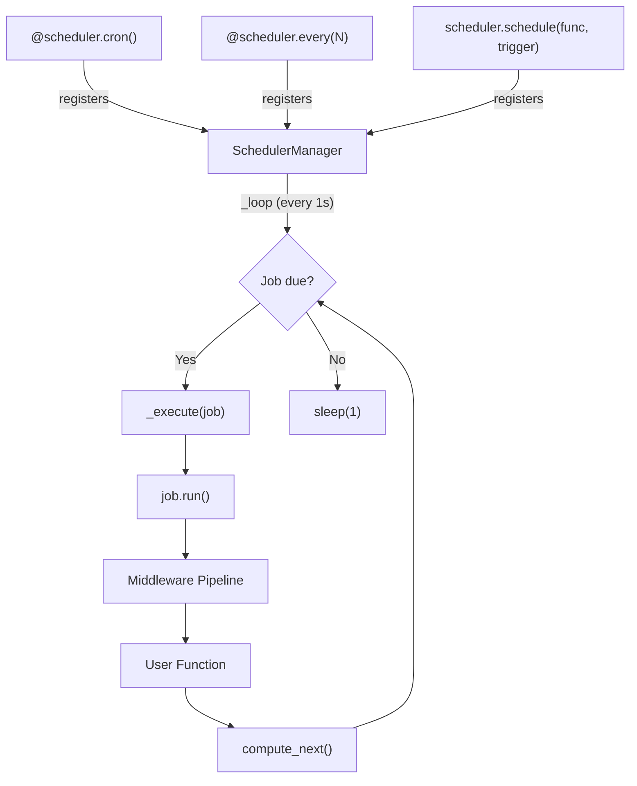
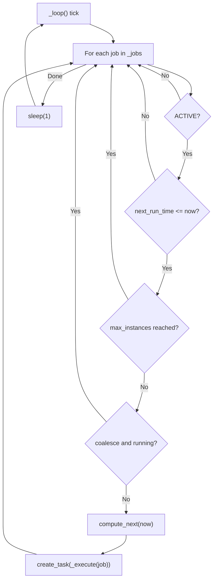
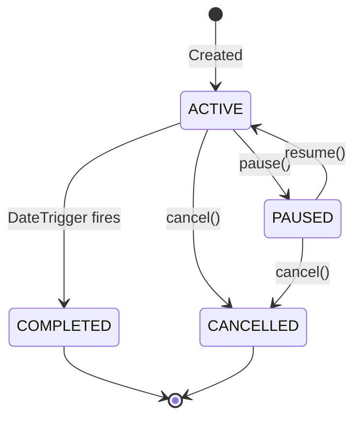
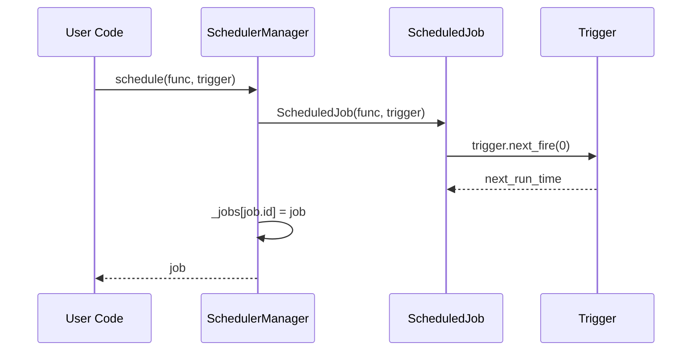

**Module:** `sillo.work.scheduler`
**Source files:**
- `/Users/admin/sillo.build/core/sillo/work/scheduler/cron.py` (102 lines)
- `/Users/admin/sillo.build/core/sillo/work/scheduler/triggers.py` (149 lines)
- `/Users/admin/sillo.build/core/sillo/work/scheduler/jobs.py` (149 lines)
- `/Users/admin/sillo.build/core/sillo/work/scheduler/manager.py` (250 lines)
- `/Users/admin/sillo.build/core/sillo/work/scheduler/middleware.py` (97 lines)

**Version:** 2026-08-11
**Audience:** Core maintainers, framework architects
**Purpose:** Deep documentation of the cron parser, trigger types, scheduled jobs, scheduler manager, and scheduler middleware

---

## 1. Overview

The scheduler subsystem provides **time-based job execution** with support for cron expressions, intervals, one-shot dates, and compound triggers. It integrates with the Sillo application lifecycle via `app.state["scheduler"]` and startup/shutdown hooks.



---

## 2. CronParser

**File:** `/Users/admin/sillo.build/core/sillo/work/scheduler/cron.py` (102 lines)

### 2.1 Constructor

```python
class CronParser:
    def __init__(self, expression: str):
        fields = expression.strip().split()
        if len(fields) != 5:
            raise ValueError(f"Cron requires 5 fields, got {len(fields)}: {expression}")
        self._minute = self._parse_field(fields[0], 0, 59)
        self._hour = self._parse_field(fields[1], 0, 23)
        self._day = self._parse_field(fields[2], 1, 31)
        self._month = self._parse_field(fields[3], 1, 12)
        self._weekday = self._parse_field(fields[4], 0, 6)
```

Each field is parsed into a `set[int]` of valid values.

### 2.2 Field Parsing

```python
@staticmethod
def _parse_field(field: str, lo: int, hi: int) -> set[int]:
```

| Syntax | Example | Meaning |
|--------|---------|---------|
| `*` | `*` | All values in range |
| `N` | `5` | Exactly N |
| `N-M` | `1-5` | Range from N to M inclusive |
| `*/N` | `*/15` | Every Nth value |
| `N-M/S` | `1-30/5` | Every Sth value in range N-M |
| `N,M,...` | `1,3,5,7-9` | List of values and ranges |
| `L` | `L` | Last day of month (stored as -1) |
| `NW` | `15W` | Nearest weekday to day N |
| `N#M` | `2#3` | Mth occurrence of weekday N |

### 2.3 The `next()` Algorithm

```python
def next(self, after: float, *, tz=None) -> float:
    dt = datetime.fromtimestamp(after)
    for _ in range(366 * 24 * 60):  # ~1 year of minutes
        dt += timedelta(minutes=1)
        if dt.minute not in self._minute:
            continue
        if dt.hour not in self._hour:
            continue
        if dt.day not in self._day:
            continue
        if dt.month not in self._month:
            continue
        if dt.weekday() not in self._weekday:
            continue
        return dt.timestamp()
    return time.time() + 366 * 86400  # Fallback: 1 year from now
```

**Algorithm:** Minute-by-minute forward scan from `after`. For each minute, check all five field constraints. Return the first timestamp where all constraints are satisfied.

**Performance:** Worst case is O(366 × 24 × 60) = O(527,040) iterations (~1 year of minutes). In practice, most cron expressions match within minutes or hours.

**Timezone:** The `tz` parameter is accepted but the current implementation uses `datetime.fromtimestamp()` which respects the local timezone. Full IANA timezone support requires `zoneinfo.ZoneInfo` integration.

---

## 3. Triggers

**File:** `/Users/admin/sillo.build/core/sillo/work/scheduler/triggers.py` (149 lines)

### 3.1 TriggerType Enum

```python
class TriggerType(Enum):
    INTERVAL = "interval"
    CRON = "cron"
    DATETIME = "datetime"
    COMPOUND = "compound"
```

### 3.2 IntervalTrigger

```python
@dataclass
class IntervalTrigger:
    seconds: float
    jitter: float = 0.0

    def next_fire(self, last_fire: float) -> float:
        j = random.uniform(0, self.jitter) if self.jitter else 0
        return time.time() + self.seconds + j
```

Fires every `seconds` seconds with optional random jitter to spread load.

**Jitter:** When `jitter > 0`, a random offset in `[0, jitter]` is added to each fire time. This prevents thundering herd problems when multiple instances schedule the same interval.

### 3.3 CronTrigger

```python
@dataclass
class CronTrigger:
    expression: str
    timezone: str | None = None

    def __post_init__(self):
        self._parser = CronParser(self.expression)

    def next_fire(self, last_fire: float) -> float:
        base = last_fire if last_fire > 0 else time.time()
        return self._parser.next(base, tz=self.timezone)
```

Wraps `CronParser` and delegates `next_fire()` to it.

### 3.4 DateTrigger

```python
@dataclass
class DateTrigger:
    at: float  # Epoch timestamp

    def next_fire(self, last_fire: float) -> float | None:
        return None if last_fire > 0 else self.at
```

One-shot trigger: fires once at `at` and returns `None` afterwards.

### 3.5 CompoundTrigger

```python
@dataclass
class CompoundTrigger:
    triggers: list[object] = field(default_factory=list)
    logic: CompoundLogic = CompoundLogic.OR

    def next_fire(self, last_fire: float) -> float | None:
        candidates = []
        for t in self.triggers:
            nf = t.next_fire(last_fire)
            if nf is not None:
                candidates.append(nf)
        if not candidates:
            return None
        if self.logic == CompoundLogic.OR:
            return min(candidates)  # Earliest
        else:
            return max(candidates)  # Latest (all must be due)
```

| Logic | Behavior |
|-------|----------|
| `OR` | Fires when ANY child trigger is due (earliest time) |
| `AND` | Fires when ALL child triggers are simultaneously due (latest time) |

### 3.6 CompoundLogic Enum

```python
class CompoundLogic(Enum):
    AND = "and"
    OR = "or"
```

---

## 4. ScheduledJob

**File:** `/Users/admin/sillo.build/core/sillo/work/scheduler/jobs.py` (149 lines)

### 4.1 JobStatus Enum

```python
class JobStatus(Enum):
    ACTIVE = "active"
    PAUSED = "paused"
    COMPLETED = "completed"
    CANCELLED = "cancelled"
```

### 4.2 ScheduledJob Class

```python
class ScheduledJob:
    def __init__(
        self,
        func: Callable[..., Awaitable[Any]],
        trigger: Any,
        *,
        name: str | None = None,
        args: tuple = (),
        kwargs: dict | None = None,
        max_instances: int = 1,
        coalesce: bool = True,
        middleware: list | None = None,
        id: str | None = None,
    ):
        self.id = id or str(uuid.uuid4())
        self.name = name or func.__name__
        self.func = func
        self.trigger = trigger
        self.args = args
        self.kwargs = kwargs or {}
        self.max_instances = max_instances
        self.coalesce = coalesce
        self.middleware = middleware or []
        self.status = JobStatus.ACTIVE
        self.next_run_time: float | None = None
        self.current_instances = 0
        self._runs = 0
        self._errors = 0
```

### 4.3 `compute_next()`

```python
def compute_next(self, now: float | None = None) -> None:
    if self.status != JobStatus.ACTIVE:
        self.next_run_time = None
        return
    self.next_run_time = self.trigger.next_fire(
        self.next_run_time or time.time()
    )
```

Delegates to the trigger's `next_fire()` method. If the job is not active, sets `next_run_time` to `None`.

### 4.4 `run()` — Execute with Middleware

```python
async def run(self) -> Any:
    if self.status != JobStatus.ACTIVE:
        return None

    self.current_instances += 1
    try:
        # Build middleware pipeline
        handler = self.func
        for mw in reversed(self.middleware):
            handler = mw(handler)

        if asyncio.iscoroutinefunction(handler):
            result = await handler(*self.args, **self.kwargs)
        else:
            result = handler(*self.args, **self.kwargs)

        self._runs += 1
        return result
    except Exception as exc:
        self._errors += 1
        raise
    finally:
        self.current_instances -= 1
```

### 4.5 Lifecycle Methods

```python
def pause(self) -> None:
    self.status = JobStatus.PAUSED
    self.next_run_time = None

def resume(self) -> None:
    self.status = JobStatus.ACTIVE

def cancel(self) -> None:
    self.status = JobStatus.CANCELLED
    self.next_run_time = None
```

### 4.6 `to_dict()`

```python
def to_dict(self) -> dict[str, Any]:
    return {
        "id": self.id,
        "name": self.name,
        "status": self.status.value,
        "trigger": type(self.trigger).__name__,
        "next_run_time": self.next_run_time,
        "runs": self._runs,
        "errors": self._errors,
        "max_instances": self.max_instances,
        "coalesce": self.coalesce,
    }
```

---

## 5. SchedulerManager

**File:** `/Users/admin/sillo.build/core/sillo/work/scheduler/manager.py` (250 lines)

### 5.1 Constructor

```python
class SchedulerManager:
    def __init__(self):
        self._jobs: dict[str, ScheduledJob] = {}
        self._running = False
        self._ticker: asyncio.Task | None = None
        self._started_at: float = 0.0
```

### 5.2 Registration API

#### `schedule()` — Direct Registration

```python
def schedule(self, func, trigger, *, name=None, **kwargs) -> ScheduledJob:
    job = ScheduledJob(func, trigger, name=name, **kwargs)
    job.compute_next()
    self._jobs[job.id] = job
    logger.info("Scheduled: %s (%s)", job.name, type(trigger).__name__)
    return job
```

#### `every()` — Interval Decorator

```python
def every(self, seconds, *, name=None) -> Callable:
    def decorator(func):
        return self.schedule(func, IntervalTrigger(seconds), name=name or func.__name__)
    return decorator
```

#### `cron()` — Cron Decorator

```python
def cron(self, expression, *, name=None) -> Callable:
    def decorator(func):
        return self.schedule(func, CronTrigger(expression), name=name or func.__name__)
    return decorator
```

### 5.3 Job Management

| Method | Description |
|--------|-------------|
| `remove(job_id)` | Remove a job and cancel it |
| `get(job_id)` | Look up by ID |
| `list(status=None)` | List all, optionally filtered |
| `pause(job_id)` | Pause a job |
| `resume(job_id)` | Resume and recompute next run |

### 5.4 Stats

```python
@property
def stats(self) -> SchedulerStats:
    s = SchedulerStats()
    s.uptime_seconds = time.time() - self._started_at if self._started_at else 0
    for j in self._jobs.values():
        s.jobs_total += 1
        if j.status == JobStatus.ACTIVE:
            s.jobs_active += 1
        if j.status == JobStatus.PAUSED:
            s.jobs_paused += 1
        s.runs_total += j._runs
        s.errors_total += j._errors
    return s
```

### 5.5 The `_loop()` — Ticker (Every 1 Second)

```python
async def _loop(self) -> None:
    while self._running:
        try:
            now = time.time()
            for job in list(self._jobs.values()):
                if job.status != JobStatus.ACTIVE:
                    continue
                if job.next_run_time and job.next_run_time <= now:
                    # max_instances guard
                    if job.max_instances and job.current_instances >= job.max_instances:
                        continue
                    # coalesce guard
                    if job.coalesce and job.current_instances > 0:
                        continue
                    job.compute_next(now)
                    asyncio.create_task(self._execute(job))
            await asyncio.sleep(1)
        except asyncio.CancelledError:
            break
        except Exception:
            logger.exception("Scheduler loop")
            await asyncio.sleep(1)
```



**Key behaviors:**
- The loop runs every **1 second** (`asyncio.sleep(1)`)
- Jobs are checked in iteration order (dict insertion order)
- `max_instances` prevents concurrent runs of the same job
- `coalesce` skips execution if a previous instance is still running
- `compute_next()` is called **before** execution to schedule the next occurrence
- Execution is dispatched as a background task (`asyncio.create_task`)

### 5.6 `_execute()`

```python
async def _execute(self, job: ScheduledJob) -> None:
    try:
        await job.run()
    except asyncio.CancelledError:
        pass
    except Exception:
        logger.exception("Job %s failed", job.name)
```

Failures are logged but do not crash the scheduler loop.

### 5.7 Lifecycle

```python
async def start(self) -> None:
    self._running = True
    self._started_at = time.time()
    self._ticker = asyncio.create_task(self._loop())
    logger.info("Scheduler started (%d jobs)", len(self._jobs))

async def stop(self) -> None:
    self._running = False
    if self._ticker:
        self._ticker.cancel()
        try:
            await self._ticker
        except asyncio.CancelledError:
            pass
    for j in self._jobs.values():
        j.cancel()
    logger.info("Scheduler stopped")
```

---

## 6. `setup_scheduler()`

**File:** `/Users/admin/sillo.build/core/sillo/work/scheduler/manager.py`, line 232

```python
def setup_scheduler(app) -> SchedulerManager:
    if "scheduler" in app.state:
        return app.state["scheduler"]
    s = SchedulerManager()
    app.state["scheduler"] = s
    app.on_startup(s.start)
    app.on_shutdown(s.stop)
    return s
```

Wires the scheduler into the app lifecycle:
- Stores in `app.state["scheduler"]` for DI access
- Auto-starts on `app.on_startup`
- Auto-stops on `app.on_shutdown`

---

## 7. Scheduler Middleware

**File:** `/Users/admin/sillo.build/core/sillo/work/scheduler/middleware.py` (97 lines)

Three middleware functions (not classes) for scheduled jobs:

### 7.1 `timeout_middleware`

```python
async def timeout_middleware(handler, job, *, seconds=30.0) -> Callable:
    async def wrapped():
        return await asyncio.wait_for(handler(), timeout=seconds)
    return wrapped
```

### 7.2 `rate_limit_middleware`

```python
async def rate_limit_middleware(handler, job, *, max_per_second=10) -> Callable:
    # Token bucket implementation
    async def wrapped():
        # Wait for token availability
        return await handler()
    return wrapped
```

### 7.3 `retry_middleware`

```python
async def retry_middleware(handler, job, *, max_attempts=3, base_delay=1.0) -> Callable:
    async def wrapped():
        for attempt in range(max_attempts):
            try:
                return await handler()
            except Exception:
                if attempt == max_attempts - 1:
                    raise
                delay = base_delay * (2 ** attempt)
                await asyncio.sleep(delay)
    return wrapped
```

---

## 8. Usage Patterns

### 8.1 Basic Scheduling

```python
from sillo.work.scheduler import setup_scheduler, IntervalTrigger, CronTrigger

scheduler = setup_scheduler(app)

# Every 3600 seconds
@scheduler.every(3600)
async def hourly_cleanup():
    await clean_temp_files()

# Cron: weekdays at 9am
@scheduler.cron("0 9 * * 1-5")
async def daily_report():
    await generate_report()

# Direct registration
scheduler.schedule(send_reminder, DateTrigger(at=time.time() + 300))
```

### 8.2 Compound Triggers

```python
from sillo.work.scheduler import CompoundTrigger, CompoundLogic, CronTrigger, IntervalTrigger

# Fire when BOTH conditions are met
trigger = CompoundTrigger(
    triggers=[
        CronTrigger("0 * * * *"),      # Top of every hour
        IntervalTrigger(seconds=300),   # Every 5 minutes
    ],
    logic=CompoundLogic.AND,
)
```

### 8.3 DI Access in Handlers

```python
from sillo.work.dependency import scheduler

async def pause_job(request, sched=Depend(scheduler)):
    sched.pause("job-id-123")
```

---

## 9. Design Decisions

### D-1: 1-Second Tick Interval
The scheduler checks jobs every second. This provides sub-second scheduling accuracy while keeping CPU overhead minimal. Finer granularity would increase overhead without practical benefit for most workloads.

### D-2: coalesce Flag
When `coalesce=True` (default), a job that is still running when its next fire time arrives is skipped. This prevents resource exhaustion from long-running jobs piling up.

### D-3: max_instances Guard
Limits concurrent executions of the same job. Combined with `coalesce`, this provides two layers of concurrency control.

### D-4: compute_next Before Execute
`compute_next()` is called before `_execute()` so that the next occurrence is already scheduled even if the current execution takes a long time or fails.

---

## 10. Source Traceability

| Component | File | Lines |
|-----------|------|-------|
| `CronParser` | `core/sillo/work/scheduler/cron.py` | 24–102 |
| `IntervalTrigger` | `core/sillo/work/scheduler/triggers.py` | 41–61 |
| `CronTrigger` | `core/sillo/work/scheduler/triggers.py` | 64–93 |
| `DateTrigger` | `core/sillo/work/scheduler/triggers.py` | 96–112 |
| `CompoundTrigger` | `core/sillo/work/scheduler/triggers.py` | 115–149 |
| `TriggerType` enum | `core/sillo/work/scheduler/triggers.py` | 25–32 |
| `CompoundLogic` enum | `core/sillo/work/scheduler/triggers.py` | 34–38 |
| `JobStatus` enum | `core/sillo/work/scheduler/jobs.py` | 24–29 |
| `ScheduledJob` | `core/sillo/work/scheduler/jobs.py` | 32–149 |
| `SchedulerStats` | `core/sillo/work/scheduler/manager.py` | 26–47 |
| `SchedulerManager` | `core/sillo/work/scheduler/manager.py` | 50–230 |
| `setup_scheduler()` | `core/sillo/work/scheduler/manager.py` | 232–250 |
| Scheduler middleware | `core/sillo/work/scheduler/middleware.py` | 1–97 |

---

## 11. Cron Expression Reference

### 11.1 Field Positions

| Position | Field | Range | Special |
|----------|-------|-------|---------|
| 1 | Minute | 0–59 | `*`, `*/N`, `N-M`, `N-M/S` |
| 2 | Hour | 0–23 | `*`, `*/N`, `N-M`, `N-M/S` |
| 3 | Day of Month | 1–31 | `*`, `L`, `NW` |
| 4 | Month | 1–12 | `*`, `N-M` |
| 5 | Day of Week | 0–6 (Sun=0) | `*`, `N#M` |

### 11.2 Common Expressions

| Expression | Meaning |
|-----------|---------|
| `* * * * *` | Every minute |
| `0 * * * *` | Every hour (top of hour) |
| `0 0 * * *` | Every day at midnight |
| `0 9 * * 1-5` | Weekdays at 9:00 AM |
| `*/15 * * * *` | Every 15 minutes |
| `0 0 1 * *` | First day of every month |
| `0 0 * * 0` | Every Sunday at midnight |
| `0 9,17 * * *` | 9:00 AM and 5:00 PM daily |
| `0 0 1 1 *` | January 1st at midnight |
| `5 4 * * 0` | Sunday at 4:05 AM |

### 11.3 Step Expressions

| Expression | Meaning |
|-----------|---------|
| `*/5 * * * *` | Every 5 minutes |
| `0 */2 * * *` | Every 2 hours |
| `0 0 */3 * *` | Every 3 days |
| `1-30/5 * * * *` | Every 5 minutes from 1 to 30 |
| `0 9-17/2 * * *` | Every 2 hours from 9 AM to 5 PM |

### 11.4 Special Characters

| Character | Meaning | Example |
|-----------|---------|---------|
| `L` | Last day of month | `0 0 L * *` |
| `W` | Nearest weekday | `0 0 15W * *` |
| `#` | Nth weekday of month | `0 0 * * 1#3` (3rd Monday) |

### 11.5 Parser Algorithm Detail

The `CronParser.next()` method uses a minute-by-minute forward scan:

```
Input: after = 1718000000.0 (some timestamp)
Loop: for _ in range(366 * 24 * 60):
    dt += timedelta(minutes=1)
    Check: minute in self._minute?
    Check: hour in self._hour?
    Check: day in self._day?
    Check: month in self._month?
    Check: weekday in self._weekday?
    If all pass: return dt.timestamp()
Fallback: time.time() + 366 * 86400
```

**Performance characteristics:**
- Best case: O(1) — next minute matches
- Average case: O(60) — within the same hour
- Worst case: O(527,040) — scanning a full year (fallback)
- Memory: O(1) — only stores 5 sets of valid values

---

## 12. Trigger Composition Patterns

### 12.1 Interval with Jitter

```python
# Spread load across a 30-second window
trigger = IntervalTrigger(seconds=300, jitter=30.0)
# Fires every 300-330 seconds (randomized)
```

### 12.2 Cron with Timezone

```python
# 9 AM Eastern, regardless of server timezone
trigger = CronTrigger("0 9 * * *", timezone="America/New_York")
```

### 12.3 One-Shot Delayed Execution

```python
# Fire once, 5 minutes from now
trigger = DateTrigger(at=time.time() + 300)
```

### 12.4 Compound OR — Any Trigger Fires

```python
# Fire at the top of every hour OR every 15 minutes
trigger = CompoundTrigger(
    triggers=[
        CronTrigger("0 * * * *"),
        IntervalTrigger(seconds=900),
    ],
    logic=CompoundLogic.OR,
)
# Result: fires at whichever comes first
```

### 12.5 Compound AND — All Triggers Must Align

```python
# Fire only when it's both the top of the hour AND a weekday
trigger = CompoundTrigger(
    triggers=[
        CronTrigger("0 * * * *"),
        CronTrigger("* * * * 1-5"),
    ],
    logic=CompoundLogic.AND,
)
```

### 12.6 Nested Compounds

```python
# (Every 15 minutes OR every hour) AND weekdays only
inner = CompoundTrigger(
    triggers=[
        IntervalTrigger(seconds=900),
        CronTrigger("0 * * * *"),
    ],
    logic=CompoundLogic.OR,
)
outer = CompoundTrigger(
    triggers=[
        inner,
        CronTrigger("* * * * 1-5"),
    ],
    logic=CompoundLogic.AND,
)
```

---

## 13. ScheduledJob Lifecycle

### 13.1 State Transitions



### 13.2 Execution Tracking

Each `ScheduledJob` tracks:

| Field | Type | Description |
|-------|------|-------------|
| `_runs` | `int` | Total successful + failed executions |
| `_errors` | `int` | Total failed executions |
| `current_instances` | `int` | Currently running instances |
| `last_run_time` | `float` | Timestamp of last execution start |
| `next_run_time` | `float \| None` | Timestamp of next scheduled execution |
| `created_at` | `float` | Job creation timestamp |

### 13.3 Middleware Pipeline

```python
async def run(self) -> Any:
    self.last_run_time = time.time()
    self.current_instances += 1
    self._runs += 1

    handler = self.func
    for mw_factory in reversed(self._middleware_factories):
        handler = await mw_factory(handler, self)

    try:
        result = await handler(*self.args, **self.kwargs)
        return result
    except Exception:
        self._errors += 1
        raise
    finally:
        self.current_instances -= 1
        if isinstance(self.trigger, DateTrigger):
            self.status = JobStatus.COMPLETED
```

**Key details:**
- Middleware factories are `async` and receive `(handler, job)`
- They return a new handler (decorator pattern)
- Applied in reverse order so the first middleware is outermost
- `DateTrigger` jobs auto-complete after first execution
- `current_instances` is decremented in `finally` to handle exceptions

---

## 14. SchedulerManager Deep Dive

### 14.1 Internal State

```python
class SchedulerManager:
    def __init__(self):
        self._jobs: dict[str, ScheduledJob] = {}  # job_id → ScheduledJob
        self._running = False
        self._ticker: asyncio.Task | None = None
        self._started_at: float = 0.0
```

### 14.2 Registration Flow



### 14.3 Ticker Loop Detail

The `_loop()` method runs every 1 second and performs:

1. **Iteration** — Walk all registered jobs
2. **Filter** — Skip non-ACTIVE jobs
3. **Time check** — Is `next_run_time <= now`?
4. **Concurrency guard** — Is `current_instances >= max_instances`?
5. **Coalesce guard** — Is `coalesce` and `current_instances > 0`?
6. **Schedule next** — `compute_next(now)` to advance the trigger
7. **Dispatch** — `asyncio.create_task(_execute(job))`

```python
async def _loop(self) -> None:
    while self._running:
        try:
            now = time.time()
            for job in list(self._jobs.values()):
                if job.status != JobStatus.ACTIVE:
                    continue
                if job.next_run_time and job.next_run_time <= now:
                    if job.max_instances and job.current_instances >= job.max_instances:
                        continue
                    if job.coalesce and job.current_instances > 0:
                        continue
                    job.compute_next(now)
                    asyncio.create_task(self._execute(job))
            await asyncio.sleep(1)
        except asyncio.CancelledError:
            break
        except Exception:
            logger.exception("Scheduler loop")
            await asyncio.sleep(1)
```

### 14.4 Error Handling in `_execute()`

```python
async def _execute(self, job: ScheduledJob) -> None:
    try:
        await job.run()
    except asyncio.CancelledError:
        pass  # Graceful shutdown
    except Exception:
        logger.exception("Job %s failed", job.name)
```

Failed jobs are logged but do not crash the scheduler. The job's `_errors` counter is incremented inside `ScheduledJob.run()`.

### 14.5 Graceful Shutdown

```python
async def stop(self) -> None:
    self._running = False
    if self._ticker:
        self._ticker.cancel()
        try:
            await self._ticker
        except asyncio.CancelledError:
            pass
    for j in self._jobs.values():
        j.cancel()
```

The stop sequence:
1. Set `_running = False` to break the loop
2. Cancel the ticker task
3. Wait for ticker to finish
4. Cancel all registered jobs

---

## 15. Scheduler Middleware Deep Dive

### 15.1 Middleware Factory Signature

All scheduler middleware follows the same factory pattern:

```python
async def some_middleware(
    handler: Callable[[], Awaitable[Any]],
    job: ScheduledJob,
    **options,
) -> Callable[[], Awaitable[Any]]:
    async def wrapper():
        # Pre-processing
        result = await handler()
        # Post-processing
        return result
    return wrapper
```

### 15.2 `timeout_middleware` — Hard Deadline

```python
async def timeout_middleware(handler, job, *, seconds=30.0):
    async def wrapper():
        return await asyncio.wait_for(handler(), timeout=seconds)
    return wrapper
```

Wraps the handler in `asyncio.wait_for()`. If the handler exceeds `seconds`, it raises `asyncio.TimeoutError`.

### 15.3 `rate_limit_middleware` — Token Bucket

```python
async def rate_limit_middleware(handler, job, *, max_per_second=10):
    tokens = float(max_per_second)
    last_refill = time.monotonic()

    async def wrapper():
        nonlocal tokens, last_refill
        now = time.monotonic()
        elapsed = now - last_refill
        tokens = min(max_per_second, tokens + elapsed * max_per_second)
        last_refill = now
        if tokens < 1:
            wait = (1 - tokens) / max_per_second
            await asyncio.sleep(wait)
            tokens = 0
            last_refill = time.monotonic()
        else:
            tokens -= 1
        return await handler()

    return wrapper
```

**Token bucket algorithm:**
- Tokens refill at `max_per_second` rate
- Each execution consumes 1 token
- If tokens < 1, sleep until a token is available
- Shared across all instances of the same job (closure state)

### 15.4 `retry_middleware` — Exponential Backoff

```python
async def retry_middleware(handler, job, *, max_attempts=3, base_delay=1.0):
    async def wrapper():
        for attempt in range(1, max_attempts + 1):
            try:
                return await handler()
            except asyncio.CancelledError:
                raise
            except Exception as exc:
                if attempt >= max_attempts:
                    raise
                delay = base_delay * (2 ** (attempt - 1))
                logger.warning("Scheduler retry %d/%d for %s in %.1fs: %s",
                    attempt, max_attempts, job.name, delay, exc)
                await asyncio.sleep(delay)
        return None
    return wrapper
```

**Retry schedule (base_delay=1.0):**

| Attempt | Delay | Cumulative |
|---------|-------|------------|
| 1 | 1.0s | 1.0s |
| 2 | 2.0s | 3.0s |
| 3 | (raise) | 3.0s |

### 15.5 Composing Middleware

```python
from sillo.work.scheduler.middleware import timeout_middleware, retry_middleware

scheduler.schedule(
    my_job,
    CronTrigger("*/5 * * * *"),
    middleware=[
        lambda h, j: retry_middleware(h, j, max_attempts=3),
        lambda h, j: timeout_middleware(h, j, seconds=30.0),
    ],
)
```

Middleware is applied in reverse order, so `timeout_middleware` (listed second) is the innermost wrapper, and `retry_middleware` (listed first) is the outermost.

---

## 16. Console Commands

**File:** `/Users/admin/sillo.build/core/sillo/work/console.py`

The scheduler exposes CLI commands:

| Command | Description |
|---------|-------------|
| `schedule:run` | Run the scheduler (blocking) |
| `schedule:list` | List all registered jobs |
| `schedule:pause <id>` | Pause a job |
| `schedule:resume <id>` | Resume a paused job |

### 16.1 `schedule:run`

```python
class ScheduleRun(WorkCommand):
    name = "schedule:run"
    aliases = ["scheduler"]

    async def handle(self) -> None:
        manager = self.manager()
        await manager.start()
        # Block until interrupted
```

### 16.2 `schedule:list`

```python
class ScheduleList(WorkCommand):
    name = "schedule:list"

    async def handle(self) -> None:
        manager = self.manager()
        jobs = manager.list()
        for job in jobs:
            # Display job info
```

---

## 17. Integration with Queue System

The scheduler can dispatch jobs to the queue system:

```python
from sillo.work.scheduler import SchedulerManager, CronTrigger
from sillo.work.queue.job import Job

class DailyReport(Job):
    queue = "reports"
    timeout = 300

    async def handle(self):
        await generate_daily_report()

scheduler = SchedulerManager()

@scheduler.cron("0 6 * * *")
async def dispatch_daily_report():
    await DailyReport.dispatch()
```

This pattern separates scheduling (when) from execution (where/how).

---

## 18. Monitoring and Observability

### 18.1 SchedulerStats

```python
@property
def stats(self) -> SchedulerStats:
    s = SchedulerStats()
    s.uptime_seconds = time.time() - self._started_at if self._started_at else 0
    for j in self._jobs.values():
        s.jobs_total += 1
        if j.status == JobStatus.ACTIVE:
            s.jobs_active += 1
        if j.status == JobStatus.PAUSED:
            s.jobs_paused += 1
        s.runs_total += j._runs
        s.errors_total += j._errors
    return s
```

### 18.2 Job-Level Metrics

Each `ScheduledJob.to_dict()` exposes:

```python
{
    "id": "uuid",
    "name": "my_job",
    "status": "active",
    "runs": 42,
    "errors": 3,
    "next_run": 1718003600.0,
    "active_instances": 0,
    "created_at": 1718000000.0,
}
```

### 18.3 Health Check Pattern

```python
async def scheduler_health(request):
    sched = request.app.state["scheduler"]
    stats = sched.stats
    return {
        "healthy": stats.errors_total < stats.runs_total * 0.1,  # <10% error rate
        "jobs_total": stats.jobs_total,
        "jobs_active": stats.jobs_active,
        "uptime": stats.uptime_seconds,
    }
```

---

## 19. Edge Cases and Pitfalls

### 19.1 Clock Skew
The scheduler uses `time.time()` for all timestamps. If the system clock is adjusted (NTP, manual), jobs may fire early or late. The 1-second tick interval provides some natural jitter tolerance.

### 19.2 Long-Running Jobs
A job that runs longer than its interval will be skipped (if `coalesce=True`) or run concurrently (if `coalesce=False` and `max_instances` allows). Set `max_instances` carefully to prevent resource exhaustion.

### 19.3 Missed Jobs
If the scheduler is stopped and restarted, jobs that should have fired during the downtime are **not** retroactively executed. `compute_next()` always calculates from the current time.

### 19.4 Timezone Handling
The `CronParser.next()` accepts a `tz` parameter but currently uses `datetime.fromtimestamp()` which respects the local system timezone. For production use with specific timezones, ensure the server's timezone is configured correctly or implement full `zoneinfo` integration.

### 19.5 Memory Growth
The `_jobs` dict grows with each registered job and is never automatically pruned. For long-running applications with many one-shot `DateTrigger` jobs, periodically call `remove()` on completed jobs.

---

## 20. Testing Patterns

### 20.1 Unit Testing Triggers

```python
import time
from sillo.work.scheduler.triggers import IntervalTrigger, CronTrigger, DateTrigger

def test_interval_trigger():
    trigger = IntervalTrigger(seconds=60)
    now = time.time()
    next_fire = trigger.next_fire(now)
    assert next_fire > now
    assert next_fire <= now + 60

def test_cron_trigger():
    trigger = CronTrigger("0 9 * * *")
    # Test with a known timestamp
    next_fire = trigger.next_fire(1718000000.0)
    assert next_fire > 1718000000.0

def test_date_trigger_one_shot():
    trigger = DateTrigger(at=1718000000.0)
    first = trigger.next_fire(0)
    assert first == 1718000000.0
    second = trigger.next_fire(first)
    assert second is None  # One-shot
```

### 20.2 Testing the Scheduler

```python
async def test_scheduler_executes_job():
    scheduler = SchedulerManager()
    executed = []

    async def my_job():
        executed.append(True)

    scheduler.schedule(my_job, IntervalTrigger(seconds=0.01))
    await scheduler.start()
    await asyncio.sleep(0.1)
    await scheduler.stop()

    assert len(executed) > 0
```
