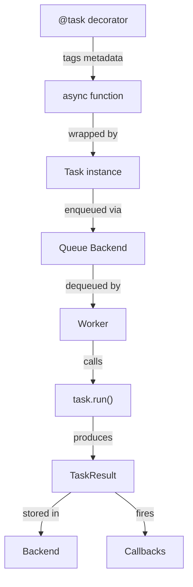
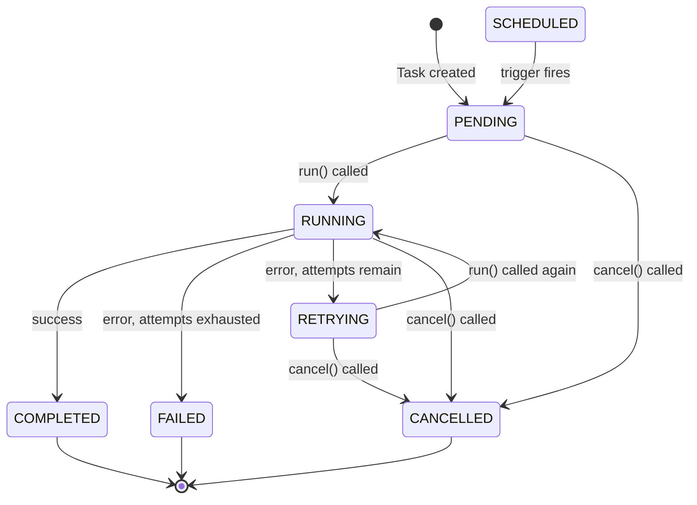
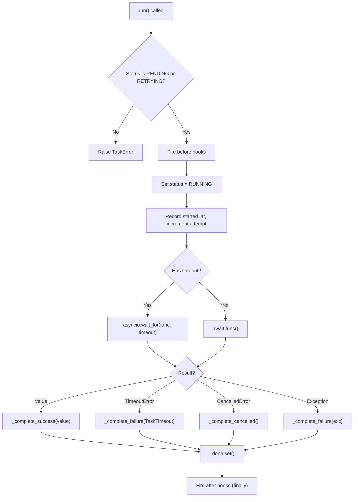
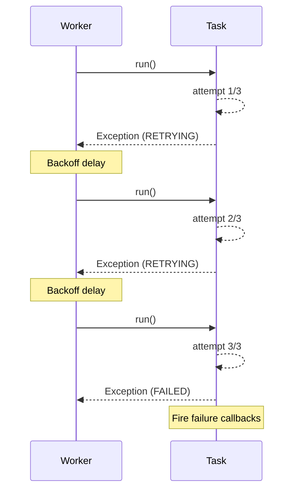
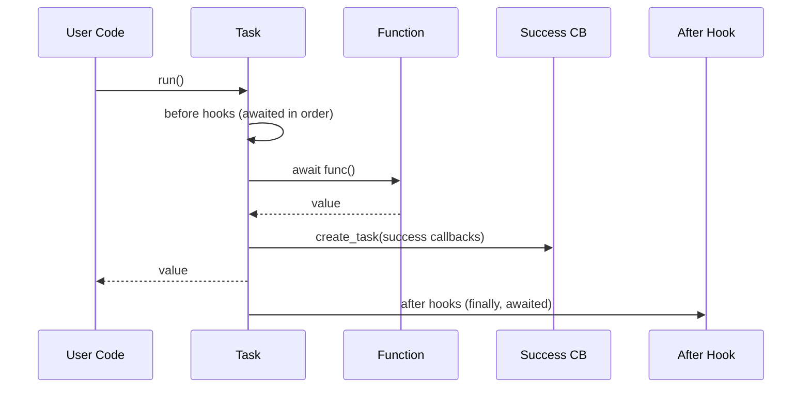
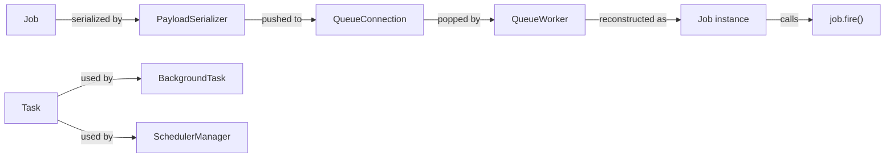

**Module:** `sillo.work.task` · `sillo.work.types`
**Source files:**
- `/Users/admin/sillo.build/core/sillo/work/task.py` (461 lines)
- `/Users/admin/sillo.build/core/sillo/work/types.py` (300 lines)

**Version:** 2026-08-11
**Audience:** Core maintainers, framework architects
**Purpose:** Deep documentation of the Task class, the `@task` decorator, enums, hooks, serialization, and the run algorithm

---

## 1. Overview

The Task system is the **smallest schedulable unit of work** in Sillo's background processing subsystem. A `Task` wraps an async callable, tracks its execution attempt-by-attempt, fires lifecycle hooks, and can be serialized for cross-process transfer via queue backends.



The Task system sits at the intersection of several subsystems:
- **Queue system** (`sillo.work.queue`): Tasks are pushed onto queues and
  consumed by workers
- **Background tasks** (`sillo.work.background`): `BackgroundTask` wraps `Task`
  with fire-and-forget semantics
- **Scheduler** (`sillo.work.scheduler`): Scheduled jobs ultimately execute as
  tasks
- **Middleware** (`sillo.work.middleware`): Timeout, rate-limit, and logging
  middleware operate on tasks

---

## 2. Type System

All types are centralized in `sillo.work.types` to prevent circular dependencies. Every other module in the work subsystem imports from this single location.

### 2.1 TaskPriority Enum

**File:** `/Users/admin/sillo.build/core/sillo/work/types.py`, line 27

```python
class TaskPriority(enum.IntEnum):
    LOW = 0
    NORMAL = 1
    HIGH = 2
    CRITICAL = 3
```

`TaskPriority` is an `IntEnum` so that higher numerical values mean higher urgency. This ordering is critical for two reasons:

1. **In-memory backend**: Uses `Task.__lt__` which compares `(-priority,
   created_at)`, so `CRITICAL` (3) sorts before `LOW` (0) in the min-heap.
2. **Redis backend**: Multiplies by a large constant and negates to produce a
   ZSET score where lower scores are dequeued first.

| Priority | Value | ZSET Score Direction | Dequeue Order |
|----------|-------|---------------------|---------------|
| `CRITICAL` | 3 | Lowest score | First |
| `HIGH` | 2 | ↓ | ↓ |
| `NORMAL` | 1 | ↓ | ↓ |
| `LOW` | 0 | Highest score | Last |

### 2.2 TaskStatus Enum

**File:** `/Users/admin/sillo.build/core/sillo/work/types.py`, line 46

```python
class TaskStatus(enum.Enum):
    PENDING = "pending"
    SCHEDULED = "scheduled"
    RUNNING = "running"
    COMPLETED = "completed"
    FAILED = "failed"
    CANCELLED = "cancelled"
    RETRYING = "retrying"
```

The status values use lowercase strings for JSON serialization and log readability.



**Terminal states:** `COMPLETED`, `FAILED`, `CANCELLED`, a task in any of these
states will never transition again. The `is_done` property checks for these
three states.

**Non-terminal states:** `PENDING`, `SCHEDULED`, `RUNNING`, `RETRYING`. The
task is still in flight.

### 2.3 TaskResult Dataclass

**File:** `/Users/admin/sillo.build/core/sillo/work/types.py`, line 138

```python
@dataclasses.dataclass(frozen=True, slots=True)
class TaskResult:
    task_id: str
    name: str
    status: TaskStatus
    result: Any = None
    error: str | None = None
    attempt: int = 0
    max_attempts: int = 0
    priority: TaskPriority = TaskPriority.NORMAL
    queue_name: str = "default"
    created_at: float = dataclasses.field(default_factory=time.time)
    started_at: float = 0.0
    completed_at: float = 0.0
    metadata: dict[str, Any] = dataclasses.field(default_factory=dict)
    worker_id: str = ""
```

`TaskResult` is **frozen** (immutable) and uses **slots** for memory efficiency. It is the canonical record of a completed unit of work. Backends may persist it; callbacks receive a reference to it.

**Derived properties:**

| Property | Type | Description |
|----------|------|-------------|
| `duration_ms` | `int` | Wall-clock execution time: `(completed_at - started_at) * 1000` |
| `latency_ms` | `int` | Queue wait time: `(started_at - created_at) * 1000` |
| `ok` | `bool` | `True` if `status == COMPLETED` |
| `is_terminal` | `bool` | `True` if status is `COMPLETED`, `FAILED`, or `CANCELLED` |

**Serialization:**

- `to_dict()` → `dict[str, Any]`: Full snapshot including derived properties
- `to_json()` → `str`: JSON string with `default=str` fallback
- `_serialise_result()` → `str | None`: Truncates result to 500 chars with `…`
  suffix

### 2.4 Other Health/Stats Dataclasses

**File:** `/Users/admin/sillo.build/core/sillo/work/types.py`

```python
@dataclasses.dataclass
class QueueStats:
    name: str
    size: int = 0
    completed: int = 0
    failed: int = 0
    oldest_age_ms: int = 0
    status: QueueHealth = QueueHealth.HEALTHY

@dataclasses.dataclass
class WorkerStats:
    processed: int = 0
    failed: int = 0
    active: int = 0
    workers: int = 0
    circuit: CircuitState = CircuitState.CLOSED
    uptime_seconds: float = 0.0

@dataclasses.dataclass
class SchedulerStats:
    jobs_total: int = 0
    jobs_active: int = 0
    jobs_paused: int = 0
    runs_total: int = 0
    errors_total: int = 0
```

### 2.5 Exception Hierarchy

```
WorkError (base)
├── TaskError          (alias for WorkError)
├── TaskRejected       (queue refused: duplicate, full)
├── TaskTimeout        (exceeded time budget)
├── TaskCancelled      (externally cancelled)
├── QueueFull          (backend at capacity)
├── BackendUnavailable (cannot reach persistence)
├── CircuitBreakerOpen (worker circuit is open)
└── InvalidTrigger     (scheduler trigger malformed)
```

All exceptions carry structured context:

```python
class WorkError(Exception):
    def __init__(self, message, *, task_id="", queue_name=""):
        super().__init__(message)
        self.task_id = task_id
        self.queue_name = queue_name
```

### 2.6 Supporting Enums

```python
class CircuitState(enum.Enum):
    CLOSED = "closed"      # normal operation
    OPEN = "open"          # failures exceeded threshold
    HALF_OPEN = "half_open"  # testing recovery

class QueueHealth(enum.Enum):
    HEALTHY = "healthy"
    DEGRADED = "degraded"  # high backlog
    STALLED = "stalled"    # no consumers
```

---

## 3. The `@task` Decorator

**File:** `/Users/admin/sillo.build/core/sillo/work/task.py`, line 429

```python
def task(
    name: str | None = None,
    *,
    priority: TaskPriority = TaskPriority.NORMAL,
    max_attempts: int = 1,
    queue: str = "default",
    timeout: float | None = None,
) -> Callable:
```

The `@task` decorator **tags** an async function with metadata attributes. It
does **not** wrap the function or alter its behavior. The original function is
returned unchanged. The metadata is stored as dunder-like attributes on the
function object so that queue infrastructure can introspect them.

### 3.1 Attributes Attached

| Attribute | Value | Purpose |
|-----------|-------|---------|
| `_work_task` | `True` | Sentinel: marks function as a task |
| `_work_name` | `name or func.__name__` | Human-readable label |
| `_work_priority` | `TaskPriority` enum value | Dequeue ordering |
| `_work_max_attempts` | `int` | Retry budget |
| `_work_queue` | `str` | Target queue name |
| `_work_timeout` | `float | None` | Per-task execution timeout |
| `_work_func` | `func` | Reference to the original callable |

### 3.2 Usage Patterns

```python
# Basic — uses all defaults
@task
async def send_welcome(email: str):
    await email_service.send(email, template="welcome")

# Full configuration
@task(
    name="send-welcome",
    priority=TaskPriority.HIGH,
    max_attempts=3,
    queue="emails",
    timeout=30.0,
)
async def send_welcome(email: str):
    await email_service.send(email, template="welcome")

# The decorator is transparent — the function is still callable
await send_welcome("user@example.com")
```

### 3.3 Introspection by Queue Infrastructure

When a `Queue.put()` or worker encounters a decorated function, it reads the metadata:

```python
if getattr(func, "_work_task", False):
    task = Task(
        func._work_func,
        name=func._work_name,
        priority=func._work_priority,
        max_attempts=func._work_max_attempts,
        queue_name=func._work_queue,
        timeout=func._work_timeout,
    )
```

---

## 4. The Task Class

**File:** `/Users/admin/sillo.build/core/sillo/work/task.py`, line 39

### 4.1 Constructor

```python
class Task:
    __slots__ = (
        "_done", "_hooks", "_task",
        "args", "attempt", "completed_at", "created_at",
        "func", "id", "kwargs", "max_attempts", "metadata",
        "name", "priority", "queue_name", "result",
        "started_at", "status", "timeout",
    )

    def __init__(
        self,
        func: Callable[..., Awaitable[Any]],
        *args: Any,
        name: str | None = None,
        priority: TaskPriority = TaskPriority.NORMAL,
        max_attempts: int = 1,
        queue_name: str = "default",
        metadata: dict[str, Any] | None = None,
        timeout: float | None = None,
        **kwargs: Any,
    ) -> None:
```

**Key initialization details:**

- `id` is always `str(uuid4())`: globally unique, never reused
- `status` starts as `TaskStatus.PENDING`
- `max_attempts` is clamped to `max(1, max_attempts)`: a task always runs at
  least once
- `_done` is an `asyncio.Event` used by `wait()` to block until completion
- `_hooks` is a dict of four lists: `"before"`, `"after"`, `"success"`, `"failure"`
- All timestamps use `time.time()` (epoch seconds)

### 4.2 Properties

| Property | Type | Description |
|----------|------|-------------|
| `is_done` | `bool` | `True` if status is `COMPLETED`, `FAILED`, or `CANCELLED` |
| `is_running` | `bool` | `True` if status is `RUNNING` |

### 4.3 Ordering for heapq

```python
def __lt__(self, other: Task) -> bool:
    return (-self.priority.value, self.created_at) < (
        -other.priority.value,
        other.created_at,
    )
```

This enables `Task` instances to be stored in a `heapq` min-heap where:
- **Higher priority** (larger value) sorts first (due to negation)
- **Earlier creation time** breaks ties (FIFO within same priority)

The in-memory `MemoryBackend` uses `asyncio.PriorityQueue` which relies on this ordering.

---

## 5. The `run()` Algorithm

**File:** `/Users/admin/sillo.build/core/sillo/work/task.py`, line 207



### 5.1 Pre-condition Check

The task can only run from `PENDING` or `RETRYING` states:

```python
if self.status not in (TaskStatus.PENDING, TaskStatus.RETRYING):
    raise TaskError(
        f"Cannot run task in state '{self.status.value}'",
        task_id=self.id,
        queue_name=self.queue_name,
    )
```

### 5.2 Before Hooks

Before hooks fire **synchronously** (awaited in order) before the core function. They receive the `Task` instance itself:

```python
await self._fire_hooks("before")
```

### 5.3 Execution

The task increments its attempt counter and records the start time:

```python
self.status = TaskStatus.RUNNING
self.started_at = time.time()
self.attempt += 1
```

If a timeout is configured (per-task or passed to `run()`), the function is wrapped in `asyncio.wait_for()`:

```python
if effective_timeout:
    value = await asyncio.wait_for(
        self.func(*self.args, **self.kwargs),
        timeout=effective_timeout,
    )
else:
    value = await self.func(*self.args, **self.kwargs)
```

### 5.4 After Hooks

After hooks fire in a `finally` block, even if an exception or cancellation
occurred:

```python
finally:
    self._done.set()
    await self._fire_hooks("after")
```

---

## 6. Failure and Retry Logic

### 6.1 Success Path

```python
def _complete_success(self, value: Any) -> Any:
    self.status = TaskStatus.COMPLETED
    self.completed_at = time.time()
    self.result = self._make_result(status=TaskStatus.COMPLETED, result=value)
    asyncio.create_task(self._fire_callbacks("success", self.result))
    return value
```

Success callbacks are fired as a **background task** (`asyncio.create_task`) so they don't block the return value.

### 6.2 Failure Path

```python
def _complete_failure(self, exc: Exception) -> None:
    self.status = (
        TaskStatus.FAILED
        if self.attempt >= self.max_attempts
        else TaskStatus.RETRYING
    )
    self.completed_at = time.time()
    self.result = self._make_result(
        status=self.status,
        error=f"{type(exc).__name__}: {exc}",
    )
    if self.status == TaskStatus.FAILED:
        asyncio.create_task(self._fire_callbacks("failure", self.result))
    if not isinstance(exc, (TaskTimeout,)):
        raise exc
    raise exc
```

**Critical behavior:**
- If `attempt >= max_attempts`, the task is marked `FAILED` and failure callbacks fire
- If attempts remain, the task is marked `RETRYING`: the caller can re-invoke
  `run()`
- The original exception is **always re-raised** after recording the failure
- `TaskTimeout` exceptions are wrapped but still raised

### 6.3 Cancellation Path

```python
def _complete_cancelled(self) -> None:
    self.status = TaskStatus.CANCELLED
    self.completed_at = time.time()
    self.result = self._make_result(status=TaskStatus.CANCELLED)
    raise asyncio.CancelledError(f"Task '{self.name}' was cancelled") from None
```

### 6.4 Retry Flow



---

## 7. Hook System

**File:** `/Users/admin/sillo.build/core/sillo/work/task.py`, lines 161 to 342

### 7.1 Four Hook Groups

| Group | Registration Method | Fires When | Receives |
|-------|-------------------|------------|----------|
| `before` | `task.before(cb)` | Before execution starts | `Task` instance |
| `after` | `task.after(cb)` | After execution (always, in `finally`) | `Task` instance |
| `success` | `task.on_success(cb)` | On successful completion | `TaskResult` |
| `failure` | `task.on_failure(cb)` | On permanent failure | `TaskResult` |

### 7.2 Registration API

All registration methods return `self` for chaining:

```python
task = Task(send_email, email)
task.before(lambda t: log.info("starting %s", t.name))
task.after(lambda t: metrics.record(t.result))
task.on_success(notify_user)
task.on_failure(log_error)
```

Or chained:

```python
task = Task(send_email, email).before(log_start).after(log_end).on_failure(alert)
```

### 7.3 Hook Execution

**Before/After hooks** receive the `Task` instance:

```python
async def _fire_hooks(self, group: str) -> None:
    for hook in self._hooks[group]:
        try:
            await hook(self)
        except Exception:
            logger.warning(
                f"{group}-hook for task '{self.name}' raised: {traceback.format_exc()}"
            )
```

**Success/Failure callbacks** receive the `TaskResult`:

```python
async def _fire_callbacks(self, group: str, result: TaskResult) -> None:
    for cb in self._hooks[group]:
        try:
            await cb(result)
        except Exception:
            logger.warning(
                f"{group}-callback for task '{self.name}' raised: {traceback.format_exc()}"
            )
```

**Key invariant:** Exceptions in hooks/callbacks are **logged but never propagated**. A broken callback must not take down the worker.

### 7.4 Execution Order



---

## 8. Task Chaining

### 8.1 `then()`: Successor on Success

```python
def then(self, next_task: Task) -> Task:
    async def _chain(result: TaskResult) -> None:
        pass  # Queue/worker handles chaining
    self.on_success(_chain)
    self.metadata["_chain"] = next_task.serialize()
    return self
```

The `then()` method stores the next task's serialized form in `metadata["_chain"]`. The worker inspects this metadata after success and enqueues the chained task.

### 8.2 `catch()`: Fallback on Failure

```python
def catch(self, fallback: Task) -> Task:
    async def _fallback(result: TaskResult) -> None:
        pass
    self.on_failure(_fallback)
    self.metadata["_fallback"] = fallback.serialize()
    return self
```

### 8.3 Chain Pattern

```python
step1 = Task(fetch_data, url)
step2 = Task(process_data)
step3 = Task(store_results)

step1.then(step2).then(step3)
step1.catch(Task(handle_error, url))
```

---

## 9. Waiting and Unwrapping

### 9.1 `wait()`

```python
async def wait(self, timeout: float | None = None) -> Any:
    if self.result is not None:
        return self._unwrap_result()
    await asyncio.wait_for(self._done.wait(), timeout=timeout)
    return self._unwrap_result()
```

The `_done` event is set in the `finally` block of `run()`. If the result is already available, `wait()` returns immediately without blocking.

### 9.2 `_unwrap_result()`

```python
def _unwrap_result(self) -> Any:
    if self.result is None:
        return None
    if self.result.status == TaskStatus.FAILED and self.result.error:
        raise TaskError(self.result.error, task_id=self.id, queue_name=self.queue_name)
    if self.result.status == TaskStatus.CANCELLED:
        raise TaskCancelled(f"Task '{self.name}' was cancelled", task_id=self.id, queue_name=self.queue_name)
    return self.result.result
```

**Behavior:**
- `COMPLETED` → returns `result.result`
- `FAILED` → raises `TaskError` with the recorded error message
- `CANCELLED` → raises `TaskCancelled`

### 9.3 `cancel()`

```python
def cancel(self) -> bool:
    if self._task and not self._task.done():
        return self._task.cancel()
    return False
```

Cancels the underlying `asyncio.Task` if one exists. Returns `True` if cancellation was requested.

---

## 10. Serialization

### 10.1 `serialize()`: For Queue Payloads

```python
def serialize(self) -> str:
    return json.dumps({
        "id": self.id,
        "name": self.name,
        "args": [str(a) for a in self.args],
        "kwargs": {k: str(v) for k, v in self.kwargs.items()},
        "priority": self.priority.value,
        "max_attempts": self.max_attempts,
        "queue_name": self.queue_name,
        "metadata": self.metadata,
        "timeout": self.timeout,
    })
```

**Note:** All args and kwargs are coerced to strings via `str()`. This is a
lossy serialization. The original types are not preserved. The function
reference itself is not serialized; only the metadata needed to reconstruct the
task context is included.

### 10.2 `to_dict()`: For Monitoring/Logging

```python
def to_dict(self) -> dict[str, Any]:
    return {
        "id": self.id,
        "name": self.name,
        "status": self.status.value,
        "priority": self.priority.name,
        "attempt": self.attempt,
        "max_attempts": self.max_attempts,
        "queue": self.queue_name,
        "created_at": self.created_at,
        "metadata": self.metadata,
    }
```

This is a **snapshot** of the task's current state, suitable for dashboards and health checks.

---

## 11. Task Middleware

**File:** `/Users/admin/sillo.build/core/sillo/work/middleware.py` (109 lines)

Three middleware classes operate on `Task` instances (distinct from queue `Job` middleware):

### 11.1 TimeoutMiddleware

```python
class TimeoutMiddleware:
    def __init__(self, timeout: float):
        self.timeout = timeout

    async def before_execute(self, task: Task) -> None:
        task.timeout = self.timeout
```

Forces a hard deadline on every task that passes through.

### 11.2 RateLimitMiddleware

```python
class RateLimitMiddleware:
    def __init__(self, max_per_second: float, burst: int = 1):
        # Token bucket implementation
```

Implements a token bucket rate limiter. Tokens refill at `max_per_second` rate with a burst capacity of `burst`.

### 11.3 LoggingMiddleware

```python
class LoggingMiddleware:
    def __init__(self, level: int = logging.DEBUG):
        self.level = level

    async def before_execute(self, task: Task) -> None:
        logger.log(self.level, "Executing task %s (attempt %d)", task.name, task.attempt)

    async def after_execute(self, result: TaskResult) -> None:
        logger.log(self.level, "Task %s completed: %s", result.name, result.status.value)
```

All three middleware implement the same four-method interface:
- `before_enqueue(task)`: Called before the task is pushed to a queue
- `before_execute(task)`: Called before the task's function runs
- `after_execute(result)`: Called after execution completes
- `on_error(task, error)`: Called when execution raises

---

## 12. Integration Points

### 12.1 With Queue System

Tasks are the low-level primitive. The queue system's `Job` class is a higher-level abstraction:



### 12.2 With BackgroundTask

`BackgroundTask` wraps `Task` internally:

```python
class BackgroundTask:
    def __init__(self, func, *args, **kwargs):
        self._task_obj = Task(func, *args, **kwargs)
        self._asyncio_task = asyncio.ensure_future(self._task_obj.run())
```

### 12.3 With Scheduler

The `SchedulerManager` executes scheduled jobs which may create `Task` instances for deferred execution.

---

## 13. Source Traceability

| Component | File | Lines |
|-----------|------|-------|
| `Task` class | `core/sillo/work/task.py` | 39-423 |
| `@task` decorator | `core/sillo/work/task.py` | 429-461 |
| `TaskPriority` enum | `core/sillo/work/types.py` | 27-43 |
| `TaskStatus` enum | `core/sillo/work/types.py` | 46-55 |
| `TaskResult` dataclass | `core/sillo/work/types.py` | 138-233 |
| `QueueStats` dataclass | `core/sillo/work/types.py` | 236-256 |
| `WorkerStats` dataclass | `core/sillo/work/types.py` | 259-279 |
| `SchedulerStats` dataclass | `core/sillo/work/types.py` | 282-300 |
| Exception hierarchy | `core/sillo/work/types.py` | 94-132 |
| Task middleware | `core/sillo/work/middleware.py` | 1-109 |

---

## 14. Design Decisions

### D-1: UUID4 for Task IDs
UUID4 guarantees global uniqueness without coordination. This is essential for distributed workers that may create tasks independently.

### D-2: Frozen TaskResult
`TaskResult` is `frozen=True` and `slots=True` to prevent accidental mutation after creation and to minimize memory overhead when results are stored in backends.

### D-3: Hooks Never Propagate Exceptions
A broken callback must not take down the worker. All hook execution is wrapped in `try/except` with logging only.

### D-4: Lossy Serialization
`serialize()` coerces all args to strings. This is intentional. The function
reference is not serializable, and the task is reconstructed by the worker
using the function's metadata attributes.

### D-5: `__lt__` for heapq Ordering
The negated priority + creation time comparison ensures that `heapq` (a min-heap) dequeues highest-priority, oldest tasks first without custom comparators.
