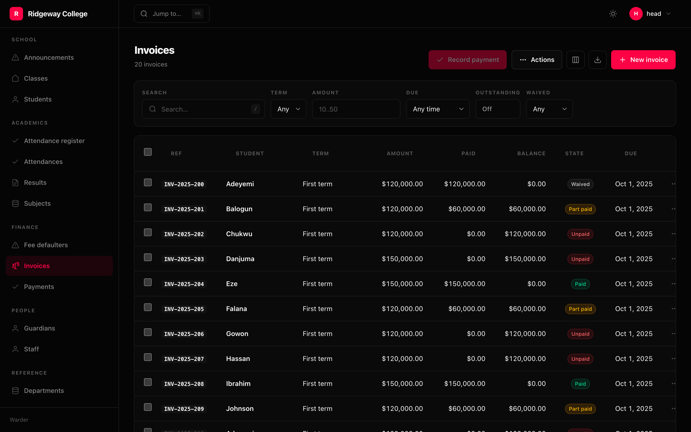
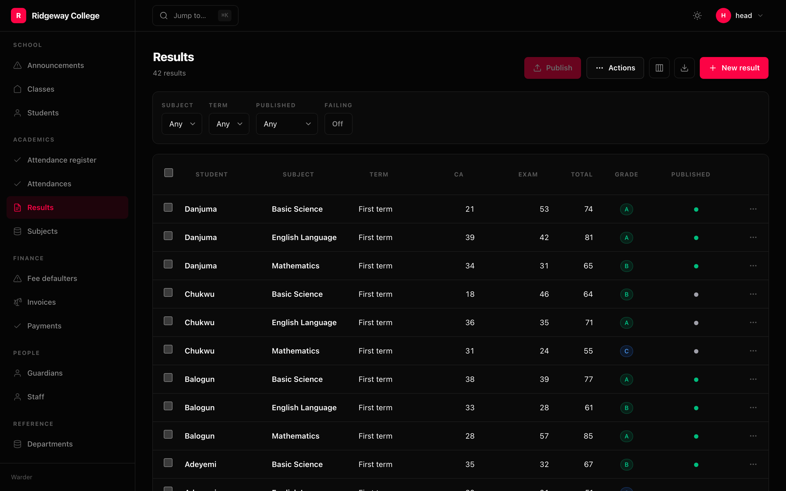

A column names a value and says how to draw it. There is one class; the
classmethods are shorthands that fill in a `Format`.



```python
Column("title", link=True)
Column.badge("status", colors={"live": "green", "draft": "zinc"})
Column.relation("author", display="email")
Column.many("tags")
Column.compute("Words", lambda row: len(row.body.split()), sort="word_count")
```

## The shorthands

| | |
|---|---|
| `Column(name)` | plain, formatted from the column's own type at mount |
| `Column.text(name, truncate=, mono=)` | text, optionally clipped |
| `Column.code(name)` | monospace in a tinted box |
| `Column.number(name, precision=, prefix=, suffix=)` | grouped by thousands |
| `Column.money(name, "USD")` | in the viewer's locale |
| `Column.percent(name, of=)` | `of=100` when the column holds 0–100 |
| `Column.bytes(name, binary=)` | `1.4 MiB` or `1.5 MB` |
| `Column.duration(name)` | `2m 14s` |
| `Column.date(name, "relative")` | `date`, `datetime`, `time`, `relative`, `iso` |
| `Column.boolean(name, style=)` | `icon`, `text`, `dot` |
| `Column.badge(name, colors=, labels=)` | a coloured pill |
| `Column.tags(name)` | small pills with the overflow collapsed |
| `Column.progress(name, max=)` | a bar |
| `Column.image(name)` / `Column.avatar(name)` | a picture, or a picture and a name |
| `Column.json(name)` | collapsed JSON |
| `Column.relation(name, display=)` | a foreign key, drawn as the far row |
| `Column.many(name)` | a many-to-many, drawn as clickable chips |
| `Column.compute(label, fn, sort=)` | a value derived in Python |
| `Column.url(label, to=)` | a link built from the row |

`boolean` rather than `bool`, and the reason is worth knowing: a method named
`bool` shadows the type inside its own class body, so every later `flag: bool`
annotation resolves to the method. The method gave way.

## Computed columns can be sorted

```python
Column.compute("Read", lambda row: f"{row.words // 200} min", sort="words")
```

`sort=` names the database column that stands in for the computed value. Without
one the header is not clickable — which is honest: there is nothing for the
database to order by. A computed column that cannot be sorted is a column people
stop using, so the escape hatch is part of the constructor rather than something
you discover you cannot do.



The `Total` and `Grade` columns above are computed in Python — one sums two
database columns, the other turns that into a letter and hands it to
`Format.badge`. Neither exists in the database, and only the first could be
sorted by naming a column that does.

## Alignment comes from the format

```python
>>> Column.money("total").alignment
'right'
```

Numbers, money, percentages, bytes and durations align right and get tabular
numerals, because a number that is not right-aligned cannot be scanned down a
column. `align=` overrides it.

## Format, on its own

`Format` is the read half of the display pair; [`Widget`](/packages/warder/widgets/)
is the write half. Keeping them apart is why a status can be a coloured badge in
a list and a select in a form without either declaration knowing about the other.

```python
Column("status", format=Format.badge(colors={"live": "green"}))
Column("size", format=Format.bytes(binary=False))
Column("rate", format=Format.percent(precision=1))
```

A format is a kind and its options, and nothing else — no rendering code, because
it has to cross the wire:

```python
>>> Format.money("EUR")
Format('money', currency='EUR', precision=2)
```

## Access, per column

```python
Column.money("salary", access=Access(view="staff.salary.view"))
```

A column you may not view is **absent from the props**, not hidden with CSS. It
never reaches the browser, so no amount of devtools brings it back.

## Width, wrapping and visibility

```python
Column("body", wrap=True, width=420)     # prose gets room and wraps
Column("id", width=80, sticky=True)      # stays put when the table scrolls
Column("internal", toggle=False)         # cannot be hidden by the viewer
```

Which columns a viewer hides is remembered per browser, because it is a
preference of theirs about this screen rather than something to put in the URL.
