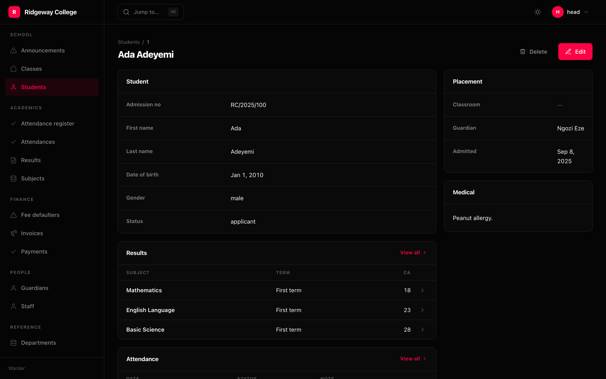
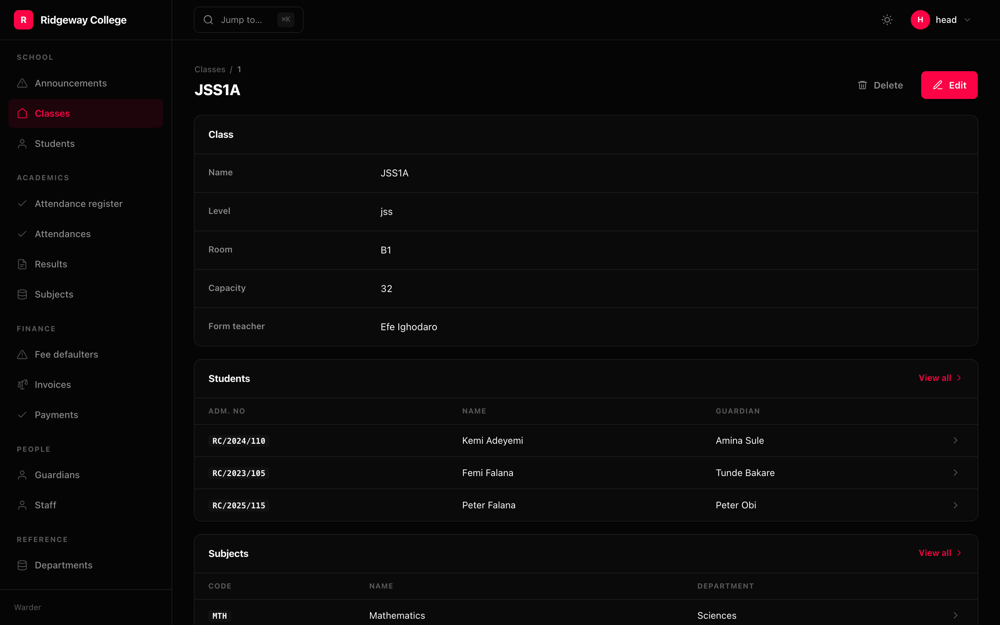

```python
Detail(
    Panel.fields("Student", "admission_no", "first_name", "last_name", "status"),
    Panel.related("Results", Result, limit=10),
    Panel.related("Attendance", Attendance, limit=10, sort=Sort.desc("on")),
    Panel.fields("Placement", "classroom", "guardian", "admitted", span="side"),
    Panel.text("Medical", lambda row: row.medical or "Nothing recorded.", span="side"),
    layout="split",
)
```

## Five kinds of panel

| | |
|---|---|
| `Panel.fields(title, *names)` | values from the row itself |
| `Panel.related(title, model, limit=)` | a window onto rows that belong to themselves |
| `Panel.inline(title, model, via=)` | child rows edited in place *(rendering only, for now)* |
| `Panel.text(title, render)` | prose built in Python |
| `Panel.custom(title, component, props=)` | one of your own React components |

The difference between the middle two is worth knowing: an **inline** panel edits
child rows and saves with the parent; a **related** panel is a read-only window
onto rows that belong to themselves and links out to their own screens.

## Values are formatted the way the list formats them



A `Panel.fields` takes names or whole `Column`s, and a bare name is dressed from
the schema at mount — so a status is a badge and a date reads "12 May 2025",
exactly as on the list. A status drawn as a badge on the list and as raw text one
click away is two answers to the same question.

```python
Panel.fields("Numbers", "words", Column.money("fee", "EUR"))
```

## Child tables reuse the child's own columns

A `Panel.related` over a **registered** model draws the first three columns of
that resource's list. So "Comments" on a post formats status and money exactly
the way the Comments screen does, and nobody declared it twice — and it stays in
step when somebody changes that screen.

The column pointing back at the parent is dropped: every comment on a post's
panel has the same post, and a column of one repeated value only takes up room.

It shows the count it did not show, and links to the full list — pre-filtered
only when the child's list has a filter that would honour it. Otherwise the query
string does nothing and reads as a broken filter rather than a link that was
never going to filter.

## Layout

```python
Panel.fields("Overview", ..., span="main")   # the default
Panel.fields("Numbers", ..., span="side")    # the right-hand column
Panel.custom("Chart", "acme/Revenue", span="full")
```

`layout="split"` gives a main column and a sidebar; `"stacked"` is one column.

## Access, per panel

```python
Panel.fields("Salary", "salary", access=Access(view="staff.salary.view"))
```

A panel this person may not view is dropped entirely rather than returned empty —
the same rule as a column, for the same reason.

## Titles

```python
Detail(..., title=lambda row: f"{row.first_name} {row.last_name}")
```

A string or a callable. Without one it is `str(row)`.
