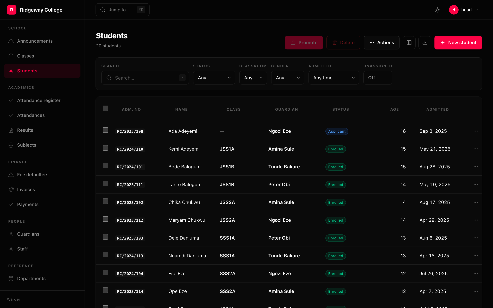

Every filter is the same thing wearing different clothes: a control in the
toolbar, a value in the query string, and a transformation of the queryset. It
declares its own control, parses its own value and applies its own narrowing.



```python
filters=[
    Filter.search("first_name", "last_name", "admission_no"),
    Filter.choice("status", STUDENT_STATES),
    Filter.relation("classroom"),
    Filter.date_range("admitted", presets=["30d", "quarter", "ytd"]),
    Filter.toggle("Unassigned", lambda rows: rows.filter(classroom_id=None)),
]
```

## The kinds

| | |
|---|---|
| `Filter.search(*fields)` | one box across several columns, OR-ed. Keyed `q` |
| `Filter.text(name, lookup=)` | one field. `icontains` by default |
| `Filter.choice(name, choices, multiple=)` | a fixed set |
| `Filter.boolean(name, labels=)` | yes / no / unset — three states, because "no filter" is one |
| `Filter.exists(name)` | whether a nullable column has a value |
| `Filter.date_range(name, presets=)` | two dates, with named shortcuts |
| `Filter.number_range(name)` | `10..50`, either end open |
| `Filter.relation(name, display=)` | a picker over the related table |
| `Filter.toggle(label, narrow)` | a chip that is on or off; `narrow(rows)` |
| `Filter.custom(label, narrow)` | anything else; `narrow(rows, value)` |

## The escape hatch is not a second code path

`Filter.custom` and `Filter.toggle` have the same three parts as every built-in
kind — a control, a query parameter, a queryset transformation — so they go
through the same pipeline. There is no "custom filters work differently" caveat
because there is no second implementation.

```python
Filter.toggle("Long reads", lambda rows: rows.filter(words__gte=800))
Filter.custom("Region", lambda rows, value: rows.filter(region=value))
Filter.custom("Tier", lambda rows, value: rows.filter(tier=value),
              choices=["free", "pro", "scale"])     # renders as a select
```

## Date presets

`today`, `yesterday`, `7d`, `30d`, `90d`, `month`, `last_month`, `quarter`,
`ytd`, `12m`, `all`. A preset a filter does not offer is refused at declaration
time, not at request time.

```python
>>> Filter.date_range("admitted", presets=["fortnight"])
ValueError: preset='fortnight' is not valid. Use one of: 'today', 'yesterday', …
```

Explicit ranges work too: `?admitted=2026-01-01..2026-02-01`.

## Unset means off

```python
>>> Filter.text("title").parse("")
None
```

`None` means "this filter is doing nothing" and is never a value. A filter that
needs to match `NULL` is `Filter.exists` instead, so there is one answer to "is
this filter on".

## Searching, and only re-fetching the rows

The search box debounces and asks for a partial reload of `rows`, `total`,
`pages` and `query` — so the navigation, the other filters and the scroll
position stay exactly where they were. Everything else applies on change,
because a select that waits for you to press a button is a select you press
twice.
