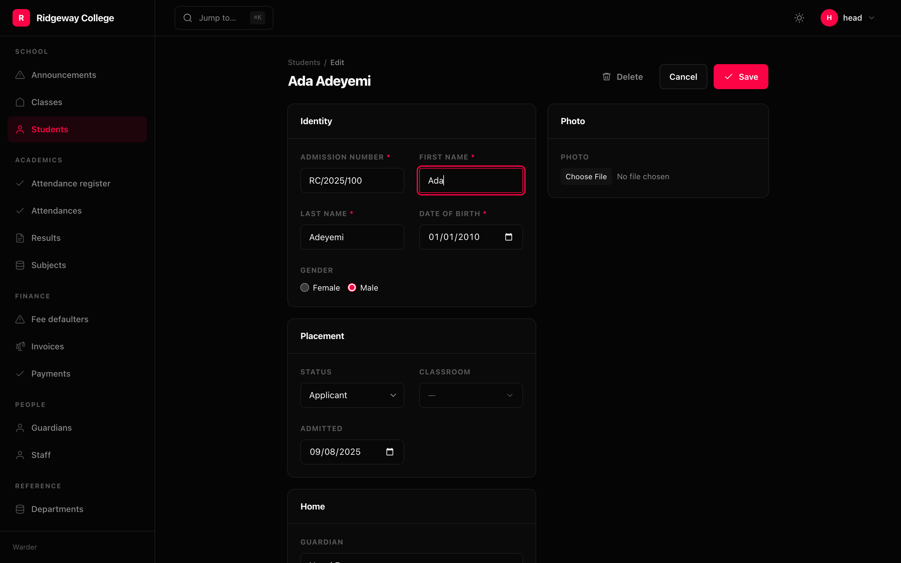

```python
Form(
    Section(
        "Identity",
        Field("admission_no", label="Admission number"),
        Field("first_name", autofocus=True),
        Field("last_name"),
        Field("date_of_birth"),
        Field.radio("gender", ["female", "male"], inline=True),
        columns=2,
    ),
    Section(
        "Placement",
        Field.select("status", STUDENT_STATES),
        Field.relation("classroom", display="name"),
        Field("admitted"),
        columns=2,
    ),
    sidebar=[Section("Photo", Field.image("photo"))],
    layout="split",
)
```

## Most fields say nothing but their name

The widget, whether the input is required, its maximum length and its choices
are all read from the **database column** at mount — from the schema, which
states them, rather than from an annotation, which describes a type.

```python
Field("published_at")      # → a datetime picker
Field("status")            # → a select, from the column's choices
Field("body")              # → a textarea, because the column is long text
```

This holds for a form you wrote as well as one that was derived. Otherwise
`Field("published_at")` inside a `Section` would be a text box while the same
field on a derived form got a date picker — the same declaration behaving
differently depending on how much of the screen you spelled out.

Name a widget when the default is wrong about the **meaning** rather than the
type: `body` and `internal_note` are both long text, and only one of them wants
Markdown.

```python
Field.markdown("body", height=360)
```

## Sections

A form of twenty inputs in one column is a form nobody finishes. An empty title
makes an unlabelled group — the right shape for the two or three fields at the
top that need no heading over them.

```python
Form(
    Section("", Field("name"), Field("slug")),
    Section("Audit", Field.readonly("created_at"), collapsed=True),
)
```

Bare fields work too, and runs of them group **where they were written** rather
than being hoisted to the top:

```python
Form(Field("a"), Section("More", Field("b")), Field("c"))
# → three groups, in that order
```

A collapsed section holding a field that failed validation is opened anyway: an
error you cannot see is an error you cannot fix.

## Conditions

```python
Field("published_at", show=When("status", equals="live"))
Field("trial_ends", show=When("plan", none_of=["free"]))
Field("vat", show=When.all(When("country", equals="GB"), When("business", is_true=True)))
```

A `When` is a condition as **data**. It is serialised into props and the renderer
evaluates it against the form's current values, so the field appears the instant
`status` becomes `live` — no round trip, no flicker.

The server evaluates the same condition before it writes. A field the condition
says is not on the form cannot be saved by somebody who edits the request.

Tests: `equals`, `not_equals`, `any_of`, `none_of`, `is_true`, `is_false`,
`filled`, `empty`, combined with `When.all`, `When.any` and `~`.

## Readonly, hidden and unviewable

Three different things:

```python
Field.readonly("created_at")                    # shown, never written
Field("token", hidden=True)                     # sent, not drawn — not a secret
Field("salary", access=Access(view="hr.view"))  # never leaves the process
```

A readonly field is readonly **on the server**: rendered disabled *and* dropped
from the write. The two have to agree, or the first is decoration.

## Validation

A check returns a message to complain and `None` to pass, so writing one takes
no imports. All of them run, so a form reports everything wrong at once rather
than one thing per submission.

```python
Field("email", validate=[
    lambda v: "Required" if not v else None,
    lambda v: "Needs an @" if v and "@" not in v else None,
])
```

Whole-form checks run only once every field has passed its own, and are given
the context and the row:

```python
def together(ctx, values, row):
    if values["ends"] < values["starts"]:
        return {"ends": "The end cannot be before the start."}

Form(..., validate=together)
```

A database constraint the form could not know about — a unique index, a NOT NULL
on a column nobody put on the form — comes back as the form with an explanation,
not a 500 and an empty form.

## Layout

```python
Form(..., layout="split", sidebar=[Section("Media", Field.image("hero"))])
Form(..., width="narrow")     # narrow, normal, wide, full
Section(..., columns=2)
Field("body", span=2)
```
