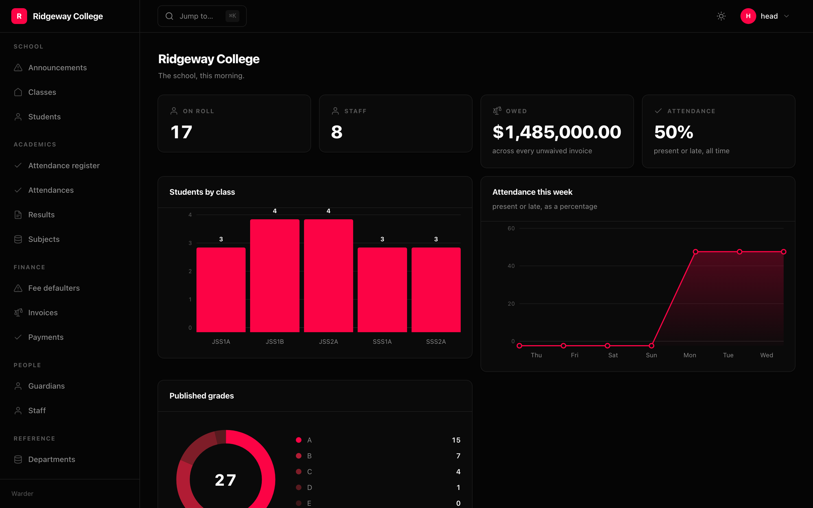

A warder keeps the keys. This one keeps your models — what is listed, what is
editable, who may see it, and which rows are theirs.

```bash
pip install warder
```



Unlike the other packages here, Warder imports under **its own name** rather
than under `sillo.`. It is not an extension of the framework's surface; it is an
application you mount on yours:

```python
from warder import Admin, Column, List, Resource

admin = Admin(title="Acme Ops", prefix="/admin")
admin.add(Resource(Post, list=List(Column("title", link=True))))
admin.mount(app)
```

That is a working admin. `Resource(Post)` on its own is also a working admin —
list, form and detail page are all derived from the model's own columns at
mount, and every derived part is replaced by naming it.

## Three ideas

Each one is a decision you feel by the second screen you write.

### A type annotation describes a type. It never selects behaviour.

Nothing in Warder reads `__annotations__`, and nothing changes because a
parameter is spelled one way rather than another. Where something must be
injected it arrives as a value — a default, a keyword — because a value is
visible and an annotation is not.

The one place arity would ordinarily be sniffed is a rule callable, so it is
not: a rule is **always** called as `(ctx, row)`, with `row` set to `None` when
the question is about the model rather than one row.

```python
Access(change=lambda ctx, row: row.team_id == ctx.user.team_id)
Gate.custom(lambda ctx: ctx.user.email.endswith("@acme.com"))   # gates see no row
```

### A declaration is a value

Nameable, storable, comparable, generatable in a loop, extendable with
`.with_()`. No metaclass, no class attributes with meanings you cannot derive,
and no registration by import side effect.

```python
def reference(model, *names):
    return Resource(
        model,
        group="Reference",
        list=List(*[Column(n) for n in names], sort=Sort.asc(names[0])),
        form=Form(Section("", *[Field(n) for n in names])),
    )

for model in (Tag, Category, Region, Currency):
    admin.add(reference(model, "name", "slug"))
```

### Mistakes fail at mount, not at request

Every reference is resolved once, at start-up, against the model — and the
error carries the file and line the declaration was written on:

```
DeclarationError: Resource(Post).list column 'titel' is not a field of Post.
  Did you mean 'title'?
  Declared at app/admin.py:24
```

Values are checked even earlier, from the constructor, where the mistake was
typed:

```python
Column("total", align="middle")
# ValueError: align='middle' is not valid. Use one of: 'left', 'center', 'right'.
```

## What you get

```
list      sortable columns, URL-backed filters, selection, bulk actions, paging,
          column visibility, CSV and JSON export of the filtered set
form      a control per widget kind, conditional fields, per-field errors,
          a searching relation picker, a many-to-many editor
detail    panels: fields, and child tables drawn with the child resource's
          own columns
dashboard number, chart and table cards
shell     grouped navigation, flash messages, a light/dark toggle, `/` to
          search and ⌘K to go anywhere
```

The interface is Inertia, React and Tailwind, and it is **in the wheel**.
`pip install warder` needs no Node, no build step and no network call.

## Requirements

Python 3.10 to 3.14, and **Sillo v1** — the context API, `HttpContext` and the
free builders in `sillo.responses`. Nothing else at runtime.

Every screenshot in this manual is of the example application in
[Quickstart](/packages/warder/quickstart/), rendered by the same build that
ships in the wheel.
