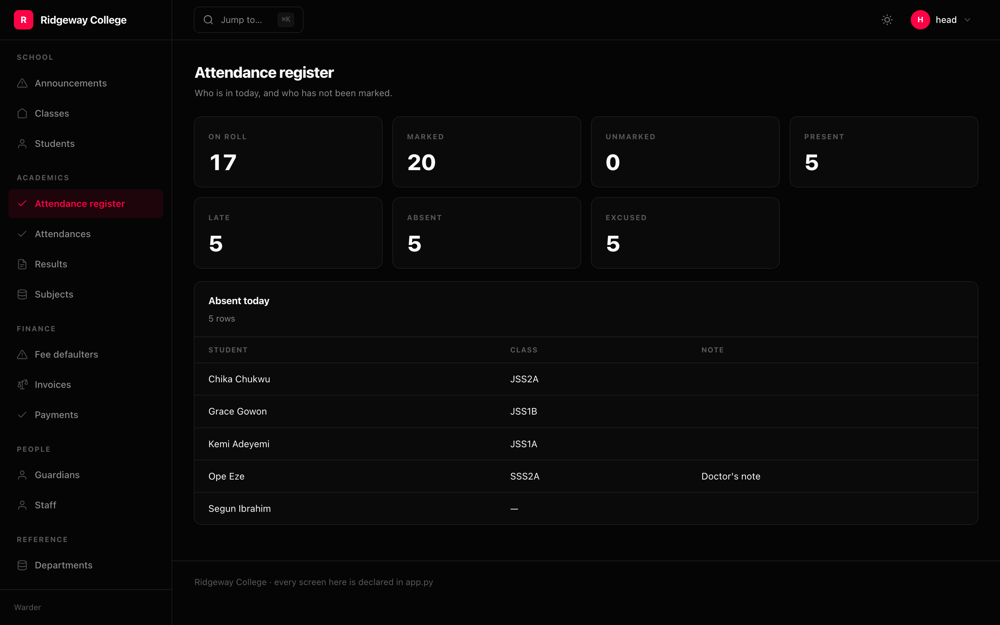

Every admin grows screens that are not a table of one model: a reconciliation
tool, a queue you work through, a page of numbers somebody opens every Monday.

```python
async def register(ctx):
    today = date.today()
    return {
        "on_roll": await Student.filter(status="enrolled").count(),
        "marked": await Attendance.filter(on=today).count(),
        "absent_today": [
            {"Student": str(a.student), "Note": a.note or ""}
            for a in await Attendance.filter(on=today, status="absent").limit(25)
        ],
    }


admin.add(
    Page("/register", "Attendance register", register,
         icon="check", group="Academics",
         description="Who is in today, and who has not been marked.")
)
```

That is gated, grouped and navigated the same way a resource is — because the
alternative is a route somewhere else in the application with its own idea of who
may see it.

## What a handler returns

A mapping, and the page renders it generically: numbers become statistics, lists
of records become tables, everything else becomes a definition list. It is not a
placeholder — it is a useful screen you did not have to build.

Return an [`Outcome`](/packages/warder/actions/) instead to redirect or download:

```python
Page("/export", "Nightly export", lambda ctx: go("/files/nightly.csv"))
```

## Your own component

```python
Page("/reconcile", "Reconciliation", reconcile, component="acme/Reconcile")
```

The props are whatever the handler returned. The component comes from your own
build — see [Embedding](/packages/warder/embedding/).

## Gates

```python
Page("/defaulters", "Fee defaulters", defaulters,
     gate=Gate.any(Gate.superuser(), Gate.permission("invoice.view")))
```

Checked on the server. The navigation hides the link too, which is a courtesy and
not a control.

## Ordering and grouping

```python
Page("/register", "Attendance register", register, group="Academics", weight=-1)
Page("/internal", "Internal", handler, hidden=True)     # routed, not in the nav
```

`Admin(groups=[...])` fixes the order of the groups themselves; anything not
named follows alphabetically.
