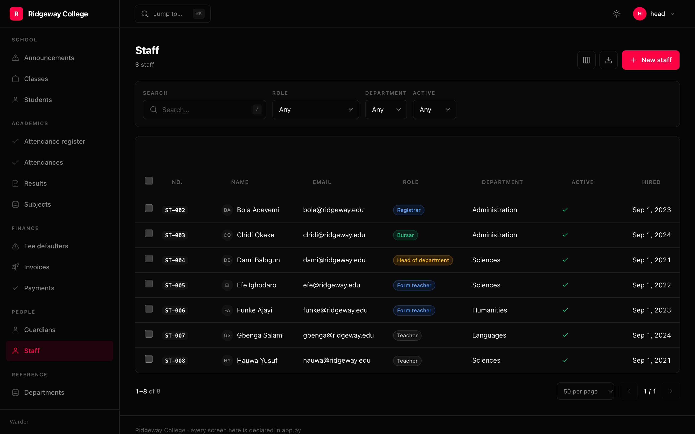

They really are different questions, and one answer does not cover the others.

| Question | Answered by |
|---|---|
| May you get in at all? | `Gate` |
| May you do this to this **model**? | `Access` |
| May you do it to **this row**? | `Access` callable, and `Scope` |
| May you see **this field**? | `Access` on a `Column` or `Field` |

None of it is a second authorisation system: it compiles onto
`sillo.permissions`, which already ships `Permission`, `Group`,
`UserPermission` and `PermissionMixin`.

## Gate — may you get in

```python
Gate.staff()                                    # the default
Gate.superuser()
Gate.permission("admin.access")
Gate.role("support")
Gate.any(Gate.role("owner"), Gate.permission("admin.access"))
Gate.custom(lambda ctx: ctx.user.email.endswith("@acme.com"))
```

`Gate.staff()` matters more than it looks. When the admin shares the
application's user model — the ordinary arrangement — every registered account
holds a session, and admitting anyone with one hands over the database.

Gates compose with `|`, `&` and `~`.

## Access — may you do this

```python
Access(view=True, add="post.add", change="post.change", delete=False)
```

Each of the four takes `True`, `False`, a permission name, or a callable invoked
as **`(ctx, row)`** — with `row` set to `None` when the question is about the
model rather than one row.

There is no arity sniffing. A rule is always `(ctx, row)`, because inspecting how
many parameters you wrote is exactly the kind of invisible behaviour this package
exists to avoid.

```python
Access(change=lambda ctx, row: row.author_id == ctx.user.id)
```

Registering a `Resource` **declares** four permissions — `<stem>.view|add|change|
delete` — so what a deployment can grant is derived from what is registered
rather than typed twice.

## Scope — which rows exist

```python
Scope.tenant("team_id")
Scope.owner("author_id")
Scope.by(lambda ctx: {"team_id": ctx.user.team_id})
Scope.query(lambda ctx, rows: rows.filter(region__in=ctx.user.regions))
```

A scope narrows the queryset before anything else touches it — the list, the
detail lookup, the form's save, and every action. Something outside your scope is
not "hidden"; as far as your session is concerned it is not there, which is the
only version of this that does not leak through a count.

**A row outside your scope is a 404, not a 403.** Telling somebody a row exists
that they may not see is itself a disclosure.

### Both are needed

```python
Resource(
    Order,
    access=Access(change=lambda ctx, row: row.team_id == ctx.user.team_id),
    scope=Scope.tenant("team_id"),
)
```

`Access` decides whether a button is shown and whether a write is allowed; `Scope`
decides what is in the list at all. Access without scope leaks the existence of
rows through pagination counts and search results; scope without access leaves a
writable object reachable by its id.

### Use current_user, not ctx.user

Inside a rule of your own, read the account with `current_user(ctx)`. The context
**raises** when no authentication middleware is installed, and
`getattr(ctx, "user", None)` does not help — the default only catches
`AttributeError`, and what comes out is a `ValueError`.

```python
from warder import Scope, current_user

async def my_students(ctx, rows):
    identity = getattr(current_user(ctx), "id", None)
    staff = await Staff.filter(user_id=identity).first() if identity else None
    if staff is None:
        # Signed in, but not staff. Nothing rather than everything: the
        # failure mode of a scope should be to show less.
        return rows.filter(pk__in=[])
    return rows.filter(classroom__form_teacher_id=staff.id)

Resource(Student, scope=Scope.query(my_students))
```

## Fields

```python
Field("salary", access=Access(view="hr.salary.view", change="hr.salary.change"))
Column("email", access=Access(view="pii.read"))
```

A field you may not view is **absent from the props**, not hidden with CSS — so it
never reaches the browser. One you may view but not change renders readonly, and
a write to it is rejected server-side rather than trusted.



The salary column above carries `Access(view="staff.salary.view")`. Somebody
without it does not see a blank cell; the column is not in the table, and the
number was never sent.

## Roles

```python
admin.roles(
    Role("teacher", grants=["student.view", "result.view", "result.add"]),
    Role("form_teacher", inherits=["teacher"], grants=["student.change"]),
    Role("bursar", grants=["invoice.view", "invoice.add", "payment.view"]),
    Role("principal", grants="*"),
)
```

A `Role` compiles to a `Group` with its `GroupPermission` rows, so after the
first sync roles are **data** — editable in the admin itself, by somebody who is
not going to edit Python.

Every grant is checked at mount against the permissions the registered resources
declare, so a typo is a start-up failure rather than a permission nobody notices
is missing:

```
Role 'registrar' grants 'class.add', which no registered resource declares.
  Did you mean 'class-room.add'?
  Declared at app/admin.py:264
```

`Role.crud(Post, Tag)` writes out the eight standard names using the same stem a
`Resource` derives, so a role written that way stays correct as resources change.

## The interface is not the control

Every check above holds against a request that skips the browser entirely. The
buttons a person cannot use are hidden, the columns they cannot see are absent,
and both are courtesies on top of a server that would refuse anyway.
