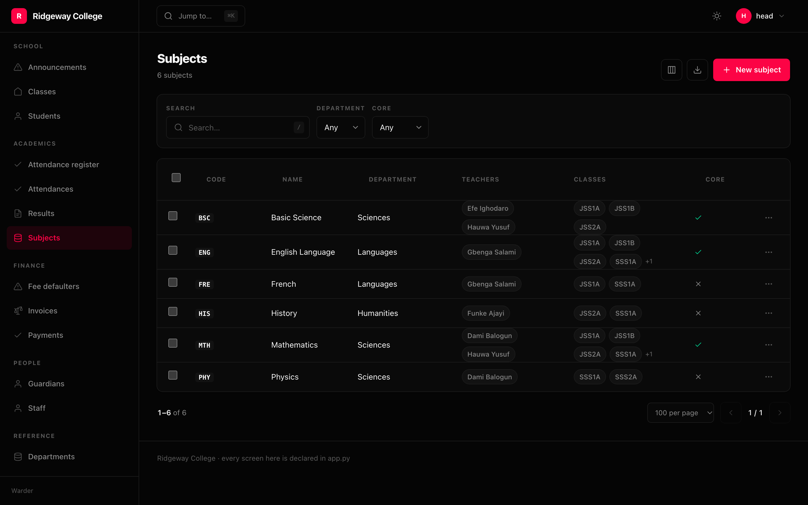
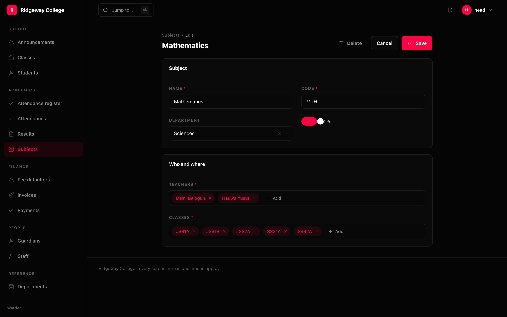

## A relation is a reference, and a reference is something you click

```python
Column.relation("author", display="name", link=True)
```

The author on a post is a link to that author. The href is computed on the
server, because only the server knows what is registered — a relation to an
unregistered model gets a label and **no** link, rather than a link to a 404.

```json
{"id": 1, "label": "Ada Lovelace", "href": "/admin/author/1"}
```

This holds everywhere a relation appears: in a list, on a detail page, and inside
a child panel.

## Declaring it is what removes the N+1

`Column.relation("author")` — and any `"author__email"` traversal — contributes
to `List.joins`, which becomes `select_related`. A plain `Column("author")` is
dressed into the same thing at mount, because the two should not behave
differently when the model says the same thing about both.

## Many-to-many

```python
Column.many("teachers", display="name")
```

Drawn as clickable chips, with the overflow collapsed to `+4`. It is
**prefetched, never joined** — one subject with four teachers is four rows if you
join it — so it costs one extra query for the page rather than one per row.

```python
>>> List(Column.many("tags")).prefetches
('tags',)
>>> List(Column.many("tags")).joins
()
```

## The picker



```python
Field.relation("classroom", display="name")
Field("tags", widget=Widget.relation(display="name", multiple=True))
```

It searches over the wire against `{resource}/options/{field}`, twenty-five rows
at a time, rather than loading every row into a `<select>`. With `multiple` it is
the many-to-many editor: chips for what is chosen, a search for what is not.

Labels for values that are already chosen are resolved through `?ids=`, or an
edit form opens showing raw numbers for everything already selected.

## Saving a set

The form sends the whole set, so the server clears and re-adds rather than
diffing — a diff would be guessing at an intent the browser already stated. Both
calls are one statement each, whatever the size of the set. Many-to-many is
written *after* the row exists, because a join table needs both sides.

## Child tables

```python
Detail(
    Panel.related("Students", Student, limit=40, sort=Sort.asc("last_name")),
    Panel.related("Subjects", Subject, limit=20),      # a many-to-many
)
```

`Panel.related` follows a foreign key **or** a many-to-many: a class's subjects
is as much "the rows belonging to this one" as a post's comments are. Two ways
back is refused at mount rather than guessed:

```
Resource(Author).detail panel 'Comments' could reach Author through 2 relations
on Comment: author, reviewer.
  Pass via= to say which one.
  Declared at app/admin.py:88
```

Picking the first of `author` and `reviewer` would be wrong half the time and
silent both halves.

## The display field

`display=` names the attribute on the far side to show. Left out, the resolver
picks one: a conventional name first (`name`, `title`, `label`, `email`,
`username`, `slug`, `code`, `reference`, `number`), then the first unique text
column, then the first text column at all — falling back to the model's own
`__str__`.
