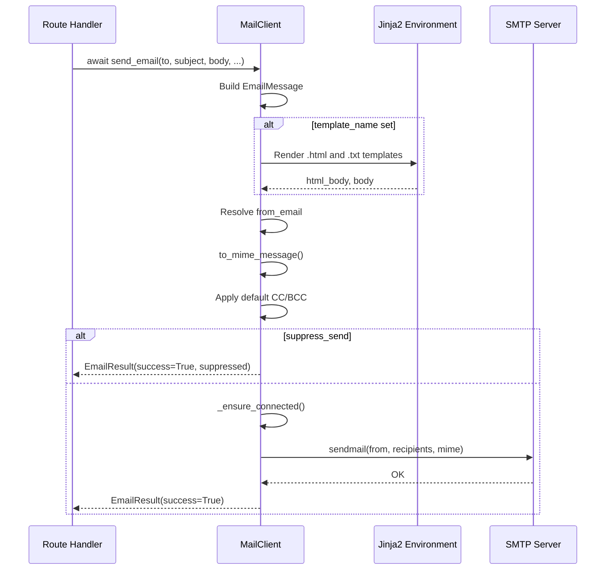
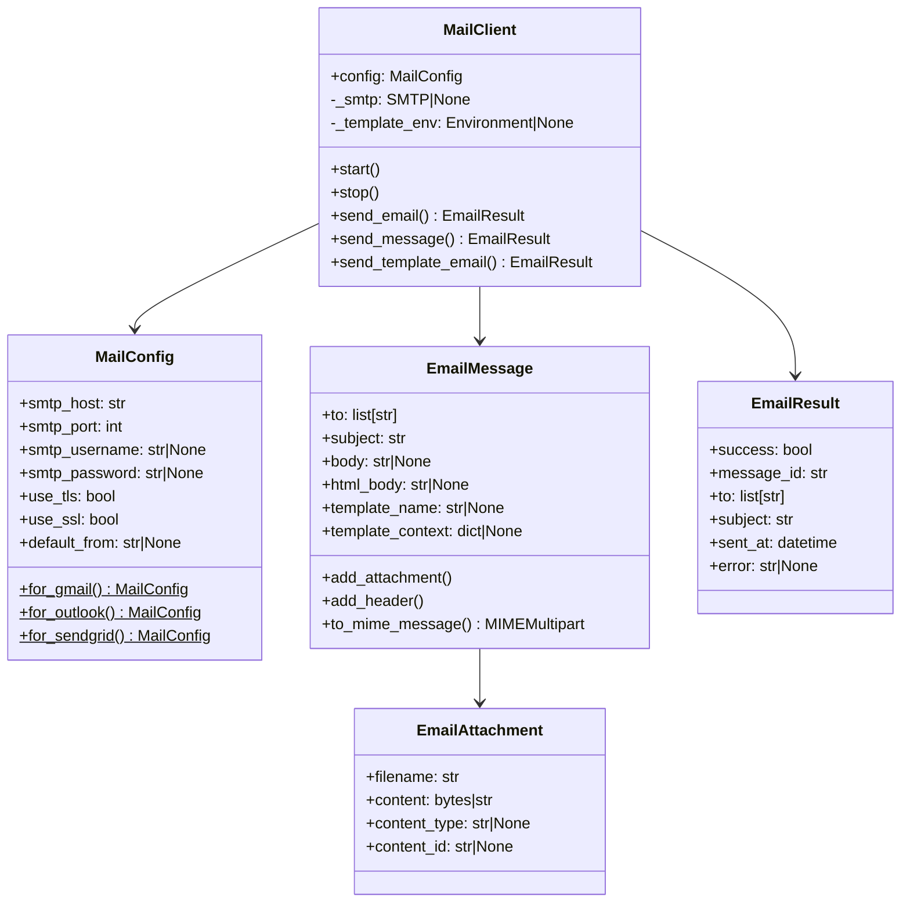
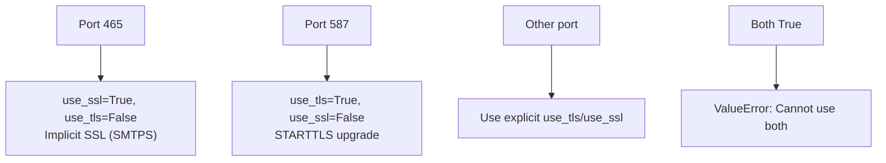
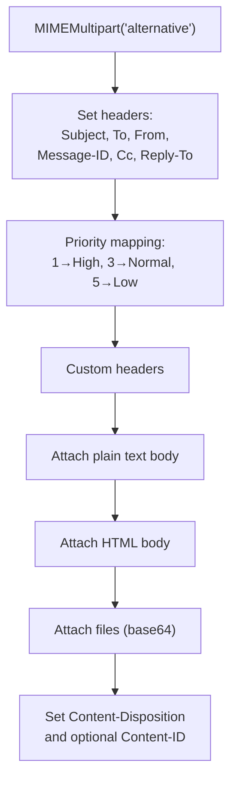
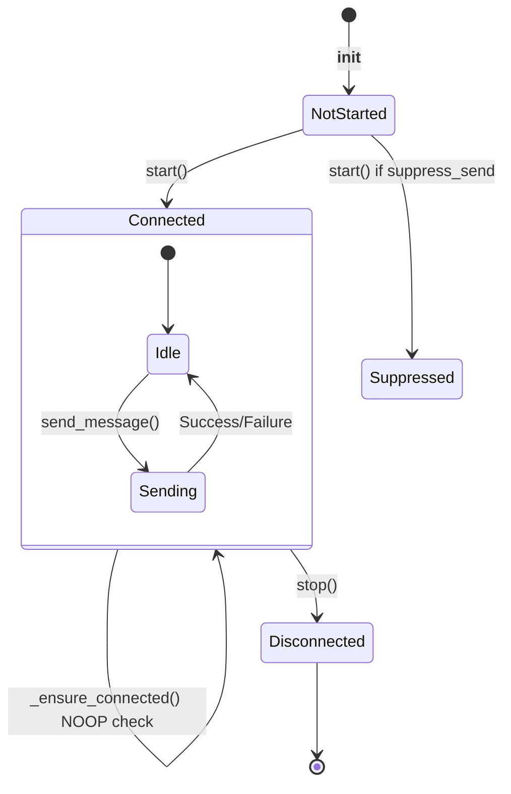

> Internal engineering reference for Sillo's email sending subsystem.
>
> Source: `core/sillo/mail/` (4 files, ~524 lines)

---

## 1. Overview and Architecture

The mail subsystem provides async email sending via SMTP with Jinja2 template
support, attachment handling, and framework lifecycle integration.

### Send Flow



### Module Layout



### File Inventory

| File | Path | Lines | Purpose |
|------|------|-------|---------|
| `__init__.py` | `core/sillo/mail/__init__.py` | 13 | Public API re-exports |
| `config.py` | `core/sillo/mail/config.py` | 103 | `MailConfig` dataclass |
| `models.py` | `core/sillo/mail/models.py` | 149 | `EmailAttachment`, `EmailMessage`, `EmailResult` |
| `client.py` | `core/sillo/mail/client.py` | 259 | `MailClient`, `setup_mail`, `get_mail_client` |

---

## 2. MailConfig

**File:** `core/sillo/mail/config.py`, line 8

A `@dataclass` with 16 fields, all with defaults read from environment variables.

### Fields

| Field | Type | Env Var | Default |
|-------|------|---------|---------|
| `smtp_host` | `str` | `SMTP_HOST` | `"localhost"` |
| `smtp_port` | `int` | `SMTP_PORT` | `587` |
| `smtp_username` | `str \| None` | `SMTP_USERNAME` | `None` |
| `smtp_password` | `str \| None` | `SMTP_PASSWORD` | `None` |
| `use_tls` | `bool` | `SMTP_USE_TLS` | `True` |
| `use_ssl` | `bool` | `SMTP_USE_SSL` | `False` |
| `default_from` | `str \| None` | `MAIL_DEFAULT_FROM` | `None` |
| `default_reply_to` | `str \| None` | `MAIL_DEFAULT_REPLY_TO` | `None` |
| `default_cc` | `list[str] \| None` |  | `None` |
| `default_bcc` | `list[str] \| None` |  | `None` |
| `smtp_timeout` | `float` | `SMTP_TIMEOUT` | `30.0` |
| `max_connections` | `int` | `SMTP_MAX_CONNECTIONS` | `10` |
| `template_directory` | `str \| None` | `MAIL_TEMPLATE_DIR` | `None` |
| `template_auto_escape` | `bool` |  | `True` |
| `debug` | `bool` | `MAIL_DEBUG` | `False` |
| `suppress_send` | `bool` | `MAIL_SUPPRESS_SEND` | `False` |

### TLS/SSL Auto-Detection

```python
# core/sillo/mail/config.py, line 53
def __post_init__(self):
    if self.use_tls and self.use_ssl:
        raise ValueError("Cannot use both TLS and SSL simultaneously")
    # Auto-detect based on port
    if self.smtp_port == 465 and not self.use_ssl:
        self.use_ssl = True
        self.use_tls = False
    elif self.smtp_port == 587 and not self.use_tls:
        self.use_tls = True
        self.use_ssl = False
```



### Factory Methods

#### `for_gmail(username, password, **kwargs)`

```python
@classmethod
def for_gmail(cls, username: str, password: str, **kwargs):
    return cls(
        smtp_host="smtp.gmail.com",
        smtp_port=587,
        smtp_username=username,
        smtp_password=password,
        use_tls=True,
        **kwargs,
    )
```

#### `for_outlook(username, password, **kwargs)`

```python
@classmethod
def for_outlook(cls, username: str, password: str, **kwargs):
    return cls(
        smtp_host="smtp-mail.outlook.com",
        smtp_port=587,
        smtp_username=username,
        smtp_password=password,
        use_tls=True,
        **kwargs,
    )
```

#### `for_sendgrid(api_key, **kwargs)`

```python
@classmethod
def for_sendgrid(cls, api_key: str, **kwargs):
    return cls(
        smtp_host="smtp.sendgrid.net",
        smtp_port=587,
        smtp_username="apikey",
        smtp_password=api_key,
        use_tls=True,
        **kwargs,
    )
```

### Serialisation

`to_dict()` (line 62) returns all fields as a dict, masking `smtp_password` as
`"***"` for safe logging.

---

## 3. EmailAttachment

**File:** `core/sillo/mail/models.py`, line 13

```python
@dataclass
class EmailAttachment:
    filename: str
    content: bytes | str
    content_type: str | None = None
    content_id: str | None = None
```

### File Path Auto-Read

```python
# core/sillo/mail/models.py, line 22
def __post_init__(self):
    if isinstance(self.content, str) and os.path.isfile(self.content):
        filepath = self.content
        with open(filepath, "rb") as f:
            self.content = f.read()
        if not self.content_type:
            self.content_type, _ = mimetypes.guess_type(filepath)
        if not self.content_type:
            self.content_type = "application/octet-stream"
```

When `content` is a string that points to an existing file, the attachment
automatically reads the file into bytes and guesses the MIME type.

### Content-ID

`content_id` is used for inline images in HTML emails:

```html

```

```python
attachment = EmailAttachment(
    filename="logo.png",
    content=logo_bytes,
    content_type="image/png",
    content_id="image001.png",
)
```

---

## 4. EmailMessage

**File:** `core/sillo/mail/models.py`, line 36

### Fields

| Field | Type | Default | Notes |
|-------|------|---------|-------|
| `to` | `str \| list[str]` | *(required)* | Normalised to `list[str]` |
| `subject` | `str` | *(required)* | |
| `body` | `str \| None` | `None` | Plain text body |
| `html_body` | `str \| None` | `None` | HTML body |
| `template_name` | `str \| None` | `None` | Jinja2 template name |
| `template_context` | `dict[str, Any] \| None` | `None` | Template variables |
| `from_email` | `str \| None` | `None` | Overrides config default |
| `reply_to` | `str \| list[str] \| None` | `None` | Normalised to `list[str]` |
| `cc` | `str \| list[str] \| None` | `None` | Normalised to `list[str]` |
| `bcc` | `str \| list[str] \| None` | `None` | Normalised to `list[str]` |
| `attachments` | `list[EmailAttachment] \| None` | `None` | Initialised to `[]` if None |
| `message_id` | `str` | `uuid4()` | Unique message identifier |
| `headers` | `dict[str, str] \| None` | `None` | Custom headers |
| `priority` | `int \| None` | `None` | 1=High, 3=Normal, 5=Low |

### Normalisation

`__post_init__` (line 55) normalises all address fields:

```python
# str -> [str]
# None -> []
self.to = [self.to] if isinstance(self.to, str) else list(self.to or [])
```

### MIME Construction

```python
# core/sillo/mail/models.py, line 91
def to_mime_message(self, from_email=None) -> MIMEMultipart:
```

Builds a complete `MIMEMultipart("alternative")` message:



**Priority mapping:**

| Priority Value | Email Header | Meaning |
|----------------|--------------|---------|
| `1` | `X-Priority: 1 (Highest)` | High |
| `3` | `X-Priority: 3 (Normal)` | Normal |
| `5` | `X-Priority: 5 (Lowest)` | Low |

---

## 5. EmailResult

**File:** `core/sillo/mail/models.py`, line 127

```python
@dataclass
class EmailResult:
    success: bool
    message_id: str
    to: list[str]
    subject: str
    sent_at: datetime = field(default_factory=lambda: datetime.now(timezone.utc))
    error: str | None = None
    provider_response: dict[str, Any] | None = None
```

### Serialisation

`to_dict()` (line 139) converts all fields to a plain dict, with `sent_at`
serialised as an ISO 8601 string.

### Usage

```python
result = await client.send_email(to="user@example.com", subject="Hello", body="World")
if result.success:
    print(f"Sent {result.message_id} at {result.sent_at}")
else:
    print(f"Failed: {result.error}")
```

---

## 6. MailClient

**File:** `core/sillo/mail/client.py`, line 22

### Constructor

```python
def __init__(self, config: MailConfig | None = None):
    self.config = config or MailConfig()
    self._smtp: smtplib.SMTP | None = None
    self._template_env: jinja2.Environment | None = None
    self._started = False
    if jinja2 is not None and self.config.template_directory:
        self._setup_templates()
```

### Template Setup

```python
# core/sillo/mail/client.py, line 34
def _setup_templates(self):
    self._template_env = jinja2.Environment(
        loader=jinja2.FileSystemLoader(self.config.template_directory),
        autoescape=self.config.template_auto_escape,
        trim_blocks=True,
        lstrip_blocks=True,
    )
```

Templates are loaded from `config.template_directory`.  Two files per email:
- `{template_name}.html`: HTML body
- `{template_name}.txt`: Plain text body (optional)

### SMTP Lifecycle



#### `async start()`

```python
async def start(self):
    if self._started:
        return
    if self.config.suppress_send:
        self._started = True
        return
    await self._connect()
    self._started = True
```

#### `async stop()`

```python
async def stop(self):
    if self._smtp:
        try:
            self._smtp.quit()
        except Exception:
            pass
    self._smtp = None
    self._started = False
```

#### `_connect_sync()`

```python
# core/sillo/mail/client.py, line 74
def _connect_sync(self):
    if self.config.use_ssl:
        self._smtp = smtplib.SMTP_SSL(
            self.config.smtp_host,
            self.config.smtp_port,
            timeout=self.config.smtp_timeout,
        )
    else:
        self._smtp = smtplib.SMTP(
            self.config.smtp_host,
            self.config.smtp_port,
            timeout=self.config.smtp_timeout,
        )
        if self.config.use_tls:
            self._smtp.starttls()

    if self.config.debug:
        self._smtp.set_debuglevel(1)

    if self.config.smtp_username and self.config.smtp_password:
        self._smtp.login(self.config.smtp_username, self.config.smtp_password)
```

Connection runs in a thread executor to avoid blocking the async event loop.

#### `_ensure_connected()`

```python
# core/sillo/mail/client.py, line 95
async def _ensure_connected(self):
    if self.config.suppress_send:
        return
    if self._smtp is None:
        await self._connect()
        return
    try:
        self._smtp.noop()
    except Exception:
        await self._connect()
```

Health check via SMTP `NOOP` command.  Reconnects automatically on failure.

### Sending Methods

#### `send_email(...)`: Convenience Method

```python
# core/sillo/mail/client.py, line 110
async def send_email(
    self,
    to,
    subject,
    body=None,
    html_body=None,
    from_email=None,
    reply_to=None,
    cc=None,
    bcc=None,
    attachments=None,
    template_name=None,
    template_context=None,
    **kwargs,
) -> EmailResult:
```

Builds an `EmailMessage` from the parameters, adds attachments (supporting both
`EmailAttachment` objects and plain dicts with `**att` unpacking), and delegates
to `send_message()`.

#### `send_message(message)`: Core Send Logic

```python
# core/sillo/mail/client.py, line 166
async def send_message(self, message: EmailMessage) -> EmailResult:
```

**Steps:**

1. **Render template** if `template_name` is set and `_template_env` exists.
2. **Resolve `from_email`**: message → config default → raise `ValueError`.
3. **Build MIME** via `message.to_mime_message(from_email)`.
4. **Apply defaults** from config: `default_cc`, `default_bcc`.
5. **Suppress check**: If `suppress_send`, return success with `{"suppressed": True}`.
6. **Ensure connection**, then run `_send_mime` in executor.
7. **Return** `EmailResult(success=True)` on success.
8. **On exception**: Return `EmailResult(success=False, error=str(e))`.

#### `_render_template(message)`: Template Rendering

```python
# core/sillo/mail/client.py, line 221
def _render_template(self, message: EmailMessage):
    if not self._template_env or not message.template_name:
        return
    context = message.template_context or {}

    # HTML body (required)
    template = self._template_env.get_template(f"{message.template_name}.html")
    message.html_body = template.render(**context)

    # Plain text body (optional)
    try:
        txt_template = self._template_env.get_template(f"{message.template_name}.txt")
        message.body = txt_template.render(**context)
    except jinja2.TemplateNotFound:
        pass  # Plain text is optional
```

### send_template_email: Wrapper

```python
# core/sillo/mail/client.py, line 147
async def send_template_email(
    self,
    to,
    subject,
    template_name,
    context=None,
    from_email=None,
    **kwargs,
) -> EmailResult:
    return await self.send_email(
        to=to,
        subject=subject,
        template_name=template_name,
        template_context=context,
        from_email=from_email,
        **kwargs,
    )
```

---

## 7. Framework Integration

### `setup_mail(app, config)`

**File:** `core/sillo/mail/client.py`, line 241

```python
def setup_mail(app, config: MailConfig | None = None) -> MailClient:
    if hasattr(app.state, "mail_client"):
        return app.state.mail_client

    client = MailClient(config)
    app.state.mail_client = client

    app.on_startup(client.start)
    app.on_shutdown(client.stop)

    return client
```

**Lifecycle integration:**

| Event | Action |
|-------|--------|
| `app.on_startup` | Calls `client.start()`: establishes SMTP connection |
| `app.on_shutdown` | Calls `client.stop()`: closes SMTP connection |

### `get_mail_client(request)`

**File:** `core/sillo/mail/client.py`, line 252

```python
def get_mail_client(request) -> MailClient:
    client = request.state._state.get("mail_client")
    if client is None:
        raise RuntimeError(
            "Mail client not initialized. Call setup_mail(app) during startup."
        )
    return client
```

Accesses the client stored in `app.state.mail_client` via the request's state
proxy. Requires a request — `current_mail()` below does not.

### `send_email(...)`

**File:** `core/sillo/mail/client.py`

The way to send mail from a handler, a queue job, or a script — nothing to
fetch first, no request required:

```python
from sillo.mail import send_email

async def process_signup(user):  # a queue job, not a handler
    await send_email(user.email, "Welcome", body="...")
```

### `current_mail()`

**File:** `core/sillo/mail/context.py`

The client itself, for the two things `send_email(...)` doesn't cover:
`send_message(message)` for a prebuilt `EmailMessage`, and
`send_template_email(...)` when its distinct signature reads better than
`send_email`'s `template_name=`/`template_context=` kwargs. Most code never
needs this — `send_email(...)` already is `current_mail().send_email(...)`.

`setup_mail` registers the client with `sillo._internals.registry`, the same
[instance registry](/v0.x/advanced/context-binding/) `sillo.storage` uses — a
plain slot filled at startup, not scoped to a request, because mail is sent
from queue jobs and scripts at least as often as from a handler. The trade
that makes explicit: the registry holds one client at a time, whichever
`setup_mail` call registered last. That is exactly the assumption
`app.state.mail_client` already made — one mail client per application — made
visible rather than implicit in a lookup key.

### Usage Pattern

```python
from sillo.mail import setup_mail, send_email, MailConfig

# At startup
config = MailConfig.for_gmail("user@gmail.com", "app-password")
setup_mail(app, config)

# In handler, a queue job, or a script
async def send_welcome(user):
    result = await send_email(
        to="newuser@example.com",
        subject="Welcome!",
        template_name="welcome",
        context={"username": "Alice"},
    )
    return {"sent": result.success}
```

---

## 8. Error Handling

### Connection Errors

```python
try:
    await client.send_email(...)
except smtplib.SMTPConnectError:
    # Server refused connection
except smtplib.SMTPAuthenticationError:
    # Bad credentials
except smtplib.SMTPException as e:
    # General SMTP error
```

### Graceful Degradation

`send_message` catches all exceptions and returns an `EmailResult` with
`success=False` rather than raising:

```python
# core/sillo/mail/client.py, line 209
try:
    self._send_mime(mime_message, all_recipients)
    return EmailResult(
        success=True,
        message_id=message.message_id,
        to=message.to,
        subject=message.subject,
    )
except Exception as e:
    logger.error(f"Failed to send email: {e}")
    return EmailResult(
        success=False,
        message_id=message.message_id,
        to=message.to,
        subject=message.subject,
        error=str(e),
    )
```

### Missing from_email

Raises `ValueError` if no `from_email` is provided in the message or config:

```python
from_email = message.from_email or self.config.default_from
if not from_email:
    raise ValueError(
        "No from_email specified. Set it on the message or in MailConfig.default_from."
    )
```

---

## 9. Testing with suppress_send

### Configuration

```python
# In test settings
config = MailConfig(
    suppress_send=True,
    default_from="test@example.com",
)
```

When `suppress_send=True`:

1. `start()` marks `_started = True` without connecting.
2. `_ensure_connected()` returns immediately.
3. `send_message()` returns `EmailResult(success=True, provider_response={"suppressed": True})`.

### Test Pattern

```python
import pytest
from sillo.mail import MailClient, MailConfig

@pytest.fixture
def mail_client():
    config = MailConfig(suppress_send=True, default_from="test@example.com")
    return MailClient(config)

async def test_send_email(mail_client):
    result = await mail_client.send_email(
        to="user@example.com",
        subject="Test",
        body="Hello",
    )
    assert result.success is True
    assert result.to == ["user@example.com"]
    assert result.subject == "Test"

async def test_send_with_template(mail_client, tmp_path):
    # Create template
    template_dir = tmp_path / "templates"
    template_dir.mkdir()
    (template_dir / "welcome.html").write_text("<h1>Welcome {{ name }}</h1>")

    config = MailConfig(
        suppress_send=True,
        template_directory=str(template_dir),
        default_from="test@example.com",
    )
    client = MailClient(config)
    client._setup_templates()

    result = await client.send_template_email(
        to="user@example.com",
        subject="Welcome",
        template_name="welcome",
        context={"name": "Alice"},
    )
    assert result.success is True
```

### Inspecting Suppressed Emails

For more detailed testing, capture the `EmailMessage` before it's suppressed:

```python
from unittest.mock import patch, AsyncMock

async def test_email_content():
    client = MailClient(MailConfig(suppress_send=True, default_from="test@test.com"))

    with patch.object(client, "send_message", wraps=client.send_message) as mock:
        await client.send_email(
            to="user@example.com",
            subject="Test",
            body="Hello World",
        )
        # Inspect the EmailMessage that was passed to send_message
        message = mock.call_args[0][0]
        assert message.subject == "Test"
        assert message.body == "Hello World"
```
