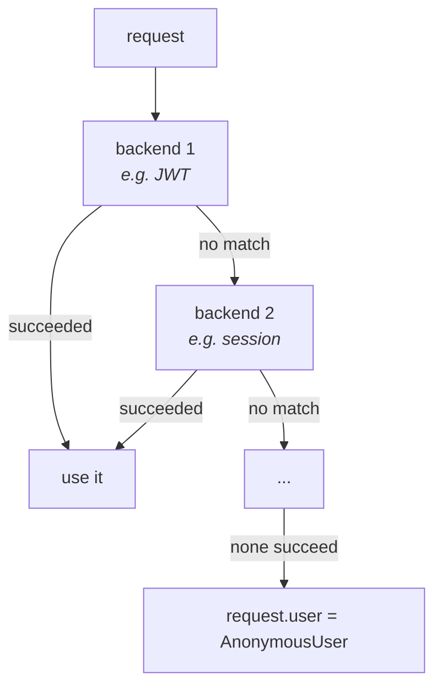
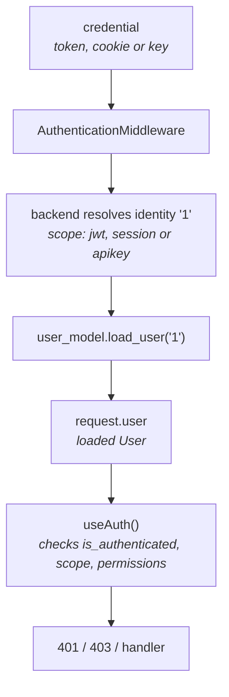

#  Authentication

sillo authentication has a clean two-layer shape:

1. **`AuthenticationMiddleware`** runs once per request and answers *who is this caller?* It attaches a user object to `request.user`. It never rejects a request.
2. **`useAuth`** is a per-route gate that answers *is this user allowed to call this handler?* It runs just before your handler and raises 401/403 on failure.

The middleware is **backend-driven**: each backend knows how to read exactly
one credential type: a JWT, a session cookie, or an API key. You compose
backends to support several auth strategies in one app.

##  The smallest working integration

This is the whole thing: a JWT backend that resolves `request.user`, and a protected `/me` route.

```python
# app.py
from sillo import SilloApp
from sillo.record import setup_record, DatabaseConfig
from sillo.auth import AuthenticationMiddleware, useAuth
from sillo.auth.jwt_auth import JWTAuthBackend
from sillo.users import User

app = SilloApp()

# database (creates the "users" table)
db = setup_record(app, DatabaseConfig.sqlite("app.db"), model_modules=["myapp.models"])

# resolve request.user from a bearer token
app.use(AuthenticationMiddleware(
    user_model=User,
    backend=JWTAuthBackend(secret_key="change-me", identifier="sub"),
))

@app.get("/me", auth=useAuth())
async def me(request, response):
    return {"id": request.user.identity, "email": request.user.email}
```

###  Or let the app mount it

`SilloApp(auth=...)` mounts the same middleware **and** publishes each
backend as an OpenAPI security scheme, so your reference documents the auth
you actually enforce rather than a list you maintain separately:

```python
app = SilloApp(
    auth=[JWTAuthBackend(secret_key="change-me", identifier="sub")],
    auth_user_model=User,
)

@app.get("/me", auth=useAuth(schemes=["bearerAuth"]))
async def me(request, response): ...
```

See [Documenting Authentication](/v0.x/guides/openapi/authentication-documentation/)
for how the route's `security` is derived, and for `strict_security`, which
turns a mismatch between the two into an error instead of a lie.

```python
# myapp/models.py
from sillo.users import User

# create a user once, then issue a token for it
user = await User.objects.create_user(
    email="alice@example.com", username="alice", password="StrongP@ss1",
)
token = TokenForUser(user, secret="change-me").token_pair()["access_token"]
# GET /me  with  Authorization: Bearer <token>  →  request.user is alice
```

Two things to internalize from this snippet:

- **`identifier="sub"` is required** for sillo-issued tokens. `TokenForUser`
  writes the user id into the JWT `sub` claim, and the backend reads the claim
  named by `identifier`. The backend defaults to `identifier="id"`, which won't
  match, leaving you with an empty identity and an unauthenticated user. Always
  pin `identifier="sub"` unless you issue tokens with a different claim.
- **`useAuth()` with no args means "any authenticated user."** Without it, the handler runs even for anonymous callers (with `AnonymousUser` as `request.user`). The middleware resolves; the gate enforces.

##  The two layers, in detail

###  Layer 1: AuthenticationMiddleware resolves the user

For every request, the middleware walks its backends in order and stops at the first that succeeds:



On success a backend returns an `AuthResult(identity, scope)`. The middleware then calls `user_model.load_user(identity)` to build the full user object and stores it on `request.scope["user"]`. It also stores the backend's `scope` string (e.g. `"jwt"`, `"session"`, `"apikey"`) on `request.scope["auth"]`.

So the central arrow in sillo auth is: **credential → identity string → `load_user` → `request.user`**. Everything else is a way of producing that identity.

###  Layer 2: useAuth enforces policy

`useAuth` runs *after* the middleware, right before your handler. It inspects `request.user` and `request.scope["auth"]` and decides yes/no:

```python
@app.get("/me", auth=useAuth())                          # any authenticated user
@app.get("/api", auth=useAuth(schemes=["bearerAuth"]))   # only JWT callers
@app.get("/users", auth=useAuth(permissions=["read:users"]))
@app.get("/feed", auth=useAuth(required=False))          # runs either way
async def handler(request, response): ...
```

On failure it raises `AuthenticationFailed` (401) or `PermissionDenied` (403). See [Protecting Routes](/v0.x/guides/protecting-routes/) for the full gate reference.

<aside type="caution" title="The middleware sets the user; the gate enforces it">
`AuthenticationMiddleware` only *resolves* the user. It deliberately never
rejects a request. An anonymous caller still reaches your handler with
`request.user.is_authenticated == False`. Rejecting unauthorized callers is the
job of `useAuth`. Put `auth=useAuth()` (or a stricter variant) on every
protected route rather than hand-checking `request.user` inside the handler,
it's the single, testable boundary.
</aside>

##  Scope strings

Each backend stamps its scheme name on `request.scope["auth"]` and `["auth_scheme"]`. That string is what `useAuth(schemes=[...])` checks against:

| Backend | `request.scope["auth"]` |
| --- | --- |
| `JWTAuthBackend` | `"jwt"` |
| `SessionAuthBackend` | `"session"` |
| `APIKeyAuthBackend` | `"apikey"` |

`schemes=[]` (the default) accepts *any* credential. `schemes=["bearerAuth"]`
restricts a route to JWT callers, a useful guard against the wrong credential
type reaching a handler, and it becomes the route's documented `security` at
the same time.

##  Combining backends

Pass a list to accept more than one credential type. **Order matters**. The
first backend that succeeds wins:

```python
app.use(AuthenticationMiddleware(
    user_model=User,
    backend=[
        JWTAuthBackend(secret_key=JWT_SECRET, identifier="sub"),
        SessionAuthBackend(),
    ],
))
```

A request with a valid bearer token authenticates as `"jwt"`; one with only a session cookie as `"session"`; one with neither gets `AnonymousUser` and `request.scope["auth"]` is `None`. Combining JWT + session is common for an app that serves both a browser UI and a JSON API.

##  Choosing a strategy

| Strategy | Credential | Best for |
| --- | --- | --- |
| JWT | `Authorization: Bearer <token>` | SPAs, mobile, stateless APIs |
| Session | signed cookie (via `SessionMiddleware`) | server-rendered web apps |
| API key | `X-API-Key` header | server-to-server, programmatic access |

You are not limited to one, compose them as above. Each has its own page:

- [JWT Authentication](/v0.x/guides/jwt-auth/)
- [Session Authentication](/v0.x/guides/session-auth/)
- [API Keys](/v0.x/guides/api-keys/)

##  What a user object looks like

Every `user_model` satisfies the `UserProtocol` contract: `is_authenticated`,
`identity`, `display_name`, `has_permission`, and a `load_user(identity)`
classmethod. sillo ships a ready `User` model (Record/Tortoise-backed, built on
`UserBaseModel`), a `SimpleUser` for tests, and `AnonymousUser` as the
unauthenticated sentinel. The identity the middleware hands to `load_user` is a
**string** (the backend's choice: for JWT it's the `sub` claim; for session,
the stored user id; for API keys, the `user_id`).

See [Users & User Models](/v0.x/guides/users/) for the built-in `User`, building custom users, permissions, and password hashing.

##  Writing a custom backend

A backend is just `authenticate(request) -> AuthResult`. Return `AuthResult(success=True, identity=..., scope=...)` to accept, or `AuthResult(success=False, ...)` to decline (so the next backend gets a turn). This is how you'd add, say, a Bearer-token-vs-API-key-within-one-header scheme, or an OAuth introspection backend:

```python
from sillo.auth.backend import AuthenticationBackend
from sillo.auth.model import AuthResult

class HeaderBackend(AuthenticationBackend):
    async def authenticate(self, request):
        token = request.headers.get("X-Service-Token")
        if not token:
            return AuthResult(success=False, identity="", scope="")
        # ... verify token, resolve a user id ...
        return AuthResult(success=True, identity=str(user_id), scope="service")
```

Register it like any built-in: `AuthenticationMiddleware(user_model=User, backend=HeaderBackend())`. Set `name = "service"` on the backend and `useAuth(schemes=["service"])` gates on it; give it a `describe()` and it documents itself too.

##  Error handling

Both auth failures surface as HTTP exceptions you can catch and reformat like any other:

```python
from sillo.auth.exceptions import AuthenticationFailed, PermissionDenied

@app.add_exception_handler(AuthenticationFailed)
async def on_401(request, response, exc):
    return response.json({"error": "unauthorized"}, status_code=401)
```

| Condition | Status | Exception |
| --- | --- | --- |
| No user + `required=True` | 401 | `AuthenticationFailed` |
| Scope mismatch | 401 | `AuthenticationFailed` |
| Permission denied | 403 | `PermissionDenied` |

`add_exception_handler` is global — every route whose gate raises that exception
goes through it. When one particular route needs to fail differently — a page
that redirects to `/login` while your API returns JSON — give that gate its own
`unauthorized`/`forbidden` hooks instead of routing failures through a shared
handler that then has to branch:

```python
@app.get(
    "/dashboard",
    auth=useAuth(
        unauthorized=lambda request, response: response.redirect("/login"),
    ),
)
async def dashboard(request, response): ...

@app.get(
    "/api/orders",
    auth=useAuth(
        permissions=["orders:read"],
        unauthorized=lambda request, response: response.json(
            {"error": "sign_in_required"}, status_code=401
        ),
        forbidden=lambda request, response: response.json(
            {"error": "not_allowed"}, status_code=403
        ),
    ),
)
async def orders(request, response): ...
```

Each hook is called as `hook(request, response)` — sync or async, your choice —
and whatever it returns becomes the response; the route handler never runs.
`unauthorized` answers the 401 a missing or mismatched scheme would have
raised, `forbidden` answers the 403 a missing permission would have raised.
Set one, both, or neither — a gate with no hooks behaves exactly as before, so
existing routes are unaffected. This is the finer-grained sibling of
`add_exception_handler`, not a replacement for it: reach for a gate-level hook
when one route needs its own answer, and for the global handler when every
route protected by a given exception type should agree.

##  How it all connects



If you keep that diagram in mind, every other auth feature in sillo is just a different way of producing the credential or the identity on the left.

##  Next steps

- [Protecting Routes](/v0.x/guides/protecting-routes/): every `useAuth` option,
  scopes, permissions, subclassing
- [Users & User Models](/v0.x/guides/users/): `User`, `UserProtocol`,
  `UserBaseModel`, `SimpleUser`, passwords
- [JWT Authentication](/v0.x/guides/jwt-auth/): issuing and verifying tokens
- [Session Authentication](/v0.x/guides/session-auth/): `SessionGuard` and cookie
  login
- [API Keys](/v0.x/guides/api-keys/): scoped, hashed keys


##  Choosing an authentication strategy

The decision is driven by what the client is, not by preference.

**A browser application you also build.** Cookie sessions. The browser
manages storage, `HttpOnly` keeps the credential away from JavaScript,
and revocation is immediate with a server-side store. The cost is
[CSRF](/v0.x/guides/csrf/) exposure, which is a solved problem.

**A mobile app or a third-party API client.** Bearer tokens. Nothing is
automatic, which removes CSRF entirely, and the client controls storage. The
cost is revocation. A stateless token is valid until it expires unless you keep
a denylist.

**Machine-to-machine.** [API keys](/v0.x/guides/api-keys/). Long-lived,
scoped, revocable, and issued per integration rather than per user.

**Someone else's identity provider.** OAuth2 or OIDC. You stop storing
passwords, which is the single largest reduction in risk available, and
you take on redirect-flow complexity.

Most applications end up with two: sessions for the browser, tokens or keys for
the API. That is fine as long as each endpoint is explicit about which it
accepts. An endpoint accepting either has the CSRF exposure of whichever the
caller used.

##  What authentication must never do

**Never store a password recoverably.** Hash with bcrypt, scrypt, or Argon2.
Never a general-purpose hash, however many rounds. See [Hashing
helpers](/v0.x/guides/helpers/hashing/).

**Never reveal which half of a credential was wrong.** "No such user" and
"wrong password" together are a user-enumeration oracle. One message for both,
and the same response time, an early return on a missing user is measurably
faster and is itself the oracle.

**Never trust a client-supplied identity.** A user id in a header, a body
field, or a query parameter is a value the client chose. Identity comes
from a verified credential and nowhere else.

**Never leave authentication endpoints unlimited.** Login, password
reset, and token refresh are where credential stuffing lands. Rate limit
by IP and by account, and lock or delay after repeated failures. See
[Rate Limiting](/v0.x/guides/rate-limiting/).

**Never log credentials.** A password in a request body, a token in a URL, an
`Authorization` header in a debug dump. Each is a credential with a timestamp
on it.

##  Sessions after login

Two things happen at login that are easy to omit and hard to notice.

**Regenerate the session identifier.** Reusing the pre-login id means an
attacker who could set the victim's cookie beforehand shares the session
afterwards. This is session fixation, and it is still common.

**Record enough to revoke.** Storing the session with its user id, issue
time, and a device label lets you build "sign out everywhere", which
users expect and which is impossible after the fact if you did not store
it.

Expire on two clocks. An idle timeout for abandoned sessions on shared
machines, and an absolute lifetime that bounds how long a stolen session is
useful. Neither alone is sufficient.


##  Testing authentication

Three tests per protected endpoint, and the middle one is the one that
finds bugs: anonymous is rejected, the wrong user is rejected, the right
user succeeds.

Build the credentials through your real login path rather than by
constructing a session or signing a token in the test. A helper that
fabricates a valid token will keep passing after the verification code
breaks, which is precisely backwards.

For the negative cases, cover the specific failures: an expired
credential, one signed with the wrong key, one for a different audience,
and a malformed one. Each takes a different branch in the verifier, and
a verifier that accepts any of them is broken in a way the happy path
cannot reveal.


##  Related

- [Protecting Routes](/v0.x/guides/protecting-routes/): declaring the requirement
- [Permissions](/v0.x/guides/permissions/): what an authenticated caller may do
- [Sessions](/v0.x/guides/sessions/): cookie-based credentials
- [JWT Auth](/v0.x/guides/jwt-auth/): token-based credentials
- [API Keys](/v0.x/guides/api-keys/): machine-to-machine credentials
- [Hashing helpers](/v0.x/guides/helpers/hashing/): storing passwords correctly
- [Rate Limiting](/v0.x/guides/rate-limiting/): protecting the login path


##  Migrating an authentication scheme

Changing how users authenticate is a migration, not a deploy. The pattern
that works: accept both old and new credentials for a period, issue only
new ones, measure how many old ones are still in use, then stop accepting
them.

For a password-hash change (bcrypt to Argon2, or a cost increase) you cannot
rehash without the plaintext, which you only have at login. Verify against the
old hash, and on success rehash with the new parameters and store it. After
enough logins, the remainder are dormant accounts that can be forced through a
reset.


##  Summary

Pick the credential type from the client, not from preference. Hash
passwords with a password hash. Never let identity come from something
the caller supplied. Rate limit the login path. Regenerate session
identifiers on privilege change. And test the negative cases, because the
happy path passes without them.
