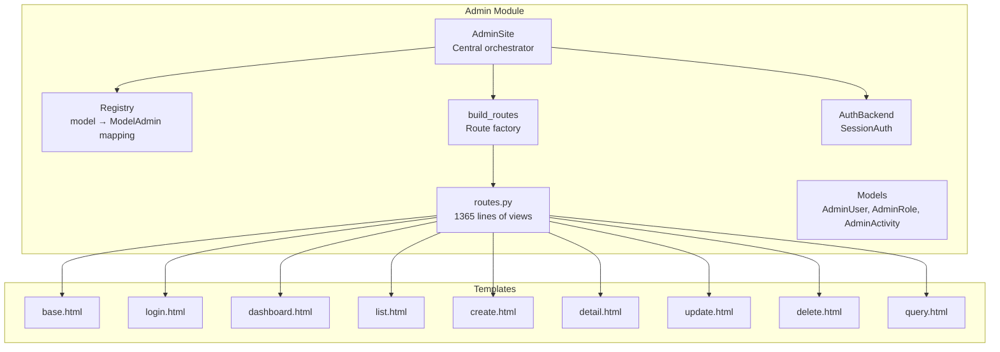
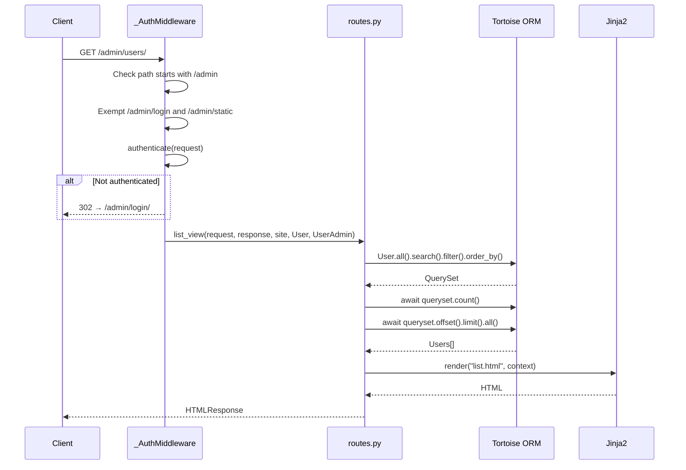
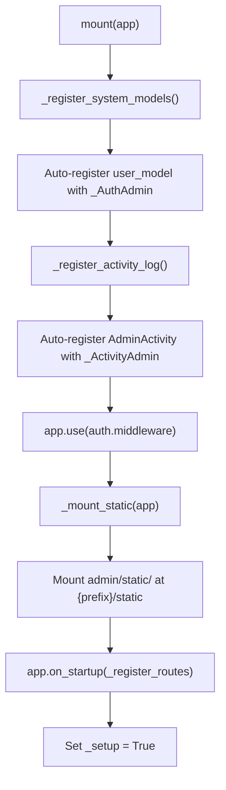
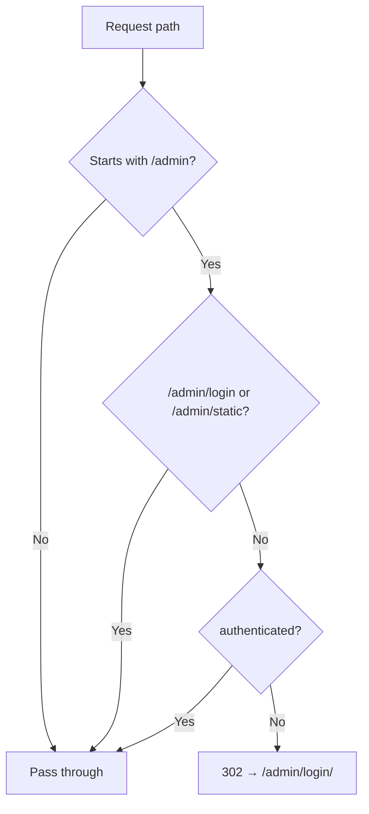
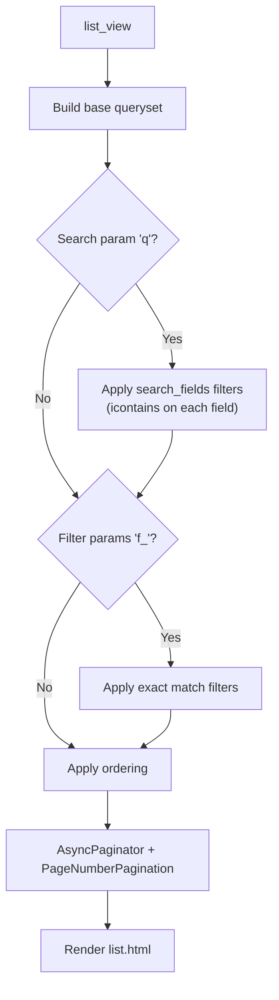

> Internal engineering reference for Sillo's admin interface.
>
> Source: `core/sillo/admin/` (8 Python files + 9 Jinja2 templates, ~2,311 lines)

---

## 1. Overview and Architecture

The admin subsystem provides a Django Admin-level full-featured CRUD interface
for Sillo models.  It auto-generates list/create/read/update/delete views from
Tortoise ORM model metadata, with role-based access control, audit logging, and
a raw SQL query interface for superusers.

### Architecture Diagram



### Request Flow



### File Inventory

| File | Path | Lines | Purpose |
|------|------|-------|---------|
| `__init__.py` | `core/sillo/admin/__init__.py` | 222 | `AdminSite`, `setup_admin` |
| `auth.py` | `core/sillo/admin/auth.py` | 185 | `AuthBackend`, `SessionAuth`, `_AuthMiddleware` |
| `default_user.py` | `core/sillo/admin/default_user.py` | 97 | `AdminRole`, `AdminUser` |
| `models.py` | `core/sillo/admin/models.py` | 41 | `AdminActivity` |
| `registry.py` | `core/sillo/admin/registry.py` | 143 | `ModelAdmin`, `Registry` |
| `router.py` | `core/sillo/admin/router.py` | 205 | `build_routes` |
| `routes.py` | `core/sillo/admin/routes.py` | 1365 | All view functions |
| `templating.py` | `core/sillo/admin/templating.py` | 52 | Sync Jinja2 rendering |

### Templates

| Template | Purpose |
|----------|---------|
| `base.html` | Base layout with sidebar, header, content area |
| `login.html` | Login form |
| `dashboard.html` | Model cards + recent activity |
| `list.html` | Data table with search/sort/filter/pagination |
| `create.html` | Create form with FK/M2M widgets |
| `detail.html` | Read-only detail view with reverse relations |
| `update.html` | Edit form with reverse relation editing |
| `delete.html` | Confirmation page |
| `query.html` | Raw SQL query interface |

---

## 2. AdminSite

**File:** `core/sillo/admin/__init__.py`, line 41

### Constructor

```python
class AdminSite:
    def __init__(
        self,
        title: str = "Recorder Admin",
        prefix: str = "/admin",
        auth_backend: AuthBackend | None = None,
        user_model: type | None = None,
    ):
```

- `title`: Displayed in header and browser tab.
- `prefix`: URL prefix for all admin routes.
- `auth_backend`: Defaults to `SessionAuth`.
- `user_model`: Defaults to `AdminUser`.
- Creates `self.registry = Registry()`.
- Creates `self.auth = auth_backend or SessionAuth(user_model=user_model or AdminUser)`.

### `register(model_class, admin_class=None)`

Can be used as a decorator or direct call:

```python
# As decorator
@admin.register(User)
class UserAdmin(ModelAdmin):
    list_display = ["id", "email", "is_active"]

# Direct call
admin.register(User, UserAdmin)
```

If `admin_class` is `None`, returns a decorator function.

### `mount(app)`

Orchestrates full admin setup:



**Deferred route registration:** Routes are registered in `on_startup`, not at
`mount()` time, so the ORM is initialized before routes are built.

### `_model_is_usable(model)`: Static

```python
# core/sillo/admin/__init__.py, line 167
@staticmethod
def _model_is_usable(model):
    try:
        return model._meta.db is not None
    except Exception:
        return False
```

Returns `True` if the model's ORM module was registered.  Used to guard sidebar
links and dashboard cards against models whose ORM modules were never registered
by the application.

### `setup_admin(app, ...)`: Convenience Function

```python
# core/sillo/admin/__init__.py, line 191
def setup_admin(app, title="Recorder Admin", prefix="/admin",
                auth_backend=None, user_model=None) -> AdminSite:
    site = AdminSite(title=title, prefix=prefix,
                     auth_backend=auth_backend, user_model=user_model)
    site.mount(app)
    return site
```

---

## 3. ModelAdmin

**File:** `core/sillo/admin/registry.py`, line 14

Configuration class for a model's admin interface.  Subclass and set class
variables to customise behaviour.

### Display Configuration

| Attribute | Type | Default | Purpose |
|-----------|------|---------|---------|
| `verbose_name` | `str \| None` | `None` | Sidebar/header label |
| `list_display` | `list[str]` | `["__str__"]` | Columns shown in list view |
| `list_display_links` | `list[str]` | `[]` | Columns that are clickable links |
| `list_filter` | `list[str]` | `[]` | Filterable fields |
| `search_fields` | `list[str]` | `[]` | Searchable fields |
| `ordering` | `list[str]` | `[]` | Default sort order |
| `list_per_page` | `int` | `25` | Items per page |
| `actions` | `list[str]` | `["delete_selected"]` | Bulk actions |

### Form Configuration

| Attribute | Type | Default | Purpose |
|-----------|------|---------|---------|
| `fields` | `list[str] \| None` | `None` | Explicit field list (None = all) |
| `exclude` | `list[str] \| None` | `None` | Fields to exclude |
| `readonly_fields` | `list[str]` | `[]` | Non-editable fields |
| `save_on_top` | `bool` | `False` | Show save buttons at top too |

### Permission Methods

All return `True` by default.  Override to implement custom permissions:

```python
from sillo import HttpContext

@staticmethod
def has_view_permission(ctx: HttpContext) -> bool:
    return True

@staticmethod
def has_add_permission(ctx: HttpContext) -> bool:
    return True

@staticmethod
def has_change_permission(ctx: HttpContext, obj=None) -> bool:
    return True

@staticmethod
def has_delete_permission(ctx: HttpContext, obj=None) -> bool:
    return True
```

### Display Helper Classmethods

| Method | Returns | Purpose |
|--------|---------|---------|
| `get_list_display()` | `list[str]` | List display columns |
| `get_search_fields()` | `list[str]` | Search fields |
| `get_list_filter()` | `list[str]` | Filter fields |
| `get_ordering()` | `list[str]` | Sort order |
| `get_fields(add)` | `list[str]` | Form fields (respects `add` mode) |
| `get_readonly_fields(add)` | `list[str]` | Readonly fields |
| `get_queryset(queryset)` | queryset | Identity (override to filter) |

---

## 4. Registry

**File:** `core/sillo/admin/registry.py`, line 110

### Data Structure

```python
class Registry:
    def __init__(self):
        self._registry: dict[type, type[ModelAdmin]] = {}
```

### Methods

| Method | Line | Purpose |
|--------|------|---------|
| `register(model_class, admin_class)` | 117 | Raises `ValueError` if already registered |
| `get(model_class)` | 123 | Dict lookup, returns `None` if not found |
| `models` (property) | 127 | Returns `list(self._registry.keys())` |
| `admins` (property) | 132 | Returns `list(self._registry.values())` |
| `__iter__` | 137 | Iterates `(model_class, admin_class)` pairs |
| `__contains__` | 141 | Membership check by model class |

---

## 5. Route Building

**File:** `core/sillo/admin/router.py`, line 22

### `build_routes(site) -> list`

Creates all admin routes.  Uses `site.prefix` as base path.

### Global Routes (4)

| Path | Methods | Handler | Name |
|------|---------|---------|------|
| `{prefix}/login/` | GET, POST | `login_view` | `admin-login` |
| `{prefix}/logout/` | GET | `logout_view` | `admin-logout` |
| `{prefix}/` | GET | `dashboard_view` | `admin-dashboard` |
| `{prefix}/query/` | GET, POST | `query_view` | `admin-query` |

### Per-Model Routes (7 per model)

| Path | Methods | Handler | Name |
|------|---------|---------|------|
| `{prefix}/{name}/` | GET | `list_view` | `admin-{name}-list` |
| `{prefix}/{name}/create/` | GET, POST | `create_view` | `admin-{name}-create` |
| `{prefix}/{name}/export/` | GET | `export_view` | `admin-{name}-export` |
| `{prefix}/{name}/{id}/` | GET | `detail_view` | `admin-{name}-detail` |
| `{prefix}/{name}/{id}/update/` | GET, POST | `update_view` | `admin-{name}-update` |
| `{prefix}/{name}/{id}/delete/` | GET, POST | `delete_view` | `admin-{name}-delete` |
| `{prefix}/{name}/bulk/` | POST | `bulk_view` | `admin-{name}-bulk` |

Model names are lowercased class names (e.g., `AdminUser` → `adminuser`).

### Handler Factories

11 closures wrap the actual view functions, binding `site`, `model_cls`, and
`admin_cls`:

```python
from sillo import HttpContext

def _list_handler(site, model_cls, admin_cls):
    async def handler(ctx: HttpContext):
        await list_view(ctx, site, model_cls, admin_cls)
    return handler
```

---

## 6. Authentication

**File:** `core/sillo/admin/auth.py`

### AuthBackend (Abstract)

```python
# core/sillo/admin/auth.py, line 14
class AuthBackend:
    async def authenticate(self, ctx: HttpContext) -> bool: ...
    async def get_user(self, ctx: HttpContext) -> dict | None: ...
    async def login(self, ctx: HttpContext, username, password) -> bool: ...
    async def logout(self, ctx: HttpContext) -> None: ...
    @property
    def middleware(self): return _AuthMiddleware(self)
```

### SessionAuth

```python
# core/sillo/admin/auth.py, line 45
class SessionAuth(AuthBackend):
    def __init__(self, user_model=AdminUser):
        self.user_model = user_model
```

#### `may_enter(user)`: Access Gate

```python
# core/sillo/admin/auth.py, line 67
@staticmethod
def may_enter(user) -> bool:
    if not user.is_active:
        return False
    return bool(getattr(user, "is_staff", False) or
                getattr(user, "is_superuser", False))
```

Prevents ordinary registered accounts from accessing admin.  Requires
`is_staff` or `is_superuser`.

#### `current_user(request)`

```python
# core/sillo/admin/auth.py, line 86
async def current_user(self, ctx: HttpContext):
```

1. Loads signed-in user from session keys `admin_user` or `user`.
2. Extracts identity (dict `id` or raw value).
3. Calls `self.user_model.load_user(identity)`.
4. Returns the user row only if `may_enter(user)` passes.
5. Returns `None` on any failure (silently).

#### `login(request, username, password)`

1. Calls `self.user_model.verify_credentials(username, password)`.
2. Checks `may_enter`.
3. On success, imports `sillo.auth.session_auth.login` and stores user in session.
4. Returns `True`/`False`.

#### `logout(request)`

Deletes session keys: `admin_authenticated`, `admin_user`, `user`.

### _AuthMiddleware

```python
# core/sillo/admin/auth.py, line 165
class _AuthMiddleware:
    def __init__(self, backend: AuthBackend):
        self.backend = backend

    async def __call__(self, ctx: HttpContext, call_next):
```

**Path filtering:**



---

## 7. Admin Models

### AdminRole

**File:** `core/sillo/admin/default_user.py`, line 31

```python
class AdminRole(Model):
    name = CharField(max_length=100, unique=True)
    slug = CharField(max_length=100, unique=True)
    permissions = JSONField(default=list)  # ["users.view", "users.create", ...]
    description = TextField(null=True)
```

RBAC role for admin users.  Permissions stored as a JSON list of strings.

### AdminUser

**File:** `core/sillo/admin/default_user.py`, line 49

```python
class AdminUser(UserBaseModel):
    password = PasswordField()  # Auto-hashes on assignment
    role = ForeignKeyField("models.AdminRole", null=True)
```

Extends `UserBaseModel`, Sillo's shared user/auth contract. `PasswordField`
auto-hashes plaintext on assignment.

**`has_permission(permission: str) -> bool`** (line 85):
- Returns `True` if `is_superuser`.
- Otherwise checks `self.role.permissions` list.
- Returns `False` if no role.

**`to_dict()`** (line 93): Calls `super().to_dict()`, then pops `password` for
safety.

### AdminActivity

**File:** `core/sillo/admin/models.py`, line 22

```python
class AdminActivity(Model):
    user_email = CharField(max_length=255)
    action = CharField(max_length=50)      # create, update, delete, login, logout
    model_name = CharField(max_length=100)
    object_id = CharField(max_length=50, null=True)
    detail = TextField(null=True)
    ip_address = CharField(max_length=50, null=True)
    user_agent = TextField(null=True)
```

Tracks every admin action for audit purposes.  Table: `admin_activity`.
Default ordering: `["-created_at"]`.

---

## 8. View Functions

**File:** `core/sillo/admin/routes.py` (1365 lines)

### login_view (line 644)

- **GET**: Renders login form.
- **POST**: Authenticates via `site.auth.login`.  On success, logs
  `AdminActivity(action="login")` and redirects to admin root.  On failure,
  shows "Invalid credentials".

### logout_view (line 669)

Calls `site.auth.logout(request)`, redirects to `/admin/login/`.

### dashboard_view (line 675)

Builds dashboard with:
- **Model cards**: name, slug, count, can_add/change/delete permissions.
- **Recent activity**: Last 10 `AdminActivity` rows.
- Filters models via `_model_is_usable`.

### query_view (line 732)

**Superuser-only** raw SQL query interface.

- Shows registered table names.
- POST executes SQL via `conn.execute_query_dict_with_affected`.
- Supports CSV/JSON export of results.
- Logs via `_log(request, "query", "SQL", ...)`.

### list_view (line 873)

Full list view with:



- **Search**: `icontains` on each `search_fields` entry.
- **Column sorting**: Clickable column headers toggle ASC/DESC.
- **Filters**: `list_filter` fields rendered as dropdowns.
- **Pagination**: `AsyncPaginator` + `PageNumberPagination` with
  `validate_total_items=False`.
- **Bulk actions**: Checkbox selection + `delete_selected`.
- **Password masking**: Password fields shown as `"********"`.
- **`list_display_links`**: Columns that are clickable links to detail view.

### detail_view (line 1077)

Shows all model fields (except hidden/backward):
- Passwords masked.
- FK/O2O as clickable links.
- M2M as labeled lists.
- **Related Objects** section for backward FK/O2O/M2M relations with counts and
  links.

### create_view (line 1184)

Create form with:
- **Password confirmation**: Min 8 chars, must match.
- **FK/O2O**: Searchable combobox widgets.
- **M2M**: Chip multi-select widgets.
- **Audit log**: `action="create"`.
- **Error preservation**: Form values preserved on error (except passwords).

### update_view (line 1260)

Edit form with:
- **Readonly fields**: Respected from `ModelAdmin.readonly_fields`.
- **Password**: Blank = no change.
- **FK/O2O/M2M**: Same widgets as create.
- **Reverse relation editing**: `_apply_reverse_relations` handles backward
  FK/O2O edits via `rev__`-prefixed form fields.
- **Audit log**: `action="update"`.

### delete_view (line 1330)

- **GET**: Shows confirmation page.
- **POST**: Deletes the object, logs `action="delete"`, redirects to list.

### bulk_view (line 1351)

POST-only.  Supports `delete_selected` action:
- Filters by `pk__in=ids`.
- Deletes.
- Logs `action="delete"` with `detail="bulk:{ids}"`.

### export_view (line 789)

Downloads model data as CSV or JSON:
- Honors search (`q`) and filter (`f_<field>`) params from list view.
- Caps at `_EXPORT_ROW_CAP` (10,000) rows.
- Resolves FK/M2M values into labels.

---

## 9. Field Introspection

**File:** `core/sillo/admin/routes.py`

The admin dynamically builds forms and list views by introspecting Tortoise ORM
`_meta.fields_map`.

### Field Classification

```python
# core/sillo/admin/routes.py, line 77
def _field_kind(field_obj, name) -> str:
    if _is_password(field_obj, name):
        return "password"
    if isinstance(field_obj, M2MAlias):
        return "m2m"
    if isinstance(field_obj, FKAliases):
        if isinstance(field_obj, OneToOneFieldInstance):
            return "o2o"
        return "fk"
    return "text"
```

### Widget Selection

```python
# core/sillo/admin/routes.py, line 151
def _field_widget(field_obj, name) -> str:
    if _is_password(field_obj, name):
        return "password"
    if isinstance(field_obj, M2MAlias):
        return "m2m"
    if isinstance(field_obj, FKAliases):
        return "relation"
    if isinstance(field_obj, BooleanField):
        return "checkbox"
    if isinstance(field_obj, (IntField, FloatField, DecimalField)):
        return "number"
    if isinstance(field_obj, TextField):
        return "textarea"
    return "input"
```

### Hidden Fields

```python
_HIDDEN_FIELDS = frozenset({"id", "created_at", "updated_at", "deleted_at"})
```

Fields ending with `_id` are also skipped (the FK field itself is used instead).

### Relation Option Loaders

**`_get_fk_options(field_obj, current_value)`** (line 96): Returns
`(name, slug, options_list)` with `pk`, `label`, `selected` for FK/O2O
combobox.

**`_get_m2m_options(field_obj, current_ids)`** (line 116): Returns
`(name, slug, options_list)` with `pk`, `label`, `selected` for M2M
chip-select.

### Value Resolvers

**`_resolve_fk_value(obj, field_name, field_obj, admin_site)`** (line 181):
Loads the related object via `getattr(obj, field_name)`, returns `(label, link)`
tuple.

**`_resolve_m2m_value(obj, field_name, field_obj, admin_site)`** (line 200):
Loads M2M relations via `.all()`, returns list of `(label, link)` tuples.

---

## 10. Security Considerations

### Superuser-Only Query View

The `query_view` (line 732) is gated on `is_superuser`:

```python
if not user or not user.is_superuser:
    return _forbidden(response, site_prefix)
```

This prevents even staff users from executing arbitrary SQL.

### Audit Logging

Every mutation writes an `AdminActivity` row:

| Action | Trigger | Detail |
|--------|---------|--------|
| `login` | Successful login |  |
| `logout` | Logout |  |
| `create` | Object created | Model name + object ID |
| `update` | Object updated | Model name + object ID |
| `delete` | Object deleted | Model name + object ID |
| `query` | SQL executed | "SQL" |
| `export` | Data exported | Model name |

The `_log` function (line 299) swallows all exceptions to prevent audit logging
from breaking the main operation.

### Password Security

- **Hashing**: `PasswordField` auto-hashes on assignment.  Minimum 8 characters
  enforced in `create_view`.
- **Masking**: Password fields shown as `"********"` in list and detail views.
- **Exclusion**: `AdminUser.to_dict()` pops the password field.
- **Confirmation**: Create and update views require password confirmation.

### Auth Middleware

- Only intercepts `/admin` paths.
- Exempts `/admin/login` and `/admin/static`.
- Redirects to `/admin/login/` (302) for unauthenticated requests.

### Session Management

- `SessionAuth.login` stores user in session via `sillo.auth.session_auth.login`.
- `SessionAuth.logout` deletes session keys: `admin_authenticated`, `admin_user`,
  `user`.

### Usability Guard

`_model_is_usable(m)` checks `m._meta.db is not None` at request time to avoid
500 errors for models whose ORM modules were never registered by the application.

---

## Appendix: Quick Start

```python
from sillo import SilloApp
from sillo.admin import setup_admin, ModelAdmin
from sillo.orm import Model, CharField, IntField

# Define models
class Product(Model):
    name = CharField(max_length=200)
    price = IntField()

    class Meta:
        table = "products"

# Configure admin
class ProductAdmin(ModelAdmin):
    list_display = ["id", "name", "price"]
    search_fields = ["name"]
    ordering = ["-price"]

# Setup
app = SilloApp()
admin = setup_admin(app, title="My Store Admin")
admin.register(Product, ProductAdmin)
```
