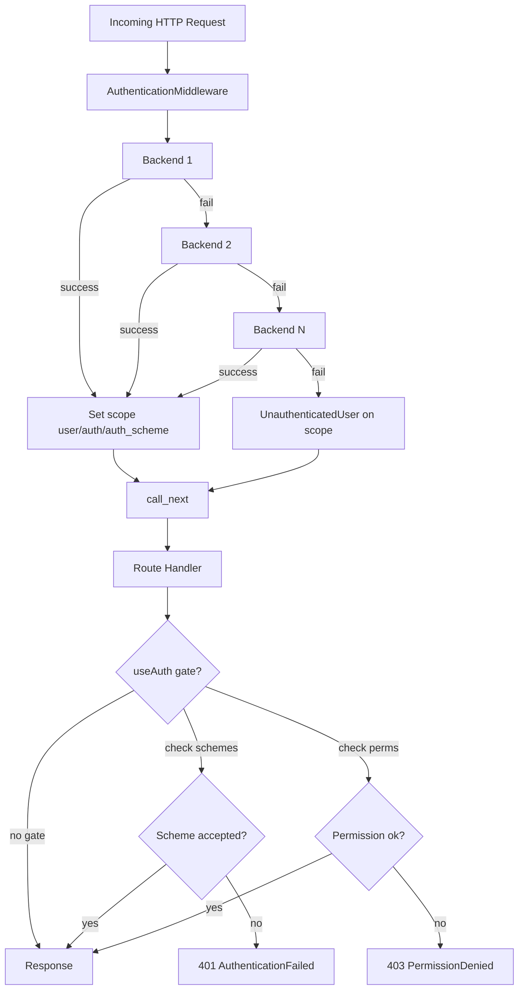
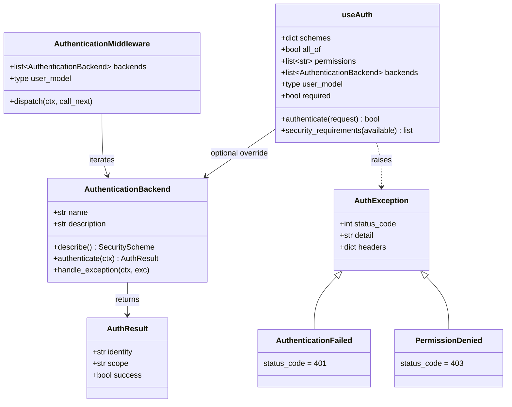
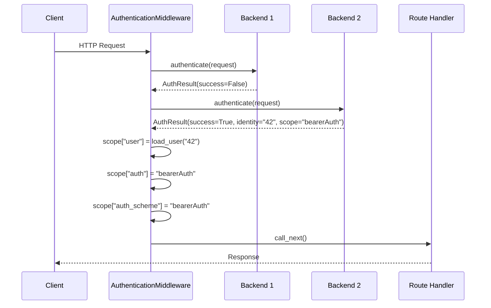
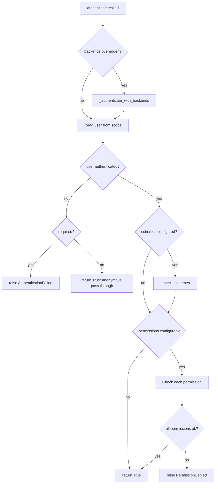
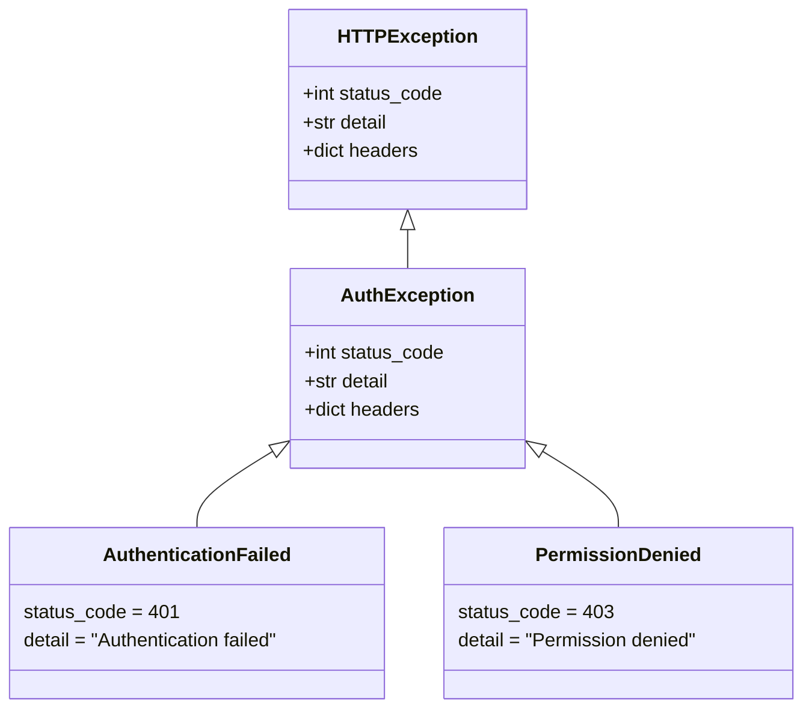
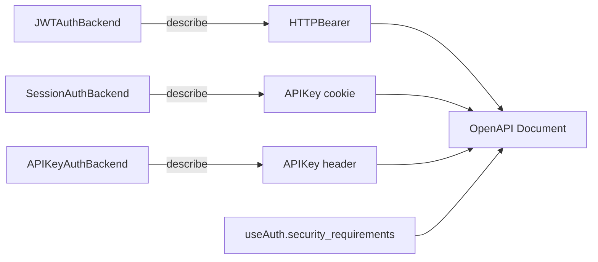

**Version:** 2026-08-11
**Audience:** Core maintainers, framework architects, security engineers
**Purpose:** Document the authentication gate, backend contract, middleware pipeline, and OpenAPI security scheme emission

---

## Overview

Sillo's authentication system is split into three layers that compose cleanly:

1. **Backends.** Read a credential from the request and return an `AuthResult`.
2. **Middleware**: iterates backends on every request, sets
   `request.scope["user"]`.
3. **Route gate (`useAuth`)**: per-route enforcement of scheme restrictions,
   permissions, and optional authentication.

The design principle: **the middleware never rejects a request**. It always calls `call_next()`. Rejection is the route gate's job. This lets some routes be public while others require authentication, without the middleware needing to know which is which.



---

## Architectural Diagram



---

## AuthResult: The Backend Return Type

**File:** `core/sillo/auth/model.py`

`AuthResult` is a plain dataclass returned by every `AuthenticationBackend.authenticate` implementation. It carries three fields:

| Field | Type | Meaning |
|-------|------|---------|
| `identity` | `str` | The resolved user identifier (e.g. user ID, email, API key token). Empty string on failure. |
| `scope` | `str` | A label identifying the authentication method (e.g. `"jwt"`, `"session"`, `"apikey"`). Empty string on failure. |
| `success` | `bool` | `True` means the backend resolved a valid identity; `False` means the next backend should be tried. |

```python
@dataclass
class AuthResult:
    identity: str
    scope: str
    success: bool
```

**Design note:** `scope` is a method label, not an OpenAPI scheme name. The shipped backends now report their `name` attribute (e.g. `"bearerAuth"`) as the scope, but custom backends may report any string. The `LEGACY_SCOPE_ALIASES` mapping exists because older code used labels like `"jwt"` instead of scheme names.

---

## AuthenticationBackend: The Backend Contract

**File:** `core/sillo/auth/backend.py`

### Class Overview

`AuthenticationBackend` is the abstract base class for all authentication backends. Subclasses must implement `authenticate()`. The class provides:

| Member | Type | Purpose |
|--------|------|---------|
| `name` | `str` | The OpenAPI security scheme name. Default `"auth"`. |
| `description` | `str \| None` | Prose shown next to the credential in API docs. |
| `describe()` | `→ SecurityScheme \| None` | Returns the OpenAPI scheme object, or `None` to skip documentation. |
| `authenticate(request)` | `→ AuthResult` | Extract credentials from the request and return an `AuthResult`. |
| `handle_exception(response, exc)` | `→ None` | Called when `authenticate` raises. Default logs at WARNING level. |

### `name` vs `scope`

This is a critical distinction:

- **`name`** (class attribute): the OpenAPI security scheme name. A route gate
  matches on this. It is set once on the backend class and never changes per
  request. Example: `"bearerAuth"`, `"sessionCookie"`, `"apiKeyHeader"`.

- **`scope`** (in `AuthResult`): the authentication method label returned per
  request. For shipped backends, this equals `self.name`. For custom backends,
  it can be any string.

The middleware sets both `request.scope["auth_scheme"]` (= `backend.name`) and `request.scope["auth"]` (= `auth_result.scope`). The gate checks both.

### `describe()`

Returns an OpenAPI `SecurityScheme` object (or subclass like `HTTPBearer`, `APIKey`) that documents how the backend's credential appears in the API. Returning `None` keeps the backend working but excludes it from the documentation.

Each shipped backend overrides `describe()`:

| Backend | Returns |
|---------|---------|
| `JWTAuthBackend` | `HTTPBearer(type="http", scheme="bearer", bearerFormat="JWT")` |
| `SessionAuthBackend` | `APIKey(type="apiKey", name=cookie_name, **{"in": "cookie"})` |
| `APIKeyAuthBackend` | `APIKey(type="apiKey", name=header_name, **{"in": "header"})` |

### `handle_exception()`

Called by the middleware when `authenticate()` raises. The default implementation logs the error at WARNING level and returns, allowing the middleware to continue to the next backend. Override to short-circuit with a 401, emit metrics, or notify an operations channel.

---

## AuthenticationMiddleware: The ASGI Pipeline

**File:** `core/sillo/auth/middleware.py`

### Constructor

```python
class AuthenticationMiddleware(BaseMiddleware):
    def __init__(
        self,
        user_model: type[BaseUser] = SimpleUser,
        backend: AuthenticationBackend | list[AuthenticationBackend] = None,
    )
```

| Parameter | Default | Purpose |
|-----------|---------|---------|
| `user_model` | `SimpleUser` | The user model class used to load user objects from identity strings. Must implement `BaseUser.load_user(identity)`. |
| `backend` | `None` | A single backend or list of backends. Normalized to a list internally. |

### Request Processing Flow



### Key Behaviors

1. **Iterates backends in order.** Processing stops at the first successful `AuthResult`.
2. **Sets three scope keys on success:** `"user"`, `"auth"`, `"auth_scheme"`.
3. **Falls back to `UnauthenticatedUser`** when no backend succeeds. The scope keys `"auth"` and `"auth_scheme"` are set to `None`.
4. **Always calls `call_next()`**: the middleware never rejects a request.
   Rejection is the route gate's responsibility.
5. **Catches backend exceptions** and passes them to `handle_exception()`. The middleware continues to the next backend.

### The `for...else` Pattern

The middleware uses Python's `for...else` construct: the `else` block runs only when the loop completes without `break`. This means the `UnauthenticatedUser` fallback is set exactly when no backend succeeds:

```python
for backend in self.backends:
    try:
        auth_result = await backend.authenticate(ctx)
        if auth_result.success:
            ctx.scope["user"] = await self.user_model.load_user(auth_result.identity)
            ctx.scope["auth"] = auth_result.scope
            ctx.scope["auth_scheme"] = backend.name
            break
    except Exception as e:
        backend.handle_exception(response, e)
        continue
else:
    ctx.scope["user"] = UnauthenticatedUser()
    ctx.scope["auth"] = None
    ctx.scope["auth_scheme"] = None

return await call_next()
```

---

## useAuth: The Route-Level Gate

**File:** `core/sillo/auth/use_auth.py`

### Constructor

```python
class useAuth:
    def __init__(
        self,
        permissions: list[str] | None = None,
        backends: list[AuthenticationBackend] | None = None,
        user_model: type[BaseUser] | None = None,
        required: bool = True,
        schemes: list[str] | dict[str, list[str]] | None = None,
        all_of: bool = False,
    )
```

| Parameter | Default | Purpose |
|-----------|---------|---------|
| `schemes` | `None` | OpenAPI security scheme names accepted for this route. List or mapping with OAuth2 scopes. |
| `all_of` | `False` | Require every scheme together (AND) vs any one (OR). |
| `permissions` | `None` | Permission strings checked via `user.has_permission()`. |
| `backends` | `None` | Override the middleware's backends for this route. |
| `user_model` | `None` | User model for loading identities when backends are overridden. Defaults to `SimpleUser`. |
| `required` | `True` | When `False`, unauthenticated requests pass through with `UnauthenticatedUser`. |

### Scheme Normalization

The `schemes` parameter accepts two forms and normalizes to `{name: oauth_scopes}`:

```python
# List form — no OAuth2 scopes
useAuth(schemes=["bearerAuth", "sessionCookie"])
# → {"bearerAuth": [], "sessionCookie": []}

# Mapping form — with OAuth2 scopes
useAuth(schemes={"oauth2": ["read:widgets"]})
# → {"oauth2": ["read:widgets"]}
```

### Authenticate Flow



The order of checks is: **backends → authentication → schemes → permissions**.

### `_check_schemes`

Verifies that the request authenticated through an accepted scheme. Uses the `accepted_identifiers` and `request_identifiers` helper functions to handle legacy scope aliases:

```python
from sillo import HttpContext

def _check_schemes(self, ctx: HttpContext) -> None:
    accepted = accepted_identifiers([*self.schemes])
    if request_identifiers(ctx).isdisjoint(accepted):
        raise AuthenticationFailed
```

Both `request.scope["auth_scheme"]` and `request.scope["auth"]` are consulted. For shipped backends these are always equal; they differ only for custom backends that report a scope but never set a name.

### `_authenticate_with_backends`

When the gate has its own `backends` list, it iterates them in order (same pattern as the middleware) and overrides `request.scope["user"]`, `["auth"]`, and `["auth_scheme"]` on success. Backend exceptions are silently caught so the next backend gets a chance. If all fail and `required` is `True`, raises `AuthenticationFailed`.

### `security_requirements`

Generates the OpenAPI `security` field for the route:

| Gate Configuration | OpenAPI Output |
|--------------------|----------------|
| `schemes=[a, b]` | `[{a: []}, {b: []}]` (either) |
| `schemes=[a, b], all_of=True` | `[{a: [], b: []}]` (both) |
| `required=False` | Extra `{}` alternative appended |
| No schemes, `available` given | Every available scheme (either) |
| No schemes, nothing available | `None` |

---

## Exception Hierarchy

**File:** `core/sillo/auth/exceptions.py`



### AuthException

Base class for all auth-related exceptions. Inherits from `HTTPException` so instances can be directly converted to HTTP responses. The `headers` parameter defaults to an empty dict.

### AuthenticationFailed (401)

Raised when authentication fails: no valid credentials, scheme mismatch, or all
backends failed. Default detail: `"Authentication failed"`.

### PermissionDenied (403)

Raised when an authenticated user lacks a required permission. Default detail: `"Permission denied"`.

### AuthErrorHandler

An async error handler registered with the framework to convert `AuthException` instances into JSON responses:

```python
from sillo import HttpContext, json

async def AuthErrorHandler(ctx: HttpContext, exc: HTTPException):
    return json(exc.detail, status_code=exc.status_code, headers=exc.headers)
```

---

## OpenAPI Security Scheme Emission

Each backend's `describe()` method returns an OpenAPI `SecurityScheme` (or `None`). The framework collects these during route iteration and emits them under `components.securitySchemes` in the generated OpenAPI document.



The route gate's `security_requirements()` method generates the per-route
`security` field. This ensures the gate and the document cannot disagree. A
route gated on `schemes=["bearerAuth"]` will always document `bearerAuth` as
its security requirement.

### Scheme-to-Documentation Mapping

| Backend | `name` | `describe()` Output |
|---------|--------|---------------------|
| `JWTAuthBackend` | `"bearerAuth"` | `HTTPBearer(type="http", scheme="bearer", bearerFormat="JWT")` |
| `SessionAuthBackend` | `"sessionCookie"` | `APIKey(type="apiKey", name="session_id", **{"in": "cookie"})` |
| `APIKeyAuthBackend` | `"apiKeyHeader"` | `APIKey(type="apiKey", name="X-API-Key", **{"in": "header"})` |

---

## Scope Aliases and Legacy Compatibility

**File:** `core/sillo/auth/use_auth.py` (lines 58 to 87)

### LEGACY_SCOPE_ALIASES

```python
LEGACY_SCOPE_ALIASES = {
    "jwt": "bearerAuth",
    "session": "sessionCookie",
    "apikey": "apiKeyHeader",
}
```

The shipped backends used to report `AuthResult.scope` as `"jwt"`, `"session"`, or `"apikey"`. They now report their scheme name instead (`"bearerAuth"`, etc.). The aliases exist so that:

1. A gate written as `useAuth(schemes=["jwt"])` still works against a backend that now reports `"bearerAuth"`.
2. A custom backend that returns `AuthResult(scope="jwt")` still satisfies a gate saying `"bearerAuth"`.

### `accepted_identifiers(names)`

Returns the set of identifiers a gate written against `names` should accept. Both the value as written and its modern spelling:

```python
accepted_identifiers(["jwt"])
# → {"jwt", "bearerAuth"}
```

### `request_identifiers(request)`

Returns the identifiers the request authenticated under. Both `auth_scheme` and
`auth` from the request scope:

```python
from sillo import HttpContext

def request_identifiers(ctx: HttpContext):
    return {ctx.scope.get("auth_scheme"), ctx.scope.get("auth")}
```

---

## Request Scope Keys

The authentication system sets three keys in `request.scope`:

| Key | Set By | Type | Meaning |
|-----|--------|------|---------|
| `"user"` | Middleware or gate | `UserProtocol` instance | The authenticated user, or `UnauthenticatedUser()` |
| `"auth"` | Middleware or gate | `str \| None` | The `AuthResult.scope` value (method label) |
| `"auth_scheme"` | Middleware or gate | `str \| None` | The `backend.name` value (scheme name) |

These are set by the middleware on every request. If the gate has custom backends, it overwrites them on success.

---

## Edge Cases and Design Decisions

### Why the middleware never rejects

The middleware always calls `call_next()`, even when no backend succeeds. This is intentional: the middleware does not know which routes require authentication. The `useAuth` gate makes that decision. This allows public routes to coexist with authenticated routes in the same application.

### Why `UnauthenticatedUser` instead of `None`

Setting `request.scope["user"]` to `None` would require every handler to check for `None` before accessing `user.is_authenticated`. `UnauthenticatedUser` satisfies the `UserProtocol` interface with `is_authenticated = False`, so handlers can always call `request.user.is_authenticated` without null checks.

### Why backends catch exceptions silently

If backend A raises an unexpected exception (database down, network timeout), the middleware should try backend B rather than failing the entire request. The `handle_exception` hook lets backends log or metric the failure without blocking the chain.

### Why `useAuth` supports `required=False`

Some routes are better with authentication but work without it (e.g. a feed that shows personalized content for logged-in users but public content otherwise). `required=False` lets the gate pass through anonymous users while still running scheme and permission checks for authenticated ones.

### The `for...else` construct

The middleware's `for...else` is Python's less-known control flow: the `else` runs when the loop finishes without `break`. This is exactly the "no backend succeeded" case, and it avoids needing a separate `found = False` flag.

---

## Source Map

| Component | File | Lines |
|-----------|------|-------|
| `AuthResult` | `core/sillo/auth/model.py` | 1-35 |
| `AuthenticationBackend` | `core/sillo/auth/backend.py` | 1-144 |
| `AuthenticationMiddleware` | `core/sillo/auth/middleware.py` | 1-168 |
| `useAuth` | `core/sillo/auth/use_auth.py` | 1-390 |
| `LEGACY_SCOPE_ALIASES` | `core/sillo/auth/use_auth.py` | 62-66 |
| `accepted_identifiers` | `core/sillo/auth/use_auth.py` | 69-87 |
| `request_identifiers` | `core/sillo/auth/use_auth.py` | 90-97 |
| `AuthException` | `core/sillo/auth/exceptions.py` | 16-68 |
| `AuthenticationFailed` | `core/sillo/auth/exceptions.py` | 71-114 |
| `PermissionDenied` | `core/sillo/auth/exceptions.py` | 117-161 |
| `AuthErrorHandler` | `core/sillo/auth/exceptions.py` | 164-197 |
| Package exports | `core/sillo/auth/__init__.py` | 1-69 |

---

## Implementation Deep Dive

### AuthenticationBackend: Full Source Walkthrough

The `AuthenticationBackend` class at `core/sillo/auth/backend.py` is intentionally minimal. Here is every line of the class with annotations:

```python
from sillo import HttpContext

class AuthenticationBackend:
    # Class-level attribute — the OpenAPI security scheme name.
    # Subclasses override this to declare their scheme identity.
    # The default "auth" is a placeholder; every shipped backend
    # sets its own value.
    name: str = "auth"

    # Optional prose for the OpenAPI document. Set per-instance
    # in __init__ so two backends of the same class can have
    # different descriptions (e.g. "User tokens" vs "Admin tokens").
    description: str | None = None

    def describe(self) -> SecurityScheme | None:
        # Returns None by default — a backend with nothing to
        # document (health-check bypass, custom credential that
        # OpenAPI cannot express) stays working and is simply
        # omitted from the document.
        return None

    async def authenticate(self, ctx: HttpContext) -> AuthResult:
        # Abstract — subclasses must override. The NotImplementedError
        # message includes the class name for debugging.
        raise NotImplementedError(
            f"{type(self).__name__} must implement authenticate()"
        )

    def handle_exception(self, response: BaseResponse, exc: Exception) -> None:
        # Default: log at WARNING and return. The middleware
        # continues to the next backend. Override to short-circuit,
        # emit metrics, or notify ops.
        logger.warning("Auth backend %s failed: %s", type(self).__name__, exc)
```

### Custom Backend Example

A complete custom backend that authenticates via a signed timestamp header:

```python
import hmac
import time
from sillo.auth.backend import AuthenticationBackend
from sillo.auth.model import AuthResult
from sillo import HttpContext

class SignedTimestampBackend(AuthenticationBackend):
    name = "signedTimestamp"

    def __init__(self, secret: str, max_age: int = 300):
        self.secret = secret
        self.max_age = max_age

    async def authenticate(self, ctx: HttpContext) -> AuthResult:
        header = ctx.headers.get("X-Signature")
        if not header:
            return AuthResult(success=False, identity="", scope="")

        try:
            timestamp_str, signature = header.split(":", 1)
            timestamp = int(timestamp_str)
        except (ValueError, AttributeError):
            return AuthResult(success=False, identity="", scope="")

        # Reject stale signatures
        if abs(time.time() - timestamp) > self.max_age:
            return AuthResult(success=False, identity="", scope="")

        expected = hmac.new(
            self.secret.encode(),
            timestamp_str.encode(),
            "sha256"
        ).hexdigest()

        if not hmac.compare_digest(signature, expected):
            return AuthResult(success=False, identity="", scope="")

        return AuthResult(success=True, identity=str(timestamp), scope=self.name)
```

### AuthenticationMiddleware: Complete Internal Flow

Here is the full `dispatch` method with every branch annotated:

```python
from sillo import HttpContext

async def dispatch(self, ctx: HttpContext, call_next):
    # Branch 1: Try each backend in order
    for backend in self.backends:
        try:
            auth_result = await backend.authenticate(ctx)

            if auth_result.success:
                # SUCCESS PATH:
                # 1. Load user object from identity string
                # 2. Set all three scope keys
                # 3. Break out of the loop
                ctx.scope["user"] = await self.user_model.load_user(
                    auth_result.identity
                )
                ctx.scope["auth"] = auth_result.scope
                ctx.scope["auth_scheme"] = backend.name
                break

        except Exception as e:
            # FAILURE PATH (exception):
            # 1. Let the backend log/metric the failure
            # 2. Continue to the next backend
            backend.handle_exception(ctx, e)
            continue

    else:
        # FAILURE PATH (no backend succeeded):
        # The for...else block runs only when the loop
        # completes without break — i.e., no backend succeeded.
        ctx.scope["user"] = UnauthenticatedUser()
        ctx.scope["auth"] = None
        ctx.scope["auth_scheme"] = None

    # ALWAYS: call the next middleware/handler
    return await call_next()
```

### useAuth: Complete Internal Flow

#### The `authenticate` method in detail:

```python
from sillo import HttpContext

async def authenticate(self, ctx: HttpContext) -> bool:
    # Step 1: If the gate has custom backends, run them first.
    # This overrides whatever the middleware set on the scope.
    if self.backends is not None:
        await self._authenticate_with_backends(ctx)

    # Step 2: Check if the user is authenticated.
    # Reads from ctx.scope["user"] — either set by the
    # middleware or by the custom backends above.
    user = ctx.scope.get("user")
    if not user or not user.is_authenticated:
        if self.required:
            raise AuthenticationFailed
        # required=False: anonymous pass-through
        return True

    # Step 3: Check scheme restrictions.
    # Only runs if the gate declared specific schemes.
    if self.schemes:
        self._check_schemes(ctx)

    # Step 4: Check permissions.
    # Runs for every permission in the list.
    if self.permissions:
        for perm in self.permissions:
            if not user.has_permission(perm):
                raise PermissionDenied

    return True
```

#### The `_authenticate_with_backends` method in detail:

```python
from sillo import HttpContext

async def _authenticate_with_backends(self, ctx: HttpContext) -> None:
    user_model = self._resolve_user_model()

    for backend in self.backends:
        try:
            result = await backend.authenticate(ctx)
            if result.success:
                # Override the scope with the gate's backend result
                ctx.scope["user"] = await user_model.load_user(result.identity)
                ctx.scope["auth"] = result.scope
                ctx.scope["auth_scheme"] = backend.name
                return
        except Exception:
            # Silently catch — try the next backend
            continue

    # All backends failed
    if self.required:
        raise AuthenticationFailed
```

### Middleware Registration Patterns

#### Basic JWT authentication:

```python
from sillo.auth import AuthenticationMiddleware, JWTAuthBackend
from sillo.users import User

app.use(AuthenticationMiddleware(
    user_model=User,
    backend=JWTAuthBackend(secret_key="my-secret-key"),
))
```

#### Multiple backends (JWT + session):

```python
from sillo.auth import AuthenticationMiddleware, JWTAuthBackend, SessionAuthBackend

app.use(AuthenticationMiddleware(
    user_model=User,
    backend=[
        JWTAuthBackend(secret_key="my-secret-key"),
        SessionAuthBackend(),
    ],
))
```

#### With API key for service-to-service:

```python
from sillo.auth import AuthenticationMiddleware, JWTAuthBackend, APIKeyAuthBackend

app.use(AuthenticationMiddleware(
    user_model=User,
    backend=[
        JWTAuthBackend(secret_key="my-secret-key"),
        APIKeyAuthBackend(header_name="X-API-Key", verify_with_manager=True),
    ],
))
```

### Route-Level Gate Patterns

#### Public route (no auth):

```python
from sillo import HttpContext, json

@app.get("/health")
async def health(ctx: HttpContext):
    return json({"status": "ok"})
```

#### Authenticated route (any scheme):

```python
from sillo import HttpContext, json

@app.get("/profile", auth=useAuth())
async def profile(ctx: HttpContext):
    return json({"user": ctx.user.display_name})
```

#### JWT-only route:

```python
from sillo import HttpContext, json

@app.get("/api/data", auth=useAuth(schemes=["bearerAuth"]))
async def api_data(ctx: HttpContext):
    return json({"data": "..."})
```

#### Permission-gated route:

```python
from sillo import HttpContext, json

@app.post("/admin/users", auth=useAuth(permissions=["manage_users"]))
async def manage_users(ctx: HttpContext):
    return json({"status": "ok"})
```

#### Optional authentication:

```python
from sillo import HttpContext, json

@app.get("/feed", auth=useAuth(required=False))
async def feed(ctx: HttpContext):
    if ctx.user.is_authenticated:
        return json({"feed": "personalized"})
    return json({"feed": "public"})
```

#### Custom backend override:

```python
from sillo import HttpContext, json

@app.post("/webhook", auth=useAuth(backends=[SignedTimestampBackend(secret="...")]))
async def webhook(ctx: HttpContext):
    return json({"received": True})
```

#### Multiple schemes (any of):

```python
from sillo import HttpContext, json

@app.get("/resource", auth=useAuth(schemes=["bearerAuth", "sessionCookie"]))
async def resource(ctx: HttpContext):
    return json({"data": "..."})
```

#### Multiple schemes (all of):

```python
from sillo import HttpContext, json

@app.delete("/critical", auth=useAuth(schemes=["bearerAuth", "apiKeyHeader"], all_of=True))
async def critical(ctx: HttpContext):
    return json({"deleted": True})
```

### Subclassing useAuth

The gate is designed to be subclassed for custom authorization logic:

```python
from sillo import HttpContext

class OrgAuth(useAuth):
    def __init__(self, org_id_param: str, **kwargs):
        super().__init__(**kwargs)
        self.org_id_param = org_id_param

    async def authenticate(self, ctx: HttpContext) -> bool:
        # Run the base authentication first
        if not await super().authenticate(ctx):
            return False

        # Add custom authorization check
        org_id = ctx.path_params.get(self.org_id_param)
        if not org_id:
            raise AuthenticationFailed("Missing organization ID")

        if not ctx.user.belongs_to_org(org_id):
            raise PermissionDenied("Not a member of this organization")

        return True
```

Usage:

```python
from sillo import HttpContext

@app.get("/orgs/{org_id}/members", auth=OrgAuth(org_id_param="org_id"))
async def org_members(ctx: HttpContext):
    ...
```

### Error Handler Registration

Register the auth error handler during application setup:

```python
from sillo.auth.exceptions import AuthException, AuthErrorHandler

app.add_error_handler(AuthException, AuthErrorHandler)
```

This ensures that `AuthenticationFailed` and `PermissionDenied` exceptions produce JSON responses:

```json
// 401
{"detail": "Authentication failed"}

// 403
{"detail": "Permission denied"}
```

### Package Lazy Loading

**File:** `core/sillo/auth/__init__.py`

The auth package uses `deferred()` to avoid importing Tortoise ORM or PyJWT at module load time:

```python
from sillo._internals.lazy import deferred

__getattr__ = deferred(
    __name__,
    {
        "apikey": ".apikey",
        "jwt_auth": ".jwt_auth",
        "session_auth": ".session_auth",
        "APIKeyAuthBackend": ".apikey",
        "JWTAuthBackend": ".jwt_auth",
        "SessionAuthBackend": ".session_auth",
        "create_jwt": ".jwt_auth",
        "decode_jwt": ".jwt_auth",
    },
)
```

This means `import sillo.auth` does NOT require:
- `tortoise-orm` (needed by session/JWT/API key models)
- `PyJWT` (needed by JWT backend)

These are loaded on first access. The import paths and `__all__` are unchanged.

### Thread Safety and Concurrency

The authentication system is fully async and safe for concurrent requests:

- `AuthenticationBackend.authenticate()` is async: it can await database
  queries, HTTP calls, etc.
- `AuthenticationMiddleware` creates no shared mutable state: each request gets
  its own scope
- `useAuth` instances are created once at route registration time and reused:
  they are read-only after construction
- The `for...else` pattern in the middleware is safe because each request runs in its own coroutine

### Testing the Authentication System

#### Testing a custom backend:

```python
import pytest
from sillo.auth.model import AuthResult

@pytest.mark.asyncio
async def test_custom_backend():
    backend = MyCustomBackend(secret="test")

    # Mock ctx with valid credential
    ctx = MockRequest(headers={"X-Token": "valid-token"})
    result = await backend.authenticate(ctx)

    assert result.success is True
    assert result.identity == "expected-user-id"
    assert result.scope == "myCustom"
```

#### Testing useAuth:

```python
@pytest.mark.asyncio
async def test_useAuth_required():
    gate = useAuth(required=True)
    ctx = MockRequest(scope={"user": UnauthenticatedUser()})

    with pytest.raises(AuthenticationFailed):
        await gate.authenticate(ctx)

@pytest.mark.asyncio
async def test_useAuth_optional():
    gate = useAuth(required=False)
    ctx = MockRequest(scope={"user": UnauthenticatedUser()})

    result = await gate.authenticate(ctx)
    assert result is True
```

### Performance Considerations

1. **Backend ordering matters.** Place the most likely-to-succeed backend first. JWT before session before API key is typical for web apps.

2. **`load_user` is called once per request** (on success). If it involves a database query, consider caching the result in the request scope.

3. **`handle_exception` should be fast.** It runs in the hot path for every failed backend. Avoid expensive operations (network calls, heavy logging).

4. **`security_requirements` is called during OpenAPI generation**, not per request. It can be slower without impacting runtime performance.

5. **The `for...else` pattern** has zero overhead compared to a `found` flag:
   Python optimizes the loop exit path.
