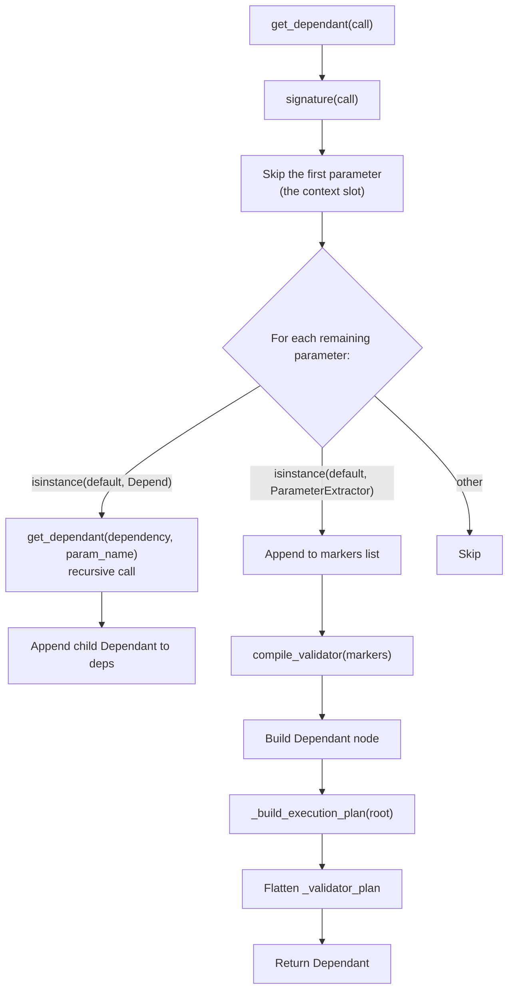
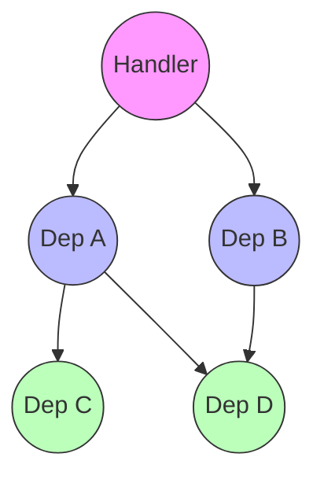
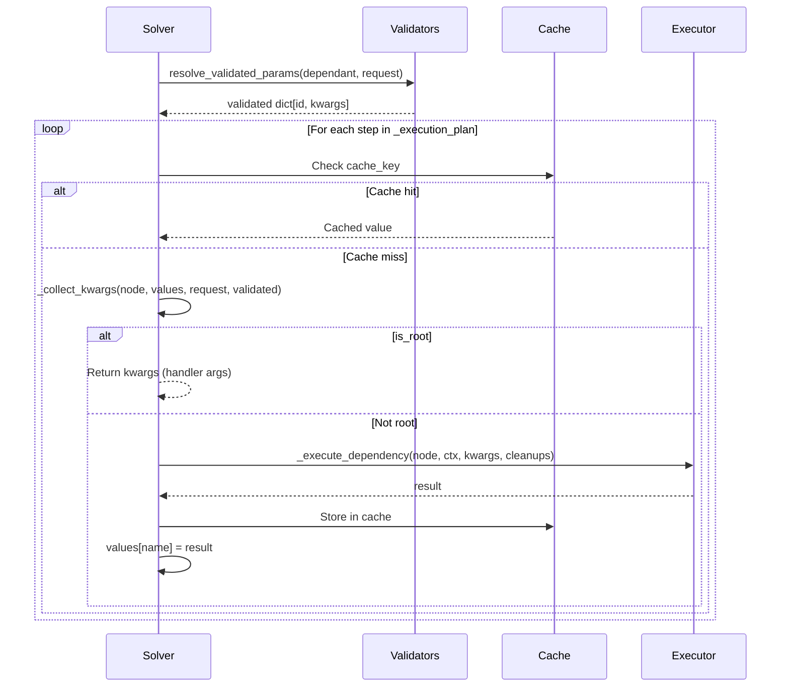
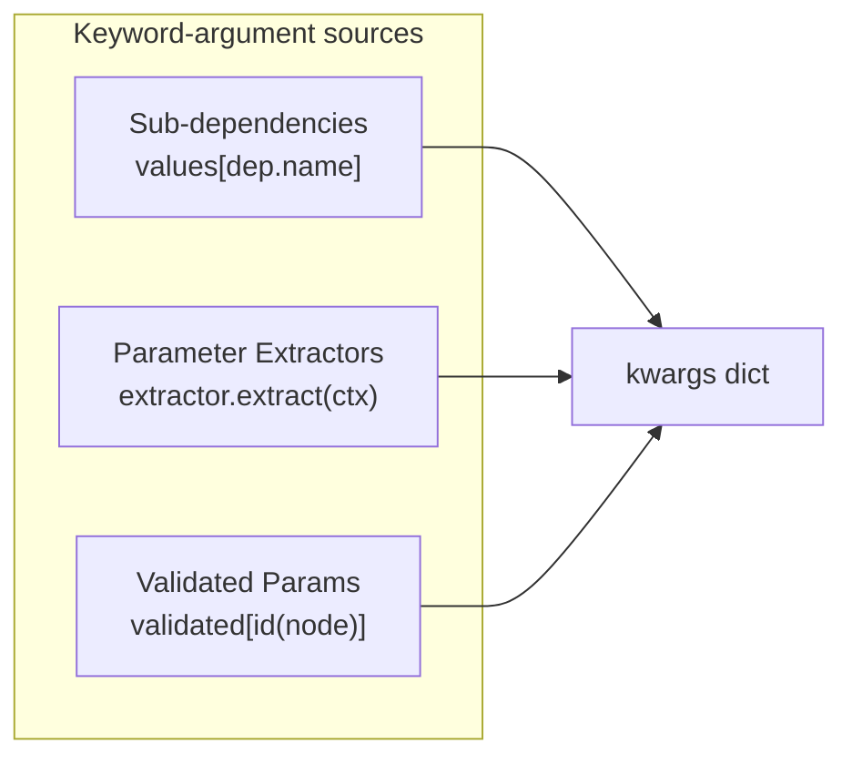
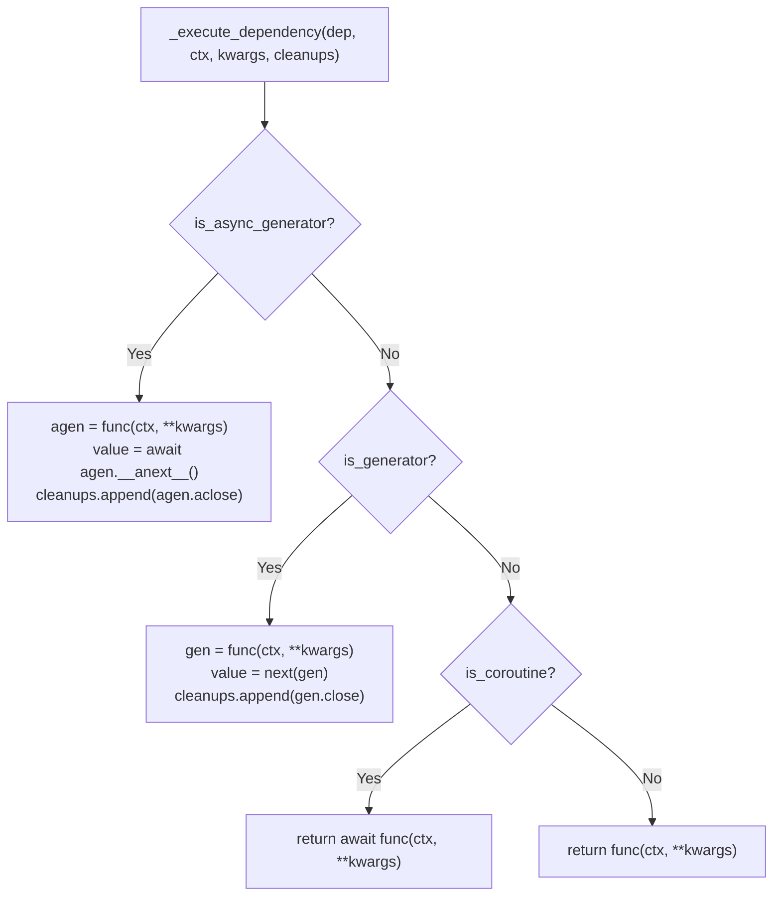
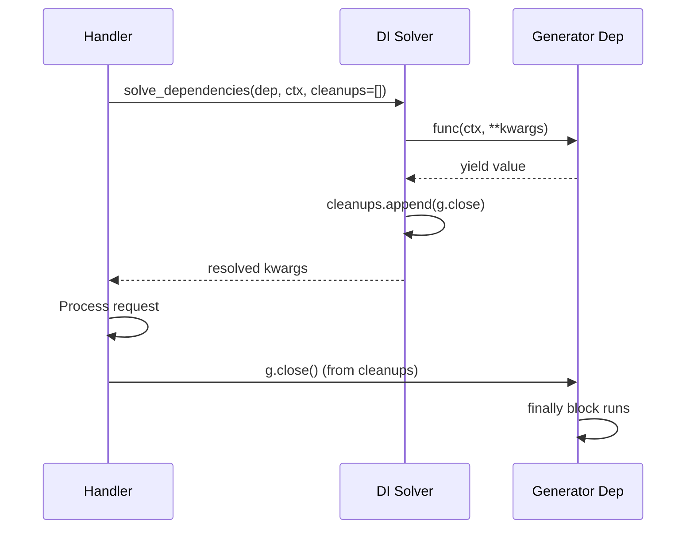
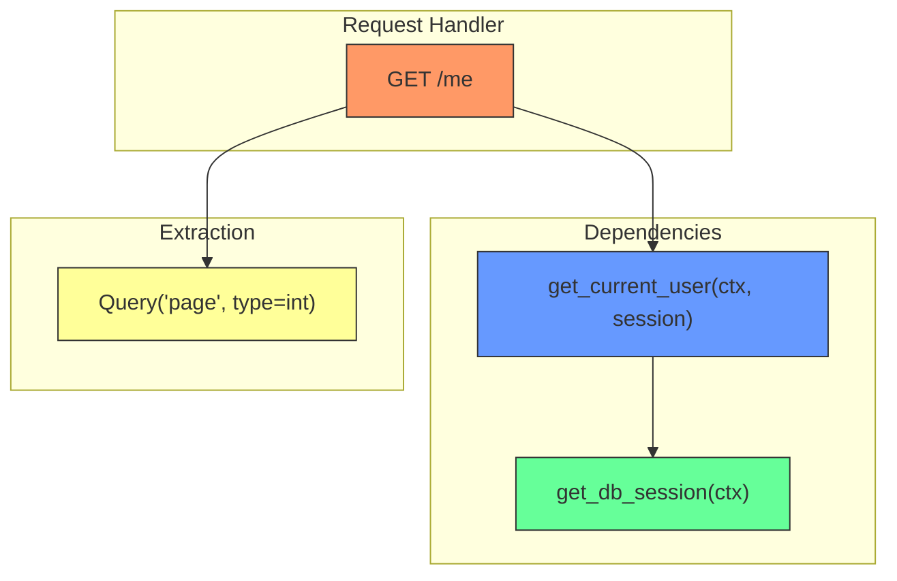

> **Source files:**
> - `core/sillo/core/dependencies/base.py`: `Depend`, `ExecutionStep`, `Dependant`, `get_dependant`, `_build_execution_plan`, `solve_dependencies`, `_execute_dependency`, `_collect_kwargs`, `resolve_validated_params`
> - `core/sillo/core/dependencies/__init__.py`, public re-exports
> - `core/sillo/validation/compiler.py`, `CompiledValidator`, `compile_validator`
> - `core/sillo/validation/fields.py`, `ParameterExtractor`, `SolvedParamDependency`

---

## 11.1  Architecture Overview

Sillo's dependency injection (DI) system resolves a directed acyclic graph of callable
dependencies at request time with **zero recursion** on the hot path. The key
innovation is that the tree is walked *once* during route registration (the
**analysis phase**), flattened into a post-order list of `ExecutionStep` objects,
and then iterated linearly at request time (the **resolution phase**).

```mermaid
flowchart LR
    subgraph Registration["Registration (once)"]
        A["get_dependant(call)"] --> B["Inspect signature"]
        B --> C["Build Dependant tree"]
        C --> D["_build_execution_plan<br/>DFS post-order"]
        D --> E["Flatten to list[ExecutionStep]"]
    end

    subgraph Request["Request (every call)"]
        F["solve_dependencies(dependant)"] --> G["Iterate _execution_plan"]
        G --> H["_collect_kwargs"]
        H --> I["_execute_dependency"]
        I --> J["Return root kwargs"]
    end

    E -->|"stored on Dependant"| F
```



The entire flow lives in `core/sillo/core/dependencies/base.py` (580 lines).

---

## 11.2  The `Depend` Class

`Depend` is the user-facing marker placed as a handler parameter default. It
tells the framework "resolve this value through the DI system instead of
extracting it from the request."

```python
# core/sillo/core/dependencies/base.py:25-85
class Depend:
    def __init__(self, dependency: Callable[..., Any] | None = None) -> None:
        self.dependency = dependency
```

A dependency callable is invoked like a route handler: its **first positional
parameter receives the context** (`HttpContext` on an HTTP route,
`WebSocketContext` on a WebSocket route). There is no marker for the context.

### 11.2.1  Fields

| Field          | Type                      | Purpose                                                    |
|----------------|---------------------------|------------------------------------------------------------|
| `dependency`   | `Callable \| None`        | The callable whose return value is injected. `None` is a bare router-level placeholder the solver skips. |

### 11.2.2  Generic Subscript Support

```python
# base.py:83-100
def __class_getitem__(cls, item: Any):
    return cls  # no-op; satisfies type checkers
```

This allows `Depend[SomeType]` in type annotations without runtime effect.

### 11.2.3  Usage Patterns

```python
# Pattern 1: Inject a dependency callable (first param is the context)
from sillo import HttpContext

async def get_db(ctx: HttpContext):
    return await Database.connect()

@app.get("/items")
async def list_items(ctx: HttpContext, db=Depend(get_db)):
    ...

# Pattern 2: A dependency that ignores the context still declares it
def get_settings(_):
    return load_settings()

# Pattern 3: Nested dependencies
async def get_user(ctx: HttpContext, db=Depend(get_db)):
    return await db.get_user()

@app.get("/profile")
async def profile(ctx: HttpContext, user=Depend(get_user)):
    ...
```

---

## 11.3  The `ExecutionStep` Dataclass

```python
# base.py:103-123
@dataclass(slots=True)
class ExecutionStep:
    dependant: Dependant
    is_root: bool = False
```

Each step in the flattened execution plan wraps one `Dependant` node. The
`is_root` flag marks the final step. When the solver reaches it, it returns the
collected kwargs instead of executing the callable.

---

## 11.4  The `Dependant` Dataclass

`Dependant` is the central node in the dependency graph. Every callable that
participates in DI (the handler itself, each sub-dependency, and each
sub-dependency's sub-dependencies) becomes a `Dependant`.

```python
# base.py:126-185
@dataclass(slots=True)
class Dependant:
    call: Callable[..., Any] | None = None
    name: str | None = None
    dependencies: list[Dependant] = field(default_factory=list)
    param_extractors: list[SolvedParamDependency] = field(default_factory=list)
    validator: CompiledValidator | None = None
    is_coroutine: bool = False
    is_generator: bool = False
    is_async_generator: bool = False
    cache_key: tuple[Callable[..., Any], tuple[str, ...]] | None = None
    use_cache: bool = True
    _execution_plan: list[ExecutionStep] = field(default_factory=list)
    _validator_plan: tuple[tuple[int, CompiledValidator], ...] = ()
    _needs_form: bool = False
```

### 11.4.1  Field Reference

| Field                | Type                                         | Description |
|----------------------|----------------------------------------------|-------------|
| `call`               | `Callable \| None`                           | The wrapped callable. `None` for the root node that only collects kwargs. |
| `name`               | `str \| None`                                | Parameter name under which this dependency's result is stored. `None` for root. |
| `dependencies`       | `list[Dependant]`                            | Child `Dependant` nodes: direct sub-dependencies declared via `Depend()`. |
| `param_extractors`   | `list[SolvedParamDependency]`                | Legacy-mode parameter markers (Query, Header, Cookie) that extract from the request. |
| `validator`          | `CompiledValidator \| None`                  | Pydantic models compiled for this callable's validated parameters. `None` when none declared. |
| `is_coroutine`       | `bool`                                       | `True` if `call` is `async def`. |
| `is_generator`       | `bool`                                       | `True` if `call` is a sync generator (`def` + `yield`). |
| `is_async_generator` | `bool`                                       | `True` if `call` is an async generator (`async def` + `yield`). |
| `cache_key`          | `tuple[Callable, tuple[str, ...]] \| None`   | Cache key for deduplication. `None` disables caching. |
| `use_cache`          | `bool`                                       | Whether to consult the cache before executing. Default `True`. |
| `_execution_plan`    | `list[ExecutionStep]`                        | Pre-computed DFS post-order flat list. Built once at registration. |
| `_validator_plan`    | `tuple[tuple[int, CompiledValidator], ...]`  | `(node_id, validator)` pairs for every node with validated params. Empty = skip validation. |
| `_needs_form`        | `bool`                                       | `True` if any node declares Form/File parameters. Controls form parsing. |

### 11.4.2  Introspection Flags

The three boolean flags (`is_coroutine`, `is_generator`, `is_async_generator`)
are set once at registration by `inspect.is*function()` calls and drive the
dispatch in `_execute_dependency`. They are mutually exclusive in practice (a
callable is one of the four types) but the flags are checked in priority order:
async generator > sync generator > async func > regular func.

---

## 11.5  Analysis Phase: `get_dependant()`

```python
# base.py:199-308
def get_dependant(
    call: Callable[..., Any],
    name: str | None = None,
    *,
    strict_validation: bool = False,
) -> Dependant:
```

This function runs **once per route at registration**. It:

1. Inspects the callable's signature
2. Discovers `Depend` and `ParameterExtractor` defaults
3. Recursively builds child `Dependant` nodes for nested dependencies
4. Compiles parameter markers into a `CompiledValidator`
5. Flattens the tree into `_execution_plan`
6. Pre-computes `_validator_plan` and `_needs_form`



### 11.5.1  Signature Walk

```python
# base.py:231-253
sig = signature(call)
deps: list[Dependant] = []
markers: list[tuple[str, ParameterExtractor]] = []
cache_key_parts: list[str] = []

# The first positional parameter is the context slot — passed positionally
# at call time, like a route handler's `ctx`. Everything after it is DI.
for param_name, param in list(sig.parameters.items())[1:]:
    default = param.default
    if isinstance(default, Depend):
        sub = get_dependant(default.dependency, param_name, ...)
        deps.append(sub)
        cache_key_parts.append(param_name)
    elif isinstance(default, ParameterExtractor):
        markers.append((param_name, default))
```

The first parameter is reserved for the context. Each remaining parameter
falls into exactly one bucket:
- **Depend with dependency** → recursive tree building
- **ParameterExtractor** → parameter extraction (Query/Header/Cookie/Path/Form/File)
- **Other** → ignored (framework-external parameters)

### 11.5.2  Validator Compilation

```python
# base.py:271-276
validator = compile_validator(
    markers,
    name=getattr(call, "__name__", "handler"),
    strict=strict_validation,
)
extractors = list(validator.legacy)
```

`compile_validator` partitions markers into the legacy extraction path and the
Pydantic path. Legacy markers become `SolvedParamDependency` objects in
`param_extractors`; validated markers are compiled into per-location Pydantic
models stored in the `CompiledValidator`.

### 11.5.3  Cache Key Construction

```python
# base.py:278-280
cache_key: Any = None
if cache_key_parts:
    cache_key = (call, tuple(cache_key_parts))
```

The cache key is `(callable, tuple_of_dependency_param_names)`. Two calls to
`Depend(same_func)` share the same cache key, so a dependency resolved once
per request is never re-executed.

### 11.5.4  Introspection

```python
# base.py:289-291
is_coroutine=inspect.iscoroutinefunction(call),
is_generator=inspect.isgeneratorfunction(call),
is_async_generator=inspect.isasyncgenfunction(call),
```

### 11.5.5  Post-Registration Flattening

```python
# base.py:295-306
dependant._execution_plan = _build_execution_plan(dependant)
validator_plan = tuple(
    (id(step.dependant), step.dependant.validator)
    for step in dependant._execution_plan
    if step.dependant.validator is not None
)
dependant._validator_plan = validator_plan
dependant._needs_form = any(v.needs_form for _, v in validator_plan)
```

---

## 11.6  DFS Post-Order Flattening: `_build_execution_plan()`

```python
# base.py:311-340
def _build_execution_plan(root: Dependant) -> list[ExecutionStep]:
    steps: list[ExecutionStep] = []

    def _collect(node: Dependant) -> None:
        for sub in node.dependencies:
            _collect(sub)
            steps.append(ExecutionStep(dependant=sub))

    _collect(root)
    steps.append(ExecutionStep(dependant=root, is_root=True))
    return steps
```

### 11.6.1  Traversal Order

The algorithm is a depth-first traversal that emits each node **after** its
children (post-order). This guarantees that when the solver reaches a step,
all of that step's sub-dependencies have already been resolved.



**Execution plan:** `[Step(C), Step(D), Step(A), Step(D), Step(B), Step(Root)]`

Note that `D` appears twice, once as a child of `A` and once as a child of `B`.
The cache ensures it is executed only once.

### 11.6.2  Why Post-Order?

Post-order means every dependency appears **after** all its transitive
sub-dependencies. This property is what allows the solver to iterate the list
linearly without recursion or backtracking. A pre-order traversal would require
the solver to pause mid-execution and descend, defeating the purpose of
flattening.

---

## 11.7  Runtime Resolution: `solve_dependencies()`

```python
# base.py:458-530
from sillo import HttpContext

async def solve_dependencies(
    dependant: Dependant,
    ctx: HttpContext | None = None,
    dependency_cache: DependencyCache | None = None,
    cleanup_callbacks: list[Callable[[], Any]] | None = None,
) -> dict[str, Any]:
```

This is the hot-path function called on every request. It iterates the
pre-computed `_execution_plan` linearly.

### 11.7.1  Resolution Flow



### 11.7.2  Validation Phase

```python
# base.py:503-507
validated = (
    await resolve_validated_params(dependant, ctx)
    if dependant._validator_plan and ctx is not None
    else _NO_VALIDATED
)
```

Validation runs **before** any dependency execution. The `_validator_plan`
emptiness check avoids allocating a coroutine for routes with no validated
parameters, the overwhelmingly common case.

`_NO_VALIDATED` is a shared empty dict (never mutated) to avoid allocation:

```python
# base.py:455
_NO_VALIDATED: dict[int, dict[str, Any]] = {}
```

### 11.7.3  Iteration Loop

```python
# base.py:509-530
for step in dependant._execution_plan:
    sub = step.dependant

    # Cache check
    if sub.use_cache and sub.cache_key and sub.cache_key in cache:
        if sub.name:
            values[sub.name] = cache[sub.cache_key]
        continue

    # Collect kwargs from resolved deps, extractors, and validated params
    kwargs = _collect_kwargs(sub, values, ctx, validated)

    # Root step: return kwargs for the handler
    if step.is_root:
        return kwargs

    # Execute and store (ctx is passed positionally, first)
    result = await _execute_dependency(sub, ctx, kwargs, cleanups)
    if sub.use_cache and sub.cache_key:
        cache[sub.cache_key] = result
    if sub.name:
        values[sub.name] = result

return {}
```

### 11.7.4  Dependency Cache

The cache is a `dict[tuple[Callable, tuple[str, ...]], Any]`, keyed by
`(callable, param_names_tuple)`. It is:

- **Scoped per request**: created fresh or passed in by the caller
- **Shared across the tree.** If two dependencies both depend on `get_db`, the
  database connection is created once
- **Opt-in per node**: `use_cache=False` disables caching for a specific node

```python
# base.py:451
DependencyCache = dict[tuple[Callable[..., Any], tuple[str, ...]], Any]
```

---

## 11.8  Argument Collection: `_collect_kwargs()`

```python
# base.py:343-386
from sillo import HttpContext

def _collect_kwargs(
    node: Dependant,
    values: dict[str, Any],
    ctx: HttpContext | None,
    validated: dict[int, dict[str, Any]] | None = None,
) -> dict[str, Any]:
```

Gathers the keyword arguments needed to call a dependency node. The context
is **not** among them — `_execute_dependency` passes it positionally as the
callable's first argument. The keyword sources:



### 11.8.1  Implementation

```python
# base.py:362-373
kwargs: dict[str, Any] = {
    dep.name: values[dep.name] for dep in node.dependencies if dep.name
}
for ext in node.param_extractors:
    kwargs[ext.param_name] = ext.extractor.extract(ctx)
if validated:
    node_values = validated.get(id(node))
    if node_values:
        kwargs.update(node_values)
return kwargs
```

**Key design decisions:**

1. **Sub-dependencies** are looked up by `name` in the `values` dict, which
   was populated by earlier steps in the execution plan.
2. **Parameter extractors** call `extract(ctx)` directly: this is the
   legacy synchronous extraction path.
3. **Validated params** are pre-computed by `resolve_validated_params()` and
   keyed by `id(node)`: the same identity used in `_validator_plan`.
4. **The context** is not a kwarg — it is the callable's first positional
   argument, applied in `_execute_dependency`.

---

## 11.9  Dependency Execution: `_execute_dependency()`

```python
# base.py:519-576
async def _execute_dependency(
    dependant: Dependant,
    ctx: HttpContext | None,
    kwargs: dict[str, Any],
    cleanup_callbacks: list[Callable[[], Any]],
) -> Any:
```

`ctx` is passed as the callable's first positional argument, then `kwargs`.

### 11.9.1  Dispatch Table

The function dispatches based on four callable types, checked in priority
order:



### 11.9.2  Code Paths

**Async Generator** (lines 574-578):
```python
if dependant.is_async_generator:
    agen = func(ctx, **kwargs)
    value = await agen.__anext__()
    cleanup_callbacks.append(lambda agen=agen: agen.aclose())
    return value
```
Calls `__anext__()` once to get the yielded value, then registers an `aclose()`
cleanup. The default parameter `agen=agen` in the lambda captures the specific
generator instance.

**Sync Generator**:
```python
if dependant.is_generator:
    gen = func(ctx, **kwargs)
    value = next(gen)
    cleanup_callbacks.append(lambda gen=gen: gen.close())
    return value
```
Same pattern as async generators but synchronous.

**Async Function**:
```python
if dependant.is_coroutine:
    return await func(ctx, **kwargs)
```

**Regular Function**:
```python
return func(ctx, **kwargs)
```

---

## 11.10  Generator Cleanup

Generators (both sync and async) are a first-class pattern in sillo's DI for
resource management: database connections, file handles, transaction scopes:

```python
# Example: generator-based dependency
async def get_db(ctx):
    conn = await Database.connect()
    try:
        yield conn  # <-- first yielded value is injected
    finally:
        await conn.close()  # <-- runs after ctx completes
```

### 11.10.1  Cleanup Registration

When `_execute_dependency` encounters a generator, it:

1. Creates the generator object
2. Advances it once (`__anext__` / `next`) to get the yielded value
3. Registers a cleanup callback that closes the generator

```python
# For async generators
cleanup_callbacks.append(lambda agen=agen: agen.aclose())

# For sync generators
cleanup_callbacks.append(lambda gen=gen: gen.close())
```

The lambda captures the generator instance via a default argument to avoid
late-binding closure issues.

### 11.10.2  Cleanup Execution

Cleanup callbacks are collected into a list passed by the caller (typically
the request handler). After the response is sent, the caller iterates the
list and calls each callback. Calling `close()` / `aclose()` on a generator
that has already finished is a no-op, so the cleanup is always safe.



---

## 11.11  Validated Parameter Resolution

```python
# base.py:389-448
from sillo import HttpContext

async def resolve_validated_params(
    dependant: Dependant,
    ctx: HttpContext | None,
) -> dict[int, dict[str, Any]]:
```

This function runs **once per request, before any dependency execution**. It
walks the `_validator_plan` and validates every node that declared Pydantic-backed
parameters.

### 11.11.1  Error Accumulation

```python
# base.py:421-448
resolved: dict[int, dict[str, Any]] = {}
errors: list[dict[str, Any]] = []

for node_id, validator in dependant._validator_plan:
    node_values, node_errors = validator.validate_sync(ctx)
    if node_errors:
        errors.extend(node_errors)

    if validator.form_spec is not None:
        form_values, form_errors = validator.validate_form(form)
        node_values.update(form_values)
        if form_errors:
            errors.extend(form_errors)

    resolved[node_id] = node_values

if errors:
    raise_if_errors(errors)
return resolved
```

**Design choice:** All errors from all locations across all nodes are collected
before raising. This means a client with a bad query parameter *and* a malformed
body learns about both in a single 422 response.

### 11.11.2  Form Parsing Optimization

```python
# base.py:431
form = await ctx.form if dependant._needs_form else None
```

Form data is parsed **once** for the entire dependency tree, not per-node.
The `_needs_form` flag is pre-computed during `get_dependant()` so this check
is a single boolean test.

---

## 11.12  The DI Provider Pattern

Sillo's DI follows a **provider pattern**. Each dependency is a callable
(function, async function, or generator) that *provides* a value. There are no
classes to register, no containers to configure, and no decorators beyond
`Depend`.

### 11.12.1  Provider Types

| Provider Type      | Use Case                           | Cleanup |
|--------------------|------------------------------------|---------|
| Regular function   | Computed values, config lookups    | None    |
| Async function     | Database queries, API calls        | None    |
| Sync generator     | File handles, thread-local state   | `close()` after request |
| Async generator    | DB connections, transactions        | `aclose()` after request |

### 11.12.2  Generator as Context Manager

Async generators are the idiomatic way to manage request-scoped resources:

```python
async def get_db_session(_):
    session = async_session()
    try:
        yield session
    finally:
        await session.close()

async def get_current_user(ctx, session=Depend(get_db_session)):
    return await session.get(User, current_user_id)

@app.get("/me")
async def me(ctx, user=Depend(get_current_user)):
    return {"name": user.name}
```

The generator's `yield` value is injected; the `finally` block runs after the
request completes. This is equivalent to `async with` but fits into the
dependency declaration pattern.

### 11.12.3  Dependency Graph Resolution



**Execution plan:** `[Step(get_db_session), Step(get_current_user), Step(Query), Step(root)]`

The solver iterates this list, executing each step in order. By the time it
reaches `get_current_user`, `get_db_session` has already been resolved and
its value is in the `values` dict.

### 11.12.4  Context Injection

There is no marker for the context. Every dependency callable is invoked with
it as the first positional argument — an `HttpContext` on an HTTP route, a
`WebSocketContext` on a WebSocket route (the `WebsocketRoute` runs the same
solver, passing the socket as `ctx`). `get_dependant` skips the first parameter
when analysing a signature, and `_execute_dependency` supplies it:

```python
# In get_dependant(): the first parameter is the context slot, not DI
for param_name, param in list(sig.parameters.items())[1:]:
    ...

# In _execute_dependency(): ctx first, then the collected kwargs
return await func(ctx, **kwargs)
```

---

## 11.13  Integration with the Validation System

The DI system integrates tightly with `sillo.validation`:

1. **At registration:** `get_dependant()` calls `compile_validator()` for each
   callable's parameter markers
2. **At request time:** `solve_dependencies()` calls `resolve_validated_params()`
   which walks `_validator_plan`
3. **Per node:** `_collect_kwargs()` merges validated values from the
   `validated` dict into the kwargs

```python
# base.py:9-15 — DI imports from validation
from sillo.validation import (
    CompiledValidator,
    ParameterExtractor,
    SolvedParamDependency,
    compile_validator,
    raise_if_errors,
)
```

The `CompiledValidator` on each `Dependant` node holds:
- `specs`: Per-location Pydantic models for path, query, header, cookie
- `form_spec`: Model for Form/File parameters
- `legacy`: Markers on the pre-Pydantic extraction path

See [Parameters](/v1.0/advanced/parameters/) and [Validation](/v1.0/advanced/validation/) for the full picture.

---

## 11.14  Performance Characteristics

| Aspect              | Registration          | Per-Request           |
|---------------------|-----------------------|-----------------------|
| Signature walk      | O(params × depth)     |  |
| Model compilation   | O(markers)            |  |
| Execution plan      | O(nodes)              |  |
| Validation          |  | O(validators)         |
| Iteration           |  | O(plan length)        |
| Cache lookup        |  | O(1) per node         |

**Key optimizations:**

- **Zero recursion** on the hot path: the flat list is iterated linearly
- **No signature introspection** per request: everything is pre-computed
- **`_NO_VALIDATED` sentinel**: avoids allocating a coroutine for routes with
  no validated parameters
- **Pre-computed source getters**: `attrgetter` objects avoid branching
- **Form parsed once.** `_needs_form` flag prevents redundant parsing

---

## 11.15  Edge Cases and Error Handling

### 11.15.1  Missing Callable

```python
# base.py:571-572
if func is None:
    raise RuntimeError("Dependant node has no callable to execute")
```

### 11.15.2  Cache Sharing Across Requests

The `DependencyCache` is created per-request by the caller. Two concurrent
requests never share a cache, so there is no cross-request contamination.

### 11.15.3  Diamond Dependencies

When two dependencies share a common sub-dependency (diamond pattern), the
cache ensures the sub-dependency is executed only once:

```
Handler → Dep A → Dep C
Handler → Dep B → Dep C  (C is shared)
```

Execution plan: `[C, A, C, B, Root]`. The second `C` step hits the cache.

### 11.15.4  Circular Dependencies

Circular dependencies would cause infinite recursion in `get_dependant()`.
Python's call stack prevents this naturally. If A depends on B which depends on
A, `get_dependant(A)` calls `get_dependant(B)` which calls `get_dependant(A)`,
and so on until `RecursionError`. This is a programming error caught at
registration time, not at request time.
