## 1. Overview and Design Goals

Sillo's exception handling subsystem converts Python exceptions raised during
request processing into well-formed HTTP responses (or WebSocket close frames).
The design achieves three things:

1. **Uniform error contract**: Every error response from the framework follows
   a predictable JSON shape so API clients never need to guess.
2. **Two-tier dispatch**: Status-code-based handlers (fast, integer-key lookup)
   are tried first for `HTTPException` instances; class-based handlers (MRO
   walk) handle everything else.
3. **Polymorphic fallback.** The MRO walk means registering a handler for a
   base class automatically covers all subclasses unless a more specific
   handler is registered.

### Design Principles

| Principle | How it manifests |
|-----------|-----------------|
| Fail closed | Unhandled exceptions are logged with full traceback and re-raised; the server error middleware catches them. |
| Content negotiation | `handle_404_error` inspects the `Accept` header: browsers get HTML, API clients get JSON, fallback is plain text. |
| No information leaks in production | Debug mode is opt-in; generic messages are the default. The `ResponseValidationError` handler deliberately omits the offending value. |
| Explicit over implicit | The two registries are separate dictionaries. Developers choose whether to match by status code or exception class. |
| Single source of truth | Validation errors always carry location-prefixed `loc` arrays so clients know which request part failed. |

---

## 2. Exception Hierarchy

Sillo defines three top-level exception classes, each in its own module. The
full inheritance tree looks like this:

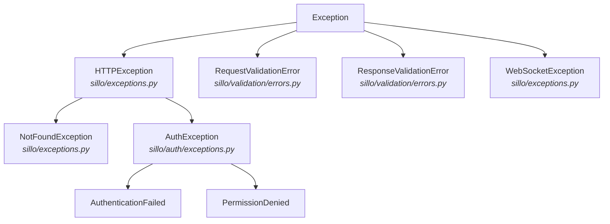

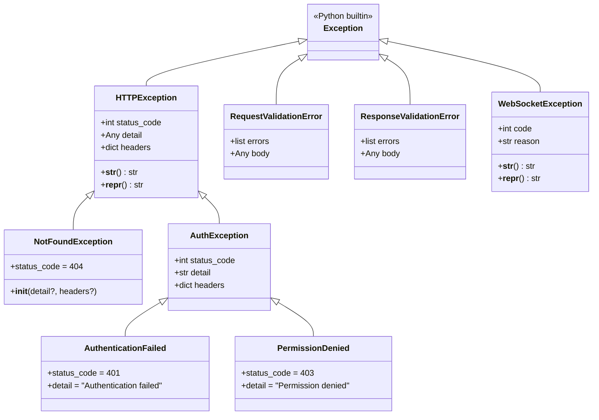

### 2.1 HTTPException

**File:** `core/sillo/exceptions.py` (lines 15 to 115)

The root of all HTTP error exceptions. Every handler that wants to produce a
non-2xx response raises this (or a subclass).

```python
class HTTPException(Exception):
    def __init__(
        self,
        status_code: int,
        detail: typing.Any | None = None,
        headers: dict[str, typing.Any] = {},
    ) -> None:
        super().__init__(detail or http.HTTPStatus(status_code).phrase)
        self.status_code = status_code
        self.detail = self.args[0]
        self.headers = headers
```

**Key behaviors:**

- If no `detail` is provided, the standard HTTP reason phrase from
  `http.HTTPStatus` is used (e.g., 404 → `"Not Found"`).
- The `detail` is stored both in `self.args[0]` (via `super().__init__`) and in
  `self.detail`. This makes it work with `str(exc)` and `exc.detail` alike.
- The `headers` dict defaults to `{}` (mutable default: intentional, only read,
  never mutated by the framework).
- `__str__` returns `"HTTP {status_code}: {detail}"`.
- `__repr__` returns `"HTTPException(404, 'Not Found')"` (uses the actual class
  name, so subclasses get the right name).

#### Raising patterns

```python
# Explicit status + detail
raise HTTPException(status_code=400, detail="Bad ctx body")

# Status-only (detail auto-derived from HTTPStatus)
raise HTTPException(status_code=429)

# With custom headers (e.g., WWW-Authenticate on 401)
raise HTTPException(
    status_code=401,
    detail="Token expired",
    headers={"WWW-Authenticate": "Bearer"},
)
```

### 2.2 NotFoundException

**File:** `core/sillo/exceptions.py` (lines 118 to 159)

A convenience subclass that hardcodes `status_code=404`:

```python
class NotFoundException(HTTPException):
    def __init__(
        self,
        detail: str | None = None,
        headers: dict[str, typing.Any] = {},
    ) -> None:
        super().__init__(
            status_code=404,
            detail=detail or "Not Found",
            headers=headers,
        )
```

**Why a separate class?** Two reasons:

1. The `ExceptionMiddleware` registers a *class-based* handler for
   `NotFoundException` → `handle_404_error`, which provides content negotiation
   (HTML for browsers, JSON for APIs). If you raise a bare
   `HTTPException(404)`, you get the generic JSON handler instead.
2. It makes intent explicit in code: `raise NotFoundException()` reads better
   than `raise HTTPException(404)`.

### 2.3 WebSocketException

**File:** `core/sillo/exceptions.py` (lines 162 to 242)

A completely separate exception hierarchy (does NOT inherit from
`HTTPException`) because WebSocket connections use close codes, not HTTP status
codes:

```python
class WebSocketException(Exception):
    def __init__(self, code: int, reason: str | None = None) -> None:
        super().__init__(reason or "")
        self.code = code
        self.reason = self.args[0]
```

- `code` is a WebSocket close code (RFC 6455): 1000 (normal), 1008 (policy
  violation), 1011 (internal error), etc.
- `reason` is an optional human-readable string (limited to 123 bytes by the
  WebSocket protocol).
- `__str__` → `"WebSocket {code}: {reason}"`.
- `__repr__` → `"WebSocketException(1008, 'Policy violation')"`.

WebSocket exceptions are caught by a completely separate middleware
(`WebSocketErrorMiddleware` in `core/sillo/websockets/errors.py`), not by
`ExceptionMiddleware`.

### 2.4 AuthException / AuthenticationFailed / PermissionDenied

**File:** `core/sillo/auth/exceptions.py` (lines 16 to 161)

```python
class AuthException(HTTPException):
    def __init__(
        self, status_code: int, detail: str, headers: HeadersType | None = None
    ) -> None:
        super().__init__(status_code, detail, headers or {})

class AuthenticationFailed(AuthException):
    def __init__(
        self,
        detail: str = "Authentication failed",
        headers: HeadersType | None = None,
    ) -> None:
        super().__init__(401, detail, headers)

class PermissionDenied(AuthException):
    def __init__(
        self,
        detail: str = "Permission denied",
        headers: HeadersType | None = None,
    ) -> None:
        super().__init__(403, detail, headers)
```

The inheritance chain is: `AuthenticationFailed` → `AuthException` →
`HTTPException` → `Exception`.

This means:
- Catching `HTTPException` catches auth errors too (they produce HTTP
  responses).
- Catching `AuthException` catches both `AuthenticationFailed` and
  `PermissionDenied`.
- The `ExceptionMiddleware` registers `AuthenticationFailed` → `AuthErrorHandler`
  at the class level, so auth failures get a dedicated JSON response handler.

### 2.5 RequestValidationError / ResponseValidationError

**File:** `core/sillo/validation/errors.py` (lines 68 to 126)

These inherit directly from `Exception` (NOT from `HTTPException`). They carry
structured error lists rather than a single status code:

```python
class RequestValidationError(Exception):
    def __init__(self, errors: list[dict[str, Any]], *, body: Any = None) -> None:
        self.errors = errors
        self.body = body
        super().__init__(f"{len(errors)} validation error(s) in request")

class ResponseValidationError(Exception):
    def __init__(self, errors: list[dict[str, Any]], *, body: Any = None) -> None:
        self.errors = errors
        self.body = body
        super().__init__(f"{len(errors)} validation error(s) in response")
```

**Why not inherit from HTTPException?** Because `ResponseValidationError` maps
to HTTP 500 (server error, not client error), while `RequestValidationError`
maps to 422. If they inherited from `HTTPException`, the status-code-based
dispatch would kick in and could conflict with the class-based handlers. By
being plain `Exception` subclasses, they always go through the class-based MRO
lookup.

---

## 3. ExceptionMiddleware: The Core Pipeline

**File:** `core/sillo/exception_handler.py` (lines 129 to 261)

`ExceptionMiddleware` is a standard sillo middleware that wraps request
processing in a try/except. It is **not** an ASGI middleware directly. It
conforms to the sillo middleware signature:

```python
from sillo import HttpContext

async def __call__(
    self,
    ctx: HttpContext,
    call_next: Callable[[], Awaitable[BaseResponse]],
) -> BaseResponse
```

### Initialization

```python
class ExceptionMiddleware:
    def __init__(self) -> None:
        self.debug = False
        self._status_handlers: dict[int, ExceptionHandlerType] = {}
        self._exception_handlers = {
            HTTPException: self.http_exception,
            AuthenticationFailed: AuthErrorHandler,
            NotFoundException: handle_404_error,
            ValidationError: pydantic_validation_error_handler,
            RequestValidationError: request_validation_error_handler,
            ResponseValidationError: response_validation_error_handler,
        }
```

On construction, the middleware creates:
- An empty `_status_handlers` dict (integer keys → handler callables).
- A pre-populated `_exception_handlers` dict (class keys → handler callables)
  with six default entries.

### The `__call__` Path

```python
from sillo import HttpContext

async def __call__(self, ctx: HttpContext, call_next):
    if len(self._exception_handlers) == 0 and len(self._status_handlers) == 0:
        return await call_next()       # fast path: no handlers at all
    return await wrap_http_exceptions(
        ctx=ctx,
        call_next=call_next,
        exception_handlers=self._exception_handlers,
        status_handlers=self._status_handlers,
    )
```

The fast-path optimization skips the try/except wrapper when both registries
are empty. In practice this never fires because the constructor pre-populates
`_exception_handlers`.

---

## 4. The Two Registries

The `ExceptionMiddleware` maintains two separate dictionaries:

### 4.1 `_status_handlers: dict[int, ExceptionHandlerType]`

- **Keys:** Integer HTTP status codes (e.g., `404`, `500`, `429`).
- **Values:** Async handler callables with signature
  `(request, response, exc) -> Response`.
- **Lookup:** Only checked when the exception is an `HTTPException` instance.
  The lookup uses `exc.status_code` as the key.
- **Priority:** Checked **first**, before class-based handlers. If a
  status-code handler is found, the class-based handler is never consulted.
- **Default:** Empty on init. Applications populate it via
  `add_exception_handler(int, handler)`.

```python
# Register a custom handler for 429 Too Many Requests
app.add_exception_handler(429, rate_limit_handler)
```

### 4.2 `_exception_handlers: dict[type[Exception], ExceptionHandlerType]`

- **Keys:** Exception **classes** (not instances).
- **Values:** Async handler callables.
- **Lookup:** Uses MRO traversal (`_lookup_exception_handler`).
- **Priority:** Checked second, only if no status-code handler matched (or the
  exception is not an `HTTPException`).
- **Default:** Pre-populated with six entries (see §3 above).

```python
# Register a custom handler for a domain exception
app.add_exception_handler(InsufficientCreditsError, credits_error_handler)
```

### Priority Relationship

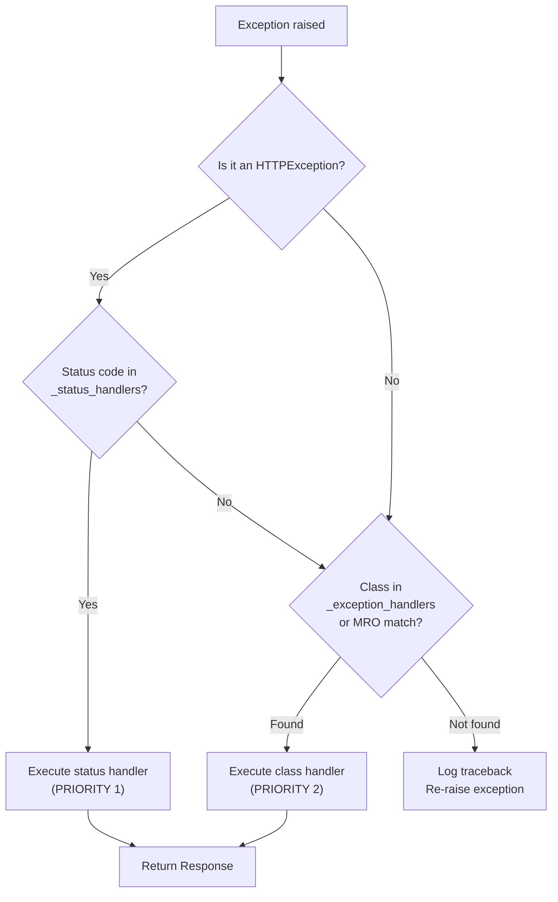

This two-tier design means:

- You can override the handler for *all* 404 responses by registering a
  status-code handler: `app.add_exception_handler(404, my_handler)`. This
  takes precedence over the class-based `NotFoundException` handler.
- You can register a handler for a specific exception class (e.g.,
  `RateLimitExceeded`) without touching status codes.
- The status-code registry is O(1) lookup; the class registry is O(n) where n
  is the MRO depth (typically ≤ 5).

---

## 5. Handler Lookup: MRO-Based Resolution

**File:** `core/sillo/exception_handler.py` (lines 28 to 60)

```python
def _lookup_exception_handler(
    exc_handlers: dict[int | type[Exception], ExceptionHandlerType],
    exc: Exception,
):
    for cls in type(exc).__mro__:
        if cls in exc_handlers:
            return exc_handlers[cls]
    return None
```

The algorithm walks the exception's Method Resolution Order (MRO), which for a
typical Python class looks like:

```python
>>> type(exc).__mro__
(AuthenticationFailed, AuthException, HTTPException, Exception, object)
```

At each step, it checks if that class is a key in `exc_handlers`. The **first
match wins**, which gives the most specific handler.

### Walkthrough Example

Suppose the registry contains:

```python
{
    HTTPException: http_exception_handler,
    AuthenticationFailed: auth_handler,
    Exception: fallback_handler,
}
```

And an `AuthenticationFailed` is raised. The MRO walk is:

| Step | Class in MRO | In registry? | Action |
|------|-------------|-------------|--------|
| 1 | `AuthenticationFailed` | ✅ Yes | Return `auth_handler` ← **match** |
| 2 | `AuthException` | (not reached) |  |
| 3 | `HTTPException` | (not reached) |  |
| 4 | `Exception` | (not reached) |  |
| 5 | `object` | (not reached) |  |

If the exception were a bare `HTTPException(403)` (not an `AuthException`
subclass):

| Step | Class in MRO | In registry? | Action |
|------|-------------|-------------|--------|
| 1 | `HTTPException` | ✅ Yes | Return `http_exception_handler` ← **match** |

If the exception were a `ValueError` (nothing in the registry matches):

| Step | Class in MRO | In registry? | Action |
|------|-------------|-------------|--------|
| 1 | `ValueError` | ❌ No | Continue |
| 2 | `Exception` | ✅ Yes | Return `fallback_handler` ← **match** |
| 3 | `object` | (not reached) |  |

If even `Exception` is not in the registry, the walk reaches `object`, finds
nothing, and returns `None`. The caller logs the traceback and re-raises.

### MRO Diagram

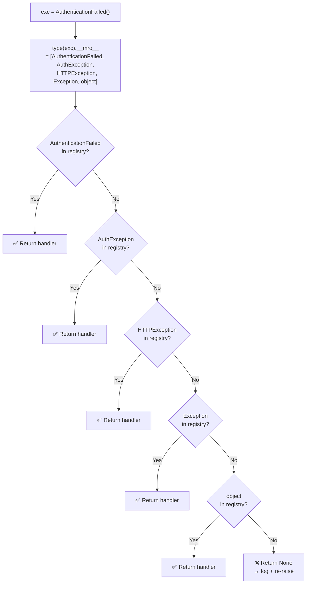

---

## 6. The `wrap_http_exceptions` Dispatch Function

**File:** `core/sillo/exception_handler.py` (lines 63 to 126)

This is the heart of the exception pipeline. It is called by
`ExceptionMiddleware.__call__` and contains the full try/except dispatch logic:

```python
from sillo import HttpContext

async def wrap_http_exceptions(
    ctx: HttpContext,
    call_next: Callable[..., Awaitable[BaseResponse]],
    exception_handlers: dict[int | type[Exception], ExceptionHandlerType],
    status_handlers: dict[int, ExceptionHandlerType],
):
    exception_handlers = exception_handlers or {}
    status_handlers = status_handlers or {}

    try:
        return await call_next()
    except Exception as exc:
        handler: ExceptionHandlerType | None = None

        # Step 1: Status-code lookup (HTTPException only)
        if isinstance(exc, HTTPException):
            handler = status_handlers.get(exc.status_code)
            if handler:
                return await handler(ctx, exc)

        # Step 2: Class-based MRO lookup
        if handler is None:
            handler = _lookup_exception_handler(exception_handlers, exc)
            if not handler:
                error = traceback.format_exc()
                logger.error(error)
                raise
            return await handler(ctx, exc)
```

### Step-by-step logic:

1. **Execute `call_next()`**: runs the next middleware or route handler.
2. **If an exception is raised:**
   a. **If it's an `HTTPException`**, look up `exc.status_code` in
      `status_handlers`. If found, call that handler immediately. Return.
   b. **If no status handler matched** (or the exception is not an
      `HTTPException`), perform MRO-based lookup in `exception_handlers`.
   c. **If a class handler is found**, call it and return.
   d. **If nothing matches**, log the full traceback and re-raise. The server
      error middleware (`ServerErrorMiddleware`) catches it and produces a 500.

### Important subtlety

The variable `handler` is initialized to `None` and is used as a sentinel. The
`if handler is None` check on line 120 is reached in two cases:

1. The exception is not an `HTTPException` (so the `isinstance` check on line
   115 was False, and `handler` was never assigned).
2. The exception IS an `HTTPException` but no status-code handler was found
   (`status_handlers.get(exc.status_code)` returned None).

In both cases, the class-based lookup runs. This means:

- An `HTTPException(404)` with no status-code handler will match the class-based
  `HTTPException` handler (the default `http_exception` method).
- A `NotFoundException` (which IS an `HTTPException`) with no status-code
  handler will match `NotFoundException` first in the MRO walk (more specific),
  falling back to `HTTPException` if needed.

---

## 7. Built-in Default Handlers

### 7.1 HTTPException → `http_exception` (JSON or empty)

**File:** `core/sillo/exception_handler.py` (lines 263 to 296)

```python
from sillo import HttpContext, json, empty

async def http_exception(
    self, ctx: HttpContext, response: BaseResponse, exc: HTTPException
) -> BaseResponse:
    assert isinstance(exc, HTTPException)
    if exc.status_code in {204, 304}:
        return empty(status_code=exc.status_code, headers=exc.headers)
    return json(
        exc.detail, status_code=exc.status_code, headers=exc.headers
    )
```

**Behavior:**

| Status | Response |
|--------|----------|
| 204, 304 | Empty body, appropriate status code, includes custom headers |
| Everything else | `response.json(exc.detail, status_code=..., headers=...)` |

The 204/304 special case exists because HTTP specifications prohibit response
bodies for these status codes. The handler returns `response.empty()` which
produces a response with no body.

**Response shape (non-204/304):**

```json
"detail message here"
```

Note: the response body is `exc.detail` directly (a string or any
JSON-serializable value), not wrapped in a `{"detail": ...}` envelope. This
differs from the 404 handler (§7.3) and the validation handlers (§7.4 to 7.6).

### 7.2 AuthenticationFailed → AuthErrorHandler

**File:** `core/sillo/auth/exceptions.py` (lines 164 to 197)

```python
from sillo import HttpContext, json

async def AuthErrorHandler(
    ctx: HttpContext, response: BaseResponse, exc: HTTPException
) -> Any:
    return json(exc.detail, status_code=exc.status_code, headers=exc.headers)
```

This handler is registered for the `AuthenticationFailed` class. Because of MRO
lookup, it also catches any subclass of `AuthenticationFailed` (though there
are none currently).

**Response shape:**

```json
"Authentication failed"
```

Same as the generic `http_exception` handler. The body is `exc.detail`
directly. The handler exists as a separate entry point so applications can
override it independently of the generic HTTPException handler.

### 7.3 NotFoundException → handle_404_error (Content-Negotiated 404)

**File:** `core/sillo/handlers/not_found.py` (lines 62 to 118)

This is the most sophisticated built-in handler. It performs content negotiation
based on the client's `Accept` header:

```python
from sillo import HttpContext, json, text, html

async def handle_404_error(
    ctx: HttpContext,
    exception: NotFoundException,
) -> BaseResponse:
    debug = _debug_enabled(ctx)

    if debug:
        error_message = exception.detail
        traceback_info = traceback.format_exc()
        if traceback_info.strip() == "NoneType: None":
            traceback_info = None
    else:
        error_message = GENERIC_MESSAGE  # "The page you are looking for does not exist."
        traceback_info = None

    if _prefers_html(ctx):
        return html(
            generate_html_page("404 - Not Found", error_message),
            status_code=404,
        )

    if ctx.accepts_json:
        error_details = {
            "status": 404,
            "error": http.HTTPStatus(404).phrase,
            "message": error_message,
        }
        if traceback_info:
            error_details["traceback"] = traceback_info
        return json(error_details, status_code=404)

    return text(
        f"404 - Not Found\n{error_message}",
        status_code=404,
    )
```

**Content negotiation logic:**

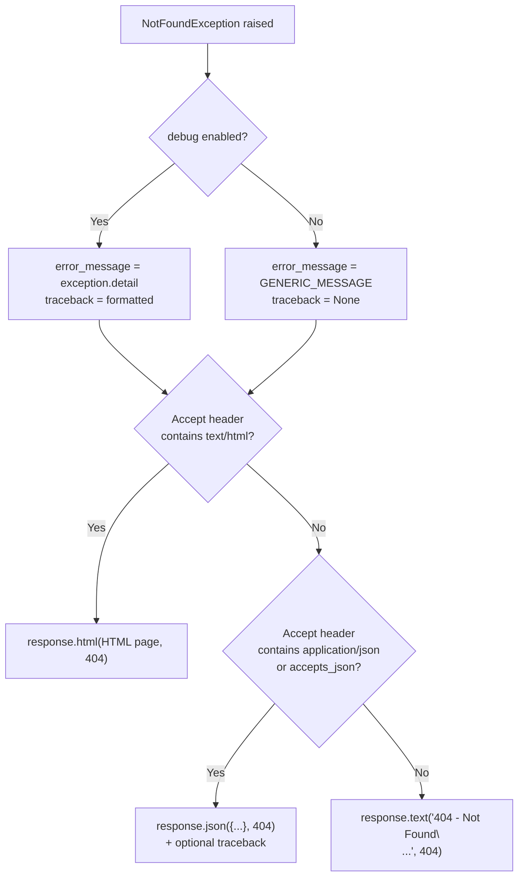

**Debug flag resolution** (`_debug_enabled`, line 121 to 144):

```python
from sillo import HttpContext

def _debug_enabled(ctx: HttpContext) -> bool:
    scope = getattr(ctx, "scope", {}) or {}
    for key in ("base_app", "app"):
        candidate = scope.get(key)
        if candidate is not None and hasattr(candidate, "debug"):
            return bool(candidate.debug)
    return False
```

The handler looks for `base_app` first, then `app` in the ASGI scope. This is
because `app` holds the router (which has no debug flag), while `base_app`
holds the `SilloApp` instance. If neither has a debug attribute, the default is
`False` (production-safe).

**HTML preference check** (`_prefers_html`, line 147 to 162):

```python
from sillo import HttpContext

def _prefers_html(ctx: HttpContext) -> bool:
    accept = ctx.headers.get("accept", "")
    return "text/html" in accept or "application/xhtml+xml" in accept
```

A wildcard `*/*` is NOT treated as a preference for HTML, only explicit
`text/html` or `application/xhtml+xml` triggers the HTML page.

### 7.4 ValidationError → pydantic_validation_error_handler (422)

**File:** `core/sillo/exception_handler.py` (lines 359 to 407)

Handles raw Pydantic `ValidationError` instances (from model construction,
not from request validation):

```python
from sillo import HttpContext, json

async def pydantic_validation_error_handler(
    ctx: HttpContext, response: BaseResponse, exc: ValidationError
) -> BaseResponse:
    errors = exc.errors()
    error_dict = {}
    for e in errors:
        loc, msg = e["loc"], e["msg"]
        if len(loc) == 1:
            error_dict[loc[0]] = msg
        elif len(loc) == 2:
            nested = error_dict.get(loc[0])
            if not isinstance(nested, dict):
                nested = {}
                error_dict[loc[0]] = nested
            nested[loc[1]] = msg
        else:
            error_dict[".".join(map(str, loc))] = msg
    return json(
        {"error": "Validation Error", "errors": error_dict},
        status_code=422,
    )
```

**Response shape:**

```json
{
    "error": "Validation Error",
    "errors": {
        "name": "field required",
        "address": {
            "city": "field required"
        },
        "items.0.price": "ensure this value is greater than 0"
    }
}
```

The nesting strategy:
- 1-level path: flat key (`"name": "..."`)
- 2-level path: nested dict (`"address": {"city": "..."}`)
- 3+ level path: dot-joined key (`"items.0.price": "..."`)

### 7.5 RequestValidationError → request_validation_error_handler (422)

**File:** `core/sillo/exception_handler.py` (lines 299 to 323)

```python
from sillo import HttpContext, json

async def request_validation_error_handler(
    ctx: HttpContext, response: BaseResponse, exc: RequestValidationError
) -> BaseResponse:
    return json({"detail": exc.errors}, status_code=422)
```

**Response shape:**

```json
{
    "detail": [
        {
            "loc": ["query", "page"],
            "msg": "value is not a valid integer",
            "type": "type_error.integer"
        },
        {
            "loc": ["body", "name"],
            "msg": "field required",
            "type": "value_error.missing"
        }
    ]
}
```

The key difference from the Pydantic handler: `RequestValidationError` already
carries location-prefixed errors (the `prefix_errors` function in
`core/sillo/validation/errors.py` adds the location prefix). The handler
serializes them directly.

### 7.6 ResponseValidationError → response_validation_error_handler (500)

**File:** `core/sillo/exception_handler.py` (lines 326 to 356)

```python
from sillo import HttpContext, json

async def response_validation_error_handler(
    ctx: HttpContext, response: BaseResponse, exc: ResponseValidationError
) -> BaseResponse:
    logger.error(
        "Response validation failed for %s %s: %s",
        ctx.method,
        ctx.url.path,
        exc.errors,
    )
    return json(
        {"error": "Internal Server Error", "detail": "Response validation failed"},
        status_code=500,
    )
```

**Response shape:**

```json
{
    "error": "Internal Server Error",
    "detail": "Response validation failed"
}
```

**Critical design decision:** The response does NOT include `exc.errors` or
`exc.body`. This is intentional. The handler's return value violated the
response model, which means it may contain data that the response model was
supposed to filter out. Echoing it back could leak internal state.

The error details ARE logged server-side for debugging.

### 7.7 Summary of Default Handler Responses

| Exception Class | Handler | HTTP Status | Response Body |
|----------------|---------|-------------|---------------|
| `HTTPException` | `http_exception` | `exc.status_code` | `exc.detail` (raw JSON) |
| `HTTPException` (204/304) | `http_exception` | 204/304 | Empty body |
| `AuthenticationFailed` | `AuthErrorHandler` | 401 | `exc.detail` (raw JSON) |
| `NotFoundException` | `handle_404_error` | 404 | HTML, JSON, or plain text (content-negotiated) |
| `ValidationError` (Pydantic) | `pydantic_validation_error_handler` | 422 | `{"error": "...", "errors": {...}}` |
| `RequestValidationError` | `request_validation_error_handler` | 422 | `{"detail": [...]}` |
| `ResponseValidationError` | `response_validation_error_handler` | 500 | `{"error": "...", "detail": "..."}` |

---

## 8. Database Exception Handlers

**File:** `core/sillo/record/exceptions.py` (lines 1 to 110)

Sillo provides built-in handlers for Tortoise ORM exceptions. These are NOT
registered by default. Applications must call
`register_db_exception_handlers(app)`:

```python
def register_db_exception_handlers(app) -> None:
    app.add_exception_handler(DoesNotExist, handle_does_not_exist)
    app.add_exception_handler(IntegrityError, handle_integrity_error)
    app.add_exception_handler(ValidationError, handle_validation_error)
    app.add_exception_handler(OperationalError, handle_operational_error)
```

### 8.1 DoesNotExist → 404

```python
from sillo import HttpContext, json

async def handle_does_not_exist(ctx: HttpContext, exc: DoesNotExist):
    return json(
        {"error": "Not Found", "detail": str(exc)},
        status_code=404,
    )
```

Triggered when a Tortoise `.get()` query finds no matching record.

### 8.2 IntegrityError → 409

```python
from sillo import HttpContext, json

async def handle_integrity_error(ctx: HttpContext, exc: IntegrityError):
    return json(
        {"error": "Conflict", "detail": str(exc)},
        status_code=409,
    )
```

Triggered on unique constraint violations, foreign key violations, or null
constraint violations at the database level.

### 8.3 ValidationError → 422

```python
from sillo import HttpContext, json

async def handle_validation_error(ctx: HttpContext, exc: ValidationError):
    return json(
        {"error": "Validation Error", "detail": str(exc)},
        status_code=422,
    )
```

Triggered by Tortoise model-level validation (type mismatches, out-of-range
values, etc.). Note: this is `tortoise.exceptions.ValidationError`, NOT
`pydantic.ValidationError`.

### 8.4 OperationalError → 503

```python
from sillo import HttpContext, json

async def handle_operational_error(ctx: HttpContext, exc: OperationalError):
    return json(
        {"error": "Service Unavailable", "detail": "Database unavailable"},
        status_code=503,
    )
```

Triggered when the database is unreachable (connection refused, timeout,
network partition). The detail message is deliberately generic to avoid leaking
infrastructure details.

### DB Handler Registration Flow

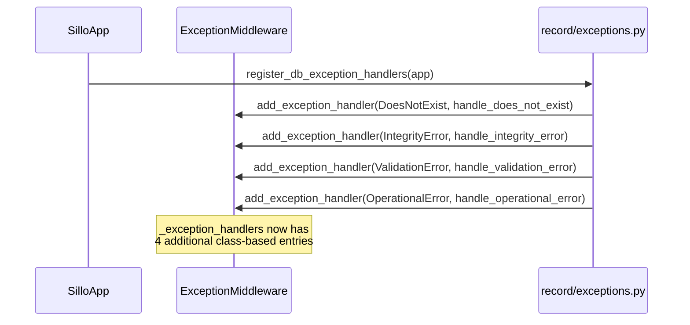

### Collision Warning: Tortoise ValidationError vs Pydantic ValidationError

The default `ExceptionMiddleware` registers a handler for
`pydantic.ValidationError`. When `register_db_exception_handlers` is called, it
adds a handler for `tortoise.exceptions.ValidationError`. These are **different
classes**. There is no collision. The MRO lookup correctly resolves to the
right handler based on the exception's actual type.

However, if you register a handler for the base `Exception` class, it will
catch BOTH validation error types (and everything else). Be specific.

---

## 9. WebSocket Exception Handling

**File:** `core/sillo/websockets/errors.py` (lines 1 to 40)

WebSocket connections have a completely separate exception pipeline.
`ExceptionMiddleware` does NOT handle WebSocket exceptions. They are caught by
`WebSocketErrorMiddleware`:

```python
from sillo import WebSocketContext

class WebSocketErrorMiddleware:
    def __init__(self, app: ASGIApp):
        self.app = app

    async def __call__(self, scope: Scope, receive: Receive, send: Send):
        if scope["type"] == "websocket":
            websocket = WebSocketContext(scope, receive, send)
            try:
                await self.app(scope, receive, send)
            except WebSocketException as exc:
                await websocket_exception_handler(websocket, exc)
            except Exception:
                error = traceback.format_exc()
                logger.error(f"Unexpected error: {error}")
                await websocket.close(code=1011, reason="Internal Server Error")
        else:
            await self.app(scope, receive, send)
```

**Two catch branches:**

1. `WebSocketException` → `websocket_exception_handler` → sends a close frame
   with the exception's `code` and `reason`.
2. Any other `Exception` → logs the traceback and sends a close frame with code
   1011 (Internal Server Error) and a generic reason.

```python
from sillo import WebSocketContext

async def websocket_exception_handler(
    websocket: WebSocketContext, exc: WebSocketException
) -> None:
    error = traceback.format_exc()
    logger.error(f"WebSocketContext error: {error}")
    await websocket.close(code=exc.code, reason=str(exc))
```

### WebSocket Exception Flow

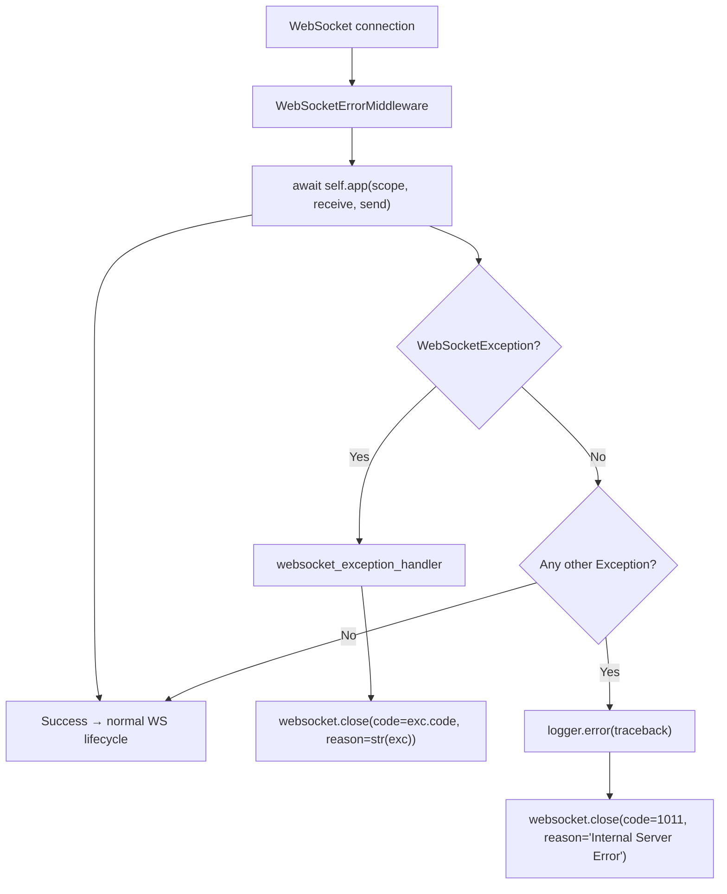

### Common WebSocket Close Codes

| Code | Name | When to use |
|------|------|-------------|
| 1000 | Normal Closure | Connection completed successfully |
| 1001 | Going Away | Server shutting down, client navigating away |
| 1008 | Policy Violation | Authentication failure, rate limiting |
| 1011 | Internal Server Error | Unexpected server-side error |
| 1013 | Try Again Later | Server temporarily overloaded |

```python
# Raise from a WebSocketContext handler
from sillo import WebSocketContext

raise WebSocketException(code=1008, reason="Authentication required")

# Close with no reason (defaults to empty string)
raise WebSocketException(code=1000)
```

---

## 10. Content Negotiation in Error Responses

The `handle_404_error` handler is the only built-in handler that performs
content negotiation. All other handlers return JSON unconditionally.

### Negotiation Algorithm

1. Read the `Accept` header from the request.
2. If it contains `text/html` or `application/xhtml+xml` → return an HTML page.
3. If `request.accepts_json` is True → return JSON.
4. Otherwise → return plain text.

### HTML Error Page Generation

**File:** `core/sillo/handlers/not_found.py` (lines 12 to 59)

```python
def generate_html_page(title: str, message: str) -> str:
    return f"""<!DOCTYPE html>
<html lang="en">
<head>
    <meta charset="UTF-8">
    <meta name="viewport" content="width=device-width, initial-scale=1.0">
    <title>{title}</title>
    <style>
        body {{ font-family: Arial, sans-serif; text-align: center; margin: 50px; color: #333; }}
        h1 {{ font-size: 48px; color: #d9534f; }}
        p {{ font-size: 18px; margin-top: 10px; }}
    </style>
</head>
<body>
    <h1>{title}</h1>
    <p>{message}</p>
</body>
</html>"""
```

The page is self-contained (no external CSS/JS dependencies) and uses a
minimal, centered layout.

### Content Type Decision Matrix

| Accept Header | Response Format | Status |
|---------------|----------------|--------|
| `text/html` | HTML page | 404 |
| `application/xhtml+xml` | HTML page | 404 |
| `application/json` | JSON object | 404 |
| `*/*` | JSON object | 404 |
| (empty/missing) | JSON object | 404 |
| `text/plain` | Plain text | 404 |
| `image/png` | Plain text | 404 |

---

## 11. Validation Error Architecture

### 11.1 Location-Prefixing: `prefix_errors`

**File:** `core/sillo/validation/errors.py` (lines 15 to 65)

The `prefix_errors` function converts Pydantic `ValidationError` instances into
location-prefixed error dictionaries:

```python
def prefix_errors(
    exc: ValidationError,
    location: str,
    *,
    alias_map: dict[str, str] | None = None,
) -> list[dict[str, Any]]:
    out: list[dict[str, Any]] = []
    for err in exc.errors():
        loc: Sequence[Any] = err.get("loc", ())
        first = loc[0] if loc else None
        if alias_map and isinstance(first, str) and first in alias_map:
            loc = (alias_map[first], *loc[1:])
        item = {
            "loc": [location, *loc],
            "msg": err.get("msg", ""),
            "type": err.get("type", ""),
        }
        if "input" in err:
            item["input"] = err["input"]
        out.append(item)
    return out
```

**Example transformation:**

Pydantic reports: `{"loc": ("page",), "msg": "value is not a valid integer", ...}`

After `prefix_errors(exc, "query")`: `{"loc": ["query", "page"], "msg": "...", ...}`

The `alias_map` parameter handles the case where a Python field name differs
from the wire name (e.g., due to Pydantic aliases).

### 11.2 Two Validation Error Types

| Exception | Source | HTTP Status | When raised |
|-----------|--------|-------------|-------------|
| `RequestValidationError` | Client input | 422 | Request data fails validation markers (Query, Path, Body, etc.) |
| `ResponseValidationError` | Server output | 500 | Handler return value violates `response_model` |

**Key distinction:** `RequestValidationError` is a client error (the client sent
bad data). `ResponseValidationError` is a server error (the application
produced bad output). They map to different HTTP status codes to make this
distinction clear to API clients.

### 11.3 Error Accumulation

`RequestValidationError` accumulates errors across all request locations in a
single exception. A single request can have bad query parameters AND a malformed
body, producing a single 422 response with all errors listed:

```json
{
    "detail": [
        {"loc": ["query", "page"], "msg": "value is not a valid integer", "type": "type_error.integer"},
        {"loc": ["body", "name"], "msg": "field required", "type": "value_error.missing"},
        {"loc": ["path", "team_id"], "msg": "value is not a valid integer", "type": "type_error.integer"}
    ]
}
```

This avoids the N+1 round-trip problem where clients fix one error per request.

---

## 12. Handler Signature Contract

All exception handlers must conform to the `ExceptionHandlerType` defined in
`core/sillo/types.py` (line 39):

```python
from sillo import HttpContext

ExceptionHandlerType = Callable[[HttpContext, BaseResponse, Exception], BaseResponse]
```

In practice, handlers are async callables with this signature:

```python
from sillo import HttpContext

async def my_handler(
    ctx: HttpContext,
    exc: SomeException,
) -> BaseResponse:
    ...
```

**Parameters:**

| Parameter | Type | Description |
|-----------|------|-------------|
| `request` | `HttpContext` | The incoming HTTP request. Provides access to headers, URL, method, scope, and the application instance. |
| — | — | There is no response argument. Build one with `json()`, `html()`, `text()` or `empty()` from `sillo.responses` and return it. |
| `exc` | `Exception` subclass | The caught exception. Handlers should type-hint this to the specific exception class they handle. |

**Return:** A response object. The middleware sends this back to the client.

### Response Factory Methods

| Method | Use case |
|--------|----------|
| `response.json(data, status_code=..., headers=...)` | JSON responses (most common) |
| `response.html(html_string, status_code=...)` | HTML responses (404 page) |
| `response.text(text, status_code=...)` | Plain text responses |
| `response.empty(status_code=..., headers=...)` | Empty body (204, 304) |

---

## 13. Registration Patterns

### 13.1 Via `add_exception_handler`

```python
# Status-code based (goes into _status_handlers)
app.add_exception_handler(429, my_rate_limit_handler)

# Class-based (goes into _exception_handlers)
app.add_exception_handler(InsufficientCreditsError, my_credits_handler)
```

### 13.2 Via `register_db_exception_handlers`

```python
from sillo.record.exceptions import register_db_exception_handlers

app = SilloApp()
register_db_exception_handlers(app)
```

### 13.3 Overriding a Default Handler

```python
# Override the default 404 handler
from sillo import HttpContext, json

async def custom_404(ctx: HttpContext, exc):
    return json({"error": "custom not found"}, status_code=404)

app.add_exception_handler(NotFoundException, custom_404)
```

### 13.4 Catch-All Handler

```python
# Catch any unhandled exception (risky — use with caution)
from sillo import HttpContext, json

async def catch_all(ctx: HttpContext, exc):
    logger.exception("Unhandled exception")
    return json({"error": "Internal Server Error"}, status_code=500)

app.add_exception_handler(Exception, catch_all)
```

### 13.5 Status-Code Override vs Class Override

```python
# This catches ALL 404 responses (including NotFoundException)
app.add_exception_handler(404, my_404_handler)

# This only catches NotFoundException specifically
app.add_exception_handler(NotFoundException, my_404_handler)
```

The status-code handler takes priority (checked first in `wrap_http_exceptions`).

---

## 14. Pipeline Flow Diagrams

### 14.1 Complete Exception Handling Pipeline

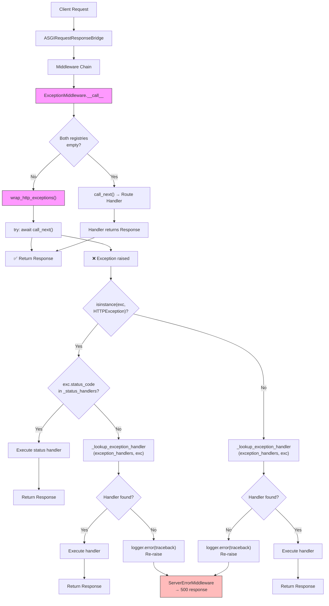

### 14.2 MRO Lookup Detail

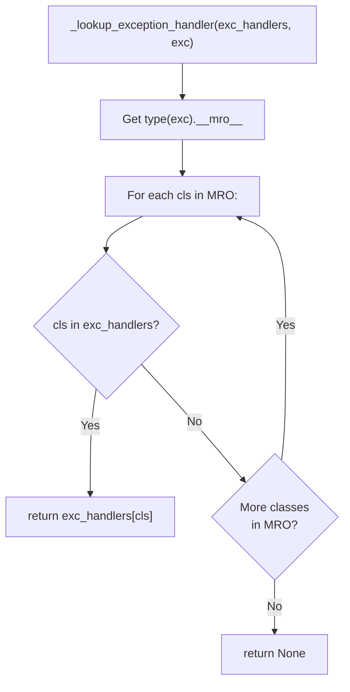

### 14.3 Default Handler Registration Map

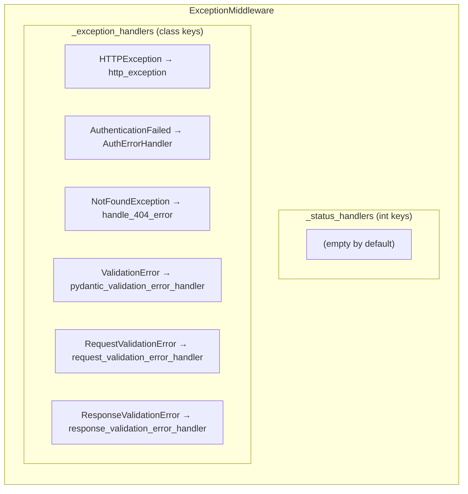

### 14.4 Database Handler Registration Map

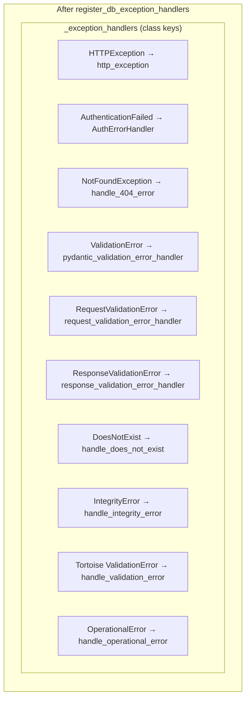

---

## 15. Edge Cases and Gotchas

### 15.1 Mutable Default Headers

`HTTPException.__init__` and `NotFoundException.__init__` use mutable default
arguments (`headers: dict = {}`). This is a known Python anti-pattern, but the
framework only reads the dict, never mutates it. If you need to pass headers,
always pass an explicit dict:

```python
# Good
raise HTTPException(401, headers={"WWW-Authenticate": "Bearer"})

# Technically works but risky if anyone mutates the default
raise HTTPException(401)
```

### 15.2 Status-Code Handler Precedence

Status-code handlers are checked BEFORE class-based handlers. This means:

```python
# This handler fires for ALL 404s, even NotFoundException
app.add_exception_handler(404, my_handler)

# This handler is IGNORED when the status-code handler matches
app.add_exception_handler(NotFoundException, other_handler)
```

To override the `NotFoundException` handler without affecting other 404s, use
the class-based registration only (no status-code registration).

### 15.3 Re-raising Unhandled Exceptions

When no handler is found, `wrap_http_exceptions` logs the traceback and
re-raises. This means the exception propagates to the ASGI layer
(`ServerErrorMiddleware`), which produces a generic 500 response. In debug
mode, the 500 page includes the full traceback.

### 15.4 Pydantic ValidationError vs Tortoise ValidationError

These are different classes from different packages:
- `pydantic.ValidationError`: handled by `pydantic_validation_error_handler`
  (422)
- `tortoise.exceptions.ValidationError`: handled by `handle_validation_error`
  (422)

Both produce 422 responses but with different JSON shapes. The MRO lookup
correctly distinguishes them because they share no common base class (other
than `Exception`).

### 15.5 WebSocket Exceptions Don't Go Through ExceptionMiddleware

`WebSocketException` is caught by `WebSocketErrorMiddleware`, not by
`ExceptionMiddleware`. The two middlewares operate at different levels of the
ASGI stack:

- `WebSocketErrorMiddleware` works at the raw ASGI level (`scope`, `receive`,
  `send`).
- `ExceptionMiddleware` works at the sillo middleware level (`request`,
  `response`, `call_next`).

### 15.6 ResponseValidationError Is Intentionally Vague

The `response_validation_error_handler` deliberately returns a generic error
message. The actual validation errors are logged server-side but NOT included
in the response. This prevents leaking internal data that the response model
was supposed to filter out.

### 15.7 The `handler is None` Sentinel

In `wrap_http_exceptions`, the variable `handler` is initialized to `None` and
checked with `if handler is None`. This is NOT the same as `if not handler`.
The latter would also be True for falsy handler objects. The explicit `is None`
check is intentional.

---

## 16. Testing Exception Handlers

### 16.1 Unit Testing a Handler Directly

```python
import pytest
from unittest.mock import AsyncMock, MagicMock
from sillo.exceptions import NotFoundException
from sillo.handlers.not_found import handle_404_error

@pytest.mark.asyncio
async def test_handle_404_json():
    ctx = MagicMock()
    ctx.headers = {"accept": "application/json"}
    ctx.accepts_json = True
    ctx.scope = {}

    response = MagicMock()
    response.json = MagicMock(return_value="mock_response")

    exc = NotFoundException("Resource not found")
    result = await handle_404_error(ctx, exc)

    response.json.assert_called_once()
    call_args = response.json.call_args
    assert call_args[1]["status_code"] == 404
```

### 16.2 Integration Testing via TestClient

```python
from sillo.testing import TestClient
from sillo import HttpContext

def test_custom_exception_handler():
    app = SilloApp()

    @app.get("/fail")
    async def fail(ctx: HttpContext):
        raise HTTPException(400, detail="Bad request")

    client = TestClient(app)
    resp = client.get("/fail")
    assert resp.status_code == 400
    assert resp.json() == "Bad request"
```

### 16.3 Testing MRO Resolution

```python
def test_mro_resolution():
    """Verify that the most specific handler is found."""
    from sillo.exception_handler import _lookup_exception_handler

    handlers = {
        HTTPException: handler_a,
        AuthenticationFailed: handler_b,
    }

    # AuthenticationFailed is more specific
    exc = AuthenticationFailed()
    assert _lookup_exception_handler(handlers, exc) is handler_b

    # Bare HTTPException matches the base handler
    exc = HTTPException(400)
    assert _lookup_exception_handler(handlers, exc) is handler_a

    # An unrelated exception matches Exception if registered
    handlers[Exception] = handler_c
    exc = ValueError()
    assert _lookup_exception_handler(handlers, exc) is handler_c
```

---

## 17. Source File Index

| File | Lines | Purpose |
|------|-------|---------|
| `core/sillo/exceptions.py` | 242 | `HTTPException`, `NotFoundException`, `WebSocketException` |
| `core/sillo/exception_handler.py` | 407 | `ExceptionMiddleware`, `wrap_http_exceptions`, `_lookup_exception_handler`, all default handlers |
| `core/sillo/auth/exceptions.py` | 197 | `AuthException`, `AuthenticationFailed`, `PermissionDenied`, `AuthErrorHandler` |
| `core/sillo/handlers/not_found.py` | 162 | `handle_404_error`, `generate_html_page`, `_debug_enabled`, `_prefers_html` |
| `core/sillo/validation/errors.py` | 126 | `RequestValidationError`, `ResponseValidationError`, `prefix_errors` |
| `core/sillo/validation/__init__.py` | 89 | Re-exports for validation package |
| `core/sillo/record/exceptions.py` | 110 | `handle_does_not_exist`, `handle_integrity_error`, `handle_validation_error`, `handle_operational_error`, `register_db_exception_handlers` |
| `core/sillo/websockets/errors.py` | 40 | `websocket_exception_handler`, `WebSocketErrorMiddleware` |
| `core/sillo/types.py` | 41 | `ExceptionHandlerType` type alias |

---

## Appendix A: Complete Handler Registration Sequence

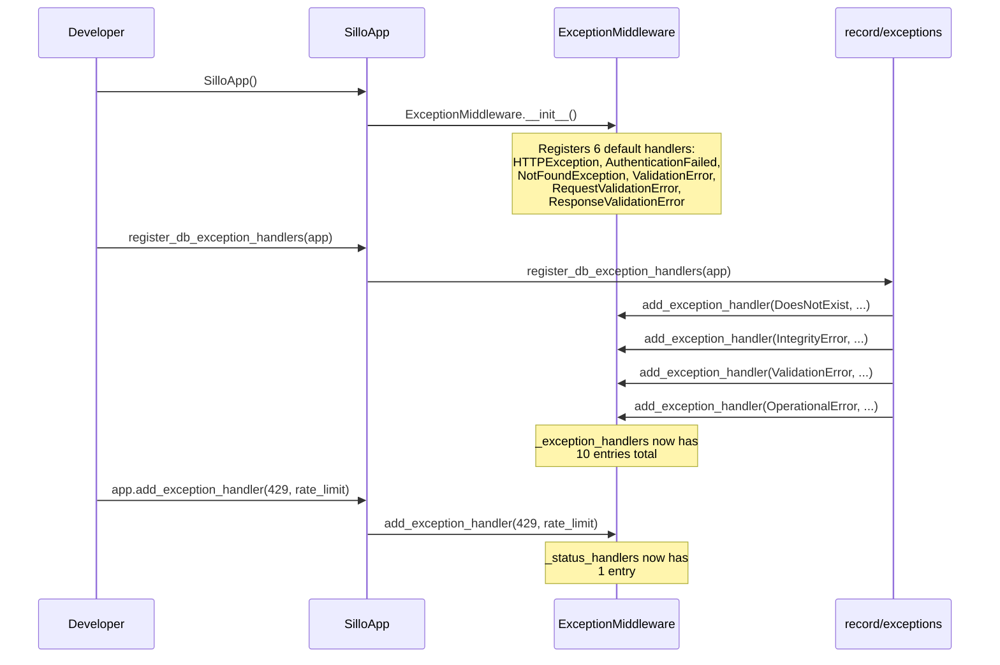

## Appendix B: Exception Response Format Reference

### HTTPException (generic)
```json
"Bad request"
```

### AuthenticationFailed
```json
"Authentication failed"
```

### NotFoundException (JSON mode, production)
```json
{
    "status": 404,
    "error": "Not Found",
    "message": "The page you are looking for does not exist."
}
```

### NotFoundException (JSON mode, debug)
```json
{
    "status": 404,
    "error": "Not Found",
    "message": "User with id 42 not found",
    "traceback": "Traceback (most recent call last):\n  ..."
}
```

### NotFoundException (HTML mode)
```html
<!DOCTYPE html>
<html lang="en">
<head>
    <meta charset="UTF-8">
    <meta name="viewport" content="width=device-width, initial-scale=1.0">
    <title>404 - Not Found</title>
    <style>
        body { font-family: Arial, sans-serif; text-align: center; margin: 50px; color: #333; }
        h1 { font-size: 48px; color: #d9534f; }
        p { font-size: 18px; margin-top: 10px; }
    </style>
</head>
<body>
    <h1>404 - Not Found</h1>
    <p>The page you are looking for does not exist.</p>
</body>
</html>
```

### NotFoundException (plain text mode)
```
404 - Not Found
The page you are looking for does not exist.
```

### Pydantic ValidationError
```json
{
    "error": "Validation Error",
    "errors": {
        "name": "field required",
        "address": {
            "city": "field required"
        }
    }
}
```

### RequestValidationError
```json
{
    "detail": [
        {
            "loc": ["query", "page"],
            "msg": "value is not a valid integer",
            "type": "type_error.integer"
        }
    ]
}
```

### ResponseValidationError
```json
{
    "error": "Internal Server Error",
    "detail": "Response validation failed"
}
```

### DoesNotExist (DB)
```json
{
    "error": "Not Found",
    "detail": "User matching query does not exist."
}
```

### IntegrityError (DB)
```json
{
    "error": "Conflict",
    "detail": "UNIQUE constraint failed: user.email"
}
```

### OperationalError (DB)
```json
{
    "error": "Service Unavailable",
    "detail": "Database unavailable"
}
```
