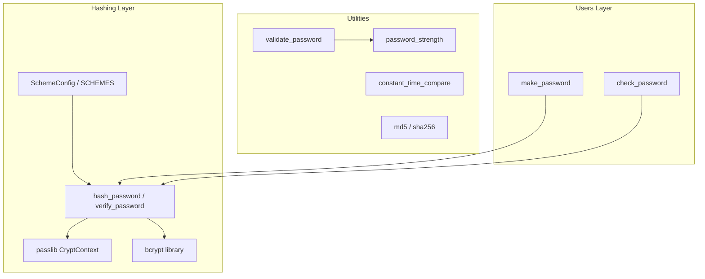
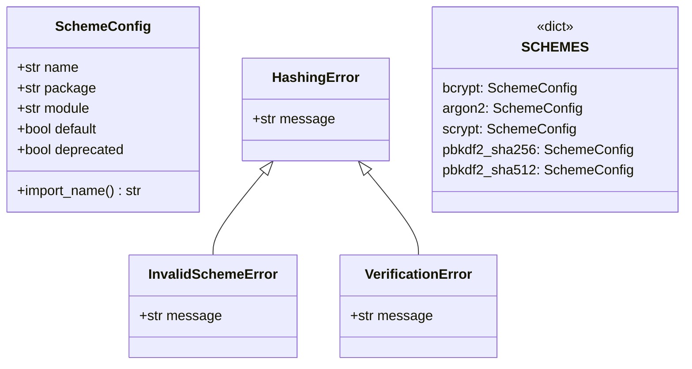

**Version:** 2026-08-17
**Audience:** Core maintainers, security engineers, application developers
**Purpose:** Document the hashing scheme registry, core hashing operations, verification, rehash detection, and password utilities

---

## Overview

Sillo's hashing subsystem provides password hashing, verification, and strength
validation through a pluggable scheme registry. It supports five algorithms
(bcrypt, argon2, scrypt, pbkdf2_sha256, and pbkdf2_sha512) with bcrypt as the
preferred default and pbkdf2_sha256 as the always-available fallback.

The design principle: **auto-detect on verify, explicit on hash**. When hashing, the caller can specify a scheme or use the default. When verifying, the algorithm is detected from the hash prefix automatically, so hashes from any supported algorithm can be verified without knowing which one was used.



---

## Architecture Diagram



---

## SchemeConfig: Scheme Metadata

**File:** `core/sillo/hashing/config.py` (lines 6 to 25)

```python
@dataclass
class SchemeConfig:
    name: str
    package: str | None = None
    module: str | None = None
    default: bool = False
    deprecated: bool = False

    @property
    def import_name(self) -> str | None:
        return self.module or self.package
```

| Field | Purpose |
|-------|---------|
| `name` | The scheme identifier used in API calls (e.g. `"bcrypt"`) |
| `package` | The distribution you install, used in the "not available" message (`None` for built-in schemes) |
| `module` | The module actually imported to test availability, when it differs from the distribution |
| `default` | Whether this is the preferred default scheme |
| `deprecated` | Whether this scheme should trigger rehashing on verification |

`package` and `module` are separate because they are separate things:
`argon2-cffi` is the distribution you install, and `argon2` is the module it
installs. One cannot be derived from the other by swapping dashes for
underscores, and doing so meant argon2 reported missing on machines that had
it installed.

---

## SCHEMES: The Scheme Registry

**File:** `core/sillo/hashing/config.py` (lines 29 to 52)

```python
SCHEMES: dict[str, SchemeConfig] = {
    "bcrypt": SchemeConfig(name="bcrypt", package="bcrypt", default=True),
    "argon2": SchemeConfig(name="argon2", package="argon2-cffi", module="argon2"),
    "scrypt": SchemeConfig(name="scrypt", package="scrypt"),
    "pbkdf2_sha256": SchemeConfig(name="pbkdf2_sha256", package=None),
    "pbkdf2_sha512": SchemeConfig(name="pbkdf2_sha512", package=None),
}
```

| Scheme | Install | Imports as | Default | Security Profile |
|--------|---------|------------|---------|------------------|
| `bcrypt` | `bcrypt` | `bcrypt` | ✅ | Fast, widely supported, 12 rounds default |
| `argon2` | `argon2-cffi` | `argon2` | ❌ | Memory-hard, most secure against GPU attacks |
| `scrypt` | `scrypt` | `scrypt` | ❌ | GPU-resistant, good middle ground |
| `pbkdf2_sha256` | Built-in | n/a | ❌ | NIST-approved, always available |
| `pbkdf2_sha512` | Built-in | n/a | ❌ | Stronger variant of pbkdf2 |

**Hash prefix detection:**

| Prefix | Algorithm |
|--------|-----------|
| `$2a$`, `$2b$`, `$2x$`, `$2y$` | bcrypt |
| `$argon2` | argon2 |
| `$scrypt` | scrypt |
| `pbkdf2_sha256$` | pbkdf2_sha256 |
| `pbkdf2_sha512$` | pbkdf2_sha512 |

---

## Scheme Availability

**File:** `core/sillo/hashing/config.py` (lines 55 to 100)

### `get_default_scheme()` → `str`

Returns the preferred default scheme (bcrypt) if available, otherwise falls back to `pbkdf2_sha256`:

```python
def get_default_scheme() -> str:
    for name, config in SCHEMES.items():
        if config.default and is_scheme_available(name):
            return name
    return "pbkdf2_sha256"
```

### `is_scheme_available(scheme)` → `bool`

Checks if a scheme's module can actually be imported:

```python
def is_scheme_available(scheme: str) -> bool:
    config = SCHEMES.get(scheme)
    if not config:
        return False
    module = config.import_name
    if module is None:
        return True  # Built-in, always available
    try:
        __import__(module)
        return True
    except ImportError:
        return False
```

Built-in schemes (`package=None`) are always available. Optional schemes are
probed at runtime by importing `import_name`, which is the module rather than
the distribution.

### `install_hint(scheme)` → `str`

The remedy shown when a scheme is unavailable. It names the distribution to
install, which is not always the scheme name:

```python
def install_hint(scheme: str) -> str:
    config = SCHEMES.get(scheme)
    if config is None or config.package is None:
        return f"'{scheme}' is not a known scheme"
    return f"pip install {config.package}"
```

So an unavailable argon2 reports `pip install argon2-cffi`. `pip install
argon2` is a different, unrelated project and would not make the scheme
available.

### `get_available_schemes()` → `list[str]`

Returns all currently available scheme names:

```python
def get_available_schemes() -> list[str]:
    return [name for name in SCHEMES if is_scheme_available(name)]
```

---

## Core Hashing Operations

**File:** `core/sillo/hashing/core.py`

### Module State

```python
_context: CryptContext | None = None
_default_scheme: str = get_default_scheme()
```

The module maintains a singleton `passlib.CryptContext` and a mutable default scheme. The context is lazily initialized on first use.

### `_get_context()` → `CryptContext`

Creates or returns the singleton passlib `CryptContext`:

```python
def _get_context() -> CryptContext:
    global _context
    if _context is None:
        available_schemes = get_available_schemes()
        if not available_schemes:
            raise HashingError("No hashing schemes available.")
        _context = CryptContext(schemes=available_schemes, deprecated="auto")
    return _context
```

The context is configured with all available schemes and `deprecated="auto"`, which means passlib will flag hashes using deprecated schemes for rehashing.

### `hash_password(password, scheme=None, salt=None, **kwargs)` → `str`

The primary hashing function:

```python
def hash_password(password, scheme=None, salt=None, **kwargs) -> str:
    if scheme is None:
        scheme = _default_scheme

    if not is_scheme_available(scheme):
        raise InvalidSchemeError(f"Scheme '{scheme}' is not available.")

    try:
        if scheme == "bcrypt":
            import bcrypt as bcrypt_lib
            if salt is not None:
                salt_bytes = salt.encode() if isinstance(salt, str) else salt
            else:
                salt_bytes = bcrypt_lib.gensalt(rounds=12)
            hashed = bcrypt_lib.hashpw(password.encode(), salt_bytes)
            return hashed.decode()

        context = _get_context()
        return context.hash(password, scheme=scheme, **kwargs)
    except ValueError:
        raise
    except Exception as e:
        raise HashingError(f"Failed to hash password: {e}") from e
```

**Two code paths:**

1. **bcrypt**: uses the `bcrypt` library directly with `gensalt(rounds=12)` and
   `hashpw`. This bypasses passlib for performance and to avoid the passlib
   bcrypt backend deprecation warning.

2. **Other schemes**: delegates to passlib's `CryptContext.hash()`, which
   handles argon2, scrypt, and pbkdf2.

**Parameters:**
- `password`: plaintext password to hash
- `scheme`: algorithm to use (defaults to `_default_scheme`, which is bcrypt if
  available)
- `salt`: optional salt for bcrypt only (advanced use; normally auto-generated)
- `**kwargs`: passed to passlib for non-bcrypt schemes

### `set_default_scheme(scheme)` → `None`

Changes the default scheme at runtime:

```python
def set_default_scheme(scheme: str) -> None:
    global _default_scheme
    if not is_scheme_available(scheme):
        raise InvalidSchemeError(f"Scheme '{scheme}' is not available.")
    _default_scheme = scheme
```

---

## Verification and Rehash Detection

### `verify_password(password, hashed)` → `bool`

Auto-detects the algorithm and verifies:

```python
def verify_password(password, hashed) -> bool:
    if not hashed:
        return False

    # Try bcrypt directly first if it's a bcrypt hash
    if hashed.startswith(("$2a$", "$2b$", "$2x$", "$2y$")):
        try:
            import bcrypt as bcrypt_lib
            return bcrypt_lib.checkpw(password.encode(), hashed.encode())
        except Exception:
            pass

    context = _get_context()
    try:
        return context.verify(password, hashed)
    except Exception:
        return False
```

**Two code paths** (mirrors `hash_password`):
1. **bcrypt hashes**: detected by prefix (`$2a$`, `$2b$`, `$2x$`, `$2y$`),
   verified directly with `bcrypt.checkpw`
2. **Other hashes**: verified via passlib's `CryptContext.verify()`

Returns `False` on any error (malformed hash, unsupported algorithm, wrong password).

### `needs_update(hashed)` → `bool`

Checks if a hash should be regenerated with stronger settings:

```python
def needs_update(hashed) -> bool:
    context = _get_context()
    try:
        return context.needs_update(hashed)
    except Exception:
        return False
```

Passlib's `needs_update` returns `True` when:
- The hash uses a deprecated scheme
- The hash uses fewer rounds than the current default

### `needs_rehash(hashed, rounds=12)` → `bool`

More granular rehash detection:

```python
def needs_rehash(hashed, rounds=12) -> bool:
    if not hashed:
        return True
    if needs_update(hashed):
        return True
    if hashed.startswith("$2"):
        try:
            current_rounds = int(hashed.split("$")[2])
            return current_rounds < rounds
        except (IndexError, ValueError):
            return True
    return False
```

For bcrypt hashes, explicitly checks if the round count is below the specified minimum. For other schemes, delegates to `needs_update`.

### Usage Pattern: Rehash on Login

```python
from sillo import HttpContext

async def login(ctx: HttpContext, email, password):
    user = await User.objects.get_by_email(email)
    if not user or not user.check_password(password):
        return None

    # Rehash if needed (e.g., migrated from pbkdf2 to bcrypt)
    if needs_rehash(user.password):
        user.set_password(password)
        await user.save()

    return user
```

---

## Exceptions

**File:** `core/sillo/hashing/exceptions.py`

```python
class HashingError(Exception):
    """Base exception for hashing operations."""

class InvalidSchemeError(HashingError):
    """Raised when an invalid hashing scheme is specified."""

class VerificationError(HashingError):
    """Raised when password verification fails."""
```

| Exception | Raised By | Condition |
|-----------|-----------|-----------|
| `HashingError` | `_get_context()` | No schemes available at all |
| `HashingError` | `hash_password()` | Hashing fails for any reason |
| `InvalidSchemeError` | `hash_password()` | Scheme not available or unknown |
| `InvalidSchemeError` | `set_default_scheme()` | Scheme not available |
| `VerificationError` | (not currently raised) | Reserved for future use |

---

## Utilities

**File:** `core/sillo/hashing/utils.py`

### Unusable Password Markers

```python
UNUSABLE_PASSWORD_PREFIX = "!"
UNUSABLE_PASSWORD_SUFFIX_LENGTH = 40

def make_unusable_password() -> str:
    return UNUSABLE_PASSWORD_PREFIX + secrets.token_hex(UNUSABLE_PASSWORD_SUFFIX_LENGTH)

def is_password_usable(encoded: str) -> bool:
    return bool(encoded) and not encoded.startswith(UNUSABLE_PASSWORD_PREFIX)
```

An unusable password is a `"!"` followed by 80 random hex characters. It will never match any input. Used for:
- Disabled accounts
- SSO-only accounts (no password login)
- Invite flows (password set later)

### `validate_password(password, user=None, min_length=8)` → `list[str]`

Validates password strength. Returns a list of error messages (empty = valid):

```python
def validate_password(password, user=None, min_length=8) -> list[str]:
    errors = []
    if len(password) < min_length:
        errors.append(f"Password must be at least {min_length} characters.")
    if not re.search(r"[A-Z]", password):
        errors.append("Password must contain at least one uppercase letter.")
    if not re.search(r"[a-z]", password):
        errors.append("Password must contain at least one lowercase letter.")
    if not re.search(r"\d", password):
        errors.append("Password must contain at least one digit.")
    if not re.search(r"[!@#$%^&*(),.?\":{}|<>]", password):
        errors.append("Password must contain at least one special character.")
    return errors
```

**Rules:**
- Minimum 8 characters (configurable)
- At least one uppercase letter
- At least one lowercase letter
- At least one digit
- At least one special character

The `user` parameter is unused but kept for API compatibility (Django's `validate_password` accepts it).

### `password_strength(password)` → `dict`

Analyzes password strength on a 0 to 6 scale:

```python
def password_strength(password) -> dict:
    score = 0
    feedback = []
    if len(password) >= 12: score += 2
    elif len(password) >= 8: score += 1
    else: feedback.append("Too short")
    if re.search(r"[A-Z]", password): score += 1
    if re.search(r"[a-z]", password): score += 1
    if re.search(r"\d", password): score += 1
    if re.search(r"[^a-zA-Z0-9]", password): score += 1
    if len(set(password)) < len(password) * 0.5:
        feedback.append("Low character diversity")
    if score >= 5: strength = "strong"
    elif score >= 3: strength = "medium"
    else: strength = "weak"
    return {"score": score, "strength": strength, "feedback": feedback}
```

| Score | Strength |
|-------|----------|
| 0-2 | `"weak"` |
| 3-4 | `"medium"` |
| 5-6 | `"strong"` |

### `constant_time_compare(val1, val2)` → `bool`

Timing-safe string comparison using `secrets.compare_digest`:

```python
def constant_time_compare(val1: str, val2: str) -> bool:
    return secrets.compare_digest(val1.encode(), val2.encode())
```

Prevents timing attacks by ensuring comparison time is independent of where strings differ.

### Hash Utilities

| Function | Purpose |
|----------|---------|
| `md5(value)` | MD5 hex digest (NOT for passwords: checksums only) |
| `sha256(value)` | SHA-256 hex digest (NOT for passwords: checksums only) |

Both accept `str` or `bytes` input.

---

## Backward-Compatibility Helpers

**File:** `core/sillo/helpers/hashing.py`

Re-exports from `sillo.hashing` plus additional utilities:

| Function | Purpose |
|----------|---------|
| `hash_password(password, scheme="bcrypt")` | Wrapper around `sillo.hashing.hash_password` |
| `verify_password(password, hashed)` | Wrapper around `sillo.hashing.verify_password` |
| `md5(data)` | MD5 hex digest |
| `sha256(data)` | SHA-256 hex digest |
| `sha512(data)` | SHA-512 hex digest |
| `sha1(data)` | SHA-1 hex digest |
| `digest(data, algorithm="sha256")` | Generic digest |
| `hash_file(path, algorithm="sha256")` | File hash |
| `random_salt(length=16)` | Random salt string |
| `hmac_digest(key, data, algorithm="sha256")` | HMAC digest |
| `constant_time_compare(val1, val2)` | Timing-safe comparison |

---

## Security Considerations

### Why bcrypt directly instead of passlib?

The `hash_password` function uses the `bcrypt` library directly for bcrypt hashing instead of going through passlib. This avoids:
1. Passlib's bcrypt backend deprecation warning (passlib's bcrypt support is unmaintained)
2. Extra abstraction layers that add latency
3. Potential version mismatches between passlib and the bcrypt library

For non-bcrypt schemes, passlib is still used because it provides unified argon2 and scrypt support.

### Why 12 rounds for bcrypt?

12 rounds (2^12 = 4096 iterations) is the current recommended default. It provides a good balance between security and performance (~250ms on modern hardware). The `needs_rehash` function can detect if a hash was created with fewer rounds.

### Why `secrets.compare_digest` for constant-time comparison?

Standard string comparison (`==`) short-circuits on the first differing byte, leaking information about how many bytes match. `secrets.compare_digest` always compares all bytes, preventing timing attacks.

### Why md5/sha256 utilities explicitly warn against password use?

The `md5` and `sha256` functions are fast hash functions designed for checksums, not password hashing. Password hashing requires slow, salted, iterative algorithms (bcrypt, argon2, etc.). The utilities exist for non-cryptographic use cases like file checksums and cache keys.

---

## Source Map

| Component | File | Lines |
|-----------|------|-------|
| `SchemeConfig` | `core/sillo/hashing/config.py` | 6-25 |
| `SCHEMES` | `core/sillo/hashing/config.py` | 29-52 |
| `get_default_scheme` | `core/sillo/hashing/config.py` | 55-65 |
| `is_scheme_available` | `core/sillo/hashing/config.py` | 68-82 |
| `install_hint` | `core/sillo/hashing/config.py` | 85-95 |
| `get_available_schemes` | `core/sillo/hashing/config.py` | 98-100 |
| `hash_password` | `core/sillo/hashing/core.py` | 33-109 |
| `verify_password` | `core/sillo/hashing/core.py` | 112-163 |
| `needs_update` | `core/sillo/hashing/core.py` | 166-187 |
| `set_default_scheme` | `core/sillo/hashing/core.py` | 190-210 |
| `needs_rehash` | `core/sillo/hashing/core.py` | 226-256 |
| `HashingError` | `core/sillo/hashing/exceptions.py` | 4 |
| `InvalidSchemeError` | `core/sillo/hashing/exceptions.py` | 8 |
| `VerificationError` | `core/sillo/hashing/exceptions.py` | 12 |
| `UNUSABLE_PASSWORD_PREFIX` | `core/sillo/hashing/utils.py` | 9 |
| `make_unusable_password` | `core/sillo/hashing/utils.py` | 13-19 |
| `is_password_usable` | `core/sillo/hashing/utils.py` | 22-31 |
| `validate_password` | `core/sillo/hashing/utils.py` | 34-67 |
| `password_strength` | `core/sillo/hashing/utils.py` | 70-115 |
| `constant_time_compare` | `core/sillo/hashing/utils.py` | 118-130 |
| `md5` | `core/sillo/hashing/utils.py` | 133-147 |
| `sha256` | `core/sillo/hashing/utils.py` | 150-164 |
| `make_password` | `core/sillo/users/protocol.py` | 33-63 |
| `check_password` | `core/sillo/users/protocol.py` | 66-104 |
| Backward-compat helpers | `core/sillo/helpers/hashing.py` | 1-184 |

---

## Implementation Deep Dive

### hash_password: Complete Code Walkthrough

```python
def hash_password(password: str, scheme: str | None = None, salt: str | None = None, **kwargs) -> str:
    # 1. Determine scheme
    if scheme is None:
        scheme = _default_scheme  # Module-level: get_default_scheme()

    # 2. Validate scheme availability
    if not is_scheme_available(scheme):
        raise InvalidSchemeError(f"Scheme '{scheme}' is not available. Install with: pip install {scheme}")

    try:
        # 3. bcrypt path — uses bcrypt library directly
        if scheme == "bcrypt":
            import bcrypt as bcrypt_lib

            # Handle optional salt
            if salt is not None:
                salt_bytes = salt.encode() if isinstance(salt, str) else salt
            else:
                salt_bytes = bcrypt_lib.gensalt(rounds=12)

            # Hash and return as string
            hashed = bcrypt_lib.hashpw(password.encode(), salt_bytes)
            return hashed.decode()

        # 4. Other schemes — uses passlib CryptContext
        context = _get_context()
        return context.hash(password, scheme=scheme, **kwargs)

    except ValueError:
        # Let ValueError through (e.g., password too long for bcrypt)
        raise
    except Exception as e:
        raise HashingError(f"Failed to hash password: {e}") from e
```

### verify_password: Complete Code Walkthrough

```python
def verify_password(password: str, hashed: str) -> bool:
    # 1. Empty hash check
    if not hashed:
        return False

    # 2. bcrypt fast path — detect by prefix
    if hashed.startswith(("$2a$", "$2b$", "$2x$", "$2y$")):
        try:
            import bcrypt as bcrypt_lib
            return bcrypt_lib.checkpw(password.encode(), hashed.encode())
        except Exception:
            pass  # Fall through to passlib

    # 3. Other algorithms — auto-detect from hash format
    context = _get_context()
    try:
        return context.verify(password, hashed)
    except Exception:
        return False
```

### Scheme Detection by Hash Prefix

| Hash Prefix | Algorithm | Example Hash |
|-------------|-----------|--------------|
| `$2a$` | bcrypt (original) | `$2a$12$LJ3m4ys3Gl...` |
| `$2b$` | bcrypt (OpenBSD) | `$2b$12$LJ3m4ys3Gl...` |
| `$2x$` | bcrypt (compat) | `$2x$12$LJ3m4ys3Gl...` |
| `$2y$` | bcrypt (compat) | `$2y$12$LJ3m4ys3Gl...` |
| `$argon2i$` | Argon2i | `$argon2i$v=19$m=65536...` |
| `$argon2id$` | Argon2id | `$argon2id$v=19$m=65536...` |
| `$scrypt$` | scrypt | `$scrypt$ln=16384,r=8...` |
| `pbkdf2_sha256$` | PBKDF2-SHA256 | `pbkdf2_sha256$36000$...` |
| `pbkdf2_sha512$` | PBKDF2-SHA512 | `pbkdf2_sha512$36000$...` |

### passlib CryptContext Configuration

```python
def _get_context() -> CryptContext:
    global _context
    if _context is None:
        available_schemes = get_available_schemes()
        if not available_schemes:
            raise HashingError("No hashing schemes available.")
        _context = CryptContext(
            schemes=available_schemes,
            deprecated="auto",
        )
    return _context
```

- `schemes=available_schemes`: only configured with installed schemes
- `deprecated="auto"`: passlib marks hashes using deprecated schemes for
  rehashing
- Singleton pattern: created once, reused for all operations

### bcrypt Direct vs passlib

The `hash_password` function uses bcrypt directly instead of passlib for bcrypt hashing. Reasons:

1. **passlib's bcrypt backend is unmaintained.** It raises deprecation warnings
   with newer bcrypt versions
2. **Performance.** Direct bcrypt calls avoid passlib's abstraction overhead
3. **Control**: direct access to `gensalt(rounds=12)` for explicit round
   control
4. **Compatibility**: avoids version mismatches between passlib and bcrypt

For non-bcrypt schemes, passlib is still used because it provides unified argon2 and scrypt support.

### needs_rehash: Complete Logic

```python
def needs_rehash(hashed: str, rounds: int = 12) -> bool:
    # 1. Empty hash always needs rehashing
    if not hashed:
        return True

    # 2. Check passlib's needs_update (deprecated scheme, lower rounds)
    if needs_update(hashed):
        return True

    # 3. For bcrypt, explicitly check round count
    if hashed.startswith("$2"):
        try:
            current_rounds = int(hashed.split("$")[2])
            return current_rounds < rounds
        except (IndexError, ValueError):
            return True

    return False
```

**Rehash triggers:**
- Empty hash
- Deprecated scheme (e.g., md5_crypt)
- bcrypt rounds below threshold
- Malformed hash

### validate_password: Complete Rules

```python
def validate_password(password: str, user: object | None = None, min_length: int = 8) -> list[str]:
    errors: list[str] = []

    # Rule 1: Minimum length
    if len(password) < min_length:
        errors.append(f"Password must be at least {min_length} characters.")

    # Rule 2: Uppercase letter
    if not re.search(r"[A-Z]", password):
        errors.append("Password must contain at least one uppercase letter.")

    # Rule 3: Lowercase letter
    if not re.search(r"[a-z]", password):
        errors.append("Password must contain at least one lowercase letter.")

    # Rule 4: Digit
    if not re.search(r"\d", password):
        errors.append("Password must contain at least one digit.")

    # Rule 5: Special character
    if not re.search(r"[!@#$%^&*(),.?\":{}|<>]", password):
        errors.append("Password must contain at least one special character.")

    return errors
```

### password_strength: Scoring Breakdown

| Condition | Points | Cumulative |
|-----------|--------|------------|
| Length >= 12 | +2 | 2 |
| Length >= 8 (but < 12) | +1 | 1 |
| Contains uppercase | +1 | +1 |
| Contains lowercase | +1 | +1 |
| Contains digit | +1 | +1 |
| Contains special char | +1 | +1 |

| Total Score | Strength |
|-------------|----------|
| 0-2 | `"weak"` |
| 3-4 | `"medium"` |
| 5-6 | `"strong"` |

**Feedback conditions:**
- Length < 8 → `"Too short"`
- Character diversity < 50% → `"Low character diversity"`

### UNUSABLE_PASSWORD_PREFIX

```python
UNUSABLE_PASSWORD_PREFIX = "!"
UNUSABLE_PASSWORD_SUFFIX_LENGTH = 40

def make_unusable_password() -> str:
    return UNUSABLE_PASSWORD_PREFIX + secrets.token_hex(UNUSABLE_PASSWORD_SUFFIX_LENGTH)
    # Returns: "!" + 80 hex chars = 81 chars total

def is_password_usable(encoded: str) -> bool:
    return bool(encoded) and not encoded.startswith(UNUSABLE_PASSWORD_PREFIX)
```

**Usage:**
- Disabled accounts
- SSO-only accounts (no password login)
- Invite flows (password set later)
- Accounts created via API without password

### Backward-Compatibility Helpers

**File:** `core/sillo/helpers/hashing.py`

```python
# Re-exports from sillo.hashing
from sillo.hashing import hash_password, verify_password

# Additional utilities
def md5(data: str | bytes) -> str:
    if isinstance(data, str):
        data = data.encode()
    return hashlib.md5(data).hexdigest()

def sha256(data: str | bytes) -> str:
    if isinstance(data, str):
        data = data.encode()
    return hashlib.sha256(data).hexdigest()

def sha512(data: str | bytes) -> str:
    if isinstance(data, str):
        data = data.encode()
    return hashlib.sha512(data).hexdigest()

def sha1(data: str | bytes) -> str:
    if isinstance(data, str):
        data = data.encode()
    return hashlib.sha1(data).hexdigest()

def digest(data: str | bytes, algorithm: str = "sha256") -> str:
    if isinstance(data, str):
        data = data.encode()
    return hashlib.new(algorithm, data).hexdigest()

def hash_file(path: str, algorithm: str = "sha256") -> str:
    h = hashlib.new(algorithm)
    with open(path, "rb") as f:
        for chunk in iter(lambda: f.read(8192), b""):
            h.update(chunk)
    return h.hexdigest()

def random_salt(length: int = 16) -> str:
    return secrets.token_hex(length)

def hmac_digest(key: str | bytes, data: str | bytes, algorithm: str = "sha256") -> str:
    if isinstance(key, str):
        key = key.encode()
    if isinstance(data, str):
        data = data.encode()
    return hmac.new(key, data, algorithm).hexdigest()

def constant_time_compare(val1: str, val2: str) -> bool:
    return secrets.compare_digest(val1.encode(), val2.encode())
```

### Usage Examples

#### Basic hashing and verification:

```python
from sillo.hashing import hash_password, verify_password

# Hash a password
hashed = hash_password("MySecurePass123!")
# Returns: "$2b$12$LJ3m4ys3Gl..."

# Verify a password
is_valid = verify_password("MySecurePass123!", hashed)
# Returns: True

is_valid = verify_password("WrongPassword", hashed)
# Returns: False
```

#### Algorithm selection:

```python
from sillo.hashing import hash_password, set_default_scheme

# Use bcrypt (default)
hashed_bcrypt = hash_password("password")

# Use argon2
hashed_argon2 = hash_password("password", scheme="argon2")

# Use pbkdf2 (always available)
hashed_pbkdf2 = hash_password("password", scheme="pbkdf2_sha256")

# Change default scheme
set_default_scheme("argon2")
hashed = hash_password("password")  # Now uses argon2
```

#### Cross-algorithm verification:

```python
from sillo.hashing import hash_password, verify_password

# Hash with different algorithms
bcrypt_hash = hash_password("password", scheme="bcrypt")
argon2_hash = hash_password("password", scheme="argon2")
pbkdf2_hash = hash_password("password", scheme="pbkdf2_sha256")

# All verify correctly (auto-detected)
verify_password("password", bcrypt_hash)   # True
verify_password("password", argon2_hash)   # True
verify_password("password", pbkdf2_hash)   # True
```

#### Rehash on login:

```python
from sillo.hashing import verify_password, needs_rehash, hash_password
from sillo import HttpContext

async def login(ctx: HttpContext, email, password):
    user = await User.objects.get_by_email(email)
    if not user or not verify_password(password, user.password):
        return None

    # Rehash if needed (e.g., migrated from pbkdf2 to bcrypt)
    if needs_rehash(user.password):
        user.password = hash_password(password)
        await user.save()

    return user
```

#### Password validation:

```python
from sillo.hashing import validate_password, password_strength

# Validate password
errors = validate_password("weak")
# ["Password must be at least 8 characters.",
#  "Password must contain at least one uppercase letter.",
#  "Password must contain at least one digit.",
#  "Password must contain at least one special character."]

errors = validate_password("StrongPass123!")
# [] — valid

# Check strength
result = password_strength("MyPass123!@#")
# {"score": 6, "strength": "strong", "feedback": []}

result = password_strength("weak")
# {"score": 0, "strength": "weak", "feedback": ["Too short"]}
```

#### Unusable passwords:

```python
from sillo.users.protocol import make_password, check_password

# Create unusable password
hashed = make_password(None)
# Returns: "!" + 80 hex chars

# Check password against unusable
check_password("anything", hashed)
# Returns: False — unusable passwords never verify
```

### Testing the Hashing System

```python
import pytest
from sillo.hashing import hash_password, verify_password, needs_rehash, validate_password

def test_hash_and_verify():
    hashed = hash_password("TestPass123!")
    assert verify_password("TestPass123!", hashed) is True
    assert verify_password("WrongPass", hashed) is False

def test_bcrypt_specific():
    hashed = hash_password("TestPass123!", scheme="bcrypt")
    assert hashed.startswith("$2b$")
    assert verify_password("TestPass123!", hashed) is True

def test_argon2_specific():
    hashed = hash_password("TestPass123!", scheme="argon2")
    assert hashed.startswith("$argon2")
    assert verify_password("TestPass123!", hashed) is True

def test_needs_rehash():
    # Old bcrypt with fewer rounds
    old_hash = hash_password("TestPass123!", scheme="bcrypt", salt=b"$2a$05$abcdefghijklmnopqrstuu")
    assert needs_rehash(old_hash, rounds=12) is True

    # Current bcrypt
    current_hash = hash_password("TestPass123!", scheme="bcrypt")
    assert needs_rehash(current_hash, rounds=12) is False

def test_validate_password():
    assert validate_password("StrongPass123!") == []
    assert len(validate_password("weak")) > 0
    assert len(validate_password("nouppercase123!")) > 0
    assert len(validate_password("NOLOWERCASE123!")) > 0
    assert len(validate_password("NoDigits!")) > 0
    assert len(validate_password("NoSpecial123")) > 0
```
