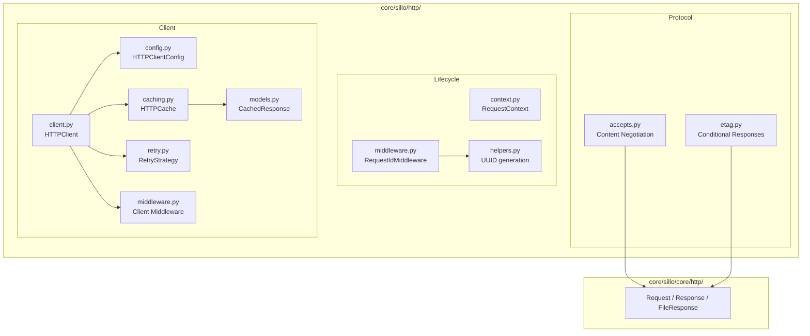
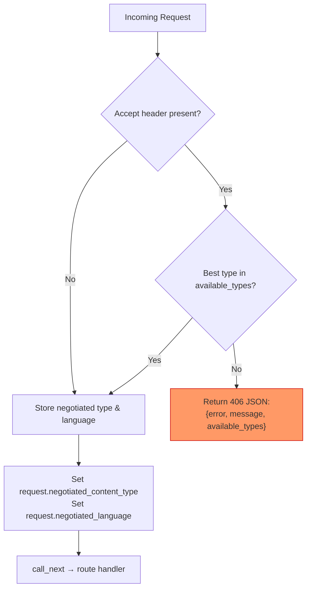
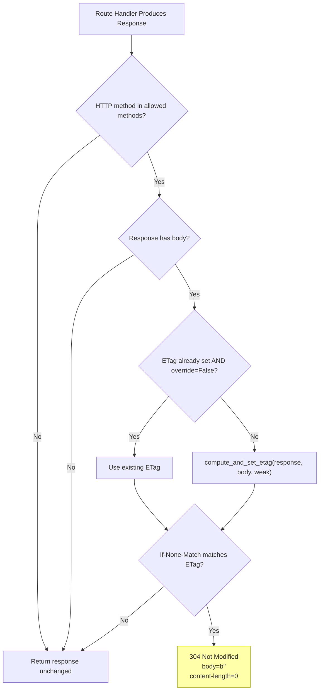
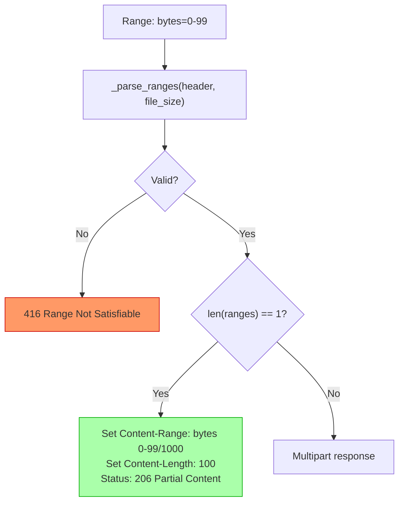
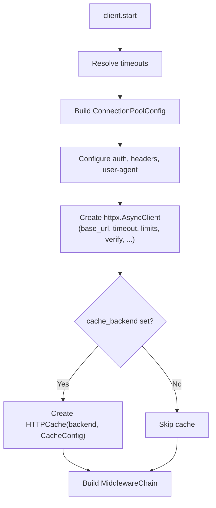
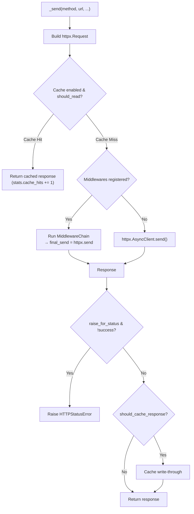
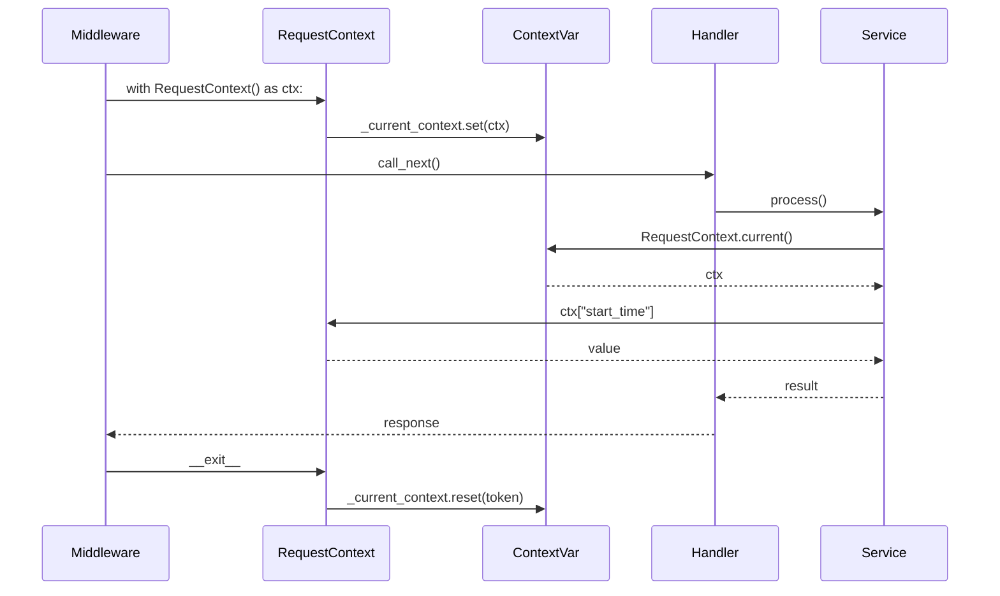

> Internal engineering reference for the sillo HTTP subsystem: content negotiation,
> conditional responses (ETags), range requests, the async HTTP client, request
> context propagation, and request-ID tracing.
>
> **Audience**: sillo core contributors.
> **Scope**: `core/sillo/http/` and `core/sillo/core/http/`.

---

## 1. Overview & Architecture

The sillo HTTP subsystem is split across two trees:

```
core/sillo/core/http/        ← Low-level ASGI primitives (Request, Response, FileResponse)
core/sillo/http/              ← Higher-level protocol logic (accepts, etag, client, lifecycle)
```

The low-level layer owns the wire format, how bytes become an ASGI
`http.response.start`
+ `http.response.body` pair. The higher layer owns **protocol correctness**: content
negotiation per RFC 7231, conditional responses per RFC 7232, range requests per RFC 9110,
and the outbound HTTP client with caching and retry.

### Architectural Diagram



---

## 2. Content Negotiation

**Source**: [`core/sillo/http/accepts.py`](../core/sillo/http/accepts.py)

Content negotiation lets a client declare what media types, languages, charsets, and
encodings it can handle. The server then picks the best match. sillo implements the
full Accept-family per RFC 7231 §5.3.

### 2.1 AcceptItem & AcceptsInfo

`AcceptItem` is the atomic unit, one entry from a parsed Accept-family header:

```python
# core/sillo/http/accepts.py:9
class AcceptItem:
    value: str              # e.g. "text/html", "en-US", "gzip"
    quality: float          # 0.0–1.0, default 1.0
    params: dict[str, str]  # extension params excluding "q"
```

`AcceptsInfo` wraps a request and **lazily** parses all four Accept-family headers
on first property access. It checks `request.state.accepts_parsed` (set by
`AcceptsMiddleware`) before falling back to raw header parsing:

```python
# core/sillo/http/accepts.py:64
class AcceptsInfo:
    def __init__(self, ctx: HttpContext):
        self._parsed_accept = None
        self._parsed_accept_language = None
        self._parsed_accept_charset = None
        self._parsed_accept_encoding = None

    @property
    def accept(self) -> list[AcceptItem]:
        if self._parsed_accept is None:
            cached = getattr(self.request.state, "accepts_parsed", {})
            if cached:
                self._parsed_accept = cached.get("accept", [])
            else:
                self._parsed_accept = parse_accept_header(
                    self.request.headers.get("Accept", "")
                )
        return self._parsed_accept
```

This lazy-check-cached-first pattern repeats for `accept_language`, `accept_charset`,
and `accept_encoding`. The benefit: if `AcceptsMiddleware` already parsed the headers
once, downstream code gets pre-parsed results without re-parsing.

### 2.2 parse_accept_header & q-factor sorting

`parse_accept_header()` is the workhorse. It handles the full grammar:

```
Accept: text/html, application/xhtml+xml, application/xml;q=0.9, */*;q=0.8
```

**Algorithm** (line 290 to 343):

1. Split on `,`
2. For each part, extract `media_range` and parameters
3. Parse `q` parameter → clamp to `[0.0, 1.0]` (invalid → 0.0)
4. Store extension params (non-`q`) in a dict
5. **Sort** by `(-quality, slash_count, -length)`

The sort key is critical:

```python
items.sort(key=lambda x: (-x.quality, x.value.count("/"), -len(x.value)))
```

- **Primary**: highest `q` first (client preference)
- **Secondary**: fewer `/` characters (more specific → `text/html` before `*/*`)
- **Tertiary**: longer string (more specific params)


The same parser is reused for `Accept-Language`, `Accept-Charset`, and `Accept-Encoding`
since their grammar is structurally identical:

```python
# core/sillo/http/accepts.py:346
def parse_accept_language(accept_language: str) -> list[AcceptItem]:
    return parse_accept_header(accept_language)

# core/sillo/http/accepts.py:368
def parse_accept_charset(accept_charset: str) -> list[AcceptItem]:
    return parse_accept_header(accept_charset)

# core/sillo/http/accepts.py:390
def parse_accept_encoding(accept_encoding: str) -> list[AcceptItem]:
    return parse_accept_header(accept_encoding)
```

### 2.3 negotiate_content_type / negotiate_language

`negotiate_content_type()` walks the parsed Accept items in preference order and
returns the first match from the server's available types:

```python
# core/sillo/http/accepts.py:442
def negotiate_content_type(
    accept_header: str, available_types: list[str]
) -> str | None:
    if not accept_header or not available_types:
        return available_types[0] if available_types else None
    accept_items = parse_accept_header(accept_header)
    for accept_item in accept_items:
        if accept_item.quality == 0:       # skip explicitly rejected
            continue
        for available_type in available_types:
            if matches_media_type(accept_item.value, available_type):
                return available_type
    # Wildcard fallback
    for accept_item in accept_items:
        if accept_item.quality == 0:
            continue
        if accept_item.value == "*/*":
            return available_types[0]
        if "/*" in accept_item.value:
            accept_type = accept_item.value.split("/")[0]
            for available_type in available_types:
                if available_type.startswith(accept_type + "/"):
                    return available_type
    return None
```

**Key behaviors**:
- Items with `q=0` are skipped (client explicitly rejects them)
- Empty Accept header → returns `available_types[0]` (server's preference)
- Wildcards (`*/*`, `text/*`) are checked in a second pass after exact matches
- Returns `None` if no match is possible

`negotiate_language()` adds **prefix matching** for language tags:

```python
# core/sillo/http/accepts.py:488
def negotiate_language(
    accept_language: str, available_languages: list[str]
) -> str | None:
    # ...
    for accept_item in accept_items:
        if accept_item.value in available_languages:
            return accept_item.value
        if "-" in accept_item.value:
            lang_prefix = accept_item.value.split("-")[0]
            for available_lang in available_languages:
                if available_lang.startswith(lang_prefix + "-"):
                    return available_lang
                if available_lang == lang_prefix:
                    return available_lang
```

This means `Accept-Language: en-US` will match an available `en` and vice versa.

### 2.4 matches_media_type

The wildcard matching function used throughout negotiation:

```python
# core/sillo/http/accepts.py:412
def matches_media_type(pattern: str, media_type: str) -> bool:
    if pattern == media_type:       # exact: "text/html" == "text/html"
        return True
    if pattern == "*/*":            # universal wildcard
        return True
    if pattern.endswith("/*"):      # type wildcard: "text/*"
        pattern_type = pattern[:-2]
        return media_type.startswith(pattern_type + "/")
    return False
```

| Pattern | `text/html` | `text/css` | `application/json` |
|---------|:-----------:|:----------:|:------------------:|
| `text/html` | ✓ | ✗ | ✗ |
| `text/*` | ✓ | ✓ | ✗ |
| `*/*` | ✓ | ✓ | ✓ |

### 2.5 AcceptsMiddleware

`AcceptsMiddleware` sits in the server middleware pipeline and pre-parses all
Accept-family headers before the route handler runs.

**Source**: [`core/sillo/http/accepts.py:926`](../core/sillo/http/accepts.py)

```python
class AcceptsMiddleware(BaseMiddleware):
    def __init__(
        self,
        *,
        default_content_type: str = "application/json",
        default_language: str = "en",
        default_charset: str = "utf-8",
        set_vary_header: bool = True,
        store_accepts_info: bool = True,
    ): ...
```

**Before `await call_next()`**:
1. Parses all four headers → stores on `ctx.state.accepts` (full dict) and
   `ctx.state.accepts_parsed` (pre-parsed `AcceptItem` lists)
2. Records which Accept headers are present for Vary header generation

**After it returns**:
1. Merges recorded Accept headers into the `Vary` response header
2. If no `Content-Type` is set, negotiates one from the client's Accept header

The factory function `Accepts()` creates a pre-configured instance:

```python
# Usage
app = Sillo()
app.middleware(Accepts(
    default_content_type="application/json",
    set_vary_header=True,
))
```

### 2.6 ContentNegotiationMiddleware

Extends `AcceptsMiddleware` with **active negotiation methods** available to
route handlers:

```python
# core/sillo/http/accepts.py:1129
class ContentNegotiationMiddleware(AcceptsMiddleware):
    def negotiate_content_type(
        self,
        ctx: HttpContext,
        available_types: list[str],
        default_type: str | None = None,
    ) -> str: ...

    def negotiate_language(
        self,
        ctx: HttpContext,
        available_languages: list[str],
        default_language: str | None = None,
    ) -> str: ...
```

Usage in a handler:

```python
from sillo import HttpContext, json, text

@app.get("/data")
async def get_data(ctx: HttpContext):
    # Uses the middleware's negotiate methods
    content_type = middleware.negotiate_content_type(
        ctx,
        ["application/json", "text/csv", "application/xml"]
    )
    if content_type == "text/csv":
        return text(to_csv(data))
    return json(data)
```

### 2.7 StrictContentNegotiationMiddleware (406)

The strictest variant, **rejects** requests when the client cannot accept any
available content type.

**Source**: [`core/sillo/http/accepts.py:1213`](../core/sillo/http/accepts.py)

```python
class StrictContentNegotiationMiddleware(ContentNegotiationMiddleware):
    def __init__(
        self,
        *,
        available_types: list[str],          # REQUIRED
        available_languages: list[str] | None = None,
    ): ...
```

**406 rejection flow** (line 1259 to 1313):



**Critical implementation detail** (line 1292 to 1304):

```python
# The status must be passed TO json() rather than set beforehand:
# json() builds a fresh response, so an earlier status(406) was
# discarded and this shipped a "Not Acceptable" body under a 200.
from sillo import json

return json(
    {
        "error": "Not Acceptable",
        "message": "Client does not accept any available content types",
        "available_types": self.available_types,
    },
    status_code=406,
)
```

The `response.json(status_code=406)` call constructs a brand-new `JSONResponse`
with the correct status baked in. If you called `response.status(406)` first
and then `response.json(data)`, the `json()` method would create a *new*
response at 200, silently discarding the 406. This is a subtle API invariant.

**Downstream access**: when negotiation succeeds, the negotiated values are
stored as dynamic attributes on the request:

```python
ctx.negotiated_content_type = best_type
ctx.negotiated_language = best_language
```

---

## 3. ETags & Conditional Responses

**Source**: [`core/sillo/http/etag.py`](../core/sillo/http/etag.py)

ETags enable **conditional requests**. A client can say "only send me the
resource if it changed since I last fetched it." If nothing changed, the server
responds with **304 Not Modified** and no body, saving bandwidth.

### 3.1 generate_etag_from_bytes

The core ETag generation function:

```python
# core/sillo/http/etag.py:16
_WEAK_PREFIX = "W/"

def generate_etag_from_bytes(data: bytes, weak: bool = True) -> str:
    h = sha1()
    h.update(data)
    tag = f'"{b64encode(h.digest()).decode("utf-8")}"'
    return f"{_WEAK_PREFIX}{tag}" if weak else tag
```

- Uses **SHA-1** for speed (not cryptographic security)
- **Base64 encodes** the digest (not hex) for compactness
- **Weak ETags** (`W/"..."`) by default: semantically equivalent, but allow the
  server to use cached representations that are byte-for-byte different (e.g.
  different compression)

| Parameter | Weak ETag | Strong ETag |
|-----------|-----------|-------------|
| `weak=True` (default) | `W/"abc123..."` |  |
| `weak=False` |  | `"abc123..."` |

### 3.2 normalize_etag / parse_if_none_match / parse_if_match

**Normalization** ensures ETags are always in canonical form:

```python
# core/sillo/http/etag.py:23
def normalize_etag(tag: str) -> str:
    tag = tag.strip()
    if not _ETAG_TOKEN_RE.match(tag):
        if not tag.startswith(_WEAK_PREFIX):
            tag = f'"{tag.strip(chr(34))}"'
        else:
            tag = f'{_WEAK_PREFIX}"{tag[2:].strip().strip(chr(34))}"'
    if not _ETAG_TOKEN_RE.match(tag):
        raise ValueError(f"Invalid ETag token: {tag}")
    return tag
```

The regex `^(W/)?\s*"[^"]*"\s*$` validates the standard ETag format.
Malformed ETags raise `ValueError`.

**Header parsing** handles the `If-None-Match` and `If-Match` comma-separated
lists:

```python
# core/sillo/http/etag.py:47
def parse_if_none_match(ctx: HttpContext) -> list[str]:
    return _parse_etag_list(ctx.headers.get("if-none-match"))

def parse_if_match(ctx: HttpContext) -> list[str]:
    return _parse_etag_list(ctx.headers.get("if-match"))

def _parse_etag_list(value: str | None) -> list[str]:
    if not value:
        return []
    tags: list[str] = []
    for part in value.split(","):
        part = part.strip()
        if not part:
            continue
        try:
            tags.append(normalize_etag(part))
        except ValueError:
            continue   # silently skip malformed ETags
    return tags
```

### 3.3 etag_matches & is_fresh

**Weak comparison** (the default) strips the `W/` prefix before comparing:

```python
# core/sillo/http/etag.py:70
def etag_matches(
    etag: str, candidates: Iterable[str], weak_compare: bool = True
) -> bool:
    def strip_weak(value: str) -> str:
        return value[2:] if value.startswith(_WEAK_PREFIX) else value

    for candidate in candidates:
        normalized_candidate = normalize_etag(candidate)
        if weak_compare:
            if strip_weak(normalized_candidate) == strip_weak(normalized):
                return True
        elif normalized_candidate == normalized:
            return True
    return False
```

| ETag A | ETag B | Weak compare | Strong compare |
|--------|--------|:------------:|:--------------:|
| `W/"abc"` | `W/"abc"` | ✓ | ✓ |
| `W/"abc"` | `"abc"` | ✓ | ✗ |
| `"abc"` | `"abc"` | ✓ | ✓ |
| `"abc"` | `"def"` | ✗ | ✗ |

`is_fresh()` combines ETag matching with request/response:

```python
# core/sillo/http/etag.py:94
def is_fresh(ctx: HttpContext, weak_compare: bool = True) -> bool:
    current = response.headers.get("etag")
    if not current:
        return False
    return etag_matches(
        current, parse_if_none_match(ctx), weak_compare=weak_compare
    )
```

### 3.4 ETagMiddleware (304)

The middleware automates ETag computation and 304 responses:

**Source**: [`core/sillo/http/etag.py:103`](../core/sillo/http/etag.py)

```python
class ETagMiddleware(BaseMiddleware):
    def __init__(
        self,
        *,
        weak: bool = True,
        methods: Iterable[str] = ("GET", "HEAD"),
        override: bool = False,
    ): ...
```

**Response processing flow**:



**Key implementation detail** (`sillo/http/etag.py`, `dispatch`):

```python
from sillo import HttpContext

async def dispatch(self, ctx: HttpContext, call_next):
    response = await call_next()
    ...
    if is_fresh(ctx, response, weak_compare=True):
        return _not_modified(response)
    return response
```

The 304 is a **new response**, not the original one mutated. That is not a
style choice: what arrives here is usually a streaming response replaying the
inner application's body, and `set_body` writes an attribute the streaming path
never reads. Mutating it changed the status to 304 and the length to 0 while
the original body still went out behind the headers — a 304 carrying a body,
declaring a length it does not send, which can desync a keep-alive connection.
Replacing the response outright is the only way to guarantee nothing follows
the headers.

The 304 it returns:
- Carries **no body** (saves bandwidth)
- Still carries the `ETag` header (client can cache it)
- Drops the headers a 304 must not repeat

**Factory function**:

```python
# Usage
app.middleware(ETag(weak=True, methods=("GET", "HEAD")))
```

### 3.5 set_response_etag / compute_and_set_etag

Convenience functions for manual ETag management:

```python
# core/sillo/http/etag.py:35
def set_response_etag(response: BaseResponse, etag: str, override: bool = True) -> None:
    response.set_header("etag", normalize_etag(etag), override=override)

def compute_and_set_etag(
    response: BaseResponse, body: bytes = b"", weak: bool = True, override: bool = False
) -> str:
    tag = generate_etag_from_bytes(body, weak=weak)
    set_response_etag(response, tag, override=override)
    return tag
```

These are used both by `ETagMiddleware` and by `BaseResponse.enable_caching()`:

```python
# core/sillo/core/http/response.py:393
def enable_caching(self, max_age: int = 3600, private: bool = True) -> None:
    cache_control = ["private" if private else "public", f"max-age={max_age}"]
    self.set_header("cache-control", ", ".join(cache_control))
    etag = self._generate_etag()  # SHA-1 based, weak
    self.set_header("etag", etag)
    expires = datetime.now(timezone.utc) + timedelta(seconds=max_age)
    self.set_header("expires", formatdate(expires.timestamp(), usegmt=True))
```

---

## 4. Range Requests

**Source**:
[`core/sillo/core/http/response.py`](../core/sillo/core/http/response.py),
`FileResponse` class

Range requests let clients fetch **parts** of a file (useful for resuming
downloads, streaming video, etc.) per RFC 9110 §14.

### 4.1 FileResponse Architecture

`FileResponse` extends `BaseResponse` and adds:

- Async file streaming via `anyio`
- Range request handling (single, multi, suffix)
- Multipart/byteranges support
- Automatic stat-based ETag and Last-Modified headers

```python
# core/sillo/core/http/response.py:606
class FileResponse(BaseResponse):
    chunk_size = 64 * 1024  # 64KB chunks

    def __init__(self, path, filename=None, ...):
        self.set_header("accept-ranges", "bytes")  # Signal capability
        self._ranges: list[tuple[int, int]] = []
        self._multipart_boundary: str | None = None
```

The `accept-ranges: bytes` header tells clients that range requests are supported.

### 4.2 Single Range

**Request**: `Range: bytes=0-99`

**Flow through `_handle_range_header`** (line 745):



**Single range response** (line 763 to 769):

```python
if len(self._ranges) == 1:
    start, end = self._ranges[0]
    self.set_header(
        "content-range", f"bytes {start}-{end}/{file_size}", override=True
    )
    self.set_header("content-length", str(end - start + 1), override=True)
    return
```

**Sending**: `_send_range()` seeks to `start`, reads `end - start + 1` bytes in
64KB chunks.

### 4.3 Multi Range (multipart/byteranges)

**Request**: `Range: bytes=0-99, 200-299`

When multiple ranges are requested, the response uses `multipart/byteranges`:

```python
# core/sillo/core/http/response.py:776
self._multipart_boundary = self._generate_multipart_boundary()
self.set_header(
    "content-type",
    f"multipart/byteranges; boundary={self._multipart_boundary}",
    override=True,
)
self.set_header(
    "content-length", str(self._multipart_length(file_size)), override=True
)
```

**Body structure**:

```
--boundary_abc123
Content-Type: application/pdf
Content-Range: bytes 0-99/1000

<first 100 bytes>
--boundary_abc123
Content-Type: application/pdf
Content-Range: bytes 200-299/1000

<bytes 200-299>
--boundary_abc123--
```

**Content-Length correctness** is critical for multipart responses. The
declared length must include boundaries, headers, and CRLF delimiters. The
`_multipart_length` method (line 732) counts everything precisely:

```python
def _multipart_length(self, file_size: int) -> int:
    total = len(self._multipart_epilogue())
    for start, end in self._ranges:
        total += len(self._multipart_part_header(start, end, file_size))
        total += end - start + 1
        total += 2  # the CRLF that closes each part body
    return total
```

Without this, the server would write more bytes than declared, tearing the connection.

### 4.4 Suffix Range

**Request**: `Range: bytes=-500` (last 500 bytes)

```python
# core/sillo/core/http/response.py:698
if not first:
    # A suffix range: `bytes=-500` means the *last* 500 bytes
    suffix = int(last)
    if suffix <= 0:
        raise ValueError("Suffix range must be positive")
    start, end = max(0, file_size - suffix), file_size - 1
```

For a 1000-byte file, `bytes=-500` yields `(500, 999)`.

### 4.5 416 Range Not Satisfiable

When the requested range is out of bounds:

```python
# core/sillo/core/http/response.py:712
if start < 0 or start >= file_size or start > end:
    raise ValueError("Unsatisfiable range")
```

The `_handle_range_header` catches this and sets up a 416:

```python
# core/sillo/core/http/response.py:749
except ValueError:
    self._ranges = []
    self.set_header("content-range", f"bytes */{file_size}", override=True)
    self.set_header("content-length", "0", override=True)
    self.status_code = 416
    return
```

The `Content-Range: bytes */{file_size}` header tells the client the total size.

**Response sending** checks for 416 and sends an empty body:

```python
# core/sillo/core/http/response.py:797
if self.status_code == 416:
    await send({"type": "http.response.body", "body": b""})
    return
```

### Range parsing algorithm (`_parse_ranges`)

```python
# core/sillo/core/http/response.py:672
def _parse_ranges(self, range_header: str, file_size: int) -> list[tuple[int, int]]:
    unit, sep, spec = range_header.strip().partition("=")
    if not sep or unit.strip().lower() != "bytes":
        raise ValueError("Only byte ranges are supported")

    ranges: list[tuple[int, int]] = []
    for range_str in spec.split(","):
        first, sep, last = range_str.strip().partition("-")
        if not sep:
            raise ValueError(f"Malformed range {range_str!r}")
        first, last = first.strip(), last.strip()

        if not first:                    # suffix range: "-500"
            suffix = int(last)
            start, end = max(0, file_size - suffix), file_size - 1
        else:
            start = int(first)
            end = file_size - 1 if not last else min(int(last), file_size - 1)

        if start < 0 or start >= file_size or start > end:
            raise ValueError("Unsatisfiable range")
        ranges.append((start, end))

    if not ranges:
        raise ValueError("No ranges given")
    return ranges
```

Key behaviors:
- Only `bytes` unit supported
- An absent `last-byte-pos` means "to end of file" (RFC 9110 §14.1.2)
- `start > end` after clamping → unsatisfiable
- Returns inclusive `(start, end)` pairs

---

## 5. HTTP Client

**Source**: [`core/sillo/http/client/`](../core/sillo/http/client/)

The outbound HTTP client wraps `httpx.AsyncClient` with caching, retry,
middleware, and Pydantic response validation.

### 5.1 HTTPClientConfig

**Source**: [`core/sillo/http/client/config.py`](../core/sillo/http/client/config.py)

A `@dataclass` with all configuration knobs:

```python
@dataclass
class HTTPClientConfig:
    base_url: str = ""
    default_timeout: float = 30.0
    connect_timeout: float | None = None
    read_timeout: float | None = None
    write_timeout: float | None = None
    pool_timeout: float | None = None
    max_connections: int = 50
    max_keepalive_connections: int = 20
    verify_ssl: bool = True
    trust_env: bool = True
    follow_redirects: bool = True
    max_redirects: int = 20
    default_headers: dict[str, str] | None = None
    default_auth: tuple[str, str] | None = None
    retry_strategy: RetryStrategy | None = None
    cache_backend: BaseCache | None = None
    cache_ttl: int = 300
    cache_key_prefix: str | None = None
    cache_tags: list[str] | None = None
    middlewares: list[HTTPMiddleware] = field(default_factory=list)
    raise_for_status: bool = False
    user_agent: str | None = None
```

**Timeout resolution** merges specific overrides with the default:

```python
def resolve_timeout(self) -> dict[str, float]:
    return {
        "connect": self.connect_timeout or self.default_timeout,
        "read": self.read_timeout or self.default_timeout,
        "write": self.write_timeout or self.default_timeout,
        "pool": self.pool_timeout or self.default_timeout,
    }
```

**HTTPClientStats** tracks runtime metrics:

```python
@dataclass
class HTTPClientStats:
    requests_total: int = 0
    requests_success: int = 0
    requests_failed: int = 0
    cache_hits: int = 0
    cache_misses: int = 0
    retries_total: int = 0
```

### 5.2 HTTPClient & httpx.AsyncClient

**Source**: [`core/sillo/http/client/client.py`](../core/sillo/http/client/client.py)

`HTTPClient` is an async context manager that owns an `httpx.AsyncClient`:

```python
class HTTPClient:
    def __init__(self, base_url="", *, config=None, **kwargs):
        if config is None:
            config = HTTPClientConfig(base_url=base_url, **kwargs)
        self._config = config
        self._state = _HTTPClientState()

    async def __aenter__(self) -> Self:
        await self.start()
        return self

    async def __aexit__(self, *exc):
        await self.stop()
```

**`start()` initialization** (line 132 to 186):



**`_send()`, the low-level send** (line 206 to 326):

This is the core method. Every public method (`get`, `post`, etc.) eventually
calls `_send()`:



### 5.3 Cache Read-Through / Write-Through

**Source**: [`core/sillo/http/client/caching.py`](../core/sillo/http/client/caching.py)

The cache subsystem has four components:

| Component | Purpose |
|-----------|---------|
| `CachePolicy` | Enum: `ENABLED`, `DISABLED`, `READ_ONLY`, `WRITE_ONLY` |
| `CacheConfig` | Per-request/per-client cache config (TTL, tags, status codes, methods) |
| `CacheKeyBuilder` | Deterministic SHA-256 key generation from request attributes |
| `HTTPCache` | Wraps a `BaseCache` backend with serialization |

**Cache policies**:

| Policy | Read | Write |
|--------|:----:|:-----:|
| `ENABLED` | ✓ | ✓ |
| `DISABLED` | ✗ | ✗ |
| `READ_ONLY` | ✓ | ✗ |
| `WRITE_ONLY` | ✗ | ✓ |

**Cache key construction** (`CacheKeyBuilder.build`):

```python
parts = [
    ctx.method.upper(),
    str(ctx.url),
]
if include_query and ctx.url.query:
    parts.append(ctx.url.query.decode("utf-8", errors="replace"))
if include_headers and cache_key_headers:
    for header_name in cache_key_headers:
        value = ctx.headers.get(header_name)
        if value:
            parts.append(f"{header_name.lower()}:{value}")
if ctx.content:
    parts.append(sha256(ctx.content).hexdigest()[:16])

key = sha256("|".join(parts).encode("utf-8")).hexdigest()
if prefix:
    key = f"{prefix}:{key}"
```

**Read-through** (in `_send()`):

```python
if state.cache is not None and state.cache.config.should_read_from_cache(ctx):
    cached = await state.cache.get(ctx)
    if cached is not _MISSING:
        state.stats.cache_hits += 1
        return httpx.Response(
            status_code=cached.status_code,
            headers=cached.headers,
            text=cached.body,
            request=request,
        )
    state.stats.cache_misses += 1
```

**Write-through** (in `_send()`):

```python
if state.cache is not None and state.cache.config.should_cache_response(response):
    await state.cache.set(ctx)
```

**CachedResponse** serializes httpx responses for cache storage:

```python
# core/sillo/http/client/models.py:10
class CachedResponse(BaseModel):
    status_code: int
    headers: dict[str, str]
    body: str
    url: str
    method: str
    cached_at: datetime
    ttl: int | None = None
```

### 5.4 Retry Strategy

**Source**: [`core/sillo/http/client/retry.py`](../core/sillo/http/client/retry.py)

```python
@dataclass
class RetryStrategy:
    max_attempts: int = 3
    base_delay: float = 1.0
    max_delay: float = 60.0
    backoff_factor: float = 2.0
    mode: RetryMode = RetryMode.EXPONENTIAL  # EXPONENTIAL | LINEAR | CONSTANT
    jitter: bool = True
    retryable_statuses: set[int] = {408, 429, 500, 502, 503, 504}
    retryable_exceptions: tuple = (ConnectionError, TimeoutError)
    max_retry_duration: float = 0.0
```

**Delay computation** (`compute_delay`):

```python
def compute_delay(self, attempt: int) -> float:
    if self.mode == RetryMode.CONSTANT:
        delay = self.base_delay
    elif self.mode == RetryMode.LINEAR:
        delay = min(self.base_delay * (attempt + 1), self.max_delay)
    else:  # EXPONENTIAL
        delay = min(self.base_delay * (self.backoff_factor ** attempt), self.max_delay)

    if self.jitter:
        delay = random.uniform(0, delay)
    return delay
```

| Attempt | Exponential (base=1, factor=2) | Linear | Constant |
|---------|:-----------------------------:|:------:|:--------:|
| 0 | 1.0s | 1.0s | 1.0s |
| 1 | 2.0s | 2.0s | 1.0s |
| 2 | 4.0s | 3.0s | 1.0s |
| 3 | 8.0s | 4.0s | 1.0s |

With `jitter=True`, each delay is randomized to `[0, computed_delay]` to prevent
thundering herd effects.

**Integration in `request()`** (line 330 to 419):

```python
if retry_strategy is not None:
    from sillo.helpers.retry import retry as sillo_retry

    @sillo_retry(**retry_kwargs)
    async def _send_with_retry(*a, **kw) -> httpx.Response:
        resp = await _send(*a, **kw)
        if not resp.is_success and retry_strategy.should_retry_for_status(resp.status_code):
            raise HTTPStatusError(...)  # triggers retry
        return resp

    response = await _send_with_retry(method, url, **kwargs)
```

### 5.5 Client Middleware Pipeline

**Source**: [`core/sillo/http/client/middleware.py`](../core/sillo/http/client/middleware.py)

The client-side middleware chain wraps the final `httpx.send` call:

```python
from sillo import HttpContext

class HTTPMiddleware(abc.ABC):
    @abc.abstractmethod
    async def handle(
        self,
        ctx: HttpContext,
        next_call: NextCall,
    ) -> AsyncGenerator[BaseResponse, None]: ...
```

Built-in middleware:

| Middleware | Purpose |
|-----------|---------|
| `LoggingMiddleware` | Logs method, URL, status, duration |
| `HeaderInjectionMiddleware` | Injects headers into every request |
| `BaseURLMiddleware` | Prepends base URL to relative URLs |

The `MiddlewareChain` builds a recursive chain where each middleware wraps the next:

```python
from sillo import HttpContext

class MiddlewareChain:
    async def run(self, ctx: HttpContext, final_send):
        async def _build_chain(index):
            if index >= len(self._middlewares):
                return final_send
            middleware = self._middlewares[index]
            next_middleware = await _build_chain(index + 1)
            async def _chain(req):
                async for response in middleware.handle(req, next_middleware):
                    yield response
            return _chain
        entry_point = await _build_chain(0)
        async for response in entry_point(ctx):
            yield response
```

### 5.6 Response Validation

**Source**: [`core/sillo/http/client/models.py`](../core/sillo/http/client/models.py)

```python
class ResponseValidator:
    @staticmethod
    def validate(
        response_body: str,
        response_model: type[BaseModel] | None = None,
        *,
        many: bool = False,
        strict: bool = False,
    ) -> Any:
```

Usage:

```python
class User(BaseModel):
    id: int
    name: str

async with HTTPClient("https://api.example.com") as client:
    user = await client.get("/users/1", response_model=User)
    # user is a validated User instance

    users = await client.get("/users", response_model=User, many=True)
    # users is a list[User]
```

---

## 6. RequestContext & RequestIdMiddleware

### 6.1 RequestContext (ContextVar)

**Source**: [`core/sillo/http/lifecycle/context.py`](../core/sillo/http/lifecycle/context.py)

`RequestContext` provides **request-scoped storage** accessible anywhere in the
async task tree, using Python's `contextvars.ContextVar`:

```python
_current_context: ContextVar[RequestContext | None] = ContextVar(
    "_sillo_request_ctx", default=None
)

class RequestContext:
    def __init__(self):
        self._data: dict[str, Any] = {}
        self._token = None

    @classmethod
    def current(cls) -> RequestContext | None:
        return _current_context.get()

    def __enter__(self) -> Self:
        self._token = _current_context.set(self)
        return self

    def __exit__(self, *args):
        _current_context.reset(self._token)
```

**Dict-like interface**: `__getitem__`, `__setitem__`, `__delitem__`, `__contains__`,
`get`, `set`.

**Usage pattern**:

```python
with RequestContext() as ctx:
    ctx["start_time"] = time.monotonic()
    ctx["user_id"] = current_user.id

    # Deep in the call stack, without passing ctx through every function:
    elapsed = time.monotonic() - RequestContext.current()["start_time"]
```

**ContextVar semantics**:
- Each async task gets its own copy (no cross-task leakage)
- Nested contexts are supported: `__exit__` restores the previous token
- `None` when no request is active (outside a request lifecycle)



### 6.2 RequestIdMiddleware

**Source**: [`core/sillo/http/lifecycle/middleware.py`](../core/sillo/http/lifecycle/middleware.py)

Generates, stores, and propagates request IDs for distributed tracing.

```python
class RequestIdMiddleware(BaseMiddleware):
    def __init__(
        self,
        *,
        header_name: str = "X-Request-ID",
        force_generate: bool = False,
        store_in_request: bool = True,
        request_attribute_name: str = "request_id",
        include_in_response: bool = True,
    ): ...
```

**The whole flow, in one hook**:

```python
from sillo import HttpContext

async def dispatch(self, ctx: HttpContext, call_next):
    if self.force_generate:
        request_id = generate_request_id()       # Always fresh UUID4
    else:
        request_id = get_request_id_from_header(ctx, self.header_name)
        if not request_id:
            request_id = get_or_generate_request_id(ctx, self.header_name)
    self.request_id = request_id

    if self.store_in_request:
        store_request_id_in_request(ctx, request_id, self.request_attribute_name)

    response = await call_next()

    # After the chain, so the header survives anything downstream set.
    if response is not None and request_id and self.include_in_response:
        if not response.headers.get(self.header_name):
            set_request_id_header(response, request_id, self.header_name)

    return response
```

The ID is resolved on the way in — so anything downstream can read it off
`ctx.state` — and stamped on the way out, where it cannot be overwritten by a
handler that built its own response.

**Helper functions** (`core/sillo/http/lifecycle/helpers.py`):

| Function | Purpose |
|----------|---------|
| `generate_request_id()` | `uuid.uuid4()` → lowercase string |
| `get_request_id_from_header()` | Read from `request.headers` |
| `get_or_generate_request_id()` | Read or fallback to UUID4 |
| `set_request_id_header()` | Write to `response.headers` |
| `store_request_id_in_request()` | Write to `request.state` |
| `get_request_id_from_request()` | Read from `request.state` |
| `validate_request_id()` | Check UUID format |

**Factory function**:

```python
# Usage
app.middleware(RequestId(
    header_name="X-Request-ID",
    force_generate=False,       # Trust client-supplied IDs
    include_in_response=True,   # Echo back to client
))
```

---

## 7. Cross-Cutting Concerns

### 7.1 Vary Header Management

The `Vary` header tells caches which request headers affect the response.
`AcceptsMiddleware` automatically tracks which Accept-family headers are present
and sets `Vary` accordingly.

```python
# core/sillo/http/accepts.py:679
def create_vary_header(existing_vary: str | None, new_fields: list[str]) -> str:
    if not existing_vary:
        return ", ".join(new_fields)
    existing_fields = [field.strip() for field in existing_vary.split(",")]
    for field in new_fields:
        if field not in existing_fields:
            existing_fields.append(field)
    return ", ".join(existing_fields)
```

**Example**: if a request carries `Accept` and `Accept-Language`, the response
gets `Vary: Accept, Accept-Language`.

### 7.2 Cache-Control Integration

`BaseResponse` provides two convenience methods:

```python
# Enable caching
from sillo import json

return json(data).enable_caching(max_age=3600, private=True)
# Sets: Cache-Control, ETag, Expires

# Disable caching
return json(data).disable_caching()
# Sets: Cache-Control: no-store, no-cache, must-revalidate, max-age=0
#       Pragma: no-cache
#       Expires: 0
```

`FileResponse` generates stat-based ETags for cache validation:

```python
# core/sillo/core/http/response.py:643
def set_stat_headers(self, stat_result):
    etag_base = str(stat_result.st_mtime) + "-" + str(stat_result.st_size)
    etag = f'"{hashlib.md5(etag_base.encode(), usedforsecurity=False).hexdigest()}"'
    # ...
    self.headers.setdefault("etag", etag)
```

This means a file's ETag changes when either its modification time or size changes.

---

## 8. Testing Guidance

### Content Negotiation

```python
from sillo.http.accepts import (
    parse_accept_header,
    negotiate_content_type,
    matches_media_type,
    AcceptsInfo,
)

# Parse and sort
items = parse_accept_header("text/html, application/json;q=0.9, */*;q=0.5")
assert items[0].value == "text/html"
assert items[0].quality == 1.0
assert items[1].value == "application/json"
assert items[1].quality == 0.9

# Wildcard matching
assert matches_media_type("*/*", "text/html")
assert matches_media_type("text/*", "text/html")
assert not matches_media_type("text/*", "application/json")

# Negotiation
best = negotiate_content_type(
    "application/json, text/html;q=0.9",
    ["text/html", "application/json"]
)
assert best == "application/json"

# 406 scenario
best = negotiate_content_type(
    "application/xml",
    ["text/html", "application/json"]
)
assert best is None
```

### ETags

```python
from sillo.http.etag import (
    generate_etag_from_bytes,
    normalize_etag,
    etag_matches,
)

# Generation
tag = generate_etag_from_bytes(b"hello", weak=True)
assert tag.startswith('W/"')

# Matching
assert etag_matches('W/"abc"', ['"abc"'], weak_compare=True)
assert not etag_matches('"abc"', ['"def"'])

# Normalization
assert normalize_etag('abc') == '"abc"'
assert normalize_etag('W/"abc"') == 'W/"abc"'
```

### Range Requests

```python
# Test _parse_ranges through FileResponse
from pathlib import Path
from sillo.core.http.response import FileResponse

resp = FileResponse("/tmp/test.bin")
# Simulate: file is 1000 bytes
ranges = resp._parse_ranges("bytes=0-99,200-299", 1000)
assert ranges == [(0, 99), (200, 299)]

# Suffix range
ranges = resp._parse_ranges("bytes=-500", 1000)
assert ranges == [(500, 999)]

# Unsatisfiable
try:
    resp._parse_ranges("bytes=2000-3000", 1000)
    assert False, "Should raise ValueError"
except ValueError:
    pass
```

### HTTP Client

```python
from sillo.http.client import HTTPClient
from sillo.http.client.config import HTTPClientConfig
from sillo.http.client.retry import RetryStrategy, RetryMode

# Basic usage
async with HTTPClient("https://api.example.com") as client:
    data = await client.get("/users")

# With cache and retry
config = HTTPClientConfig(
    base_url="https://api.example.com",
    cache_backend=memory_cache,
    cache_ttl=60,
    retry_strategy=RetryStrategy(
        max_attempts=3,
        mode=RetryMode.EXPONENTIAL,
        jitter=True,
    ),
)
async with HTTPClient(config=config) as client:
    user = await client.get("/users/1", response_model=User)
```

---

## 9. Source File Index

| File | Lines | Purpose |
|------|:-----:|---------|
| `core/sillo/http/accepts.py` | 1313 | Content negotiation (AcceptItem, AcceptsInfo, parsers, negotiators, middleware) |
| `core/sillo/http/etag.py` | 175 | ETag generation, normalization, matching, ETagMiddleware |
| `core/sillo/core/http/response.py` | 1000+ | FileResponse with range request handling (single/multi/suffix/416) |
| `core/sillo/http/client/client.py` | 579 | HTTPClient (httpx wrapper, cache read/write, retry integration) |
| `core/sillo/http/client/config.py` | 119 | HTTPClientConfig, HTTPClientStats dataclasses |
| `core/sillo/http/client/caching.py` | 201 | CachePolicy, CacheConfig, CacheKeyBuilder, HTTPCache |
| `core/sillo/http/client/retry.py` | 81 | RetryMode enum, RetryStrategy dataclass |
| `core/sillo/http/client/middleware.py` | 135 | HTTPMiddleware ABC, MiddlewareChain, built-in middleware |
| `core/sillo/http/client/models.py` | 120 | CachedResponse (Pydantic), ResponseValidator |
| `core/sillo/http/lifecycle/context.py` | 248 | RequestContext (ContextVar-backed dict-like scope) |
| `core/sillo/http/lifecycle/middleware.py` | 205 | RequestIdMiddleware (UUID generation & propagation) |
| `core/sillo/http/lifecycle/helpers.py` | 183 | Request ID helper functions |
