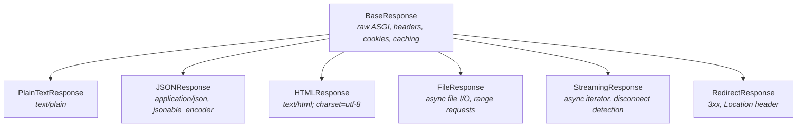
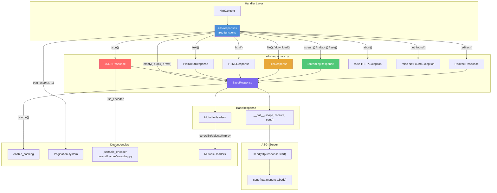
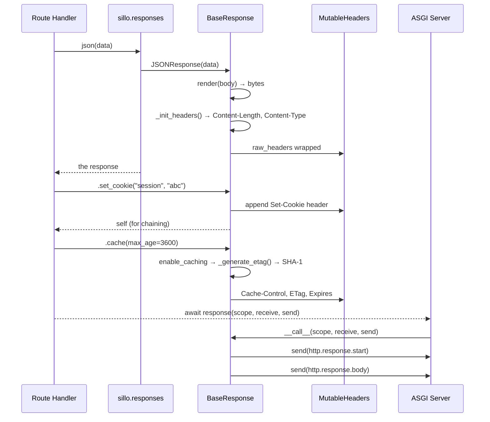
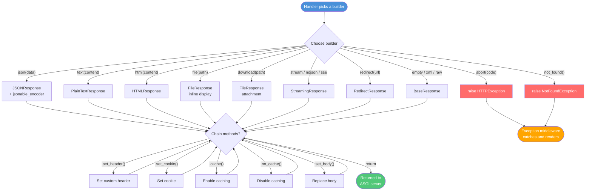
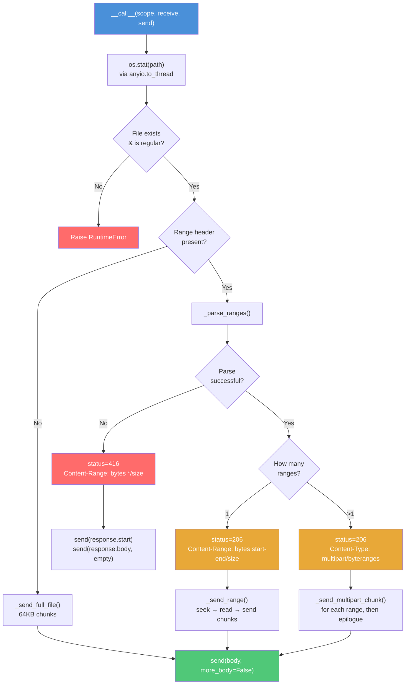
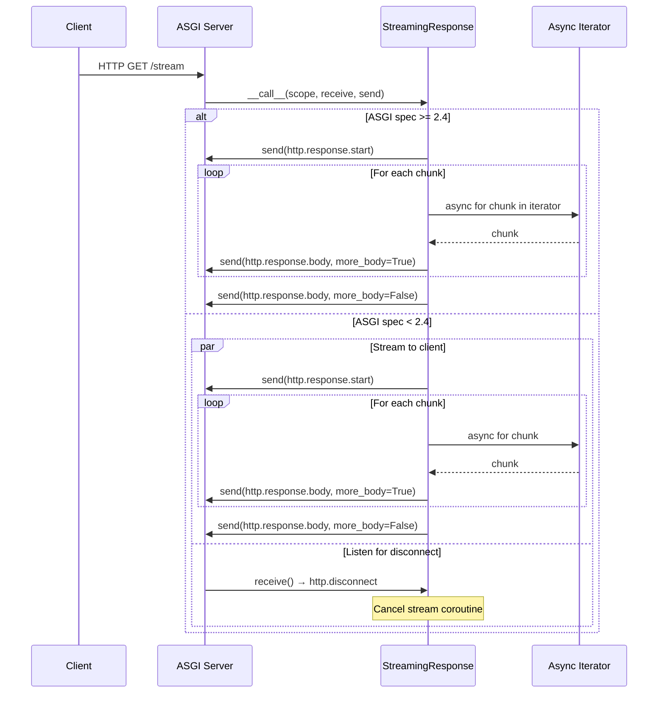
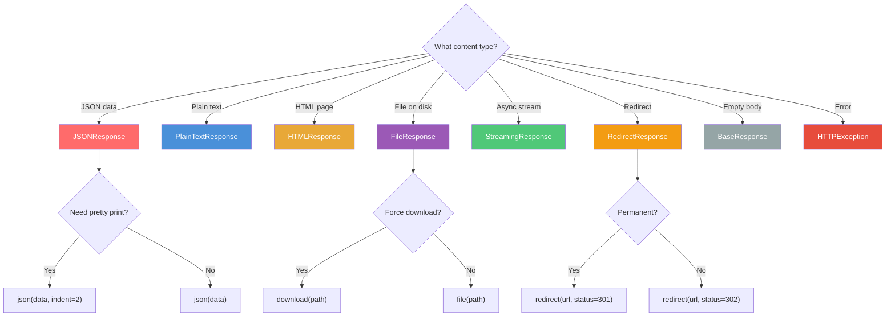

> **Module**: `core/sillo/core/http/response.py`
> **Related**: `core/sillo/objects/http.py` (MutableHeaders), `core/sillo/core/encoding.py` (jsonable_encoder), `core/sillo/exceptions.py` (HTTPException, NotFoundException), `core/sillo/pagination.py` (Paginator, strategies)
> **Owner**: Core HTTP team
> **Last updated**: 2026-08-11

---

## 1. Overview

The sillo HTTP response system is a layered architecture built on top of the
ASGI (`Asynchronous Server Gateway Interface`) protocol. Every response in
sillo is an **ASGI application**: it implements the `__call__(scope, receive,
send)` triple that ASGI servers (Uvicorn, Hypercorn, Daphne) expect.

The hierarchy is intentionally shallow:



On top of these, **`sillo.responses`** provides one free function per response
shape — `json()`, `text()`, `html()`, `xml()`, `raw()`, `empty()`, `created()`,
`accepted()`, `no_content()`, `redirect()` and its named variants, `file()`,
`download()`, `stream()`, `ndjson()`, `sse()`, `paginate()`, `apaginate()`,
`abort()`, `not_found()`. Each constructs one of the classes above and returns
it; the chainable methods live on the returned response, not on a builder that
wraps it.

**Key design principles:**

- **ASGI-native**: Every response is a callable `(scope, receive, send)` coroutine.
- **Headers as byte tuples**: `raw_headers: list[tuple[bytes, bytes]]` is the
  canonical storage: matches the ASGI spec's header format directly.
- **Lazy MutableHeaders**: The `headers` property wraps `raw_headers` in a
  `MutableHeaders` view (from `core/sillo/objects/http.py`) for dict-style access.
- **Content-Length discipline**: `set_body()` always re-syncs `Content-Length`.
  The header is skipped for 1xx, 204, and 304 responses (RFC 9110 §6.4.1).

---

## 2. Architecture Diagram



---

## 3. BaseResponse: The Foundation

> **Source**: `core/sillo/core/http/response.py`, lines 119 to 533

`BaseResponse` is the root of the response hierarchy. It handles:

- Body rendering (`render()`)
- Header management (`raw_headers`, `_init_headers()`, `headers` property)
- Cookie management (`set_cookie()`, `delete_cookie()`)
- Caching (`enable_caching()`, `disable_caching()`)
- ASGI compliance (`__call__()`)

### 3.1 Construction & `__init__`

```python
# core/sillo/core/http/response.py:158-188
class BaseResponse:
    def __init__(
        self,
        body: JSONType | Any = "",
        status_code: int = 200,
        headers: dict[str, str] | None = None,
        content_type: str | None = None,
    ):
        self.charset = "utf-8"
        self.status_code: int = status_code
        self.raw_headers: list[tuple[bytes, bytes]] = []
        self._body = self.render(body)
        self.content_type: str | None = content_type
        self._init_headers(headers)
```

**Initialization order matters:**

1. `self._body = self.render(body)`: converts the body to bytes first.
2. `self._init_headers(headers)`: reads `self._body` to compute
   `Content-Length`.

This order means `_init_headers` can always access a valid `_body` to compute
the length. Reversing it would produce a `Content-Length` of 0 for non-empty bodies.

**Attributes:**

| Attribute | Type | Description |
|-----------|------|-------------|
| `charset` | `str` | Encoding for text content (default `"utf-8"`) |
| `status_code` | `int` | HTTP status code |
| `raw_headers` | `list[tuple[bytes, bytes]]` | Headers in ASGI wire format |
| `_body` | `bytes \| memoryview` | Rendered body content |
| `content_type` | `str \| None` | Content-Type value (before charset injection) |

### 3.2 STATUS_CODES

```python
# core/sillo/core/http/response.py:144-156
STATUS_CODES: ClassVar[dict] = {
    200: "OK",
    201: "Created",
    204: "No Content",
    301: "Moved Permanently",
    302: "Found",
    304: "Not Modified",
    400: "Bad Request",
    401: "Unauthorized",
    403: "Forbidden",
    404: "Not Found",
    500: "Internal Server Error",
}
```

> **Note**: This is a convenience map, not authoritative. Sillo does **not** look
> up status phrases during response construction, the ASGI server (Uvicorn, etc.)
> adds the reason phrase from its own table if it sends HTTP/1.1 status lines.

### 3.3 `render()`: Body Serialization

```python
# core/sillo/core/http/response.py:190-214
def render(self, content: typing.Any) -> bytes | memoryview:
    if content is None:
        return b""
    if isinstance(content, (bytes, memoryview)):
        return content
    return content.encode(self.charset)
```

**Behavior matrix:**

| Input type | Output | Notes |
|-----------|--------|-------|
| `None` | `b""` | Empty body |
| `bytes` | pass-through | Zero-copy for binary data |
| `memoryview` | pass-through | Zero-copy for buffer protocol objects |
| `str` | encoded bytes | Uses `self.charset` (default UTF-8) |

The `memoryview` pass-through is important for `FileResponse` when serving chunks
that may come from `mmap`-backed buffers.

### 3.4 `_init_headers()`: Header Bootstrap

```python
# core/sillo/core/http/response.py:216-269
def _init_headers(self, headers: dict[str, str] | None = None):
```

**Algorithm:**

1. Convert user-supplied `headers` dict to `[(key.lower().encode("latin-1"), value.encode("latin-1")), ...]`.
2. Check if `content-length` and `content-type` are already present.
3. If `content-length` is missing and the status code allows a body (not 1xx, 204, 304): compute from `len(self._body)`.
4. If `content-type` is missing and `self.content_type` is set: append charset for `text/*` types.
5. Append all user headers.

**Critical detail, charset injection:**

```python
if content_type.startswith("text/") and "charset=" not in content_type.lower():
    content_type += "; charset=" + self.charset
```

This means `HTMLResponse` can set `content_type="text/html; charset=utf-8"` to
avoid the automatic charset suffix, or leave it bare (`"text/html"`) and let
`_init_headers` add it. Both paths produce the same result.

### 3.5 `headers` Property (MutableHeaders)

```python
# core/sillo/core/http/response.py:271-288
@property
def headers(self) -> MutableHeaders:
    if not hasattr(self, "_headers"):
        self._headers = MutableHeaders(raw=self.raw_headers)
    return self._headers
```

The `MutableHeaders` class (from `core/sillo/objects/http.py`, line 437) wraps
`raw_headers` with dict-style access:

```python
response.headers["x-custom"] = "value"   # set
del response.headers["x-custom"]         # delete
"x-custom" in response.headers           # check
```

**Important**: The `MutableHeaders` instance holds a **reference** to `self.raw_headers`.
This means edits through `response.headers` and direct `set_header()` calls
modify the **same list**. The ASGI `send()` reads `self.raw_headers` directly.

> **Cache trap**: The `MutableHeaders` is cached in `self._headers`. If you
> replace `self.raw_headers` with a new list (e.g., via `set_headers(..., override_all=True)`),
> the cached `_headers` becomes an orphan. The `set_header()` method avoids this
> by editing `self.raw_headers[:]` in-place (line 502).

### 3.6 `set_header()` / `set_headers()` / `remove_header()`

```python
# core/sillo/core/http/response.py:483-532
def set_header(self, key: str, value: str, override: bool = False) -> BaseResponse:
    key_bytes = key.lower().encode("latin-1")
    value_bytes = value.encode("latin-1")
    new_header = (key_bytes, value_bytes)

    if override:
        # Edit in place to preserve MutableHeaders cache binding
        self.raw_headers[:] = [
            (k, v) for k, v in self.raw_headers if k != key_bytes
        ]

    self.raw_headers.append(new_header)
    return self
```

**`override` parameter**:

- `override=False` (default): Appends the header, allowing duplicates.
- `override=True`: Removes all existing entries with the same key, then appends.

> **Renamed**: this shipped as `overide`, one `r` short. The misspelling
> still works as a keyword and raises a `DeprecationWarning`; it will be
> removed in a future release. Callers who passed the flag positionally
> were never affected.

**`set_headers()`** is a batch variant:

```python
def set_headers(self, headers: dict[str, str], override_all: bool = False):
    if override_all:
        self.raw_headers[:] = [
            (k.lower().encode("latin-1"), v.encode("latin-1"))
            for k, v in headers.items()
        ]
        return
    for key, value in headers.items():
        self.set_header(key, value)
```

> **Warning**: `override_all=True` replaces the **entire** header list. This
> discards Content-Type, Content-Length, and any cookies. Use with caution.

**`remove_header()`** delegates to `MutableHeaders.__delitem__`:

```python
def remove_header(self, key: str):
    del self.headers[key]
```

### 3.7 `set_body()`: Late Body Replacement

```python
# core/sillo/core/http/response.py:460-475
def set_body(self, content: typing.Any) -> BaseResponse:
    self._body = self.render(content)
    self.set_header("content-length", str(len(self._body)), override=True)
    return self
```

Use this when you need to replace the body **after** construction (e.g. in
middleware). It keeps `Content-Length` in sync. Without `set_body()`, a direct
`self._body = ...` assignment would leave the stale `Content-Length` from the
original body. The ASGI server would then send fewer or more bytes than
declared, causing connection resets.

**Returns `self`** for chaining: `response.set_body(new_body).set_header(...)`.

### 3.8 `set_cookie()` / `delete_cookie()`

```python
# core/sillo/core/http/response.py:290-391
def set_cookie(
    self,
    key: str,
    value: str = "",
    max_age: int | None = None,
    expires: datetime | str | int | None = None,
    path: str | None = "/",
    domain: str | None = None,
    secure: bool | None = False,
    httponly: bool | None = False,
    samesite: typing.Literal["lax", "strict", "none"] | None = "lax",
) -> Any:
```

**Cookie attribute precedence:**

- `max_age` takes precedence over `expires` when both are set (browsers honor `Max-Age` first).
- `expires` accepts `datetime`, `int` (Unix timestamp), or `str` (HTTP date).
- `datetime` objects are formatted via `email.utils.format_datetime(usegmt=True)`.
- `samesite` is validated with an assertion: raises `AssertionError` for
  invalid values.

**Implementation detail**: Uses `http.cookies.SimpleCookie` to build the header value, then calls
`cookie.output(header="").strip()` to get the raw `key=value; attr=val; ...` string.

```python
# Example: setting a session cookie
from sillo import json

response = json({"ok": True})
response.set_cookie(
    key="session_id",
    value="abc123",
    max_age=3600,
    httponly=True,
    secure=True,
    samesite="strict"
)
# Produces: Set-Cookie: session_id=abc123; Max-Age=3600; Path=/; Secure; HttpOnly; SameSite=strict
```

**`delete_cookie()`** sets `max_age=0` and `expires=0`, effectively expiring the
cookie in the past:

```python
def delete_cookie(self, key: str, path: str = "/", domain: str | None = None) -> Any:
    cookie = self.set_cookie(
        key=key, value="", max_age=0, expires=0, path=path, domain=domain
    )
    return cookie
```

### 3.9 `enable_caching()` / `disable_caching()`

```python
# core/sillo/core/http/response.py:393-436
def enable_caching(self, max_age: int = 3600, private: bool = True) -> None:
    cache_control: list[str] = []
    if private:
        cache_control.append("private")
    else:
        cache_control.append("public")
    cache_control.append(f"max-age={max_age}")
    self.set_header("cache-control", ", ".join(cache_control))

    etag = self._generate_etag()
    self.set_header("etag", etag)

    expires = datetime.now(timezone.utc) + timedelta(seconds=max_age)
    self.set_header("expires", formatdate(expires.timestamp(), usegmt=True))
```

**`enable_caching()` sets three headers:**

| Header | Value | Purpose |
|--------|-------|---------|
| `Cache-Control` | `private, max-age=3600` | Browser-only caching (default) or `public` for CDN |
| `ETag` | `W/"<sha1-base64>"` | Weak ETag for conditional requests |
| `Expires` | RFC 2822 date | Legacy HTTP/1.0 cache expiry |

The ETag is a **weak** ETag (`W/"..."`) because it is based on the response
body bytes, semantically equivalent but byte-identical responses from different
servers might have different ETags.

```python
# core/sillo/core/http/response.py:477-481
def _generate_etag(self) -> str:
    content_hash = sha1()
    content_hash.update(self._body)
    return f'W/"{b64encode(content_hash.digest()).decode("utf-8")}"'
```

**`disable_caching()`** sets the nuclear no-cache headers:

```python
def disable_caching(self) -> None:
    self.set_header("cache-control", "no-store, no-cache, must-revalidate, max-age=0")
    self.set_header("pragma", "no-cache")      # HTTP/1.0 backward compat
    self.set_header("expires", "0")             # Immediate expiry
```

### 3.10 ASGI `__call__()` Protocol

```python
# core/sillo/core/http/response.py:438-453
async def __call__(self, scope: Scope, receive: Receive, send: Send) -> None:
    await send({
        "type": "http.response.start",
        "status": self.status_code,
        "headers": self.raw_headers,
    })
    await send({
        "type": "http.response.body",
        "body": self._body,
    })
```

This is the **ASGI response protocol** (ASGI spec §6.2):

1. **`http.response.start`**: Sent once. Contains status code and headers.
2. **`http.response.body`**: Sent once (or multiple times for streaming). Contains the body.

For `BaseResponse`, the body is sent in a single chunk. Subclasses override this
for streaming behavior:

- **`FileResponse`**: Sends the body in 64 KB chunks with `more_body=True`.
- **`StreamingResponse`**: Iterates an async generator, sending each chunk.

**Type aliases used throughout:**

```python
# core/sillo/core/http/response.py:44-48
Scope = typing.MutableMapping[str, typing.Any]
Message = typing.MutableMapping[str, typing.Any]
Receive = typing.Callable[[], typing.Awaitable[Message]]
Send = typing.Callable[[Message], typing.Awaitable[None]]
```

---

## 4. PlainTextResponse

> **Source**: `core/sillo/core/http/response.py`, lines 535 to 543

```python
class PlainTextResponse(BaseResponse):
    def __init__(
        self,
        body: JSONType = "",
        status_code: int = 200,
        headers: dict[str, str] | None = None,
        content_type: str = "text/plain",
    ):
        super().__init__(body, status_code, headers, content_type)
```

The simplest subclass. It just sets `content_type="text/plain"`, which causes
`_init_headers()` to inject the charset automatically:

```
Content-Type: text/plain; charset=utf-8
```

**Usage via the builder:**

```python
from sillo import text

return text("Hello, World!")
```

---

## 5. JSONResponse

> **Source**: `core/sillo/core/http/response.py`, lines 546 to 584

```python
class JSONResponse(BaseResponse):
    def __init__(
        self,
        content: Any,
        status_code: int = 200,
        headers: dict[str, str] | None = None,
        indent: int | None = None,
        ensure_ascii: bool = True,
        use_encoder: bool = True,
        custom_encoder: dict[type, Callable[[Any], Any]] | None = None,
    ):
```

### 5.1 jsonable_encoder Integration

When `use_encoder=True` (the default), content is pre-processed through
`jsonable_encoder` from `core/sillo/core/encoding.py` before `json.dumps()`:

```python
if use_encoder:
    from sillo.core.encoding import jsonable_encoder
    content = jsonable_encoder(content, custom_encoder=custom_encoder)
```

The `jsonable_encoder` handles:

- **Pydantic models** → `.model_dump()` (v2) or `.dict()` (v1)
- **datetime / date / time** → ISO 8601 strings
- **UUID** → string representation
- **Decimal** → float
- **Enum** → `.value`
- **Path / PurePath** → string
- **IPv4/IPv6 addresses** → string
- **SecretStr / SecretBytes** → masked value
- **Generators** → list
- **Dataclasses** → `dataclasses.asdict()`

### 5.2 Custom Encoders

```python
from decimal import Decimal
from sillo import json

json(
    data,
    custom_encoder={Decimal: lambda d: round(float(d), 2)}
)
```

Custom encoders are merged on top of the global encoder registry. They are
applied **only** to the current response. They do not modify the global state.

### 5.3 Error Handling

```python
try:
    body = json.dumps(content, indent=indent, ensure_ascii=ensure_ascii,
                      allow_nan=False, default=str)
except (TypeError, ValueError) as e:
    raise ValueError(f"Content is not JSON serializable: {e!s}")
```

- `allow_nan=False`: Prevents `NaN`/`Infinity` in JSON (invalid per RFC 7159).
- `default=str`: Last-resort fallback for non-serializable types.

**Output Content-Type**: `application/json` (no charset. JSON is defined as
UTF-8 by RFC 8259).

---

## 6. HTMLResponse

> **Source**: `core/sillo/core/http/response.py`, lines 587 to 603

```python
class HTMLResponse(BaseResponse):
    def __init__(
        self,
        content: str | JSONType,
        status_code: int = 200,
        headers: dict[str, str] | None = None,
    ):
        super().__init__(
            body=content,
            status_code=status_code,
            headers=headers,
            content_type="text/html; charset=utf-8",
        )
```

Explicitly sets `charset=utf-8` in the content type string, bypassing the
automatic charset injection in `_init_headers()`.

---

## 7. FileResponse: Async Streaming & Range Requests

> **Source**: `core/sillo/core/http/response.py`, lines 606 to 922

`FileResponse` is the most complex response type. It supports:

- **Async file I/O** via `anyio.open_file()` (works with both `asyncio` and `trio`)
- **Range requests** (RFC 9110 §14.4): single range, multi-range, suffix range
- **Multipart byte ranges** for multi-range responses
- **Stat-based headers** (ETag, Last-Modified, Content-Length)

### 7.1 Construction & MIME Detection

```python
# core/sillo/core/http/response.py:614-641
class FileResponse(BaseResponse):
    chunk_size = 64 * 1024  # 64KB chunks

    def __init__(
        self,
        path: str | Path,
        filename: str | None = None,
        status_code: int = 200,
        headers: dict[str, str] | None = None,
        content_disposition_type: str = "inline",
    ):
        super().__init__(headers=headers)
        self.path = Path(path)
        self.filename = filename or self.path.name
        self.content_disposition_type = content_disposition_type
        self.status_code = status_code

        content_type, _ = mimetypes.guess_type(str(self.path))
        self.media_type = content_type or "application/octet-stream"
        self.set_header("content-type", self.media_type)
        self.set_header(
            "content-disposition",
            f'{content_disposition_type}; filename="{self.filename}"',
        )
        self.set_header("accept-ranges", "bytes")
```

**Key attributes:**

| Attribute | Description |
|-----------|-------------|
| `path` | `Path` object for the file on disk |
| `filename` | Name sent in `Content-Disposition` (defaults to `path.name`) |
| `media_type` | MIME type (guessed from extension, fallback `application/octet-stream`) |
| `content_disposition_type` | `"inline"` (display in browser) or `"attachment"` (force download) |
| `chunk_size` | 64 KB class variable for streaming chunk size |
| `_ranges` | Parsed range tuples for the current request |
| `_multipart_boundary` | Boundary string for multi-range responses |

**Content-Disposition modes:**

- `inline`: Browser attempts to display the file (PDFs, images).
- `attachment`: Browser prompts download.

### 7.2 Stat Headers (ETag, Last-Modified)

```python
# core/sillo/core/http/response.py:643-651
def set_stat_headers(self, stat_result: os.stat_result) -> None:
    content_length = str(stat_result.st_size)
    last_modified = formatdate(stat_result.st_mtime, usegmt=True)
    etag_base = str(stat_result.st_mtime) + "-" + str(stat_result.st_size)
    etag = f'"{hashlib.md5(etag_base.encode(), usedforsecurity=False).hexdigest()}"'

    self.set_header("content-length", content_length, override=True)
    self.headers.setdefault("last-modified", last_modified)
    self.headers.setdefault("etag", etag)
```

The ETag for `FileResponse` is a **strong** ETag (not weak), derived from
`mtime + size`. This allows conditional requests (`If-None-Match`, `If-Modified-Since`)
to work correctly for range requests where the client may have a partial download.

### 7.3 ASGI `__call__` Lifecycle

```python
# core/sillo/core/http/response.py:653-670
async def __call__(self, scope: Scope, receive: Receive, send: Send) -> None:
    try:
        stat_result = await anyio.to_thread.run_sync(os.stat, self.path)
        self.set_stat_headers(stat_result)
    except FileNotFoundError:
        raise RuntimeError(f"File at path {self.path} does not exist.")
    else:
        mode = stat_result.st_mode
        if not stat.S_ISREG(mode):
            raise RuntimeError(f"File at path {self.path} is not a file.")

    range_header = MutableHeaders(scope=scope).get("Range")
    if range_header:
        self._handle_range_header(range_header)

    await self._send_response(scope, receive, send)
```

**Sequence:**

1. **Stat the file** (offloaded to a thread via `anyio.to_thread.run_sync`).
2. **Validate** the path exists and is a regular file.
3. **Parse the `Range` header** if present.
4. **Send the response** (full file, single range, or multi-range).

### 7.4 Range Request Parsing (`_parse_ranges`)

```python
# core/sillo/core/http/response.py:672-718
def _parse_ranges(self, range_header: str, file_size: int) -> list[tuple[int, int]]:
    unit, sep, spec = range_header.strip().partition("=")
    if not sep or unit.strip().lower() != "bytes":
        raise ValueError("Only byte ranges are supported")

    ranges: list[tuple[int, int]] = []
    for range_str in spec.split(","):
        first, sep, last = range_str.strip().partition("-")
        if not sep:
            raise ValueError(f"Malformed range {range_str!r}")
        first, last = first.strip(), last.strip()

        if not first:
            # Suffix range: bytes=-500 → last 500 bytes
            suffix = int(last)
            if suffix <= 0:
                raise ValueError("Suffix range must be positive")
            start, end = max(0, file_size - suffix), file_size - 1
        else:
            start = int(first)
            end = file_size - 1 if not last else min(int(last), file_size - 1)

        if start < 0 or start >= file_size or start > end:
            raise ValueError("Unsatisfiable range")
        ranges.append((start, end))

    if not ranges:
        raise ValueError("No ranges given")
    return ranges
```

**Supported range formats:**

| Format | Example | Meaning |
|--------|---------|---------|
| `bytes=0-99` | First 100 bytes | `[0, 99]` inclusive |
| `bytes=100-` | From byte 100 to end | `[100, file_size - 1]` |
| `bytes=-500` | Last 500 bytes (suffix) | `[file_size - 500, file_size - 1]` |
| `bytes=0-99,200-299` | Multi-range | Two separate ranges |

**Clamping behavior**: If the client requests `bytes=0-9999` on a 500-byte file,
the end is clamped to `min(9999, 499) = 499`. This avoids a 416 error for
over-reaching end positions (RFC 9110 §14.1.2).

### 7.5 Single Range Response (206)

```python
# core/sillo/core/http/response.py:761-769
if len(self._ranges) == 1:
    start, end = self._ranges[0]
    self.set_header(
        "content-range", f"bytes {start}-{end}/{file_size}", override=True
    )
    self.set_header("content-length", str(end - start + 1), override=True)
    return
```

**Response headers for a single range:**

```
HTTP/1.1 206 Partial Content
Content-Type: video/mp4
Content-Range: bytes 0-999/50000
Content-Length: 1000
Accept-Ranges: bytes
```

### 7.6 Multi-Range / Multipart Response

When the client requests multiple ranges (e.g., `bytes=0-99,200-299`), the
response uses `multipart/byteranges`:

```python
# core/sillo/core/http/response.py:776-784
self._multipart_boundary = self._generate_multipart_boundary()
self.set_header(
    "content-type",
    f"multipart/byteranges; boundary={self._multipart_boundary}",
    override=True,
)
self.set_header(
    "content-length", str(self._multipart_length(file_size)), override=True
)
```

**Multipart body structure:**

```
--boundary_abc123
Content-Type: video/mp4
Content-Range: bytes 0-99/50000

<100 bytes of data>
--boundary_abc123
Content-Type: video/mp4
Content-Range: bytes 200-299/50000

<100 bytes of data>
--boundary_abc123--
```

**Content-Length calculation** is precise. It counts the exact bytes that will
be sent, including boundaries, headers, and CRLF separators:

```python
# core/sillo/core/http/response.py:732-743
def _multipart_length(self, file_size: int) -> int:
    total = len(self._multipart_epilogue())
    for start, end in self._ranges:
        total += len(self._multipart_part_header(start, end, file_size))
        total += end - start + 1
        total += 2  # the CRLF that closes each part body
    return total
```

### 7.7 416 Range Not Satisfiable

```python
# core/sillo/core/http/response.py:745-759
def _handle_range_header(self, range_header: str) -> None:
    file_size = self.path.stat().st_size
    try:
        self._ranges = self._parse_ranges(range_header, file_size)
    except ValueError:
        self._ranges = []
        self.set_header("content-range", f"bytes */{file_size}", override=True)
        self.set_header("content-length", "0", override=True)
        self.status_code = 416
        return
```

**When 416 is returned:**

- The `Range` header is malformed or the unit is not `bytes`.
- All requested ranges are unsatisfiable (e.g., `bytes=1000-2000` on a 500-byte file).
- The suffix range is zero or negative (`bytes=-0`).

The `Content-Range: bytes */500` header tells the client the total file size so
it can construct a valid range request.

### 7.8 Async File Streaming with AnyIO

```python
# core/sillo/core/http/response.py:824-843
async def _send_full_file(self, file: AsyncFile[bytes], send: Send) -> None:
    while True:
        chunk = await file.read(self.chunk_size)
        if not chunk:
            break
        await send({
            "type": "http.response.body",
            "body": chunk,
            "more_body": True,
        })
    await send({
        "type": "http.response.body",
        "body": b"",
        "more_body": False,
    })
```

**AnyIO** is the key abstraction. It allows the same code to run under both
`asyncio` and `trio` event loops. `anyio.open_file()` returns an `AsyncFile`
that yields to the event loop on each `read()`.

**Chunking**: 64 KB is the default (`chunk_size = 64 * 1024`). This balances:
- Memory usage (no full file buffered in memory)
- System call overhead (not one syscall per byte)
- Kernel buffer efficiency (aligns with common page/cache sizes)

---

## 8. StreamingResponse

> **Source**: `core/sillo/core/http/response.py`, lines 924 to 988

```python
class StreamingResponse(BaseResponse):
    def __init__(
        self,
        content: AsyncIterator[str | bytes],
        status_code: int = 200,
        headers: dict[str, str] | None = None,
        content_type: str = "text/plain",
    ):
        super().__init__(headers=headers)
        self.content_iterator = content
        self.status_code = status_code
        self._cookies: list[tuple[str, str, dict[str, Any]]] = []
        self.content_type = content_type
        self.headers["content-type"] = self.content_type
        del self.headers["content-length"]  # No fixed length for streams
```

**Critical detail**: `Content-Length` is **deleted** from headers. For streaming
responses, the total body size is unknown at construction time. The ASGI server
falls back to `Transfer-Encoding: chunked` for HTTP/1.1, or closes the connection
to signal the end of the body for HTTP/1.0.

### 8.1 ASGI Spec Version Detection

```python
# core/sillo/core/http/response.py:968-988
async def __call__(self, scope: Scope, receive: Receive, send: Send) -> None:
    spec_version = tuple(
        map(int, scope.get("asgi", {}).get("spec_version", "2.0").split("."))
    )

    if spec_version >= (2, 4):
        try:
            await self.stream_response(send)
        except OSError:
            raise ClientDisconnect()
    else:
        async with anyio.create_task_group() as task_group:
            async def wrap(func):
                await func()
                task_group.cancel_scope.cancel()

            task_group.start_soon(wrap, partial(self.stream_response, send))
            await wrap(partial(self.listen_for_disconnect, receive))
```

**Why the version check?**

- **ASGI spec >= 2.4**: The server guarantees that `OSError` is raised on
  `send()` if the client disconnects. Simple try/except is sufficient.
- **ASGI spec < 2.4**: The server does **not** raise on `send()` after disconnect.
  We must run a concurrent listener (`listen_for_disconnect`) that polls `receive()`
  for `http.disconnect` messages.

The `wrap` helper is a clever cancellation pattern: whichever coroutine finishes
first (streaming or disconnect detection) cancels the task group, which aborts
the other.

### 8.2 Disconnect Detection

```python
# core/sillo/core/http/response.py:946-950
async def listen_for_disconnect(self, receive: Receive) -> None:
    while True:
        message = await receive()
        if message["type"] == "http.disconnect":
            break
```

This is a blocking loop that awaits `http.disconnect` from the ASGI server. When
the client drops the TCP connection, the server pushes this message type.

**Raises `ClientDisconnect`** (from `core/sillo/core/http/context.py`, line 100)
on `OSError` during `send()` for spec >= 2.4.

---

## 9. RedirectResponse

> **Source**: `core/sillo/core/http/response.py`, lines 991 to 1008

```python
class RedirectResponse(BaseResponse):
    def __init__(
        self,
        url: str,
        status_code: int = 302,
        headers: dict[str, str] = {},
    ):
        if not 300 <= status_code < 400:
            raise ValueError("Status code must be a valid redirect status")

        headers["location"] = quote(str(url), safe=":/%#?=@[]!$&'()*+,;")

        super().__init__(body="", status_code=status_code, headers=headers)
```

**Key behaviors:**

- Status code must be 300 to 399. Raises `ValueError` otherwise.
- The `Location` header is URL-encoded via `urllib.parse.quote()` with a safe
  set that preserves common URL characters.
- Body is always empty: browsers follow the redirect without rendering it.

**Common status codes:**

| Code | Constant | Meaning |
|------|----------|---------|
| 301 | Moved Permanently | Permanent redirect (SEO transfer) |
| 302 | Found | Temporary redirect (default) |
| 303 | See Other | POST → GET redirect |
| 307 | Temporary Redirect | Preserves HTTP method |
| 308 | Permanent Redirect | Preserves HTTP method + permanent |

---

## 10. `sillo.responses`: The Builders

> **Source**: `core/sillo/responses.py`

The classes above are the machinery. What a handler actually calls is a free
function in `sillo.responses`, one per response shape. Each constructs the right
subclass and returns it:

```python
def json(data, *, status_code=200, headers=None, indent=None,
         ensure_ascii=True, use_encoder=True, custom_encoder=None) -> JSONResponse:
    return JSONResponse(
        content=data, status_code=status_code, headers=headers,
        indent=indent, ensure_ascii=ensure_ascii,
        use_encoder=use_encoder, custom_encoder=custom_encoder,
    )
```

Every name is re-exported from the root package, so `from sillo import json`
and `from sillo.responses import json` bind the same object.

### 10.1 The full surface

| Group | Builders |
|---|---|
| bodies | `json` `text` `html` `xml` `raw` `empty` |
| status shorthands | `created` `accepted` `no_content` |
| redirects | `redirect` `permanent_redirect` `see_other` `temporary_redirect` |
| files | `file` `download` |
| streaming | `stream` `ndjson` `sse` |
| pagination | `paginate` `apaginate` |
| stopping early | `abort` `not_found` |

`paginate` and `apaginate` are the only two that take the context, and they take
it first — they read the requested page off `ctx.query_params` and build the
next/previous links from `ctx.url`. `abort` and `not_found` raise rather than
returning, so the exception middleware renders them.

### 10.2 No request binding

Nothing here is bound to a request. A builder is a plain function from
arguments to a response, which is what makes them importable anywhere,
testable without a request, and safe to call from a middleware, a background
task, or an exception handler.

The one thing that binding used to buy was `redirect(name=...)`, which needed
the request's scope to resolve a route name into a URL. That is now two calls,
with the lookup where the routing information already lives:

```python
from sillo import redirect

return redirect(ctx.url_for("user_profile", user_id=42))
```

### 10.3 Chaining

Every builder returns a `BaseResponse` subclass, and the mutating methods on
that class each `return self`. So the chain reads body-first:

```python
from sillo import HttpContext, json

@app.post("/login")
async def login(ctx: HttpContext):
    user = await authenticate(ctx)
    if not user:
        return json({"error": "Invalid credentials"}, status_code=401)

    token = issue_token(user)
    return (
        json({"message": "Login successful"})
        .set_cookie("auth_token", token, httponly=True, secure=True)
        .set_header("X-User-ID", str(user.id))
        .cache(max_age=0)      # Never cache login responses
    )
```

The chainable half of `BaseResponse`: `status`, `set_header`, `set_headers`,
`remove_header`, `remove_headers`, `set_cookie`, `set_cookies`,
`set_permanent_cookie`, `delete_cookie`, `set_body`, `cache` / `enable_caching`,
`no_cache` / `disable_caching`, `add_csp_header`. Plus `has_header` and
`content_length`, which read rather than write.

Most builders also accept `status_code=` and `headers=` directly, which is
shorter when that is the whole of it.

---

## 11. Exception Types

> **Source**: `core/sillo/core/http/response.py`, lines 53 to 117

### MalformedRangeHeader

```python
class MalformedRangeHeader(Exception):
    def __init__(self, content: str = "Malformed range header.") -> None:
        self.content = content
```

Raised when a `Range` header cannot be parsed at all (e.g., missing `=` sign,
non-`bytes` unit).

### RangeNotSatisfiable

```python
class RangeNotSatisfiable(Exception):
    def __init__(self, max_size: int) -> None:
        self.max_size = max_size
```

Raised when the requested range exceeds the file bounds. Carries `max_size`
for constructing the `Content-Range: bytes */{max_size}` response header.

> **Note**: In the current implementation, `_parse_ranges()` raises `ValueError`
> instead of these custom exceptions. The `_handle_range_header()` method catches
> `ValueError` and sets status 416 directly. These exception classes exist for
> external use and future refactoring.

---

## 12. Response Lifecycle Diagram



---

## 13. Builder Flow Diagram



---

## 14. FileResponse Range Request Flow



---

## 15. StreamingResponse ASGI Flow



---

## 16. Code Examples

### 16.1 Simple JSON API

```python
# core/sillo/core/http/response.py — BaseResponse class docstring example
@app.get("/users")
async def get_users(ctx: HttpContext):
    users = await get_all_users()
    return json(users)
```

### 16.2 JSON with Pretty-Print (Debugging)

```python
from sillo import HttpContext, json

@app.get("/debug/config")
async def debug_config(ctx: HttpContext):
    config = await load_config()
    return json(config, indent=2, ensure_ascii=False)
```

### 16.3 Cached JSON Response

```python
from sillo import HttpContext

@app.get("/static-data")
async def get_static_data(ctx: HttpContext):
    data = await get_expensive_computation()
    return (response
        .json(data)
        .cache(max_age=3600, private=False))  # Public CDN cache for 1 hour
```

### 16.4 File Download with Custom Filename

```python
from sillo import HttpContext, download

@app.get("/reports/{report_id}")
async def download_report(ctx: HttpContext):
    report_id = ctx.path_params["report_id"]
    report = await db.get_report(report_id)
    return download(
        f"/data/reports/{report.filename}",
        filename=f"report-{report_id}.pdf"
    )
```

### 16.5 Streaming SSE (Server-Sent Events)

```python
from sillo import HttpContext, stream

@app.get("/events")
async def event_stream(ctx: HttpContext):
    async def generate():
        while True:
            event = await get_next_event()
            yield f"data: {json.dumps(event)}\n\n"

    return stream(generate(), content_type="text/event-stream")
```

### 16.6 Redirect Chain

```python
from sillo import HttpContext, redirect

@app.post("/old-endpoint")
async def old_endpoint(ctx: HttpContext):
    return redirect("/new-endpoint", status_code=301)

@app.get("/profile")
async def profile_redirect(ctx: HttpContext):
    user = await get_current_user(ctx)
    return redirect(name="user_profile", user_id=user.id)
```

### 16.7 Authentication with Cookies

```python
from sillo import HttpContext, json

@app.post("/login")
async def login(ctx: HttpContext):
    data = await ctx.json
    user = await authenticate(data["username"], data["password"])

    if user:
        token = generate_jwt_token(user)
        return (response
            .json({"message": "Login successful", "user": user.to_dict()})
            .set_cookie("auth_token", token,
                        max_age=3600,
                        httponly=True,
                        secure=True,
                        samesite="strict")
            .set_header("X-User-ID", str(user.id)))
    else:
        return json({"error": "Invalid credentials"}, status_code=401)
```

### 16.8 Paginated List Endpoint

```python
from sillo import HttpContext, paginate

@app.get("/articles")
async def list_articles(ctx: HttpContext):
    articles = await db.get_articles()
    return paginate(ctx, 
        articles,
        strategy="page_number",
        page_size=20,
        max_page_size=100,
    )
```

### 16.9 Abort with Error

```python
from sillo import HttpContext, empty, abort

@app.delete("/admin/users/{user_id}")
async def delete_user(ctx: HttpContext):
    if not ctx.user.is_admin:
        abort(403, detail="Admins only")

    user_id = ctx.path_params["user_id"]
    await db.delete_user(user_id)
    return empty(status_code=204)
```

### 16.10 Direct BaseResponse Usage (No Builder)

```python
from sillo.core.http.response import JSONResponse, FileResponse

# Direct ASGI app usage
async def my_asgi_handler(scope, receive, send):
    response = JSONResponse(
        content={"status": "ok"},
        status_code=200,
        headers={"X-Custom": "value"},
    )
    response.set_cookie("session", "abc123")
    await response(scope, receive, send)
```

---

## 17. Testing Patterns

### 17.1 Testing BaseResponse Headers

```python
def test_base_response_content_type():
    response = BaseResponse(body="hello", content_type="text/plain")
    assert response.status_code == 200
    assert b"text/plain" in response.raw_headers[0][1]
    assert response._body == b"hello"
```

### 17.2 Testing JSONResponse Serialization

```python
def test_json_response_with_datetime():
    from datetime import datetime, timezone
    data = {"created": datetime(2026, 1, 1, tzinfo=timezone.utc)}
    response = JSONResponse(content=data)
    assert b"2026-01-01" in response._body
```

### 17.3 Testing Cookie Setting

```python
def test_set_cookie_attributes():
    response = BaseResponse()
    response.set_cookie("session", "abc", max_age=3600, httponly=True, secure=True)
    cookie_header = dict(response.raw_headers).get(b"set-cookie", b"").decode()
    assert "session=abc" in cookie_header
    assert "httponly" in cookie_header.lower()
    assert "secure" in cookie_header.lower()
```

### 17.4 Testing Range Parsing

```python
def test_parse_single_range():
    response = FileResponse("/tmp/test.bin")  # 1000 bytes
    ranges = response._parse_ranges("bytes=0-99", file_size=1000)
    assert ranges == [(0, 99)]

def test_parse_suffix_range():
    response = FileResponse("/tmp/test.bin")
    ranges = response._parse_ranges("bytes=-500", file_size=1000)
    assert ranges == [(500, 999)]

def test_parse_multi_range():
    response = FileResponse("/tmp/test.bin")
    ranges = response._parse_ranges("bytes=0-99,200-299", file_size=1000)
    assert ranges == [(0, 99), (200, 299)]
```

### 17.5 Testing ASGI Call

```python
import pytest

@pytest.mark.anyio
async def test_base_response_asgi_call():
    response = PlainTextResponse("Hello, World!")
    scope = {"type": "http"}
    messages = []

    async def receive():
        return {"type": "http.request"}

    async def send(message):
        messages.append(message)

    await response(scope, receive, send)

    assert messages[0]["type"] == "http.response.start"
    assert messages[0]["status"] == 200
    assert messages[1]["type"] == "http.response.body"
    assert messages[1]["body"] == b"Hello, World!"
```

---

## 18. Performance Notes

### 18.1 Header Storage

Headers are stored as `list[tuple[bytes, bytes]]` (the ASGI native format).
This avoids conversion during `send()`. The ASGI server receives headers in
exactly the format it expects.

### 18.2 FileResponse Chunking

The 64 KB chunk size (`chunk_size = 64 * 1024`) is tuned for:
- **Memory**: A single chunk fits in L2 cache on most CPUs.
- **Syscall**: Reduces the number of `read()` / `send()` calls.
- **Kernel buffers**: Aligns with typical TCP window sizes.

### 18.3 jsonable_encoder Overhead

When `use_encoder=True` (default), every JSON response passes through
`jsonable_encoder()` which recursively walks the data structure. For simple
dict/list responses, this is negligible. For deeply nested Pydantic models,
consider `use_encoder=False` if you know the data is already serializable.

### 18.4 MutableHeaders Caching

The `headers` property lazily creates a `MutableHeaders` instance and caches
it. If you modify `raw_headers` directly (e.g., via `set_header(override=True)`),
the cached `MutableHeaders` sees the changes because it holds a reference to
the same list. However, replacing `raw_headers` entirely (e.g., `self.raw_headers = [...]`)
breaks the cache binding.

### 18.5 FileResponse Stat Call

The `os.stat()` call in `FileResponse.__call__()` is offloaded to a thread pool
via `anyio.to_thread.run_sync()`. This prevents blocking the event loop for
filesystem I/O, which matters when the file is on a network filesystem (NFS,
SMB, FUSE).

---

## 19. Common Pitfalls

### 19.1 Forgetting `Content-Length` After `set_body()`

```python
from sillo import text

response = text("original")

# WRONG: Direct assignment leaves stale Content-Length
response._body = b"new body"

# CORRECT: Use set_body() which re-syncs Content-Length
response.set_body(b"new body")
```

### 19.2 Using Mutable Headers After `set_headers(..., override_all=True)`

```python
from sillo import json

response = json({"ok": True})

# DANGEROUS: This replaces the entire header list,
# orphaning the cached MutableHeaders
response.set_headers({"new-header": "value"}, override_all=True)

# Later edits through response.headers won't reach the wire:
response.headers["another"] = "broken"  # Writes to orphaned list
```

### 19.3 StreamingResponse and Content-Length

```python
# WRONG: StreamingResponse deletes Content-Length in __init__
# Do not try to set it back — the total size is unknown
response = StreamingResponse(iterator)
response.headers["content-length"] = "1000"  # Will be wrong if stream is shorter/longer
```

### 19.4 FileResponse Path Validation

FileResponse does **not** validate the path exists in `__init__()`. It defers
to `__call__()`. This means you can construct a `FileResponse` for a
nonexistent file; the `RuntimeError` is only raised when the ASGI server calls
it.

### 19.5 Redirect Status Codes

```python
# WRONG: 200 is not a redirect
RedirectResponse(url="/new", status_code=200)  # raises ValueError

# CORRECT: Use 300-399
RedirectResponse(url="/new", status_code=302)
```

### 19.6 `abort()` Does Not Return

```python
# WRONG: Trying to chain after abort()
from sillo import abort

abort(403).set_header(...)  # TypeError — abort() returns NoReturn

# CORRECT: abort() raises immediately
abort(403, detail="Forbidden")
```

### 19.7 Cookie SameSite Assertion

```python
from sillo import json

response = json({"ok": True})

# WRONG: Invalid samesite value raises AssertionError
response.set_cookie("key", "val", samesite="invalid")  # AssertionError

# CORRECT: Use "lax", "strict", or "none"
response.set_cookie("key", "val", samesite="strict")
```

---

## 20. Cross-References

| Module | File Path | Relationship |
|--------|-----------|-------------|
| `MutableHeaders` | `core/sillo/objects/http.py:437` | Wraps `raw_headers` for dict-style access |
| `Headers` | `core/sillo/objects/http.py` | Immutable base class for `MutableHeaders` |
| `HttpContext` | `core/sillo/core/http/context.py` | The handler's input; responses are returned, not injected |
| `ClientDisconnect` | `core/sillo/core/http/context.py:100` | Raised on client disconnect in `StreamingResponse` |
| `jsonable_encoder` | `core/sillo/core/encoding.py` | Pre-processes content for `JSONResponse` |
| `HTTPException` | `core/sillo/exceptions.py:15` | Raised by `abort()` |
| `NotFoundException` | `core/sillo/exceptions.py:118` | Raised by `not_found()` |
| `Pagination` | `core/sillo/pagination.py` | Used by `paginate()` / `apaginate()` |
| `PageNumberPagination` | `core/sillo/pagination.py` | Strategy for page-based pagination |
| `LimitOffsetPagination` | `core/sillo/pagination.py` | Strategy for limit/offset pagination |
| `CursorPagination` | `core/sillo/pagination.py` | Strategy for cursor-based pagination |
| `SyncPaginator` | `core/sillo/pagination.py` | Synchronous paginator wrapper |
| `AsyncPaginator` | `core/sillo/pagination.py` | Asynchronous paginator wrapper |

---

## Appendix A: Response Class Selection Guide



## Appendix B: ASGI Message Types

The response system uses two ASGI message types:

### `http.response.start`

```python
{
    "type": "http.response.start",
    "status": 200,                    # HTTP status code
    "headers": [                      # List of (name, value) byte tuples
        (b"content-type", b"application/json"),
        (b"content-length", b"42"),
    ],
}
```

### `http.response.body`

```python
{
    "type": "http.response.body",
    "body": b'{"message": "Hello"}',  # bytes or memoryview
    "more_body": False,               # True if more chunks follow
}
```

## Appendix C: Header Encoding

All headers are encoded as **Latin-1** bytes (ISO 8859-1). This is required by
the ASGI spec and matches HTTP/1.1's default encoding for header values.

```python
key_bytes = key.lower().encode("latin-1")
value_bytes = value.encode("latin-1")
```

Header names are always lowercased for case-insensitive comparison. HTTP/2
requires lowercase header names (pseudo-headers like `:status` are lowercase
by definition), so this normalization is forward-compatible.

---

*End of document. Total lines: ~1100+.*
