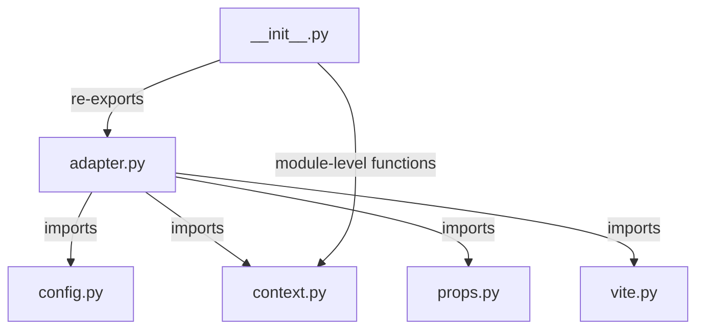
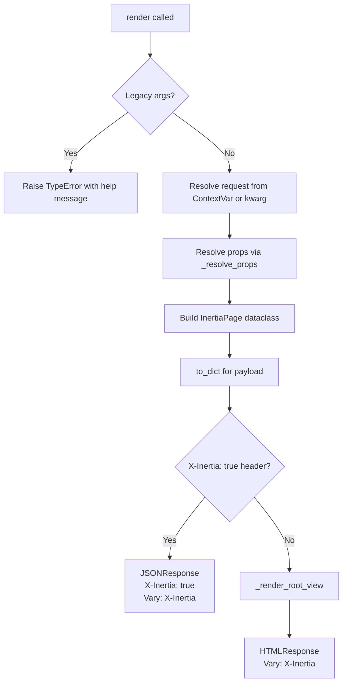
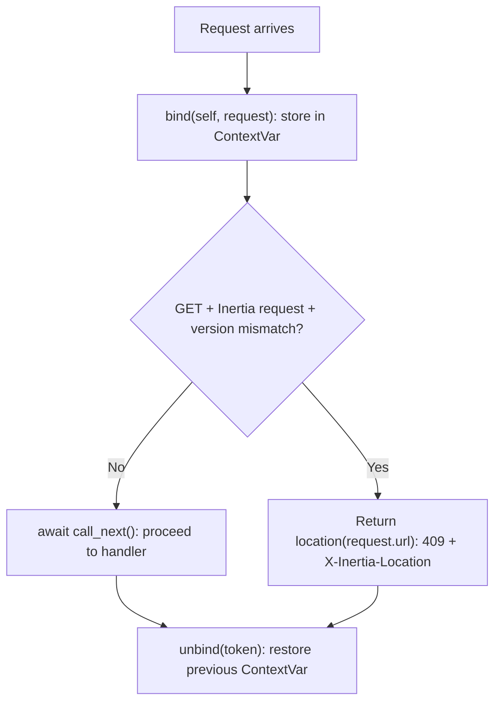
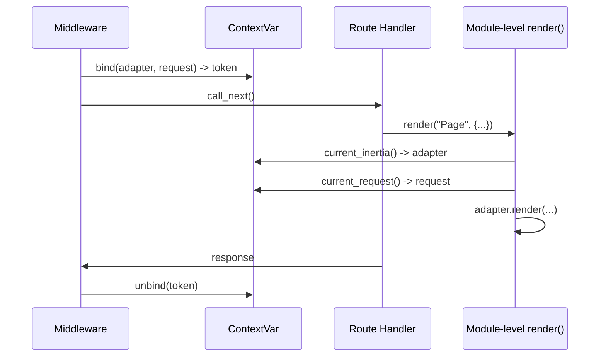
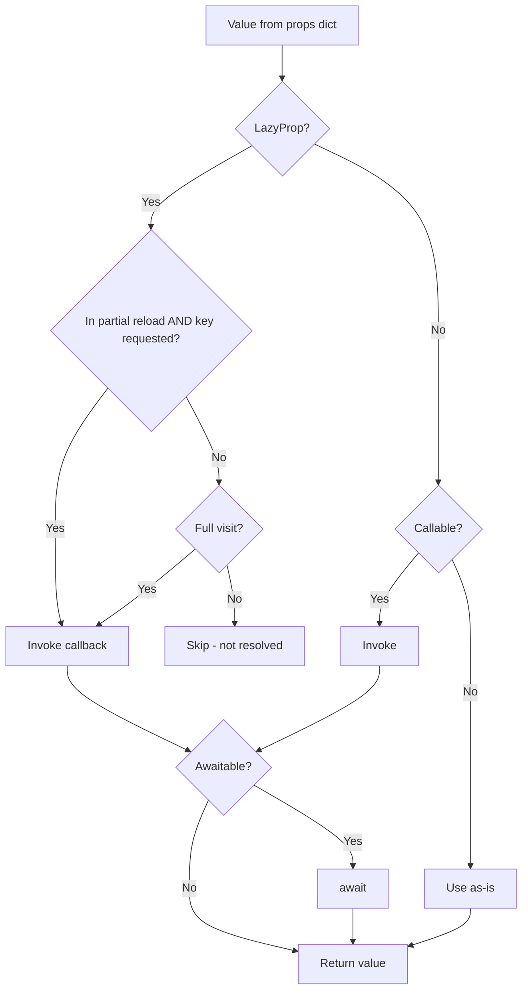
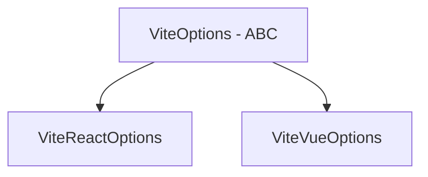

> **Package**: `sillo-inertia` v0.0.1a4
> **Repository**: https://github.com/sillohq/inertia
> **Source root**: `inertia/sillo_inertia/`
> **Tests**: `inertia/tests/test_inertia.py`

---

## 1. Overview

`sillo-inertia` is an Inertia.js adapter for Sillo. It bridges Sillo's
server-rendered response model with Inertia's SPA protocol. The server decides
whether to return full HTML (initial visit) or a JSON page object (Inertia
visit) based on the `X-Inertia` header.

```
"Turn a Sillo handler that returns a dict into a full Inertia page."
```

The package depends on:

| Dependency | Constraint | Purpose |
|---|---|---|
| `sillo-framework[record]` | `>=0.0.2a1` | Request/Response types, middleware system |

### Key Design Decisions

1. **ContextVar-based request binding**: Module-level `render()`/`redirect()`
   work without importing the application module.
2. **Legacy guard**: Detects the old 0.0.x call signature
   `inertia.render(request, response, ...)` and raises a helpful `TypeError`.
3. **Vary: X-Inertia** on every response to prevent CDN/proxy cache poisoning.
4. **JSON unicode escaping**: `<`, `>`, `&` in the page JSON are escaped as
   `\u003c`, `\u003e`, `\u0026` to prevent XSS without breaking `JSON.parse`.

---

## 2. Package Structure

```
inertia/sillo_inertia/
├── __init__.py      # Public API re-exports, module-level convenience functions
├── adapter.py       # Inertia class, InertiaPage, render/redirect/back/location, @page decorator
├── config.py        # InertiaConfig dataclass
├── context.py       # ContextVar binding, OutsideRequestError
├── props.py         # LazyProp, HtmlString, lazy(), raw()
└── vite.py          # ViteOptions, ViteReactOptions, ViteVueOptions
```



**File paths (absolute)**:

| Module | Path |
|---|---|
| `__init__` | `/Users/admin/sillo.build/inertia/sillo_inertia/__init__.py` |
| `adapter` | `/Users/admin/sillo.build/inertia/sillo_inertia/adapter.py` |
| `config` | `/Users/admin/sillo.build/inertia/sillo_inertia/config.py` |
| `context` | `/Users/admin/sillo.build/inertia/sillo_inertia/context.py` |
| `props` | `/Users/admin/sillo.build/inertia/sillo_inertia/props.py` |
| `vite` | `/Users/admin/sillo.build/inertia/sillo_inertia/vite.py` |

**Test file**: `/Users/admin/sillo.build/inertia/tests/test_inertia.py` (1101 lines)

### Public API (`__all__`)

```python
__all__ = [
    "HtmlString", "Inertia", "InertiaConfig", "LazyProp",
    "OutsideRequestError", "ViteOptions", "ViteReactOptions", "ViteVueOptions",
    "back", "current_inertia", "current_request", "lazy", "location",
    "raw", "redirect", "render", "vite_react", "vite_vue",
]
```

The module-level `render`, `redirect`, `back`, and `location` functions are
convenience wrappers that find the adapter through the ContextVar.  They exist
so route modules can write:

```python
from sillo_inertia import render
from sillo import HttpContext

async def dashboard(ctx: HttpContext):
    return render("Dashboard", {"user": ctx.user.name})
```

...without importing the application module (which would cause a circular import).

---

## 3. Inertia Dataclass

**Source**: `/Users/admin/sillo.build/inertia/sillo_inertia/adapter.py`

```python
@dataclass(slots=True)
class Inertia:
    app: Any | None = None
    root_view: str | Path = "app.html"
    version: str | Callable[[], str | None] | None = None
    root_id: str = "app"
    base_dir: str | Path | None = None
    vite: ViteOptions | None = None
    shared_props: dict[str, Any] = field(default_factory=dict)
    view_data: dict[str, Any] = field(default_factory=dict)
    config: InertiaConfig = field(init=False)
```

| Field | Type | Default | Purpose |
|---|---|---|---|
| `app` | `Any \| None` | `None` | The Sillo ASGI application. If provided, middleware is attached automatically. |
| `root_view` | `str \| Path` | `"app.html"` | Filesystem path to the root HTML template. |
| `version` | `str \| Callable \| None` | `None` | Asset version. Static string, a callable returning string/None, or `None` to disable. |
| `root_id` | `str` | `"app"` | HTML element ID of the mount point. |
| `base_dir` | `str \| Path \| None` | `None` | Base directory for resolving asset paths. If `None`, derived from `root_view`'s parent chain. |
| `vite` | `ViteOptions \| None` | `None` | Optional Vite configuration for injecting script/link tags. |
| `shared_props` | `dict` | `{}` | Props merged into every page. Page props win on collision. |
| `view_data` | `dict` | `{}` | Template placeholder values (not Inertia props). |
| `config` | `InertiaConfig` | (init=False) | Created in `__post_init__`. |

### InertiaConfig

**Source**: `/Users/admin/sillo.build/inertia/sillo_inertia/config.py`

```python
@dataclass(slots=True)
class InertiaConfig:
    root_view: Path
    version: str | Callable[[], str | None] | None = None
    root_id: str = "app"
```

A minimal, immutable configuration holder created from `Inertia`'s fields.

### __post_init__

1. Creates `InertiaConfig` from `root_view`, `version`, `root_id`.
2. Resolves `base_dir` to a `Path`.  If `None`, derives from `root_view`'s
   parent chain: `root_view.parent.parent.parent`.
3. If `app` is not `None`, calls `self.middleware(self.app)` to auto-register.

### share(**props)

```python
def share(self, **props: Any) -> None
```

Adds props that every page receives. Merged under each page's own props (page
props win on clash). Can be called at any time, before or after the app starts
serving.

---

## 4. render() - HTML vs JSON

**Source**: `/Users/admin/sillo.build/inertia/sillo_inertia/adapter.py`

```python
from sillo import HttpContext

async def render(
    self,
    component: str,
    props: Props | None = None,
    *_legacy: Any,
    status_code: int = 200,
    headers: Mapping[str, str] | None = None,
    view_data: Mapping[str, Any] | None = None,
    encrypt_history: bool = False,
    clear_history: bool = False,
    ctx: HttpContext | None = None,
) -> BaseResponse
```

### Step-by-step



### 4.1 Legacy Guard

If `_legacy` positional args are present or `component` is not a string, raises
`TypeError` with a multi-line message explaining the new API:

```
Inertia.render() takes component first, not a request.

    Old (0.0.x): inertia.render(request, response, "Dashboard", {...})
    New (0.1.x): inertia.render("Dashboard", {...})

The request comes from the middleware Inertia installs on the application, and
the return value is a complete response -- so neither one is passed in.
```

### 4.2 Props Resolution

`_resolve_props(request, component, props)`:

1. If `props` is callable, invoke it (via `_invoke`).  If the callback accepts
   a `request` parameter, pass it; otherwise call with no arguments.  Await if
   the result is awaitable.
2. Merge `shared_props` under page props (page props win).
3. If partial reload is active for this component, filter to only the
   requested keys.
4. Resolve each value individually via `_resolve_value`:
   - `LazyProp` -> unwrap and invoke callback.
   - Other callable (not str/bytes/bytearray) -> invoke.
   - Await if the result is awaitable.

### 4.3 HTML vs JSON Branch

**JSON branch** (Inertia SPA visit, `X-Inertia: true`):

```python
return JSONResponse(
    body=page.to_dict(),
    status_code=status_code,
    headers={**headers, "X-Inertia": "true", "Vary": "X-Inertia"},
)
```

**HTML branch** (initial browser visit, no `X-Inertia`):

```python
markup = self._render_root_view(page.to_dict(), view_data)
return HTMLResponse(
    body=markup,
    status_code=status_code,
    headers={**headers, "Vary": "X-Inertia"},
)
```

### 4.4 InertiaPage Dataclass

```python
@dataclass(slots=True)
class InertiaPage:
    component: str
    props: JsonDict
    url: str
    version: str | None = None
    encrypt_history: bool = False
    clear_history: bool = False
```

`to_dict()` serializes to the Inertia page object format:
- Always includes: `component`, `props`, `url`, `version`
- Conditionally includes: `encryptHistory` (True only), `clearHistory` (True only)
- Uses camelCase keys for optional fields (Inertia protocol convention).

### 4.5 Partial Reloads

When the Inertia client sends a partial reload request, it includes:
- `X-Inertia-Partial-Component: Dashboard`
- `X-Inertia-Partial-Data: user,stats`

The `_partial_keys` method reads these headers and returns a set of requested
key names.  `_resolve_props` then filters the props to only those keys.

**Important**: `LazyProp` values are resolved during partial reloads only when
their key is explicitly requested.  On full visits, they are always resolved
(this is narrower than Inertia's official adapters where lazy props are
excluded from full visits too).

---

## 5. redirect / back / location

### 5.1 redirect

```python
from sillo import HttpContext

def redirect(
    self,
    location: str,
    *_legacy: Any,
    status_code: int | None = None,
    ctx: HttpContext | None = None,
) -> BaseResponse
```

Returns a `RedirectResponse`.  Status code defaults:
- **303** for non-GET requests (prevents browser from replaying POST).
- **302** for GET requests.

Has the same legacy guard as `render`.

### 5.2 back

```python
from sillo import HttpContext

def back(
    self,
    *,
    fallback: str = "/",
    status_code: int | None = None,
    ctx: HttpContext | None = None,
) -> BaseResponse
```

Redirects to the `Referer` header value, or `fallback` if no Referer is
present.  The idiomatic end of an Inertia form post:

```python
from sillo import HttpContext

async def update_post(ctx: HttpContext):
    post = await Post.get(ctx.path_params["id"])
    await post.update_from_dict(await ctx.form())
    return back()  # Redirect to wherever the user came from
```

### 5.3 location

```python
def location(self, url: str, *, status_code: int = 409) -> BaseResponse
```

**Synchronous.** Returns a `BaseResponse` with status 409 and header
`X-Inertia-Location: <url>`.  This tells the Inertia client to perform a
full browser visit.  Used for:
- External URLs (leaving the SPA).
- Stale asset version recovery (when the middleware detects a version mismatch).

---

## 6. handle_request Middleware

**Source**: `/Users/admin/sillo.build/inertia/sillo_inertia/adapter.py`

```python
from sillo import HttpContext

async def handle_request(
    self,
    ctx: HttpContext,
    call_next: Callable[[], Awaitable[Any]],
) -> Any
```

Registered via `app.use(self.handle_request)`. Either automatically in
`__post_init__` (when `app` is provided) or manually via
`inertia.middleware(app)`.

### Middleware Flow



### Version Mismatch Detection

When the request is a GET Inertia request (has `X-Inertia: true`) and the
`X-Inertia-Version` header does not match `current_version()`:

1. The middleware returns a `location()` response (status 409) pointing to the
   current URL.
2. The Inertia client receives the 409 and `X-Inertia-Location` header.
3. The client performs a full browser visit to that URL, which triggers the
   HTML branch of `render()`.

This ensures the client always gets the latest built assets.

### current_version()

```python
def current_version(self) -> str | None
```

If `config.version` is callable, calls it; otherwise returns it directly.
This allows dynamic versioning (e.g., reading from a file hash).

---

## 7. ContextVar System

**Source**: `/Users/admin/sillo.build/inertia/sillo_inertia/context.py`

### The ContextVar

```python
from sillo import HttpContext

_active: ContextVar[tuple[Inertia, HttpContext] | None] = ContextVar(
    "sillo_inertia_active", default=None
)
```

- **Type**: `tuple[Inertia, Request] | None`
- **Default**: `None`
- **Scope**: Per-task (async-safe).  Concurrent requests see their own data.

### Lifecycle



### Functions

| Function | Returns | Raises |
|---|---|---|
| `bind(adapter, request)` | `Token` | Never |
| `unbind(token)` | `None` | Never |
| `active()` | `tuple[Inertia, Request] \| None` | Never |
| `current_request()` | `HttpContext` | `OutsideRequestError` |
| `current_inertia()` | `Inertia` | `OutsideRequestError` |

### OutsideRequestError

Raised when the adapter is asked for a request that is not there.  Has a
detailed multi-line message naming three possible causes:

1. The adapter was never attached to the app.
2. The call is outside a request (background job, script, direct test).
3. The call escaped the request's task (e.g., handed to a thread or task group
   that does not copy context).

---

## 8. Props System

**Source**: `/Users/admin/sillo.build/inertia/sillo_inertia/props.py`

### 8.1 PropCallback Type Alias

```python
from sillo import HttpContext

PropCallback = (
    Callable[[], Any]
    | Callable[[HttpContext], Any]
    | Callable[[], Awaitable[Any]]
    | Callable[[HttpContext], Awaitable[Any]]
)
```

A props callback may take the request or take nothing. Both shapes are
supported. The `_wants_request` helper inspects the callback to decide.

### 8.2 LazyProp

```python
@dataclass(frozen=True, slots=True)
class LazyProp:
    callback: PropCallback
```

A wrapper marking a prop callback as "lazy".  The callback is only invoked
during partial reloads when the prop is explicitly requested via
`X-Inertia-Partial-Data`.  On a full visit, lazy props **are** resolved
(this is narrower than Inertia's official adapters where lazy props are
excluded from full visits too).

### 8.3 HtmlString

```python
@dataclass(frozen=True, slots=True)
class HtmlString:
    value: str
```

A wrapper marking a string as raw HTML.  In `_view_value`, `HtmlString`
instances bypass `html.escape()`.  Used for view data values that should
reach the root view unescaped (e.g., for head tag injection or custom markup).

### 8.4 Factory Functions

```python
def lazy(callback: PropCallback) -> LazyProp
    return LazyProp(callback=callback)

def raw(value: str) -> HtmlString
    return HtmlString(value=value)
```

### 8.5 Prop Resolution



### 8.6 _wants_request Helper

```python
def _wants_request(callback: Callable[..., Any]) -> bool
```

Inspects a callback to determine if it accepts a request argument:

**Fast path** (plain functions/lambdas): Reads `__code__.co_argcount` and
`co_flags` for `*args` flag.  If `co_argcount >= 1` or `*args` is present,
returns `True`.

**Slow path** (bound methods, decorated functions): Uses `inspect.signature`.
Bound methods fall to the slow path because `__code__` counts `self`.

**_invoke helper**: Calls `callback(request)` if `_wants_request` returns
True, otherwise `callback()`.

---

## 9. HTML Rendering

**Source**: `/Users/admin/sillo.build/inertia/sillo_inertia/adapter.py`

### 9.1 Template Replacements

`_render_root_view(page, view_data)` reads the root view template file and
applies these replacements (both `{{ key }}` and `{{key}}` forms):

| Placeholder | Replacement |
|---|---|
| `{{ inertia }}` | `<script type="application/json" data-page="<root_id>">` with escaped JSON |
| `{{ inertia_page }}` | HTML-escaped JSON string (Inertia 1.x convention, backward compat) |
| `{{ root_id }}` | HTML-escaped root element ID |
| `{{ inertia_head }}` | Vite script/link tags (or empty string) |
| Custom keys from `view_data` | HTML-escaped (unless wrapped in `HtmlString`) |

### 9.2 The `{{ inertia }}` Script Tag

```python
def _page_script(self, serialized: str) -> str:
    return (
        f'<script type="application/json" data-page="{self.config.root_id}">'
        f"{serialized}</script>"
    )
```

The JSON text is **not** HTML-escaped (which would break `JSON.parse`).
Instead, `<`, `>`, and `&` are escaped as JSON unicode sequences:

| Character | Escaped As | Why |
|---|---|---|
| `<` | `\u003c` | Prevents `</script>` injection |
| `>` | `\u003e` | Prevents early script tag termination |
| `&` | `\u0026` | Prevents HTML entity interpretation |

These sequences are valid JSON and parse correctly via `JSON.parse()`, but
cannot terminate the `<script>` element early (XSS prevention).

### 9.3 View Data Escaping

```python
def _view_value(self, value: Any) -> str:
    if isinstance(value, HtmlString):
        return value.value
    return html.escape(str(value))
```

- `HtmlString` instances bypass escaping (use for trusted HTML).
- All other values are HTML-escaped.

### 9.4 Root Template Example

```html
<!DOCTYPE html>
<html>
<head>
    <meta charset="utf-8">
    <title>My App</title>
    {{ inertia_head }}
</head>
<body>
    <div id="{{ root_id }}"></div>
    {{ inertia }}
</body>
</html>
```

---

## 10. Vite Integration

**Source**: `/Users/admin/sillo.build/inertia/sillo_inertia/vite.py`

### 10.1 Class Hierarchy



### 10.2 ViteOptions (ABC)

```python
@dataclass(frozen=True, slots=True)
class ViteOptions(ABC):
    entry: str
    dev_server: str
    manifest_path: str | Path
    asset_prefix: str
    dev: bool

    @abstractmethod
    def render_tags(self, base_dir: Path) -> str: ...
```

| Field | Default | Purpose |
|---|---|---|
| `entry` | (required) | JS/TS entry point (e.g. `"src/main.jsx"`) |
| `dev_server` | `"http://localhost:5173"` | Vite dev server URL |
| `manifest_path` | `"dist/.vite/manifest.json"` | Path to production manifest |
| `asset_prefix` | `"/assets/"` | URL prefix for production assets |
| `dev` | `True` | Whether to use dev-server tags or production manifest |

### 10.3 ViteReactOptions

```python
@dataclass(frozen=True, slots=True)
class ViteReactOptions(ViteOptions):
    react_refresh: bool = True
```

**Dev mode tags** (when `dev=True`):
1. If `react_refresh=True`: injects a `<script type="module">` that imports
   `@react-refresh` from the dev server, calls
   `RefreshRuntime.injectIntoGlobalHook(window)`, sets up `$RefreshReg$`,
   `$RefreshSig$`, and sets `__vite_plugin_react_preamble_installed__`.
2. Always: `<script type="module" src="{dev_server}/@vite/client">`.
3. Always: `<script type="module" src="{dev_server}/{entry}">`.

**Production mode**: Reads manifest, emits `<link>` for CSS + `<script>` for JS.

### 10.4 ViteVueOptions

```python
@dataclass(frozen=True, slots=True)
class ViteVueOptions(ViteOptions):
    pass
```

**Dev mode tags**: Only `@vite/client` and entry script (no React Refresh).

### 10.5 Factory Functions

```python
def vite_react(
    *,
    entry: str = "src/main.jsx",
    dev_server: str = "http://localhost:5173",
    manifest_path: str | Path = "dist/.vite/manifest.json",
    asset_prefix: str = "/assets/",
    dev: bool = True,
    react_refresh: bool = True,
) -> ViteReactOptions

def vite_vue(
    *,
    entry: str = "src/main.ts",
    dev_server: str = "http://localhost:5173",
    manifest_path: str | Path = "dist/.vite/manifest.json",
    asset_prefix: str = "/assets/",
    dev: bool = True,
) -> ViteVueOptions
```

### 10.6 Production Asset Resolution

`_render_vite_production_tags(options, base_dir)`:

1. Read the Vite manifest JSON at `manifest_path` (resolved relative to
   `base_dir` if not absolute).
2. Look up `manifest[options.entry]` to get CSS files and the JS file.
3. Emit `<link rel="stylesheet">` for each CSS file.
4. Emit `<script type="module" src="...">` for the JS file.

Asset URLs are built from `asset_prefix` + manifest file path (stripping
leading `assets/`).

---

## 11. page Decorator

**Source**: `/Users/admin/sillo.build/inertia/sillo_inertia/adapter.py`

```python
def page(
    self,
    component: str,
    **render_options: Any,
) -> Callable[[Callable[..., Any]], Callable[..., Any]]
```

A decorator factory that turns a handler that returns props into a full
Inertia page handler.

### Usage

```python
from sillo import HttpContext

@inertia.page("Dashboard")
async def dashboard(ctx: HttpContext):
    user = await ctx.user
    stats = await get_stats()
    return {"user": user.name, "stats": stats}
```

### Behavior

1. The decorated function declares only what it uses (path params, `request`,
   `response`, injected deps are all optional).
2. Returns a plain mapping (dict) which gets passed to `render()`.
3. Returning a `BaseResponse` instead passes it through
   untouched (e.g., for redirects or 404s).
4. Uses `functools.wraps` but overrides `__signature__` with
   `_endpoint_signature(func)` so the router sees `request` and `response`
   in the signature and can resolve body validation, path params, and
   injected dependencies correctly.

### _endpoint_signature

Builds the synthetic signature that the router sees.  Ensures `request` and
`response` are declared as positional-or-keyword parameters (even if the
inner function does not use them), so the router can:
- Resolve dependencies.
- Locate validated body.
- Bind path parameters.

---

## 12. Testing Patterns

**Source**: `/Users/admin/sillo.build/inertia/tests/test_inertia.py` (1101 lines)

### 12.1 Test Helpers

```python
ROOT_TEMPLATE = '<html><body><div id="{{ root_id }}"></div>{{ inertia }}</body></html>'

def write_root(tmp_path):
    """Write a minimal root template to tmp_path."""

def extract_page(markup):
    """Parse JSON from the <script type="application/json" data-page="..."> tag."""

def get_client(app):
    """Create httpx.AsyncClient with ASGITransport."""
```

### 12.2 Test Classes

| Class | Tests | What it covers |
|---|---|---|
| `TestInitialVisit` | 4 | HTML rendering, no props, custom root_id, XSS prevention in script tag |
| `TestInertiaVisit` | 4 | JSON response, shared props, query params in URL, custom status codes |
| `TestPartialReload` | 3 | Filtering by partial data, multiple keys, wrong component name |
| `TestVersionHandling` | 3 | Version mismatch -> 409+location, version=None disables, dynamic callable version |
| `TestRedirect` | 3 | 303 for POST, 302 for GET, custom status code |
| `TestViteReact` | 3 | Dev mode tags, no-refresh mode, custom entry |
| `TestViteVue` | 4 | Dev mode tags, custom entry, custom dev server |
| `TestProps` | 3 | Callable props, lazy props, async props |
| `TestViewData` | 2 | View data attribute, view_data override |
| `TestCurrentRequest` | 4 | OutsideRequestError message, explicit request, old call shape, concurrent requests |
| `TestModuleLevelHelpers` | 3 | Module-level render, redirect, current_request |
| `TestBack` | 2 | Referer-based redirect, fallback without Referer |
| `TestPageDecorator` | 7 | No params, path params, request param, response pass-through, empty props, render_options, sync handler |
| `TestPropsWithoutRequest` | 5 | Zero-arg callable, zero-arg lazy, zero-arg factory, async zero-arg, bound methods |
| `TestExtraHeaders` | 1 | Custom headers alongside Vary/X-Inertia |
| `TestPageDecoratorAndTheRouter` | 2 | Pydantic validated body, injected dependencies |

**Total**: ~53 tests.

### 12.3 XSS Prevention Tests

The test suite verifies that user-supplied content in the page JSON cannot
break out of the `<script>` tag:

```python
from sillo import HttpContext

async def test_xss_prevention(self, tmp_path):
    """Angle brackets in props must be escaped as JSON unicode sequences."""
    root = write_root(tmp_path)
    inertia = Inertia(root_view=root)
    app = SilloApp()
    inertia.middleware(app)

    @app.get("/")
    async def home(ctx: HttpContext):
        return {"evil": "</script><script>alert(1)</script>"}

    client = get_client(app)
    resp = await client.get("/")
    page = extract_page(resp.text)
    assert page["props"]["evil"] == "</script><script>alert(1)</script>"
    # The JSON in the HTML contains \u003c, not raw <
    assert "\\u003c" in resp.text
    assert "</script><script>" not in resp.text
```

### 12.4 Concurrent Request Test

```python
async def test_concurrent_requests_isolated(self, tmp_path):
    """Two concurrent requests see their own ContextVar data."""
    root = write_root(tmp_path)
    inertia1 = Inertia(root_view=root)
    inertia2 = Inertia(root_view=root)
    # ... each ctx binds its own adapter
```

---

*End of document 42-INERTIA.md*
