> Internal engineering reference for the sillo middleware subsystem.
>
> **Source files covered:**
>
> | File | Primary responsibility |
> |------|----------------------|
> | `core/sillo/middleware/base.py` | `BaseMiddleware`, the one-hook dispatch base class |
> | `core/sillo/middleware/gzip.py` | `GZipMiddleware` / `GZipResponder`, ASGI-native compression |
> | `core/sillo/middleware/define.py` | `DefineMiddleware`, `wrap_middleware()`, `MiddlewareFactory` |
> | `core/sillo/middleware/bridge.py` | `ASGIRequestResponseBridge`, `_CachedRequest`, `_StreamingResponse` |
> | `core/sillo/middleware/__init__.py` | Re-exports `BaseMiddleware`, `CORSMiddleware`, `CSRFMiddleware` |
> | `core/sillo/middleware/utils.py` | `use_for_route()`, conditional-route decorator |
> | `core/sillo/application.py` | `SilloApp.use()`, application-level middleware registration |
> | `core/sillo/core/routing/router.py` | `Router.use()`, `Router.build_middleware_stack()`, router-level middleware |
> | `core/sillo/types.py` | `ASGIApp`, `MiddlewareType`, `Scope`, `Receive`, `Send` type aliases |

---

## 1. Conceptual Overview

Sillo's middleware system sits between the ASGI server (uvicorn, granian, daphne) and
the application's route handlers. Every HTTP request passes through zero or more
middleware layers before reaching a handler, and every response passes back through
those same layers in reverse order. This is the classic **onion model**.

Sillo supports two distinct middleware authoring styles that serve different needs:

| Style | Authoring interface | Runs at | Example use case |
|-------|-------------------|---------|------------------|
| **Dispatch-style** | `async def mw(request, response, call_next)` | Request/Response abstraction level | Auth, logging, rate limiting |
| **ASGI-native** | `async def mw(scope, receive, send)` | Raw ASGI protocol level | GZip compression, WebSocket interception |

The framework bridges dispatch-style middleware into the ASGI pipeline via
`ASGIRequestResponseBridge`, so both styles compose seamlessly inside the same chain.

---

## 2. The Two Worlds: ASGI vs Dispatch Middleware

### 2.1 The ASGI Protocol

Every ASGI application is a callable with this signature:

```python
# core/sillo/types.py
ASGIApp = typing.Callable[[Scope, Receive, Send], typing.Awaitable[Any]]

Scope   = typing.MutableMapping[str, typing.Any]   # connection metadata
Receive = typing.Callable[[], typing.Awaitable[Message]]  # inbound channel
Send    = typing.Callable[[Message], typing.Awaitable[None]]  # outbound channel
Message = typing.MutableMapping[str, typing.Any]   # protocol message dict
```

An ASGI middleware wraps an inner `ASGIApp` and intercepts `scope`, `receive`, and/or
`send` before delegating to the wrapped app:

```python
class RawASGIMiddleware:
    def __init__(self, app: ASGIApp):
        self.app = app

    async def __call__(self, scope, receive, send):
        # inspect scope, modify receive/send, then:
        await self.app(scope, receive, send)
```

### 2.2 The Dispatch Abstraction

Most application developers don't want to think in terms of ASGI message dicts. Sillo's
dispatch style provides a friendlier interface:

```python
# core/sillo/types.py
MiddlewareType = typing.Callable[
    [HttpContext, BaseResponse, RequestResponseEndpoint],
    typing.Awaitable[BaseResponse | StreamingResponse],
]
```

A dispatch-style middleware receives a high-level `HttpContext` plus a
`call_next` callable that advances the chain:

```python
from sillo import HttpContext

async def logging_middleware(ctx: HttpContext, call_next):
    start = time.monotonic()
    result = await call_next()
    elapsed = time.monotonic() - start
    print(f"{ctx.method} {ctx.url.path} took {elapsed:.3f}s")
    return result
```

### 2.3 Why Two Worlds?

The bridge exists because:

1. **Developer ergonomics.** Dispatch-style is far easier to write and debug
   for the 90% case (read a header, call next, modify a response header).
2. **Protocol power.** ASGI-native middleware can intercept WebSocket
   handshakes, manipulate streaming bodies chunk-by-chunk, and inspect the raw
   scope dict. GZip compression requires this level of access.
3. **Composability.** `ASGIRequestResponseBridge` lets both styles mix in a
   single chain without either side knowing about the other.

### 2.4 Registering raw ASGI middleware: `raw=True`

`app.use()` takes either style. By default the argument is a dispatch
middleware — an instance or function taking `(request, response, call_next)` —
and sillo wraps it in the bridge.

Passing `raw=True` registers a raw ASGI middleware instead. The argument is
then a **factory**, usually a class, called as
`middleware(next_app, *args, **kwargs)`, and whatever it returns is called with
`(scope, receive, send)`:

```python
from uuid import uuid4


class RequestId:
    def __init__(self, app, header: str = "x-request-id"):
        self.app = app
        self.header = header.encode()

    async def __call__(self, scope, receive, send):
        if scope["type"] != "http":
            return await self.app(scope, receive, send)

        async def send_with_id(message):
            if message["type"] == "http.response.start":
                message["headers"].append((self.header, uuid4().hex.encode()))
            await send(message)

        await self.app(scope, receive, send_with_id)


app.use(RequestId, raw=True, header="x-trace-id")
```

Positional and keyword arguments after the factory are forwarded to it. They
are only accepted with `raw=True`; passing them to the dispatch form raises
`TypeError` rather than dropping them silently, because a dispatch middleware
is already configured by the time you hand it over.

**When to reach for it.** Raw middleware costs less: nothing is constructed on
its behalf, where the dispatch form builds an `HttpContext` and a
background task per layer per request. Use it when the middleware does not need
a parsed request — header stamping, metrics, routing on `scope["path"]` — and
use the dispatch form when it does. ASGI middleware written for other
frameworks generally drops straight in.

sillo's own `ServerErrorMiddleware` and `ExceptionMiddleware` are written this
way, for exactly that reason: both only care about a request that raised, so
building a request and a response for every request that did not was pure
waste.

---

## 3. Onion Model: How the Chain Works

The middleware stack is an onion. Each layer wraps the next. The outermost middleware
sees the request first and the response last.

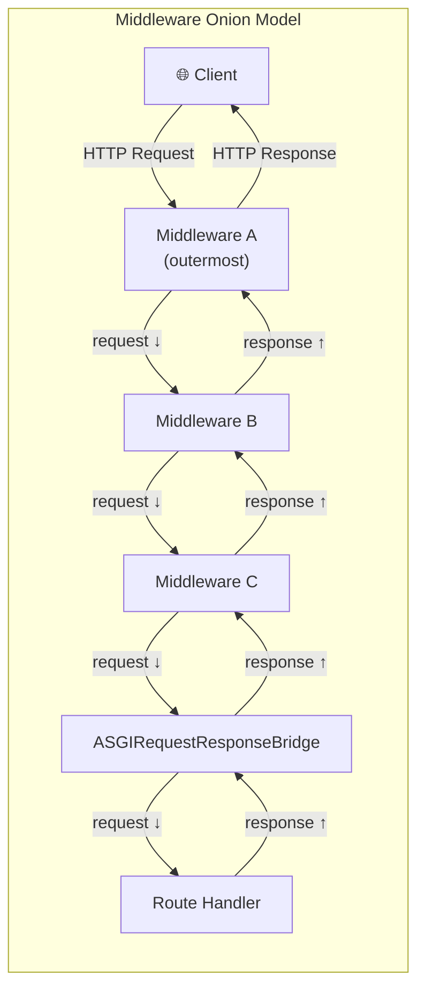

**Key insight:** middleware added *first* via `app.use()` runs *outermost*
(sees request first, response last). This is because `app.use()` inserts at
position 0 of the middleware list, and chain construction iterates in reverse.
See §5.

---

## 4. DefineMiddleware: The Deferred Descriptor

**File:** `core/sillo/middleware/define.py`

`DefineMiddleware` is a container that pairs a middleware factory with its
constructor arguments. It does **not** instantiate the middleware. It just
stores the recipe.

```python
class DefineMiddleware:
    """Container that pairs a middleware factory with its positional and keyword arguments."""

    def __init__(self, cls: MiddlewareFactory, *args: Any, **kwargs: Any) -> None:
        self.cls = cls        # the middleware class or factory callable
        self.args = args      # positional args for the constructor
        self.kwargs = kwargs  # keyword args for the constructor

    def __iter__(self) -> Iterator[Any]:
        """Yield (cls, args, kwargs) — enables tuple unpacking."""
        as_tuple = (self.cls, self.args, self.kwargs)
        return iter(as_tuple)
```

### Why a Descriptor?

Middleware is registered at definition time but instantiated at request time (or more
precisely, when `build_middleware_stack` runs). `DefineMiddleware` enables:

- **Deferred construction.** The middleware class isn't called until the stack
  is built.
- **Uniform interface.** Both ASGI-native middleware and dispatch-style
  middleware (wrapped via `wrap_middleware`) produce a `DefineMiddleware` with
  the same shape.
- **Unpacking.** `for cls, args, kwargs in reversed(middleware)` works because
  `__iter__` yields a 3-tuple.

```python
# Example: creating a DefineMiddleware explicitly
dm = DefineMiddleware(GZipMiddleware, minimum_size=1024, compresslevel=6)
cls, args, kwargs = dm
# cls == GZipMiddleware
# args == ()
# kwargs == {"minimum_size": 1024, "compresslevel": 6}
```

---

## 5. Chain Construction: Reversed Wrapping

The middleware chain is built by iterating the middleware list **in reverse** and
wrapping each layer around the previous result.

### 5.1 The Core Loop

```python
# core/sillo/application.py, SilloApp.handle_request() (lines 1189–1204)
app = self.app
middleware = (
    [ServerErrorMiddleware(app, handler=..., debug=...)]
    + self.http_middleware
    + [Middleware(ASGIRequestResponseBridge, dispatch=self.exceptions_handler)]
)
for cls, args, kwargs in reversed(middleware):
    app = cls(app, *args, **kwargs)
```

And in the router:

```python
# core/sillo/core/routing/router.py, Router.build_middleware_stack() (lines 909–932)
def build_middleware_stack(self, app: ASGIApp) -> ASGIApp:
    for cls, args, kwargs in reversed(self.middleware):
        app = cls(app, *args, **kwargs)
    return app
```

### 5.2 Why Reverse?

Consider three middleware registered in order `[A, B, C]`:

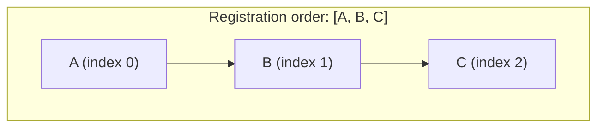

After `reversed([A, B, C])`, iteration produces `C, B, A`:

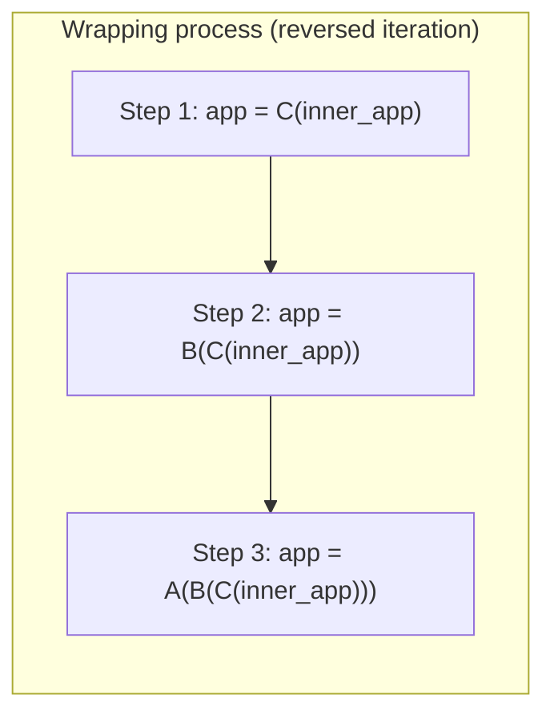

Result at runtime: `A` is outermost, `C` is innermost. Request flows `A → B → C → handler`.
The first middleware registered is the first to see every request.

### 5.3 The Full Stack at the Application Level

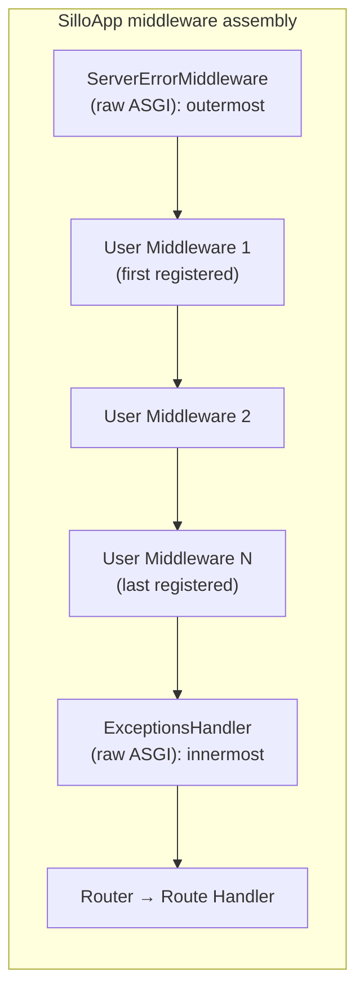

The `ServerErrorMiddleware` is always outermost (catches unhandled exceptions).
The `ExceptionsHandler` is always innermost (handles application-level exception
mappings). User middleware sits between them.

---

## 6. BaseMiddleware: One Hook

**File:** `core/sillo/middleware/base.py`

`BaseMiddleware` is the recommended base class for dispatch-style middleware. It
has one hook, `dispatch`, and the two phases of a request are the two sides of
the `await` inside it.

| | |
|---|---|
| before `await call_next()` | inspect the context, decide whether to continue |
| `await call_next()` | run the rest of the chain, get its response back |
| after it returns | act on that response |
| return without awaiting | short-circuit: nothing downstream runs |

### 6.1 Full Source

The whole contract, minus docstrings and annotations:

```python
from sillo import HttpContext

class BaseMiddleware:
    async def __call__(self, ctx: HttpContext, call_next) -> Any:
        return await self.dispatch(ctx, call_next)

    async def dispatch(self, ctx: HttpContext, call_next) -> Any:
        return await call_next()
```

That is all of it. A middleware is any object with an
`async def __call__(self, ctx, call_next)`; `BaseMiddleware` supplies that and
forwards to `dispatch`, so a subclass that overrides nothing is a no-op.

The chain does not inspect what you return, and it does not track whether you
called `call_next`. Whatever `dispatch` returns is the response — either the one
it got back from downstream, or one it built itself.

### 6.2 The Two Paths

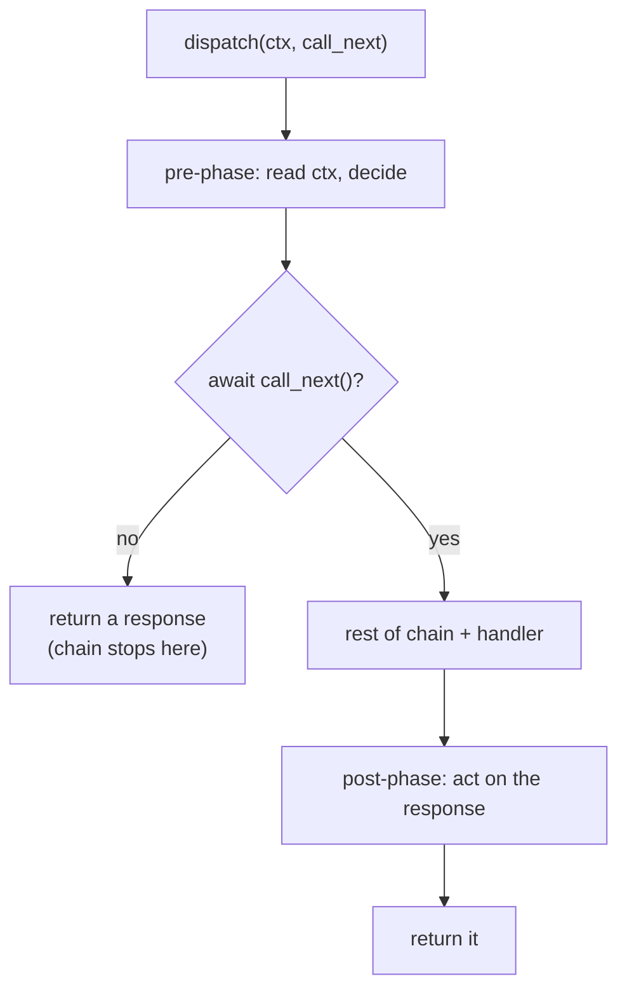

### 6.3 Simple Subclass Example

```python
from sillo.middleware import BaseMiddleware
from sillo import HttpContext

class TimingMiddleware(BaseMiddleware):
    async def dispatch(self, ctx: HttpContext, call_next):
        start = time.monotonic()
        response = await call_next()
        elapsed = time.monotonic() - start
        return response.set_header("X-Response-Time", f"{elapsed:.4f}s")
```

Note that `start` is a plain local. With two hooks it had to be parked on
`ctx.state` for the second method to find; here the two phases share a scope,
so there is nothing to hand across.

### 6.4 Short-Circuit Example (Auth Guard)

```python
from sillo import HttpContext, json

class AuthGuard(BaseMiddleware):
    async def dispatch(self, ctx: HttpContext, call_next):
        token = ctx.headers.get("Authorization")
        if not token or not verify_token(token):
            return json({"error": "Unauthorized"}).status(401)
        return await call_next()
```

Returning before the `await` is the short-circuit. The handler never runs,
nothing below this middleware in the stack runs, and the response returned here
is what the client gets.

Anything the middleware would have done on the way out is skipped too — which
is the point, and worth remembering when a middleware below this one was going
to stamp a header on every response. It will not see this one.

---

## 7. What the Single Hook Replaced

Earlier versions split this into `process_request` and `process_response`, with
a `_call_next` flag on the instance recording whether the middleware had
actually continued the chain — the framework needed that flag to tell "returned
what `call_next` gave me" apart from "returned my own response to
short-circuit", because both are just a return value.

Collapsing the pair into `dispatch` removes the question. There is nothing to
distinguish: the chain runs if you await it, and does not if you do not.

Three things fall out of that:

**A `try` can span both phases.** With two methods there was no block that
covered the pre-phase, the downstream call, and the post-phase together, so an
exception raised by the handler reached neither hook:

```python
from sillo import HttpContext, json

async def dispatch(self, ctx: HttpContext, call_next):
    try:
        return await call_next()
    except SomeError:
        return json({"error": "..."}).status(502)
```

**State between the phases is a local variable.** The `start_time` that used to
live on `ctx.state` purely so the second method could read it is now just a name
in scope.

**No per-instance flag.** The old `_call_next` was an instance attribute written
on every call, which was safe only because a middleware instance handles one
request at a time within a task. That constraint is gone with the attribute.

---

## 8. ASGIRequestResponseBridge: Bridging the Gap

**File:** `core/sillo/middleware/bridge.py`

`ASGIRequestResponseBridge` is the critical adapter that converts dispatch-style
middleware into an ASGI application. It is the single point where the high-level
`HttpContext` abstraction meets the raw ASGI `scope`/`receive`/`send` protocol.

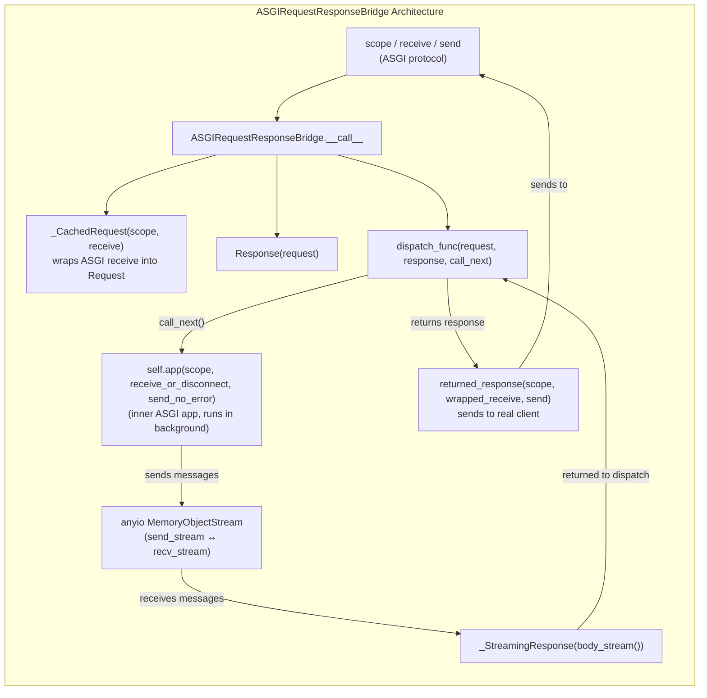

### 8.1 The `__call__` Method: Step by Step

```python
async def __call__(self, scope, receive, send):
    # 1. Non-HTTP scopes pass through directly
    if scope["type"] != "http":
        await self.app(scope, receive, send)
        return

    # 2. Create the dispatch-layer objects
    ctx = _CachedRequest(scope, receive)
    wrapped_receive = ctx.wrapped_receive
    response_sent = anyio.Event()

    # 3. Define call_next — runs inner app in background
    async def call_next():
        # ... runs self.app in a background task
        # ... streams response through memory channel
        # ... returns _StreamingResponse
        ...

    # 4. Create memory stream for inter-task communication
    streams = anyio.create_memory_object_stream()
    send_stream, recv_stream = streams

    # 5. Run the dispatch function with structured concurrency
    with recv_stream, send_stream, collapse_excgroups():
        async with anyio.create_task_group() as task_group:
            # 6. Invoke the dispatch middleware
            returned_response = await self.dispatch_func(
                ctx, response, call_next
            )
            # 7. The returned response is a _StreamingResponse
            #    Send it to the real client
            await returned_response(scope, wrapped_receive, send)
            # 8. Signal that the response has been fully sent
            response_sent.set()
            recv_stream.close()
```

### 8.2 The `call_next` Closure

The `call_next` function is the heart of the bridge. When the dispatch middleware calls
it, the following happens:

1. **Background task starts.** `self.app(scope, receive_or_disconnect,
   send_no_error)` runs in a child task of the `anyio.TaskGroup`.

2. **`receive_or_disconnect`** wraps the original receive to race against
   `response_sent`: once the middleware finishes sending the response, the
   inner app gets a synthetic `http.disconnect` to stop it from reading more
   body.

3. **`send_no_error`** writes ASGI messages into the `send_stream` end of an
   `anyio.MemoryObjectStream`.

4. **The main task reads** from `recv_stream` to get the `http.response.start` message
   (headers, status) and constructs a `_StreamingResponse` with a `body_stream()` async
   generator that yields body chunks from the channel.

5. **The `_StreamingResponse`** is attached to the `response` object and returned to
   the dispatch middleware.

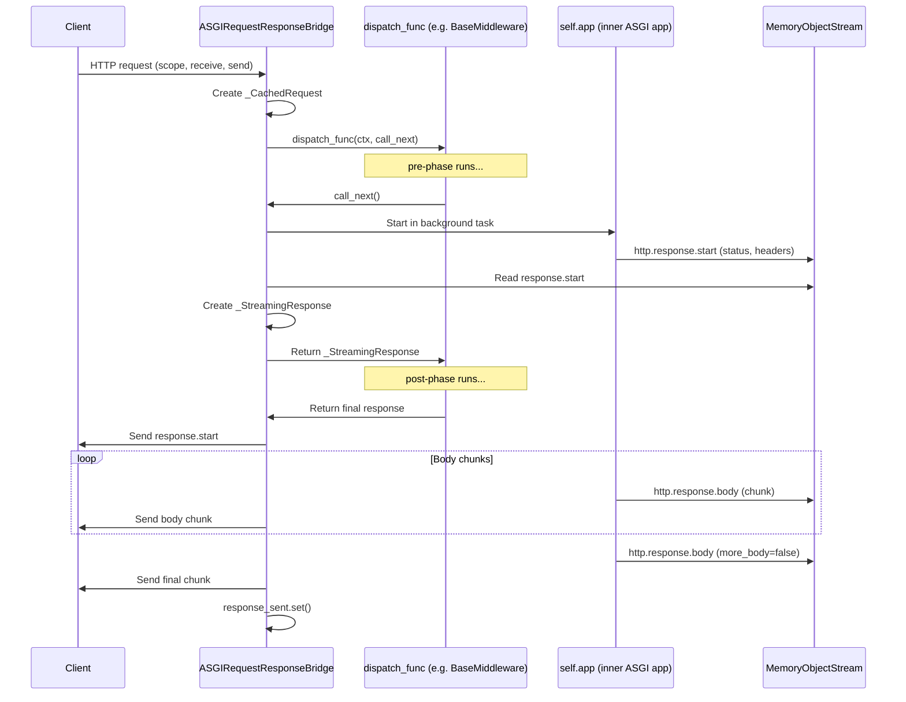

### 8.3 Non-HTTP Passthrough

WebSocket and lifespan scopes bypass the bridge entirely:

```python
if scope["type"] != "http":
    await self.app(scope, receive, send)
    return
```

This means dispatch-style middleware only ever sees HTTP requests. WebSocket middleware
must be written as ASGI-native middleware.

---

## 9. _CachedRequest: Three-State Receive

**File:** `core/sillo/middleware/bridge.py`

`_CachedRequest` is a `HttpContext` subclass that solves a fundamental problem: the dispatch
middleware may read the request body (via `ctx.body()` or `ctx.stream()`), but
the inner ASGI app also needs to read the body via the `receive` callable. The body can
only be consumed once from the network, so `_CachedRequest` caches and replays it.

### 9.1 The Three States

`wrapped_receive()` manages three distinct states:

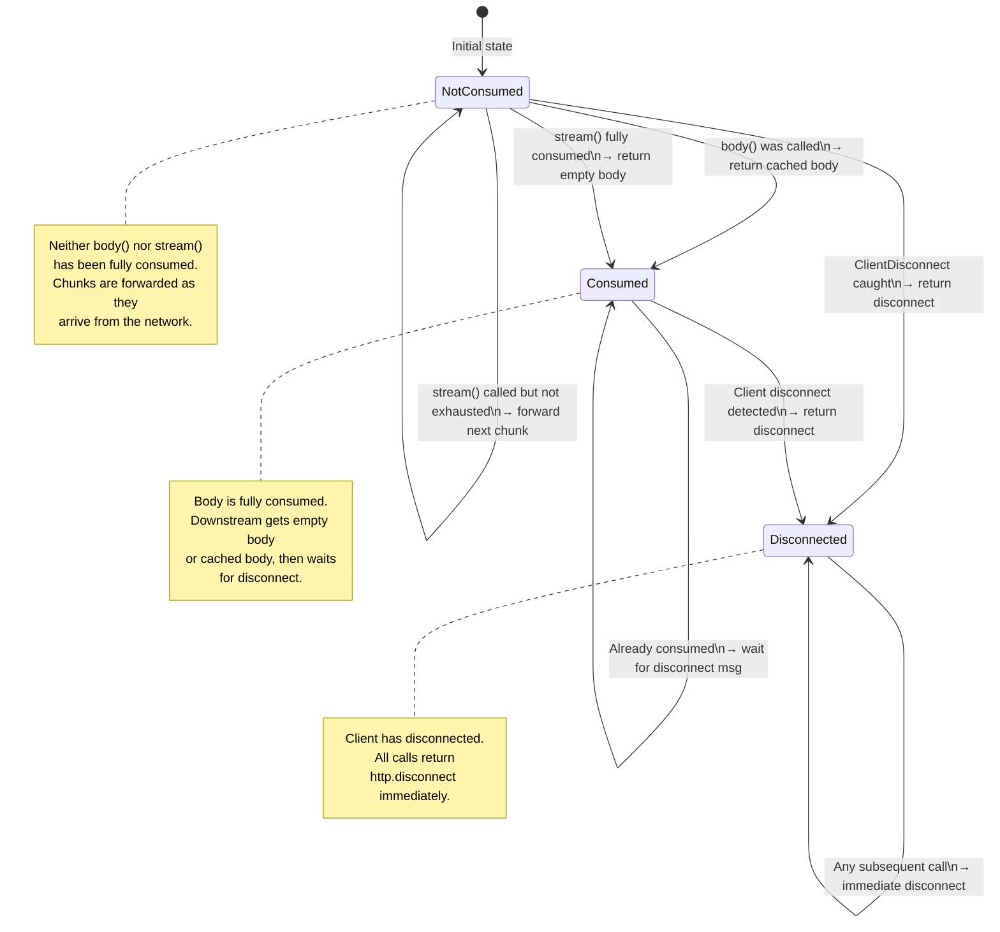

### 9.2 State Transition Code

```python
async def wrapped_receive(self) -> Message:
    # STATE 1: Disconnected — fast path
    if self._wrapped_rcv_disconnected:
        return {"type": "http.disconnect"}

    # STATE 2: Consumed but not yet disconnected
    if self._wrapped_rcv_consumed:
        if self._is_disconnected:
            self._wrapped_rcv_disconnected = True
            return {"type": "http.disconnect"}
        msg = await self.receive()
        if msg["type"] != "http.disconnect":
            raise RuntimeError(f"Unexpected message received: {msg['type']}")
        self._wrapped_rcv_disconnected = True
        return msg

    # STATE 3: Not yet consumed
    if getattr(self, "_body", None) is not None:
        # body() was called — return cached body in one shot
        self._wrapped_rcv_consumed = True
        return {"type": "http.request", "body": self._body, "more_body": False}
    elif self._stream_consumed:
        # stream() was fully consumed — return empty so downstream doesn't hang
        self._wrapped_rcv_consumed = True
        return {"type": "http.request", "body": b"", "more_body": False}
    else:
        # Neither consumed — forward the next chunk from the stream
        try:
            stream = self.stream()
            chunk = await stream.__anext__()
            self._wrapped_rcv_consumed = self._stream_consumed
            return {"type": "http.request", "body": chunk,
                    "more_body": not self._stream_consumed}
        except ClientDisconnect:
            self._wrapped_rcv_disconnected = True
            return {"type": "http.disconnect"}
```

### 9.3 Why This Matters

Without `_CachedRequest`, if a dispatch middleware calls `await ctx.body()` to
inspect the payload (e.g., for request signing verification), the inner ASGI app would
get an empty body because the network stream was already consumed. `_CachedRequest`
ensures:

- `body()` callers get the full body cached in memory.
- `stream()` callers get chunks forwarded one at a time.
- The inner app always sees a complete body (cached or empty).
- Client disconnections are handled without deadlocks.

---

## 10. _StreamingResponse: Async Body Relay

**File:** `core/sillo/middleware/bridge.py`

`_StreamingResponse` is a `BaseResponse` subclass that streams its body from an
async iterator. It's the return type of `call_next()`. The bridge constructs it
from the messages received through the memory channel.

```python
class _StreamingResponse(BaseResponse):
    def __init__(self, content, status_code=200, headers=None,
                 media_type=None, info=None):
        self.info = info
        self.content_iterator = content   # AsyncGenerator yielding bytes
        self.status_code = status_code
        self.media_type = media_type
        super().__init__(headers=dict(headers or {}), status_code=status_code)

    async def __call__(self, scope, receive, send):
        if self.info is not None:
            await send({"type": "http.response.debug", "info": self.info})
        await send({
            "type": "http.response.start",
            "status": self.status_code,
            "headers": self.raw_headers,
        })
        should_close_body = True
        async for chunk in self.content_iterator:
            if isinstance(chunk, dict):
                # ASGI message (e.g., pathsend) — pass through directly
                should_close_body = False
                await send(chunk)
                continue
            await send({"type": "http.response.body", "body": chunk, "more_body": True})
        if should_close_body:
            await send({"type": "http.response.body", "body": b"", "more_body": False})
```

### 10.1 Body Stream Lifecycle

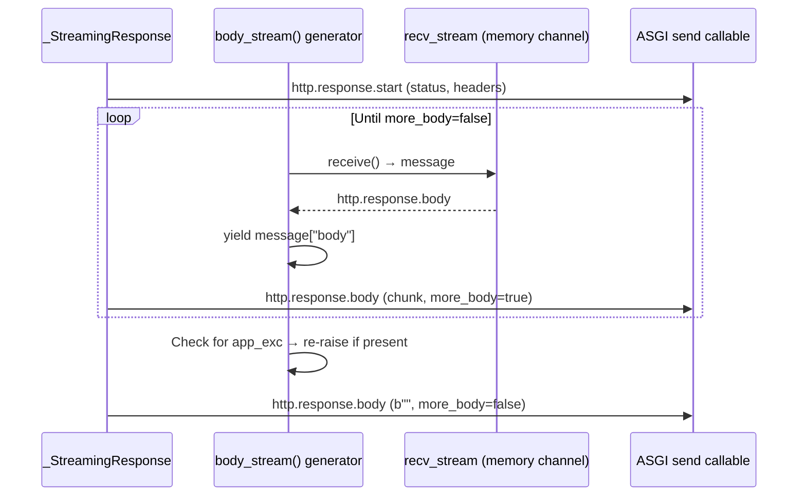

### 10.2 Exception Propagation

If the inner ASGI app raises an exception, it's captured in `app_exc` and re-raised
inside `body_stream()` after the body is fully consumed. This ensures the exception
propagates through the middleware chain's error handling rather than being silently lost.

---

## 11. GZipMiddleware: ASGI-Native Compression

**File:** `core/sillo/middleware/gzip.py` (lines 13 to 297)

Unlike `BaseMiddleware`, `GZipMiddleware` is an **ASGI-native** middleware. It operates
directly on the `scope`/`receive`/`send` protocol to intercept and compress response
bodies at the byte level.

### 11.1 Architecture

```python
class GZipMiddleware:
    def __init__(self, app: ASGIApp, minimum_size: int = 500,
                 compresslevel: int = 9):
        self.app = app
        self.minimum_size = minimum_size
        self.compresslevel = compresslevel

    async def __call__(self, scope, receive, send):
        if scope["type"] == "http":
            headers = Headers(scope=scope)
            if "gzip" in headers.get("Accept-Encoding", ""):
                responder = GZipResponder(self.app, self.minimum_size,
                                          compresslevel=self.compresslevel)
                await responder(scope, receive, send)
                return
        await self.app(scope, receive, send)
```

### 11.2 Decision Flow

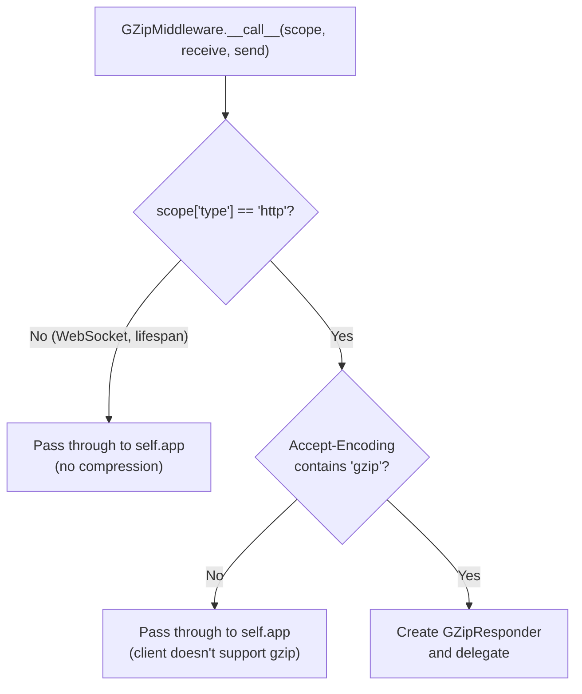

### 11.3 Constructor Parameters

| Parameter | Default | Description |
|-----------|---------|-------------|
| `app` | (required) | The inner ASGI application |
| `minimum_size` | 500 | Minimum body size in bytes before compression is applied |
| `compresslevel` | 9 | GZip compression level (1=fastest, 9=best compression) |

### 11.4 Registration

GZip middleware is registered as ASGI-native middleware directly on the router or
application, not via `app.use()`:

```python
# On a router
router = Router(middleware=[DefineMiddleware(GZipMiddleware, minimum_size=1024)])

# Or on the application
app = SilloApp(middleware=[
    DefineMiddleware(GZipMiddleware, minimum_size=500, compresslevel=6)
])
```

---

## 12. GZipResponder: The Four Cases

**File:** `core/sillo/middleware/gzip.py` (lines 79 to 276)

`GZipResponder` is where the actual compression logic lives. It wraps the inner app's
`send` callable with `send_with_gzip`, which intercepts each ASGI message and applies
the appropriate compression strategy.

### 12.1 State Variables

```python
class GZipResponder:
    def __init__(self, app, minimum_size, compresslevel=9):
        self.app = app
        self.minimum_size = minimum_size
        self.send: Send = unattached_send      # sentinel — raises if called before init
        self.initial_message: Message = {}      # cached http.response.start
        self.started = False                     # have we sent the start message?
        self.declared_length: int | None = None  # Content-Length from headers
        self.passthrough = False                 # True → skip compression for all chunks
        self.content_encoding_set = False        # True → downstream already compressed
        self.gzip_buffer = io.BytesIO()          # in-memory buffer for compressed bytes
        self.gzip_file = gzip.GzipFile(          # GZip file object wrapping the buffer
            mode="wb", fileobj=self.gzip_buffer, compresslevel=compresslevel
        )
```

### 12.2 The Four Cases in `send_with_gzip`

The method handles `http.response.body` messages through four distinct branches:

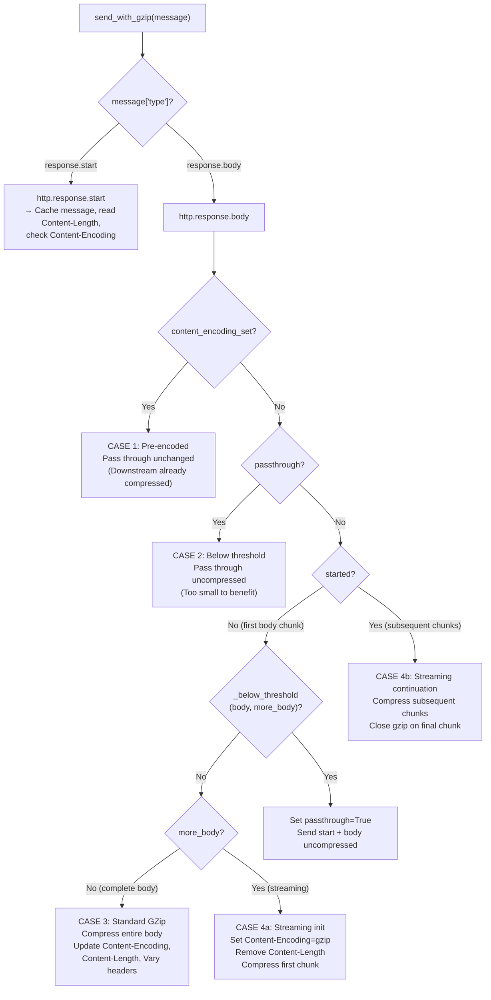

### 12.3 Case 1: Pre-Encoded Content

**Trigger:** `content_encoding_set is True` (downstream already set a `Content-Encoding`
header)

```python
elif message_type == "http.response.body" and self.content_encoding_set:
    if not self.started:
        self.started = True
        await self.send(self.initial_message)
    await self.send(message)
```

**Behavior:** The response passes through completely untouched. If the downstream handler
already compressed the body (e.g., Brotli from a CDN), GZip doesn't double-compress.

### 12.4 Case 2: Below Minimum Size Threshold

**Trigger:** `passthrough is True` (set when the first body chunk was below
`minimum_size`)

```python
elif message_type == "http.response.body" and self.passthrough:
    await self.send(message)
```

**And the initial decision:**

```python
if self._below_threshold(body, more_body):
    self.passthrough = True
    await self.send(self.initial_message)
    await self.send(message)
```

**Behavior:** Responses smaller than `minimum_size` (default 500 bytes) are sent
uncompressed. GZip framing overhead (~20 bytes) means tiny responses can actually get
*larger* when compressed.

The `_below_threshold` method is careful about multi-chunk responses:

```python
def _below_threshold(self, body: bytes, more_body: bool) -> bool:
    if self.declared_length is not None:
        return self.declared_length < self.minimum_size  # use Content-Length
    return len(body) < self.minimum_size and not more_body  # only if complete
```

### 12.5 Case 3: Standard Single-Shot GZip

**Trigger:** First body chunk, not below threshold, `more_body is False`

```python
elif not more_body:
    self.gzip_file.write(body)
    self.gzip_file.close()
    body = self.gzip_buffer.getvalue()

    headers = MutableHeaders(raw=self.initial_message["headers"])
    headers["Content-Encoding"] = "gzip"
    headers["Content-Length"] = str(len(body))
    headers.add_vary_header("Accept-Encoding")
    message["body"] = body

    await self.send(self.initial_message)
    await self.send(message)
```

**Behavior:** The entire body is compressed in one shot. Headers are updated with:
- `Content-Encoding: gzip`
- `Content-Length` → set to the compressed size
- `Vary: Accept-Encoding` → added for cache correctness

### 12.6 Case 4: Streaming GZip

**Trigger:** First body chunk, not below threshold, `more_body is True`

**Initialization (first chunk):**

```python
else:
    headers = MutableHeaders(raw=self.initial_message["headers"])
    headers["Content-Encoding"] = "gzip"
    headers.add_vary_header("Accept-Encoding")
    del headers["Content-Length"]   # can't know compressed size in advance

    self.gzip_file.write(body)
    message["body"] = self.gzip_buffer.getvalue()
    self.gzip_buffer.seek(0)
    self.gzip_buffer.truncate()

    await self.send(self.initial_message)
    await self.send(message)
```

**Continuation (subsequent chunks):**

```python
elif message_type == "http.response.body":  # pragma: no branch
    body = message.get("body", b"")
    more_body = message.get("more_body", False)

    self.gzip_file.write(body)
    if not more_body:
        self.gzip_file.close()

    message["body"] = self.gzip_buffer.getvalue()
    self.gzip_buffer.seek(0)
    self.gzip_buffer.truncate()

    await self.send(message)
```

**Behavior:** Each chunk is compressed incrementally. The GZip file object maintains
internal state across chunks, so the compressed output is a valid single GZip stream
when concatenated. `Content-Length` is removed (can't know the final compressed size).

### 12.7 Resource Cleanup

The GZip buffer and file are managed with a context manager in `__call__`:

```python
async def __call__(self, scope, receive, send):
    self.send = send
    with self.gzip_buffer, self.gzip_file:
        await self.app(scope, receive, self.send_with_gzip)
```

This ensures the `gzip.GzipFile` is properly closed and the `BytesIO` buffer is freed
even if an exception occurs during response processing.

### 12.8 The `unattached_send` Sentinel

```python
async def unattached_send(message: Message) -> typing.NoReturn:
    raise RuntimeError("send awaitable not set")
```

This is the initial value of `self.send`. If any code tries to send a message before
`__call__` binds the real `send`, it fails immediately with a clear error rather than
silently dropping the message.

---

## 13. app.use(): Application-Level Registration

**File:** `core/sillo/application.py` (lines 889 to 933)

`SilloApp.use()` registers a dispatch-style middleware at the application level. It
wraps the middleware in an `ASGIRequestResponseBridge` and inserts it at **position 0**
of the middleware list.

```python
def use(self, middleware: MiddlewareType) -> None:
    if self.auth_user_model is None:
        self.auth_user_model = getattr(middleware, "user_model", None)

    self.http_middleware.insert(
        0,
        Middleware(ASGIRequestResponseBridge, dispatch=middleware),
    )
```

### 13.1 Inside-Out Insertion

Inserting at position 0 means the most recently added middleware is the **outermost**
layer. Combined with reverse iteration during chain construction (§5), this produces
the intuitive "first added = first to execute" ordering.

```python
app.use(A)  # http_middleware = [Bridge(A)]
app.use(B)  # http_middleware = [Bridge(B), Bridge(A)]
app.use(C)  # http_middleware = [Bridge(C), Bridge(B), Bridge(A)]

# Chain construction (reversed iteration):
# app = Bridge(A)(inner)
# app = Bridge(B)(Bridge(A)(inner))
# app = Bridge(C)(Bridge(B)(Bridge(A)(inner)))
#
# Request flow: C → B → A → handler
# C was added last but runs first (outermost)
```

Wait. This seems backwards. Let me re-read the code. The list after three
inserts is `[C, B, A]`. Reversed iteration produces `A, B, C`. So the wrapping
is:

```
app = A(inner)
app = B(A(inner))
app = C(B(A(inner)))
```

Result: `C` is outermost, `A` is innermost. **The last middleware added runs first.**

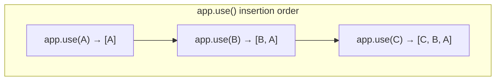

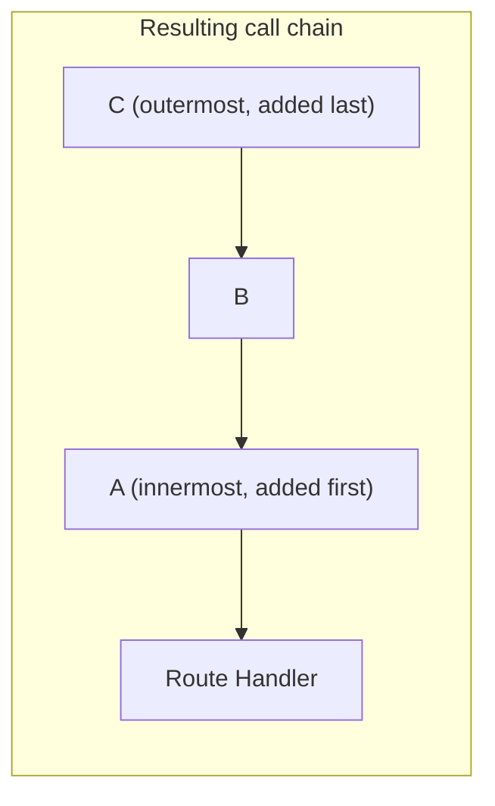

### 13.2 Auth Model Side Effect

`app.use()` has a side effect: if `self.auth_user_model` hasn't been set yet, it
checks the middleware for a `user_model` attribute and adopts it. This lets
`AuthenticationMiddleware` configure the app's auth model without an explicit
constructor argument.

### 13.3 The Full Middleware Assembly

When a request arrives, `SilloApp.handle_request()` assembles the complete stack:

```python
middleware = (
    [ServerErrorMiddleware(app, handler=..., debug=...)]
    + self.http_middleware   # user middleware (from app.use())
    + [Middleware(ASGIRequestResponseBridge, dispatch=self.exceptions_handler)]
)
for cls, args, kwargs in reversed(middleware):
    app = cls(app, *args, **kwargs)
```

This means:
1. `ServerErrorMiddleware` is always outermost (catches all unhandled exceptions).
2. User middleware runs next (in reverse registration order).
3. `ExceptionsHandler` is always innermost (handles mapped exceptions before they
   reach the route handler).

---

## 14. Router.use(): Router-Level Registration

**File:** `core/sillo/core/routing/router.py` (lines 1160 to 1186)

`Router.use()` works identically to `SilloApp.use()` but applies to a specific router:

```python
def use(self, middleware: MiddlewareType) -> None:
    if callable(middleware):
        mdw = Middleware(ASGIRequestResponseBridge, dispatch=middleware)
        self.middleware.insert(0, mdw)
```

### 14.1 Router Middleware vs App Middleware

| Aspect | `app.use()` | `router.use()` |
|--------|-------------|----------------|
| Scope | All routes in the application | Only routes on this router (and sub-routers) |
| Storage | `self.http_middleware` | `self.middleware` |
| Applied in | `handle_request()` | `build_middleware_stack()` / `__call__()` |
| Ordering | Runs before router middleware | Runs after app middleware |

### 14.2 Route-Level Middleware

Individual routes can also have middleware, applied in `Route.__init__`:

```python
# core/sillo/core/routing/router.py (lines 418–443)
def apply_middleware(app: ASGIApp) -> ASGIApp:
    middleware = []
    for mdw in self.middleware:
        middleware.append(wrap_middleware(mdw))
    for cls, args, kwargs in reversed(middleware):
        app = cls(app, *args, **kwargs)
    return app

self.app = apply_middleware(route_handler_as_asgi_app)
```

---

## 15. use_for_route(): Conditional Route Middleware

**File:** `core/sillo/middleware/utils.py` (lines 10 to 113)

`use_for_route()` is a decorator factory that makes a middleware execute only for
requests matching a specific URL pattern.

### 15.1 Usage

```python
from sillo import HttpContext, json

@use_for_route("/api/v1/*")
async def api_rate_limit(ctx: HttpContext, call_next):
    # Only runs for /api/v1/* routes
    if rate_limiter.exceeded(ctx):
        return json({"error": "Too many requests"}).status(429)
    return await call_next()

app.use(api_rate_limit)
```

### 15.2 Pattern Matching

```python
if route.endswith("/*"):
    route = route[:-2]               # strip /*
    route = f"^{route}/.*$"          # wildcard: match any sub-path
else:
    route = f"^{route}$"             # exact match
```

| Pattern | Regex | Matches |
|---------|-------|---------|
| `/api/users` | `^/api/users$` | Only `/api/users` exactly |
| `/api/*` | `^/api/.*$` | `/api/users`, `/api/orders/123`, etc. |

### 15.3 Class Method Support

The decorator detects whether the function is a class method (named `__call__`) and
wraps accordingly:

```python
if func.__name__ == "__call__":
    return wrapper_klass   # includes self parameter
else:
    return wrapper_func    # standalone function
```

This enables:

```python
from sillo import HttpContext, json

class AuthMiddleware:
    @use_for_route("/admin/*")
    async def __call__(self, ctx: HttpContext, call_next):
        if not ctx.user.is_admin:
            return json({"error": "Forbidden"}).status(403)
        return await call_next()
```

### 15.4 Passthrough Behavior

When the URL doesn't match, the middleware calls `call_next()` immediately. It
acts as a no-op pass-through:

```python
from sillo import HttpContext

async def wrapper_func(ctx: HttpContext, call_next):
    if re.match(route, ctx.url.path):
        return await func(ctx, call_next)
    else:
        return await call_next()   # ← pass through
```

---

## 16. wrap_middleware(): The Normalization Glue

**File:** `core/sillo/middleware/define.py`

`wrap_middleware()` converts a dispatch-style middleware function into a
`DefineMiddleware` instance that wraps it in an `ASGIRequestResponseBridge`:

```python
def wrap_middleware(middleware_function: MiddlewareType) -> DefineMiddleware:
    return DefineMiddleware(ASGIRequestResponseBridge, dispatch=middleware_function)
```

This is used in route-level middleware application:

```python
# In Route.__init__:
for mdw in self.middleware:
    middleware.append(wrap_middleware(mdw))
for cls, args, kwargs in reversed(middleware):
    app = cls(app, *args, **kwargs)
```

The normalization ensures that even raw dispatch functions get the bridge treatment
before entering the ASGI chain.

---

## 17. Complete Request Lifecycle Diagram

This diagram traces a single HTTP request through every layer of the middleware system:

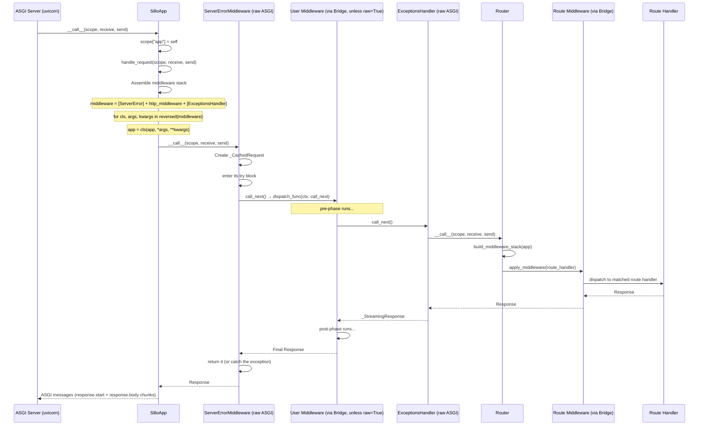

---

## 18. Writing Custom Middleware: Patterns & Anti-Patterns

### 18.1 Recommended: Subclass BaseMiddleware

```python
from sillo.middleware import BaseMiddleware
from sillo import HttpContext

class RequestIDMiddleware(BaseMiddleware):
    async def dispatch(self, ctx: HttpContext, call_next):
        request_id = ctx.headers.get("X-Request-ID", str(uuid.uuid4()))
        ctx.state.request_id = request_id       # for the handler to read
        response = await call_next()
        return response.set_header("X-Request-ID", request_id)
```

The ID goes on `ctx.state` because the *handler* may want it. It does not need
to go there for the post-phase — that half is in the same scope and can read
the local.

### 18.2 Short-Circuit Pattern

```python
from sillo import HttpContext, json

class RateLimitMiddleware(BaseMiddleware):
    def __init__(self, max_requests: int = 100, window: int = 60, **kwargs):
        super().__init__(**kwargs)
        self.max_requests = max_requests
        self.window = window
        self.requests: dict[str, list[float]] = {}

    async def dispatch(self, ctx: HttpContext, call_next):
        client_ip = ctx.client.host
        now = time.time()

        # Clean old entries
        self.requests.setdefault(client_ip, [])
        self.requests[client_ip] = [
            t for t in self.requests[client_ip] if now - t < self.window
        ]

        if len(self.requests[client_ip]) >= self.max_requests:
            # SHORT-CIRCUIT: don't call call_next
            return json({
                "error": "Rate limit exceeded",
                "retry_after": self.window,
            }).status(429)

        self.requests[client_ip].append(now)
        return await call_next()
```

### 18.3 Conditional Application Pattern

```python
from sillo.middleware.utils import use_for_route
from sillo import HttpContext

@use_for_route("/api/*")
async def api_cors(ctx: HttpContext, call_next):
    result = await call_next()
    result.headers["Access-Control-Allow-Origin"] = "*"
    return result
```

### 18.4 Anti-Patterns to Avoid

**❌ Storing per-request state on `self`**

```python
from sillo import HttpContext

class BadMiddleware(BaseMiddleware):
    async def dispatch(self, ctx: HttpContext, call_next):
        self.current_user = await get_user(ctx)  # ← shared across requests!
        return await call_next()
```

One middleware instance serves every request. Use a local when only this
`dispatch` needs the value, and `ctx.state` when the handler needs it too:

```python
from sillo import HttpContext

class GoodMiddleware(BaseMiddleware):
    async def dispatch(self, ctx: HttpContext, call_next):
        ctx.state.user = await get_user(ctx)  # ← per-request
        return await call_next()
```

**❌ Forgetting to call `call_next()`**

```python
from sillo import HttpContext

class BadMiddleware(BaseMiddleware):
    async def dispatch(self, ctx: HttpContext, call_next):
        log(ctx)
        # Missing: return await call_next()
        # Returns None, and None is what the client gets
```

**❌ Calling `call_next()` twice**

```python
from sillo import HttpContext

class BadMiddleware(BaseMiddleware):
    async def dispatch(self, ctx: HttpContext, call_next):
        result1 = await call_next()  # ← first call
        result2 = await call_next()  # ← second call — undefined behavior!
        return result1
```

**❌ Modifying the response and returning something else**

```python
from sillo import HttpContext

class ConfusedMiddleware(BaseMiddleware):
    async def dispatch(self, ctx: HttpContext, call_next):
        response = await call_next()
        response.set_header("X-Thing", "1")
        return await call_next()   # ← a second, unheadered response
```

The setters return the response so they can chain; what reaches the client is
whatever you `return`.

---

## 19. Security Middleware

**File:** `core/sillo/middleware/__init__.py`

The middleware package re-exports two security middleware classes:

```python
from sillo.security.cors import CORSMiddleware
from sillo.security.csrf import CSRFMiddleware
from .base import BaseMiddleware

__all__ = ["BaseMiddleware", "CORSMiddleware", "CSRFMiddleware"]
```

These are importable directly from `sillo.middleware`:

```python
from sillo.middleware import CORSMiddleware, CSRFMiddleware
```

### 19.1 Import Ordering Constraint

The `__init__.py` imports `CORSMiddleware` and `CSRFMiddleware` **before**
`BaseMiddleware` to avoid circular import issues. The security modules import
`BaseMiddleware` from `sillo.middleware.base` directly, not from the package
init, which prevents the cycle:

```
sillo.middleware.__init__  →  imports CORSMiddleware from sillo.security.cors
sillo.security.cors        →  imports BaseMiddleware from sillo.middleware.base  (NOT from sillo.middleware)
sillo.middleware.__init__  →  imports BaseMiddleware from .base
```

If the ordering were reversed, importing `sillo` would fail with `ImportError`.

---

## 20. Testing Middleware

### 20.1 Testing BaseMiddleware Subclasses

```python
import pytest
from sillo.testing import TestClient
from sillo import SilloApp, HttpContext

class TestTimingMiddleware:
    def test_adds_response_time_header(self):
        app = SilloApp()
        app.use(TimingMiddleware())

        @app.get("/test")
        async def handler(ctx: HttpContext):
            return {"ok": True}

        client = TestClient(app)
        resp = client.get("/test")
        assert resp.status_code == 200
        assert "X-Response-Time" in resp.headers

    def test_short_circuit_returns_401(self):
        app = SilloApp()
        app.use(AuthGuard())

        @app.get("/protected")
        async def handler(ctx: HttpContext):
            return {"secret": True}

        client = TestClient(app)
        resp = client.get("/protected")
        assert resp.status_code == 401
```

### 20.2 Testing ASGI-Native Middleware

```python
from sillo import HttpContext

class TestGZipMiddleware:
    def test_compresses_large_response(self):
        app = SilloApp()
        # GZipMiddleware is ASGI-native, typically added via middleware param

        @app.get("/large")
        async def handler(ctx: HttpContext):
            return {"data": "x" * 10000}

        client = TestClient(app)
        resp = client.get("/large", headers={"Accept-Encoding": "gzip"})
        assert resp.headers.get("Content-Encoding") == "gzip"

    def test_skips_small_response(self):
        app = SilloApp()

        @app.get("/small")
        async def handler(ctx: HttpContext):
            return {"ok": True}

        client = TestClient(app)
        resp = client.get("/small", headers={"Accept-Encoding": "gzip"})
        assert "Content-Encoding" not in resp.headers
```

---

## 21. Performance Considerations

### 21.1 Bridge Overhead

Every dispatch-style middleware goes through `ASGIRequestResponseBridge`, which creates:
- A `_CachedRequest` object
- A response object
- An `anyio.MemoryObjectStream` (two endpoints)
- A background task for the inner ASGI app

For performance-critical paths (high-throughput APIs), prefer ASGI-native middleware
that doesn't need the bridge.

### 21.2 GZip Compression Costs

| Level | Speed | Ratio | Use case |
|-------|-------|-------|----------|
| 1 | Fastest | ~30% | Real-time APIs |
| 6 | Balanced | ~40% | General purpose |
| 9 | Slowest | ~42% | Static assets, batch responses |

The `minimum_size` parameter (default 500 bytes) prevents wasting CPU on small responses
where GZip framing overhead negates the compression benefit.

### 21.3 Memory Impact

`_CachedRequest` caches the request body in memory when `body()` is called. For
large file uploads, this can be significant. If your middleware only needs
headers, avoid calling `body()`. Use `ctx.headers` or `ctx.stream()`
instead.

### 21.4 Streaming vs Single-Shot

GZip's Case 4 (streaming) avoids buffering the entire response body in memory. This is
important for large responses (SSE, file downloads) where buffering would cause memory
pressure.

---

## 22. Decision Flowcharts

### 22.1 Which Middleware Style to Use?

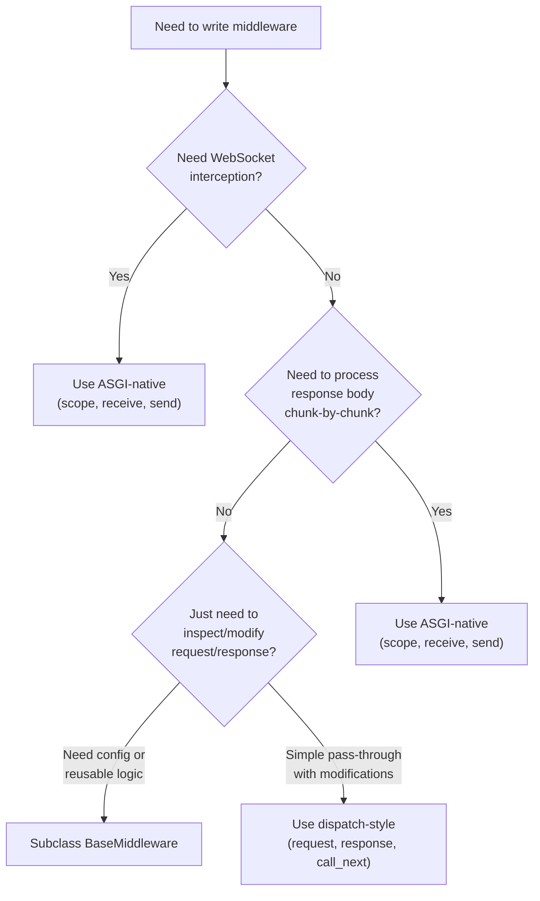

### 22.2 Where to Register Middleware?

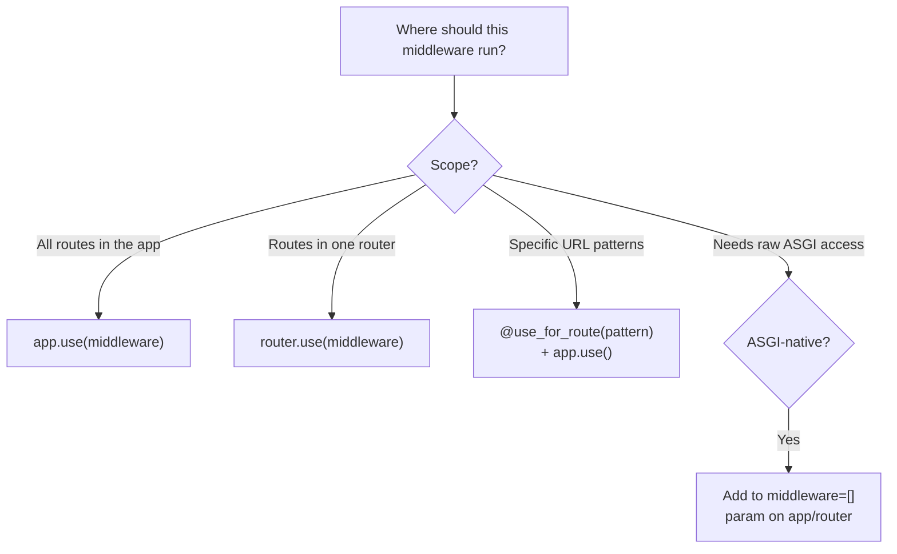

---

## 23. Appendix: Type Reference

### 23.1 Core Types (from `core/sillo/types.py`)

```python
from sillo import HttpContext

Scope = typing.MutableMapping[str, typing.Any]
Message = typing.MutableMapping[str, typing.Any]
Receive = typing.Callable[[], typing.Awaitable[Message]]
Send = typing.Callable[[Message], typing.Awaitable[None]]
ASGIApp = typing.Callable[[Scope, Receive, Send], typing.Awaitable[Any]]

MiddlewareType = typing.Callable[
    [HttpContext, BaseResponse, RequestResponseEndpoint],
    typing.Awaitable[BaseResponse | StreamingResponse],
]

RequestResponseEndpoint = typing.Callable[
    [], typing.Awaitable[BaseResponse | StreamingResponse]
]
```

### 23.2 Class Hierarchy

```mermaid
classDiagram
    class ASGIApp {
        <<type alias>>
        Callable[[Scope, Receive, Send], Awaitable[Any]]
    }

    class DefineMiddleware {
        +cls: MiddlewareFactory
        +args: tuple
        +kwargs: dict
        +__iter__() Iterator
    }

    class ASGIRequestResponseBridge {
        +app: ASGIApp
        +dispatch_func: MiddlewareType
        +__call__(scope, receive, send)
    }

    class _CachedRequest {
        +_wrapped_rcv_disconnected: bool
        +_wrapped_rcv_consumed: bool
        +_wrapped_rc_stream: AsyncIterator
        +wrapped_receive() Message
    }

    class _StreamingResponse {
        +info: Mapping
        +content_iterator: AsyncIterable
        +status_code: int
        +__call__(scope, receive, send)
    }

    class BaseMiddleware {
        +__call__(request, response, call_next)
        +dispatch(ctx, call_next)
    }

    class GZipMiddleware {
        +app: ASGIApp
        +minimum_size: int
        +compresslevel: int
        +__call__(scope, receive, send)
    }

    class GZipResponder {
        +app: ASGIApp
        +minimum_size: int
        +gzip_buffer: BytesIO
        +gzip_file: GzipFile
        +send_with_gzip(message)
    }

    class Request {
        <<from sillo.core.http>>
    }

    class BaseResponse {
        <<from sillo.core.http>>
    }

    ASGIRequestResponseBridge --> ASGIApp : wraps
    ASGIRequestResponseBridge --> _CachedRequest : creates
    ASGIRequestResponseBridge --> _StreamingResponse : returns
    _CachedRequest --|> Request : extends
    _StreamingResponse --|> BaseResponse : extends
    DefineMiddleware --> ASGIRequestResponseBridge : factory for
    GZipMiddleware --> GZipResponder : delegates to
    GZipResponder --> ASGIApp : wraps
```

### 23.3 File Index

| File | Line Range | Key Symbols |
|------|-----------|-------------|
| `core/sillo/middleware/base.py` | — | `BaseMiddleware`, `__call__`, `dispatch` |
| `core/sillo/middleware/gzip.py` | 13-297 | `GZipMiddleware`, `GZipResponder`, `send_with_gzip`, `unattached_send` |
| `core/sillo/middleware/define.py` | — | `DefineMiddleware`, `MiddlewareFactory`, `wrap_middleware()` |
| `core/sillo/middleware/bridge.py` | — | `ASGIRequestResponseBridge`, `call_next`, `_CachedRequest`, `_StreamingResponse` |
| `core/sillo/middleware/utils.py` | 10-113 | `use_for_route()` |
| `core/sillo/middleware/__init__.py` | 1-16 | Re-exports: `BaseMiddleware`, `CORSMiddleware`, `CSRFMiddleware` |
| `core/sillo/application.py` | 889-933 | `SilloApp.use()` |
| `core/sillo/core/routing/router.py` | 909-932 | `Router.build_middleware_stack()` |
| `core/sillo/core/routing/router.py` | 1160-1186 | `Router.use()` |
| `core/sillo/core/routing/router.py` | 418-443 | `Route.apply_middleware()` |
| `core/sillo/types.py` | 1-41 | `ASGIApp`, `MiddlewareType`, `Scope`, `Receive`, `Send` |

---

## Quick Reference Card

```
┌─────────────────────────────────────────────────────────────────────┐
│                    MIDDLEWARE QUICK REFERENCE                        │
├─────────────────────────────────────────────────────────────────────┤
│                                                                     │
│  DISPATCH-STYLE (most common)                                       │
│  ─────────────────────────────                                      │
│  async def my_mw(ctx, call_next):                                   │
│      # pre-processing                                               │
│      result = await call_next()                                     │
│      # post-processing                                              │
│      return result                                                  │
│                                                                     │
│  app.use(my_mw)                                                     │
│                                                                     │
│  BASE MIDDLEWARE SUBCLASS                                           │
│  ──────────────────────────                                         │
│  class MyMW(BaseMiddleware):                                        │
│      async def dispatch(self, ctx, call_next):                      │
│          # pre-processing                                           │
│          response = await call_next()                               │
│          return response.set_header("X-Foo", "bar")                 │
│                                                                     │
│  ASGI-NATIVE                                                        │
│  ──────────                                                         │
│  class MyASGIMiddleware:                                            │
│      def __init__(self, app): self.app = app                        │
│      async def __call__(self, scope, receive, send):                │
│          await self.app(scope, receive, send)                       │
│                                                                     │
│  CONDITIONAL                                                        │
│  ───────────                                                        │
│  @use_for_route("/api/*")                                           │
│  async def api_only(ctx, call_next):                                │
│      return await call_next()                                       │
│                                                                     │
│  ORDER: last app.use() = outermost (runs first)                     │
│  SHORT-CIRCUIT: return without awaiting call_next()                 │
│  REPLACE RESPONSE: return a different one                           │
│  PASS THROUGH: return what call_next() gave you                     │
│                                                                     │
└─────────────────────────────────────────────────────────────────────┘
```
