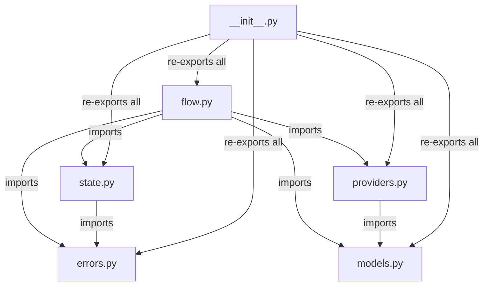
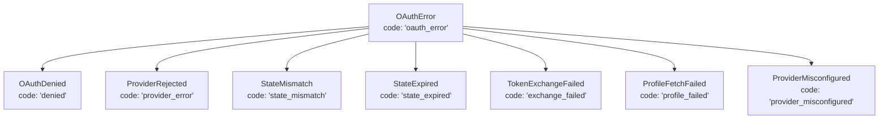
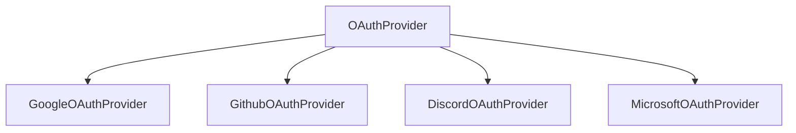
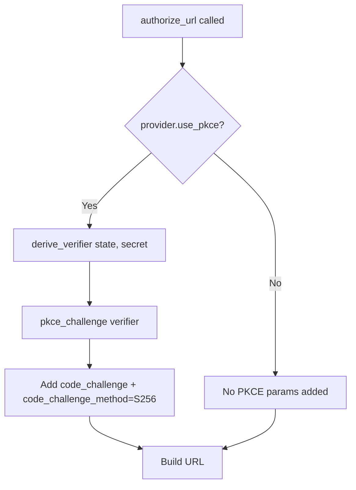
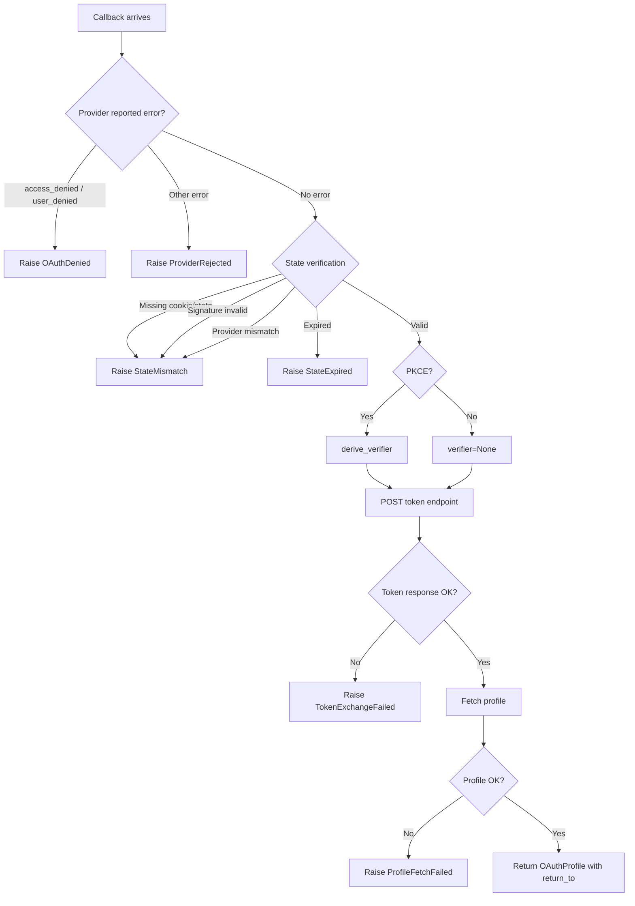
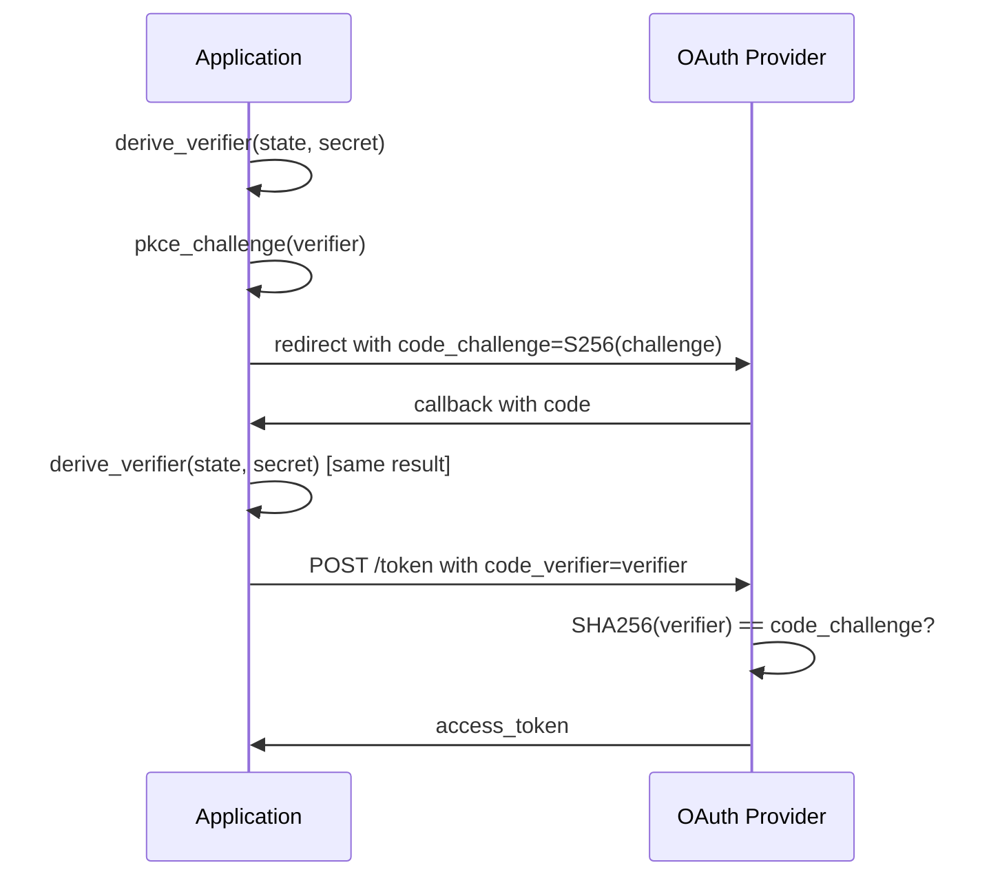
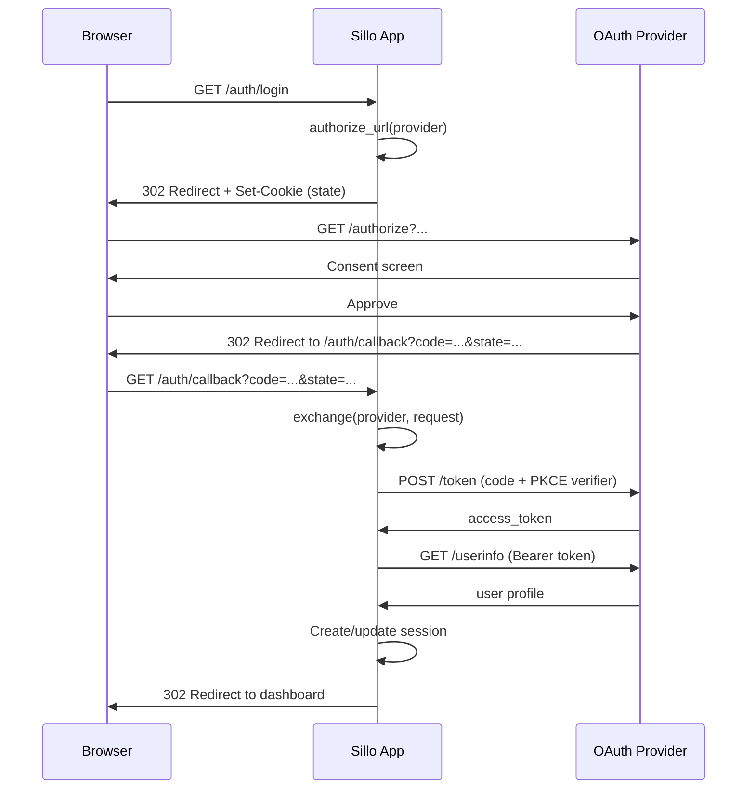

> **Package**: `sillo-oauth` v0.1.1
> **Repository**: https://github.com/sillohq/oauth
> **Source root**: `oauth/sillo_oauth/`
> **Tests**: `oauth/tests/`

---

## 1. Overview

`sillo-oauth` is a router-free, middleware-free OAuth 2.0 / OpenID Connect
login library for Sillo. It exposes **two public functions** (`authorize_url`
and `exchange`) and a handful of frozen dataclasses. There is no router, no
middleware, and no storage layer. The caller decides how to redirect the user,
where to store the session cookie, and what to do with the profile.

```
"Plain functions, no router, no middleware."
```

The package depends on:

| Dependency | Constraint | Purpose |
|---|---|---|
| `sillo-framework` | `>=0.0.2a1` | `sillo.helpers.crypto.sign_value` / `unsign_value` for HMAC state signing |
| `httpx` | `>=0.23.3,<0.29.0` | Async HTTP client for token exchange and profile fetch |

---

## 2. Package Structure

```
oauth/sillo_oauth/
├── __init__.py        # Public API re-exports, __version__ = "0.1.1"
├── errors.py          # OAuthError hierarchy (7 error classes)
├── models.py          # AuthorizeURL, OAuthTokens, OAuthProfile frozen dataclasses
├── providers.py       # OAuthProvider base + Google/Github/Discord/Microsoft
├── state.py           # State minting, verification, PKCE derivation
└── flow.py            # authorize_url(), exchange(), complete(), refresh, fetch_profile
```



**File paths (absolute)**:

| Module | Path |
|---|---|
| `__init__` | `/Users/admin/sillo.build/oauth/sillo_oauth/__init__.py` |
| `errors` | `/Users/admin/sillo.build/oauth/sillo_oauth/errors.py` |
| `models` | `/Users/admin/sillo.build/oauth/sillo_oauth/models.py` |
| `providers` | `/Users/admin/sillo.build/oauth/sillo_oauth/providers.py` |
| `state` | `/Users/admin/sillo.build/oauth/sillo_oauth/state.py` |
| `flow` | `/Users/admin/sillo.build/oauth/sillo_oauth/flow.py` |

The `__init__.py` re-exports 25 symbols via `__all__`:

```python
__all__ = [
    "__version__",
    "OAuthError", "OAuthDenied", "ProviderRejected", "StateMismatch",
    "StateExpired", "TokenExchangeFailed", "ProfileFetchFailed",
    "ProviderMisconfigured",
    "AuthorizeURL", "OAuthTokens", "OAuthProfile",
    "OAuthProvider", "GoogleOAuthProvider", "GithubOAuthProvider",
    "DiscordOAuthProvider", "MicrosoftOAuthProvider",
    "authorize_url", "exchange", "complete", "exchange_code",
    "refresh_tokens", "fetch_profile",
    "issue_state", "verify_state", "derive_verifier", "pkce_challenge",
]
```

---

## 3. Data Models

All three data models are **frozen dataclasses**. Once constructed, they are
immutable. This is a deliberate contract: the library never mutates a returned
model, and consumers can rely on the same object being safe to store, pass
across tasks, or compare.

### 3.1 AuthorizeURL

**Source**: `/Users/admin/sillo.build/oauth/sillo_oauth/models.py`

```python
@dataclass(frozen=True)
class AuthorizeURL:
    url: str
    state: str
    cookie_name: str
    cookie_value: str
    max_age: int
```

Returned by `authorize_url()`.  The caller uses the fields to build the HTTP
redirect and the Set-Cookie header.

| Field | Type | Purpose |
|---|---|---|
| `url` | `str` | The full authorization endpoint URL with query parameters |
| `state` | `str` | The random state value (43 chars, base64url) |
| `cookie_name` | `str` | Namespaced cookie name, e.g. `oauth_state_google` |
| `cookie_value` | `str` | The signed payload to set as the cookie value |
| `max_age` | `int` | Cookie TTL in seconds (default 600 = 10 minutes) |

The `cookie_kwargs(**overrides)` method returns a dict of safe defaults for
`Response.set_cookie`:

```python
def cookie_kwargs(self, **overrides: Any) -> dict[str, Any]:
    kwargs = {
        "key": self.cookie_name,
        "value": self.cookie_value,
        "max_age": self.max_age,
        "httponly": True,        # nothing in the browser needs to read it
        "samesite": "lax",      # strict would block the provider redirect-back
        "secure": True,         # HTTPS expected; set secure=False for localhost
        "path": "/",
    }
    kwargs.update(overrides)
    return kwargs
```

**Design note**: `samesite="lax"` is chosen over `"strict"` because the
provider redirects back from a different origin.  `httponly=True` prevents
JavaScript from reading the state cookie (XSS defense in depth).

### 3.2 OAuthTokens

**Source**: `/Users/admin/sillo.build/oauth/sillo_oauth/models.py`

```python
@dataclass(frozen=True, repr=False)
class OAuthTokens:
    access_token: str
    token_type: str = "Bearer"
    refresh_token: str | None = None
    expires_in: int | None = None
    scope: str | None = None
    id_token: str | None = None
    raw: dict[str, Any] = field(default_factory=dict)
```

| Field | Type | Default | Purpose |
|---|---|---|---|
| `access_token` | `str` | (required) | The OAuth access token |
| `token_type` | `str` | `"Bearer"` | Token type (normalized to capitalized) |
| `refresh_token` | `str \| None` | `None` | Refresh token, if the provider issued one |
| `expires_in` | `int \| None` | `None` | Seconds until expiry; `None` means unknown |
| `scope` | `str \| None` | `None` | Granted scopes (space-separated) |
| `id_token` | `str \| None` | `None` | OpenID Connect ID token (JWT) |
| `raw` | `dict[str, Any]` | `{}` | Complete provider response payload |

**Credential redaction**: The custom `__repr__` never prints tokens:

```
OAuthTokens(access_token=<redacted>, token_type='Bearer', expires_in=3600,
            scope='openid email', also_holds=[refresh_token, id_token])
```

**`authorization_header()`**: Returns `"Bearer <token>"`.  Normalizes lowercase
`"bearer"` from providers like GitHub that return the token type in lowercase.

### 3.3 OAuthProfile

**Source**: `/Users/admin/sillo.build/oauth/sillo_oauth/models.py`

```python
@dataclass(frozen=True)
class OAuthProfile:
    provider: str
    subject: str
    email: str | None = None
    email_verified: bool = False
    name: str | None = None
    username: str | None = None
    avatar_url: str | None = None
    raw: dict[str, Any] = field(default_factory=dict)
    tokens: OAuthTokens | None = None
    return_to: str | None = None
```

| Field | Type | Default | Purpose |
|---|---|---|---|
| `provider` | `str` | (required) | Provider name (e.g. `"google"`) |
| `subject` | `str` | (required) | Stable provider-issued user ID |
| `email` | `str \| None` | `None` | User's email address |
| `email_verified` | `bool` | `False` | Whether the provider confirmed the email. `False` also means "provider did not say" |
| `name` | `str \| None` | `None` | Display name |
| `username` | `str \| None` | `None` | Username / handle |
| `avatar_url` | `str \| None` | `None` | Profile picture URL |
| `raw` | `dict[str, Any]` | `{}` | Complete userinfo response |
| `tokens` | `OAuthTokens \| None` | `None` | The tokens used to fetch this profile |
| `return_to` | `str \| None` | `None` | Application-supplied return path |

**`key` property**: Returns `"<provider>:<subject>"`.  This is the only value
safe to use as a unique identity key.  Emails get reassigned; usernames get
renamed; provider+subject do not.

---

## 4. Error Hierarchy

**Source**: `/Users/admin/sillo.build/oauth/sillo_oauth/errors.py` (130 lines)

All errors are direct children of `OAuthError`. Each has a class-level `code`
attribute: a stable, URL-safe, underscore-delimited string that callers can
match on without touching the exception class:



| Class | `code` | Raised When |
|---|---|---|
| `OAuthError` | `"oauth_error"` | Base class; catch-all |
| `OAuthDenied` | `"denied"` | User declined consent (`access_denied` / `user_denied`) |
| `ProviderRejected` | `"provider_error"` | Provider redirected with a non-denial error |
| `StateMismatch` | `"state_mismatch"` | Callback doesn't match any redirect (CSRF, forged, wrong provider) |
| `StateExpired` | `"state_expired"` | State cookie is genuine but past its TTL |
| `TokenExchangeFailed` | `"exchange_failed"` | Provider refused to exchange code for token |
| `ProfileFetchFailed` | `"profile_failed"` | Token obtained but no usable profile came back |
| `ProviderMisconfigured` | `"provider_misconfigured"` | Programming error: missing secret, redirect URI, or endpoint |

**Constructor signature**:

```python
class OAuthError(Exception):
    code = "oauth_error"

    def __init__(
        self,
        message: str | None = None,
        *,
        provider: str | None = None,
        detail: str | None = None,
    ) -> None
```

If `message` is `None`, falls back to `self.code`.  The `__repr__` includes all
three fields: `OAuthError('denied', provider='google', detail='User declined')`.

**Contract**: Every error raised by the library is catchable as `OAuthError`.
Callers who want fine-grained handling catch specific subclasses; callers who
want a safety net catch `OAuthError`.

---

## 5. Provider System

**Source**: `/Users/admin/sillo.build/oauth/sillo_oauth/providers.py` (667 lines)

### 5.1 OAuthProvider Base

```python
class OAuthProvider:
    name: str = "oauth"
    authorize_endpoint: str = ""
    token_endpoint: str = ""
    userinfo_endpoint: str | None = None
    default_scopes: tuple[str, ...] = ()
    scope_separator: str = " "
    use_pkce: bool = True
    token_headers: Mapping[str, str] = MappingProxyType({"Accept": "application/json"})
    userinfo_headers: Mapping[str, str] = MappingProxyType({"Accept": "application/json"})
```

**Constructor** (`__init__`):

```python
def __init__(
    self,
    *,
    client_id: str,
    client_secret: str = "",
    state_secret: str | None = None,
    redirect_uri: str | None = None,
    scopes: tuple[str, ...] | None = None,
    name: str | None = None,
    authorize_endpoint: str | None = None,
    token_endpoint: str | None = None,
    userinfo_endpoint: str | None = None,
    use_pkce: bool | None = None,
    authorize_params: dict[str, str] | None = None,
    token_headers: Mapping[str, str] | None = None,
    userinfo_headers: Mapping[str, str] | None = None,
    profile_mapper: Callable[[dict[str, Any]], Mapping[str, Any]] | None = None,
    transport: httpx.AsyncBaseTransport | None = None,
    timeout: float = 10.0,
) -> None
```

**Validation at construction time**:
1. If `authorize_endpoint` resolves to empty string, raises `ProviderMisconfigured`.
2. If `token_endpoint` resolves to empty string, raises `ProviderMisconfigured`.
3. `token_headers` and `userinfo_headers` are merged over class defaults using
   `MappingProxyType` to produce read-only mappings.

**Immutability of headers**: The class-level `token_headers` and
`userinfo_headers` are `MappingProxyType` (read-only dict).  Instance-level
headers are also stored as `MappingProxyType`.  This prevents a provider
instance from accidentally modifying the class-level defaults.

**`__repr__`**: Shows `name` and `client_id`; hides both `client_secret` and
`state_secret`.

#### Key Methods

| Method | Returns | Description |
|---|---|---|
| `http_client()` | `httpx.AsyncClient` | Builds client from `transport`/`timeout`; overridable |
| `token_request_data(code, redirect_uri, verifier)` | `dict[str, str]` | Form body for token exchange; omits `client_secret` if empty |
| `refresh_request_data(refresh_token)` | `dict[str, str]` | Form body for refresh grant |
| `fetch_profile(client, tokens)` | `OAuthProfile` | Calls `fetch_userinfo` then `build_profile`; overridable |
| `fetch_userinfo(client, tokens)` | `dict[str, Any]` | GETs `userinfo_endpoint` with `Authorization: Bearer` header |
| `map_profile(raw)` | `Mapping[str, Any]` | Default best-guess mapping; overridable per-subclass |
| `build_profile(raw, tokens)` | `OAuthProfile` | Applies mapper, raises `ProfileFetchFailed` if no subject |

**Generic `map_profile`**: Tries `_SUBJECT_KEYS = ("sub", "id", "user_id", "uid")`
in order.  Picks up `email`, `name`, `username`, `avatar_url` if present.

### 5.2 Provider Subclasses



#### GoogleOAuthProvider

| Attribute | Value |
|---|---|
| `name` | `"google"` |
| `authorize_endpoint` | `https://accounts.google.com/o/oauth2/v2/auth` |
| `token_endpoint` | `https://oauth2.googleapis.com/token` |
| `userinfo_endpoint` | `https://openidconnect.googleapis.com/v1/userinfo` |
| `default_scopes` | `("openid", "email", "profile")` |
| `use_pkce` | `True` (inherited) |

Custom `map_profile`: maps `sub`, `email`, `email_verified`, `name`,
`preferred_username` -> `username`, `picture` -> `avatar_url`.

#### GithubOAuthProvider

| Attribute | Value |
|---|---|
| `name` | `"github"` |
| `authorize_endpoint` | `https://github.com/login/oauth/authorize` |
| `token_endpoint` | `https://github.com/login/oauth/access_token` |
| `userinfo_endpoint` | `https://api.github.com/user` |
| `default_scopes` | `("read:user", "user:email")` |
| `use_pkce` | **`False`** |
| `userinfo_headers` | `{"Accept": "application/vnd.github+json"}` |

**Special behaviors**:
- PKCE is **off** because GitHub's OAuth app flow does not implement it.
- `emails_endpoint` attribute is derived from `userinfo_endpoint` at construction.
- **Overrides `fetch_profile`**: If `/user` returns no email, makes a second
  call to `/user/emails` to find the primary verified address.  Failure is
  non-fatal (login succeeds even if the email scope is refused).
- `_fetch_primary_email(client, tokens) -> dict | None`: Returns
  `{"email": ..., "email_verified": True}` or `None`.
- Custom `map_profile`: maps `id` (as subject), `login` (as username), `name`,
  `email`, `email_verified`, `avatar_url`.

**Enterprise GitHub**: Set `userinfo_endpoint` to
`https://github.example.com/api/user`. The `emails_endpoint` is derived
automatically.

#### DiscordOAuthProvider

| Attribute | Value |
|---|---|
| `name` | `"discord"` |
| `authorize_endpoint` | `https://discord.com/oauth2/authorize` |
| `token_endpoint` | `https://discord.com/api/oauth2/token` |
| `userinfo_endpoint` | `https://discord.com/api/users/@me` |
| `default_scopes` | `("identify", "email")` |

Custom `map_profile`: builds CDN avatar URL from `id` + `avatar` hash:
`https://cdn.discordapp.com/avatars/{id}/{avatar}.png`.  Maps `global_name` or
`username` for display name.  `email_verified` maps from Discord's `verified`
field.

#### MicrosoftOAuthProvider

| Attribute | Value |
|---|---|
| `name` | `"microsoft"` |
| `userinfo_endpoint` | `https://graph.microsoft.com/oidc/userinfo` |
| `default_scopes` | `("openid", "email", "profile")` |

**Extra constructor parameter**: `tenant: str = "common"`.  Derives both
`authorize_endpoint` and `token_endpoint` from:
`https://login.microsoftonline.com/{tenant}/oauth2/v2.0/authorize|token`

Explicit `authorize_endpoint` or `token_endpoint` kwargs override tenant-derived
defaults.

Custom `map_profile`: maps `sub`, `email` (falls back to `upn`), `name`,
`preferred_username`, `picture`.  **`email_verified` is always `False`**
because Microsoft's userinfo endpoint never states verification status.

---

## 6. authorize_url - The Redirect Step

**Source**: `/Users/admin/sillo.build/oauth/sillo_oauth/flow.py`

```python
def authorize_url(
    provider: OAuthProvider,
    *,
    redirect_uri: str | None = None,
    scopes: tuple[str, ...] | None = None,
    return_to: str | None = None,
    extra_params: Mapping[str, str] | None = None,
    ttl: int = 600,
    secret: str | None = None,
    cookie_name: str | None = None,
) -> AuthorizeURL
```

This is a **pure function**: no I/O, no request object, no response object. It
does one thing: builds the URL the browser should redirect to.

### Step-by-step

1. **Resolve secret**: Per-call `secret` wins over `provider.state_secret`.
   Raises `ProviderMisconfigured` if neither is set.
2. **Resolve redirect URI**: Per-call wins over `provider.redirect_uri`.
   Raises `ProviderMisconfigured` if neither is set.
3. **Mint state**: Calls `issue_state(provider.name, secret, ttl=ttl,
   return_to=return_to)`.  Returns `(state, cookie_value)`.
4. **Build params dict**:
   - `response_type=code`
   - `client_id=provider.client_id`
   - `redirect_uri=redirect_uri`
   - `state=state`
   - Optionally `scope` (joined with `provider.scope_separator`)
   - Optionally PKCE: `code_challenge=pkce_challenge(derive_verifier(state, secret))`
     and `code_challenge_method=S256`
5. **Merge extras**: Per-call `extra_params` merged.  Provider-level
   `authorize_params` merged under that.  Per-call wins on collision.
6. **Reject reserved params**: If any of the 7 managed parameters appear in
   extras, raises `ProviderMisconfigured` with a message explaining which
   parameter and what to do instead.
7. **Construct URL**: `_merge_query(provider.authorize_endpoint, params)`.
   Preserves any existing query on the endpoint.
8. **Return**: `AuthorizeURL(url, state, cookie_name, cookie_value, max_age=ttl)`.

### Reserved Parameters

The following 7 parameter names are managed by the library and **cannot** be
overridden via `extra_params`:

| Parameter | Reason |
|---|---|
| `state` | Managed by `issue_state` |
| `code_challenge` | Derived from state via `derive_verifier` |
| `code_challenge_method` | Always `S256` when PKCE is enabled |
| `response_type` | Always `code` |
| `client_id` | Set from `provider.client_id` |
| `redirect_uri` | Set from `redirect_uri` |
| `scope` | Set from `scopes` |

### PKCE Decision Tree



---

## 7. exchange / complete - The Callback Step

### 7.1 exchange (Request-Bound)

```python
from sillo import HttpContext

async def exchange(
    provider: OAuthProvider,
    ctx: HttpContext,
    *,
    secret: str | None = None,
    cookie_name: str | None = None,
    state_value: str | None = None,
    redirect_uri: str | None = None,
) -> OAuthProfile
```

Reads `code`, `state`, `error`, `error_description` from `request.query_params`.
Reads stored state from cookie (via `cookie_name`) or the `state_value`
parameter.  Delegates to `complete()`.

### 7.2 complete (Request-Free)

```python
async def complete(
    provider: OAuthProvider,
    *,
    code: str | None,
    state: str | None,
    cookie_value: str | None,
    error: str | None = None,
    error_description: str | None = None,
    secret: str | None = None,
    redirect_uri: str | None = None,
) -> OAuthProfile
```

The request-free form of `exchange`.  For callers who authenticated the
callback another way (e.g., from a background job or a different framework).

### Order of Checks (Fixed)



**Why this order matters**:

1. **Provider error first**: If the provider already told us the user denied,
   there is no point verifying state or making HTTP requests.
2. **State verification second**: Before talking to the provider, confirm the
   callback is genuine.  This prevents an attacker from using the library as a
   proxy to exchange stolen codes.
3. **Only then talk to the provider**: Token exchange and profile fetch happen
   only after both checks pass.

### 7.3 exchange_code (State-Free)

```python
async def exchange_code(
    provider: OAuthProvider,
    *,
    code: str,
    redirect_uri: str | None = None,
    verifier: str | None = None,
) -> OAuthTokens
```

Skips state verification entirely.  For callers who authenticated the callback
another way (e.g., server-to-server, or a custom state mechanism).

---

## 8. State Management & PKCE

**Source**: `/Users/admin/sillo.build/oauth/sillo_oauth/state.py` (233 lines)

### 8.1 Constants

| Constant | Value | Purpose |
|---|---|---|
| `_PKCE_INFO` | `"sillo-oauth/pkce/v1:"` | Domain separator for HMAC-based verifier derivation |
| `_STATE_BYTES` | `32` | Entropy in state values (32 bytes = 43 chars base64url) |

### 8.2 StatePayload

```python
@dataclass(frozen=True)
class StatePayload:
    state: str          # random value echoed by provider
    provider: str       # provider name the redirect was for
    expires_at: float   # unix timestamp
    return_to: str | None = None  # application-supplied opaque value
```

### 8.3 issue_state

```python
def issue_state(
    provider: str,
    secret: str,
    *,
    ttl: int = 600,
    return_to: str | None = None,
    now: float | None = None,
) -> tuple[str, str]
```

1. Generate 32 random bytes via `secrets.token_bytes(32)`.
2. Base64url-encode without padding -> 43-char state string.
3. Build JSON payload: `{"s": state, "p": provider, "e": issued+ttl, "r": return_to}`.
4. Sign with `sillo.helpers.crypto.sign_value(payload, secret)`.
5. Return `(state, cookie_value)`.

The `now` parameter is injectable for testing (no sleeps needed).

### 8.4 verify_state

```python
def verify_state(
    cookie_value: str | None,
    state_param: str | None,
    provider: str,
    secret: str,
    *,
    now: float | None = None,
) -> StatePayload
```

**Fixed order of checks**:

| Step | Check | Failure Mode |
|---|---|---|
| 1 | Both values present | `StateMismatch` |
| 2 | Signature valid (via `unsign_value`) | `StateMismatch` |
| 3 | Payload is a dict | `StateMismatch` |
| 4 | `state` matches `state_param` (constant-time `hmac.compare_digest`) | `StateMismatch` |
| 5 | `provider` matches | `StateMismatch` |
| 6 | `expires_at` is numeric | `StateMismatch` |
| 7 | Not expired | `StateExpired` |

**Why `hmac.compare_digest`?**  Even though a forged value cannot pass the
signature check (step 2), using constant-time comparison prevents timing
oracles if the signing step is ever relaxed or replaced.

### 8.5 PKCE Verifier Derivation

```python
def derive_verifier(state: str, secret: str) -> str
```

```
verifier = base64url(HMAC-SHA256(secret, "sillo-oauth/pkce/v1:" + state))
```

- **Deterministic**: Neither the redirect step nor the exchange step stores it.
- **43 characters**: Bottom of RFC 7636's 43-128 range.
- **Domain separator** `"sillo-oauth/pkce/v1:"` prevents collision with other
  HMAC uses of the same secret.
- **Only the application secret** can produce the correct verifier.  An attacker
  who intercepts the authorization code cannot redeem it without the secret.

### 8.6 PKCE Challenge

```python
def pkce_challenge(verifier: str) -> str
```

```
challenge = base64url(SHA-256(verifier.encode("ascii")))
```

Standard S256 challenge as defined by RFC 7636.  The provider only ever sees
this challenge, never the verifier.

### 8.7 Complete PKCE Flow



---

## 9. Token Operations

### 9.1 Token Exchange Internals

```python
async def _request_tokens(
    provider: OAuthProvider,
    client: httpx.AsyncClient,
    *,
    code: str,
    redirect_uri: str,
    verifier: str | None,
) -> OAuthTokens
```

Calls `_post_token_endpoint` with `provider.token_request_data(...)`.

```python
async def _post_token_endpoint(
    provider: OAuthProvider,
    client: httpx.AsyncClient,
    data: dict[str, str],
) -> OAuthTokens
```

1. POST form data to `provider.token_endpoint`.
2. Handle transport errors (connection refused, timeout).
3. Check for `error` field even in 200 responses (some providers do this).
4. Check for non-2xx status codes.
5. Decode response: tries JSON first, falls back to form encoding.  If no
   content type, tries both.
6. Check for missing/empty `access_token`.
7. Parse `expires_in` from any shape (int, float, string, decimal string).
8. Build `OAuthTokens` with `raw` set to the full response.

### 9.2 Token Refresh

```python
async def refresh_tokens(
    provider: OAuthProvider,
    *,
    refresh_token: str,
    scopes: tuple[str, ...] | None = None,
) -> OAuthTokens
```

Sends `grant_type=refresh_token`.  If the provider omits a new refresh token
from the response, the old one is carried onto the result via
`dataclasses.replace`.

### 9.3 Profile Fetch (Standalone)

```python
async def fetch_profile(
    provider: OAuthProvider,
    tokens: OAuthTokens,
) -> OAuthProfile
```

For callers who already have tokens (e.g., from a stored session) and want
to fetch the profile without going through the OAuth flow again.

---

## 10. Testing Infrastructure

**Source**: `/Users/admin/sillo.build/oauth/tests/` (8 test files + conftest)

### 10.1 Network Guard

```python
# conftest.py -- autouse fixture
from sillo import HttpContext

@pytest.fixture(autouse=True)
def no_network(monkeypatch):
    async def deny(self, ctx: HttpContext):
        raise AssertionError(
            "A test tried to make a real network ctx. "
            "Inject a stub transport instead."
        )
    monkeypatch.setattr(
        httpx.AsyncHTTPTransport, "handle_async_request", deny
    )
```

This fixture runs for **every test**.  A test that forgets a stub transport
fails loudly and immediately.

### 10.2 ProviderStub

```python
class ProviderStub:
    def route(self, url, *, json=None, text=None, status=200,
              content_type=None, headers=None) -> ProviderStub
    def fail(self, url, exc=None) -> ProviderStub
    @property
    def transport(self) -> httpx.MockTransport
    def request_to(self, url) -> httpx.Request
    def form_to(self, url) -> dict[str, str]
```

**Usage pattern**:

```python
stub = ProviderStub()
stub.route("https://oauth2.googleapis.com/token", json={
    "access_token": "test-token", "token_type": "Bearer"
})
stub.route("https://openidconnect.googleapis.com/v1/userinfo", json={
    "sub": "123", "email": "test@example.com"
})
provider = GoogleOAuthProvider(
    client_id="test",
    client_secret="test",
    state_secret="secret",
    transport=stub.transport,
)
```

**Key design decisions**:
- Routes are matched on **scheme+host+path** (query parameters ignored).
- `route()` returns `self` for chaining: `stub.route(...).route(...)`.
- `fail()` makes an endpoint raise a transport error (default: `httpx.ConnectError`).
- Responses are rebuilt per call (so a route can be hit twice without stream consumption).
- `request_to()` finds the last request to a URL.
- `form_to()` parses the form body of the last request to a URL.

### 10.3 Injectable Time

Both `issue_state` and `verify_state` accept `now: float | None`:

```python
# Issue a state that expires at t=1000
state, cookie = issue_state("google", "secret", ttl=100, now=1000.0)

# Verify at t=1050 (within TTL)
payload = verify_state(cookie, state, "google", "secret", now=1050.0)

# Verify at t=1101 (expired)
with pytest.raises(StateExpired):
    verify_state(cookie, state, "google", "secret", now=1101.0)
```

### 10.4 Test Suite Summary

| File | Tests | Covers |
|---|---|---|
| `test_state.py` | ~45 | State minting, verification rejections, PKCE derivation |
| `test_authorize_url.py` | ~45 | URL building, scopes, PKCE, extras, overrides, cookie kwargs |
| `test_complete.py` | ~25 | Happy path, provider errors, state enforcement, failure propagation |
| `test_token_exchange.py` | ~35 | Request shape, response parsing, form-encoded, failures, refresh |
| `test_profiles.py` | ~45 | All 4 providers, generic mapping, custom mapper, failures |
| `test_docs_claims.py` | ~15 | Pins exact reprs, error messages, documented tables |
| `test_docs_openapi.py` | ~25 | OpenAPI document generation, security schemes |
| `test_sillo_integration.py` | ~25 | Full flow through real Sillo app |

**Total**: ~260 tests.

### 10.5 Integration Test Helpers

```python
# test_sillo_integration.py
def make_provider(stub, cls=GoogleOAuthProvider, **overrides):
    """Build provider wired to stub with happy-path routes."""

def state_from(response):
    """Extract state from redirect Location header."""

def session_app():
    """
    Creates app with session-cookie auth.
    Middleware order matters: SessionMiddleware AFTER AuthenticationMiddleware
    so it runs BEFORE (inside-out ordering).
    """
```

---

## 11. Integration Patterns

### 11.1 Session Login Flow



### 11.2 JWT Login Flow

The callback returns the OAuth tokens and profile as JSON instead of
redirecting.  The frontend stores the JWT and sends it as
`Authorization: Bearer <token>` on subsequent requests.

### 11.3 Account Linking

When the user is already logged in, the OAuth flow can link a new provider
to the existing account.  The `return_to` field on `AuthorizeURL` drives
the final redirect back to the settings page.

### 11.4 Multiple Providers

Each provider gets its own state cookie: `oauth_state_google`,
`oauth_state_github`.  Two logins in flight don't interfere because the
state values are independent and the cookie names are namespaced.

---

## 12. Security Properties

### 12.1 CSRF Protection

The state cookie is `httponly=True`, `samesite="lax"`, `secure=True`.  An
attacker cannot:
- Read the state value via JavaScript (httponly).
- Forge a callback from a different site (samesite).
- Intercept the cookie over HTTP (secure).

The `verify_state` function uses `hmac.compare_digest` for constant-time
comparison, preventing timing oracles.

### 12.2 PKCE

The verifier is derived via HMAC from the state and the application secret.
An attacker who intercepts the authorization code cannot exchange it without
the application secret, because they cannot produce the correct `code_verifier`.

### 12.3 Token Security

- `OAuthTokens.__repr__` redacts all credentials.
- `OAuthProfile` does not leak tokens in its `__repr__`.
- `authorization_header()` normalizes the token type.

### 12.4 Provider Header Immutability

`token_headers` and `userinfo_headers` are stored as `MappingProxyType`
(read-only dicts).  Instance-level headers cannot leak into class defaults,
and class defaults cannot be mutated through an instance.

### 12.5 No Secrets in URLs

The `authorize_url` function never includes `client_secret`, `state_secret`,
or the PKCE verifier in the URL.  Only `client_id`, `state`, and
`code_challenge` are sent to the provider's authorize endpoint.

---

*End of document 41-OAUTH.md*
