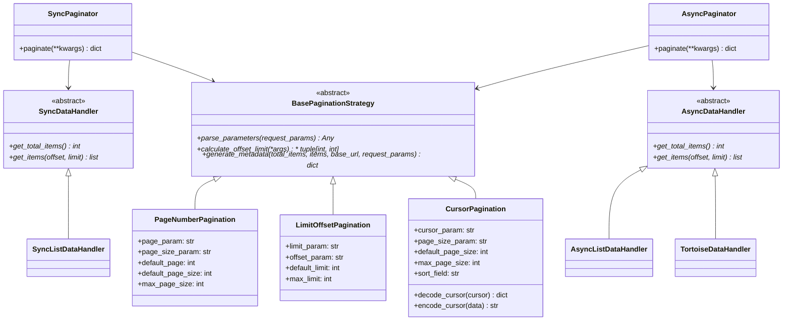
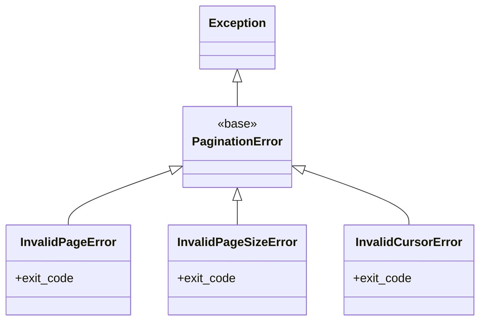
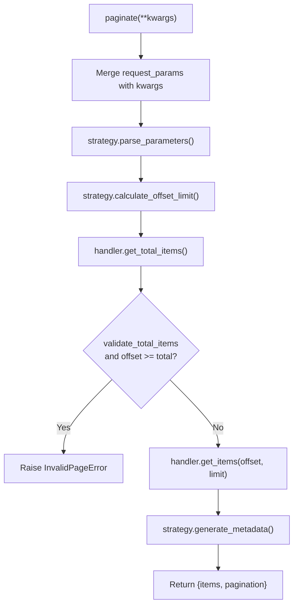

> Internal engineering reference for Sillo's pagination system.
>
> Source: `core/sillo/pagination.py` (531 lines) +
> `core/sillo/record/pagination.py` (52 lines)

---

## 1. Overview and Architecture

The pagination module implements the **Strategy pattern**, three
interchangeable pagination strategies share a common interface, paired with
pluggable data handlers and paginator orchestrators.

### Class Diagram



### File Inventory

| File | Path | Lines | Purpose |
|------|------|-------|---------|
| `pagination.py` | `core/sillo/pagination.py` | 531 | Core pagination module |
| `pagination.py` | `core/sillo/record/pagination.py` | 52 | Tortoise ORM data handlers |

---

## 2. Exceptions

**File:** `core/sillo/pagination.py`, lines 8-46



| Exception | Raised When |
|-----------|-------------|
| `PaginationError` | Base class for all pagination errors |
| `InvalidPageError` | Page number < 1 or offset exceeds total items |
| `InvalidPageSizeError` | Page size/limit < 1 or exceeds max |
| `InvalidCursorError` | Cursor string cannot be decoded or is malformed |

---

## 3. LinkBuilder

**File:** `core/sillo/pagination.py`, line 49

Constructs pagination navigation URLs by merging original request query
parameters with new pagination-specific parameters.

### Constructor

```python
def __init__(
    self,
    base_url: str,
    request_params: dict[str, str | list[str]],
    pagination_params: list[str],
):
```

- `base_url`: URL without query string (e.g., `/api/users`).
- `request_params`: Original request query params.
- `pagination_params`: Param names managed by pagination (stripped before merge
  to avoid conflicts).

### `build_link(new_params) -> str`

```python
# core/sillo/pagination.py, line 97
def build_link(self, new_params: dict[str, Any]) -> str:
    # Filter out pagination params from original ctx
    filtered = {
        k: v for k, v in self.request_params.items()
        if k not in self.pagination_params
    }
    # Merge with new pagination params
    merged = {**filtered, **new_params}
    # Encode
    query = urllib.parse.urlencode(merged, doseq=True)
    return f"{self.base_url}?{query}" if query else self.base_url
```

**Example:**

```python
builder = LinkBuilder(
    base_url="/api/users",
    request_params={"q": "alice", "page": "3", "page_size": "20"},
    pagination_params=["page", "page_size"],
)
builder.build_link({"page": "1"})
# → "/api/users?q=alice&page=1"
```

The `q=alice` param is preserved; `page` and `page_size` are replaced.

---

## 4. BasePaginationStrategy

**File:** `core/sillo/pagination.py`, line 127

Abstract base class defining the strategy interface:

```python
class BasePaginationStrategy(abc.ABC):
    @abc.abstractmethod
    def parse_parameters(self, request_params: dict[str, Any]) -> Any:
        """Extract and validate pagination parameters from ctx."""

    @abc.abstractmethod
    def calculate_offset_limit(self, *args, **kwargs) -> tuple[int, int]:
        """Convert parsed parameters to (offset, limit)."""

    @abc.abstractmethod
    def generate_metadata(
        self, total_items: int, items: list[Any],
        base_url: str, request_params: dict[str, Any],
    ) -> dict[str, Any]:
        """Generate pagination metadata with navigation links."""
```

---

## 5. PageNumberPagination

**File:** `core/sillo/pagination.py`, line 216

Traditional page-based pagination: `?page=N&page_size=M`.

### Constructor

```python
def __init__(
    self,
    page_param: str = "page",
    page_size_param: str = "page_size",
    default_page: int = 1,
    default_page_size: int = 20,
    max_page_size: int = 100,
):
```

### `parse_parameters(request_params)`

Extracts `page` and `page_size` from request params:
- Caps `page_size` at `max_page_size`.
- Raises `InvalidPageError` if `page < 1`.
- Raises `InvalidPageSizeError` if `page_size < 1`.

### `calculate_offset_limit(page, page_size)`

```python
return ((page - 1) * page_size, page_size)
```

### `generate_metadata(total_items, items, base_url, request_params)`

Computes `total_pages` via ceiling division.  Uses `LinkBuilder` with
`[page_param, page_size_param]`.

**Generated links:**

| Link | Condition | Value |
|------|-----------|-------|
| `prev` | `page > 1` | `page - 1` |
| `next` | `page < total_pages` | `page + 1` |
| `first` | Always | `page = 1` |
| `last` | Always | `page = total_pages` |

**Metadata format:**

```json
{
  "total_items": 100,
  "total_pages": 5,
  "page": 2,
  "page_size": 20,
  "links": {
    "prev": "/api/users?page=1&page_size=20",
    "next": "/api/users?page=3&page_size=20",
    "first": "/api/users?page=1&page_size=20",
    "last": "/api/users?page=5&page_size=20"
  }
}
```

---

## 6. LimitOffsetPagination

**File:** `core/sillo/pagination.py`, line 290

Offset-based pagination: `?limit=N&offset=M`.

### Constructor

```python
def __init__(
    self,
    limit_param: str = "limit",
    offset_param: str = "offset",
    default_limit: int = 20,
    max_limit: int = 100,
):
```

### `parse_parameters(request_params)`

- Caps `limit` at `max_limit`.
- Raises `InvalidPageSizeError` if `limit < 0`.
- Raises `InvalidPageError` if `offset < 0`.

### `calculate_offset_limit(limit, offset)`

```python
return (offset, limit)  # Identity mapping
```

### `generate_metadata(total_items, items, base_url, request_params)`

Computes `current_page` and `total_pages`.

**Generated links:**

| Link | Condition | Value |
|------|-----------|-------|
| `prev` | `offset > 0` | `offset = max(0, offset - limit)` |
| `next` | `offset + limit < total_items` | `offset + limit` |
| `first` | Always | `offset = 0` |
| `last` | Always | `offset = max(0, total_items - limit)` |

---

## 7. CursorPagination

**File:** `core/sillo/pagination.py`, line 364

Cursor-based pagination: `?cursor=<base64>&page_size=M`.

### Constructor

```python
def __init__(
    self,
    cursor_param: str = "cursor",
    page_size_param: str = "page_size",
    default_page_size: int = 20,
    max_page_size: int = 100,
    sort_field: str = "id",
):
```

### Cursor Encoding/Decoding

```python
# core/sillo/pagination.py, line 389
def decode_cursor(self, cursor: str) -> dict[str, Any]:
    """Base64-decode then JSON-parse cursor string."""
    return json.loads(base64.b64decode(cursor).decode())

def encode_cursor(self, data: dict[str, Any]) -> str:
    """JSON-serialize then base64-encode cursor data."""
    return base64.b64encode(json.dumps({self.sort_field: data[self.sort_field]}).encode()).decode()
```

**Cursor format:** `base64(json({"id": 42}))` → `"eyJpZCI6IDQyfQ=="`

### `calculate_offset_limit(cursor, page_size)`

URL-decodes the cursor, decodes it, returns `(cursor_data[sort_field], page_size)`.
If no cursor, returns `(0, page_size)`.

### `generate_metadata(total_items, items, base_url, request_params)`

**Generated links:**

| Link | Condition | Value |
|------|-----------|-------|
| `next` | Items exist | Cursor = last item's `sort_field` value |
| `prev` | Cursor was provided | Cursor = first item's `sort_field` value |

**Key assumption:** Items must be dicts or objects with a `sort_field` key
(default `"id"`).  The cursor encodes the sort field value, not an offset.

---

## 8. Data Handlers

### Sync Data Handlers

**File:** `core/sillo/pagination.py`, lines 149-178

```python
class SyncDataHandler(abc.ABC):
    @abc.abstractmethod
    def get_total_items(self) -> int: ...
    @abc.abstractmethod
    def get_items(self, offset: int, limit: int) -> list[Any]: ...

class SyncListDataHandler(SyncDataHandler):
    def __init__(self, data: list[Any]):
        self.data = data
    def get_total_items(self) -> int:
        return len(self.data)
    def get_items(self, offset, limit):
        return self.data[offset : offset + limit]
```

### Async Data Handlers

**File:** `core/sillo/pagination.py`, lines 181-210

```python
class AsyncDataHandler(abc.ABC):
    @abc.abstractmethod
    async def get_total_items(self) -> int: ...
    @abc.abstractmethod
    async def get_items(self, offset: int, limit: int) -> list[Any]: ...

class AsyncListDataHandler(AsyncDataHandler):
    # Same pattern, async methods
```

### Tortoise ORM Data Handler

**File:** `core/sillo/record/pagination.py`, line 18

```python
class TortoiseDataHandler(AsyncDataHandler):
    def __init__(self, queryset):
        self._qs = queryset

    async def get_total_items(self) -> int:
        return await self._qs.count()

    async def get_items(self, offset: int, limit: int) -> list[Any]:
        return await self._qs.offset(offset).limit(limit).all()
```

Bridges `sillo.pagination` strategies to Tortoise querysets. No duplicate
pagination logic, just the data-handler layer.

---

## 9. Paginators

### SyncPaginator

**File:** `core/sillo/pagination.py`, line 448

```python
class SyncPaginator:
    def __init__(
        self,
        data_handler: SyncDataHandler,
        pagination_strategy: BasePaginationStrategy,
        base_url: str,
        request_params: dict[str, Any],
        validate_total_items: bool = True,
    ):
```

### AsyncPaginator

**File:** `core/sillo/pagination.py`, line 482

Mirrors `SyncPaginator` exactly but with `async paginate()` and `await` on data
handler methods.

### `paginate(**kwargs)` Flow



**`validate_total_items`** (default `True`): When `True`, raises
`InvalidPageError` if the offset exceeds total items.  When `False`, renders an
empty list instead (used by admin list view for out-of-range pages).

---

## 10. PaginatedResponse

**File:** `core/sillo/pagination.py`, line 516

```python
class PaginatedResponse:
    def __init__(self, data: dict[str, Any]):
        self.items = data["items"]
        self.metadata = data["pagination"]

    def to_dict(self) -> dict[str, Any]:
        return {"data": self.items, "pagination": self.metadata}
```

`AsyncPaginatedResponse` (line 525) is identical, separate class for async
context.

### Output Format

```json
{
  "data": [
    {"id": 1, "name": "Alice"},
    {"id": 2, "name": "Bob"}
  ],
  "pagination": {
    "total_items": 100,
    "total_pages": 5,
    "page": 1,
    "page_size": 20,
    "links": {
      "next": "/api/users?page=2&page_size=20",
      "last": "/api/users?page=5&page_size=20"
    }
  }
}
```

---

## 11. Integration Examples

### Page Number Pagination with Tortoise

```python
from sillo.pagination import AsyncPaginator, PageNumberPagination
from sillo.record.pagination import TortoiseDataHandler
from sillo import HttpContext

async def list_users(ctx: HttpContext):
    queryset = User.all().order_by("id")
    handler = TortoiseDataHandler(queryset)
    strategy = PageNumberPagination(default_page_size=25, max_page_size=100)

    paginator = AsyncPaginator(
        data_handler=handler,
        pagination_strategy=strategy,
        base_url="/api/users",
        request_params=dict(ctx.query_params),
    )

    result = await paginator.paginate()
    return PaginatedResponse(result).to_dict()
```

### Limit-Offset with In-Memory Data

```python
from sillo.pagination import SyncPaginator, LimitOffsetPagination, SyncListDataHandler

data = list(range(100))
handler = SyncListDataHandler(data)
strategy = LimitOffsetPagination(default_limit=10, max_limit=50)

paginator = SyncPaginator(
    data_handler=handler,
    pagination_strategy=strategy,
    base_url="/api/numbers",
    request_params={"offset": "20", "limit": "10"},
)

result = paginator.paginate()
```

### Cursor Pagination

```python
from sillo.pagination import AsyncPaginator, CursorPagination
from sillo.record.pagination import TortoiseDataHandler
from sillo import HttpContext

async def list_events(ctx: HttpContext):
    queryset = Event.all().order_by("-created_at")
    handler = TortoiseDataHandler(queryset)
    strategy = CursorPagination(
        sort_field="created_at",
        default_page_size=50,
    )

    paginator = AsyncPaginator(
        data_handler=handler,
        pagination_strategy=strategy,
        base_url="/api/events",
        request_params=dict(ctx.query_params),
    )

    result = await paginator.paginate()
    return PaginatedResponse(result).to_dict()
```

### Admin Integration

The admin `list_view` uses pagination internally:

```python
# core/sillo/admin/routes.py, line 873
paginator = AsyncPaginator(
    data_handler=TortoiseDataHandler(queryset),
    pagination_strategy=PageNumberPagination(
        default_page_size=admin.list_per_page,
    ),
    base_url=f"{site.prefix}/{model_slug}/",
    request_params=dict(ctx.query_params),
    validate_total_items=False,  # Empty list for out-of-range pages
)
result = await paginator.paginate()
```
