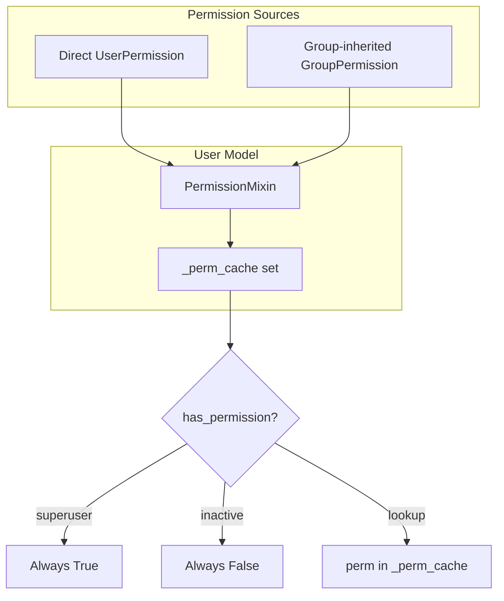
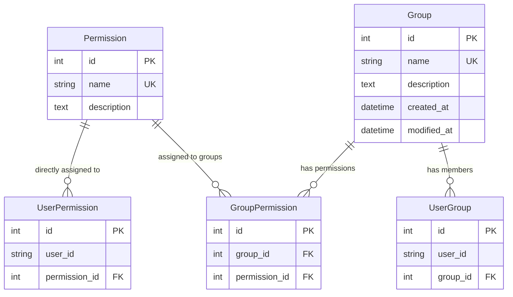
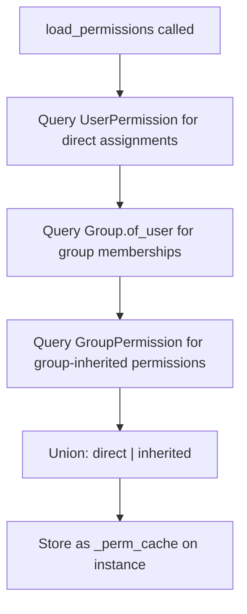
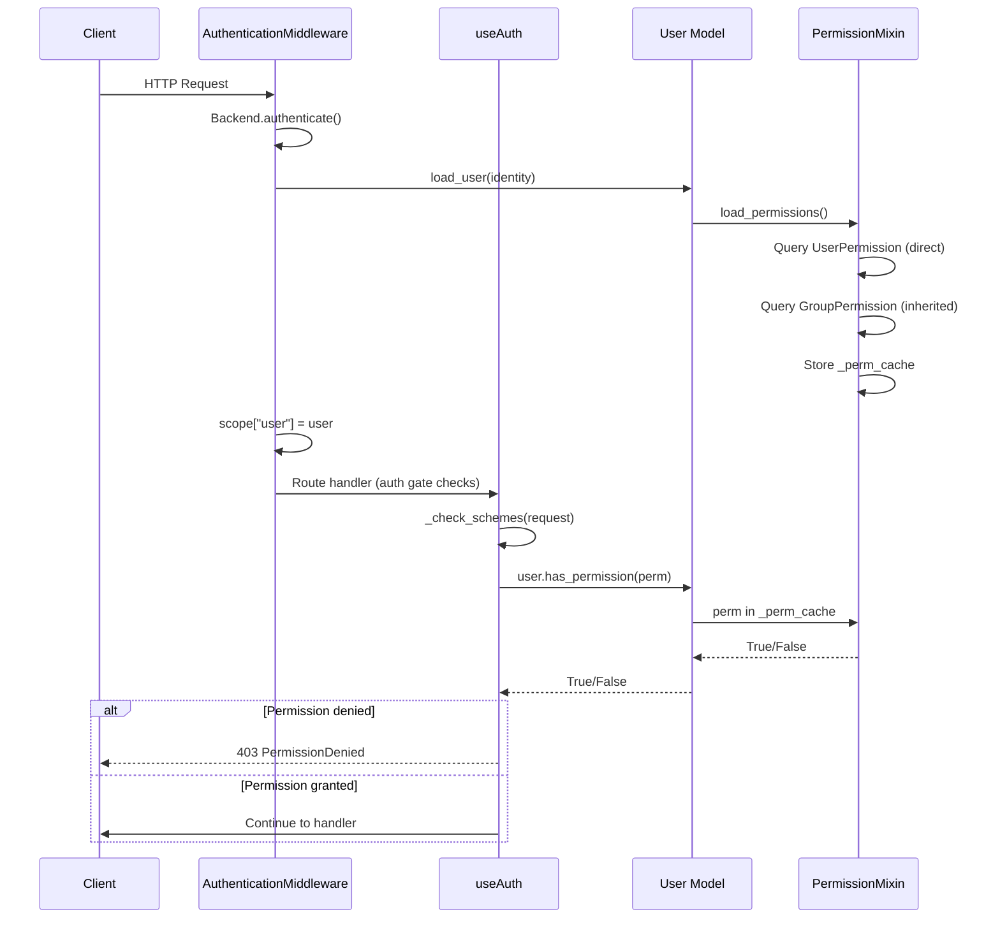

**Version:** 2026-08-11
**Audience:** Core maintainers, application developers, security engineers
**Purpose:** Document the permission model, group system, join tables, and the PermissionMixin that bridges permissions into user models

---

## Overview

Sillo's permission system provides fine-grained access control through named permissions, direct user assignments, and group-based inheritance. The system is designed around three principles:

1. **Permissions are simple strings**: no dotted convention, no app_label
   scoping. A permission is just `"edit_posts"`.
2. **Assignments are polymorphic.** `user_id` is a `CharField`, not a foreign
   key. Any identity (UUID, email, integer ID) works.
3. **Caching is automatic.** `PermissionMixin.load_permissions()` queries both
   direct and group-inherited permissions into an in-memory set
   (`_perm_cache`), and `has_permission()` is a pure set lookup.



---

## Entity-Relationship Diagram



---

## Permission Model

**File:** `core/sillo/permissions/models.py` (lines 8 to 279)

### Fields

| Field | Type | Purpose |
|-------|------|---------|
| `name` | `CharField(255, unique=True)` | Unique permission identifier (e.g. `"edit_posts"`) |
| `description` | `TextField(null=True)` | Optional human-readable description |

Table: `permissions`

### Class Methods: CRUD Operations

#### `define(name, description="")` → `Permission`

Idempotent permission creation via `get_or_create`. Calling `define` with the same name multiple times returns the existing record without duplication. If a description is provided and the permission already exists, the existing description is NOT updated.

```python
await Permission.define("edit_posts", "Can edit blog posts")
await Permission.define("edit_posts")  # No-op, returns existing
```

#### `assign(user, *names)` → `None`

Grants one or more permissions directly to a user. Each permission is auto-defined if it does not exist. A `UserPermission` link row is created idempotently. Duplicate assignments are silently ignored.

```python
await Permission.assign(user, "edit_posts", "delete_comments")
await Permission.assign("user@example.com", "view_dashboard")  # Raw identity string works
```

The `user` argument can be either a model instance with an `identity` attribute or a raw identity string.

#### `revoke(user, *names)` → `None`

Removes direct user-permission assignments. Looks up `Permission` records by name, then deletes the corresponding `UserPermission` link rows. Does NOT affect group-inherited permissions.

```python
await Permission.revoke(user, "edit_posts", "delete_comments")
```

#### `of(user)` → `list[str]`

Returns all permission names directly assigned to a user, sorted. Only direct
assignments. Group-inherited permissions are not included.

```python
perms = await Permission.of(user)
# ["delete_comments", "edit_posts"]
```

#### `has(user, name)` → `bool`

Live database check, two-step lookup: resolves the `Permission` by name, then
checks for a `UserPermission` link. This is NOT the cached check; for request
handlers, use `user.has_permission()` after `load_permissions()`.

```python
if await Permission.has(user, "edit_posts"):
    ...
```

#### `of_group(group)` → `list[str]`

Returns all permission names assigned to a group, sorted.

```python
perms = await Permission.of_group(admins_group)
```

#### `holders(name)` → `list[str]`

Returns identity strings of all users who hold a permission directly. Does NOT include users who inherit through groups.

```python
holders = await Permission.holders("edit_posts")
# ["user1@example.com", "user2@example.com"]
```

---

## UserPermission: The Direct Assignment Join Table

**File:** `core/sillo/permissions/models.py` (lines 282 to 324)

```python
class UserPermission(Model):
    user_id = fields.CharField(max_length=255, db_index=True)
    permission = fields.ForeignKeyField("models.Permission")

    class Meta:
        table = "user_permissions"
```

**Critical design choice:** `user_id` is a `CharField`, not a `ForeignKey` to the user table. This means:
- Permissions work with any identity type (UUID, email, integer ID)
- No database-level referential integrity to a user table
- The permission system is decoupled from the user model implementation

The `user_id` stores whatever `user.identity` returns (a string).

---

## Group Model

**File:** `core/sillo/permissions/models.py` (lines 326 to 637)

### Fields

| Field | Type | Purpose |
|-------|------|---------|
| `name` | `CharField(150, unique=True, db_index=True)` | Group identifier (e.g. `"admins"`) |
| `description` | `TextField(null=True)` | Optional description |
| `created_at` | `DatetimeField(auto_now_add=True)` | Creation timestamp |
| `modified_at` | `DatetimeField(auto_now=True)` | Last modification timestamp |

Table: `perm_groups`

### Lifecycle Methods

#### `get_or_create(name, description=None)` → `Group`

Fetches an existing group by name or creates a new one. Uses `super()` to avoid infinite recursion (the class overrides the method).

### User Membership Methods

| Method | Purpose |
|--------|---------|
| `add_user(user)` | Adds a user to the group (idempotent via `get_or_create` on `UserGroup`) |
| `remove_user(user)` | Removes a user from the group (no-op if not a member) |
| `has_user(user)` | Checks if a user is a member |
| `get_members()` | Returns identity strings of all members |
| `get_member_count()` | Returns member count (more efficient than `len(get_members())`) |

### Permission Assignment Methods

| Method | Purpose |
|--------|---------|
| `add_permissions(*names)` | Assigns permissions to the group (auto-defines if needed, idempotent) |
| `remove_permissions(*names)` | Removes permissions from the group |
| `has_permission(name)` | Checks if the group has a specific permission |
| `get_permissions()` | Returns all permission names assigned to the group, sorted |

### Query Class Methods

| Method | Purpose |
|--------|---------|
| `of_user(user)` → `list[Group]` | Returns all groups a user belongs to |
| `names_of_user(user)` → `list[str]` | Returns names of all groups a user belongs to, sorted |

### Usage Example

```python
# Create a group and assign permissions
admins = await Group.get_or_create("admins", "System administrators")
await admins.add_permissions("edit_posts", "delete_posts", "manage_users")

# Add users to the group
await admins.add_user(admin_user)
await admins.add_user("other_admin@example.com")

# Check permissions
await admins.has_permission("edit_posts")  # True
await admins.get_permissions()  # ["delete_posts", "edit_posts", "manage_users"]
```

---

## UserGroup: The Membership Join Table

**File:** `core/sillo/permissions/models.py` (lines 640 to 681)

```python
class UserGroup(Model):
    user_id = fields.CharField(max_length=255, db_index=True)
    group = fields.ForeignKeyField("models.Group", related_name="memberships")

    class Meta:
        table = "perm_user_groups"
        unique_together = (("user_id", "group"),)
```

Same `CharField` pattern as `UserPermission`. `user_id` is a string, not a
foreign key. The `unique_together` constraint prevents duplicate memberships.

---

## GroupPermission: The Group-to-Permission Join Table

**File:** `core/sillo/permissions/models.py` (lines 684 to 727)

```python
class GroupPermission(Model):
    group = fields.ForeignKeyField("models.Group", related_name="group_permissions")
    permission = fields.ForeignKeyField("models.Permission", related_name="group_permissions")

    class Meta:
        table = "perm_group_permissions"
        unique_together = (("group", "permission"),)
```

Links groups to permissions. The `unique_together` constraint prevents duplicate assignments.

---

## PermissionMixin: Bridging Permissions into User Models

**File:** `core/sillo/permissions/mixins.py` (lines 4 to 225)

### Usage

```python
class Account(PermissionMixin, UserBaseModel):
    ...
```

Mix `PermissionMixin` **first** in the base list so its methods take precedence over `UserBaseModel`'s simpler implementations.

### `load_permissions()` → `set[str]`

Queries two database tables to build a unified set of permission names:



```python
async def load_permissions(self) -> set[str]:
    # 1. Direct assignments
    direct: set[str] = set()
    assignments = await UserPermission.filter(
        user_id=self.identity
    ).prefetch_related("permission")
    for a in assignments:
        direct.add(a.permission.name)

    # 2. Group-inherited permissions
    inherited: set[str] = set()
    memberships = await Group.of_user(self)
    if memberships:
        group_ids = [g.id for g in memberships]
        gp_rows = await GroupPermission.filter(
            group_id__in=group_ids
        ).prefetch_related("permission")
        for gp in gp_rows:
            inherited.add(gp.permission.name)

    cache = direct | inherited
    object.__setattr__(self, "_perm_cache", cache)
    return cache
```

**When is it called?**
- Automatically by `UserBaseModel.load_user()`: called during authentication
- Automatically by `UserBaseModel.verify_credentials()`: called during login
- Manually by application code to refresh after runtime permission changes

### `has_permission(permission)` → `bool`

Fast in-memory lookup against the cached set:

```python
def has_permission(self, permission: str) -> bool:
    if not self.is_active:
        return False
    if self.is_superuser:
        return True
    cache = getattr(self, "_perm_cache", None)
    return cache is not None and permission in cache
```

**Short-circuit logic:**
1. Inactive users → always `False`
2. Superusers → always `True` (bypass all checks)
3. No cache loaded → `False` (rather than triggering a DB query)
4. Normal lookup → `permission in _perm_cache`

### `has_perm(perm)` → `bool`

Alias for `has_permission()`. Exists to satisfy the `UserProtocol` interface.

### Group Introspection Methods

| Method | Purpose | Caching |
|--------|---------|---------|
| `get_groups()` | Returns names of all groups the user belongs to | No (DB query each call) |
| `is_in_group(name)` | Checks if user is in a specific group | No (calls `get_groups()`) |
| `get_group_permissions()` | Returns permissions inherited through groups only | No (DB query, does NOT populate `_perm_cache`) |

---

## Authorization Flow

The complete authorization flow from request to decision:



---

## Design Decisions

### Why `CharField` for `user_id` instead of a foreign key?

The permission system is deliberately decoupled from the user model. Using a `CharField` means:
- Any identity type works (UUID, email, integer ID, custom)
- No database-level constraint requires the user table to exist
- The permission system can be used with different user models in the same database
- Tests can assign permissions without creating real user records

The trade-off is no referential integrity. Orphaned `UserPermission` rows can
exist if a user is deleted without revoking permissions first.

### Why `define()` uses `get_or_create`?

Permissions are typically defined during application startup or migration. Making `define()` idempotent means it can be called every time the app starts without error. The alternative (raising on duplicate) would require try/except in every startup script.

### Why `load_permissions()` queries both direct and group-inherited?

The alternative is two separate caches (`_direct_perms` and `_group_perms`). But callers almost always want the union, and computing it once at load time is cheaper than computing it on every `has_permission()` call.

### Why `has_permission()` returns `False` when no cache is loaded?

The alternative is to trigger a database query. But `has_permission()` is called in request handlers where latency matters. If the cache wasn't loaded (authentication bypass, custom middleware), returning `False` is safer than adding unexpected database queries.

### Why superusers bypass all permission checks?

This is a deliberate convenience: superusers should not need explicit
permission assignments. The check is in `has_permission()` rather than in the
route gate, so it applies everywhere: route gates, template conditions, admin
views.

### Why `of()` and `has()` are separate?

`of()` returns the full list (for UI display). `has()` checks a single permission (for authorization). `has()` is optimized for the single-check case (resolves permission by name, then checks link existence). `of()` prefetches all permissions in one query.

---

## Source Map

| Component | File | Lines |
|-----------|------|-------|
| `Permission` model | `core/sillo/permissions/models.py` | 8-279 |
| `Permission.define` | `core/sillo/permissions/models.py` | 57-87 |
| `Permission.assign` | `core/sillo/permissions/models.py` | 91-122 |
| `Permission.revoke` | `core/sillo/permissions/models.py` | 124-158 |
| `Permission.of` | `core/sillo/permissions/models.py` | 160-187 |
| `Permission.has` | `core/sillo/permissions/models.py` | 191-222 |
| `Permission.of_group` | `core/sillo/permissions/models.py` | 226-251 |
| `Permission.holders` | `core/sillo/permissions/models.py` | 253-279 |
| `UserPermission` model | `core/sillo/permissions/models.py` | 282-324 |
| `Group` model | `core/sillo/permissions/models.py` | 326-637 |
| `Group.add_user` | `core/sillo/permissions/models.py` | 408-428 |
| `Group.remove_user` | `core/sillo/permissions/models.py` | 430-450 |
| `Group.has_user` | `core/sillo/permissions/models.py` | 452-473 |
| `Group.get_members` | `core/sillo/permissions/models.py` | 475-496 |
| `Group.add_permissions` | `core/sillo/permissions/models.py` | 521-548 |
| `Group.remove_permissions` | `core/sillo/permissions/models.py` | 550-575 |
| `Group.has_permission` | `core/sillo/permissions/models.py` | 577-600 |
| `Group.get_permissions` | `core/sillo/permissions/models.py` | 602-622 |
| `Group.of_user` | `core/sillo/permissions/models.py` | 626-631 |
| `Group.names_of_user` | `core/sillo/permissions/models.py` | 633-637 |
| `UserGroup` model | `core/sillo/permissions/models.py` | 640-681 |
| `GroupPermission` model | `core/sillo/permissions/models.py` | 684-727 |
| `PermissionMixin` | `core/sillo/permissions/mixins.py` | 4-225 |
| `PermissionMixin.load_permissions` | `core/sillo/permissions/mixins.py` | 36-81 |
| `PermissionMixin.has_permission` | `core/sillo/permissions/mixins.py` | 83-113 |
| `PermissionMixin.has_perm` | `core/sillo/permissions/mixins.py` | 115-137 |
| `PermissionMixin.get_groups` | `core/sillo/permissions/mixins.py` | 141-164 |
| `PermissionMixin.is_in_group` | `core/sillo/permissions/mixins.py` | 166-190 |
| `PermissionMixin.get_group_permissions` | `core/sillo/permissions/mixins.py` | 192-225 |

---

## Implementation Deep Dive

### Permission Model: Complete Method Reference

#### `define(name, description="")`

```python
@classmethod
async def define(cls, name: str, description: str = "") -> Permission:
    perm, _ = await cls.get_or_create(
        name=name, defaults={"description": description or None}
    )
    return perm
```

- Uses `get_or_create` for idempotency
- If description is provided and permission exists, existing description is NOT updated
- Returns the Permission instance (new or existing)

#### `assign(user, *names)`

```python
@classmethod
async def assign(cls, user, *names: str) -> None:
    user_id = user.identity if hasattr(user, "identity") else str(user)
    for name in names:
        perm, _ = await cls.get_or_create(
            name=name, defaults={"description": None},
        )
        await UserPermission.get_or_create(user_id=user_id, permission=perm)
```

- Accepts user model instance or raw identity string
- Auto-defines permissions if they don't exist
- Creates UserPermission link idempotently
- Silently ignores duplicate assignments

#### `revoke(user, *names)`

```python
@classmethod
async def revoke(cls, user, *names: str) -> None:
    user_id = user.identity if hasattr(user, "identity") else str(user)
    if not names:
        return
    perms = await cls.filter(name__in=names)
    if perms:
        perm_ids = [p.id for p in perms]
        await UserPermission.filter(
            user_id=user_id, permission_id__in=perm_ids
        ).delete()
```

- Only removes direct assignments (not group-inherited)
- Silently ignores non-existent permissions
- Returns immediately if no names provided

#### `of(user)`

```python
@classmethod
async def of(cls, user) -> list[str]:
    user_id = user.identity if hasattr(user, "identity") else str(user)
    rows = await UserPermission.filter(user_id=user_id).prefetch_related("permission")
    return sorted({r.permission.name for r in rows})
```

- Returns sorted list of unique permission names
- Only direct assignments (not group-inherited)
- Uses prefetch_related for efficient query

#### `has(user, name)`

```python
@classmethod
async def has(cls, user, name: str) -> bool:
    user_id = user.identity if hasattr(user, "identity") else str(user)
    perm = await cls.get_or_none(name=name)
    if perm is None:
        return False
    return await UserPermission.filter(user_id=user_id, permission=perm).exists()
```

- Live database check (NOT cached)
- Returns False if permission doesn't exist
- Two-step lookup: resolve permission, then check link

#### `of_group(group)`

```python
@classmethod
async def of_group(cls, group) -> list[str]:
    group_id = group.id if hasattr(group, "id") else int(group)
    rows = await GroupPermission.filter(group_id=group_id).prefetch_related("permission")
    return sorted({r.permission.name for r in rows})
```

#### `holders(name)`

```python
@classmethod
async def holders(cls, name: str) -> list[str]:
    perm = await cls.get_or_none(name=name)
    if perm is None:
        return []
    rows = await UserPermission.filter(permission=perm)
    return [r.user_id for r in rows]
```

- Returns identity strings of direct holders only
- Does NOT include users who inherit through groups

### Group Model: Complete Method Reference

#### `get_or_create(name, description=None)`

```python
@classmethod
async def get_or_create(cls, name: str, description: str | None = None) -> Group:
    group, _ = await super(cls, cls).get_or_create(
        name=name, defaults={"description": description}
    )
    return group
```

- Uses `super()` to avoid infinite recursion
- Description only used on creation

#### `add_user(user)`

```python
async def add_user(self, user) -> None:
    user_id = user.identity if hasattr(user, "identity") else str(user)
    await UserGroup.get_or_create(group=self, user_id=user_id)
```

- Idempotent: adding existing member is a no-op

#### `remove_user(user)`

```python
async def remove_user(self, user) -> None:
    user_id = user.identity if hasattr(user, "identity") else str(user)
    await UserGroup.filter(group=self, user_id=user_id).delete()
```

- No-op if user is not a member

#### `has_user(user)`

```python
async def has_user(self, user) -> bool:
    user_id = user.identity if hasattr(user, "identity") else str(user)
    return await UserGroup.filter(group=self, user_id=user_id).exists()
```

#### `get_members()`

```python
async def get_members(self) -> list[str]:
    rows = await UserGroup.filter(group=self)
    return [r.user_id for r in rows]
```

- Returns unsorted list of identity strings

#### `get_member_count()`

```python
async def get_member_count(self) -> int:
    return await UserGroup.filter(group=self).count()
```

- More efficient than `len(get_members())`

#### `add_permissions(*names)`

```python
async def add_permissions(self, *names: str) -> None:
    for name in names:
        perm, _ = await Permission.get_or_create(
            name=name, defaults={"description": None},
        )
        await GroupPermission.get_or_create(group=self, permission=perm)
```

- Auto-defines permissions if they don't exist
- Idempotent

#### `remove_permissions(*names)`

```python
async def remove_permissions(self, *names: str) -> None:
    perms = await Permission.filter(name__in=names)
    if perms:
        perm_ids = [p.id for p in perms]
        await GroupPermission.filter(
            group=self, permission_id__in=perm_ids
        ).delete()
```

#### `has_permission(name)`

```python
async def has_permission(self, name: str) -> bool:
    perm = await Permission.get_or_none(name=name)
    if perm is None:
        return False
    return await GroupPermission.filter(group=self, permission=perm).exists()
```

#### `get_permissions()`

```python
async def get_permissions(self) -> list[str]:
    rows = await GroupPermission.filter(group=self).prefetch_related("permission")
    return sorted({r.permission.name for r in rows})
```

#### `of_user(user)`

```python
@classmethod
async def of_user(cls, user) -> list[Group]:
    user_id = user.identity if hasattr(user, "identity") else str(user)
    rows = await UserGroup.filter(user_id=user_id).prefetch_related("group")
    return [r.group for r in rows]
```

#### `names_of_user(user)`

```python
@classmethod
async def names_of_user(cls, user) -> list[str]:
    groups = await cls.of_user(user)
    return sorted([g.name for g in groups])
```

### PermissionMixin: Complete Implementation

#### `load_permissions()`

```python
async def load_permissions(self) -> set[str]:
    # 1. Direct assignments
    direct: set[str] = set()
    assignments = await UserPermission.filter(
        user_id=self.identity
    ).prefetch_related("permission")
    for a in assignments:
        direct.add(a.permission.name)

    # 2. Group-inherited permissions
    inherited: set[str] = set()
    memberships = await Group.of_user(self)
    if memberships:
        group_ids = [g.id for g in memberships]
        gp_rows = await GroupPermission.filter(
            group_id__in=group_ids
        ).prefetch_related("permission")
        for gp in gp_rows:
            inherited.add(gp.permission.name)

    # 3. Merge and cache
    cache = direct | inherited
    object.__setattr__(self, "_perm_cache", cache)
    return cache
```

**Query breakdown:**
1. Query `UserPermission` for direct assignments (1 query)
2. Query `UserGroup` for group memberships (1 query)
3. Query `GroupPermission` for group permissions (1 query)
4. Total: 3 queries per `load_permissions()` call

#### `has_permission(permission)`

```python
def has_permission(self, permission: str) -> bool:
    if not self.is_active:
        return False
    if self.is_superuser:
        return True
    cache = getattr(self, "_perm_cache", None)
    return cache is not None and permission in cache
```

**Performance:** O(1) set lookup, no database query.

#### `get_groups()`

```python
async def get_groups(self) -> list[str]:
    return await Group.names_of_user(self)
```

**Note:** Not cached, database query each call.

#### `is_in_group(name)`

```python
async def is_in_group(self, name: str) -> bool:
    groups = await self.get_groups()
    return name in groups
```

**Note:** Calls `get_groups()` internally, 1 database query.

#### `get_group_permissions()`

```python
async def get_group_permissions(self) -> set[str]:
    memberships = await Group.of_user(self)
    if not memberships:
        return set()
    group_ids = [g.id for g in memberships]
    gp_rows = await GroupPermission.filter(group_id__in=group_ids).prefetch_related("permission")
    return {gp.permission.name for gp in gp_rows}
```

**Note:** Does NOT include direct permissions. Does NOT populate `_perm_cache`.

### Usage Patterns

#### Defining permissions at startup:

```python
# In your app startup or migration
await Permission.define("view_posts", "Can view blog posts")
await Permission.define("edit_posts", "Can edit blog posts")
await Permission.define("delete_posts", "Can delete blog posts")
await Permission.define("manage_users", "Can manage user accounts")
```

#### Setting up groups:

```python
# Create groups
editors = await Group.get_or_create("editors", "Content editors")
admins = await Group.get_or_create("admins", "System administrators")

# Assign permissions to groups
await editors.add_permissions("view_posts", "edit_posts")
await admins.add_permissions("view_posts", "edit_posts", "delete_posts", "manage_users")
```

#### Assigning users to groups:

```python
# Add users to groups
await editors.add_user(editor_user)
await admins.add_user(admin_user)

# Check group membership
await editors.has_user(editor_user)  # True
await admins.has_user(editor_user)   # False
```

#### Direct permission assignment:

```python
# Grant specific permissions to a user
await Permission.assign(special_user, "view_posts", "edit_posts")

# Revoke permissions
await Permission.revoke(special_user, "edit_posts")

# Check what a user has
direct_perms = await Permission.of(special_user)
all_groups = await Group.names_of_user(special_user)
```

#### Checking permissions in handlers:

```python
from sillo import HttpContext

@app.get("/posts/{post_id}/edit", auth=useAuth(permissions=["edit_posts"]))
async def edit_post(ctx: HttpContext, post_id: int):
    # The useAuth gate already checked the permission
    # If we get here, the user has "edit_posts"
    ...
```

#### Checking permissions manually:

```python
from sillo import HttpContext

@app.get("/posts")
async def list_posts(ctx: HttpContext):
    # has_permission uses the cached set (no DB query)
    if ctx.user.has_permission("view_posts"):
        posts = await Post.all()
    else:
        posts = await Post.filter(is_public=True)

    return {"posts": posts}
```

### Database Schema

```sql
-- Permissions table
CREATE TABLE permissions (
    id INTEGER PRIMARY KEY,
    name VARCHAR(255) UNIQUE NOT NULL,
    description TEXT
);

-- User permissions (direct assignments)
CREATE TABLE user_permissions (
    id INTEGER PRIMARY KEY,
    user_id VARCHAR(255) NOT NULL,  -- NOT a FK to users
    permission_id INTEGER NOT NULL REFERENCES permissions(id)
);
CREATE INDEX idx_user_permissions_user_id ON user_permissions(user_id);

-- Groups table
CREATE TABLE perm_groups (
    id INTEGER PRIMARY KEY,
    name VARCHAR(150) UNIQUE NOT NULL,
    description TEXT,
    created_at TIMESTAMP NOT NULL,
    modified_at TIMESTAMP NOT NULL
);

-- User groups (membership)
CREATE TABLE perm_user_groups (
    id INTEGER PRIMARY KEY,
    user_id VARCHAR(255) NOT NULL,  -- NOT a FK to users
    group_id INTEGER NOT NULL REFERENCES perm_groups(id),
    UNIQUE(user_id, group_id)
);
CREATE INDEX idx_perm_user_groups_user_id ON perm_user_groups(user_id);

-- Group permissions
CREATE TABLE perm_group_permissions (
    id INTEGER PRIMARY KEY,
    group_id INTEGER NOT NULL REFERENCES perm_groups(id),
    permission_id INTEGER NOT NULL REFERENCES permissions(id),
    UNIQUE(group_id, permission_id)
);
```

### Performance Considerations

1. **`load_permissions()` makes 3 database queries**: called once per request
   during authentication. The result is cached in `_perm_cache`.

2. **`has_permission()` is O(1)**: pure set lookup against the cached set. No
   database query.

3. **`get_groups()` is not cached**: makes a database query each call. Avoid
   calling in tight loops.

4. **`Permission.has()` is a live DB check**: use `user.has_permission()` in
   request handlers instead.

5. **Prefetching**: `of()`, `of_group()`, and `load_permissions()` use
   `prefetch_related` to minimize queries.

### Testing the Permission System

```python
@pytest.mark.asyncio
async def test_permission_define():
    perm = await Permission.define("test_perm", "Test permission")
    assert perm.name == "test_perm"

    # Idempotent
    perm2 = await Permission.define("test_perm")
    assert perm2.id == perm.id

@pytest.mark.asyncio
async def test_permission_assign():
    await Permission.assign(user, "edit_posts", "view_posts")
    perms = await Permission.of(user)
    assert "edit_posts" in perms
    assert "view_posts" in perms

@pytest.mark.asyncio
async def test_group_inheritance():
    group = await Group.get_or_create("editors")
    await group.add_permissions("edit_posts")
    await group.add_user(user)

    # load_permissions picks up group-inherited perms
    await user.load_permissions()
    assert user.has_permission("edit_posts")

@pytest.mark.asyncio
async def test_superuser_bypass():
    user.is_superuser = True
    assert user.has_permission("any_permission") is True
```
